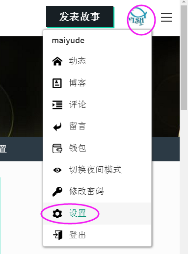
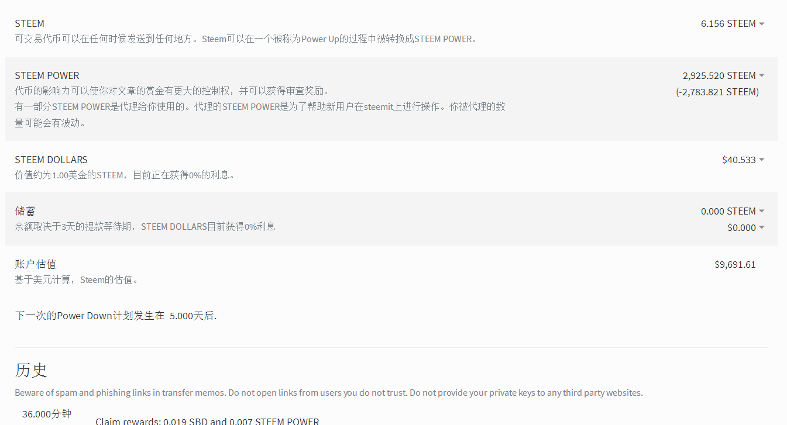
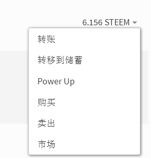
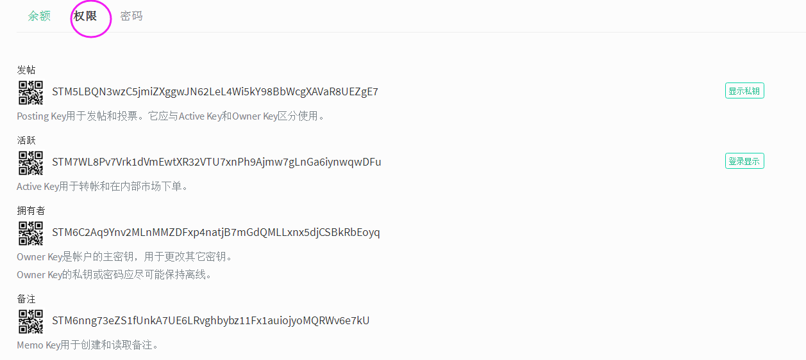

# (PART) 初级篇 {#cjp .unnumbered} 

# 新手第一步 {#xsdyb}
## 浏览 steemit 网站 {#ll_steemit_wz}
小雅在朋友的介绍下来到了Steemit。

steemit是什么？其实小雅也没搞明白，朋友对她说了很多，很多区块链，什么去中心化，什么未来趋势云云，但是小雅一句都听不明白。但是朋友说的话有一句话小雅听明白了，就是在Steemit写文章可以赚钱。写文章可以赚钱？那自然是好事。于是小雅就在朋友的介绍下登陆了steemit。

steemit给小雅的第一印象是一个乱糟糟的博客，而且还是全英文的。虽然小雅英文水平还算可以，但是如果有中文支持她会更开心。小雅随便看了看首页的文章，发现大多都是全英文的文章，偶尔才有一两篇中文的文章出现。

难道在这里的都是外国人？在这里写文章要用全英文吗？抱着一大堆的问号，小雅点击了注册新账号按钮。

## 注册 steem 账号 {#zc_steem_zh}
小雅有点烦躁，因为她在注册Steemit账号遇到了难题。

这是她见过的注册账号最不友好的社区。她从来没有想过注册一个账号会是那么麻烦的一件事情，她甚至萌生了永远不登陆这个网站的想法。

首先这个网站的浏览速度超级慢，至少在中国访问的速度是超级慢，她感觉回到了拨号上网的时代。其次，注册个账号居然需要翻墙来收取验证码。天啊，她一个小女生哪里懂得翻墙这些高科技的事情啊。

好不容易在朋友的帮助下翻了墙，又专门去注册了一个Gmail的邮箱用来收取验证码，按照步骤一步步的完成注册。忙完这些，她发现刚注册的账号居然还不是马上生效，还要等待官方把你的账号激活，这个过程一般是1-7天左右。

小雅很是抓狂，终于在第三天的早上，她终于收到了官方发来的邮件，她的账号正式开通了。

虽然历经波折，但是小雅的Steemit之旅正式开始。

## 登录和保存密码 {#dlhbcmm}
小雅好不容易注册好了steemit账号，终于可以开始她的steemit之旅了。

她首先按照网站的说明把那长达二十多位的密码抄了在一个小本子上。网站上一再提示这个密码非常的重要，遗失了几乎不可找回，这让小雅有点心惊。因为小雅忘记的账号密码不计其数，忘记的概率远远大于被盗的概率，很多久不登陆的账号她都是通过重设密码才找回的，这个网站的密码不可找回让她有点担忧。小心驶得万年船，她把密码抄了下来，又在加密的云盘上保存了一份，她想着这样应该不会忘记了吧。

忙完密码的事情，她寻思着如何装修一下自己的个人主页。

## 设置个人基本信息 {#szgrjbxx}[作者：@maiyude]
小雅掉进了自己账号的设置页。

Steemit的各种设置和博客有点类似，虽然小雅的博客随着微博微信的兴起荒废多年了，但是小雅以前可是一个博客迷呢。

首先要设置的是头像，小雅打算使用她在微信用了多年的头像。但是她马上就遇到了一个难题，她找不到上传头像的地方。经过一番摸索，原来只要把头像图片的网址复制到设置页就可以了。原来那么简单，小雅暗暗嘲笑自己的愚蠢。

接下来小雅填写了一些自己的基本信息，然后继续设置自己主页的banner，因为图片尺寸的问题，小雅在这花了很长的时间才完成。终于弄完这些基本设置，小雅顿时松了一口气。

小雅还看见设置里面还有钱包的选项，里面有各种货币和选项，在账号安全里面还有好几个不同种类的密码。这些没设置过没见过的选项让小雅有些头疼，她决定暂时不管，日后慢慢研究，现在先发帖再说。

****
相信很多新人初来Steemit的时候，都会对里面的设置界面一头雾水，下来的教程将会教大家一步步认清所有设置的作用，帮助你完成设置个人基本信息。

我们点击右上角自己的头像，然后点击设置，即可进入设置界面。

下面我们来根据下图一步步讲解所有设置的作用。

- 1.选择语言：这里可以设置Steemit的语言，请根据自己习惯使用的语言选择。

个人头像的网址：这里是设置头像的地方，头像是别人对你的第一印象，设置很简单，只要把头像图片的网址复制上去即可。这里建议可以新建一个帖子，把你头像的图片上传，再把网址复制过来即可。

- 2.封面图片的网址：这里是封面图片设置的地方，如同箭头所示，是你主页头部标题栏的背景图片。为了各种分辨率以及各种设备都能正确显示，建议使用图片大小为1900*200 px。

设计封面图片的注意如下：

图中绿色区域为自由区域，红色区域为文字显示区域。

请设计图片的时候不要使用太花俏的背景，以免文字显示效果差。文字区域文字颜色为白色，所以红色区域在设计的时候注意不要使用白色背景，这样文字会看不见。

- 3.显示名称：显示在你主页上的名称，不同于ID，这里支持任何语言包括中文。

-4 .关于：这里是你的个人简介，请简明扼要的介绍你自己。

-5.位置：这里填写你的坐标，方便同区域的朋友找到你。

-6.网站：这里可以填写你的个人主页的地址。

-7.显示私人文章设置：不适合在工作时显示的(NSFW)内容。在Steemit，带有色情、暴力等儿童不宜的内容会打上NSFW，默认是隐藏的，你可以在这里自由的设置显示还是隐藏。

以上就是设置界面的全部内容，接着我们介绍钱包界面，点击进入钱包后，我们会看到这样的界面，下面我们来一个介绍。

- 1.STEEM:这里显示你账户steem余额，点击余额的数字会出现菜单。

转账：转账给别的用户。

转移到储蓄：转移到储蓄账户后需要3天的时间才可以取出，一定程度保障你的资金安全。

Power Up:将Steem转化为Steem Power（SP），转换比例是1:1，转化为SP是即时的，但是SP转化为STEEM需要13周，请谨慎操作。

购买：将跳转至blocktrades，可以使用其他虚拟货币购买STEEM。

卖出：将跳转至blocktrades，可以使用将STEEM转化为其他虚拟货币。

市场：内部市场，可以进行SBD和STEEM的买卖。

- 2.STEEM POWER:右侧数字为你的SP的数量，括号内的数字为代理的SP数量，关于代理详见后文 关于SP代理的一切一文。此处数字为2925.520，括号为2783.821，意思为总SP数量为2925.520，代理给别人的数量为2783.821，既实际SP数量为2925.520-2783.821=141.699。同样点击数字会跳出菜单。

Power Down：将SP转化为STEEM的选项，全部转化需要13周的时间，Power Down期间SP的投票权不会丧失。

购买：将跳转至blocktrades，可以使用其他虚拟货币购买SP。

Cancel Power Down：点击Power Down后才会出现的选项，可以随时取消Power Down。如果你没有进行Power Down但是出现此选项，请注意你的账号密码是否已经泄露。

- 3.STEEM DOLLARS:显示你STEEM DOLLARS（SBD）余额的地方，点击数字后同样会出现菜单，选项功能同上文所述，不再重复。

- 4.储蓄：可以将steem或者SBD转移到此处，储蓄取出需要3天的时间。把多余的钱存在储蓄可以一定程度上保障你的资金安全，因为某些原因，储蓄几乎没有利息。

- 5.账户估值：你的账户所有STEEM和SBD的总价值估计。

下面界面为账户的资金往来历史，如果有异常的转账行为，可能是你的账号已经泄露，请注意安全。

接下来介绍下一个界面：权限

此处显示你账号的4种密码，具体作用功能描述请看后文：关于密码的一切。

最后点击剩下的最后一个界面：密码

此处是修改密码的界面，不过多阐述，但是请注意修改密码前后牢记密码，修改前后的密码都要牢记。

全部界面介绍完毕，祝你的Steemit之旅愉快。

## 第一帖 {#dyt}
小雅准备在steemit写自己的第一篇文章。

她点击了发帖的按钮，之后弹出来的界面让小雅有点惊讶。这是她见过最简陋和功能最少的界面，整个界面几乎全是空白，她想找个插入图片的按钮都找不到，更别说调整字体大小等功能了。

应该是自己不懂用法而已，慢慢摸索吧。小雅心里这么想着，决定日后再一步步探索各种功能，现在首先考虑第一帖写点什么。

不如就写个自我介绍吧？一个好点子突然从脑袋里蹦了出来。说干就干，小雅花了一个小时精修了自己的自拍照，然后认真的写了一篇简短有趣的自我介绍。

文章写完，小雅认真的检查了一遍，然后按下了“发布”的按钮，大功告成。

接下来就是等着别人给自己点赞了，会有多少人给自己点赞呢？小雅满怀期待的等待着。

## 延伸阅读：steem 的魅力 {#steemdml}

