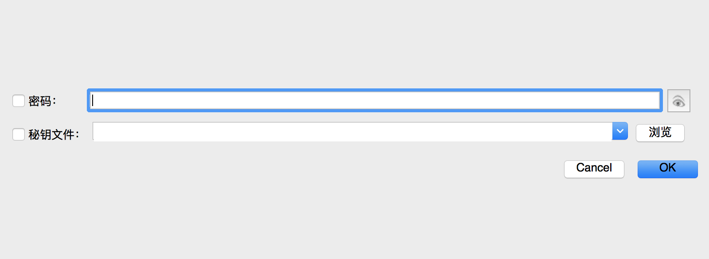
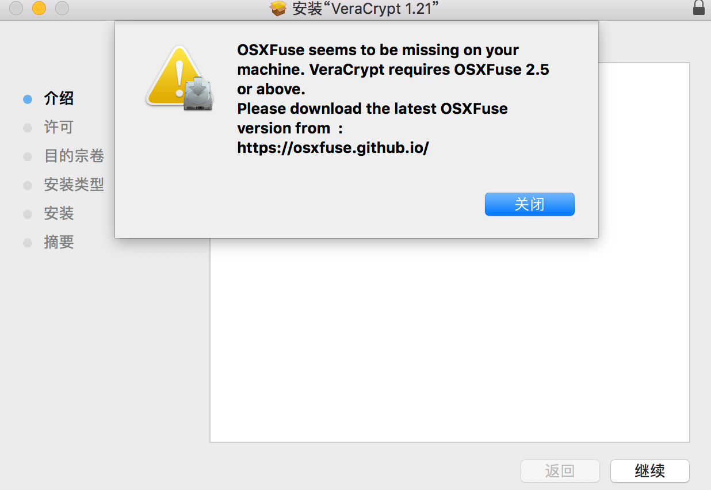
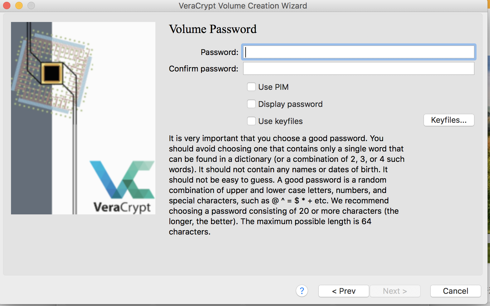

# (PART) 初级篇 {#cjp .unnumbered} 

# 新手第一步 {#xsdyb}
## 浏览 steemit 网站 {#ll_steemit_wz}
小雅在朋友的介绍下来到了Steemit。

steemit是什么？其实小雅也没搞明白，朋友对她说了很多，很多区块链，什么去中心化，什么未来趋势云云，但是小雅一句都听不明白。但是朋友说的话有一句话小雅听明白了，就是在Steemit写文章可以赚钱。写文章可以赚钱？那自然是好事。于是小雅就在朋友的介绍下登陆了steemit。

steemit给小雅的第一印象是一个乱糟糟的博客，而且还是全英文的。虽然小雅英文水平还算可以，但是如果有中文支持她会更开心。小雅随便看了看首页的文章，发现大多都是全英文的文章，偶尔才有一两篇中文的文章出现。

难道在这里的都是外国人？在这里写文章要用全英文吗？抱着一大堆的问号，小雅点击了注册新账号按钮。

## 注册 steem 账号 {#zc_steem_zh}
小雅有点烦躁，因为她在注册Steemit账号遇到了难题。

这是她见过的注册账号最不友好的社区。她从来没有想过注册一个账号会是那么麻烦的一件事情，她甚至萌生了永远不登陆这个网站的想法。

首先这个网站的浏览速度超级慢，至少在中国访问的速度是超级慢，她感觉回到了拨号上网的时代。其次，注册个账号居然需要翻墙来收取验证码。天啊，她一个小女生哪里懂得翻墙这些高科技的事情啊。

好不容易在朋友的帮助下翻了墙，又专门去注册了一个Gmail的邮箱用来收取验证码，按照步骤一步步的完成注册。忙完这些，她发现刚注册的账号居然还不是马上生效，还要等待官方把你的账号激活，这个过程一般是1-7天左右。

小雅很是抓狂，终于在第三天的早上，她终于收到了官方发来的邮件，她的账号正式开通了。

虽然历经波折，但是小雅的Steemit之旅正式开始。

## 登录和保存密码 {#dlhbcmm}
小雅好不容易注册好了steemit账号，终于可以开始她的steemit之旅了。

她首先按照网站的说明把那长达二十多位的密码抄了在一个小本子上。网站上一再提示这个密码非常的重要，遗失了几乎不可找回，这让小雅有点心惊。因为小雅忘记的账号密码不计其数，忘记的概率远远大于被盗的概率，很多久不登陆的账号她都是通过重设密码才找回的，这个网站的密码不可找回让她有点担忧。小心驶得万年船，她把密码抄了下来，又在加密的云盘上保存了一份，她想着这样应该不会忘记了吧。

忙完密码的事情，她寻思着如何装修一下自己的个人主页。

## 登陆和保存密码 [作者：\@vickylin 编辑：\@vickylin]

登陆过程比较简单，这里不做冗述。值得一提的是，注册时提供的是master password，首次登陆后，把posting key和active key保存下来后，再也不要用该密码登陆。在日常使用中，我们可以用posting key来发帖、点赞、回复，用active key交易、转账。

关于密码的保存，我个人会使用种方法：**密码管理器、加密盘、硬盘和纸质**。

### **硬盘/U盘**

如果你选择这个办法，最好找个硬盘/U盘专门做保存密码所用，其他文件一概不放入，并且平时做好杀毒工作。

### **纸质**

有些人可能会嘲笑这种最原始的做法，心想着什么都往电子化数据化的年代，哪还有人拿纸笔记录下这一切。在丢失密码的那几天，我曾去请教过一位大神，他是如何保存重要密码的。他笑着说：
> 我用小本子记下来呀。

因而，无论你通过数据化的方式做了多少备份，重要密码纸质的一定要有一个，无论是手抄还是打印，然后放在一个安全且你绝对能想得起来的地方妥善保管。

### **密码管理器**

现在市面上比较主流的是1Password、keepass和lastpass等。当然，如果你要讲我把密码记录在word、excel或者note里面，那我们可能不在谈论一件事情。lastpass我没有用过，主要谈谈另外两种。

1**Password**

这是我接触的第一个密码管理器，界面非常简约好看，操作上也无任何问题。如果产生疑问，可以发邮件给他们的客服，客服人员非常认真负责，会尽可能的去帮助你。当然，因为其公司在加拿大，故而会有时差，一般来说你今天发的邮件第二天可以收到回复。个人使用过程中没觉得有什么缺点，一定要讲的话，就是贵。

1Password是采用一次买断和订阅式的。如果你打算长期一直用下去的，推荐买断，听朋友说大概是五百多。订阅的话是一个月27元rmb（在网页版登录后有看到2.99$/mon，但需要绑定信用卡，需要输入信用卡CSV码，个人觉得不是很安全放弃了）。另外，windows和mac是要分开购买的，也就是说一个账户无法跨平台使用。

使用1Password的朋友们务必记得以下三点：

1. 注册完以后，记得把emergencykit保存好，里面涵盖了用户名及secret key，你也可以打印出来，手写上master key然后找地方放好；

2. 登录主界面（可选择指纹解锁的那个界面）的密码，并不一定是你的master key，所以这两个密码如果不同，请务必记清楚；

3. 可以的话，请在两个设备登录。如果你不小心在一个设备登出（log out）但是不记得密码，另外一台设备也许可以挽救这一切。

**Keepass**

朋友说，KeePass的缺点很明显，那就是没有浏览器插件，不论是注册还是登陆都要在软件内复制过去。个人觉得这个缺点其实还好，毕竟大部分情况下我们在使用个人电脑的时候，都会选择让浏览器记住密码。一定要讲缺点的话，可能就是界面不如1P来的美观。优点也是显而易见的，它是一个完全免费的开源软件。

下载

[官网](https://keepass.info)我下载的是keepassX。下载好以后直接拖进application即可，因为我用的是macos系统，下面截图演示就是Mac情况下的界面，windows也差不多。

安装及使用

打开软件后点击左上角数据库---新建---输入主密码，确认以后进入这个界面

点击添加按钮，如下图，就可以开始填写/生成密码了，OK以后按保存即可，会形成一个文件（有点类似word保存以后形成的文件）。

以后无论点击这个文件，还是keepass的图标，都可以打开这个界面。建议大家输入密码的时候可以把可视选项打开，以免输入的时候错误。

移动端

我试了keepass touch和mini keepass，个人觉得没什么太大的差别，就用了前者。目前还没有弄好dropbox自动同步，解决方法是将keepass.kdbx的文件丢到dropbox，打开dropbox然后选择用keepass打开即可。在数据库没有更新的情况下，基本打开过一次，这个数据库以后就可以直接在keepass touch里面打开了。

### **加密盘**

在前阵子经历密码丢失后，我这段时间都在各种备份自己的数据。目前我采用了四种方法：keepass+1Password+dropbox+纸质版。强迫症大爆发的情况下，又研究了如何在本地放一个加密盘的方法。

对于用户来说，考虑加密软件主要会从安全性、是否免费及是否多平台，那这些Veracrypt都具备了。VeraCrypt 的前身是 TrueCrypt（2010年有报道称，FBI也无法破解TrueCrypt加密的文件），由于后者被 Google 爆出严重的安全漏洞，这才诞生了 VeraCrypt。同时也说明了，VeraCrypt 具有更高级别的安全性。

下面我们就来看看如何使用**VeraCrypt**：

安装与设置

1、首先在[官网](https://www.veracrypt.fr/en/Downloads.html)下载；

2、下载完后双击图标，进行安装；

3、如果出现以下界面，按照提示，前往[Fuse](https://osxfuse.github.io)下载安装驱动。然后就可以安装VeraCrypt，一路下一步即可；

加密数据步骤

1、接下来创建加密卷，一般都是默认的选项，下一步即可；

2、根据要加密的文件设置加密盘的大小，如果只是保存密码的话，一般1M就够了；

3、然后设置密码（我没有使用秘钥文件，听说比较麻烦）。格式化完成后，确定并退出。这个时候你会看到已经加密好的文件，它没有后缀，也无法打开。

解密数据

1、选择加密盘的所在位置，点击加载。如此就可以打开加密盘，可以任意读取盘内的内容，也可以把想要加密的东西丢进去；

2、看完以后，务必点击卸载。这时候，此盘就重新加密，除了有密码的情况下都无法打开；

注意

1、加密盘的文件名不要随意更改，我测试过，改过文件名的，软件可能会无法打开，出现密码错误的字样；

2、放入文件的时候注意文件大小，不能超过设定的磁盘的大小。

## 设置个人基本信息 {#szgrjbxx}
小雅掉进了自己账号的设置页。

Steemit的各种设置和博客有点类似，虽然小雅的博客随着微博微信的兴起荒废多年了，但是小雅以前可是一个博客迷呢。

首先要设置的是头像，小雅打算使用她在微信用了多年的头像。但是她马上就遇到了一个难题，她找不到上传头像的地方。经过一番摸索，原来只要把头像图片的网址复制到设置页就可以了。原来那么简单，小雅暗暗嘲笑自己的愚蠢。

接下来小雅填写了一些自己的基本信息，然后继续设置自己主页的banner，因为图片尺寸的问题，小雅在这花了很长的时间才完成。终于弄完这些基本设置，小雅顿时松了一口气。

小雅还看见设置里面还有钱包的选项，里面有各种货币和选项，在账号安全里面还有好几个不同种类的密码。这些没设置过没见过的选项让小雅有些头疼，她决定暂时不管，日后慢慢研究，现在先发帖再说。

## 第一帖 {#dyt}
小雅准备在steemit写自己的第一篇文章。

她点击了发帖的按钮，之后弹出来的界面让小雅有点惊讶。这是她见过最简陋和功能最少的界面，整个界面几乎全是空白，她想找个插入图片的按钮都找不到，更别说调整字体大小等功能了。

应该是自己不懂用法而已，慢慢摸索吧。小雅心里这么想着，决定日后再一步步探索各种功能，现在首先考虑第一帖写点什么。

不如就写个自我介绍吧？一个好点子突然从脑袋里蹦了出来。说干就干，小雅花了一个小时精修了自己的自拍照，然后认真的写了一篇简短有趣的自我介绍。

文章写完，小雅认真的检查了一遍，然后按下了“发布”的按钮，大功告成。

接下来就是等着别人给自己点赞了，会有多少人给自己点赞呢？小雅满怀期待的等待着。

## 延伸阅读：steem 的魅力 {#steemdml}

