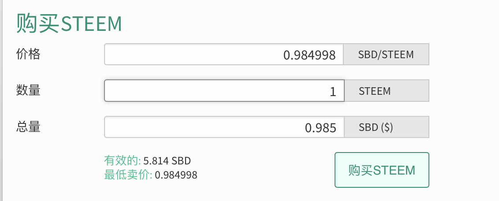
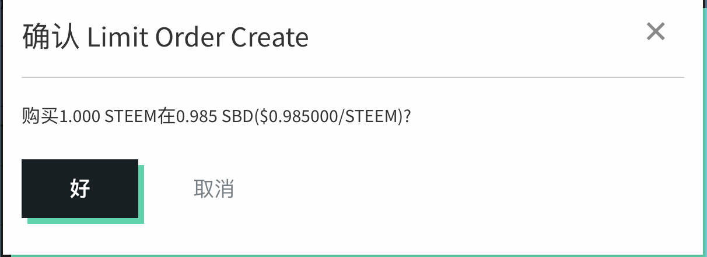
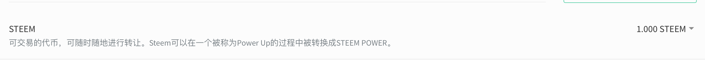

# 基本常识 {#jbcsp_}
## 什么是 steem {#sms_steem}
## Steem 上的各种钱 {#steem__sbd_h_sp_steem_sdgcq}
## 关于声望的一切 {#gwqwdyq}
## 关于文章收益的一切 {#gwwzsydyq}
## 关注、点赞、拉黑、踩灰 {#ysyd_gz_dz_lh_ch}
## 类目和标签 {#lmhbq}
## 大鲸和小鱼 {#djhxy}
## 机器人和小号 {#jqrhxh}
## 禁忌和审核 {#jjhsg}

## **延伸阅读：如何power up [作者：\@vickylin；编辑：\@vickylin]** 

对于已经在steemit待了七天以上的朋友来说，理论上有第一笔作者奖励已经入账，那么我们的账户中就会有sbd。对我来说，看到价格合适的情况下就会选择用sbd买入steem再power up，大家可以根据自己的具体需要决定。

登陆主页——钱包——STEEM DOLLARS——市场

进入市场后，界面如下：

在左边购买steem表单中，填写入想要购买的心理价位及数量，点击购买steem；

提示“确认Limit Order Create”，点击“好”；

输入active key，点击登录

下单成功后会在左下角提示如下：

如果挂单价格合适的话，订单将会撮合成功。返回钱包，在第一栏中便可查询到刚才购入的steem；

点击右侧三角形下拉箭头，选择power up，填入此次想要power up的量，按确认即可。

