# 基本常识 {#jbcsp_}
## 什么是 steem^[作者：\@wang-peilin；小故事：\@maiyude；编辑：\@dapeng]
小雅的第一篇文章发出去之后，只有寥寥几个人给她点了赞，收益也只有可怜的0.03美元，这让她有点失望。


不过她很快就从失落中走了出来，自己还只是个新人嘛，没人关注是很正常的事情，加油写文章就是。

她转而研究steemit里面的各种钱。她发现这里居然同时存在三种钱，分别是steem,steem power（sp）,Steem Dollars（SBD）。为什么一个社区内会同时存在三种钱啊？这让小雅很是困惑，这就感觉像是市场上同时流通三种人民币的感觉，初次接触区块链的小雅完全搞不懂。

不过让小雅感到更为困扰的事情是，自己所有的钱币都是0，这让小雅顿时失去了研究这些货币的兴趣，默默的继续写文章去了。
****
相信很多人来到steemit都是和小雅一样一脸的困惑，下面就来简单的介绍一下什么是steem。

- 1.前言

什么是Steem？新人朋友们看到这个标题可能会有点摸不着头脑，Steem不就是在Steemit.com上使用的一种货币吗，还用单独列一个章节出来讲解？会这样想主要是存在一定的误区，因为Steem其实有两个含义，一个是Steem区块链，另一个则是在这个区块链上使用的一种货币。为了方便区分，我们暂且把第一个含义叫做Steem链，第二个含义叫做Steem币吧。而我们大多数朋友都是通过Steemit.com上最先接触到Steem链的，所以我们下面单独讲解一下Steemit.com吧。

- 2.Steemit.com

Steemit.com是由Steem区块链的官方开发者建立的一个网站，在这个网站上我们可以读取到Steem链的内容。在Steemit.com上我们使用Steem币来奖励那些发布文章或点赞文章，以及发布图片和评论的用户。和博客、QQ空间、微信类似，用户可以发贴，评论。不一样的是，Steemit会给你奖励，激励你发布更多更好的文章。Steemit.com也是想最终发展成一个聚集时尚、经典、阅读、热点和流行的平台。

- 3.其它接入Steem链的网站

除了Steemit.com外，我们还可以通过Busy、eSteem、ChainBB、Utopian.io、Steepshot、Zappl、DTube、Dsound、Dlive、Dmania等各类网站输出或输入Steem链上的内容。就好像以前我们使用的光盘，我们不仅能在DVD上播放光盘的内容，还可以在EVD甚至有光驱的电脑上播放这个光盘。最重要的内容就存在这小小的光盘上。那么我们要问这么神奇的Steem链，究竟是什么呢？

- 4.Steem链的本质

Steem区块链采用的是跟Bitshares一样的石墨烯(Graphene)区块链技术，其共识模式是DPoS，Delegated Proof of Stake，大致上说，就是由持股者按持股比例投票选出代表(Witnesses)来维护、验证区块链网路 （ 简单对照比特币是PoW，藉由算力来决定共识之产生）。

区块链很多，甚至DPoS类型的也有一些，重点在于Steem链的特色是什么？你可能说是内容链平台。这么说也没有错。帮你更精确地说，是内容上链，持股者按照权重，可以决定按照机制设计好的新增代币，要如何分配到各见证人(Witnesses)、持股者(SP holders)、内容创造者(authors)以及内容发现者(curators)身上。当然，大部分是分配给内容创造者的。新增代币分给后二者部分称为奖励池(Reward Pool)，目前是累积七天，动态发给，各持股者以vote形式(正负两种)来进行权重投票，七天后结算。

虽然Steem链是机器无感的，但在上面运行的东西是活的，是被人赋予意义的。我们可以说Steem链是一切的根本，是Steem世界万物之依归。而我们来自世界各地的广大用户则依托Steem链,创造了缤纷的Steem世界。

## Steem上的各种货币^[作者：\@wang-peilin；编辑：\@dapeng。本文部分引用自\@rivalhw的文章]
### 概述

在Steem区块链上我们使用3种货币，Steem，SBD(Steem Dollars)，SP(Steem Power)**（注：严格意义上讲SP不能算作一种货币，因为它不能随意流通和交易，这里把它归为货币主要是为了方便理解，具体请见下文SP的单独讲解）**。为什么一个区块链上要使用三种不同的货币呢？这主要是因为它们被赋予不同的权利，拥有不同的功能，下面我们依次介绍。

### Steem

Steem是Steem区块链上的基础货币，另外两种币都跟它相关。你可以通过在Steemit.com，cnsteem.com等网站上通过写文章，评论或点赞来获得它。你可以在任何时间存入，取出或者与其它持有者交易Steem。Steem可以通过一个叫Power up的过程转化为SP(Steem Power)。

### SP(Steem Power)

如上文所述，SP是Steem通过Power up的过程获得的。顾名思义，你的SP越多，你在Steem社区上的影响力就越大，你的SP越大你的点赞就越可以得到更大的收益。具体来说，按本文编辑时的实时行情，如果你有10000SP，那你的一个点赞最多可以产生 $2.8 左右的收益。而实际收益其实远大于显示收益，显示为 $2.8 的收益实际上大概相当于7.7美元(具体原因请看下面SP的介绍)。那既然SP这么有用，为什么不把Steem全部转为SP呢？这是因为SP缺乏流动性，不能随意取现及交易。如果我们想把SP卖掉，则需要进行一个Power Down的过程，将SP转化为Steem再进行交易。而整个Power Down的过程每周只能将你持有的13分之1的SP转化为Steem，所以当您有了一些Steem后，还是要具体情况具体分析要把自己多少比例的Steem转化为SP。

### SBD(Steem Dollars)

SBD初衷是设计来1：1兑换美元的，官方现在也是把1SBD固定视为1美元的。但实际上它的市场价格却是像Steem一样波动的，现在1SBD的市场价远大于1美元。这也造成了文章作者获得的实际收益远大于显示收益。以上文所说显示收益 $2.8 为例，实际收益为1.4个SBD和价值为1.4美元的SP，而按本文编辑时的市场价格，1个SBD约等于4.5美元，所以实际收益应为4.5x1.4+1.4=7.7美元。

### 怎么获得这些货币

作者在发文章之后，按照Steemit的规则，7日后文章将被锁定而且无法修改(区块链永久不可篡改性)，同时进行该帖的结算，并根据作者发帖时的设定进行Steem和SBD的奖励。如果作者选择50% 50%，系统会将奖励分为两部分，一部分作为SBD奖励，另一部分作为SP奖励；如果作者选择发帖时power up 100%，则系统将会将奖励全部按照SP进行power up。当然你也可以通过交易所或其它货币持有者交易来获得这些货币。

### 总结

Steem上的货币是相互依存，息息相关的，新手朋友光看这些文字可能还是不能完全理解。如果你想投资进来我建议可以先投资一小部分自己实际操作一下，完全搞清楚这里面的各种关系后再决定是否大力投资。

## 关于代理SP（steem power）的那些事^[作者：\@maiyude；校对：\@meixia]

在上一节，我们学习了关于Steemit的里面几种货币的知识。我们了解到了SP(Steem Power)在Steemit的重要性。这里我们再扩展说一下SP的扩展应用——代理SP。

SP非常的重要，日常的发帖或者直接购买都可以增加你的SP。那么，当我们的SP有一定程度的富余的时候，除了点赞外，我们还有什么办法更好的使用掉这些富余的SP呢？或者我想要快速的获得更多的SP，有什么办法呢？

这个办法就是代理SP。

什么是代理SP呢？简单来说就是把你的SP借给别人使用。说到借东西给别人，很多人可能会有点忌讳，生怕有借无还，何况SP在Steemit社区那么的重要，自己用都不够呢，为什么要借给别人？

这里首先我们了解一个很多人都关心的事情，我们代理给别人的SP安全吗？

答案是非常的安全。你把SP代理给别人后，别人只拥有这些SP的使用权，但是这些SP还是安全的躺在你的钱包里面的，你可以随时的收回，不过收回的过程通常需要7天。代理SP给别人后，你的钱包界面的SP后面会有一个小括号，比如我的钱包的界面，后面显示了-2552.794STEEM,这说明我代理了2500多SP给别人。

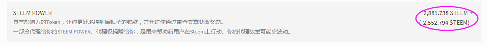

了解了最关心的安全问题后，我们又有新的疑问了。为什么我要代理SP给别人？我自己都不够用呢。

代理SP给别人主要有几个用处：

1.代理SP给新人：代理SP给新人可以很好的帮助新人发展。比如有些应用就得到了官方的大量SP代理，这样这些第三方应用就能更好的发展了。

2.代理给点赞机器人等获取收益：比如代理给\@justyy可以每天获得利息，代理给\@cnbuddy可以获得点赞等。

3.出租SP给别人获取收益：出租SP在Steemit已经是一个非常常见的行为了，如果你有富余的SP，不妨可以考虑出租，这可以给你带来一定的收入。著名的租借SP服务商有：\@minnowbooster等

4.账户资金避险：比如你可以把账户的钱分散到小号，再把SP代理给大号来分散资金风险。这样可以保证你的SP总量不变，但是SP分散到了几个账号，这样即使遇到了最坏的情况，账号被盗且无法找回，丢失的也只是一部分资金，可以减少损失。

5.作为奖品：可以代理一定量SP给某人作为奖品。比如我想要举办一个活动，但是目前我囊中羞涩，而且我也不太想用真金白银的SBD或者STEEM作为奖励，这时候可以用代理100个SP一个月的时间作为奖励，花掉自己未来的收益作为奖励，这或许是未来活动的一个发展方向。

6.暂时没想到，欢迎补充。

可见，代理SP的作用是非常多的。比如一个新人刚来到Steemit社区的时候，如果能够获得大鲸代理的一些SP，那这位新人初期升级的速度会非常快，这对新人的帮助是非常大的。

这里着重说明一下代理给\@cnbuddy或者\@justyy的好处。

首先是\@justyy的YY银行，只要代理SP给他，他会每天按照比例转账SBD给你。每天就算不发帖都能躺着收钱，多好的事情对吧，而且还会获得\@justyy的十几个机器人群的点赞，简直是一本万利的事情。

其次是代理给\@cnbuddy，代理给\@cnbuddy之后，可以获得机器人给予的相当于你代理SP的好几倍的点赞。这会比你自己的点赞更加有效率并且不消耗你的Voting Power，这可以有效的提高你的收益和增快你的升级速度。如果你是一个勤于写文章的人，代理SP给\@cnbuddy是一个非常好的选项。

作用都明白了，那么如果我想要代理SP给别人，应该如何操作呢？我们这里以代理SP给点赞机器人\@cnbuddy为例说明。
要想代理SP给别人，需要使用\@justyy开发的小工具，[点击这里可以跳转](https://helloacm.com/tools/steemit/delegate-form/)

这个工具需要通过steemconnect授权，所以不用担心安全的问题。

下面介绍详细的用法，我们首先点击进入这个工具的页面。


如同上图所示，第一栏填写你的ID，第二栏填写被代理者的ID，第三栏填写代理的SP数量，然后点击绿色的按钮即可。之后会跳转到steemconnect授权页面，需要你的active Key授权。

那么我要如何收回我的代理呢？只要在第三栏代理数量那输入0即可。收回需要7天的时间，这7天你无法使用你的SP。

这里再稍微介绍一下这里的SP填写规则，代理的SP以最后一次填写的为准。什么意思呢？我这里举几个实例来说明。
1：我要代理1000SP给cnbuddy，那我们填写1000即可。
2：我已经代理1000SP给cnbuddy了，现在我要追加代理200SP过去，那现在需要填写1200而不是200。
3：我已经代理1000SP给cnbuddy了，现在我想要收回300SP，那现在需要填写700。收回的300SP会在7天后返回你的账户，返回的过程没什么提示，请耐心等待。
4：我想要收回代理的全部SP，那填写0即可，同样7天返回。

代理操作完毕后，可能有部分人在一段时间后，会忘记了自己代理SP给过什么人，有什么办法可以查询吗？办法当然是有的，这里同样要使用到\@justyy的工具，请[点击这里跳转](https://helloacm.com/tools/steemit/list-of-delegatees/)

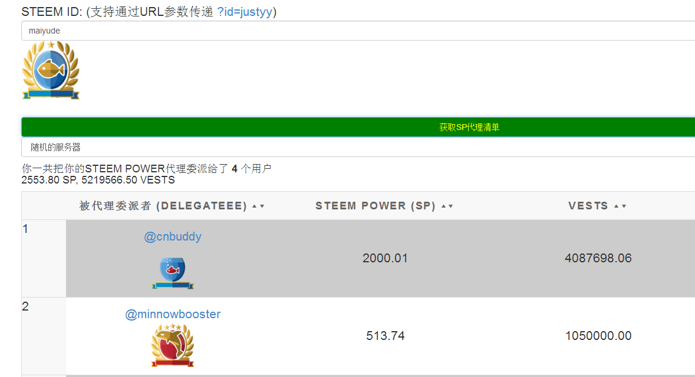

使用方法非常的简单，只要输入ID后就可以查询代理SP的清单。

\@justyy的工具还可以查询谁代理了SP给你，要是哪天你发现你多了几个SP，又不知道来源，可以使用这个工具查询，[点击这里跳转](https://helloacm.com/tools/steemit/list-of-delegators/)

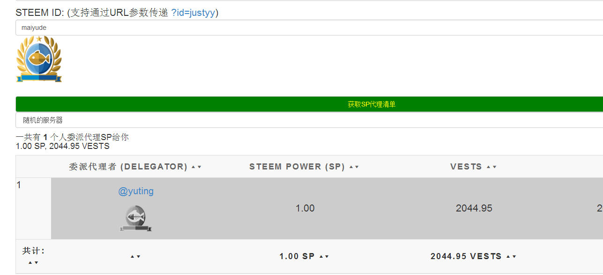

使用方法同样，输入ID即可。


总而言之，代理SP无论对自己还是对别人都是非常有用处的。所以还等什么呢？赶紧操作起来吧！

## 关于声望的一切^[作者：\@vickylin；小故事：\@maiyude编辑：\@vickylin]

小雅来到Steemit已经好几天了，文章也发了好几篇了。虽然点赞的人不多，每篇文章的收益也就零点零几美元，不过小雅也很满足了，因为自己已经慢慢开始熟悉这个社区了。

小雅今天发现了一个事情，就是自己名字旁边有个括号，里面写了一个数字。她记得刚来的时候这个数字是25，今天这个数字变成了26。这让她很是好奇，她把鼠标悬停了在数字上面，屏幕显示出了一行文字“这是小雅的声望分数，信誉评分取决于收到的投票历史记录，用于隐藏低质量的内容。”

“声望？这是什么？”小雅喃喃自语道。小雅把这个理解为类似等级的东西，只要自己好好写文章，这个等级会上升的吧。但是屏幕提示的最后一句话“用于隐藏低质量的内容”，让她有点不明白，难道这里的声望会出现负数？出现了负数后账号会被隐藏吗？

看来小雅需要学习的内容还有好多。  
****

对于新用户来说，可能会和小雅一样产生困惑，声望是什么？我们可以看到，登陆主页后名字边上的（25）就是声望，即Reputation。初始等级为25级，如果用户一些错误行为（比如：剽窃、伪原创等）或者有人恶意踩踏（downvote），会导致声望掉到0级甚至数值为负。

打个比方，声望相当于是你在steemit求学路上的一个结业证书，到达一个程度就发给你个证明。但这个证书，和你以后赚大钱关系不是很大（当然，有些机器人会偏爱声望高的用户给予点赞）。

一般来说，声望数值比作者声望数值低，踩没有影响。简单来说，一个25级的踩（downvote）30级的没有影响，而一个60级的踩55级的就会有影响。

对于新人来说，25-30级的时候升级的非常快。正常的互动下，一般一周内就可以达到。如果被大鲸点赞，甚至可以一下子到30级，但50级以后升级会非常慢。

在写这篇文章的时候，我找了很多过去前辈写过的关于该块内容的文章，看到以下这句：

> 你看那些占据STEEMIT首页的用户，声望分都那么高，点赞的人那么多，这样一来，再他们那就形成了一个良性循环，声望分高的人声望分愈来愈高，像我等声望分低的则永无出头之日。

也许对于SP来说，会有SP高的收益越来越高，大部分财富在少部分人手中流转的现象，但对于声望来说，它是“果”却不是“因”。

在前辈的文章中指出：

> 并不是声望分越高点赞对别人声望分影响越大，**影响声望数值的唯一因素就是投票产生的rshares**

> 除了区块链本身一些因素，rshares只跟投票（upvote）者的**有效SP、投票百分比、投票者当前Voting Power**有关。

有关“有效SP、投票百分比、投票者当前Voting Power”的解释，我将在另一篇**文章《Steem 指南》基础常识篇——关注、点赞、拉黑、踩灰**阐述。

想要知道当前自己的声望情况，可以关注微信公众号：steemit。在对话框中输入`@steemid`查询账户信息，比如：@vickylin

另外，给超过7天的帖子点赞，不会提高对方的声望，也不会让对方的收益增加，你自己也不会获得审查奖励，某些程度来说，还浪费了自己的Voting power。

## 关于文章收益的一切^[作者：\@wang-peilin 小故事：@maiyude；校对：\@meixia；本文部分引用\@tumutanzi、\@oflyhigh的文章]
今天是小雅来到Steemit的第7天了。今天发生了一件事情让小雅很是兴奋，那就是小雅收到了第一笔付款。虽然这笔钱只有可怜的0.015SBD，但是小雅还是很开心，因为自己的账户总算不是零了。

不过小雅因此产生了一个新的疑问，这里的收益是怎么计算的？自己收到的这笔钱是第一篇自我介绍的收入，她的那篇文章的收入是0.03美元。文章上写的是美元，但是发来的却是SBD和SP。而且这比例也不知道是如何换算的，0.03美元的文章换来了0.015SBD。小雅算了算，获得的SBD大概是美元价格除以2。但是自己还获得了零点零几的SP，这又是如何换算的？

小雅越算越烦恼，越算越不明白，最终她决定放弃计算收益，反正有钱收就好，算的那么明白干什么呢？

****
* 1.前言

  Steem因为基于区块链技术，拥有去中心化，躲避审查，内容不可篡改等优势，所以吸引来了五湖四海，世界各地的朋友加入。但我想现阶段大多数朋友跟小雅一样，加入Steem，还是因为想在这里发文赚钱。那么为什么在这里发文能赚钱呢？怎样才能赚更多的钱呢？文章的收益又是如何计算的呢？今天我们就来一起讨论下这个激动人心的话题。

* 2.作者收益和点赞收益

  我们在Steem上能获得的主要收益来源于点赞。你发表一篇文章，你作为作者，会得到收益。同样，为你的文章点赞的Steem用户也能得到收益。一篇文章的收益理论上会有75%分给作者，25%由所有点赞者按一定比例收取。但实际情况作者得到的收益往往大于75%，那么为什么作者得到的收益比例会往往大于75%，这就主要涉及到了早鸟惩罚。请看下文。

* 3.早鸟惩罚

  最初官方为了鼓励Steem用户发现优秀文章，就设计了一个点赞文章越早，得到点赞收益越多的规则。这本身是个很好的规则，但很多用户为了利益钻空子，就制造了很多点赞机器人，可以在文章刚发出来时就点赞文章，获得最大的收益。机器人获得的收益多了，那么自然认真发现优秀文章的用户得到收益就少了。为了减轻机器人抢赞造成的坏处，官方便设计了一个惩罚机制，太早点赞一篇文章则你本该获得点赞收益就会分一些给作者。极端情况下，比如文章发表三分钟内点赞，那么你所有的收益的点赞收益都会交给作者。随着时间的延长则交给作者的比例减小。直到30分钟后，你就可以获得你所有的点赞收益。所以实际上你发表一篇文章，有可能所有收益都归你所有，只要为你点赞的人都在你文章发表三分钟之内点赞。

* 4.点赞的时机

  那么既然早点赞有早鸟惩罚，那是不是就越晚点赞收益越多呢？也不是这样，因为点赞还是按照先点赞收益多，后点赞收益少的规则来的。再综合考虑早鸟惩罚的话，我们可以得出结论：

  *  一：3分钟之内不点赞

  * 二：30分钟后越早点赞越好

  * 三：3到30分钟之间任何时候点赞都可能得到最大收益，还是得具体情况具体分析。

  不过话说回来，如您正在仔细研究这篇文章，您应该是个刚加入进来的新人，SP应该不多，任何时候点赞差别不会太大，所以还是随意就好。

* 5.Steem来自哪里？

  当你点赞某人时，这个奖励不会从你的个人账户中扣除（这是一个很常见的误解）。你给别人点赞不会损失自己的Steem或者SP。你的点赞其实是打开了Steem的奖励池开关，每天都会有一批新的Steem被生产出来，我们称产生这些新Steem的为每日奖励池。

  新的Steem每时每刻都在被生产出来，奖励池是每天总的Steem通货膨胀产生的新Steem，现在每天都有成千上万的新Steem被生产出来（大概每天63000个，随着时间的推移，膨胀率会逐年下降）。你的点赞将分配掉一些新产生的Steem。

* 6.你点赞时发生了些什么？

  当你点赞时你实际上是在告诉Steemit区块链“我希望这一部分新产生的Steem到这里去”你能决定的数量取决于你所拥有的SP的数量。所以你拥有越多的SP,你就能决定越多的新产生Steem的去处。（你拥有的Steem和SBD不能决定新产生的Steem的去处）

  你可以在任何时候通过这个网站来查询你的投票能量：www.steemnow.com

* 7.点赞奖励

  点赞文章也是你获得新产生Steem的一个方法。简单地说，当一篇文章或评论的奖励被支付出去的时候，点赞该文章或评论的人也能获得一部分奖励。如果你为一个文章点了赞，你就帮那篇文章的作者获得了收益，你就因此得到了一部分点赞奖励。

  你从一篇文章中得到的收益取决于很多因素：这篇文章总共收益是多少，你在什么时机点赞的这篇文章，在你之前有多少人点赞这篇文章，投票权利（voting power）等等等等，如果不过多纠结于细节，下面的方法能作为你点赞的基本技巧：

  越早的对一篇有可能得到高回报的文章点赞，你获得的收益就可能越高。

* 8.为什么文章收益会变化：

  在Steemit上玩了一段时间的新人朋友也许会发现，自己文章的收益有时会有比较大的变化，可能今天的收益显示为$1，结果明天就变为$0.5，当然也有可能过几天又变为$2，那么是什么原因导致的这些变化呢？今天我们就来探讨一下。

  * 一.文章增加了点赞或减少了点赞

    这个是最显而易见的，有人为你的文章新增了点赞，你的文章收益就会增加；相反，如果有人取消了他之前的点赞，文章收益就会减少。

  * 二.文章被踩

    这个之前我不太清楚，为了实验效果试着踩了一下自己的文章，确实，如果你的文章被踩，你的收益也会降低，所以在这里请大家和谐一点，互相点赞，不要互相踩贴哦。

  * 三.Steem的市场价格

    由于文章收益其实来源于Steem通货膨胀产生的新的Steem和对应的SBD,如果近期Steem价格大降，而获得的Steem数量不变，反映到文章收益的数字也就跟着大降了。（SBD不用考虑，因为不管SBD市场价是多少，在文章收益中都是显示为1SBD对应1$。所以显示的文章收益主要与Steem市场价格有关。）

  * 四.近期Steemit总点赞量

    这个也许是被大家忽略最多的因素。要解释起来比较困难。我们可以用夸张的方法。假设在你发表文章以前7天全部Steemit用户都没有发表过一篇文章，那你刚发表完文章后就会显示你的这篇文章将获得所有这7天产生的新Steem，也许总价会是$100000。但如果你的文章发表后7天又有很多人陆续发表文章，那么他们将和你分摊这$100000,到了文章发表后第七天，你领取到了真实收益可能就不到$10了。　
　
    当然这个是很夸张的情况了，基本上不可能出现，大多数时候是可能近几天全球很多人发帖，点赞的人也很热情，那么你分到的收益就会减少一点，如果相反，你分到的收益就会增多一点。

* 以上为适合新人理解的精简版解释，如果你想了解文章收益变化的更多细节，请看下面更专业的解释：

* 文章的（显示）收益

  为了搞清楚这个问题，我们首先需要知道帖子的收益以及点赞金额是如何计算的。由于具体细则太复杂，我们这里大致说一下结论。

  帖子的(显示)收益 = 帖子的收益(代币) x 代币中间价

  在整个系统内部，帖子的收益是以代币进行核算的。也就是说，尽管我们看着每个帖子显示的预计收益100SBD、1000SBD，但是实质上系统内记着的是 20 STEEM、1000 STEEM，这样说可能不太严谨，我们接下来继续详解。

* 帖子的(显示)收益 & 奖励池

  那么这个代币又是如何计算的呢？这涉及到奖励池的概念：
  
   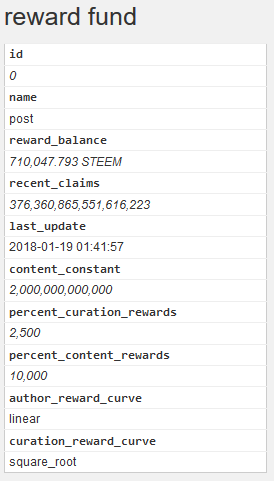
 
  比如上图就是奖励池的当前状态。

  在本贴中我们需要关注奖励池两点，一是奖励池余额，一个是最近申领总份额(rshares计算)。

  而我们帖子的代币收益：即为: post_rshares / rf['recent_claims] * rf['reward_balance']

  也就是说，按我们帖子被投票得到的总的 rshares占最近申领总份额的比例去分配奖励池的总奖金。

  所以，对于我们的帖子而言，影响代币收益变化有以下因素：

  * 帖子被投票获得的rshares

  * 奖励池总金额

  * 总的申领份额

  其中第二、第三点，我们几乎控制不了(SP高的可以通过踩人略加影响)，那么对我们而言，只有帖子投票的增减或者被Downvote才会有所影响。

* 什么影响最大

  那么你可能马上会有疑问，不对呀，我的帖子投票也没增加，也没人差评，为何显示的收益金额变化如此之大？当然了，如果收益增加了就无所谓了，但是减少了，终归不爽！

  让我们回头再看最初的公式：帖子的(显示)收益 = 帖子的收益(代币) x 代币中间价

  既然帖子的(代币) 收益变化不大，那么影响帖子的(显示)收益的主要因素当然就是代币中间价喽。
  
   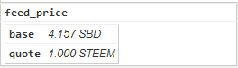
 
  这个喂价甚至有些时候高大7.x，那么想必你明白了，为何帖子价格变化如此之大了吧？

* 影响喂价的因素

  这里的喂价其实是来自见证人喂价的3.5天均价，至于这个均价是咋均的，这个具体情况比较复杂，但一般而言见证人的喂价是来自交易所的Steem价格。

  所以Steem涨，则喂价涨，反之亦然。不过因为是3.5天均价，比起Steem价格变化略为滞后。

* 总结

 帖子的(显示)收益 = 帖子的(代币)收益 x 代币中间价
 帖子的(代币)收益 = post_rshares / rf['recent_claims] * rf['reward_balance']
 代币中间价即为来自见证人喂价的3.5天均价，见证人喂价和交易所STEEM价格有关。


* 9.为什么要选择50%/50%文章收益分配方案 ？为什么很多时候文章真实收益远大于显示收益？怎么快速估算真实收益？

  很多刚加入Steemit的朋友刚刚有了一些基本的Steemit知识，发了几篇文章过后发现每篇文章的收益好像不太高。以我的一篇文章截图为例
  ：
   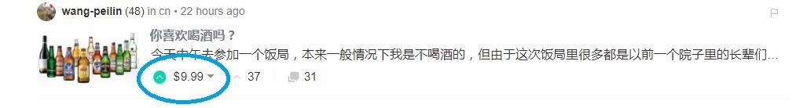
 
  如图所示，蓝色圆圈圈住的部分即为这篇文章的估算收益，显示是约 $10 ，按发文时的汇率计算大概是65元人民币，有些刚来的朋友每篇文章可能最多也就能得到 $1 左右，也就是6.5元。算不上很多的收益，于是他们可能就因此没有在Steemit长期发展，非常遗憾，因为他们不知道现在（此文发表时）他能从写文中获得的收益其实是远大于这个数字。这其中的原因比较复杂，主要是由于Steemit内部认定1SBD固定等于1美元，而现在（此文发表时）SBD市场价是一直浮动且远大于1美元的。那么我们知道现在真实收益远大于显示的收益，我们又该怎么计算自己的真实收益是多少呢？如果不太在意计算细节可以直接看下面得出的结论公式。

  获得SBD即可及时支配收益按人民币算约为：0.425x文章收益显示数字xSBD市场价格（单位为人民币元）

  获得SP收益即需要等待一段时间的收益按人民币算约为：2.75x文章收益显示数字（单位为人民币元）

  想详细了解计算过程的朋友可以继续往下看：

* 一.作者可以得到多少比例的文章收益？
  按Steemit基本规则，作者是可以拿到文章75%的收益，但为了防止机器人作弊，Steemit有一个额外规定：30分钟内点赞的点赞者会有一定比例的收益交给原作者。具体详情可见下图。
  
   
 
  如图所示，实际上作者获得的收益比例会大于75%，夸张点的情况，当所有点赞者都在3分钟内为这篇文章点赞的话，原作者可以获得100%的收益。根据我的经验，一般情况是获得85%左右的收益。为了方便，我们就以85%来计算。

* 二.我们选择怎样的收益类型？

  我们知道，一般情况下选择 50%SBD 和 50%SP 的收益类型会比选择 100% SP 的收益类型获得的收益高得多（具体原因请看下文补充阅读），所以我们这里就选择 50%SBD 和 50%SP 的收益类型来计算。以收益 1$ 为例，作者最终可以获得约1x（0.85/2）=0.425个SBD 按写文时的市场价1SBD=50人民币来看，大概可以获得约21.2元人民币的SBD收益。

  而获得的SP收益约为1x（0.85/2）=0.425美元，相当于约2.75元人民币。

* 三.SBD收益和SP收益的不同点

  由于SBD可以随时交易，而SP需要一周时间才能把13分之1的SP转为Steem进行交易。所以显示 1$ 的奖励大概可以得到21.2元人民币的可随时支配奖励以及2.75元人民币的需要时间才能交易的奖励。

* 四.结论

  由于SBD的价格波动不显示在Steemit上，而每 1$ 获得约0.425个SBD收益，所以

  获得SBD即可及时支配收益按人民币算收益约为：

  0.425x文章收益显示数字xSBD市场价格

  而SP收益即需要等待一段时间才能交易的收益约为：

  2.75x文章收益显示数字

  不过，这是在人民币兑美元汇率在6.5左右时可以做的简便计算，如以后汇率有大范围波动，再调整一下就好。

  所以按发文时1SBD为51.8元人民币来看，截图中 $10 的文章实际收益 大概有220元可随时支配收入加27.5元需等待一段时间的收入，远远大于显示收入，所以至少此文发表时在Steemit发文赚钱还是挺可观的，大家多多参与进来吧。

* 五.补充阅读，为什么要选择50%/50%文章收益分配方案

  最近的Steemit精明用户，几乎没有人再选择写文章时选择100% Power Up选项了，因为选择50%/50%的收入分配方案收入最大。

  这个差别有多大？不算不知道，差别很大。

  假如一篇文章收入作者应得100 SBD，按发文时Steem的官方价格，1 Steem 价格是 3.426 SBD：

  如果选择100%奖励方案，作者将得到 100/3.426=29.2 STEEM (Power)，按Bittrex上的价格，可以换得29.2x20＝583元人民币。

  如果选择50%/50%奖励方案，将得到 50 SBD，和50/3.426=14.59 SP，按Bittrex上的价格，可以换得50x60+14.99x20＝3299.8元人民币。

  不同的方案，同样的Steemit文章获取的人民币收益天壤之别！哪怕是再通过Bittrex将SBD换成STEEM，也会收获更多的Steem。

  这原因就在于STEEMIT系统内的Steem/SBD价格与市场上的价格严重倒挂。Bittrex交易所上STEEM/SBD之比是1/3，而系统内的STEEM/SBD之比是 3.426，Steem的价格过高，而SBD的价格严重过低！
  
    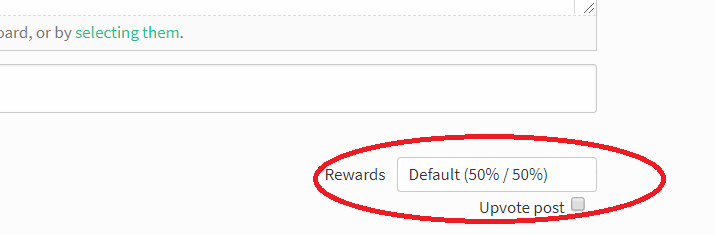
 
  所以我们可以确定，只要1SBD的实际市场价格大于1美元，我们选择50%/50%分配方案就会比100%分配方案更有优势。


## 关注、点赞、拉黑、踩灰[作者：\@vickylin 小故事：\@maiyude 编辑：\@vickylin]
收到钱让小雅很是开心，这大大的激发了她对Steemit的热情。她打开了网页，开始浏览别人的文章。

小雅对于给别人点赞从来不吝啬，基本上她看过的文章都点赞了。其中她觉得文章写的很有趣的人，她会点击“关注”，当然她更加希望别人会回关她。但是点赞的过程中她又产生了新的困惑，就是刚开始她点赞别人的收益会增加0.01美元，到了后来，就完全不增加了，这让小雅非常的困惑。不过小雅很快就抛开了这个困惑，想不通那就别想。

她还发现了文章上面有一个小旗子，她好奇地点了点，居然发现别人文章收益减少了。看来这个按钮是用来踩人的，自己没事别乱点这个按钮，以免得罪人了。

Steemit里面的门道真多，小雅觉得自己需要学习的地方真是太多了。
****
如果你像小雅一样对这里充满了困惑，请看下面的文章进一步了解steem。

#### 关注 Follow

新人一进入steemit，首先会困扰一个问题，我该如何关注别人？这里列出三种方法：

##### 1、进入别人的主页

首先进入自己的主页，比如我的主页链接是：
https://cnsteem.com/@vickylin
想要查找@nostalgic1212这个人，只需要将网址中的vickylin换成nostalgic1212。到了对方主页后，右手边会出现“**关注/Follow**”字样，点击即可。

##### 2、点击帖子作者名称附近的小箭头

在弹出窗口中点击"**关注/Follow**"即可。

就像屋子住了一段时间需要打扫一样，在steemit上一段时间下来，也需要整理自己的好友，将那些经常发自己不感兴趣的人从Feed中剔除出去，毕竟我们的时间和精力都是有限的。

取消关注的方法，就是在原本关注的地方选择**取消关注**。  

#### 屏蔽/拉黑 Mute

steemit就是个小社会，自然也有各种糟心事。遇到经常发现莫名其妙留言的，或者意见不合就恶语相向的人，我们就只能选择屏蔽/拉黑（Mute）。

同样是两种方法，在之前关注的边上，有屏蔽/Mute按钮，点击即可

不过还是要提一句，steemit上所有的操作都是透明的，且行且慎重。想要查看谁拉黑了你，可以关注微信公众号steemit，输入指令：`@vickylin`就可以查询到了。

#### 赞 Upvote

对于好文章的定义，各人有各人的看法。但我粗浅的总结：总长度、有深度、有内涵，而且一天最好不要超过两篇。比如我写一篇影评，可能需要三四个小时，有些特别想要往深处挖的，可能需要再去看一遍电影，再去查相关资料。不想只是简单地顺着剧情推演，那就成了简单的影片介绍。很多时候，我会把整部电影内容打散，再重新按照一个逻辑组合起来。不再是我顺着剧情写，那是那些剧情，成为我影评这个骨架上的血肉，但做到这些是极为耗费心力的。

被大鲸赞一下，胜过千千万万浮游生物的赞。但当我们偶尔被“临幸”的时候，自己是否叩问自己的心：
> 我是否对这起这个分量的赞？

我们都希望得到赞，刚加入steemit不久就会发现，有的人“点”一下，我们**待获得的赏金数字**就会蹭蹭蹭地上去，我们就知道自己是被大鲸或是海豚“临幸”了。那时候本能的觉得，声望越高的人点赞，自己的收益就会越高，但后来慢慢地发现，似乎也不是这么回事儿。那么，**点赞效果**到底和什么有关呢？

**点赞价值的相关因素**

* 有效SP：指的是“自己的SP+别人代理/租给你的SP-你代理出去的SP”，同时这也是你在steemit的话语权；

* 点赞比例：当sp小于500时，只能在https://busy.org 中设置选项中选择自己的点赞比例；当sp大于500时，你给别人点赞的时候，会出现一个拉条（0-100%），以你希望的比例对当前的帖子进行赞；

* Voting Power：满格是100%。当你的VP是100%的时候，你用100%的点赞比例对某帖子进行点赞时，不考虑到外在不可控因素，这样的点赞价值（vote value）是最高的。每一次以100%的点赞比例点赞会消耗掉2%的VP，如果点10个帖子就会耗掉20%的VP。一般来说一天可以恢复20%的VP，这也就是为何我们会说，一天之内以100%比例点赞10个帖子最合适。
  再直白讲，如果一天用不掉20%的VP，那么就会溢出浪费掉；而用掉过多VP，就会导致“回血”跟不上消耗的，那么点赞价值就会受到比较大的影响；

* 早鸟惩罚：最初官方为了鼓励Steem用户发现优秀文章，就设计了一个点赞文章越早，得到点赞收益越多的规则，机器人就应运而生。为了减轻机器人抢赞造成的坏处，官方便设计了一个惩罚机制，太早点赞一篇文章则你本该获得点赞收益就会分一些给作者。极端情况下，比如文章发表三分钟内点赞，那么你所有的收益的点赞收益都会交给作者。随着时间的延长则交给作者的比例减小。直到30分钟后，你就可以获得你所有的点赞收益。所以实际上你发表一篇文章，有可能所有收益都归你所有，只要为你点赞的人都在你文章发表三分钟之内点赞。

* 点赞时机：考虑到早鸟惩罚，我们可以大致推测出3分钟之内不点赞，30分钟后越早点赞越好，3到30分钟之间任何时候点赞都可能得到最大收益，还是得具体情况具体分析。当然，如果你还在看这个章节，很可能你的有效SP还不算太高，那么遇到真心喜欢的文章，过了3分钟后就尽早点赞吧。

* 喂价和市场价

* 系统不可控因素

总的来说，去除系统等其它我们不可控制的因素，让更多的人给你投票（尤其是权重大的），才是让其金额增长或者保持不下降的根本方法，和作者是否频繁发帖并无特别大的关系。

当然，作者越活跃，越可能结识更多的朋友，礼尚往来，互相支持，互相投票，到也不失为一个好办法。

**自动点赞**

如果你没有太多时间，而手中又有较多的SP，则可以试试STEEMAUTO，它可以实现**自动点赞帖子**，**自动点赞评论**，**自动跟随点赞功能**。具体操作方法可参考下面帖子：

[STEEMAUTO中文教程：自动点赞帖子或评论、自动跟随点赞/STEEMAUTO tutorial: How to upvote automatically](https://steemit.com/utopian-io/@dapeng/steemauto-steemauto-tutorial-how-to-upvote-automatically)

**买赞/卖赞**

当在steemit待到一段时间后，自然而然就会接触到**买赞和买赞**服务。任何事物存在都有其合理性。在这里我也不去评价这种卖赞服务以及购买这种服务该被支持或者被贬低，每个人的立场不一样。在写这篇文章的时候，我问过一些有买赞经验的朋友，大多和我说的是：
> 从收益的角度来看，可以小赚，但主要和币价有关。除此以外，买赞可以让声望飞速上升，账面显示的收益也颇为可观（自己看的开心）。

至于是否使用买赞/卖赞服务，属于个人选择。买赞的方式有很多种，大家需要的话可以多问问身边使用过的朋友，综合考虑性价比再下手。这里提供一篇关于minnow booster的文章，里面的操作方法非常详细：
[MinnowBooster：如何使用小鱼助推器-7个你必须知道的MinnowBooster服务](https://steemit.com/cn/@hushuilan/minnowbooster-7-minnowbooster)

**如何被机器人爱上**

* 声望(Reputation)：信用几乎是大部分机器人策略考察的重点，信用越高，被盯上的可能性越大；

* 金钱(Money)：你拥有的有效SP决定了你点赞收益，也是机器人们判断你的帖子潜在收益的重要依据；

* 质量(Quality)：要时刻保证自己的文章是自己最好的水平，万一哪天被@abit或者@ned发掘了呢？

* 人际交往(Relationship)：和每个人交朋友，让更多的人看到你的帖子，如果遇到伯乐，你还是千里马，那么你就有可能被加入名单了。

声望和金钱要一时半会解决不了，就只能从质量和交往两方面着手了。有句话叫做:
> 酒香不怕巷子深。

由此可见酒“好”是根本。但在steemit上，敲门砖也是必要的，这也就是人际交往。值得一提的是，交朋友要用真心。如果你交朋友的目的就是让人家给你点赞，那么可能朋友和点赞你都收获不到。

#### 踩 Downvote

踩，就是右手边那个像小红旗一样的标记。很多新人在接触steemit的时候，并不清楚这点，自己写了文章或是留言，亦或是看到优秀的文章，会在小红旗上一点，甚是得意，以为那是嘉奖，殊不知那是踩了对方。

我们都知道，点赞（upvote）可以带给我们收益和声誉，那么踩（downvote），将让你苦心经营的一切化为乌有。有些文章或者留言甚至会被踩灰，那么什么是踩灰，被踩灰会被我们带来怎么样的影响呢？用一句前辈的话来说就是：
> 可以解释为对垃圾文章的一种屏蔽模式。当文章被人踩的太多，收益为负的时候，文章就会变成灰色并且自动隐藏，这样你的文章的曝光度就会大打折扣。

我曾在延伸阅读《评论中的5点禁忌》提及五种可能会被踩灰的留言。那么哪些正文容易遭到踩呢？

* 抄袭、伪原创
* 偏激言论，比如政治、宗教等方面
* 三言两语的毫无疑义的水贴

除此以外，最近有发现一种标签SPAM。大致就是为了增加曝光率，给自己的文章后面加上N个标签，以希望有更多人看到自己的文章，继而给自己点赞以增加文章收益。只是，已有前辈论证过，既是加了再多的标签，真正系统识别可用的也只有其中的五个而已，并不会给自己带来理想中的一连串收益。

那么标签SPAM没有一点用吗？当然不是，也许哪个大神看着烦，就会帮你踩一脚的。这时候真的是，偷鸡不成反蚀一把米啊。

当然了，据我观察，大部分人对于上述的文章也是拉不下脸来踩的。毕竟来steemit大部分人都是冲着钱的，去把他们的收益踩没了，甚至踩灰了，多少有些断人家财路的感觉。

最后，我必须要讲的一点就是，有些文章是因为作者确实做了些不好的事，但有些是被人恶意攻击。因而，当面对踩灰和等级很低的账户时，我们需要擦亮眼睛多加分辨。


## 类目和标签^[校对：\@meixia] {#lmhbq}
小雅已经慢慢熟悉了Steemit社区，在这里，她每天都会发现一点新东西。

这天，她如同往常一样在编辑文章。在准备发布的时候，她留意到了一个事情，就是标签。这个标签其实从最初写文章的时候就要求填写，但是小雅每次填写都非常随意，今天她不知道为什么特别在意起了这个事情。

小雅直觉的认为，这个标签应该是文章的一种分类，那样的话，自己就不应该随意填写标签，要有一个细致的分类。于是她开始研究别人文章的标签如何写的。研究中她发现了一个有趣的标签，那就是很多中文的文章里面都有一个“cn”的标签，这个发现犹如发现新大陆一般让她兴奋。她点进去cn的标签一看，发现cn标签里面全是中文的写作者，这顿时让她有种找到组织的感觉。

在这之后，小雅的所有文章都加上了“cn”的标签，给她点赞的人也慢慢多了起来。

## 大鲸和小鱼^[作者：\@dapeng；小故事：\@maiyude;编辑\@vickylin;]
最近小雅在浏览别人文章的时候发现了一个有趣的词语，那就是“大鲸”和“小鱼”。

小雅发现很多新人喜欢称呼自己为“小鱼”，而很多Steemit的老前辈被尊称为“大鲸”。这个现象小雅觉得很有趣，用海洋动物来取代等级给人的感觉非常的可爱。但是同时小雅也很疑惑，他们是如何判断一个人是大鲸还是小鱼的呢？

为了解开这个谜团，小雅进行了一系列的明察暗访。最终发现这个等级是按照SP的大小来划分的，大鲸就是这里最高等级的人了。然后小雅好奇的按照了这个等级划分把自己归类，发现自己是最低等的浮游生物，连小鱼都不是，这让小雅有点哭笑不得。小雅暗暗的给自己定下了一个目标，总有一天自己要成为一条大鲸！

****
大家可能会和小雅一样对大鲸和小鱼的称呼感到很有趣，下面我们来仔细了解一下关于大鲸和小鱼吧。

严格来讲， steemit 并没有“大鲸”和“小鱼”。

Steem 上“鲸”和“鱼”的分级来自 [steemitboard](https://steemitboard.com/welcome.html)，将用户分 5 级，从小到大依次是：红鱼，米诺鱼，海豚，杀人鲸，鲸。你看，里面根本没有“大鲸”和“小鱼”的说法。后者只是俗称。

那么，这5级是怎么定义的？
> The title of this post is technically wrong. There is neither small fish nor big while. Five levels of steemians were given by [steemitboard](https://steemitboard.com/welcome.html). They are red fish, minnow, dolphin, orca, and whale. They are defined according to the vesting shares of the account.

是根据用户的 vesting_shares 定义的。如果用户的 vesting_shares 少于 1000000（6个零，即 1 M）， 那就是红鱼；多于 1000000000（9个零，即1 G），就是鲸。介于两者之间，每多个零，就升一级。也就是说：

`红鱼 < 1M < 米诺鱼 < 10M < 海豚 < 100M < 杀人鲸 < 1G < 鲸
Red fish < 1M < Minnow < 10M < Dolphin < 100M < Orca < 1G < Whale`

那么，vesting_shares 是什么？

其实就是 Steem Power （SP，即“权力”）换算成另一个单位而已，中间需要一个由区块链内部定义的常数，叫做 steem_per_mvests，可以在 steemd 网页右上角看到，目前的值是 485.668。每 1 M 的 vesting_shares，约等于486 个 SP。

`Steem Power =  vesting_share * 485.668 / 1000000`

这样一换算，就很容易通过权力（SP）来判断等级了：
> As the Steem Power (SP) is calculated from the vesting power and the steem per mvests (485.668, which can be found on steemd), we can define the user level by SP:

`红鱼 < 486SP < 米诺鱼 < 4860SP < 海豚 < 48600SP < 杀人鲸 < 486000SP < 鲸
Red fish < 486SP < Minnow < 4860SP < Dolphin < 48600SP < Orca < 486000SP < Whale`

为了方便，这里只取三位有效数字，并忽略科学记数法的问题。

米诺鱼是一种小型鲤鱼，红鱼是一道好菜。这些名称不够直观。结合大家的惯用法，我建议在中文区把他们叫做：小鱼，大鱼，海豚，小鲸，大鲸。

所以，更简单来说， SP 高于5百，就是大鱼；5千，海豚；5万，小鲸； 50 万，大鲸。

> I think these names are too complicated to steemians, especially to those who know nothing about zoology or have never been to a sea. For simplicity, I would call them small fish, big fish, dolphin, small whale, big whale.

> I think it is unfair to define the level by SP. ESP makes more sense. BTW, On steemiboard, a user with no activity is marked as dead fish. It is unfair as well. On the name list of CN community, user levels are given according to ESP, and nobody is dead fish. After all, dolphins and whales are mammals. They are not fishes at all!

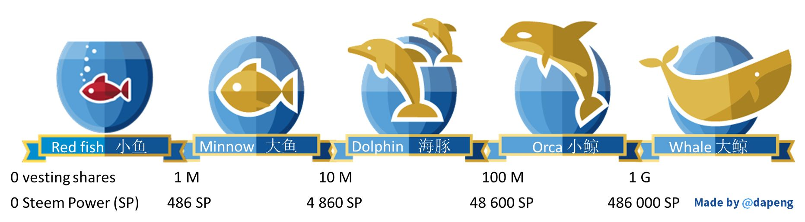

然而，如果你用[steemitboard](https://steemitboard.com/welcome.html)查某个用户的等级，例如查询有[“临时大鲸鱼”美称的 @tumutanzi](https://steemitboard.com/board.html?user=tumutanzi)，却发现他只是个海豚；而[一哥@myfirst](https://steemitboard.com/board.html?user=myfirst)更离谱，是条死鱼。这是怎么回事？

因为 @tumutanzi 有 50 万的权力来自 ned 的代理 ，从而“实权”(即有效权力，Effective SP，ESP) 达到了大鲸的等级。“临时大鲸鱼”这个名称是我最先叫出来的，灵感来源于孙中山先生的“临时大总统”一职。按照 ESP 来分等级的话，我们还可以称呼某个人“临时小鲸”，"临时海豚"等。

而 @myfirst ，只要最近 7 天没活动，就被 steemitboard 标为死鱼。

既然 ESP 比 SP 更具有现实意义，那么 steemitboard 用SP 算等级就显得不合理了，而7天不活动就标死的做法更是不近人情。我认为应该按 ESP 来算。所以，在 Steem [中文区水浒英雄排行榜](https://steemit.com/cn/@dapeng/6mnla8-steemit-cn)上，我新增了“用户等级”一栏，按 ESP 来显示用户属于哪一级。目前的 108 将里，有 5 条大鲸，4 条小鲸，8 条海豚，37 条大鱼，剩下的 54 条（恰好占一半）是小鱼。

来[排行榜](http://steemr.org)看看吧，你属于哪种鱼？

PS：海豚和鲸其实都属于哺乳动物，不是鱼。

## 机器人和小号^[校对：\@meixia] {#jqrhxh}
小雅像往常一样勤奋地更新文章，在仔细地检查了文章的错别字后，小雅按下了“POST”的按钮。然后小雅再次浏览自己的文章。翻到后面，发现居然已经有一个人在后面评论了。

小雅感到惊喜的同时又有一丝好奇，是谁在自己文章刚发出就过来评论了呢？小雅仔细读了读评论，是一段英文。翻译过来的意思就是“我是一个机器人，已经给你点赞了，希望你也可以来回访我。”这让小雅更加惊讶了，这居然是一个机器人？Steemit社区居然还有机器人在活跃，这太超出小雅的想象力了。

小雅顺着机器人的主页一路摸索过去，发现这个机器人的主人叫做大辉，是一个程序员，这个点赞机器人就是他开发的。小雅对机器人充满好奇的同时，也对这个叫大辉的人充满了崇拜。

## 禁忌和审核^[校对：\@meixia] {#jjhsg}
今天小雅非常的难过。为什么呢？因为小雅今天被一条大鲸踩了一下。

这大鲸一踩可不得了，首先自己的文章直接变成了灰色，成为了不可浏览的状态，然后自己的声望等级还直接掉了2级那么多。

这位大鲸同时给小雅留了言，“请不要使用没有版权的图片，而且你用的还是我的图片。”小雅有些纳闷，怎么自己就那么倒霉刚好用了大鲸的图片呢？不过这也让小雅警觉起来，在这里的所有人都非常注重原创性和版权的问题，自己这样随意使用别人的图片是很危险的。小雅反思了一下自己的行为，诚恳的给大鲸道了歉。这位大鲸也非常的通情达理，一番沟通后撤销了对小雅的踩。

经过这次小风波后，小雅写文章的时候，不时会提醒自己，要常记“原创”二字。  

## **延伸阅读：STEEMAUTO中文教程：自动点赞帖子或评论、自动跟随点赞[作者：\@dapeng；编辑：\@vickylin;]**


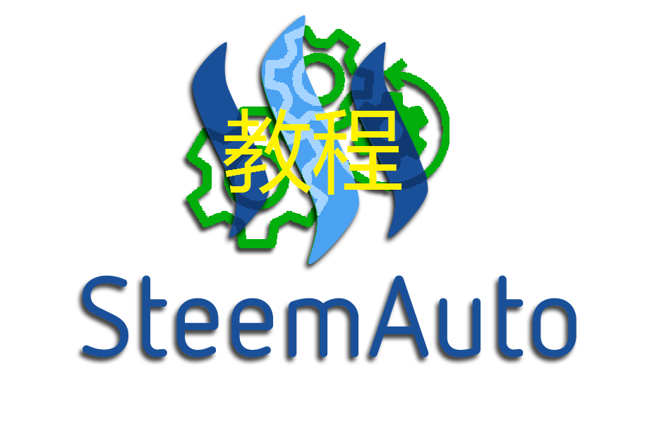

在使用 SteemAuto 之前，我用的是另一款自动点赞工具。在没有仔细阅读服务条例的情况下，我就稀里糊涂开始用，后来才发现，那个工具会用我的名字给他们认为合适的帖子点赞，每天一次。这就尴尬了，万一哪篇帖子是骂我的，碰巧被我自己点赞的话，岂不是自打耳光？

于是我就把那款软件停用了，却苦于没有替代软件，直到朋友为我推荐了 SteemAuto。

SteemAuto 提供了三种自动点赞方案：自动点赞帖子，自动点赞评论，自动跟随点赞。本教程对这三种方式逐一介绍。

SteemAuto 功能如此强大，却没有任何附加条款。恰巧中文区的小伙伴 cnbuddy 在研究跟随点赞的方法。作为小伙伴的成员，我一直没做啥贡献，趁此机会，介绍一下 SteemAuto 自动跟随点赞的方法。

在我们开始之前，先在电脑或手机的网络浏览器访问 SteemAuto 的网址：

http://steemauto.com/

并登录，就来到了 SteemAuto 的用户主界面。

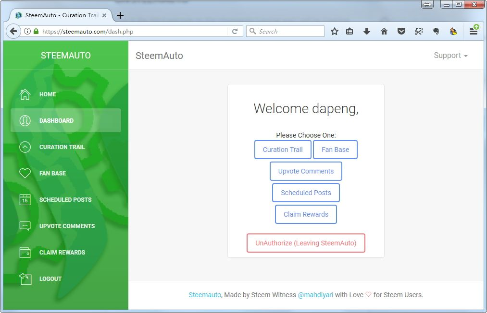

### 1 自动赞帖（指定作者）
所谓“自动赞帖”，就是你可以指定一个或几个 id，当他们发帖（blog）一定时间后，你的 id 就自动为帖子点赞。使用这个功能，请点击左侧绿色边栏或右边主面板的 FAN BASE。

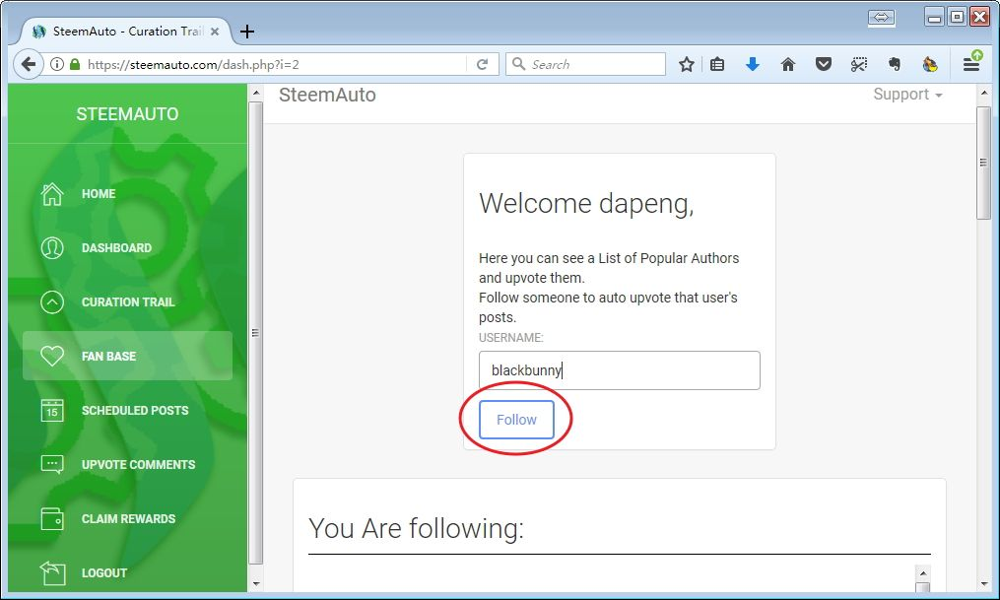

这里，我将我喜欢的作者 blackbunny 的 id 填到了表单里，然后点 “Follow”，就把他加到了我的自动点赞列表里。注意，这里的 “Follow” 跟 steemit 上关注某人的 “Follow” 没有任何关系，仅仅是在 SteemAuto 里添加。

默认情况下，是在作者发帖后立刻以 100% 的权重来点赞。如果想更改等待时间和点赞权重，那么在列表里点击 settings 按钮。

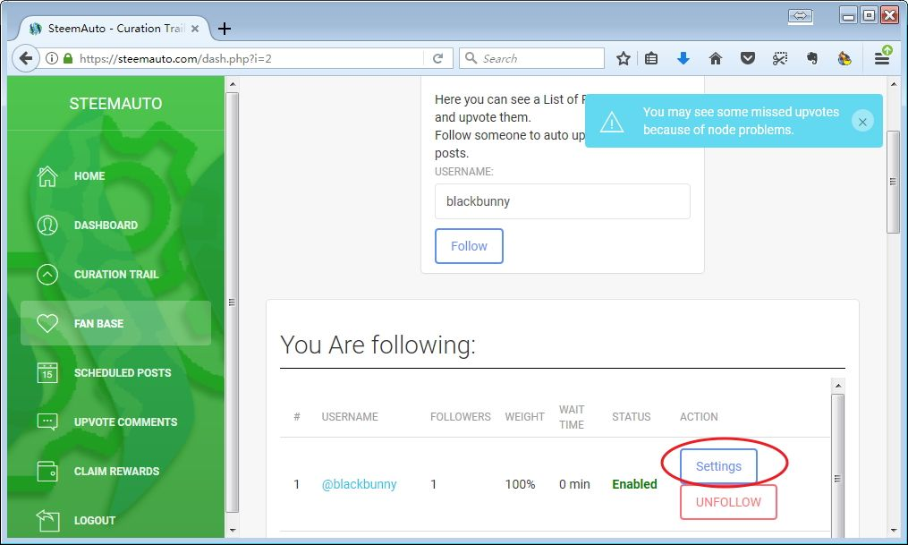

在弹出的新表单里，从上到下依次填写等待时间（即作者发帖几分钟后自动点赞）、权重、是否激活，最后点击 Save Settings 保存设置，会发现列表里已经更新了。

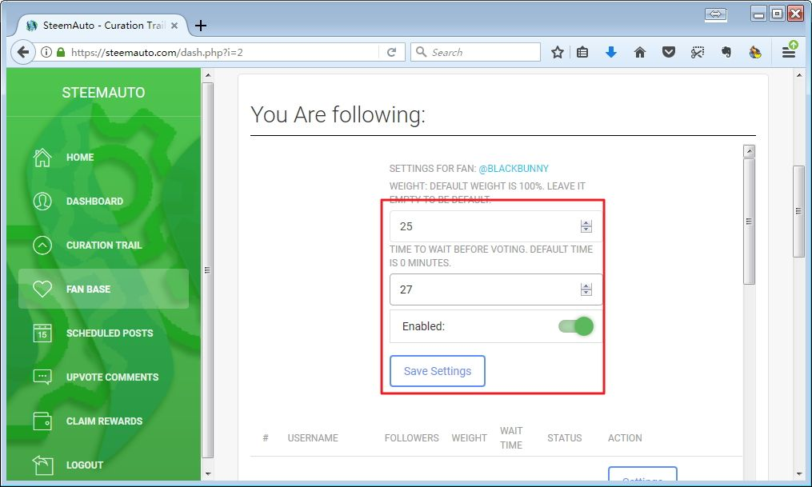

如果想短期中止对某位作者的自动点赞任务，那么将 Enabled 滑块调为灰色即可。如果想删除这条自动点赞任务，那么在作者列表里点击“Unfollow”即可。同样地，这里的 “Unfollow” 跟 steemit 上关注某人的 “Unfollow” 没有任何关系，

### 2 自动赞评（指定作者）
“自动赞评”跟“自动赞帖”类似，唯一不同的就是赞的是指定作者发布的评论（即回复，replies）。

点击左侧绿色边框的 UPVOTE COMMENTS，进入自动赞评的界面。


主面板顶部的提示告诉我们，自动赞评功能可以让你对指定作者的评论自动点赞。如果该作者在同一篇帖子后面留了多条评论的话，你会只点赞其中的一条。每天（按UTC标准时区计算）最多点赞两条。

点击 Add a User to the list 按钮，在出现的表单里填写你想自动赞评的 id，点赞权重和等待时间，最后点击 Submit 就会保存。

删除自动赞评任务的方法与删除自动赞帖是类似的，不再赘述。

### 3 自动跟随点赞
我写这个教程，原本是因为“华语区小伙伴” @cnbuddy 内部在讨论如何实现自动跟随点赞。现在，终于谈到这个问题了。

所谓“自动跟随点赞”，就是你指定一个 id，他点赞了一个帖子，你的 id 就随后点赞同一个帖子。

这有什么意义呢？

打个比方，比如你想帮助 @cnbuddy 发展壮大 CN 社区，原先的帮助方法是你代理 SP 给他，让他代你点赞 CN 区各位作者（当然你会得到 cnbuddy 为你加倍点赞的回馈）；现在，你也可以自动跟随 cnbuddy，他赞谁，你也跟着赞谁，同样也是支持了 CN 社区（当然，你也会得到 cnbuddy 对你的点赞，以及cnbuddy 的自动追随者的点赞）。

@bobdos 为此打了个精彩的比喻：草船借箭。被赞的作者好比诸葛亮，@cnbuddy 好比曹操，文章收益好比箭。大家代理 SP 给
@cnbuddy ，就好比每人送给曹操一支箭，曹操收集之后一起射向诸葛亮；自动跟随，就好比曹操冲着诸葛亮射出一支箭，每人随后也往同一方向射出自己的箭。结果都是一样的：诸葛亮得到很多箭（收益）。

点击左侧绿色边栏的 CURATION TRAIL，就进入了自动跟随点赞界面。这里列出了所有可供自动跟随的 ID 列表。假如我想自动跟随 @steemauto ，那么在列表里找到他，点击 “Follow”即可，他就出现在你的跟随列表里。

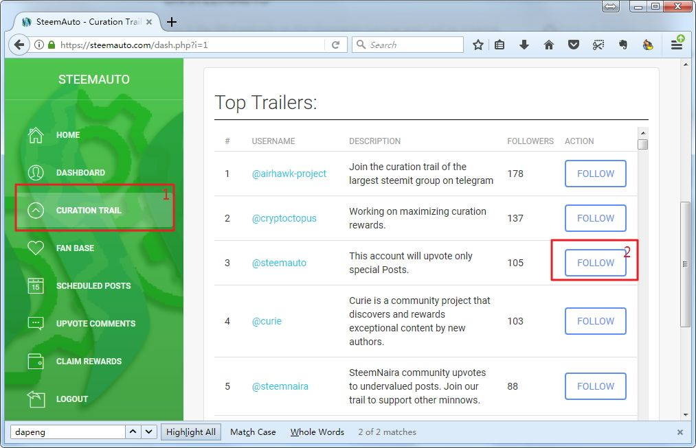

默认情况下，你跟随的点赞权重跟他的权重相同，等待时间是 0。如果想调整，就点击 Settings：

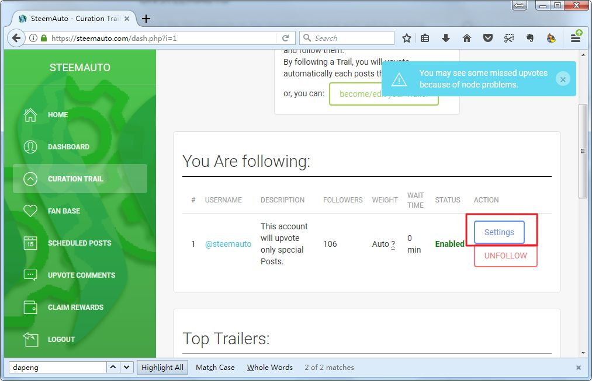

弹出下面的窗口：


Follow Curator Weight 滑块默认是蓝色激活状态。如果想自定义你的点赞权重，则滑动它，在出现的窗口里填写你的点赞权重即可。

其他设置跟自动赞帖是类似的。不再赘述。

最后，有2个重要问题：

第一，在可供追随的列表里，你可以找到我的 id @dapeng，但是可能暂时找不到 @cnbuddy 的 id，为什么呢？因为我实现在自己的 SteemAuto 账号里，把自己设置为“允许别人追随”，而 @cnbuddy 还没做设置。如何让自己允许别人追随呢？

在同一界面点击 become/edit your Trailer，在弹出的新窗口里填入一条描述信息，然后点击 submit，你的名字就出现在列表里，别人就可以追随你了。

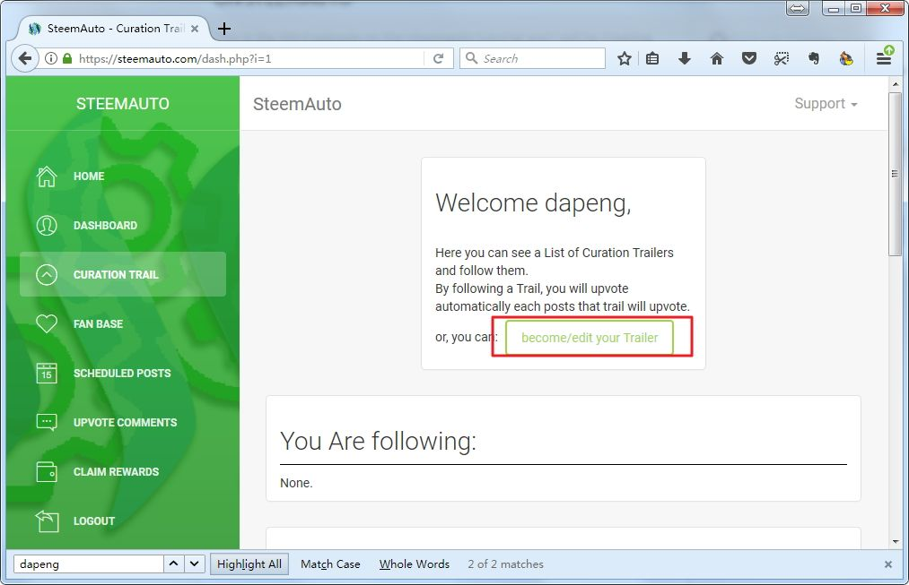

第二，如果有人追随了 @cnbuddy，如何查看追随者是哪些 ID 呢？

在可供追随的 ID 列表里点击该 ID 就行了。会弹出下面的列表，给出了名单和每个 ID 的自动点赞权重。

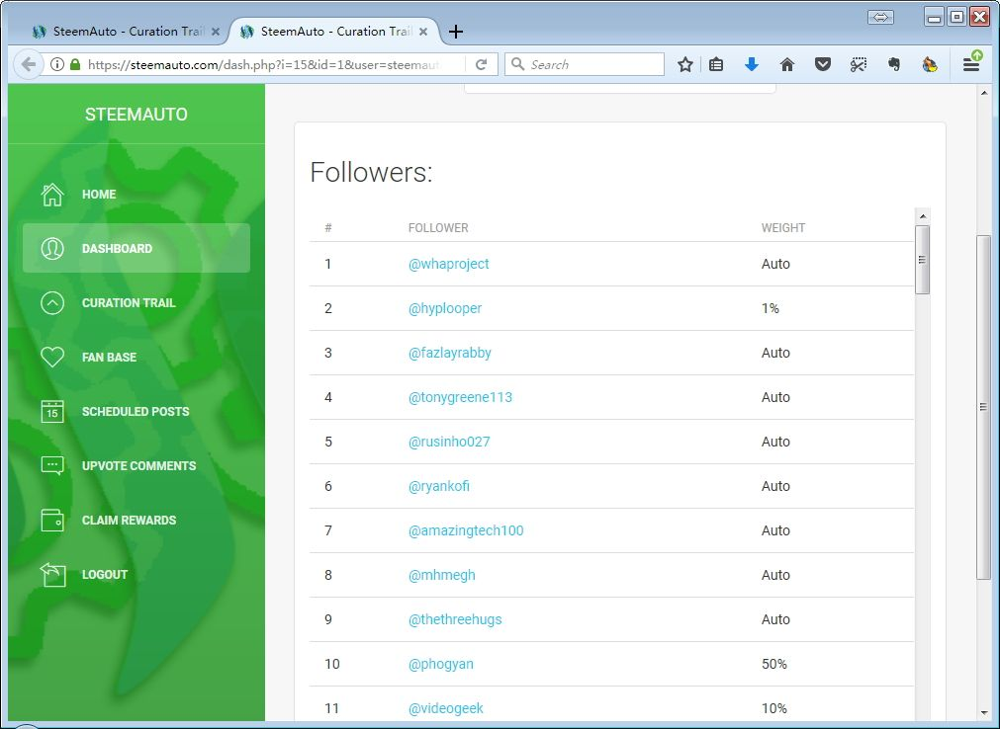

换句话说，你想自动追随谁，得先请他到 SteemAuto 里把他自己的名字用上述方法添进去，你才能追随。

以上介绍了 SteemAuto 的自动点赞帖子、自动点赞评论、自动跟随点赞等方法。如有哪里说得不清楚的地方，欢迎留言探讨。


## **延伸阅读：评论中的5点禁忌[作者：\@vickylin；编辑：\@vickylin; 校对：\@meixia]**

刚来到steemit的朋友们在解决了如何发帖这类基础问题后，面临的就是如何增加声誉、收益和followers。很多前辈会说，最直接的方法就是提供优质内容。虽说酒香不怕巷子深，但必要的“敲门砖”还是需要的，这里我指的就是互动。

我们都知道，steemit严格意义来说应该算是社交平台，因而互动就占着很重要的地位。初期，受带宽的限制，我一天一般自己发1篇文章，赞10篇文章，留言20条（这里面还包括了回复给我的留言）。这样的限制，与入驻初期急于“广交朋友”的愿望是很矛盾的。想解决带宽问题，最直接的方法就是power up。如果你不想，那就只能合理运用自己的带宽，做最合适的事，能交到朋友吸引大鲸当然是最好，最低限度是起码不“招黑”。

我们都知道，upvote（点赞）可以带给我们收益和声誉，那么downvote（踩）将让你苦心经营的一切化为乌有。

本文将列出5种可能留言会被downvote的情况。

#### **1、非原创的内容**

steemit是给崇尚原创的平台，很多人知道正文中不能盗用别人的内容，但不知道这条定律在评论中同样适用。

比如面对同样是旅游类型的帖子，有些人会复制黏贴类似的回复到各个地方。虽然这是一个去中心化的平台，但steemians不是笨蛋，当你这么做到一定程度的时候，迟早会被人发现的；

再比如使用有版权的图片。在正文中人们会特别小心这点，大多会选择可以免费使用的图片，或联系版权方授权再进行使用，但在评论中就松懈了，继而给自己带来麻烦。这里提供几个可以免费使用的图片网站：

https://www.foodiesfeed.com/

https://www.pexels.com/

https://pixabay.com/

https://picjumbo.com/

http://www.designerspics.com/

#### **2、提醒对方自己已upvote**

最近看美剧，得知一个词条“**道德应得**”。这个概念的大致意思是：如果你做了好事，那你就应当得到回报。因而就可以引申出一个问题：如果我做了好事却得不到好处，那我为什么要做呢？

这就使得有些朋友在给对方upvote的时候，会留下诸如“我已经给你留言了哦”或者“我给你留言了，你也记得回赞我哦”的评论。遇上这种留言，一般来说我会找到对方的主页，挑选一篇我喜欢的文章进行点赞，部分人我会选择无视。当然这类“我给你点赞了你也要回赞我”的操作，可能会引起一部分用户的反感，这时候就有可能遭到downvote。

如果想要吸引大鱼大鲸的关注，有一个比较温和的办法，就是在留言里，附上自己的文章链接并做个大致介绍。对方有意就会去看，也算是个敲门砖，就算没兴趣也不至于太反感。

#### **3、要求对方follow**

正如恋爱关系应该是互相吸引一样，交朋友也是如此。经过一段时间的互动，气味相投的人们会互相关注，自发想知道对方更新了什么并对此进行讨论。当然，如果已经是大鱼大鲸，或者在某一专业特别在行的，只需坐着就能吸引很多追随者了。

对于这样的留言，我会进入对方主页翻看他之前的文章。如果有我感兴趣的部分，会爽快地关注，并为之前未能发现如此有趣的内容感到遗憾。部分人会选择无视，比较悲惨的情况就是，这样的留言容易踩到某些用户的地雷，那这时候就可能遭到downvote。

在要求对方follow的时候，请确保自己起码有值得阅读的内容。即使不够优秀，但起码是你对得起自己良心的用心之作。

#### **4、与文章无关的评论**

这里分成两种情况：未经阅读直接回复和风马牛不相及的回复。

前者这类评论其实很好判断，大多是文章发出后快速回复，且内容很简短，比如：good、nice post等等。也有一种现象，是留言中的内容就是文章中已经阐述过的观点。

后者则是阅读者发表的评论和作者发表的文章未有太大联系，评论者似乎沉浸自己的创作欲望中。这样的评论，作者既得不到赞美，也得不到任何有用的建议或者信息，极容易降低对留言者的印象。

既然给了对方不好的印象，就只能努力挽救了。

我刚来steemit的时候，曾经因为一则回复，激起一位前辈强烈的反感：
> 你这是完全没仔细看我的文章啊！

当时也很懵，因为我确实是仔细看了文章以后进行的回复。在考虑再三以后，我很诚恳的回复了对方，解释自己确实是看了文章，但可能是理解能力有限误解了作者的文意。可能是当时的态度打动了对方，我们在后来成了很好的朋友，她给了我非常多的帮助。

优秀的回复，大多是就文章本身进行评论或者提出问题，让作者感知自己的文章被仔细阅读。之前听社区一位前辈说：
> 请把回复当成一次创作或谈心！把回复当成一次创作，我们才会领略到回复者的才情、智慧或幽默等等；把回复当成谈心，收到回复的人，也会把回复的人当成朋友！

#### **5、对无意义评论大赞**

当SP比较高，自己又不是爱写东西的情况下，为了不浪费VP，有些人会给自己或者相熟好友的评论大赞。但如果留言的内容是毫无意义的内容，比如“Good”“Nice post”这类字眼大赞，难免引起别人的不满。

不过基于steemit等级低的用户无法给等级高的用户downvote，而大鱼大鲸间保持着一定的制衡，不会为了此等小事撕破脸皮。因而这种情况下，大多数还是敢（会）怒不敢（会）言的状况。当然，CN区这种情况几乎未有出现，得到大赞的大多是言而有实的内容。对于此，SP掌握在别人自家手里，别人也没什么置喙的权力了。

## **延伸阅读：如何傻瓜式使用shadowsocks科学上网[作者：\@vickylin；编辑：\@vickylin]**  

最近网络封锁升级，在目前还没有办法肉翻的情况下，掌握科学上网可谓是一项必备技能。steemit去中心化的设置，是否有天也会有Google的命运犹未可知，抱着多一门手艺总是好的技能，我开始研究了如何搭梯子。

首先，你得购买好海外VPS服务器，我自己用的是[vultr](https://www.vultr.com/?ref=7283331)。

经过简单的注册以后，你就可以拥有自己的服务器啦。注意在注册前，在网上搜索一下最近的优惠码或邀请码，可以有一定的优惠。一般个人用的话，2.5/mo的足够了。

**下载shadowsocks**

打开[网页](https://sourceforge.net/projects/shadowsocksgui/)点击download就可以，就是那么简单。

如果是MacOS系统，调出终端用root登录服务器，运行以下代码：

```
wget --no-check-certificate -O shadowsocks.sh https://raw.githubusercontent.com/teddysun/shadowsocks_install/master/shadowsocks.sh
chmod +x shadowsocks.sh
./shadowsocks.sh 2>&1 | tee shadowsocks.log
```

安装成功后，脚本提示如下（一般来说一路傻瓜式的按回车，直到出现以下代码即可）：

```
Congratulations, Shadowsocks-python server install completed!
Your Server IP        :your_server_ip
Your Server Port      :your_server_port
Your Password         :your_password
Your Encryption Method:your_encryption_method
Welcome to visit:https://teddysun.com/342.html
Enjoy it!
```

如果有出现**time out**或者**denial**之类的字符，可能是防火墙未关，操作方法如下：

登陆vultr，是网站，不是终端服务器，找到server-running后面有串省略号一样的东西，点击选择view console，使用root登陆，手动输入

`systemctl stop firewalld.service` （停止防火墙）

`systemctl disable firewalld.service`  （禁止防火墙开机启动）

加下来我们配置文件路径
`vi/etc/shadowsocks.json`

会出现以下脚本，是单用户配置

```
{
    "server":"0.0.0.0",
    "server_port":your_server_port,
    "local_address":"127.0.0.1",
    "local_port":1080,
    "password":"your_password",
    "timeout":300,
    "method":"your_encryption_method",
    "fast_open": false
}
```

一般来说我们不可能单用户，所以要把他们都删掉。按“**i**”进入**insert模式**，将光标调整到合适位置后按“**dd**”，把上述脚本包括括号全部删完。然后，将多用户配置代码复制黏贴进去

```
{
    "server":"0.0.0.0",
    "local_address":"127.0.0.1",
    "local_port":1080,
    "port_password":{
         "8989":"password0",
         "9001":"password1",
         "9002":"password2",
         "9003":"password3",
         "9004":"password4"
    },
    "timeout":300,
    "method":"your_encryption_method",
    "fast_open": false
}
```

按“i”进入insert模式，需要将8989-9004对应的password改成你想要的数字，简单密码复杂密码都可以。将**your_encryption_method**改为**aes-256-gcm**。因为是在vim模式下，会有些麻烦，耐心一些。修改完成后按**esc**，输入**:wq**回车，就表示保存并退出了。

键入

`/etc/init.d/shadowsocks restart`

到这里服务器端口的配置就OK了。将shawdowsocks图标拖进application文件夹，双击打开软件，打开服务器设定，填入之前设置好的其中一个端口和密码，加密方式选择aes-256-gcm即可。

代理模式选择全局模式。这样shadowsocks就安装好了，可以在家里享受科学上网的乐趣啦。

题外话：

1、当然，购买现成的服务也不是不可以，优点是出了问题有客服可以解决（如果没有跑路的话），缺点是树大招风，比较容易被GFW检测到。再者，很多都存在超售现象，网速得不到保证；

2、如果自己搭建，建议将默认的SSH端口换成别的。我刚开始运行自己服务器，才半天就被攻击了六千余次，吓到半死。如果被暴力破解，很可能会变成肉鸡；

3、几个朋友共享梯子倒还好，但不推荐以此为生。之前在推特上看到，某梯子商家被判刑了。我认识的几个卖梯子的“个体户”现在不是停止服务，就是低调的一塌糊涂。  


## **延伸阅读：关于带宽 Bandwidth [作者：\@vickylin；编辑：\@vickylin]**  

对于新人来说，在解决了设置个人信息问题，开始发帖和互动，最常遇到的一个问题就是：

> Bandwidth Limit Exceeded是什么？我怎么消息发不出去了？带宽又是什么？

几乎每过一段时间，我都会在新人群遇到提这个问题的萌新，以至于形成习惯，定期在群里普及这个概念。如果说SP是你在steemit上的话语权，那带宽就是你安生立命的东西，用我很经典的一句话来说：

> 没有带宽你什么都做不了！

**带宽（Bandwidth）**是STEEM引入用于防止滥用(SPAM)的机制。分为以下两种：

Forum Bandwidth: 用于发文、回复、留言、点赞等
Market Bandwidth：用于转账、交易等等

我们从比较好理解的Forum Bandwidth入手。在这里，无论你是发帖、点赞、留言还是回复，都会占用到带宽。对于系统来说，每次操作都可以算作是一次Transaction，其中包含操作的内容，以及签名信息等。而这个Transaction的体积，即为此次操作占用的带宽。

此外，**带宽的计算为7日平均值**。我还是新人的时候，曾有一次一天只回复了几条留言，到了晚上就提示没有带宽，并且第二日依然如此。焦急如焚的我找到前辈问到：

我今天啥也没做啊，连文章都没发，几乎也没有互动，为什么会这样呢？

前辈就说了7日平均值这个概念。后来去找来他的文章，原来带宽有如下计算方式：

(7天 - 距离上次操作的时间)*之前的Average Bandwidth/7天 + 本次操作Bandwidth
如果距离上次操作时间 > 7天，Average Bandwidth为本次操作Bandwidth

**可用Bandwith和持有的股份成正比**

是否有可用带宽 = (你的vshares / 总的vshares) > (你的平均带宽/总的带宽)

简单来说，你的有效vshares(你的STEEM POWER+别人代理给你的-你代理出去的)占总vshares的比例**不能低于**你的平均带宽占总带宽的比例

**如何解决受限问题**

1、减少你的平均带宽使用量

* 拉开操作间隔，给带宽以一个恢复期；

* 减少操作次数。新人期的时候，我曾严格控制自己这点，给自己立下了例如每天只发一篇文章，点赞10次，留言+回复不超过20条的“规定”。虽然互动是必须的，但没必要浪费带宽在无意义的留言和回复上。

* 减少每次操作的体积。在上文中我们提到Transaction包含了操作的内容，以及签名信息等。签名信息这些我们无法改变，能压缩的只有自己操作的内容。这里必须要提到的一点，发帖时候占的带宽和提交的内容（可以理解成在steemit编辑窗口内的文本）有关。在带宽有限的情况下，尽可能用**简短精辟的文字**阐述自己要表达的内容，**尽可能少的使用图片**，当一定要用到动态图（gif）的时候，**将文件名简短化**，比如改成“1”，这些操作将会为你省下不少带宽。

2、增加vshares占比。这个方法最好，也最直接。可以通过充值SP或power up（将会在另一篇文章中提到操作方法），让别人代理一些SP给你或是直接从blocktrade中租用（目前是1sbd租用约10sp，时长90天）。

**写在最后**

1、从STEEM官网注册，官网会代理给你14个SP，一共是14.5SP左右(代理的14大概在7天左右收回)，一般来说可以应付基本操作。如果通过cnsteem.io渠道注册，则可以有效解决官网注册难的问题。初期账户有0.2SP，会代理给你2个SP，一共是2.2SP（其中0.2不收回，代理的2是当你自己累积到这个数字时再收回）。大家在注册之后要尽可能快的发表优质内容，赚取SP。

2、对于新人来说，建议随时监控自己的带宽情况。可以关注微信工作号steemit，在对话框中属于@steemid（比如@vickylin）即可。里面除了可以查询带宽（BW）以外，还有类似资金情况、SP租借情况等，非常方便。

3、另外推荐一个网址：https://steemd.com/
可以输入自己的steemid，比如https://steemd.com/@vickylin
此时，就可以查询到自己的带宽情况。往下拉，还可以看到谁给你留言了，谁用了多少Voting Power给你投票等。

4、无论是代理、卖赞还是power down，务必在账户中留下足够的SP。曾遇到过有代理过多SP出去（退出代理需要7天的时间），导致自己什么都做不了的朋友，最后还是经由他人代理了一部分SP才解除困境。

## **延伸阅读：如何power up [作者：\@vickylin；编辑：\@vickylin]** 

对于已经在steemit待了七天以上的朋友来说，理论上有第一笔作者奖励已经入账，那么我们的账户中就会有sbd。对我来说，看到价格合适的情况下就会选择用sbd买入steem再power up，大家可以根据自己的具体需要决定。

登陆主页——钱包——STEEM DOLLARS——市场
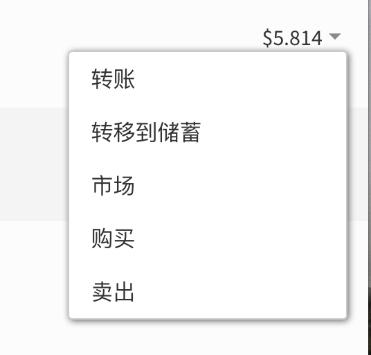

进入市场后，界面如下：
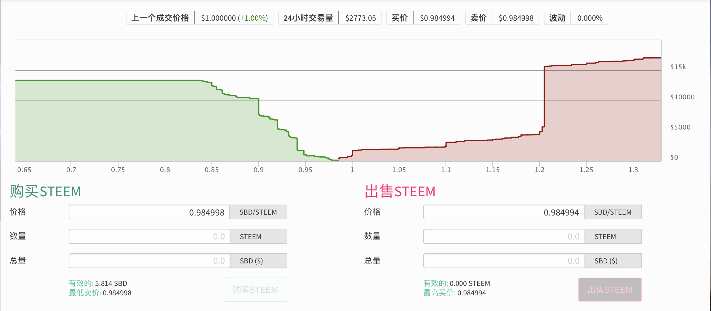

在左边购买steem表单中，填写入想要购买的心理价位及数量，点击购买steem；


提示“确认Limit Order Create”，点击“好”；


输入active key，点击登录


下单成功后会在左下角提示如下：
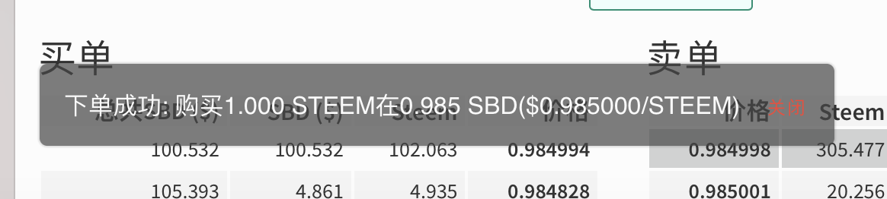

如果挂单价格合适的话，订单将会撮合成功。返回钱包，在第一栏中便可查询到刚才购入的steem；


点击右侧三角形下拉箭头，选择power up，填入此次想要power up的量，按确认即可。
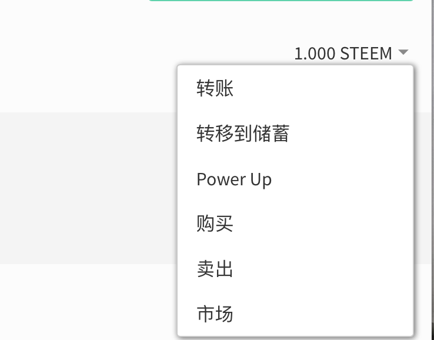
