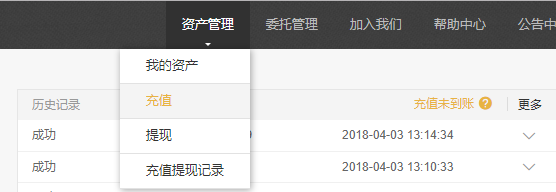
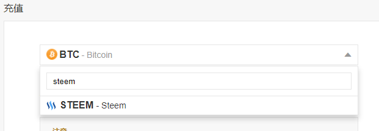
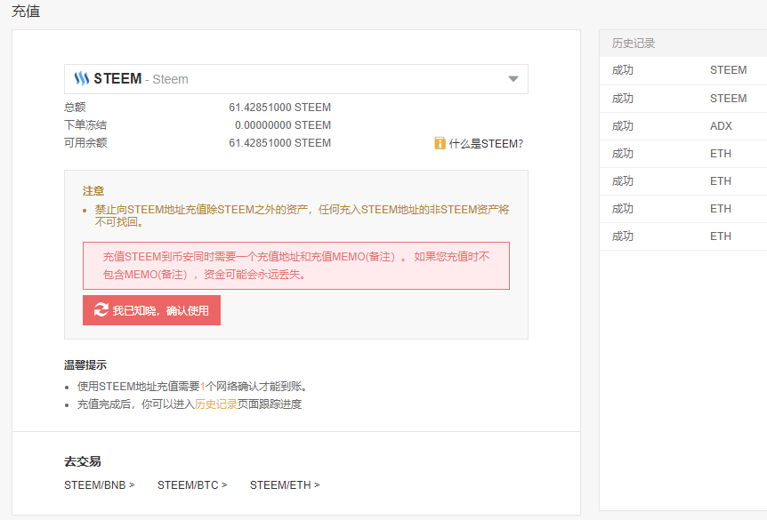
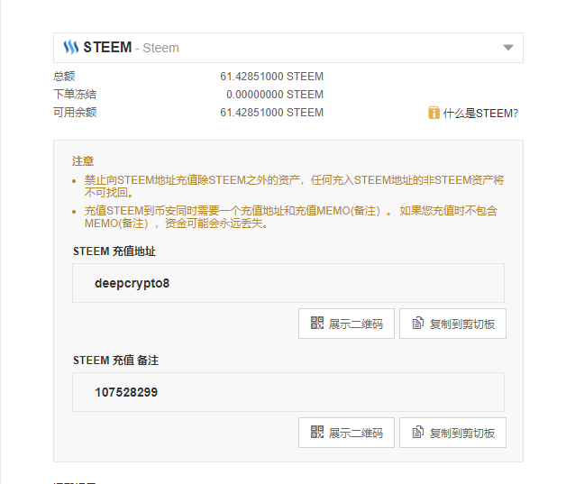
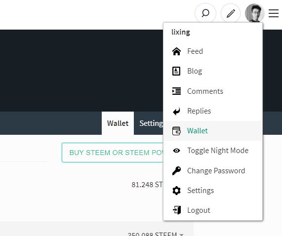
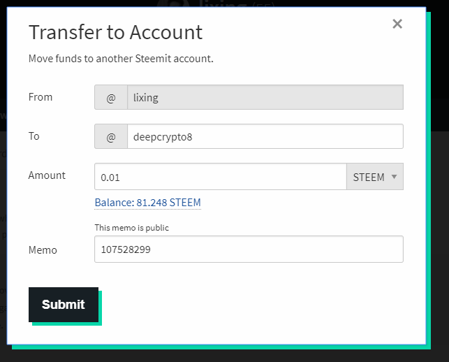
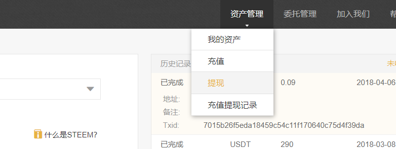
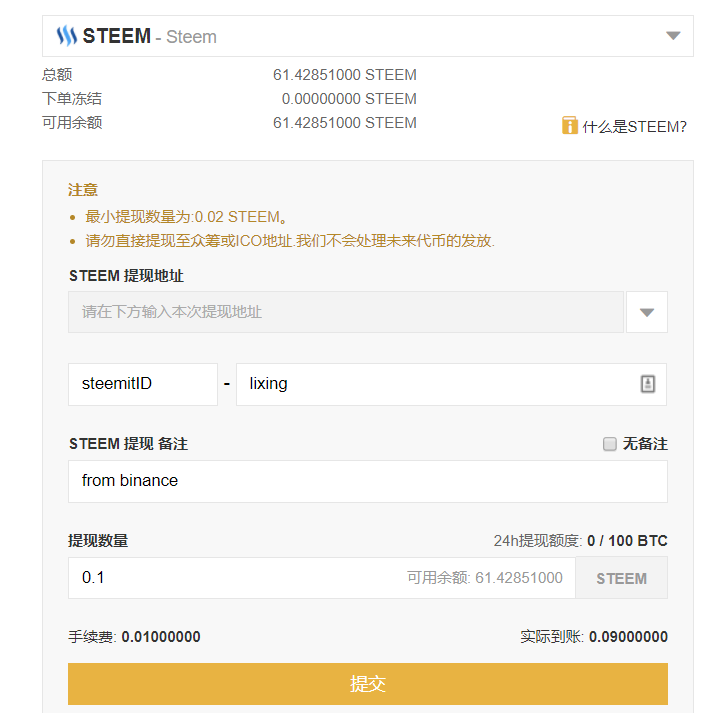
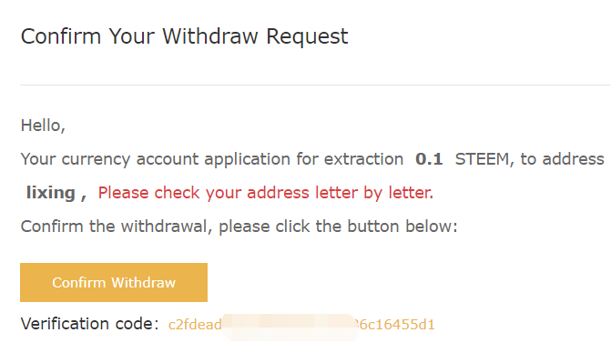
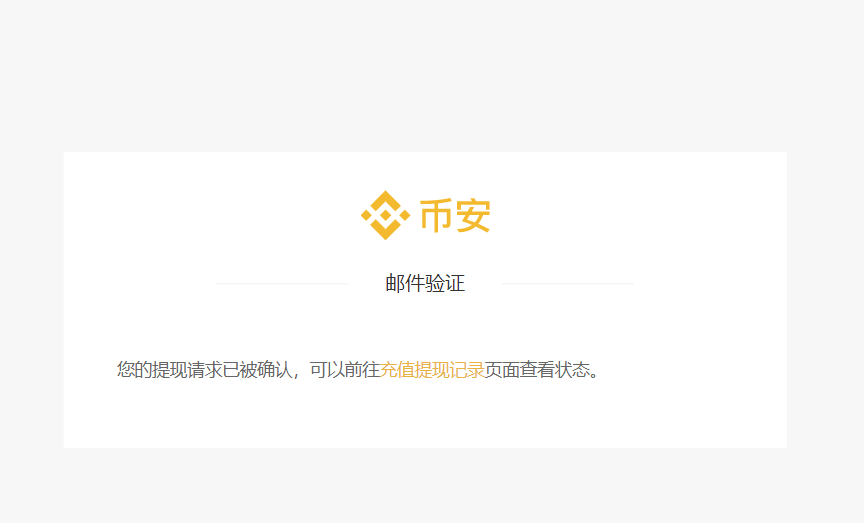

# 常用操作 {#cyczp}
## 关于互动的一切 ^[作者:\@hepeng.chn;小故事:\@maiyude;编辑:\@maiyude;]

小雅对于在Steemit社区里面的互动，非常的积极。

她看文章都非常的认真，看完也会认真的回复。因为她觉得，别人用心写了文章，自己就要用同样的心情对待。认真的看和认真的回复是基本的基本。不过偶尔她也会看到一些非常不用心写的口水文，这个时候她就非常想要去踩一脚，不过很多时候她都忍住了，因为她还只是一只浮游生物，踩人的效果差不说，还容易得罪人。

小雅还发现这里经常会举办各种各样的活动，比如奖励丰厚的月旦评。小雅参加了好几期的月旦评，虽然都没有获奖，但是参加活动让她认识了许许多多的新朋友，这让她感到非常的愉快和满足。

****

你是否和小雅一样渴望积极的参与到steemit呢？你如何能够更加好的获得别人的关注吗？

除了精彩的内容以外，频繁的互动帮助你更快的融入这个圈子。你可以采用下列的方法积极的增加你的与别人的互动。

- 追随大鲸
多与Steemit大鲸进行互动, 你可以在文章下发表高质量的评论, 相互探讨，请教问题。让大鲸看到你的同时，也学到了steemit社区的处世之道。

- 征文投稿
steemit社区有着各种各样的征文活动，如cn区的“月旦评”（#cn-reader），就是不错的选择。挑选擅长的领域，分享你的知识与生活，这是大家都乐于看到的。

- 慷慨点赞
不要吝啬你的赞！
不要因为自己的点赞微不足道就不去点赞，当你发现能够打动你的好文章时，动动手指，点上一赞，这是对别人努力的肯定，善意的举动总能得到善意的回应。
留下你的感悟评论则是更加值得鼓励的行为。但是，请不要恶意刷评论，这是不礼貌的表现。真心实意的三言两语远比复制粘贴的废话有意义。

- 阅读取经
在#最新,#热门两个标签中，你可以看到当下的热议话题，看到最新的精彩文章。这样的帖子是新人展露头角的平台，善于学习，积极评论（但不是为了评论而评论），让更多的人看到你思想的火花。

- 互动游戏
参与有趣的互动游戏，如点名，冰桶挑战之类，在游戏的同时提高自己的曝光度。

## 关于提款的一切 ^[作者:\@lixing;小故事:\@maiyude;编辑:\@maiyude;原文链接:https://steemit.com/cn/@lixing/or-steemit-steem]

随着小雅在Steemit社区的默默耕耘，小雅的钱包日渐丰厚了起来，现在已经有3个SBD那么多了。这让小雅很是高兴，虽然钱不多，但是这点钱是自己努力的证明。

不过有钱了，另外一个烦恼又出现了，这里的钱币如何换成能够通用的法币呢？小雅抱着疑问去调查了一番，别人给出的答案是要先转到交易所，然后通过把SBD换成别的数字货币后卖出。大神们还给了一大串乱七八糟的数字货币名字给小雅，什么BTC、ETH、BTS云云，听的小雅一个头两个大。

最终，小雅还是没搞明白如何把钱提出来。不过小雅很快释然了，反正钱不多，就先放着吧，等到自己有100个SBD再去提款吧。

****

当你在steemit上赚取了第一笔收入后，你是不是已经和小雅一样，跃跃欲试的想要把钱提出来呢？下面这个教程会教你如何把钱提出来。

首先你需要把钱转账到交易所里面，把steem换成方便场外交易的比较通用的虚拟货币，如BTC、ETH、USDT等等，再通过场外交易把这些虚拟货币换成法币。

支持steem交易的交易所有不少，比如Bittrex(B网)、Poloniex（P网）和币安等等。这里以中国人接触最多的币安为例做个说明。

### 币安操作

- 1、登陆币安（现在需要境外IP）

- 2、右上角“资产管理”——“充值”


- 3、在左侧栏目里搜索“steem”


- 4、跳出注意事项，认真阅读然后点我已知晓确认使用


- 5、这时你会得到steem充值地址和备注信息。充值地址就是steemit用户名，只需在steemit向他转账即可。（注意只能转steem）可以先转0.01个steem测试，没有手续费。



### steemit上的操作

- 1、进入steemit钱包/wallet


- 2、点steem余额——点击转账/transfer


- 3、填表

transfer To 币安显示的充值地址
amount要转账的steem数量（可以先小额测试一下，没有手续费）
Memo 币安显示的备注信息


- 4、完成，等待到账，3分钟左右。

当转账完成后，你就可以在交易所自由的买卖货币了。如果你需要换成法币，你还需要进行场外交易，场外交易的方法很多，这里就不再叙述了。

- 三、反向操作流程 | 将币安中的steem代币转账到steemit

1、币安右上角资产管理——提现


2、左侧找到steem代币信息


3、最重要的是提现地址——写下你的steemit ID ，其他备注信息可填可不填。最后填写要提现的steem数量，建议小额尝试一下，转出币安的操作需要手续费：**0.01steem/笔**。


4、提交，显示请到绑定邮箱确认交易。打开邮箱，点击Confirm withdraw 确认交易。


5、



OK，等待到账吧，10分钟左右币安显示到账。

## 关于密码的一切 ^[作者:\@maiyude;]

小雅收到了一个好消息和一个坏消息。

好消息是小雅通过努力，获得了月旦评的一等奖，这让小雅兴奋了一个晚上。

坏消息是小雅的账号被盗了，她的账号无法登陆，同时自己辛苦赚来的钱也不翼而飞。

小雅回忆起自己账号被盗前的最后操作，她认为自己是在微信里面点了钓鱼网站的网址，导致了密码的泄露。账号被盗让小雅懊恼不已，不过这个时候懊恼也没有用，赶快把密码找回来才是要紧事。小雅给官方写了邮件，还咨询了很多朋友，他们给的答复都是密码丢失了很难找回，这让小雅更是焦虑了。

万幸的是，最终小雅还是在朋友的帮助下把账号找回来。找回密码之后小雅才发现，自己之前无视的设置界面里有3种密码，分别有不同的权限，自己傻傻的一直用着最高权限的Master key。小雅认识到了自己在密码安全上的大意与天真，从此把Master key藏在了箱子底下再也不使用了。

****

通过小雅的遭遇我们发现了一件事情，就是Steemit里面存在几种密码。
这几种密码是怎么回事呢？现在给大家讲解一下。

为什么Steemit需要那么多种密码呢？因为区块链的密码的特性，丢失后难以找回，所以官方才想出了区分使用场景的办法来保护密码安全。

Steemit里面有四种密码，分别是Owner Key（主密码）；post key（发帖密码）；Active Key（活动密码）；Memo Key（备注密码）。
四种密码分别有不同的权限和功能，下面来一个个介绍：

1. Owner Key（主密码）：主密码拥有所有权限，可用于修改所有密码。刚注册好的账号给你的就是主密码。这个密码就是你账号的一切，当这个密码丢失的时候，你的账号几乎无法找回，所以请谨慎的保存你的主密码。
2. post key（发帖密码）：发帖的权限是发帖和投票。即使这个密码不幸丢失，骗子也只能用你的账号发发帖，点点赞，无法转走你账户里的SBD和STEEM。所以平时应当使用发帖密码登陆较为安全。
3. Active Key（活动密码）：活动密码拥有转账的权限。你可以使用活动密码给朋友转账，进行POWER UP/DOWN的操作。这个密码关乎你账号里的钱的安全，所以也要谨慎保管，一旦丢失，你账户里面所有的钱都会被一扫而空且难以找回。
4. Memo Key（备注密码）：用于创建和读取备注。很少使用的一个密码，权限也不高，知道有这个密码存在就好。

我们现在知道了这四种密码的存在，为了我们的账户安全，最好分场景使用这些密码。主密码最好离线保存尽量不使用。登陆发帖投票都使用发帖密码。转账的时候才使用活动密码，并且转账前注意网址是否为钓鱼网站。

但是很多新人会有一个疑问，我注册的时候明明才有一个密码啊？这另外的几个密码从哪里可以找到呢？下面我们来一步步教你如何找到这些密码。


首先进入你的钱包，点击“权限”按钮。

你可以发现这里有4种密码的公钥，我们登陆需要的是私钥，所以点击右边的“登陆显示”按钮。


使用你的主密码登陆


登陆后点击右边的“显示私匙”即可显示出你的私匙，把所有种类的密码保存好。

保存好密码后，请退出登陆并清除浏览器“cookies”，然后再使用发帖密码登陆。

做好了这一切，你的账户现在已经安全不少了，但是网络上的陷阱无处不在，我们还是有几率造成密码丢失，那么，密码失窃后第一时间应该做点什么来补救呢？

失窃后第一时间应该做什么？

1 用你现在的主密码，修改出一个新的主密码，并将随之产生的各种新密码备份。
2 如果是主密码被小偷篡改，那么立刻通过官方渠道申请恢复，30 天内有效。如果你的账号是代理申请的，那么找你的代理商帮忙。
3 查询你的 Power Down Routes，如果有问题，立刻改。
4 如果自己搞不定，速来华语区的微信群里向高人求助。

当然，密码失窃是谁都不想遇到的事情，那么，为了避免失窃，我们应该做哪些防范呢？

1. 永远不要在任何场合使用主密码（Owner Key），除非你需要修改主密码，相当于手机上的“恢复出厂设置”。
2. 任何情况下登录，都只用发帖密码（posting key），除非跟钱和 steemconnect 打交道时，才使用活跃密码（Active key）。
3. 不要让浏览器记住你的密码。用 keepass 或 lastpass 来管理密码。
4. 防盗的最好办法是没钱可盗。STEEM 钱包里有两种钱： STEEM 和 STEEM DOLLARS（ SBD）是可以被随时转走的，而 STEEM POWER 和SAVINGS 是无法马上取出的。把 STEEM 和 SBD 保留到最小额度，最好是0；多余的要么变现，要么 power up，要么存到 SAVINGS 里。Power up 的钱需要花 13 周才能全部取出，SAVING 里的钱需要花三天才能取出，二者都能随时中止。这样，即使发现钱包出现异常，也可以把损失降至最低。

## 延伸阅读：如何恢复你被盗的Steem帐号？ ^[作者:\@skenan;编辑:\@maiyude;原文链接：https://steemit.com/cn/@skenan/steem]

**结论**

首先Steem帐号是可以被恢复的，但需要满足以下两个条件：

1. 主密码已被修改
2. 拥有30天之内登录过的主密码

切记：忘记主密码，任何人无法帮你找回！

**从哪找回**

- 从 Steemit 注册的账号，前往 https://steemit.com/recover_account_step_1 提出恢复申请，需要验证你的邮箱或电话
- 从 CNsteem.io 注册的账号，使用注册邮箱给 cnsteem@gmail.com 发邮件，提出申请
- 通过朋友帮忙，使用 Steemconnect 或其他工具注册的，可以参考以下步骤。

**如何找回**

由于steem-python 还未实现帐号恢复的API，以下直接使用Steem 的 cli wallet 进行操作，为方便说明，以下skenan是被盗人，cnsteem是恢复人，他们分别使用不同的机器。

> PS: Steemit通过 Steem-JS进行帐号恢复，但要求密码必须是Base58格式，我用随机生成的密码尝试时报错，有空再去研究一下

(1).安装并使用Steem Cli

```
docker pull steemit/steem
docker run -d -p 2001:2001 -p 8090:8090 --name steemd-default steemit/steem
docker run  -it steemd-default cli_wallet -s wss://steemd.privex.io
# 第一次使用需要设置密码
set_password "yourstrongpassword"
unlock "yourstrongpassword"
```

(2).skenan生成新的密钥

```
unlocked>>> suggest_brain_key
{
  "brain_priv_key": "STONKER OAKWOOD KICKOUT COCKLET ALKYLIC INFLECT DEALER WILDED ANDROL ENNUI PESO CYNICAL CAUNCH JUVIA UNLORD FILTH",
  "wif_priv_key": "5JrUcHKYa1XLBcw4wJ3DvVPS2rV3xoLDzHxKQNG7mgPhHoFhbxf",
  "pub_key": "STM8dv5WnybKYkZ9zZ8qFWfrwiPTiCeMxFTiw3UrCm1HAt6LyLV4Z"
}
```

(3).skenan将pub_key发送给cnsteem

(4).cnsteem登录自己的Steem-cli向网络提出恢复请求

```
unlocked >>> import_key "cnsteem的Active Key"
unlocked >>> request_account_recovery "cnsteem" "skenan" 
{"weight_threshold": 1, "account_auths": [], 
"key_auths":[["STM8dv5WnybKYkZ9zZ8qFWfrwiPTiCeMxFTiw3UrCm1HAt6LyLV4Z",1]]} true
```

(5).skenan向网络确认恢复请求

```
# 导入新私钥
unlocked>>> import_key 5JrUcHKYa1XLBcw4wJ3DvVPS2rV3xoLDzHxKQNG7mgPhHoFhbxf
# 导入旧私钥
unlocked>>> import_key 5J...
# 确认恢复请求，第一个SMT5为旧私钥的公钥，第二个是新私钥的公钥
recover_account "skenan" { "weight_threshold": 1,"account_auths": [],
"key_auths": [["STM5...",1]]} {"weight_threshold": 1,"account_auths": [],
"key_auths": [["STM8dv5WnybKYkZ9zZ8qFWfrwiPTiCeMxFTiw3UrCm1HAt6LyLV4Z",1]]} true
```

6.使用新的私钥登录Steemit，它会提示你重新更改密码


**总结**

根据以上的演示，正常来讲，恢复人从头到尾没有见过被盗人的新私钥和旧私钥，严格保证了密码的安全性。如果你想图方便并信任我，在请求恢复的时候也可以直接发送你的主密码。

