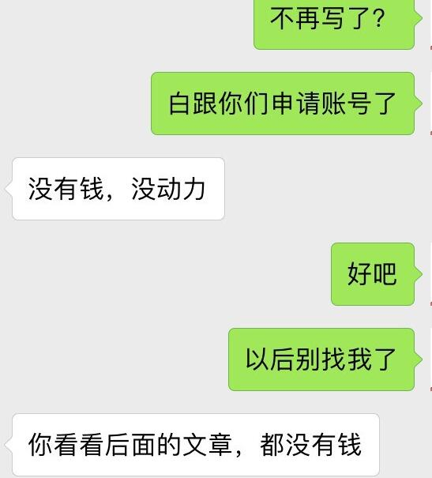

# 文章写作 {#wzxzp}

## 如何开始你的写作 ^[作者:\@rivalhw;编辑:\@maiyude;]

**如果没有写作，你不知道自己可以如此有才华；如果没有写作，你不知道自己写作的知识是如此的匮乏。**

一次偶然的机会，我开始了自己的写作生涯，在初开始写作前，我想了许多，但直到动笔开始的那一瞬间，我才突然发现先前的很多想法，已经杂乱无序般在我的脑海中，炖成了一锅粥。我不知道如何开始，从哪里开始写起，到哪里结束。我心中很多想法，甚至不乏一些我自认为的“优美词语”，但终是如茶壶里煮饺子般困难。

我尝试着去写，在完成了第一篇写作后，我发现其实写作业并非我想的那般困难，于是我接着去写，从自己的心里想法和体会开始写，但很快没过多久，我发现自己似乎进入了一个写作“枯竭”期，没有什么心得体会可供我写了。我开始尝试着不满足于仅仅只是自己的一些心得体会，开始写一些我的所见所闻，并将其整理成故事讲出来。

以上不仅是我的个人感受，很多朋友在开始写作前，经常会碰到上边的问题。我认识的一个朋友，在两年前的时候，我就听见他在讲，要准备写本书，并且如何如何，但两年过去了，我至今仍未看到他在这方面的丁点进展。

这里有一些建议，也是我个人的亲身体会，希望能对屏幕前打算开始写作的你有所帮助。

**1、立即动手，培养你写作的基本功；**

写作的基本功是好的文章的基础，如果你是理科生，或者你可能说自己不擅长写作，这些都不是理由，又有谁一开始就很擅长写作呢？写作就如同讲话，也是长期积累和锻炼出来的，你需要练习自己写作的基本功，包括从最基本的句子开始，到段落，如果你还是觉得很困难，一个好的方法就是多些阅读，尤其是多阅读那些你喜欢的文章或书籍；

**2、留意你身边发生的一切；**

在开始写作后，你很快会发现，自己会因为缺乏素材而很难继续写下去，而缺乏素材和灵感，闭门造车写出来的文章始终会让人觉得食同嚼蜡、索然无味般无趣，所以，留意你身边发生的一切，留意生活中你所看到的，听到的。。。把它记下来，试着用自己的语言去整理，有一天你会发现，即便是一小段的内容分享，也远胜过你闭门造车出来的“杰作”。

**3、坚持创作；**

创作这事情，如同人的思维，越用越活跃，越活跃越写。因为自己的懒惰，你很快会发现你的思想紧随之后也开始懒惰甚至停滞不前，我相信拿走伤仲永的那只神笔并不是别人，正是因为他自己思想的停滞而造成的。坚持创作，你会发现自己的思想越来越活跃，而你笔下的文章也会越写越生动。
  
## 如何创作优质内容 {#rhczyznr}
### 社交性

很多从公众号、简书、微博等其它传统内容平台过来的作者们容易在一开始就对steemit产生一些误读。

>误读：steemit是一个类似微博、微信朋友圈那样的重社交网络。
现象：像微博那样发帖子，一篇文章几句话，或者配一张简单的照片。对于很多刚刚来steemit的新手来说经常可以看到这样的内容。

>误读：steemit是一个类似公众号、简书那样的写作平台。
现象：像公众号和简书那样发长长的一篇文章，文章质量很高，但是关注和点赞确很少。

对steemit的正确理解它是一个“**内容社交**”网络平台。首先，steemit里需要有“内容”，其次，steemit有很强的社交性。

在steemit里“内容”与“社交”是相辅相成的，大家通过每个人长期的内容文字，大概了解在你文字下你是怎样的一个人，大家有共同的兴趣、价值观或者共同的利益（比如赚钱）然后关注（follow）你产生社交，然后由已建立的社交关系，持续关注你的文章内容。对于个人想要提高自己的被关注度，也需要主动去社交，比如主动去阅读他人文章点赞评论留言等。

steemit不是一个熟人关系的网络，不能像微信朋友圈那样的发张照片写段简单的文字记录自己的日常生活，在steemit里这样的内容不是优质内容。同样的，一篇长长的有深度有内容的文章而没有因社交传播出去，在steemit也不算优质内容。

steemit里的优质内容是跟社交有强烈关联的。steemit里常常可以看到一篇都是程序代码的文章，对于不少非程序员的人毫不夸张的来说一点儿都看不懂，这是优质内容吗？对于长期写干货文章的人来说，看到一篇旅游帖的收入很高，完全不能理解，在他们眼里那是优质内容吗？

在steemit里程序代码、旅游帖、绘画等内容都有很强的社交性，都可以通过内容连接起来同样一批兴趣相投的人，这些可以产生社交的内容在steemit里都是优质内容。

### 易读性
易读性主要体现在文章的排版，内容的图文并茂上。

具体操作：

* 熟练运用markdown编辑文章；
* 屏读时代文章段落可顶格不空字符，一段文字行数不宜过多，一般三四行文字一段为宜；
* 尽量轻量化写作，控制文章字数，一般控制在1千字为宜；
* 尽量多些实际的故事，少些无病呻吟的干道理；
* 多插入跟文章内容相关的高清图片，字数超过一千字可以考虑插入多张图片，插入的图片注意比例尺寸（一般以横屏图片为宜）及居中显示等。

### 传播性
* 给文章取一个好的标题

往往一个好的标题就顶半篇文章，一篇好的文章标题，或许就决定了你的文章有没有人看。那么如何给文章取一个好的标题，我们来看看steemit里那些曾经出现过的比较好的标题：

比如来看看\@coldhair的文章标题:
 
>慢性浅表性胃炎，怎么办？
你写一篇Steemit文章需要花费多少时间？
如何坚持在Steemit上写文章？
Steemit团队有可能掏钱跑路？

仔细观察你会发现，coldhair的文章标题大多都是问句，问句的标题有个好处是能给读者引发疑问，疑问句标题的文章能切重读者关心点跟读者产生共鸣。

>父亲又吸烟了

交代了人物和基本的故事，一个“又“字也又让人感受到作者的情绪。简单几个词，包含的故事信息量确很大，让人忍不住想阅读。

比如来看看\@tumutanzi的一些文章标题：

>复杂的英国，为砍一棵树导致民众和政府冲突
一个有意思的澳大利亚Uber司机：了解红灯区、会治病、爱拍照

民众、政府、冲突，红灯区.......通过一些敏感刺激的词，吸引你这里还有故事。

>我把群主宝座禅让给两个英国人的爹
看牙医记：牙医建议我多吃软饭

幽默，不直接写把steemit群主转给justyy而要绕个弯儿，注意饮食说是吃软饭。

>在Steemit上写作一年能有36万收入？
36万吸引眼球。其实文章想表达的思想可能跟36万没关系。

比如来看看\@yellowbird的一些文章标题：

>毕业六年，酒精考验
长这么大，第一次被人约跑

践人，酒精考验，约跑，文字游戏，故意让你读错引起兴趣。

>BeeChat一个区块链的微信？
币问——币圈的知乎

介绍一个新事物，类比一个熟悉的事物降低认知难度

>我接了个陌生电话

制造悬念，引入一个故事。

* 文章内容把握当下热点

这个非常好理解，比如我们常见的娱乐新闻事件，都是热点追踪的。当你也需要对某些事件发表看法，也尽量把我热点，而不是当热点过去许久后，再来发表文章。

比如steem项目团队最新又有什么开发进度等都属于需要把握当下热点的内容，当热点过了再来评价事件如何，即使内容很深入但是也许已经不适用新的环境，也不属于优质内容。

### 两个作用：渡人渡己
前面几点都是谈的优质内容面上的点，优质内容最核心的还是要体现在内容上，我认为，优质的内容主要有两点：渡人渡己。

你写的文章对自己有用，让自己思考，感悟，启发，解脱，成长，愉悦等等；
你写的文章对他人有用，对他人是有用的信息，给他人启发，思考，感悟，成长，愉悦等等。

### 小结

最后总结一下，如何在steemit创作优质内容：

**了解steemit“内容社交”的平台特性，建立一个写文的良好心态，把握度人度己的内容原则，做好文章的易读性，传播性，社交性。**

## 外文写作和国际化 {#gjh}

小雅在烦恼文章质量的时候，同时也在考虑如何把文章写得国际化。Steemit虽然中文区非常活跃，但是这终究是一个国际性的平台，中文用户还是占少数，要想文章能够更好的传播，用双语写作看来是有必要的。

但是这也给了小雅一个很大的挑战，小雅的英文水平只能说一般，小雅经过那么多年的义务教育学习英语，考试做题就厉害，但是说到实际应用，那个水平还是差远了。但是不会就学是小雅一贯以来的作风，她决定从今天起所有文章都要开始用双语写作，不会的地方就查字典，多写多练自然就会了。

就这样，小雅在坑自己的路上越走越远。

****

在小雅以及很多前人的帖子里，都提到了外文写作的问题，最终结论就是：好好运营中文内容可以过得很好，但你如果英文好，可以过得更好。

steem作为一个全球性的自媒体平台，上面大部分用户都是英文用户，这让很多国人望而却步，更何况还有很多人都不知道！克服掉语言障碍，找到翻墙软件，再各种注册（还不定注册的上），还要面临不熟悉的steem平台规则，说实话，留下来的都是真爱啊！要不要发展外文写作，关键还是自己想在steem上怎么玩。

**1、尊重差异文化**

发帖礼仪是必须得，这里我们要说的还是大家都知道的尊重文化差异，比如不要发谩骂侮辱别国文化和什么什么政治的文章，不喜欢可以礼貌点赞，总之，别犯罪！

**2、英文好的请多在中文区以外多发掘机会**

英文好，那就多结交点外国朋友，英文好，可以写中英文blog，便于更多的用户阅读，当然，英语本身也只是工具，只要善于勇于交流，也可以结交很多外国朋友的，有好的创意和想法，跨界垮国都不是问题。

**3、少用机器翻译**

有些人喜欢用谷歌翻译，但机器翻译的质量并不高，如果直接用在了文章里，只会直接降低你的文章逼格，不过本来文章逼格就不高的就算了，主要是会影响用户的可读性。总之，机器翻译的质量不高，别直接大片大片的贴，至少也得要改吧改吧再贴。不过对于英文差的，我指自己翻译得比机器还差那种，也不妨借鉴一下，至少单词拼写是准的，所以，还是努力提高英语吧。

**4、不要为了想要更多点赞而胡乱翻译**

这个可能事很多新人最容易犯的问题，但也是最值得赞赏的举动，前提就是，翻译要准确。仅仅为了吸引更多的观众，把标题强行翻译是没必要的，如果一定要翻译，就把标题翻译准确吧。

**5、寻找一个擅长的专题**

寻找一个擅长的专题进行运营会更容易成功，无论是中文写作还是外文写作，这个都是可借鉴的。比如@sweetsssj专门写旅游博客，@yellowbird专门发桥梁设计技术贴等等，专注一个专题可以容易让别人记住你，也更容易形成自己的写作兴趣点。

**6、得到国外点赞团队的支持**

国外点赞团队的支持，可以极大的提升你的投票权重，中文圈里知名的sweetssj在得到国外点赞团队的支持后，就从小鱼变成了大鲸，当然和她之前长久的博客积累是紧密分不开的，所以用心经营自己的账号和内容，说不定哪一天就被国外团队发现，改变命运了。

如果你本身就具有国际平台运营的经验，那么你可以充分发挥到steem里面！

## 健康心态篇

小雅来到Steemit已经有不长不短的一段时间了，已经算是脱离新手期了。但是最初的新鲜劲过了之后，伴随着她的是彷徨与怀疑。小雅时常会怀疑的问自己，自己写的文章真的有趣么？自己在这里写文章到底有没有前途？

小雅知道，自己会出现这么多的疑问与怀疑，与自己的文章的点赞收益是有关的。文章的点赞量与收益是一个直接量化的指标，文章的质量直接显示在这些数字上。这些数字让小雅的心态变得焦急，甚至让她忘记了来到这里的初衷。

小雅意识到自己的心态出问题了，她回忆起自己在这个社区的一切，自己来这里仅仅是为了赚钱吗？不，不是这样的，在这里，她认识到了很多有趣的朋友；看了各国人民写的很多有趣的文章，拓展了见识；她也在这里寻找到了写作的快感。是的，小雅觉得在这里自己很开心很充实，赚钱反而是其次的。

想到这里，小雅决定忘记那些烦人的数字，重新端正心态，再次拥抱Steemit。

****

可能很多新人会和小雅一样，来到steemit之后一段时间后，在热情消退之后看着自己不怎么增加的收益，慢慢就会灰心起来。这是人之常情，很正常，请你不要放弃，坚持写作，你的成果会慢慢的体现出来的，下面我们来看看一些前辈的经验，看看他们是如何端正心态的。

### 莫忘初衷 ^[作者:\@:tumutanzi;小故事:\@maiyude;编辑:\@maiyude;]

前一阵子，有个朋友听我介绍，在Steemit写文章也许可以获得不错的收入，于是也加入进来。当时她在国内申请账号没有成功，我好心帮她申请了一个账号。

刚开始，她兴冲冲地写了几篇文章，有时认真到写到后半夜，期间个别文章也偶尔得到几十美元点赞收入，我甚至都帮忙提现了。但后来有几篇没有什么点赞，到最近一段，也不知什么原因，干脆就不写了。

鉴于账号是我申请的，我于是随意问了她一句，没想到她暂停的原因居然如此直白：

有理有据，似乎很理性。她还问我，可不可以再写的话，直接交给我帮她发表。我很匪气地回了她一句：“滚一边去，我凭什么为你鞍前马后？”

如此之心急，如此之功利，如此之依赖别人。帮一回已经谢天谢地，把烂泥扶上墙有什么意义？

我在网上写博客文章写了十年以上，也没有什么金钱上的收入。就是在Steemit上我也是差一天就满一年了，这一年来写的文章早期也没有什么收入，即使最近这一段，据 @dapeng 的数据分析，我有的文章也没有什么什么收入。凭什么你一个新手写一两天后就要达到篇篇几十美元？

一名为 @shenchensucc的网友分享了一个故事：

一群小孩在街边踢球很吵。有个老太太想赶走他们，不过说了没有用。后来转换了策略，每天给他们几块钱，告诉他们踢球太美了，她特别喜欢看，希望他们每天来。

过了一段时间，老太太减少工资，说钱不够了。孩子们就开始抱怨，后来老太太直接不给钱了，结果孩子们都不去她住的街边踢球了。

他们忘了，当初踢球本身就是一件有意思的事情。

本来我们在其它地方写作也没有什么收入，如今Steemit上的点赞收入就是那老太太给小孩子们的工资，反而打消我上面提到写作者的积极心，这真是一件吊诡的事情。

其实，在Steemit上写作也一样，有收入更好，没有收入也不要忘了写作的初衷，通过持续写作输出思想，交结朋友，从而再次扩大知识面和吸收新的思想，至于点赞收入，那还不是水到渠成的事情吗？

否则，从一开始就不要写。

### 你的文字写给谁看？ ^[作者:\@:tumutanzi;]

不少朋友来到Steemit写作，其中相当多一部分人是为了赚取一部分点赞收入。写得好又有人点赞的话，确实收入可观，至少目前的确如此。

因此，你辛苦码好字后，就苦苦地等着有人来点赞。我听说，有的人甚至达到没有人来点赞都快睡不着觉的状态。我想这可能是中毒太深了。本末倒置了。

你的文字写给谁看？极端地说，假如没有一个人来看，你还应该写下去吗？你可能会说：不。换句话说，一个人认真写字，即使没有人看，这件事还有意义吗？

我在网上写了十年以上的字，写起来没有任何章法，我把自己的写作技巧总结为：没有技巧，把话讲明白就行。常常是一个想法、一段小经历，就牢骚地写上几段，我自己都不好意思把它们称作所谓的文章。

这样长期的练习还是有好处的：思维能力得到提高，书面表达总结有了相当程度的提高。在写作中也越来越清楚自己是什么样的人。因为我所有的文字都是自己脑海里的意识流，是经过自己认真思考和总结的。

在这样长期的坚持中，因为写作的需要，读了不少东西作为输入，也思考和写作了不少文字作为输出。光有输入没有输出，其实是不完整的。不信你叫一个夸夸其谈却长期不写作的人来写上一篇文章，他很可能会觉得比较难，更别说数年如一日地写。这种在思想上的收获，我想是任何金钱都换不回来的。

在这样长期的写作中，我也收获了不少朋友的信任。因为他们知道，长期的文字不会骗人。即使从来没有见过面，初一见面，也能相谈甚欢，因为对方知道我的性格和志趣，沟通交流起来成本非常低。信任自然就很容易建立起来。且不说我的文字甚至帮助到了不少人。

我敢说，任何一份工作，都极度需要与写作相关的能力：表达总结能力、逻辑分析能力，这些必备的素质放在哪里都是加分项。而这些能力也许天生能获得，但后天通过写作也完全能提高不少。

正如 @xierdear [在也许人生最大的坑就是不愿意做“没用”的事](https://steemit.com/cn/@xierdear/5pavyr)一文中所说，她的上司对她归纳能力强表示满意，所以表扬她，肯定她后劲足。而她的所谓归纳能力强就是通过不断的刻意练习写作提高的。

Steemit表面上通过金钱上的奖励激励人们重燃写作的兴趣。有一定写作收入当然是好事，但如果就算没有收入，所有认真的写作都不会浪费功夫。以一名写作长达十年的老博主的经验来说，只要你认真写，坚持下去一定会有提高。

读者们迟早会注意到你。整个网络上我们缺的就是这些坚持认真写作的人，我们缺的就是优秀的原创作品，根本就不存在你写出来的优秀文字没人阅读。真若到了这一点，在Steemit得到可观的收入也就是顺其自然的副产品。相反，你写个两三篇就停下，可能水平不怎么高不说，人们根本没有时间关注和了解到你，你却在抱怨没有人关注你甚至世界的不公，这到底怪谁呢？

退一万步讲，就算没有收入，哪怕只写给自己看，持续写作带给你水平上的提高，不要过高估计短期内的效果，但也不要低估长期坚持的效果。这些永远加持你的技能将让你更加优秀，这才是真正的西瓜，点赞收入不过是小小的芝麻。你难道不想更优秀吗？

> 物有本末，事有終始，知所先後，則近道矣。
> 
> ——《大學》
