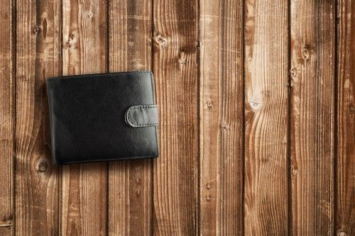
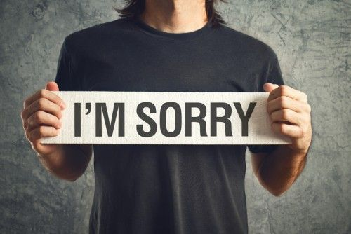

# 注意事项 {#zysxp}
## 礼仪规则 {#lygz} ^[作者：\@tumutanzi； 编辑：\@dongfengman；校对： \@meixia。原文链接：https://steemit.com/cn/@tumutanzi/6gkhr-steemit]

Image credit to [\@thecryptofiend](https://steemit.com/@thecryptofiend)

Steemit是一个[言论自由的写作发布平台](https://steemit.com/cn/@tumutanzi/5drdhx-steemit)，但这不代表这里没有规则。Steemit官方和开发者都没有提供相应的文章写作发布礼仪规则，幸运的是， [@thecryptofiend](https://steemit.com/@thecryptofiend) 写了一篇非常不错的Steemit世界礼仪规则完整版，我认为新老用户都应该熟悉，这对所有人都有好处。

我个人觉得，这些礼仪规则不只适应Steemit，也是我们每天现实生活和线上生活的礼仪原则。礼貌是世界通行证。经 [@thecryptofiend](https://steemit.com/@thecryptofiend) 授权（英文版权和本文中所有图片都来源于原作者），我将这些礼仪规则由[英文The Complete Steemit Etiquette Guide (Revision 2.0)](https://steemit.com/steemit/@thecryptofiend/the-complete-steemit-etiquette-guide-revision-2-0)翻译成中文，希望对所有中文用户有所帮助。

### 1 不要发完文章就离开

我们都有时间压力，每个人时间都有限，但如果每个人只是在Steemit上发布文章（Post）后就离开，从不阅读别人的作品，不评论（Curation），不点赞（Upvote），那同样不是一件好事。这种方式可以简单地认为是只从Steemit系统索取，而从不给予。

### 2 不要过度发布文章

正如我前面所说，大部分人并不是拥有很多空余时间，同情一下你的粉丝Follower们吧，不要每天发文10次那样的频率，过度发文不但你的粉丝们没时间阅读你所有的作品，而且你可能会扰烦到他们，从而失去粉丝们的关注。基本上，你如果每天发文超过4次，你的赞赏收入（Upvote）反而会减少。

### 3 不要发布裸露色情照片、图片，除非你打上NSFW（工作场所不合适内容）标签Tag

这很重要。在你的国家，可能在办公电脑上显示裸露胸部是可接受的，但也许在你读者的国家是不行的。你的读者也可能是个小孩。请记住，这种成人图片等内容一定要标上NSFW的Tag标签，否则你的账户很可能被踩（Flag）。

### 4 请不要制造虚假内容，不要抄袭，不要将别人作品据为己有

这点很重要。任何通过有关模仿、抄袭、剽窃别人作品来赚钱的行为，都不可接受。Steemit是一个大社区，人们在看着你的所有行为，总有一天会被查出来，请不要这样做。无论通过虚假行为取得多大的收入，都不足以弥补对你声望（Reputation）造成的损害。

### 5 不要参与Tag标签的滥用行为

你的内容如果和某个Tag不相关，请不要使用这个Tag. 一篇有关喇叭的文章恰巧有一张喇叭的图片，你不应该使用photography（摄影）的Tag. 同样，一篇讨论DASH加密货币的文章可以使cryptocurrency的Tag, 但不能使用ethereum的Tag. 滥用Tag的行为会烦扰用户（造成不相关信息），不但不会获得点赞，反而可能被人踩下去。

### 6 不要对你所读到的任何文章都转发（Resteem）

这和过度发文有些类似。转发功能很棒。它是一个新的分享方式，但请注意你的粉丝们的感受。除非他们只是为了关注你这个人本身，你要假设他们的Feed关注列表里也会出现其它的转发信息。你转发你喜欢的内容，不代表你的粉丝们也会喜欢。请礼貌地有限度地转发文章，并且只转发你有把握你的粉丝们也可能会喜欢的内容。

### 7 不要在评论里张贴不相关的链接

这会被认为是链接垃圾。我们理解，你对你的内容引以为傲，但如果你的链接与被评论的页面不相关，它会被认为只是推销你的内容，这显然不好。你很可能会被人踩下去，别人也不太可能会欣赏你这样的行为。有一个[论坛聊天频道](https://steemit.chat/)推荐用户内容，你应该使用那种形式推销你的内容链接。

### 8 请不要直接请求别人点赞你

这个有些和张贴不相关链接类似。可以在专门推销频道请求别人点赞，但应该通过间接张贴公布链接的形式，而不是张口直接请求点赞。我觉得，你可以问别人是否读过你的文章，但你直接问别人是否点赞了话，这有违合理正确点赞的精神，很不公平。别人也可能会因此感到不舒服。

### 9 不要期望互惠式点赞

如果你只是为了获得别人的点赞而点赞别人的话，这样做是错误的。你应该只为优秀的内容点赞，也不要期望因为你点赞对方，对方回馈你而点赞你，这样做就失去了点赞的意义。而且你这样作也冒犯对方，因为这说明你不是喜欢对方的内容，只是为了期望对方的互惠点赞。

### 10 不要为了点赞、转发、关注Follow行为而贿赂别人，也不要直接问人要钱

这很容易理解。你这样做的话，很可能会被踩，也会冒犯别人。另外，如果别人关注了你，不保证对方一直会关注你，对方很可能随时取消关注你，所以你这样做完全是浪费时间和损害你的声誉。

Image credit to [\@thecryptofiend](https://steemit.com/@thecryptofiend)

### 11 请不要使用钱包来吸引别人的注意

Steem钱包可以在转账时用来发送信息。但不幸的是，有人利用这个特性，通过发送很少的钱来为自己推销打广告。请不要这样做，这样不过是浪费时间，并且会招人烦。

### 12 在聊天频道使用 \@all

这样会通知所有人，很烦人。有人正在解决这个问题，打算去除这个功能，相信未来不会有这个问题。

### 13 不要直接和你不熟的人在聊天频道发送私信

我见很多人这么干，尤其是和大鲸们或者有很高Steem Power的用户发送私信。可以理解这种行为，但会侵犯别人的隐私，很不礼貌。除非对方特意说明这样做是可以的，否则就不要这样做，比如，私信向Steemcleaners报告不端行为，又或者真的有必要的理由这么做——只是为了分享你的文章不是一个好理由。

### 14 不要因为你不同意别人的文章或者不喜欢别人的文章就踩别人

这是一个大问题，我相信有人不同意我的这个观点。但我觉得Steemit社区的大部分用户同意这样的观点：踩的功能是用来处理有害的内容或者滥用行为，而不是用来表明你不喜欢某个用户或者文章的按钮。不喜欢某个人的文章或者东西？发表你的评论，解释为什么，或者你不能被这样的文章打扰，或者没有时间继续。

### 15 不要成为一个跟踪者或一个怪人

曾经有一位用户，专门以令人讨厌的方式跟踪Steemit社区里的女性用户。有人也许认为这在网上是可以接受的行为。但我个人认为这种行为很恶心，也不可理解。幸运的是，声望评价系统可以屏蔽静音这些用户。但我也有必要申明，我们不接受充满这种用户的社区。另外，任何与与犯罪擦边的行为是很愚蠢的，因为Steemit基于区块链，它会记录你的所有行为。就更不用说，这种行为无助于增长你的声望分。

### 16 不要把未成年人式的幼稚评论展现给别人

我注意到，少量用户对女性照片品头论足，且观点非常不成熟，老实说，我认为这只会是一个13岁男孩才会有的观点。我知道，这些用户也许没有恶意，但我们这个社区也需要友好地欢迎女性用户加入。你幼稚地品头论足，没有一点好处。男性也许觉得很搞笑，但女性可能就不一定了，想象一下你母亲在读这些内容的感受。

### 17 不要做一个戏剧女王

我们都有不愉快的日子，我们也都成为过令人讨厌的人，但最好采用成年人的方式来处理这些不快。但有的人采取彻底清除这些信息并重新编造一些不必要的假把戏。长远来看，这看起来并不好，只会让你更尴尬。尤其是，所有信息都保存在区块链上，永久地展示给你和别人。

### 18 不要搞群体式攻击

这种现象不新鲜，但似乎发生得越来越多。人们以我觉得不太好的方式形成团体，我觉得你可以指出某个问题，或者不公正的现象——除非某人在特意做一些怀有恶意的事情——否则会使得Steemit社区变得更加不友好和不受欢迎。尤其是当多人恶意围攻某一个人的时候，我觉得这令人震惊。

### 19 不要针对某个人，不要制造引起争议的文章

也许因为我是英国人，但我觉得你如果不事先与对方私下商量解决问题，就专门写文章针对对方，这是不礼貌的。你如果就某个行为有问题的话，更有效的是用常规办法解决，而不是专门写一篇文章让人觉得被单独挑出来，很不好受。否则，挑起争议后，也许事态会升级，最后每个人的脸色都不好看。

### 20 不要批判别人的作品，除非人家请求你这样做

我通常问别人对我作品的看法意见，我也能接受别人批评（虽然我也会有些不快），但是别人发布了某篇文章作品，不代表你因为不喜欢就可以开始批评。并不是每个人的脸皮都很厚，我也见过一些例子，有些人以不正当的方式抹黑别人的作品。同样，如果别人请求你评判，请保持礼貌，并提供有建设性的意见。如果你不能评判，那就不要评判。

Image credit to [\@thecryptofiend](https://steemit.com/@thecryptofiend)

### 21 错了就认错道歉

我有一个年纪大的老师，说认错需要诚实和勇气。我们似乎都喜欢表明自己什么都是对的，尽管有时候我们就是错了。人们会宽容你的错，尤其是你是一个偶像的时候，认错反而会得到更多的尊重。

### 22 宽恕别人

这是认错的另一面。我们都会犯错。如果某人认错了，并试图改错，请给人一次机会。怀有憎恨，不但伤害对方，也伤害你自己和整个社区，也让你看起来很狭隘和不成熟。成年人的一个特点是容纳别人的失败和自己的失败。正如我之前说的：是人都会犯错。

### 23 该退就退一步

应对上述有些观点，有时候退后一步，离开电脑，做点其它事情，反而有帮助。如果太多的争论和冲突，给自己时间远离这些纷争，反省自己。

### 24 回复你收到的留言评论

如果有人花了时间在你的文章下面留言评论，你至少要花点时间去阅读，在有必要的情况下，回复他们。能理解，当你有太多的评论时，你无法一一回复。但是，完全忽视你收到的评论留言，是不优雅的行为。

### 25 帮助人，并感谢帮助你的人

许多人知道加密虚拟货币，熟悉这个概念。但这不代表Steemit上的每一个用户都知道。如果他们有问题需要帮助，请尽可能帮助他们。这是一个好社区的基石。也不要忘了感谢帮助过你的人。

### 26 分享好文章

在每篇文章下面，都有社交分享的按钮，可以分享到Twitter, Facebook, LinkedIn. 一个好用户，应该乐于在社交媒体上分享好文章，同时把链接贴在"postpromotion-other-only"聊天频道。这不但有助于宣传文章的作者，也有助于宣传Steemit，告诉人们，优秀的内容在Steemit上。Steemit不应只是某个人的Steemit.

### 27 检查新人发布的文章和评论点赞

每天都有新人加入Steemit，不幸的是这些新人很难得到关注。请试图花点时间看看新人的文章（New），而不只是查看你自己的Feed列表或者Trending上的热门文章。这样做，你不但有可能会发现一个隐藏的受到宠爱或评价很高的新用户，也会让新用户感觉到关注和高兴，而且你会得到更多的点赞回报。这也同样适合于聊天，如果你期待别人看你贴的链接，你也应该看看别人贴的链接。

### 28 当你踩人的时候，请留下评论留言，并记得回来检查它

简单的礼仪就是，你踩别人的文章时，应告诉作者你的理由，除非已经有人留言给出和你同样的理由。你也应该回去检查一下文章，如果作者做出相应改正的话，你应该撤消踩的操作。随便踩别人的文章或者撤消踩的行为，都是不公平的。

### 29 请提供身份验证

这和第4点相关，因为我想把所有“务必做”的建议放在一起。生活中，常常有些不诚信的人让我们很难相互信任。你不是必须验证你自己的身份，但你如果能表明你自己身份的话（新用户建议写篇文章自我介绍），会更容易获得信任，也能得到更多的点赞——我们不喜欢不诚信的用户，不喜欢马甲用户，也不太喜欢大部分的机器人账户。也有一些更安全的能验证表明你身份同时保护你匿名性的方法，请阅读 [\@reneenouveau](https://steemit.com/@reneenouveau) 写的[这些优秀文章](https://steemit.com/steemit/@reneenouveau/verification-and-you-how-why-how-to-ask-and-how-not-be-a-usd-about-it)。

### 30 请经常阅读你参与的聊天频道规则

不用说，在聊天频道发文时，你应该首先阅读规则。也许你会犯规，那就承认错误。但你一而再再而三地犯规，那可能会永久性地被静音屏蔽甚至失去聊天的资格。

Image credit to [\@thecryptofiend](https://steemit.com/@thecryptofiend)

## 个人隐私 {#grys}

基于@nostalgic1212原帖[【Vickyのsteemit小感悟】关于steemit上的肖像权和隐私权问题｜月旦评](https://cnsteem.com/cn/@nostalgic1212/vicky-steemit-steemit)重新编写

一月中旬的某一天，微信上收到陌生人的消息（我的微信没有开启好友验证，所以任何人都可以直接发消息过来），自称是区块链创作微信群看到我的账号，是新人，希望我给他的文章点赞，并附上了链接。

作为新人，希望自己能快速地融入这个集体，写出来的文章得到点赞，这点想法并没有任何问题。因此，我立刻点开了链接想要去upvote（点赞）和留言表示支持。

一点进去我就懵了。打开帖子进入眼帘的是个漂亮女孩子的照片，再返回微信，从聊天记录来看对方应该是个男孩子。我再度切换回他的那篇文章往下拉，看到两人的合照。回到标题，再细细阅读了文章，大抵是个失恋的故事。

我返回微信，对他说：
> 如果说分手了的话我建议你把对方的照片删掉吧，合照把对方打上马赛克。这里七天后就不能对文章内容进行修改，毕竟是涉及到对方隐私的事情，还是希望你可以慎重对待。

他回复道：
> 我就是想要永久的保存这段记忆和照片。

我想他可能没有意识到问题的重要姓，接着对他说：
> 要永远保留照片的方式有很多种，你大可以放在网盘或者硬盘中，而不是以这种公开的方式。请你撤除或修改图片，好了以后告诉我，我会去给你点赞留言。

这件事情让我思考良久。steemit算是一个比较小众的平台，身边知道并在使用的人非常少，因而遇到熟人的可能性会比较低，但难保万分之一的可能真的有熟人。试想一下，如果当事人被朋友提醒，找到帖子来看，发现自己的照片被堂而皇之的挂在网上，自己的私事在未知的情况下被人们讨论，心里该是多么的震惊和恐惧。

刚好我今天下午比较空，于是专门去找了关于肖像权和隐私权的资料。

关于肖像权：民法通则规定“**公民享有肖像权，未经本人同意，不得以营利为目的使用公民的肖像。**”

关于隐私权：隐私权是指自然人享有的私人生活安宁与私人信息秘密依法受到保护，不被他人非法侵扰、知悉、收集、利用和公开的一种人格权，而且权利主体对他人在何种程度上可以介入自己的私生活，对自己的隐私是否向他人公开以及公开的人群范围和程度等具有决定权。隐私权是一种基本人格权利（法学名词）。

从民法通则关于肖像权的规定中我们可以明确的得到两个关键字：**未经同意和获得营利**。在上述那个例子中，显然那个男生是没有征得对方同意的。至于营利，即使其发表的主观目的不是赚钱，但大家的点赞是能为他带来收益的。我不是法学专业的，但仅从民法通则的浅显理解来看，这个举动是有侵犯肖像权嫌疑的。

抛开那件特定的事，放眼平时的情况下，要每张照片都得到别人的许可显然也是不现实的。比如你去参加某个偶像的演唱会，拍了现场照片发到社交网站上为偶像疯狂打call，那时候显然不可能征得参加演唱会的出现在你照片里的每一个人的同意。在这种情况下，肖像权和隐私权的界定就会变得比较困难。

因而我觉得，对于会产生收益的情况，应当告知对方：
> 我拍摄了你的照片，并将用于网上。这个举动会给我带来一定的经济回报，请问是否可以？

对于非赢利为目的的，应该报以善意且以不给对方的生活带来困扰为前提。如果照片中会出现比较明显的面部的时候，是朋友的最好还是征得对方的同意，不然就和对陌生人的处理方式一样，用马赛克处理一下。当对方感到自身隐私受到侵害，要求停止使用其照片的时候，我们应该立刻撤除。

过去我们在博客、微博、朋友圈等社交平台上发自己的个人照片，总是可以在不想要公开的时候，删掉就好了。但大家不知道的是，其实很多情况下，删除的只是你页面上的显示，通过网页快照或者一些搜索方式，自以为已经删除的照片其实依然可以被有心人翻出来。

这在steemit上就更严苛了，我们都知道留言一旦被回复以后就不能删除，发的文章七天后就不能编辑，所以无论是发自己的照片/隐私的事情，还是发别人的，都要慎重啊。

题外话：

偶尔我在文章配图中会使用自己的照片，但基本在7天内会撤除。曾经有极力拉某位朋友加入steemit，她回复说：
> 我不喜欢不受自己控制的平台。

在编写这篇文章的时候，前辈@maiyude留言如下：
>
> 在这里写文章非常的矛盾，我们既希望让大家更多的认识自己，又不希望太多的暴露个人私隐。
>
> 而且这里的文章又删不掉。有心的人甚至可以从你的文章找到你的全家人的模样，你喜欢吃什么，你是什么工作，甚至你的实际坐标。
>
> 想想挺可怕的。

## 图片版权 {#tpbq}
版权是一种无形的知识产权，由于版权的限制，别人并不能随意使用版权所有者的文字、图片、音频和视频等，不按照要求而随意使用具有版权的内容，会有侵犯版权的风险。

同时，出于对版权所有者的尊重，我们在steemit上写作的时候，如果有引用他人的内容（包括但不限于文字、图片、音频和视频等），就应该也最好按照其版权要求来引用之。

在steemit上发布文章的时候，我们往往会喜欢添加一些图片以丰富文章的内容，简单的说一下图片的版权。

#### 从版权的角度看，如何引用图片？

1. 如果图片是你的，那么你可以随心所欲的使用你的图片。

2. 如果图片不属于你，那么你应该也最好按照图片的版权要求来引用图片。比如有的图片禁止引用，那么我们就不能引用这些图片；有的图片要求署名和标注图片来源，那么我们就在引用图片的时候署名和标注其来源。

由于图片版权的引用要求各有不同，比较稳妥的做法是如条目1使用你自己的图片，或者如下面的条目3使用没有版权限制的图片。

3. 没有版权限制就是说你所引用的图片本身就没有版权或者所有者放弃了其版权，我们可以自由的引用这样的图片。

#### 可以自由使用的图片的分享网站。

由于界定某个图片是否具有版权会有一些麻烦，所以在这里推荐给大家一些可以自由使用的图片的分享网站，它们有一些共同的特点:

. 不用指出图片的来源地址

. 可以用作商业或者用以获利

. 可以自由的修改等

这些免费的图片网站分别是：

- https://www.pexels.com

- https://pixabay.com

- https://unsplash.com

*以上图片网站的具体版权要求可能会在以后有所变动，请具体参照其网站要求来引用其分享的图片。

#### 参考文章：

https://steemit.com/cn/@blacktranquility/3cfyjj

https://steemit.com/cn/@blacktranquility/pexels

https://zh.m.wikipedia.org/wiki/Wikipedia:版权信息

https://zh.m.wikipedia.org/wiki/著作權

## 关于偷窃 [作者：\@dongfengman]

在加入STEEM之后，你可能会看到别人单篇文章收益就那么高，所以萌生了每天发很多篇来获得更多收益的想法，而这多篇文章怎么来，你可能会去其他网站上直接拷贝粘贴过来，或者未经作者同意直接转载过来，又或者摘取别人的文章段落然后东拼西凑/改改措施/颠倒顺序发出一篇文章，俗称洗稿。

如果你已经有这样的想法，请务必不要行动；如果你已经在做了，请停止。因为这些行为统称为剽窃。

- 什么是剽窃
剽窃，英文是plagiarism，又称抄袭，拷贝粘贴，洗稿，未经授权的转载等都属于剽窃。

根据教育部国语辞典定义有

> 抄录他人作品以为己作。对于原着未经或基本未经修改的抄录，这是一种侵犯着作权的行为。

Wikipedia的英文版定义如下

> Plagiarism is the "wrongful appropriation" and "stealing and publication" of another author's "language, thoughts, ideas, or expressions" and the representation of them as one's own original work.

牛津英文字典定义如下

> The action or practice of taking someone else's work, idea, etc., and passing it off as one's own; literary theft.

从种种定义看，剽窃行为是极其可耻的行为，它是一种偷窃行为，偷窃他人的作品，据为己有。
在STEEM平台写文章请务必避免剽窃他人，因为剽窃会给你带来不可挽回的后果。

- 剽窃的后果
在STEEM平台，一旦发现剽窃的文章，将会受到惩罚或者警告

- 1.被别的STEEM伙伴发现，踩灰你的文章。
- 2.你可能会被@cheetah盯上，这个家伙每天都会报告STEEM平台中可能是剽窃的文章，并会在疑似剽窃的文章中留言提醒。
- 3.如果你参加一些STEEM平台的活动，你可能会发现，很多活动会有下面的一句话
> 如有抄袭、剽窃，零容忍，一经发现，将会被列入黑名单

- 避免剽窃他人的方法
- 1.坚持原创，文字也好，图片也好，动图也罢，视频就更加，不要图省事，赚眼球点赞的快钱，误入歧途，长期来看，坚持原创才是最赚的。
- 2.有时候可能会引用别人文章的段落来说明一个问题，那么，引用就要写明或者注明出处、来源。
- 3.有时候要为文章配图，你可能无意间就拷贝粘贴了网络上的图片，那么请参考[图片版权]章节（抱歉，这个章节还没完稿，嘿嘿，@blacktranquility，靠你咯）的做法。
- 4.真的需要转载他人的文章，请取得原作者的授权许可。

- 如何应对被他人剽窃
- 1.坚持长期写作，并形成自己的风格，这样自己写的文章会逐步出现类似文章指纹的东东，就算被人剽窃，文章一看就是你的风格，可辨识度高，如果有人长期剽窃你的文章，那么请参考第二条。
- 2.坚持举报剽窃，一旦我们发现有人剽窃，应该坚决举报，并且踩灰这篇文章。

- 举报方法
请到这个网站登记举报：https://steemcleaners.org/abuse-report/

## 健康心态 {#jkxt}

## **如何克服steemit成瘾现象[作者：\@vickylin]**

写这篇文章的时候，我对着跳动的光标，发呆了很久。是的，我今天要讲steemit成瘾这个问题。

加入steemit的原因有很多种：有的人因为知名博主/@tumutanzi振臂高呼下奔着“Monkey Talks·笔下生金”，涌入这里认为可以在这里可以掘人生第一桶金的；有的人才华横溢（画画、手工制作、写作、唱歌等），人的人热爱分享生活（美食、美景、萌宠等），他们在这里找到一个志同道合的平台；也有人是为了逃避现实，他们也许生活不如意，有也许不善于社交（现实和虚拟世界的社交有差异），在这里找到生活的一个支点，防止现实生活中无处堆放的说话欲。

我算是第二种和第三种的结合体。了解我的朋友，大致知道我是因为什么原因在1月初加入steemit的，这里极大程度的转移了我的注意力，这是件极好的事情。然而在1月底的时候，在家人的提醒下我发现自己出现了以下**症状**：

1. 利用一切碎片时间（等红灯、做菜、洗衣服、坐捷运）刷Feed，看timeline（时间线）里有哪些更新，查看和回复留言；

2. 生活中的一切都围绕着Steemit（过去微信从不加微信群，现在有五六个，并且每次都会把每条留言都看过来）；

3. 看到好玩好看的第一个反应是：诶？这个我可以拿来做写东西的素材（比如以前我看电影/电视剧纯粹为了刷片和娱乐，现在会刻意暂停写下笔记和感受）；

4. 半夜醒来摸手机查看Steemit（原本睡眠已得到矫正的我再度陷入三四小时醒来一次的窘境，睡眠质量严重下滑）；

5. 一天大部分时间都花在steemit上，减少了和家人朋友说话的时间；

6. 大部分话题围绕steemit和上头发生的事情展开（原本陪伴亲友的时间已经减少，陪他们讲话的时候还在把话题往上头带）；

7. 健康受到影响（最直接的就是眼睛、腰和肩颈）；

以上这些你占了多少条呢？如果半数以上，那可能你也有steemit上瘾的倾向。

2月初的时候，我决定正视这点，首先问了自己几个问题：

1. 我为什么来这里？

2. 这里能给我带来快乐吗？

3. 我这么做对我的健康有影响吗？

4. 值得以身体健康做代价来换取这里得到的吗？

我必须承认一点，steemit带给我很多快乐，但这一个月来我的身体状况却并不乐观。我必须要正视这不是一个健康的生活方式，从长远的角度来看，会让我渐渐和现实世界切断联系。作为本来就有些抑郁症的我来说，无疑是雪上加霜。

我不得不让自己从steemit上抽离出来，刚开始这样真的很煎熬，就如同和恋人刚分手的感觉一般无二。我会感觉自己生活里的一部分仿佛被抽离，焦虑并惶恐不安，有时候我会抑制不住地拿起手机、ipad或者开启电脑去刷新页面。即使过程反复也很难，但现在我做到了。分享一下我做的事：

1. 为自己在steemit设置上限时间。从一开始的一天15个小时，渐渐减少到10小时、8小时、5小时，到现在的4小时。这4个小时里，我会浏览feed里好友的更新、评论及回复留言、发表新的帖子。虽然这样我会无法第一时间给好友留言的，也无法看到最新的动态，但我相信这并不重要。我目前参加了CN区的翻译组和《Steem指南》的编写和整理，这些工作有时也包含在4个小时内；    

2. 为自己找个走出去的理由。就算是为了写东西找素材也好，只带上手机，去吃一顿好吃的、晒太阳、踏青，或是去看一部电影，和好友去ktv鬼吼几小时也好，让眼睛短暂离开屏幕。要不是陪了拍照，我连手机都不愿意带出去；

3. 为自己在现实世界找个“锚”。你可以选择友情或者爱情，我选择的事亲情。在家的时候，陪妈妈烧饭做家务，饭后同她一道散步，聊聊一天工作中遇到的事，开心或是愤怒的都无关紧要。工作或是学业也是不做的选择，遇上忙的阶段我曾白天没刷一条Feed；

4. 转变自己对steemit的观点。一度我对自己说：如果我不每天发贴，不去和大家互动，那就会被遗忘，也不会有人来看我的文章了——其实这和我对爱情的观点有点像，时常因为害怕被遗忘而猛刷存在感。事实上，这完全是我一厢情愿的想法。个人觉得，让别人记住你，比起一直刷存在感，能持之以恒的提供有效的输出更为重要。

在评论里有看到留言：
> 自从托管能量给机器人，我就再也没有力气点赞了，连blocktrade这两天也用不了，我的毒都消失了。

突然想起自己刚注册那会儿，帖子不敢多看，互动更是小心翼翼地扳着手指计算条数。那会儿想成瘾都不行，毕竟没有SP你啥也做不了。这么一想，我又默默地代理了10SP到YY银行，后期应该还会代理更多出去。想来这也是个不错的方法，从本质上让自己没法耗大量时间在上头，朋友们也不妨一试。

自从再次回到常规的生活，最直接的感觉是，视疲劳的状况缓解了，并且与亲友的关系更加融洽。这样的舒适感，也让steemit给我带来更多的欢乐。也因为此，我可以更为专注于自己的写作，给大家呈现出比之前更为优质的内容。

