# 辅助工具 {#fcgjp}
## oflyhigh 的微信公众号 steemit ^[本文由 \@dapeng 根据 \@oflyhigh 的帖子整理而成。] {#oflyhigh_dwsgyh_steemit_dsyff}

有一款 steem 信息查询工具，不用不知道，用了离不了。精致小巧，功能丰富，它是 STEEM 用户的一把瑞士军刀。

这款工具可以帮助你实时查询各种重要的 steem 信息，包括一个账号的 SP、声望、VP、钱包；可以为你提供发文收益百分比的建议；可以提供各种电子货币的实时市场价格……

事实上，类似的工具有不少， 但这款工具的绝妙之处在于，它是个微信公众号。你可以享受微信平台提供的一切便利，例如节省流量、反应迅速、方便转发等。只需在微信上关注它，就像跟朋友聊天一样问问题，它就会告诉你答案，实时从区块链直接读取。

这个微信公众号叫“steemit”，全称 “STEEMIT 学习与实践”，昵称“萌蛋”。它的开发者是 \@oflyhigh 。

使用这个工具的前提是，你得有微信。只需进入微信通讯录，点击公众号，点右上角加号，搜索`steemit`，关注即可。或者直接扫描以下二维码：

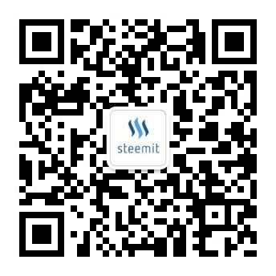

目前，萌蛋主要有三个功能：

1. 定期发布《社区周边事》

2. 智能机器人聊天

3. 提供 steem 查询信息

其中，《社区周边事》是由 \@deanliu 和 \@wilkinshui 编写的杂志，提供重要的社区资讯；智能机器人聊天是一项自动聊天功能，无聊的时候你可以跟萌蛋谈天说地，比如你对这个公众号发条信息“你是谁”，萌蛋会回答“我是棒棒哒萌蛋”；你说“我失恋了”，萌蛋会回答“中华儿女千千万，实在不行咱就换”（听这语气萌蛋像是东北人）……萌蛋还可以给你讲故事、讲笑话、翻译、查天气、算算术等等，这里按下不表。

在这里，我们重点介绍的是 steem 信息查询功能。萌蛋提供的信息大体分三类：账户信息，市场信息，系统信息。

### 查询账户信息

**`@steemid` 查询账户概览**

发送 \@steemid，就可以查询账户信息概览。比如我们查查 \@ned 的账户概览信息：


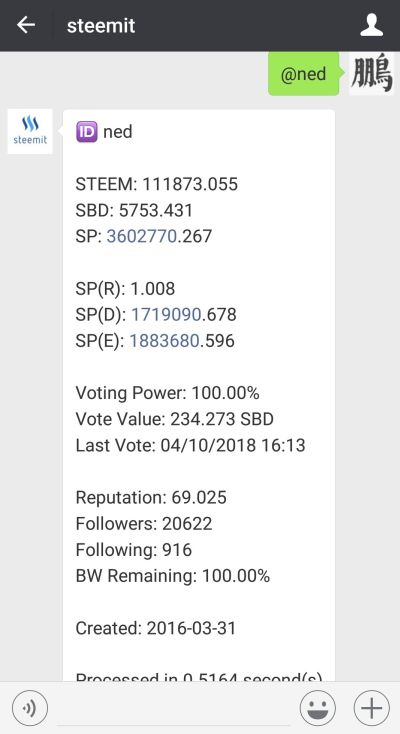


翻译过来，就是：

```
STEEM: 111873.055
SBD: 5753.431
SP: 3602770.267

收到的代理Steem Power: 1.008
代理出去的Steem Power: 1719090.678
有效 SP: 1883680.596

投票权百分比: 100.00%
点赞价值: 234.273 SBD
最近点赞时间: 04/10/2018 16:13

声望: 69.025
粉丝数量: 20622
追随数量: 916
剩余带宽: 100.00%

注册日期: 2016-03-31
```

如果这个账户在 Power Down，那么还会增加两行：

```
Next PowerDown STEEM: 
Next PowerDown Time:
```

分别是下次 Power Down 的 STEEM 金额和时间。

除了用`@steemid`查询账户信息概览，我们还可以为这条命令后面添加参数，来查询账户的各类详细信息。

**`@steemid?vv` 查询点赞价值**

vv的意思是votevalue，即投票（点赞）价值。例如，发送留言`@dapeng?vv`，萌蛋的回答是：

```
Voting Power: 70.95%
Effective SP: 5446.72

Vote Value(Current VP):
---> 0.597 SBD
Vote Value(Full VP):
---> 0.841 SBD

Last Vote Time(UTC):
---> 2018-04-14 05:25:18
Current Time(UTC):
---> 2018-04-14 05:52:37
```

翻译过来就是：

```
投票力: 70.95%
有效 SP: 5446.72

投票价值(当前投票力):
---> 0.597 SBD
投票价值(当投票力满血时):
---> 0.841 SBD

最近一次的投票时间(UTC):
---> 2018-04-14 05:25:18
当前时间(UTC):
---> 2018-04-14 05:52:37
```


**`@steemid?as` 查询账户资产**

as的意思是assets。我们来问问萌蛋，`@ned?as`

```
STEEM: 111873.055
SBD: 5753.431
SP: 3602771.723

STEEM(Savings): 0
SBD(Savings): 1249.949

STEEM(Market): 0
SBD(Market): 0

STEEM(Rewards): 0
SBD(Rewards): 787.162
SP(Rewards): 3971.979

SBD(Conversion): 0

Total STEEM: 111873.055
Total SBD: 7790.542
Total SP: 3606743.702
Value(EST): 3907817.843 SBD
```

得到的答案分 6 部分，相邻部分用空行分隔：

- 钱包资产

- 存款账户((Savings)

- 内部市场资产(Market)

- 待收取收益(Rewards)

- 转换中SBD资产(Conversion)

- 总资产(Total)和账户估值(EST)

**`@steemid?mt` 查询谁拉黑你**

mt的意思是muted。我们看看谁把 \@ned 拉黑了，只需发送留言 `@ned?mt`：

**`@steemid?po` 查询最近文章**

po 的意思是 posts。发送留言 `@dapeng?po`，会显示文章序号、文章标题、点赞人数、收益金额。

文章取个人博客的最近10篇文章，为了减少干扰，去掉了转发(RESTEEM)的内容。取决于你最近十篇博客是否有转发内容，显示的内容会等于或者少于10篇。

**@steemid?dg 查询SP代理给了谁**

dg 的意思是 delegations。这条指令无须多做解释，返回的结果是这个 id 往外代理 SP 的对象，数额和时间。

```
@ned?dg

To: keygen1
SP: 14.510
VESTS: 29577.648341
MDT: 2018-04-29T19:41:51
```

**`@steemid?fd` 查询用户feed**

fd 的意思是 feed。输入**@steemid?fd**，就可以查看对应ID的feed列表中最新五篇文章，不用多做解释。


**`@steemid?pdr` 查询P账号的 owerDown 路径**

pdr 的意思是 Routes。关于 PowerDown 的路径，详见：https://steemit.com/security/@oflyhigh/power-down-routes-withdraw-routes


**`@steemid?w` 查询见证人信息**

w 的意思是 witness。如果查询的 id 是见证人，那么这条留言就可以得到见证人的信息。例如：

```
@abit?w

-------------------
Owner: abit
WID: 952
Rank(Votes): 34
Rank(Real): 33
Status: Online
Type: TimeShare
Version: 0.19.2
Reg Fee: 0.100 STEEM
Block Size: 65536
APR : 0.00%
Missed: 187
Approval: 31171M (8.03%)
Feed: $15.607
Last block: 21553187
Rewards(per Block):0.968
Blocks(Day):35.352
Rewards(Day):34.227
-------------------
Processed in 0.5817 second(s)
```

解释如下：

- `Owner`: 见证人的所有者

- `WID`: 见证人ID

- `Version`: 见证人节点版本号

- `Reg Fee`: 账户注册费

- `Block Size`: 最大块大小

- `APR`: SBD年利率

- `Missed`: 丢块个数

- `Approval`: 总投票量以及占比

- `Feed`: 喂价

- `Last block`: 最后确认的区块编号

### 查询市场信息

用萌蛋可以很方便地查询各种电子货币的市场信息。

**`tk` 查询内部市场报价**


tk 的意思是 ticker。Steemit 的市场（Market）界面，可以将文章收益的 SBD 购买成 STEEM 然后POWER UP，还可以通过低买高卖赚取差价，最重要的是内部市场交易，没有手续费。用 tk 来查询实时价格，有助于你迅速对市场做出反应。

```
tk

Bid: $1.011829
Ask: $1.033194
Last price: $1.028546(0%)
24h volume: $25310.59
24h volume: 24080.299 STEEM
Processed in 0.2387 second(s
```

其中：

- Bid: 出价，亦即购买，这里显示买单中出价最高的

- Ask: 要价，亦即出售，这里显示卖单中叫价最低的

**`ob` 查询市场订单信息**

ob 的意思是 order book。发送留言 `ob` 给萌蛋，就得到如下回复：

```
Buy Orders:
1) Price: 1.000998
SBD: 105.225 STEEM: 105.120

2) Price: 1.000000
SBD: 76.639 STEEM: 76.639

3) Price: 1.000000
SBD: 0.016 STEEM: 0.016

4) Price: 1.000000
SBD: 0.012 STEEM: 0.012

5) Price: 1.000000
SBD: 0.021 STEEM: 0.021

Sell Orders:
1) Price: 1.001033
STEEM: 68.855 SBD: 68.926

2) Price: 1.010787
STEEM: 37.268 SBD: 37.670

3) Price: 1.025000
STEEM: 0.040 SBD: 0.041

4) Price: 1.032976
STEEM: 2.517 SBD: 2.600

5) Price: 1.033079
STEEM: 664.927 SBD: 686.922

------

Processed in 0.2326 second(s)
```

给出了买（buy）和卖（sell）的价格（price）。可以简单理解成

- 提供SBD，想得到STEEM的行为为买。

- 提供STEEM，想得到SBD的行为为卖。

**查询 BTS 等价格信息**

公众号输入电子货币的简称，就可以返回该货币对人民币CNY或美元USD的价格。目前萌蛋支持查询的指令包括：

- bts

- yoyow

- eos

- steem

- open.btc

- open.eth

- gdex.btc

- gdex.eth

- open.doge

- open.sbd

- ipfs

不用多做解释，都可以顾名思义。

除此之外，还可以用`!bitshares_id`格式的指令来查询某个账号在 bts 的资产情况。这些指令跟本书关系不大，因此就不详细介绍了。


### 查询系统帮助信息

**`pu` 发文建议信息**

pu 的意思是 power up。在发帖的时候，Rewards 一栏会有 50%/50% 和 100% 的选项。对此的解释详见[这里](https://steemit.com/steemit/@oflyhigh/to-power-up-100-or-not-that-is-the-question-100-power-up)。发送留言 pu，萌蛋会告诉你发帖时该选择哪一个才最划算。

```
pu

Feed Price: 1.805
Market Price: 1.033
SBD Prt Rate: 88.66%

Reward:100.000 SBD
Curation: 13.850 SP

Power UP 100%
Steem Power: 41.551
系统估值:75.000 SBD
市场价格:42.932 SBD

50%/50%
Steem Power: 20.776
SBD: 33.248
STEEM: 2.356
系统估值:75.000 SBD
市场价格:57.148 SBD

发文建议: 
Default(50%/50%)
```

在这条长长的信息里，先是假设一篇文章 100SBD 作者收入，在当前行情下，不同选择的估算价格以及市场价格，萌蛋会给出相应的建议。如果你不懂每行的具体含义，那么就看最后一行就行了。

**`info` 查询区块链信息**


```
info

API Ver: 0.19.4
-------------------
Head: 21581487
Irreversible: 21581472
Feed Price: 2.596 SBD/STEEM
Market Price: 1.086 SBD/STEEM
Total Accounts: 943657
Blockchain Time: 2018-04-15T06:38:33
-------------------
Processed in 0.5531 second(s)
```

解释如下：

- API Ver 是 API 节点版本

- head 和  irreversible 分别是最新区块编号以及最新不可逆区块编号。当需要遍历区块的时候，这两个很有用。我们的程序不正常的时候，可以与这两个区块对比一下，看看是不是程序延迟太大。

- Feed Price 和 Market Price：喂价和市场价，分别代表 STEEM 的c urrent_median_history_price 以及 STEEM 在内部市场的当前价格。这个价格信息和`pu`指令返回的部分内容相同。

- Blockchain Time 是最新区块的时间。

**`?`查询帮助信息**

上面介绍了这么多查询指令，怎么可能记得住呢？别担心，萌蛋会贴心地提醒你有哪些指令可用。只需发送留言**?** 或 help 或`帮助`，就会返回一个简短的帮助。

```
?


欢迎来到STEEMIT学习和实践!

@steemid 查询账户信息
@steemid?vv 查询投票价值
@steemid?as 查询账户资产
@steemid?mt 查询谁拉黑你
@steemid?po 查询最近文章
@steemid?dg 查询SP委派
@steemid?fd 查询用户feed
@steemid?pdr 查询PowerDown Routes
tk / ?ticker 查询市场报价
ob / ?orderbook 查询订单信息
pu / ?powerup 发文建议信息
bts 查询BTS价格信息
yoyow 查询YOYOW价格信息
open.eos 查询OPEN.EOS价格信息
open.btc 查询OPEN.BTC价格信息
open.eth 查询OPEN.ETH价格信息
open.steem 查询OPEN.STEEM价格信息
gdex.btc 查询GDEX.BTC价格信息
gdex.eth 查询GDEX.ETH价格信息

指令说明：
vv=votevalue
as=assets
mt=muted
po=posts
dg=delegations
fd=feed
短指令长指令效果相同指令

指令示例：
@oflyhigh
@oflyhigh?vv
@oflyhigh?assets
....
```

以上我们用三篇帖子介绍了微信公众号 steemit 也就是萌蛋的常用功能和用法。更多的功能仍在开发中。一般情况下，每有新功能推出，萌蛋的主人 \@oflyhigh 都会在 steemit.com 发帖详细介绍。如果你感兴趣，那么就请关注他吧。

## justyy 的在线工具和 API 接口 {#justyy_dzxgjh_api_ckdsyff}

### STEEMIT API 服务器
\@justyy 提供了4个免费的STEEMIT API服务器 分别于世界不同的地方供免费使用 (fair use policy)，API接口 (End Point) 是 `/api/steemit/`

- 美国东部: helloacm.com
- 日本东京: happyukgo.com
- 英国伦敦: uploadbeta.com
- 美国西部: steakovercooked.com

### 踩人与被踩 ^[作者：\@justyy, 原文链接：https://steemit.com/cn/@justyy/3czrdz-steem]
这两天 [utopian.io 被黑 - Utopian.io 被黑，你可能关心的一些问题 / 如何移除授权](https://steemit.com/utopian-io/@oflyhigh/utopian-io) 你可能想知道自己有没有中招。中招的表现就是你会当枪使：去踩 haejin。

踩在STEEM上是标红旗的动作，一般来说就是文章三观不正，但也经常被误用于表示情绪的不满。踩人最直接的表现就会让该帖子收益变少(如果踩人者的有效ESP、能量都很足的话)，甚至能让帖子变灰，也可能让作者的声誉值变少（如果踩人者的等级比被踩者的高）。

**查看你踩人的记录**
工具地址：https://helloacm.com/tools/steemit/list-of-flag/
支持URL后 ?id=steem_id 帐号参数

填写ID 然后点击按钮稍微即可得到该帐号过去一年内踩人的记录。

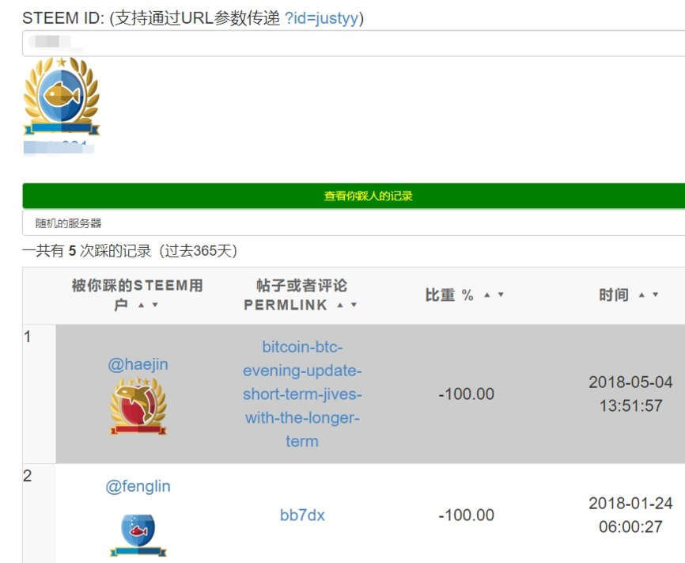

**被踩**
类似的，如果是查看别人踩过你的记录，那么请用工具：
https://helloacm.com/tools/steemit/who-downvote-you-steemit/

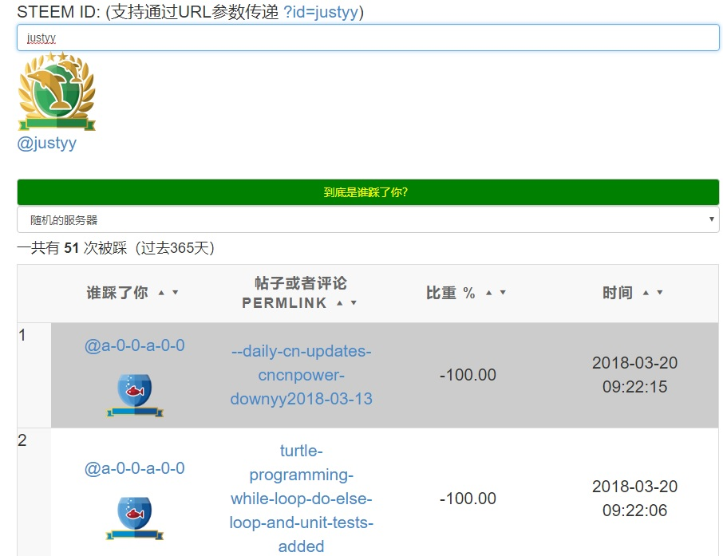

**踩人与被踩都如泼出去的水**
区块链总是会忠实的记录你的一言一行。比如A踩了B，之后撤消了，这样也会被显示在结果中，因为只要踩过，这就会被记录在STEEM区块中，大概类似是：

> 块 12345: A downvote (-100) B
> ...
> 块 12349: A unvote B

所以，踩之前请三思！

### 同时给多个帐号发送SBD或者STEEM ^[作者：\@justyy，原文链接：https://steemit.com/cn/@justyy/steem-justyy-api-sbd-steem]
STEEMIT 和 BUSY 的前端都有一个内置的钱包工具，您可以一次给一个帐号发送 SBD 或者 STEEM。当我们要给很多很多人发送钱的时候，就显得有些不方便了。这时候可以用这个在线工具：

https://helloacm.com/tools/steemit/wallet-tool/

**填写表单**
只需要填上你的ID、私钥(active key)、需要发送的金额（最少0.001）、选择SBD或者STEEM，然后把收款人的ID放在每一行上，如下：

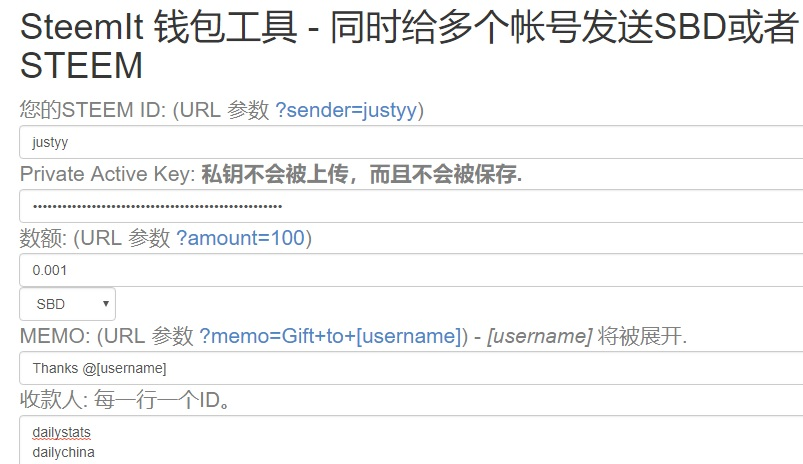

MEMO 就是附言，这里可以用 *[username]* 来替代收款人的ID。私钥不会被上传或者保存，只会在浏览器中调用 steem.min.js 的时候使用到。

点击 *发送* 将会有一个最终确认：
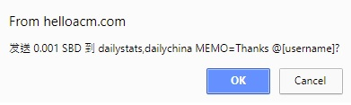

然后显示已经发送成功了！
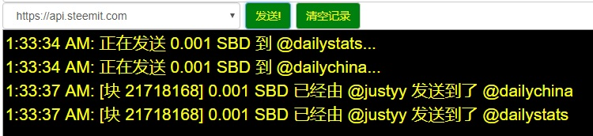

在区块链上已经有记录了。


这个小工具用来群发消息或者发些奖励再适合不过了。不过当前版本的局限性就是每个收款人的金额是一样的。

### 见证人代理查询 ^[作者：\@justyy，原文链接：https://steemit.com/cn/@justyy/78a3jr-steem-justyy-api]
之前我们了解到一个STEEM帐号可以有30票投给见证人，如果您有选择困难或者不愿意费心一个一个投，您可以设置 SteemIt 的见证人代理 (Witness Proxy) 。这个见证人代理就会全权代理你来投票：他/她投谁，那么你就跟投谁。

比如大神 \@abit 设置 \@smooth 为见证人代理，在 steemd.com/\@abit 上就会有这样的信息：

> \@abit uses smooth as a voting proxy.

见证人代理是可以串起来的，比如 同时很多人设置 \@abit 为见证人代理。

**如何设置见证人代理**
通过 steemconnect 把下面的 proxy 参数设置成您想要设置的代理见证人即可，取消见证人代理需要把 approve=1 改成 approve=0

> https://v2.steemconnect.com/sign/account-witness-proxy?proxy=justyy&approve=1

**查看谁设置您为代理见证人？**
设置您为代理见证人的都是真爱，他/她们对你如此相信，把选票全权交到您手上。

我们可以通过工具：https://helloacm.com/tools/steemit/list-of-proxy/  来查看谁设置您为代理见证人。

输入 ID，按回车或者点击按钮，一会儿就会显示列表：

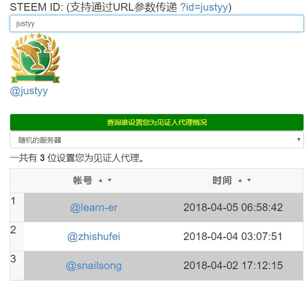 

**API**
API访问接口如下：

> https://helloacm.com/api/steemit/proxy/?cached&id=justyy

数据将以JSON格式返回，每一行就是一个见证人信息，其中包括了以下字段：

> account
proxy
timestamp

如果 \$\_GET 参数 s 没有指定，该API接口也会去找 \$\_POST 变量 id。

> curl -X POST https://helloacm.com/api/steemit/proxy/ -d "id=justyy"

### 见证人相互投票 - 谁没有给你投票? ^[作者：\@justyy，原文链接：https://steemit.com/cn/@justyy/2lj55r-steem-justyy-api]
见证人也是互相抱团的，网红 \@jerrybanfield 给我[留言](https://steemit.com/witness-category/@justyy/witness-tool-update-showing-total-blocks-produced-and-miss-rate#@jerrybanfield/re-justyy-witness-tool-update-showing-total-blocks-produced-and-miss-rate-20180331t010922718z)，问我是否能提供一个工具能用于查看投你为见证人的支持者、和你相互抱团的见证人 还有没给你投票的见证人。

**工具地址**
> https://helloacm.com/tools/steemit/list-of-mutual-witness/

**使用方法**
在文本框里输入您的 STEEM ID 按回车或者点击查询按钮即可。

**这个工具能做什么？**
它能够获取以下信息：

1. 您的支持者，也就是谁投了您为见证人，列表将会链接到这个在线工具。
2. 您支持的见证人，这个列表会在这个在线工具中，您可以查看谁离线了。
3. 您支持的见证人中谁并没有投您为一票。需要注意的是：有些人使用投票代理，所以并不是直接的投票。
4. 相互抱团的见证人列表，也就是你投他/她，他/她也投你。

**API 程序接口(Application Programming Interface)**
API访问接口如下：

> https://helloacm.com/api/steemit/witness_voters/?id=justyy

将返回4个JSON数组：

1. voted (您的支持者)
2. votes (您支持的见证人)
3. not (您支持的见证人中谁没有给您投票)
4. both (相互投票者)

如果 \$\_GET 参数 s 没有指定，该API接口也会去找 \$\_POST 变量 id。

> curl -X POST https://helloacm.com/api/steemit/witness_voters/ -d "id=justyy"

### Discord 机器人 ^[作者：\@justyy，原文链接：https://steemit.com/cn/@justyy/steem-justyy-api-discord]
Discord 原本是给游戏设计的，但由于其功能多，接口开放能力强，使用的用户越来越多。我们CN区也有一个Discord 频道，加入地址为：

> https://discord.gg/7ctT3Xt

在网页里就可以加入 cnsteem 的大家庭了，当然也可以下载手机APP或者桌面程序来加入 discord。

相比微信群，Discord 没有500人限制，也可以无限时的撤回和修改消息，更重要的是，每个频道的聊天信息都是保存在服务器的，所以可以很方便的查看聊天记录。Discord 的每个频道都是一个聊天室，用于讨论不同的主题。

我弄了两个Discord机器人，一个是 币价机器人 `cryptocurrency`，另一个是 `steemit` 机器人。我们可以分别添加这两个机器人为好友，通过和机器人私聊来对机器人发出指令，当然我们也可以在公共频道里发出指令（这样大家就可以信息共享）。

两个机器人都支持 命令 `?` 或者 `help` 来列出帮助。

**币价机器人 cryptocurrency**
币价机器人 `cryptocurrency` 的安装地址（您可以添加到其它的 Discord 频道里）

> https://discordapp.com/api/oauth2/authorize?client_id=417847038697406467&permissions=522304&scope=bot

这个机器人的使用方法和 [justyy 在线工具与 API 系列 - 炒币必备 CoinTools](https://steemit.com/cn-reader/@justyy/steem-justyy-api-cointools) 的命令使用是一样的：

- 虚拟货币和法币：`SBD USD` 命令查询 1 个 SBD 等于多少 USD
- 法币和虚拟货币：`CNY BTC` 命令查询 1 元可以买 多少个 BTC
- 虚拟货币和虚拟货币： `BTC SBD` 命令查询 1 个 BTC 等于多少 SBD
- 法币和法币：`USD CNY` 1美元等于多少RMB
- 虚拟货币查询：直接输入虚拟货币的代号，比如 SBD 或者 steem-dollars
- 在前面的查询前可以加上数量，比如 `100 SBD USD` 查询 100 个 SBD 等于多少 USD
- 还可以这样玩：`SBD 2 BTC` 查询 多少个 SBD 能换 2 个BTC

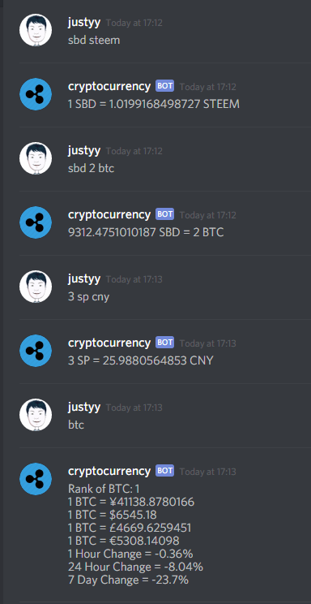

币价数据是从 `coinmarketcap` 取得。

**steemit 机器人**
该机器人的用途是用于查询 steemit 帐号和信息，您可以添加到您自己的 Discord 频道里：

> https://discordapp.com/oauth2/authorize?client_id=418196534660694037&permissions=522304&scope=bot

命令 `info` 将获取 STEEM区块链的一些信息：

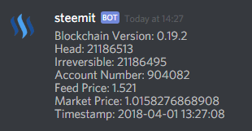

使用 `?steemit_account` 来查询一个 steemit 帐号，比如:

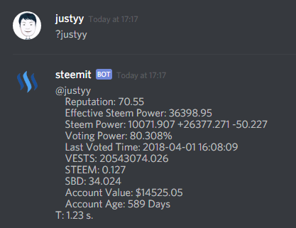

使用 `p` 命令来获取是否 50/50\% 发文的建议

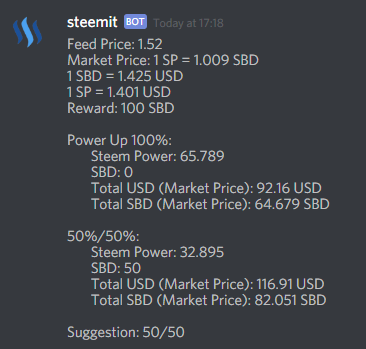

使用 `w steemit_account` 来获得 steemit 见证人的信息，例如：


### 查看被删除的帖子或评论 ^[作者：\@justyy，原文链接：https://steemit.com/cn-reader/@justyy/7gwnq3-steem-justyy-api]
大家都知道，STEEM上的一言一行都是会被记录在STEEM区块链上的，哪怕是7天内可以修改（或者删除）文章或者评论，[修改的记录](https://justyy.com/archives/5420)也都是会被忠实的记录的。不相信？这个在线工具就可以做到把删除过的评论给列出来。

**工具地址**
中文：https://helloacm.com/tools/steemit/list-of-deleted-comments/
英文：https://helloacm.com/tools/steemit/deleted-comments/

**使用方法**
把 ID 输入文本框中并按回车或者查询按钮即可：

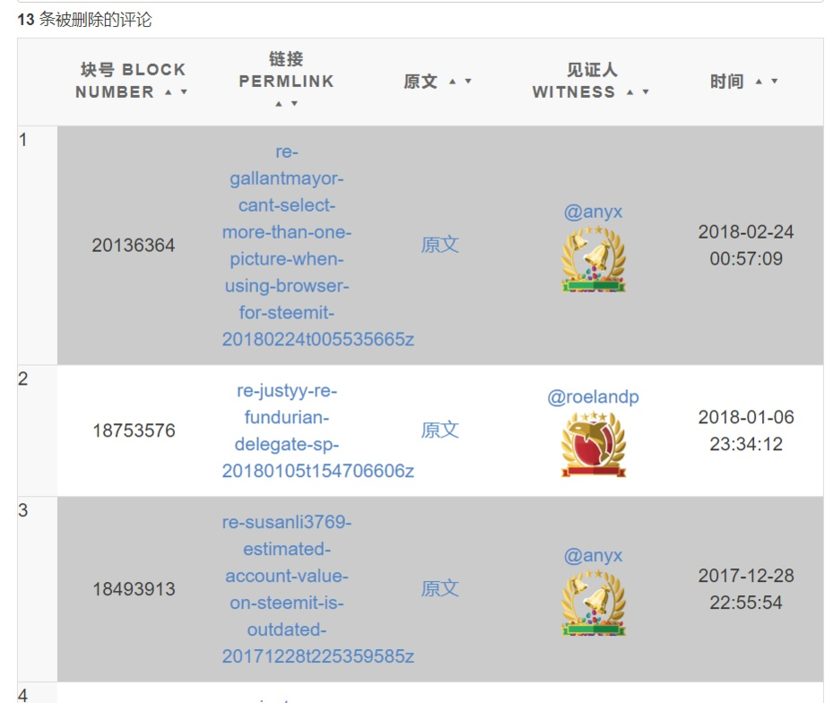

这时候点击 `链接 Permlink` 就能看到删除前的文字。

**API**
使用下面API接口

> https://helloacm.com/api/steemit/deleted/?cached&id=justyy

会返回JSON格式的数据，数组中的每个元素含有以下字段：

> tx_id
permlink
timestamp
block_num
transaction_num
ref_block_num
ref_block_prefix
expiration
type
previous
witness
witness_signature
transaction_merkle_root

如果 \$\_GET 参数 s 没有指定，该API接口也会去找 \$\_POST 变量 id。

> curl -X POST https://helloacm.com/api/steemit/deleted/ -d "id=justyy"

API 并没有直接返回被删除的文本，但是其中 `permlink` 就非常有用，我们可以通过 steemdata 工具来查看详细的修改记录（当然就可以看到删除的文字了），比如：

> https://phist.steemdata.com/history?identifier=https%3A%2F%2Fsteemit.com%2F%40justyy%2Fre-gallantmayor-cant-select-more-than-one-picture-when-using-browser-for-steemit-20180224t005535665z

最后，请记住：谨言慎行。

### 查看代理 ^[作者：\@justyy，原文链接：https://steemit.com/cn-reader/@justyy/steem-justyy-api]
在我所有的[SteemIt工具](https://helloacm.com/tools/steemit-tools/)中，查看代理的两个工具最受欢迎。

**代理能量**
比如我有两个号A和B，我想把A的1000个Steem Power 给B。但是Steem Power 需要3个月时候可以 Power Down 成 Steem（每7天系统把1/13变成Steem)。由此可见，这并不是最好方法，因为：
1. 过程慢
2. 如果B号不是你自己的帐号，那么通过这条路径把STEEM从一个帐号转到另一帐号就很有可能有去无回了。

STEEM代理就是为了解决这两个问题，简单来说，你可以把自己的Steem Power借给另一帐号，代理SP就如把一只会下蛋的母鸡(SP)借出去，从此，下的蛋立刻属于受赠者，但是这只母鸡却还是属于你，而且你也不用担心母鸡被杀人了炖汤吃。

代理和取消代理都可以通过这个[在线工具](https://helloacm.com/tools/steemit/delegate-form/)来完成。有几点我们需要注意的：

1. 代理的能量必须是属于自己的，也就是说别人代理给你的SP你是不能再代理给别人的。
2. 自己代理出去的能量是不能再代理给另一帐号的。
3. 代理立刻生效。
4. 取消代理输入 0 
5. 取消代理，受赠者立马失去了对SP的使用权，但是这些SP也需要7天才能被代理者再次使用。

**代理查看工具**
如果，A借给B，那么我们可以：
1. 查看A (Delegator) 借出的所有SP代理情况：https://helloacm.com/tools/steemit/list-of-delegatees/
2. 查看借给B (Delegatee)的所有代理情况：https://helloacm.com/tools/steemit/list-of-delegators/

**使用方法**
就拿 YY银行来说，我们可以通过 https://helloacm.com/tools/steemit/list-of-delegators/?id=justyy  来看把能量借给 \@justyy 的情况，这里我们在工具地址上添加了参数 `id=justyy` 自动把页面上的 `Steem ID` 填上了 `justyy` 

很快，我们就得到了所有代理情况，默认是按照代理SP的数目从大到小排序，您也可以点击表头来对个别字段进行排序。

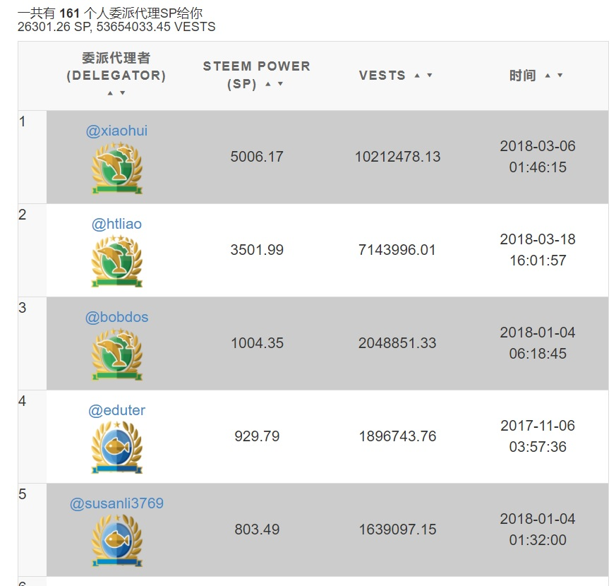

**API**
获取 STEEMIT 反向代理委派列表的 程序接口 API 您只需要传入 ID参数就可以 ：

> https://helloacm.com/api/steemit/delegatees/?cached&id=justyy

返回JSON数据，数组每个元素含有以下字段：

> time
vests
sp
delegator

下面是API返回的一个例子：

> [{"time": "2017-09-17 22:46:18", "vests": 1890000.0, "delegatee": "mrsquiggle", "sp": 917.8161972282788}]

如果 \$\_GET 参数 s 没有指定，该API接口也会去找 \$\_POST 变量 id。

> curl -X POST https://helloacm.com/api/steemit/delegatees/ -d "id=justyy"

如果您想查看谁把SP代理给了你（搞不好哪天就收到了 @ned 的代理呢），您可以把上面的 `delegatees` 换成 `delegators` 

### 查看您投票的见证人 ^[作者：\@justyy，原文链接：https://steemit.com/cn-reader/@justyy/steem-justyy-api-steemit]
我成为[见证人](https://steemit.com/cn/@justyy/5h6gyv-cn)有一个月左右了，然后就和其它见证人一样，到处拉票，特别是手上拥有大量SP的大鱼更是一票难求。

我在拉票的过程中，有些大鱼人比较 nice 则会说，“我手上30票已经满了，等哪天有人不在线上了，我就投你票”。好吧，这一等不知道得等多久……

这下好了，今天走在马路上琢磨着这事，想着，写一个工具，把你投票的见证人的状态全列出来，这样谁不在线上了，一清二楚，拿着这个数据再去找大鱼，估计他也很难再搪塞了吧，嘿嘿，说干就干，今天很顺利，代码一调就过。

**离线的见证人**
见证人的服务器离线了，很有可能是：
1. 不玩了
2. 机器硬件不够了（内存不够了）
3. 配置错误（私钥错误等）

如果您的见证人一直处在离线状态，那么请考虑取消对于他们的投票，这样才能把您手上珍贵的一票交到更需要的人手上，比如我 [投票给 @justyy](https://steemconnect.com/sign/account_witness_vote?approve=1&witness=justyy)。这个小工具能列出您所投票的见证人信息。

**工具地址**
中文：https://helloacm.com/tools/steemit/list-of-witness/
英文 https://helloacm.com/tools/steemit/witness/

**使用方法**
只需要在 STEEM ID 文本框里输入 ID 并按回车（或者点下方绿色的按钮）即可
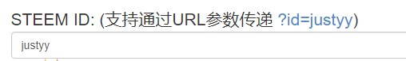

一会儿就得到了结果，比如：
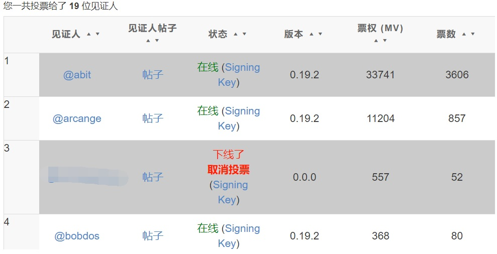

状态那一列如果红色字体就表示该见证人离线了，可以点击链接 `取消投票` 来空出一票。

取消投票是链接到 steemconnect:


**原理**
通过 STEEMSQL 获取见证人信息，其中 Signing Key 如果含有大量的1 就表示下线了，比如 `STM1111111111111111111111111111111114T1Anm`

**API 程序接口(Application Programming Interface)**
API访问接口如下：
```
https://helloacm.com/api/steemit/account/witness/?cached&id=justyy
```

数据将以JSON格式返回，每一行就是一个见证人信息，其中包括了以下字段：

> sbd_interest_rate
total
miss_rate
account_creation_fee_symbol
last_sbd_exchange_update
maximum_block_size
sbd_exchange_rate_base_symbol
votes
votes_count
last_aslot
running_version
signing_key
account_creation_fee
total_missed
hardfork_version_vote
last_confirmed_block_num
hardfork_time_vote
sbd_exchange_rate_quote
sbd_exchange_rate_quote_symbol
url
name
created

如果 \$\_GET 参数 `s` 没有指定，该API接口也会去找 \$\_POST 变量 `id`。

> curl -X POST https://helloacm.com/api/steemit/account/witness/ -d "id=justyy"

### CoinTools 介绍 ^[作者：\@justyy，原文链接：https://steemit.com/cn-reader/@justyy/steem-justyy-api-cointools]
我之前很零碎的开发了查询STEEM/SBD币价的功能，把同样的功能放在公众号](https://justyy.com/archives/6086) 或者 [Discord](https://justyy.com/archives/6089) 频道里，但终究觉得不够直观，因为用户需要键盘敲入命令才能查询，这很程序员思维的设计。

我想着如何让币价查询变得再简单一些，于是我想到了做成Chrome[浏览器插件](https://justyy.com/archives/4324)，因为我觉得这是最好的入口：
1. Chrome 浏览器的市场占有率接近60\%
2. Chrome 浏览器扩展是个非常方便的入口（右上角）
3. Chrome 浏览器扩展的安装方便 (Google Webstore) 自动更新
4. 跨平台

**实现技术**
大佬 [Jeff Atwood](https://en.wikipedia.org/wiki/Jeff_Atwood) 曾经说过：
> Any application that can be written in JavaScript, will eventually be written in JavaScript

意思就是，如果一个软件能用Javascript 来写，那么终究，它就会被用Javascript 来写。

**安装**
首先，您需要使用 Chrome 浏览器，当然如果您使用的是 Firefox，也许可以通过 [Chrome Store Foxified](https://addons.mozilla.org/en-GB/firefox/addon/chrome-store-foxified/) 来使用 大部分 Chrome 扩展。

然后，在 Google Webstore 的  CoinTools 安装地址点击 “添加到 Chrome” (或者 "Add to Chrome") 就可以了。

https://chrome.google.com/webstore/detail/coin-tools/fmglcggbdcbkpkfapngjobfeakehpcgj

**源代码**
开源： https://github.com/DoctorLai/CoinTools
感谢各国友人提供界面翻译：https://github.com/DoctorLai/CoinTools/tree/master/lang

**使用的API**
CoinTools 采集了以下三个数据源的数据：
- CoinMarketCap
- CryptoCompare
- Coinbase

**使用方法**
点击右上角的 XRP 图标 即可打开 CoinTools:


**软件设置**
CoinTools软件的默认语言是英语，在第一次使用的时候可以通过 Settings 标签页来选择成其它您喜爱的语言（支持十来种语言）：

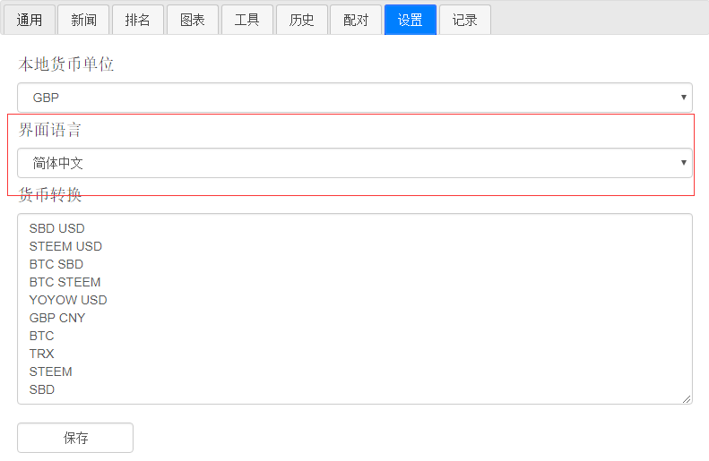

在这个界面设置里，我们还可以设置本地的法币，比如人民币。最下面的这个 “货币转换” 这是软件的精华。在这里，可以自定义我们想要看的信息，每一行就是一个查询命令。比如：

- 虚拟货币和法币：`SBD USD` 命令查询 1 个 SBD 等于多少 USD
- 虚拟货币和虚拟货币： `BTC SBD` 命令查询 1 个 BTC 等于多少 SBD
- 法币和法币：`USD CNY` 1美元等于多少RMB
- 虚拟货币查询：直接输入虚拟货币的代号，比如 SBD 或者 steem-dollars
- 在前面的查询前可以加上数量，比如 `100 SBD USD` 查询 100 个 SBD 等于多少 USD
- 还可以这样玩：`SBD 2 BTC` 查询 多少个 SBD 能换 2 个BTC

**通用**
软件一启动，所看到的页面，显示市场概况，更重要的是一些我们想看的币价信息，也就是上面所自定义的：


**新闻**
显示着一些英文的关于虚拟货币的一些文章 (Feed):


**排名**
默认列出了前200名的虚拟货币（按市场总量）：


我们可以搜索，边敲字符就可以马上得到结果 (Instant)
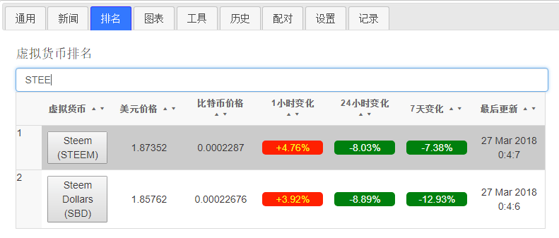

点击虚拟货币的名称，可以得到额外的一些信息：
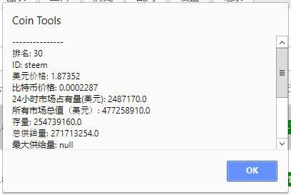

**图表**
*所有市场总值（美元）*
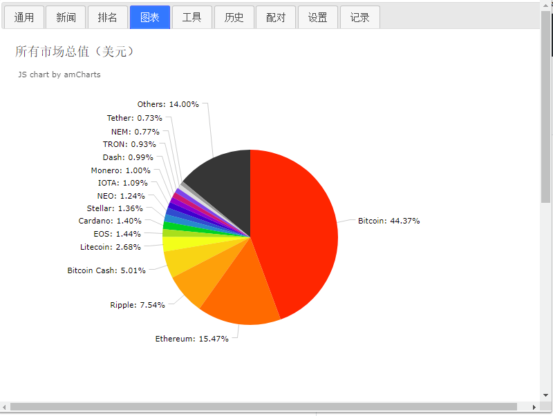

*24小时市场占用量（美元）*
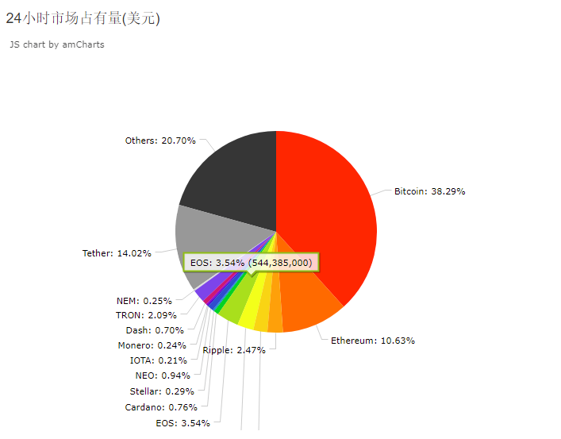

**工具**
该工具可以转换任意两种货币（虚拟货币或者法币）
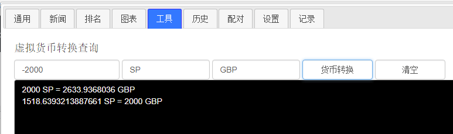

数量为负的时候则会把转换的货币调换，如上图所示。

**历史**
任意天数，任意币种之间的历史数据，包括了 Open, Close, Low, High 和 Average 五条曲线 （默认只显示 平均，也就是 当日最高+最低价除于2）。
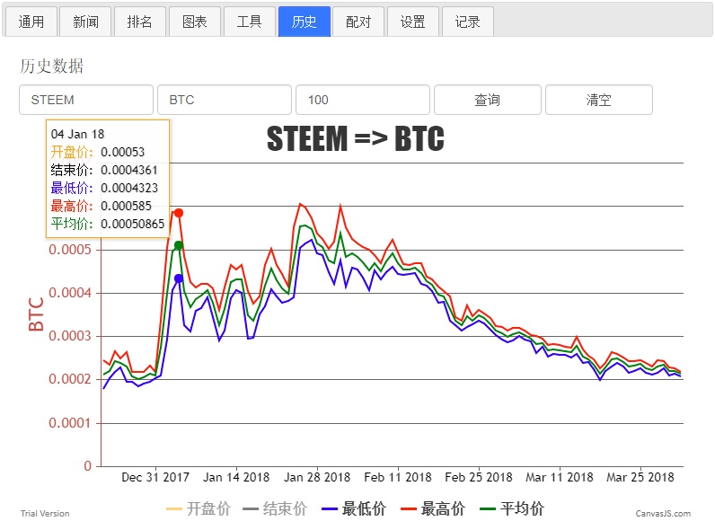

**配对**
该功能用于显示交易所中该币种的配对情况，如：

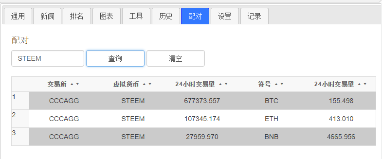

**总结**
这个工具，我相对来说 还是较满意的，因为：简单、好用。

## dapeng 的 steemr ^[作者：\@dapeng，原文链接：https://steemit.com/steemdev/@dapeng/display-all-the-posts-of-a-steemian-and-the-statistics-or]


steemr 被收录在 steemit 官方推荐的 [Steem project](https://steemprojects.com/projects/p/steemr/) 和 [steem tools](http://steemtools.com) 中，以及 [steemit 布尔根兰学院](https://steemitburgenlandacademy.wordpress.com/useful-guides-anleitungen/notifications-verstaendigungen/) 的推荐工具里。

**指定 ID 的所有帖子查询** ^[原文链接：https://steemit.com/steemdev/@dapeng/display-all-the-posts-of-a-steemian-and-the-statistics-or]


Steem 有个让人无比郁闷的毛病：想一目了然地看一个人的所有帖子，你得往下拉，等着载入，再拉，再等......尤其是那些发布了几百上千篇帖子的大神，想看他们的旧帖，在 steemit 上难比登天。我只能去 chainbb，那里支持分页，点第一页就行了。但是，你还得点页码，仍然不是很方便。

为啥就没个文章全部列表呢？连杀人鲸 @deanliu  都[抱怨](https://cnsteem.com/cn/@deanliu/juan)：

> 我其實等待這樣的我所有文章列表很久了，Steemit老是把resteem跟自己文章放一起，大半年了，說過的人甚至走一半了，也沒見有人理會。這樣列表的好處是，可以很快找到自己的很久以前舊文章......

如今，能做到展示全部文章列表的，大概只有我量身定做的 [steem 镜像网站](https://cnsteem.com/cn/@dapeng/or-10-sbd-to-build-a-mirror-site-for-your-own-steem-posts)了（[@deanliu 的镜像](https://deancrypto.netlify.com)， [@dapeng 的镜像](https://dapeng.netlify.com/)， [@pzhao 的镜像](https://pz.netlify.com/)）。只是我仍不满意：没做镜像的怎么看？想看某人收益最高的帖子怎么办？每次都查数据库，太烦了。

于是我二话没说，操起 R 语言，光光光光，做好了，欢迎大家来调戏，地址是 http://steemr.org。是的，就是我开发的 [steem 水浒英雄榜](https://cnsteem.com/cn/@dapeng/steemit-cn)那个地址。英雄榜退居二线，给帖子一览表让让位。


只要输入个 steem 账号，按回车，就显示这个账号的所有 blog 帖子（不包含 resteemed）。功能如下：

- 默认每页显示 20 篇文章。你可以点击表格左上角的数字，选择每页 50 篇，或 100 篇，或全部显示。

- 每篇文章都给出了发布时间、收益（SBD）和点赞数量。点击标题栏，就可以实现排序。按时间顺序、逆序，按收益最大或最小，随便你排。

- 表格左上角和下方都有搜索栏，可以搜索标题里的关键字。例如在 Date 一列下面的搜索栏搜索 '2017-07'，就会过滤出 2017 年 7 月的文章列表。此时再点击标题栏的 payout 排序，就筛选出 2017 年 7 月 收益最高的帖子了。

- 每篇文章都给出了在 steemit , cnsteem, chainbb, busy, steemdb, steemd 的链接，点一下直达（如果被浏览器阻挡的话，按 ctrl + 点一下就在新标签打开了）。

- 附带给出了统计图表，展示作者累计收益、累计点赞、累计文章数量和 24 小时活跃时间的统计图。

下图是某人的作息时间图。猜猜这个人生活在哪个时区？


以前，有位新朋友为了方便访问自己帖子的某个分类，就为自己创建了个性标签，后来发现七天限制的问题，只能作罢。

其实，上面这两个问题，都容易解决：去 steemr，到文章展示厅，输入 id 回车，右上角搜索栏输入文章标签，就可以查看自己私人的分类标签文章了。

例如，输入 dapeng 回车，搜索栏输入“cn-31”，就可以看到历届三个一活动的发起帖和颁奖帖，帖子里是所有参赛作品和获奖作品列表。


**粉丝大厅** ^[原文链接：https://steemit.com/cn/@dapeng/steemr-a-web-based-tool-for-steemers-or-steemians-steemr]


用起来很简单：

- 点击 `Follower report` 标签，输入你想查的 ID，点击 `GO` 按钮，等几秒钟或十几秒钟（取决于服务器的速度和 你要查的 ID 的情况）就可以看到结果了，包括粉丝 （followers） ID 的词云图，按这些粉丝的粉丝数量、发帖数量和vests大小排序。如果粉丝超过30个，就取前三十个。词云图下方，还给出了尚未互粉的 ID 列表。

**水浒英雄榜** ^[原文链接：https://steemit.com/cn/@dapeng/6mnla8-steemit-cn]


《水浒》里面哪段情节最激动人心？我觉得是“忠义堂石碣受天文，梁山泊英雄排座次”。小说开头放出的 108 员天罡地煞星，历经千难万险，终于再度聚齐。英雄好汉们按威望（Reputation）、能力（ESP）、财力（Account Value）、长幼（Online Days）等综合实力排名次，上下有序，一片和谐，摩拳擦掌，准备干一番大事业。就像来自五湖四海的 Steemit CN 用户，最近纷纷聚到了同一个微信群。不知大家怎么看，反正我有种“英雄好汉齐聚梁山泊”的感觉。


1、可以输入一个 ID，给出该 ID 的声誉、权力等各项指标排位座次，以及邻座坐的是谁。看看谁坐在我旁边：


2、可以给定一个名次范围，画出该范围内的名单词云图，谁越排在前面，谁的名字就越大。


3、除了同样给出了全部名单列表，并且点击每列标题就可以顺序逆序外，还可以过滤。可以选择根据不同指标得到的座次，列在名单第一列，默认按ESP（实权）排序。注意，最后一列的英雄角色永远参照 ESP。


来，我们搜索一下声望值超过 70、注册时间为 410多 天的名单：


4、名单的列数比较多，新版名单可以选择显示哪些列。


5、随着入伙人数越来越多，名单也越来越长，所以支持分页展示。梁山 108 条好汉，分 36 天罡星和 72 地煞星，名单里默认显示 36 天罡。当然你可以选择显示全部名单。


5、 统计图表显示各项指标的分布图。例如，下图表示所有群友（175位）账号的声誉（reputation）分布。最小的声誉值为 4， 最大的是 75。一半账号的声誉值在 51 以上（即中位数，median，蓝线）。25 % 的账号声誉值低于 41（绿线），25% 的账号声誉值高于 59 （红线），而 41 和 59 之间，集中了半数的账号。由于不是正态分布，所以平均值和标准偏差的意义不大，这里仅给出了平均值（mean）。


这个排名座次有没有让你联想到什么？我联想到了很多，于是给这个名单取名为：

**Steem 中国聚义厅**

你想加入英雄榜吗？请联系 @dapeng 入伙。

好了，来看看吧，在 Steem CN 的聚义厅里，你是哪条英雄好汉？坐哪把交椅？

**月旦评琅琊榜** ^[原文链接：https://steemit.com/cn/@dapeng/or-an-online-app-for-the-monthly-review-in-cn-category]


在 @rivalhw 发布[【广纳建言】关于设立“琅琊榜”提议的一些思考](https://steemit.com/cn/@rivalhw/sadt6)后，steemr 新增了月旦评查询功能。


目前，月旦评琅琊榜分三部分：琅琊文章榜，琅琊人物榜，月旦评历史发展曲线，实时在线显示。用的是 steemsql 数据库，可能比区块链的数据会有点滞后。大家先凑合看。


文章榜列出了史上所有投稿给月旦评的文章（以文章标题里有“月旦评”并且标签里有“cn-reader”为准），左下角显示了文章总数。快 700 篇了。默认是按时间逆序排列，最新的排在前面，方便大家尤其是评委们浏览。


- 点一下每列的标题栏（列名称），就可以按该列排序；再点一下，就反序排列。

- 点击左上角的 “show x entries”，可以选择每页显示多少篇。最大值就是目前参加月旦评的文章总数。

- 表格右上角和每列底部都有搜索栏，可以搜索任意关键词。例如，在“日期”列底部输入 '2017-12'，就会列出本月文章清单。

- 往搜索栏输入奖项的编号或全称，例如“2”或“榜眼”，就可以得到历届榜眼清单。


此外，活动的发起帖和总结帖也一直混在投稿里，这回趁升级，我把他们挑出来，整理在另一个表格里，按时间先后顺序。大家可以很方便看到活动的缘起和发展脉络。


人物榜列出了史上所有参加月旦评活动的作者，统计了每个作者的投稿数量、从月旦评活动得到的累计收益和点赞数量。使用方法跟文章榜类似。左下角显示了参加活动的累计人数。默认按照投稿次数从高到低排序。他们真能写！


月旦评历史发展曲线给出了月旦评活动累计的投稿数量、文章收益和点赞数。


**三个一和好声音** ^[原文链接：https://steemit.com/cn/@dapeng/steemr]


[steemr](http://steemr.org) 新增了个更为强大的页面，来展示史上所有参加三个一活动的帖子列表、作者名录，以及统计数据。

用法很简单：

- 访问 [http://steemr.org](http://steemr.org) ，目前默认直接打开“三个一活动”页面，出现两个表格和三个图。

- 单击表格里的文章标题或作者会跳转至 steemit。有的浏览器因安全级别高而屏蔽了跳转，改用请用 ctrl + 鼠标左键单击即可;

- 点一下每列的标题栏（列名称），就可以按该列排序；再点一下，就反序排列。
  点击左上角的 “show x entries”，可以选择每页显示多少篇。最大值就是目前参加活动的文章总数。

- 表格右上角和每列底部都有搜索栏，可以搜索任意关键词。

例如，在“日期”列底部输入 '2017-12'，就会列出当月文章清单。

例如，在搜索栏输入 lovemyson，就会筛选出这位作者的所有参赛作品及收益和点赞数量。


作者列表里，显示了参加活动的名单和累计发帖数、累计收益、累计获赞数。

统计曲线给出了按时间记录的累计投稿数量、文章收益和点赞数。迄今有46 位作者、92篇文章参加了“三个一”活动，累计给大家带来 800 SBD的收益。

除了“三个一”，我用同样的框架，把“华语好声音”的参赛情况也做了个页面，访问地址相同，点击顶部“华语好声音”标签即可。

## Steem上有用的网站分享---SteemWorld.com [作者：\@ericet]
Steemit最全面数据的网站：SteemWorld
这个集多种工具以一身的网站，强烈建议收藏！
网址：www.steemworld.org
查询方法：在网站后面加上steemit id，比如 www.steemworld.org/@ericet

页面最上面：
**Steemit最全面数据的网站：SteemWorld**
这个集多种工具以一身的网站，强烈建议收藏！
网址：www.steemworld.org
查询方法：在网站后面加上steemit id，比如 www.steemworld.org/@ericet

页面最上面：

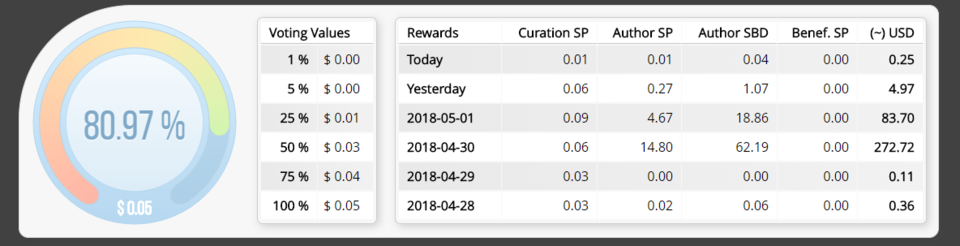
左边：目前账户的Voting Power和在满赞的价值
中间：不同比例的点赞价值
右边：最近6天的点赞收益/发帖SP收益/发帖SBD收益/受益人SP/换算成美金价值

**Stats: 个人信息**
账户的一些信息，包括目前的SP数量，点赞价值，名声，点赞/收到点赞，自赞率，等信息
可以通过右边的“Simulate SP”按钮模拟SP的点赞价值
还可以通过右边“Inc. Votes" 查看点赞来源
通过”Out．Votes"查看给别人点赞记录

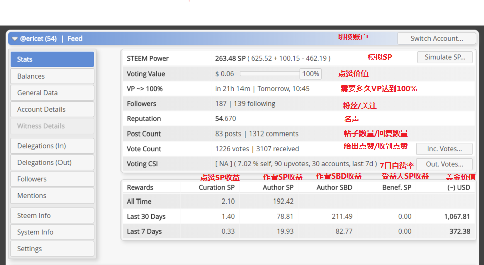

**Balances: 账目信息**
查看账户的SBD/Steem数量，价值。
可以通过右边的"Power Up" 把Steem转化成SP
通过右边的"Delegate SP" 把SP代理给其他人

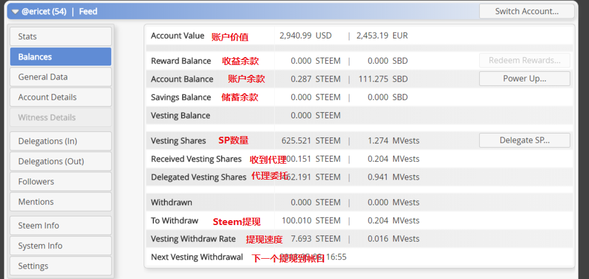


**General Data：通用数据**
查看账户创建日期，上次点赞日期等

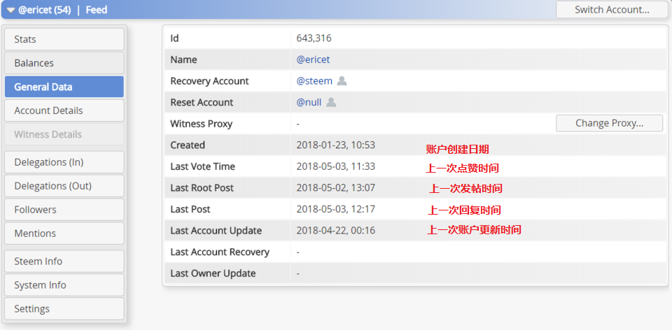


**Account Details: 账户详情**
查看账户简介，剩余宽带等。

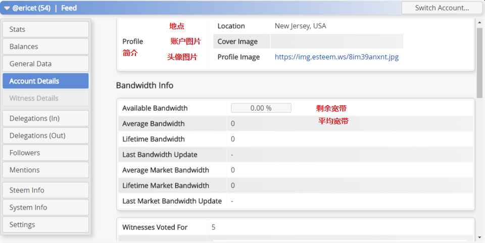


**Delegations(In): 代理给你**
查看谁代理SP给你

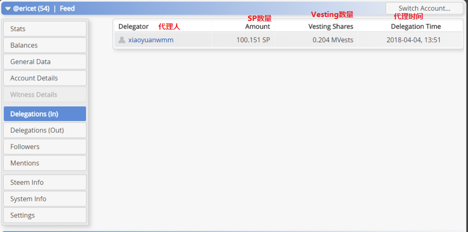


**Delegations(Out): 代理委派**
查看你把SP代理给谁

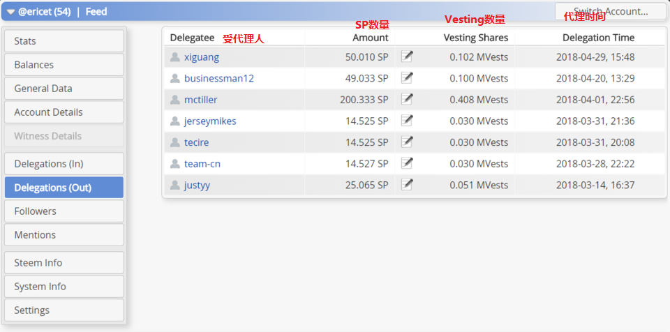


**Followers: 粉丝**
查看粉丝

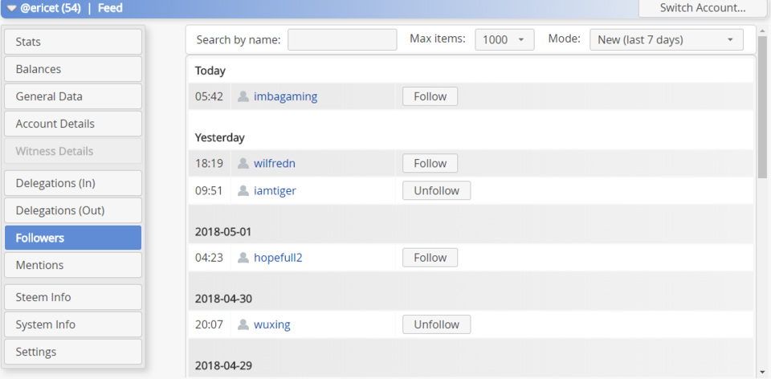


**Mentions: 提到你**
查看谁在文章/回复里提到你

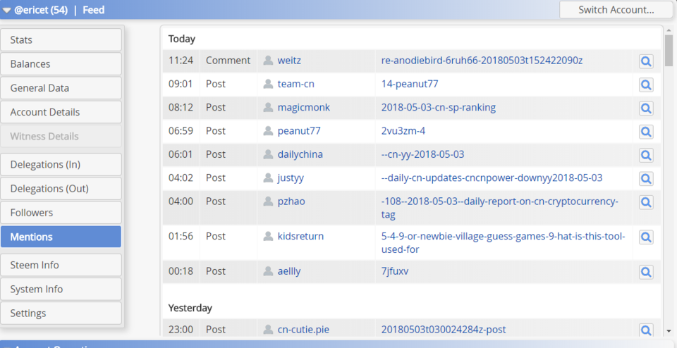


**Steem Info: Steem信息**
查看Steem的价格信息

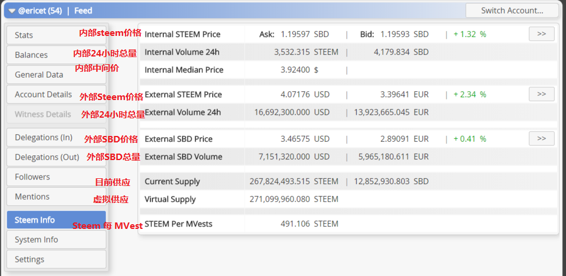


**System Info: 系统信息**
查看Steem系统信息


**Setting: 设置**
查看/修改 SteemWorld设置

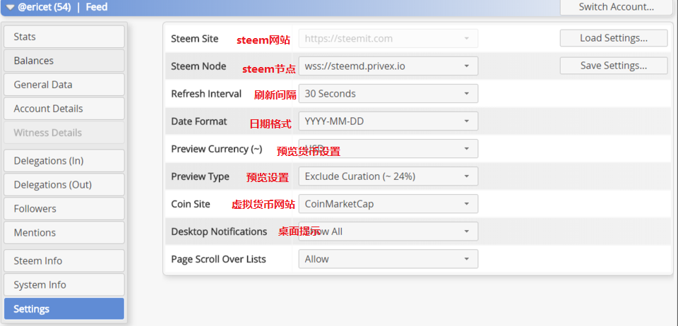

**Account Operations: 账户操作**
查看账户所有操作记录。比如帖子收益/点赞收益/回复/点赞 等记录信息

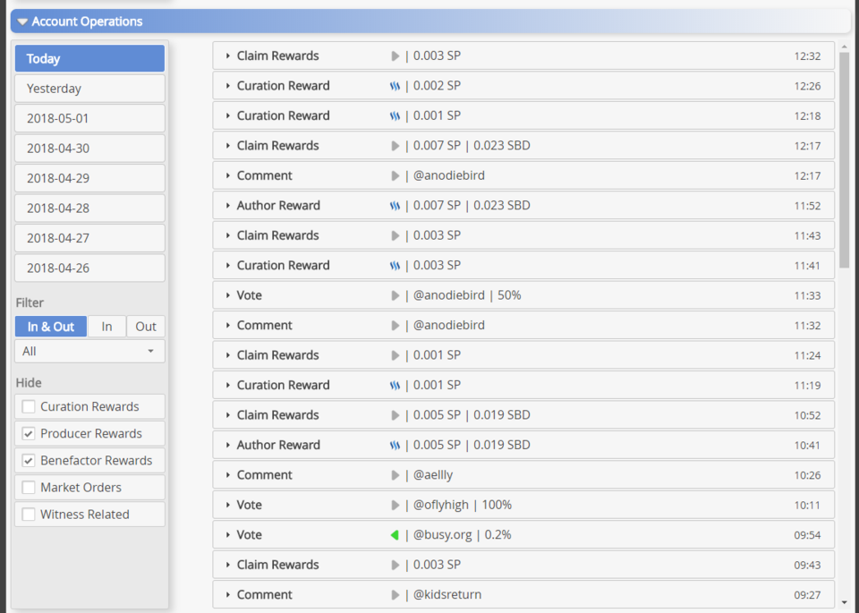

**Recent Posts: 最近的帖子**
查看账户最近发的帖子

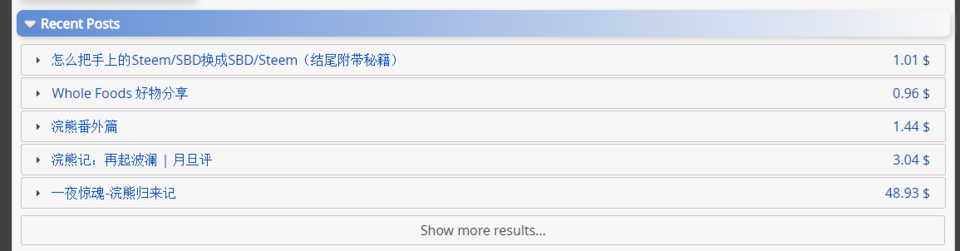

**Coming Author Rewards: 待分配的收益**
查看待分配的收益

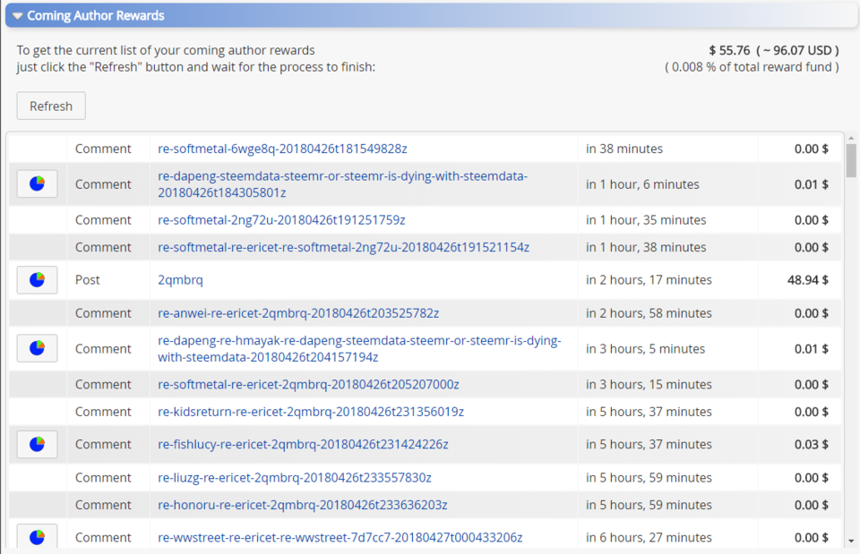

**Tools：工具**
Account Votes: 账户点赞数据
查看账户帖子被点赞或者给别人点赞的记录

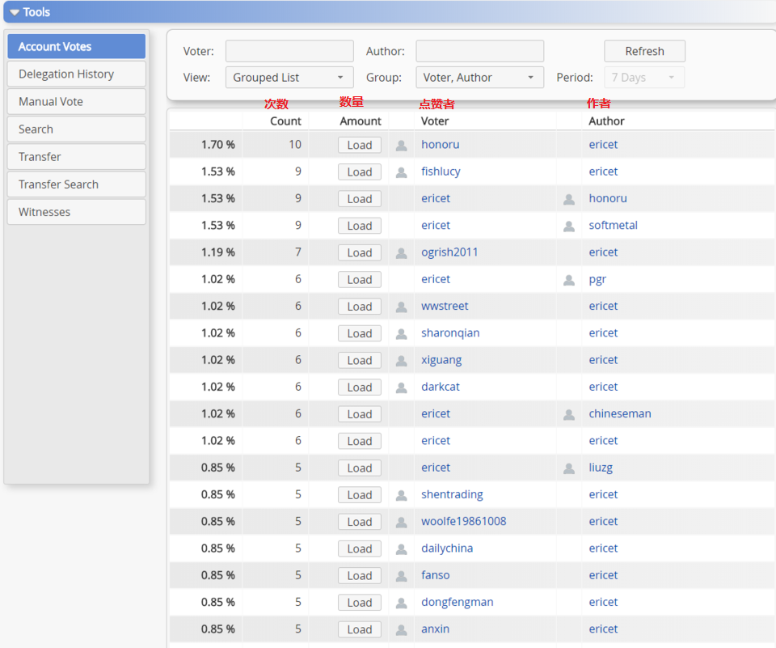

**Delegation History: 代理历史记录**
查看代理历史记录

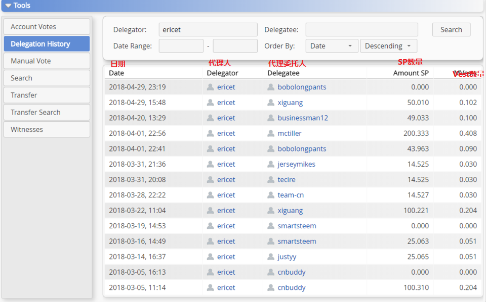

**Manual Vote: 手动点赞**
手动操作点赞

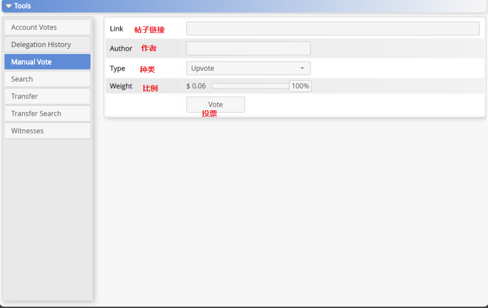

**Transfer: 转账**
转账给别的账户

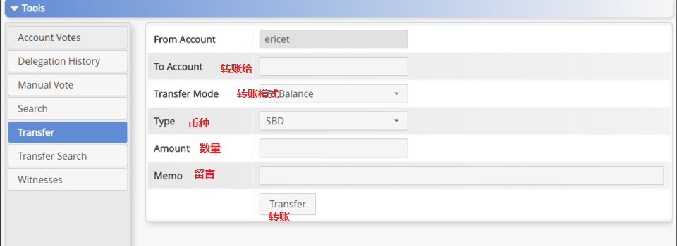


**Transfer Search：转账搜索**
转账记录搜索


**Witnesses: 见证人**
查看所有的见证人，并可以给他们投票(一个账户有30票可以投)或者取消投票

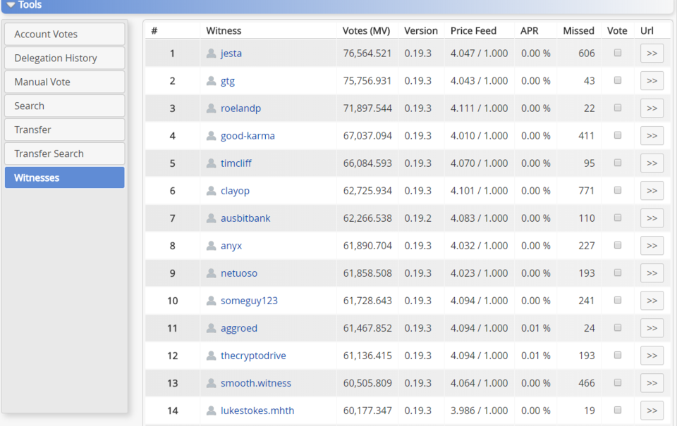


## 想玩转Steemit? 试试这些有意思的网站和工具[作者：\@tumutanzi；编辑：\@maiyude;]

我们在 Steemit.com上写作、阅读、评论，其实 Steemit.com 上有很多有趣的玩法。高手们可以使用数据库工具来分析 Steemsql 或者 Steemdata 调取出来的数据，但需要一些数据库查询语法和工具软件。

我们普通用户完全可以从 Steemtools.com 找到不少简单易用的方法，来分析挖掘 Steemit 上的数据。感谢这些可爱有趣的开发者们。

下面我收集整理介绍一下我认为比较有趣的玩法和工具，分享给大家参考。

http://steemreports.com/ 可以查阅每个用户的点赞收入来源和去处，还能查阅哪些文章最受欢迎被点赞，哪些互动比较强烈。

https://steemstats.com 几乎能查看所有的信息，差不多赶上 Steemd.com 一样，但比后者的界面要美观得多。

https://www.steemnow.com/ 可以查看实时收益情况，当前点赞值多少钱，还有多少点赞能量，谁给你点赞，用了多少权重。查看声望 Reputation 分值——精确到3位小数点。

http://steemvp.com/ 这个网站可以查看谁是你的金主，给你点赞的情况，当然 Steemreport.com 也能实现。

https://steemwhales.com 查看用户的许多信息，Follow 和被 Follow 的数量，声望分等。

https://mentions.steemdata.com/ 查看你被谁在文章和评论里@了，即被提及到。

http://steemr.org/ 大鹏 @dapeng 开发的工具，可以生成粉丝的词云图，支持多种排序方法。更多功能还在开发中。

https://www.asksteem.com/ 专门用于 Steemit 的搜索引擎网站，比 Steemit 内置的 Google 站内搜索要好用，支持各种语法搜索（点击这里了解更多），比如，你甚至可以搜索到和你同城的 Steemit 用户，这样就方便组织同城聚会了。

https://busy.org 这个网站可以实现与 Steemit.com 一样的功能，界面更像 Facebook 一样。其实 Steemit.com 和 Busy.org 都是一样基于 Steem Blockchain 区块链，两者不过是将数据呈现出来的不同界面而已。

以下是 http://steemtools.com/ 没有提及但我个人觉得也很有用的工具。

Steemit Voting Power Chrome 浏览器可安装此插件，查看当前用户的点出去的点赞数量——我每天就是用它来知道我点赞了多少人。

https://helloacm.com/tools/steemit/who-has-not-voted-yet/ @justyy 开发的邪恶工具：查看哪些粉丝没有点赞你的文章——我到目前还没用过。

http://steemit.serviceuptime.net/check_resteem.php O哥 @oflyhigh 开发的工具。查看谁转载 Resteem 了你的文章，转载是真爱。

http://steemit.serviceuptime.net/mute.php O哥发布的工具。查看谁拉黑屏蔽 Mute 了你，拉黑是真不爱。

http://steemit.serviceuptime.net/check_vote_value.php O哥发布的工具。查看点赞值多少钱。

http://mysteemitfriends.online/ My Steemit Friends 查看点赞投票投出与投入的信息。

http://www.steemittraffic.com/ steemit traffic 查看 Steemit 的宏观流量等信息。

当然，上面提到的所有网站其实都是分析 Steem 这个区块链，它们只是一个用户界面用来查询相关信息。看到这里，你就知道 Steemit.com 的有趣之处了吧？它不像一般的网站，在 Steemit.com 上面，Steem 区块链忠实地记录你所有的行为，并且全程公开透明。

所以，下次有人跟你谈及现在热门的 Blockchain 区块链技术，你可以告诉对方：“不就是区块链吗？我也有一根，叫 Steemit.com，还给我带来一点收入呢。”

最后，我再啰嗦一句，上面的这些工具也许很好玩，但不要玩得过火，重点还是要放在多写作好的内容，这才是最根本的东西。


