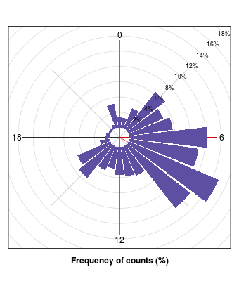
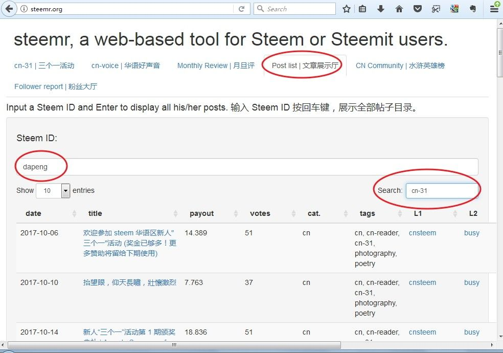
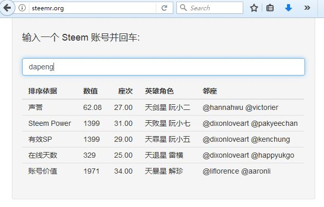
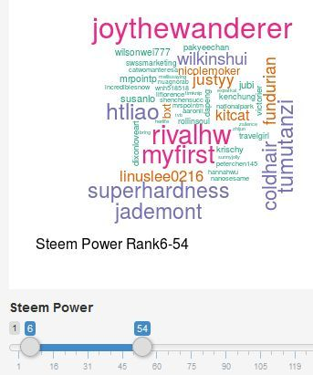
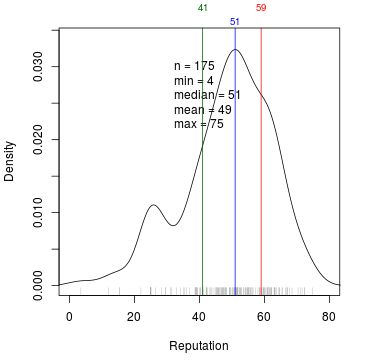
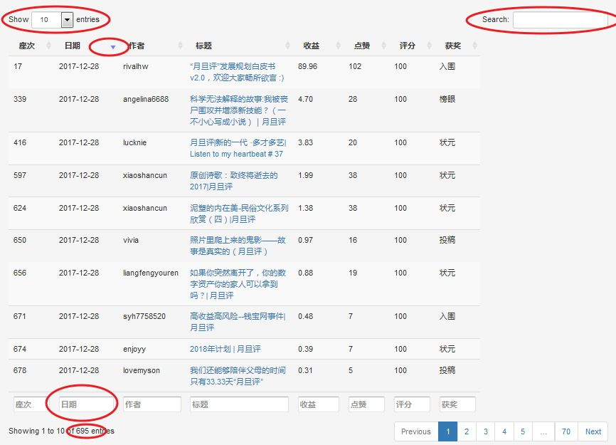
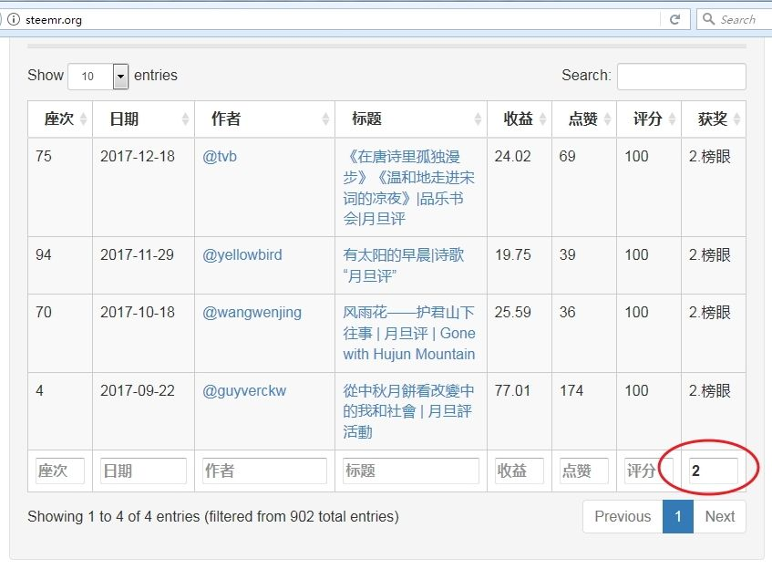
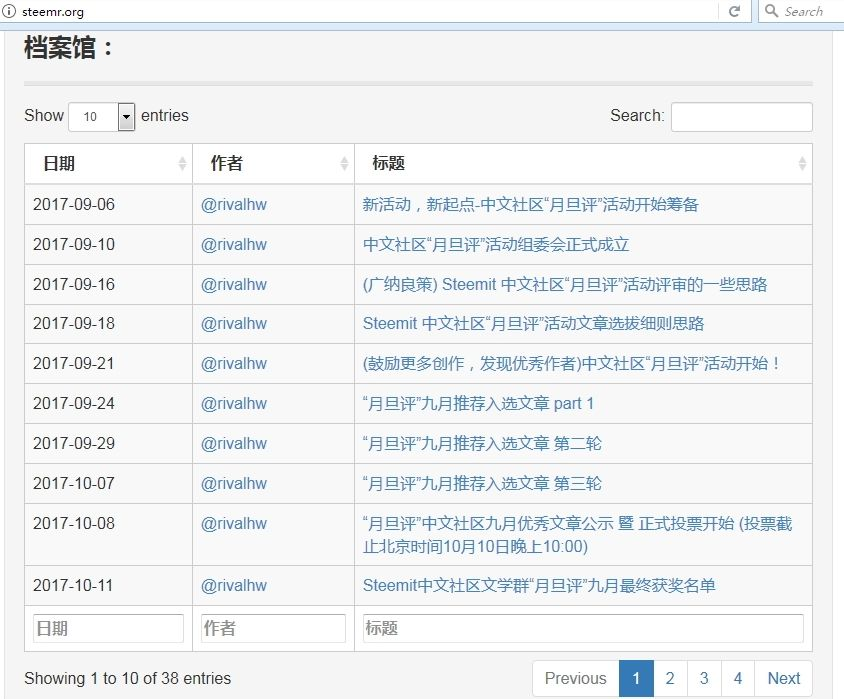

# 辅助工具 {#fcgjp}
## oflyhigh 的微信公众号 steemit {#oflyhigh_dwsgyh_steemit_dsyff}
## justyy 的在线工具和 API 接口 {#justyy_dzxgjh_api_ckdsyff}
## dapeng 的 steemr ^[作者：\@dapeng，原文链接：https://steemit.com/steemdev/@dapeng/display-all-the-posts-of-a-steemian-and-the-statistics-or]

steemr 被收录在 steemit 官方推荐的 [Steem project](https://steemprojects.com/projects/p/steemr/) 和 [steem tools](http://steemtools.com) 中，以及 [steemit 布尔根兰学院](https://steemitburgenlandacademy.wordpress.com/useful-guides-anleitungen/notifications-verstaendigungen/) 的推荐工具里。

**指定 ID 的所有帖子查询** ^[原文链接：https://steemit.com/steemdev/@dapeng/display-all-the-posts-of-a-steemian-and-the-statistics-or]

Steem 有个让人无比郁闷的毛病：想一目了然地看一个人的所有帖子，你得往下拉，等着载入，再拉，再等......尤其是那些发布了几百上千篇帖子的大神，想看他们的旧帖，在 steemit 上难比登天。我只能去 chainbb，那里支持分页，点第一页就行了。但是，你还得点页码，仍然不是很方便。

为啥就没个文章全部列表呢？连杀人鲸 @deanliu  都[抱怨](https://cnsteem.com/cn/@deanliu/juan)：

> 我其實等待這樣的我所有文章列表很久了，Steemit老是把resteem跟自己文章放一起，大半年了，說過的人甚至走一半了，也沒見有人理會。這樣列表的好處是，可以很快找到自己的很久以前舊文章......

如今，能做到展示全部文章列表的，大概只有我量身定做的 [steem 镜像网站](https://cnsteem.com/cn/@dapeng/or-10-sbd-to-build-a-mirror-site-for-your-own-steem-posts)了（[@deanliu 的镜像](https://deancrypto.netlify.com)， [@dapeng 的镜像](https://dapeng.netlify.com/)， [@pzhao 的镜像](https://pz.netlify.com/)）。只是我仍不满意：没做镜像的怎么看？想看某人收益最高的帖子怎么办？每次都查数据库，太烦了。

于是我二话没说，操起 R 语言，光光光光，做好了，欢迎大家来调戏，地址是 http://steemr.org。是的，就是我开发的 [steem 水浒英雄榜](https://cnsteem.com/cn/@dapeng/steemit-cn)那个地址。英雄榜退居二线，给帖子一览表让让位。

只要输入个 steem 账号，按回车，就显示这个账号的所有 blog 帖子（不包含 resteemed）。功能如下：

- 默认每页显示 20 篇文章。你可以点击表格左上角的数字，选择每页 50 篇，或 100 篇，或全部显示。

- 每篇文章都给出了发布时间、收益（SBD）和点赞数量。点击标题栏，就可以实现排序。按时间顺序、逆序，按收益最大或最小，随便你排。

- 表格左上角和下方都有搜索栏，可以搜索标题里的关键字。例如在 Date 一列下面的搜索栏搜索 '2017-07'，就会过滤出 2017 年 7 月的文章列表。此时再点击标题栏的 payout 排序，就筛选出 2017 年 7 月 收益最高的帖子了。

- 每篇文章都给出了在 steemit , cnsteem, chainbb, busy, steemdb, steemd 的链接，点一下直达（如果被浏览器阻挡的话，按 ctrl + 点一下就在新标签打开了）。

- 附带给出了统计图表，展示作者累计收益、累计点赞、累计文章数量和 24 小时活跃时间的统计图。

下图是某人的作息时间图。猜猜这个人生活在哪个时区？

以前，有位新朋友为了方便访问自己帖子的某个分类，就为自己创建了个性标签，后来发现七天限制的问题，只能作罢。

其实，上面这两个问题，都容易解决：去 steemr，到文章展示厅，输入 id 回车，右上角搜索栏输入文章标签，就可以查看自己私人的分类标签文章了。

例如，输入 dapeng 回车，搜索栏输入“cn-31”，就可以看到历届三个一活动的发起帖和颁奖帖，帖子里是所有参赛作品和获奖作品列表。

**粉丝大厅** ^[原文链接：https://steemit.com/cn/@dapeng/steemr-a-web-based-tool-for-steemers-or-steemians-steemr]

用起来很简单：

- 点击 `Follower report` 标签，输入你想查的 ID，点击 `GO` 按钮，等几秒钟或十几秒钟（取决于服务器的速度和 你要查的 ID 的情况）就可以看到结果了，包括粉丝 （followers） ID 的词云图，按这些粉丝的粉丝数量、发帖数量和vests大小排序。如果粉丝超过30个，就取前三十个。词云图下方，还给出了尚未互粉的 ID 列表。

**水浒英雄榜** ^[原文链接：https://steemit.com/cn/@dapeng/6mnla8-steemit-cn]

《水浒》里面哪段情节最激动人心？我觉得是“忠义堂石碣受天文，梁山泊英雄排座次”。小说开头放出的 108 员天罡地煞星，历经千难万险，终于再度聚齐。英雄好汉们按威望（Reputation）、能力（ESP）、财力（Account Value）、长幼（Online Days）等综合实力排名次，上下有序，一片和谐，摩拳擦掌，准备干一番大事业。就像来自五湖四海的 Steemit CN 用户，最近纷纷聚到了同一个微信群。不知大家怎么看，反正我有种“英雄好汉齐聚梁山泊”的感觉。

1、可以输入一个 ID，给出该 ID 的声誉、权力等各项指标排位座次，以及邻座坐的是谁。看看谁坐在我旁边：

2、可以给定一个名次范围，画出该范围内的名单词云图，谁越排在前面，谁的名字就越大。

3、除了同样给出了全部名单列表，并且点击每列标题就可以顺序逆序外，还可以过滤。可以选择根据不同指标得到的座次，列在名单第一列，默认按ESP（实权）排序。注意，最后一列的英雄角色永远参照 ESP。

来，我们搜索一下声望值超过 70、注册时间为 410多 天的名单：

4、名单的列数比较多，新版名单可以选择显示哪些列。

5、随着入伙人数越来越多，名单也越来越长，所以支持分页展示。梁山 108 条好汉，分 36 天罡星和 72 地煞星，名单里默认显示 36 天罡。当然你可以选择显示全部名单。

5、 统计图表显示各项指标的分布图。例如，下图表示所有群友（175位）账号的声誉（reputation）分布。最小的声誉值为 4， 最大的是 75。一半账号的声誉值在 51 以上（即中位数，median，蓝线）。25 % 的账号声誉值低于 41（绿线），25% 的账号声誉值高于 59 （红线），而 41 和 59 之间，集中了半数的账号。由于不是正态分布，所以平均值和标准偏差的意义不大，这里仅给出了平均值（mean）。

这个排名座次有没有让你联想到什么？我联想到了很多，于是给这个名单取名为：

**Steem 中国聚义厅**

你想加入英雄榜吗？请联系 @dapeng 入伙。

好了，来看看吧，在 Steem CN 的聚义厅里，你是哪条英雄好汉？坐哪把交椅？

**月旦评琅琊榜** ^[原文链接：https://steemit.com/cn/@dapeng/or-an-online-app-for-the-monthly-review-in-cn-category]

在 @rivalhw 发布[【广纳建言】关于设立“琅琊榜”提议的一些思考](https://steemit.com/cn/@rivalhw/sadt6)后，steemr 新增了月旦评查询功能。

目前，月旦评琅琊榜分三部分：琅琊文章榜，琅琊人物榜，月旦评历史发展曲线，实时在线显示。用的是 steemsql 数据库，可能比区块链的数据会有点滞后。大家先凑合看。

文章榜列出了史上所有投稿给月旦评的文章（以文章标题里有“月旦评”并且标签里有“cn-reader”为准），左下角显示了文章总数。快 700 篇了。默认是按时间逆序排列，最新的排在前面，方便大家尤其是评委们浏览。

- 点一下每列的标题栏（列名称），就可以按该列排序；再点一下，就反序排列。

- 点击左上角的 “show x entries”，可以选择每页显示多少篇。最大值就是目前参加月旦评的文章总数。

- 表格右上角和每列底部都有搜索栏，可以搜索任意关键词。例如，在“日期”列底部输入 '2017-12'，就会列出本月文章清单。

- 往搜索栏输入奖项的编号或全称，例如“2”或“榜眼”，就可以得到历届榜眼清单。

此外，活动的发起帖和总结帖也一直混在投稿里，这回趁升级，我把他们挑出来，整理在另一个表格里，按时间先后顺序。大家可以很方便看到活动的缘起和发展脉络。

人物榜列出了史上所有参加月旦评活动的作者，统计了每个作者的投稿数量、从月旦评活动得到的累计收益和点赞数量。使用方法跟文章榜类似。左下角显示了参加活动的累计人数。默认按照投稿次数从高到低排序。他们真能写！

月旦评历史发展曲线给出了月旦评活动累计的投稿数量、文章收益和点赞数。

**三个一和好声音** ^[原文链接：https://steemit.com/cn/@dapeng/steemr]

[steemr](http://steemr.org) 新增了个更为强大的页面，来展示史上所有参加三个一活动的帖子列表、作者名录，以及统计数据。

用法很简单：

- 访问 [http://steemr.org](http://steemr.org) ，目前默认直接打开“三个一活动”页面，出现两个表格和三个图。

- 单击表格里的文章标题或作者会跳转至 steemit。有的浏览器因安全级别高而屏蔽了跳转，改用请用 ctrl + 鼠标左键单击即可;

- 点一下每列的标题栏（列名称），就可以按该列排序；再点一下，就反序排列。
  点击左上角的 “show x entries”，可以选择每页显示多少篇。最大值就是目前参加活动的文章总数。

- 表格右上角和每列底部都有搜索栏，可以搜索任意关键词。

例如，在“日期”列底部输入 '2017-12'，就会列出当月文章清单。

例如，在搜索栏输入 lovemyson，就会筛选出这位作者的所有参赛作品及收益和点赞数量。

作者列表里，显示了参加活动的名单和累计发帖数、累计收益、累计获赞数。

统计曲线给出了按时间记录的累计投稿数量、文章收益和点赞数。迄今有46 位作者、92篇文章参加了“三个一”活动，累计给大家带来 800 SBD的收益。

除了“三个一”，我用同样的框架，把“华语好声音”的参赛情况也做了个页面，访问地址相同，点击顶部“华语好声音”标签即可。

## 延伸阅读：各种 steem 应用  {#ysyd_steem_apps_}

