# 周边网站 {#zbwzp_}
## 乌托邦 ^[作者:\@nationalpark;编辑:\@maiyude;原文链接:https://steemit.com/utopian-io/@nationalpark/get-rewards-from-utopian-io]
- 乌托邦是什么

[@utopian-io](https://steemit.com/@utopian-io)是 [https://utopian.io](https://utopian.io/) 在Steem的账号。乌托邦试图奖励开源系统的贡献者。

本来开源系统都是由志愿者义务贡献没有报酬。 [@elear](https://steemit.com/@elear)认为应该想办法奖励开源系统的志愿者，于是创建了utopian.io，用Steem的奖励系统奖励开源系统的志愿者。

也就是说以前开源系统的志愿者都是活雷锋，而现在乌托邦要给志愿者发钱，于是Steem就成了最大的活雷锋。这笔经济账我不会算，不知道Steem将来是否会得到收益。但是目前对于草根小鱼来讲，去开源系统做贡献可以实实在在的得到回报。

- 如何登陆乌托邦

首先先去utopian.io登陆。用Steem的用户名密码可以登陆。

**注意**：现在不可以用posting key登陆，必须至少用active key才可以登陆utopian.io。

登陆utopian.io以后，他们会修改posting权限。这个我很不喜欢，但是既然改了就改了吧。以后如果不用了再想办法改回来。

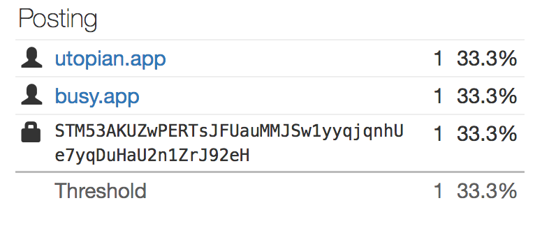

注意上面的截图，busy.org也一样把posting权限修改了。

- 如何在乌托邦发帖

登陆乌托邦以后就可以发“Contribution”，就跟在Steem发帖子差不多。不同的是，必须对开源系统有了贡献以后才能发，而且贡献要对应github上的开源系统。

贡献包括以下几种：

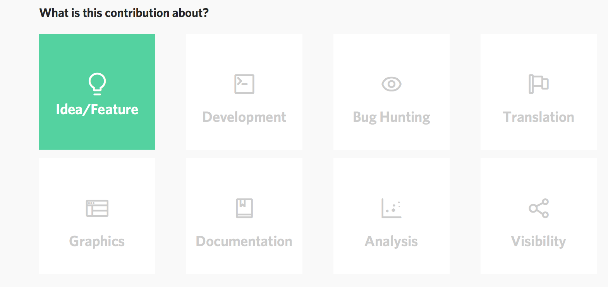

对于不懂编程的朋友可以去做翻译。翻译需要去crowdin.com登陆。那里的登陆用户和密码跟Steem没有关系。建议使用同样的用户名，表功的时候比较方便。大家可以看我这个[翻译贡献帖](https://steemit.com/utopian-io/@nationalpark/translation-for-openproject-to-chinese)。从登陆，到翻译完成，到乌托邦发帖总共忙活了一个多小时。发现自己不喜欢翻译这种事情，以后可能不玩这个了。大家谁有兴趣翻译可以去玩。

像我一样对翻译没有兴趣的可以去提供新点子或者给各种开源系统找Bug。注意，您的贡献必须要对应GitHub的项目，提交贡献时必须填写：

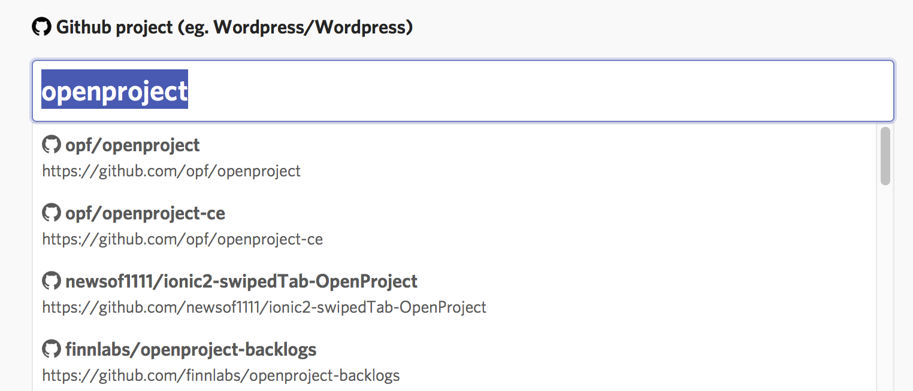

不一定需要GitHub的账号也可以做以上的工作。所以不是程序员也可以贡献很多。

- 如何获得奖励

在乌托邦发表帖子以后会有moderator来看。Moderator可以直接批准或者拒绝，也可以提出修改意见。我的前两个帖子都是根据意见修改以后接受的。

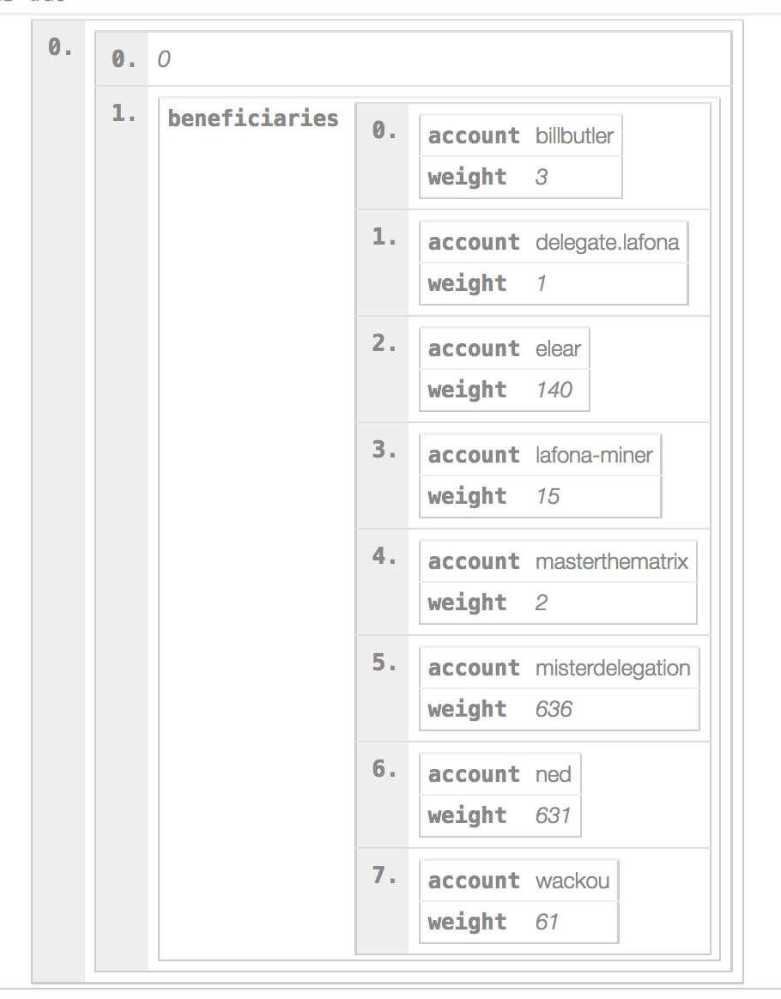

在乌托邦的帖子会有很多beneficiaries，这些都是给乌托邦代理的SP的大股东。你的每个帖子都需要给这些股东分红。

- 总结

[@utopian-io](https://steemit.com/@utopian-io)用Steem系统奖励开源系统的贡献者。这个账号获得了超过三百万代理，也是目前不多的给草根小鱼点赞的大鲸账号。希望大家玩的开心。

## busy.org ^[作者:\@wang-peilin;@kimzwarch;编辑:\@maiyude;原文链接:https://steemit.com/cn/@wang-peilin/steemit-busy-cnsteem-utopian;https://steemit.com/utopian-io/@kimzwarch/steemit-busy-org]
刚来Steemit的新人可能经常会经常听说Busy，CNSteem，Utopian（乌托邦），这几个词，却搞不懂它们是什么，那么它们是什么呢？我们应该都知道，Steemit的内容都是使用区块链技术保存，我们可以把这个区块链当作一块光盘，而我们可以使用很多方法播放这块光盘，比如DVD,EVD,或者带有光驱的电脑。也就是说我们可以用Busy，CNSteem,Utopian以及原版Steemit,这些不同的网站去读取这个Steemit区块链。那么既然有了Steemit.com这个网址，为什么还要用其它网址呢？这就是因为每个不同的网址登陆这个区块链都有不同的优缺点，下面我们分别介绍吧。

- Busy
Busy的主网页为busy.org,这个网页的主要优势是在原版Steemit.com的基础上增加了很多新功能，比如查询文章详细收益的功能，如下图所示：

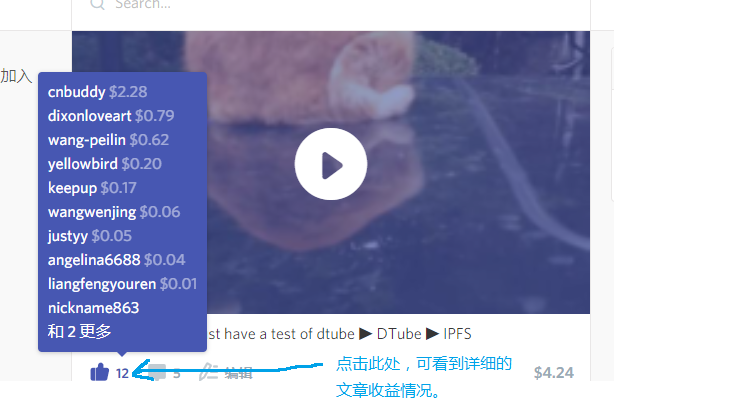

另外还有查看每日Steem以及SBD价格的功能，如下图所示：

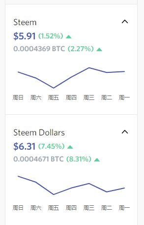

还有一个就是当你使用Busy发表文章并在标签中加入busy，你就可以获得busy对文章的点赞。

接下来我们来详细了解一下busy的各种设置与功能。

- 这里是Busy.org 的应用介绍：

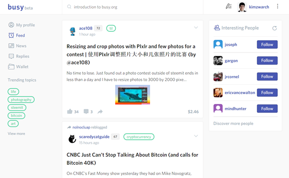

当你通过SteemConnect登录之后，你就会看到这个页面。在左上角，你会看到在Steemit.com上熟悉的选择标签。让我来一一为你介绍：

- 我的资料-我的个人资料主页
- 订阅-显示订阅的帖子（被你关注的用户）
- 最新-显示其他用户的帖子（根据流行，最新，热门，推广来呈现）
- 回复-用户对你的帖子或评论的回复
- 钱包-就是钱包，基本上就是和Steemit一样，只是有比较好的用户界面
- 热门话题-里边有不同的流行标签
- 中间的部分就是大家的帖子，和steemit没两样。而在右边就会有推荐用户让你关注（本身觉得显示出我经常关注的用户比较实际）

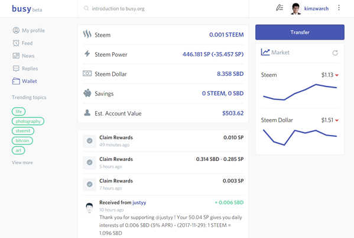

这个是钱包页面。设计比较清晰，简洁，而且右边还有Steem 和SBD的实时价格。除此，也可以看到全部的Steem和SBD交易（和Steemit一样，但最重要比较快）。

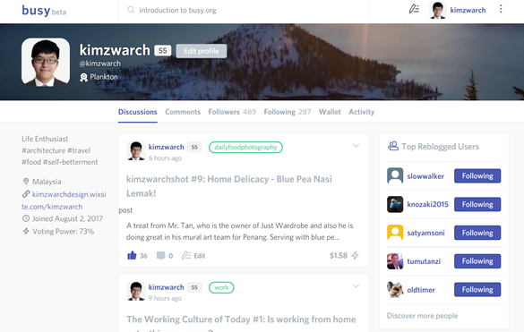

这是你的个人资料主页。无法否认，这个设计比Steemit好许多，哈哈。而且，你可以在右下角看到自己的点赞能量（Voting Power），能量越少，点赞的价值也越少。你也可以看到你是几时加入Steemit的。


这里，你可以选择设置功能。

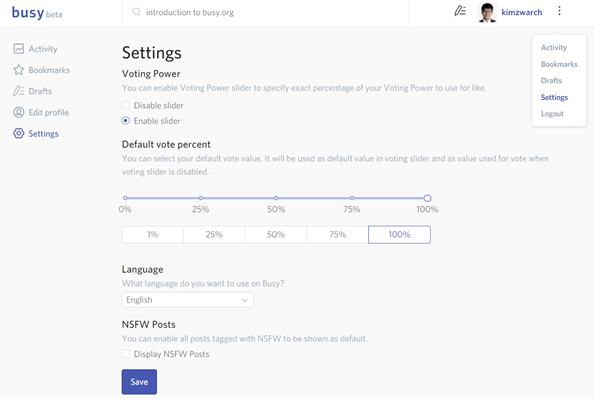

和Steemit不同之处在于，Busy.org的设置内可以调动点赞百分比，不像Steemit这样只能默认100%点赞（除非有500SP以上身家）。

啊，忘了告诉大家！这里可以换语言设置。赶紧把English换成简体中文。哈哈，方便大家阅读。我也是刚发现新大陆。
然后，最下方的NSFW其实是那些不适合在公共场合阅读的帖子（通常都是有暴力色情成分），所以就不必点它。除此，在Busy.org你还有书签功能！就在右上角的设置选项之上，点击后就会呈现出全部的收藏帖子。

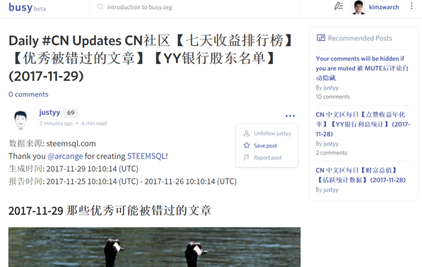

要怎么收藏帖子呢？就在帖子的右上方（有三个圆点），点了后选择收藏就可以了。

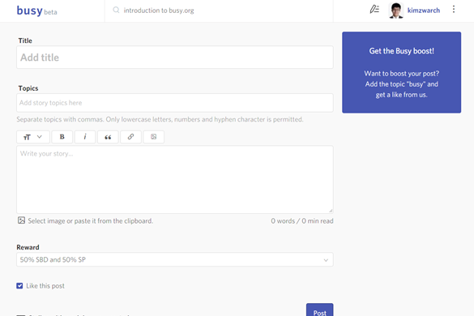

要怎么写文章呢？你可以点击你照片旁边的铅笔图像。之后，这个熟悉的文章页面就出现了（和Steemit没差，这里就不细说了）。

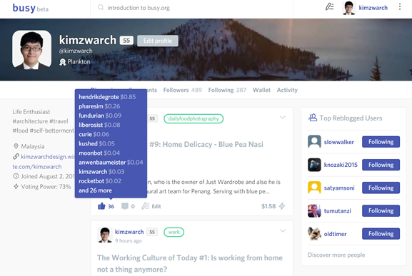

还有个好料没介绍给大家，如果把鼠标移向点赞的数量，你就可以看到点赞你的用户和价值。这是Steemit没有的功能。

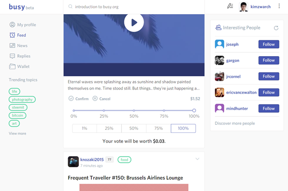

最后，你也可以在点赞时，选择自己要的比重，不必100%赞了，而且也可以看到自己的赞知多少。

一些在Busy.org的使用指南：

- 在Busy.org发帖子后，在Steemit自然就会出现那个帖子。
- 在Busy.org发帖子，记得标签 “busy“ 这样busy的机器人回来赞你的帖子
- 机器人只在12小时内赞一个帖子，就是说一天可以有两个帖子被赞。
- 机器人不必付费，只需有凑足500SP总身家的跟随者即可。
- 如果要得到100%的点赞百分点，那么得有1200万SP 的总身家跟随者支持你啊。（大概是25条大鲸！）
- 当机器人不够能量时，回调高比重率，就可能无法得到预期的点赞值（好过没有嘛）

总的来说，使用Busy.org也是可以赚赞。最重要就是提高自己的影响力，造福人群。

> 影响力=更多跟随者=更高价值的赞

## dtube ^[作者:\@yellowbird;编辑:\@maiyude;原文链接:https://bihu.com/article/216210]


DTube是基于steem区块链开发的一个去中心化的视频分享网站，跟[busy.org](http://mp.weixin.qq.com/s?__biz=MzI4NDQ0NTIwNw==&mid=2247484210&idx=1&sn=248512f738b56345424410b5451f13b7&chksm=ebfa1c4adc8d955c871f114ec1f626d36d46c8c3b975af04e0726e676aba10a86c721f92df9c&scene=21#wechat_redirect)和steemit.com是类似的概念。在DTube上点赞留言分享，数据上传steem区块链后在steemit上是同步更新的。

那么DTube具体是什么，如何使用，我们来初步体验下：

**1、登陆**

登陆网址：https://d.tube

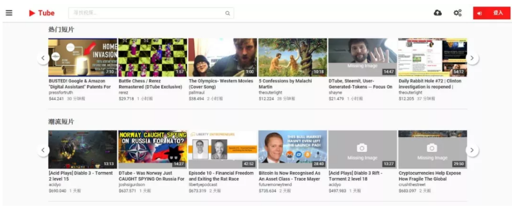

打开网站后，我们可以看到网站的首页已经有很多的视频分享，有热门短片，潮流短片等等。视频下面有个美元$的符号，跟steemit一样是分享内容获得点赞的收益。

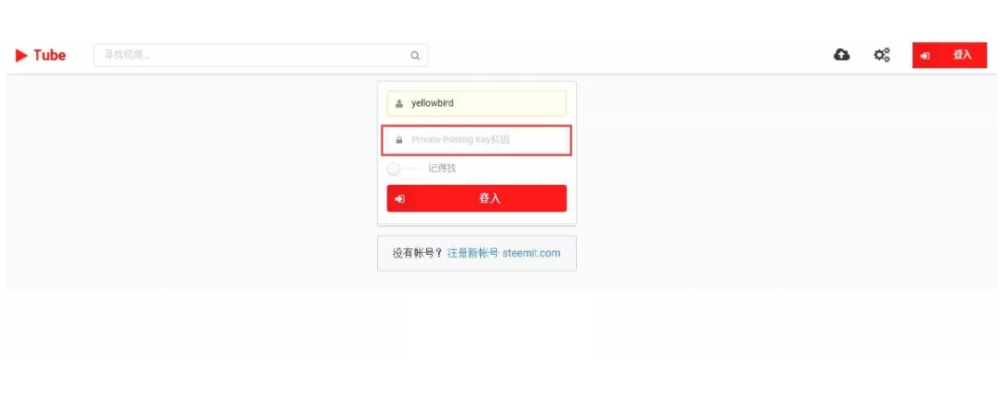

点击右上角登陆，出现上图的登陆界面。由于DTube是搭建在steem区块链上，使用steemit账号+post私钥登陆，如果没有steemit账号，那你需要注册一个。

输入steemit ID账号，注意登陆密码一栏是输入private post key。需要登陆steemit获取private post key。

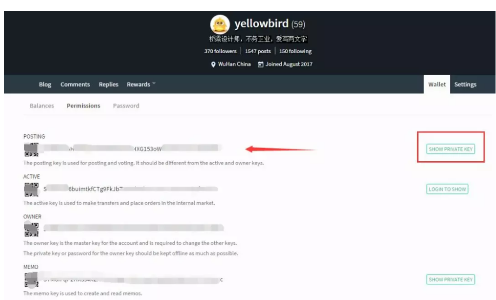

进入在steemit的钱包页面的permissions，在第一行，点击右侧的 show private key，我们可以在左侧得到我们需要的DTube登陆密码（密码千万不要泄露）。

**2、点赞留言**

登陆后，你就可以去访问大家分享的视频，可以给他们点赞和留言了。

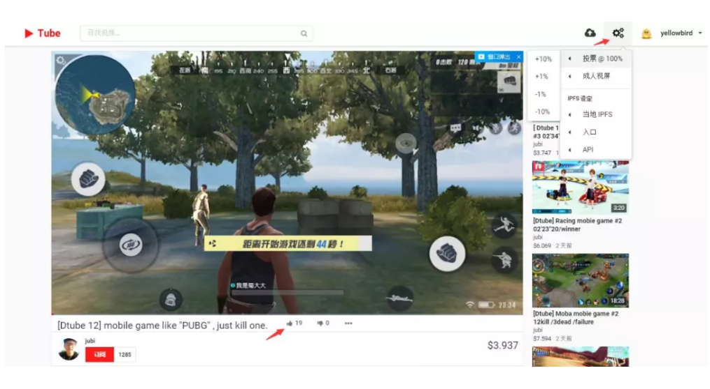

如图，访问了一用户的游戏视频分享，在视频下面有一个大拇指的按钮，就是点赞。

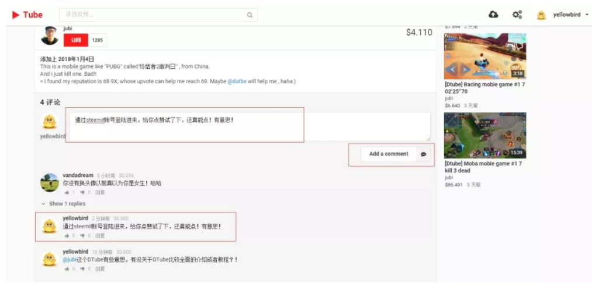

也可以留言，在这里的留言是同步显示到steemit上。

**3、分享自己的视频**

在网站右上角有个向上镜头的云朵，点击进入上传视频的页面。按照步骤一步步操作。1、上传视频  2、上传封面图片  3、提交到区块链。添加标题，内容摘简要和标签（dtube是默认标签，可自行再添加其它标签）。

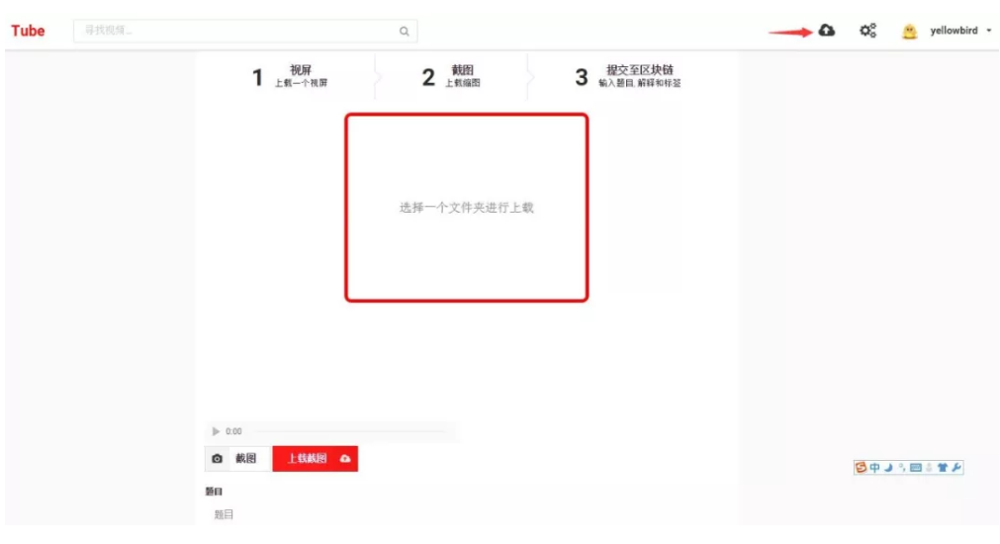

封面图片可以由DTube直接截屏视频获得。DTube只支持用户自己上传视频，不支持其它视频链接。

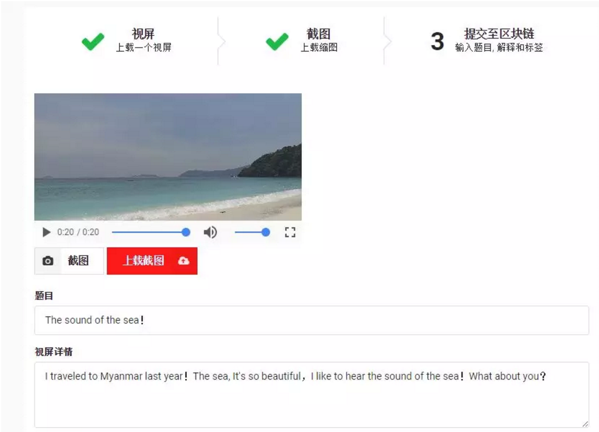

跟steemit上传图片一样，DTube视频上传的速度很慢。在steemit中发文上传图片，图片并不上传到steem区块链上。DTube也是类似，不过DTube上传的视频接入了IPFS存储服务（一个去中心化的可能颠覆http网络协议的区块链项目）所有的视频将会先上传到IPFS存储。

视频及截图上传完成后，填写标题，摘要及标签后就可以点击提交！

提交完成后，弹出提交完成的信息，点击WATCH YOUR VIDEO你就可以查看你上传的视频了。

同时steemit上也自动分享了DTube上分享的视频。

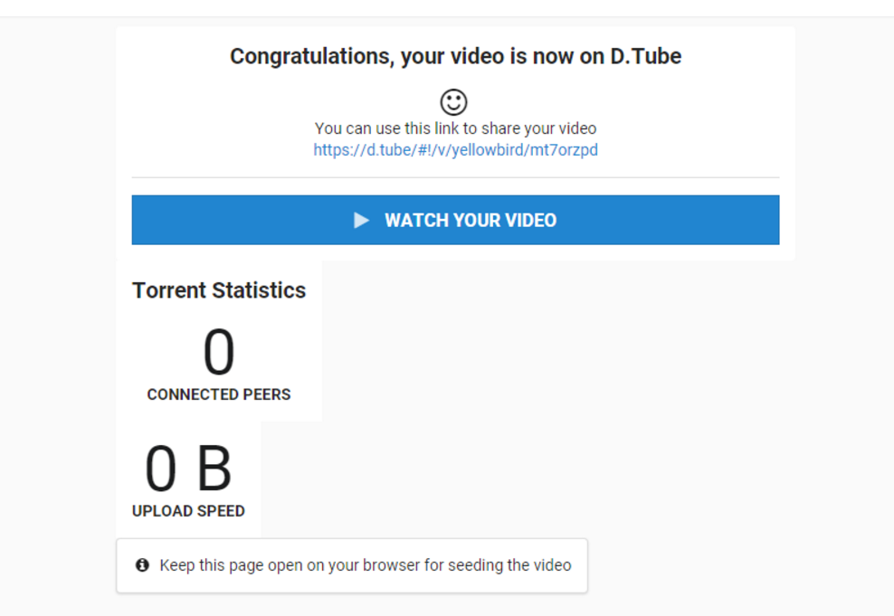

在steemit里同步更新的视频分享如上图，steemit里点赞在DTube里数据也是同步的。在steemit里点击编辑，可以对DTube分享的视频摘要进行修改！


除了在steemit写文章外，现在你也可以在DTube上分享视频了，顺便赚点零花钱！
## 延伸阅读：授权与安全 ^[作者:\@rileyge;\@skenan;编辑:\@maiyude;原文链接:https://steemit.com/cn/@rileyge/steemconnect-v2]

- 什么是 SteemConnect

在讲这个问题之前，先说一个生活中的例子。大家都有过在淘宝上购物的经历，成功的应对了买家和卖家之间的信任问题是淘宝最成功的设计之一。我们购物时，并不了解卖家，无法信任卖家，但我们却需要在卖家发货之前付款。此时淘宝是怎么做的呢？淘宝让自己成为交易的第三方，买家把钱给了一个可以信任的第三方，就不担心自己的钱款安全了。

同样道理，我们在登录第三方的Steem应用时，把自己的用户名密码直接提交给第三方应用，特别是我们不熟悉的第三方应用是非常不安全的。所以我们也需要一个大家都可以可以信任的第三方，来保证我们的账号安全的同时，又能够把我们的部分权限授权给第三方应用。SteemConnect就是这样一个可以信任的第三方。

现在，Steem上的应用生态正变得越来越好，其中SteemConnect的出现起到了非常重要的作用。它为去中心化平台提供了一个安全的中心化授权接口，使用户与应用之间授权变得安全、简单又高效。

- SteemConnect 基本原理

SteemConnect 有 V1（SC1） 和 V2（SC2） 版本，两者从架构上来讲有很大不同。SC1将加密后的私钥存储在Cookie 中，但 SC2 并没有这样做。SC2 采取了一种“多重授权（multi-authority）”的方式，只要你将相应的权限授予第三方应用，他们就可以在不使用你的私钥就可以进行经过你授权的操作，进行如发布、投票、回复等操作。你也可以在任何时候收回你对第三方的授权。

通过“多重授权”的方式，用户就能非常安全的使用第三方应用，而且 SC2 的安全性要远远高于 SC1，所以不推荐使用 SC1。以下的讲述中，如果不特殊指明， SteemConnect 特指SteemConnect V2。

SteemConnect 的“多重授权”的实现，使用了OAuth2标准。OAuth是一个关于授权的开放网络标准，在全世界得到广泛应用，目前的最新版本是2.0版。现在我们经常使用的微信、QQ注册登录第三方网站的授权都是使用的此标准。

- 开发者注册与设置

第三方应用要接入SteemConnect，需要事先注册，注册地址：<https://v2.steemconnect.com/dashboard>

登录之后，点击左下方的My Apps, 在 My Apps 界面中点击 New App：

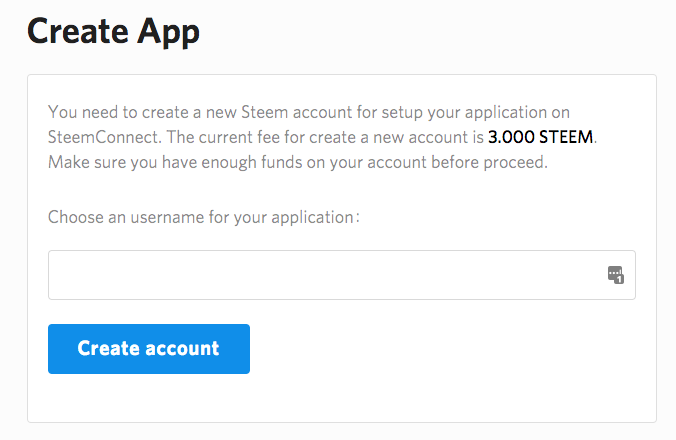

需要花费 3 Steem 的费用来账号注册一个APP，此账号由官方管理，你接触不到私钥。账号名称没有强制要求，但惯例以app结尾，如busy.app, cnsteem.app等。

APP 注册成功之后，我们需要对 APP 进行配置，点击My Apps -> 选择 App -> 选择Edit：

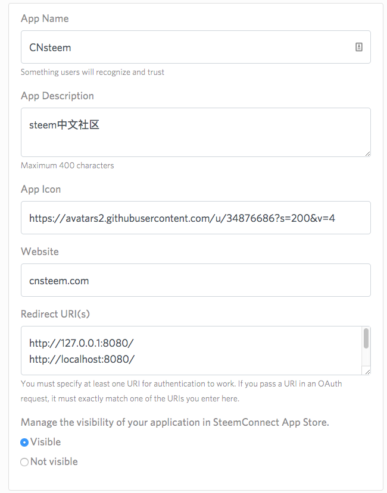

最重要的是Redirect URI(s)的设置，它可以设置一个或多个，但一定要包含下文`sc2.init`中设置的授权后返回的页面地址（callbackURL）。如在本地测试中（下文例程使用本地测试），用户申请授权后返回<http://localhost:8080/> ，Redirect URI(s)中必须有相同的地址！

- SteemConnect 应用开发

Steemit 官方为我们提供了完整的 Javascript 开发接口和示例，用户可以在github中找到完整的源码：
<https://github.com/steemit/sc2-sdk>
<https://github.com/cnsteem/sc2-angular>

本文下面以cnsteem提供的augular版本的SDK为例，来详细的讲述使用 SteemConnect 进行第三方应用的授权方法。

- SteemConnect 初始化

在页面载入过程中，要对sc2进行初始化：

```
sc2.init({
  app: 'cnsteem.app',
  callbackURL: 'http://localhost:8080/',
  scope: ['vote', 'comment']
});
```

上面的代码中，我们初始化了三个参数：

- **app**: 此参数需要初始化为我们在 SteemConnect V2 后台注册的APP的名称。

- **callbackURL**: 此参数为授权后跳转到的页面 URL。此 URL 必须包含在APP后台设置的 "Redirect URI(s)" 列表中。

- **scope**: 此参数表示用户授权给APP的权限列表。权限列表及具体描述可以参照下表。

  | 名称                 | 描述                                           |
  | -------------------- | ---------------------------------------------- |
  | login                | 验证身份                                       |
  | offline              | 允许长期使用令牌                               |
  | vote                 | 对文章或评论点赞、踩或取消点赞                 |
  | comment              | 发表评论或文章                                 |
  | comment_delete       | 删除评论或文章                                 |
  | comment_options      | 给文章或评论添加选项                           |
  | custom_json          | 关注、取关、屏蔽、转发等任何`custom_json` 操作 |
  | claim_reward_balance | 赎回奖励                                       |

除上述三个参数以外，还有一个参数 **accessToken** 也可以在`sc2.init`中进行设置。

- **accessToken**: 授权成功后返回的“接入令牌”，授权成功后就可使用此**accessToken** 执行相应的操作。

但在实际开发中，在进行初始化时，我们往往不知道 **accessToken**。这种情况下，我们可以在初始化之后使用`sc2.setAccessToken(accessToken)`方法对此参数进行设置。

- 其他常用操作

下面的代码段使用AngularJs，在`sc2.init`后，设置了`accessToken`，并将读取评论、点赞、修改用户信息和登出等操作封装成函数，以方便使用。

```
//code area 1，对module进行初始化
var myapp = angular.module('app', [])
  .config(['$locationProvider', function($locationProvider){
    $locationProvider.html5Mode(true);
  }]);
//code area 2，设置名为Main的controller
myapp.controller('Main', function($scope, $location) {
    $scope.loading = false;
    $scope.parentAuthor = 'skenan';
    $scope.parentPermlink = 'steem-connect-v2';
    //$location为AngularJs中对URL进行相关操作的变量
    $scope.accessToken = $location.search().access_token;
    $scope.expiresIn = $location.search().expires_in;
    $scope.loginURL = sc2.getLoginURL();

    if ($scope.accessToken) {
      //设置 accessToken
      sc2.setAccessToken($scope.accessToken);
      //读取用户信息
      sc2.me(function (err, result) {
        console.log('/me', err, result);
        if (!err) {
          $scope.user = result.account;
          $scope.metadata = JSON.stringify(result.user_metadata, null, 2);
          $scope.$apply();
        }
      });
    }
    //是否通过验证
    $scope.isAuth = function() {
      return !!$scope.user;
    };
    //读取评论
    $scope.loadComments = function() {
      steem.api.getContentReplies($scope.parentAuthor, $scope.parentPermlink, function(err, result) {
        if (!err) {
          $scope.comments = result.slice(-5);
          $scope.$apply();
        }
      });
    };
    //评论
    $scope.comment = function() {
      $scope.loading = true;
      var permlink = steem.formatter.commentPermlink($scope.parentAuthor, $scope.parentPermlink);
      sc2.comment($scope.parentAuthor, $scope.parentPermlink, $scope.user.name, permlink, '', $scope.message, '', function(err, result) {
        console.log(err, result);
        $scope.message = '';
        $scope.loading = false;
        $scope.$apply();
        $scope.loadComments();
      });
    };
    //点赞
    $scope.vote = function(author, permlink, weight) {
      sc2.vote($scope.user.name, author, permlink, weight, function (err, result) {
        if (!err) {
          alert('You successfully voted for @' + author + '/' + permlink);
          console.log('You successfully voted for @' + author + '/' + permlink, err, result);
          $scope.loadComments();
        } else {
          console.log(err);
        }
      });
    };
    //更新用户信息
    $scope.updateUserMetadata = function(metadata) {
      sc2.updateUserMetadata(metadata, function (err, result) {
        if (!err) {
          alert('You successfully updated user_metadata');
          console.log('You successfully updated user_metadata', result);
          if (!err) {
            $scope.user = result.account;
            $scope.metadata = JSON.stringify(result.user_metadata, null, 2);
            $scope.$apply();
          }
        } else {
          console.log(err);
        }
      });
    };
    //登出
    $scope.logout = function() {
      sc2.revokeToken(function (err, result) {
        console.log('You successfully logged out', err, result);
        delete $scope.user;
        delete $scope.accessToken;
        $scope.$apply();
      });
    };
  });
```

- Access Token在页面之间的传递

Access Token是登录成功的最重要的信息之一，用户使用Access Token可以进行相应的操作。在上文中 Access Token 是从 URL 中读取的，把Access Token放到 URL 中虽然也可以实现 Access Token 在页面之间的传递。但这种方法既不安全也不方便。在实际应用中，最常用的方法为将Access Token存储在Cookies中。

为了和原代码保持更高的一致性，使用了angular-cookie库。大家可以在github上找到这个库。话不多说，上代码：

```
myapp.controller('SetCookies', ['$scope', '$location', 'ipCookie', function($scope, $location, ipCookie) {
    $scope.loading = false;    
    $scope.accessToken = $location.search().access_token;
    $scope.expiresIn = $location.search().expires_in;

    if ($scope.accessToken) {
      sc2.setAccessToken($scope.accessToken);
      ipCookie('st_access_token', $scope.accessToken, 
            {expirationUnit: 'seconds', expires: $scope.expiresIn * 1});
      sc2.me(function (err, result) {
        console.log('/me', err, result);
        if (!err) {
          $scope.user = result.account;
          $scope.metadata = JSON.stringify(result.user_metadata, null, 2);
          $scope.$apply();
        }
      });
    }
    $scope.isAuth = function() {
      return !!$scope.user;
    };
  }]);
```

此段代码和上面的代码相比较，差别主要有以下三点：

- 使用了angular-cookie.js库

- 从 URL 读取Access Token之后将其存储到了Cookie中

  在此设置之后，就可使用`ipCookie('st_access_token')`从Cookie中读取 Access Token。

- 使用示例

- callback.html

  该页为验证成功返回的页面，其功能主要是实现跳转及将Access Token存储在Cookie中，所以此页面使用的Controller为SetCookies。

  ```
  <!DOCTYPE html>
  <html lang="en" ng-app="app">
  <head>
    <title>Demo</title>
    <base href="/" />
    <meta charset="UTF-8">
    <meta id="viewport" name="viewport" content="initial-scale=1.0, maximum-scale=1.0, user-scalable=0"/>
    <meta http-equiv="Content-Type" content="text/html; charset=utf-8" />
    (html comment removed: [if lt IE 9]><script src="//html5shiv.googlecode.com/svn/trunk/html5.js"></script><![endif])
    <script src="sc2/angular.min.js"></script>
    <script src="sc2/angular-cookie.min.js"></script>
    <script src="sc2/sc2.min.js"></script>
    <script src="sc2/steem.min.js"></script>
    <script src="sc2/app.js"></script>  
  </head>

  <body>
  <div ng-controller="SetCookies">
    <div>
      <h3>在此页中主要是设置Cookies和跳转</h3>
      <a href="index.html">SteemThink</a>   
    </div>
  </div>
  </body>
  </html>
  ```

- index.html/testpage.html

  此类页面为普通的页面，的这些页面中可以使用所用用户授权的操作。使用的Controller为Main，但已经将读取 Access Token 的位置从 URL 改为Cookie。

  ```
  <!DOCTYPE html>
  <html lang="en" ng-app="app">
  <head>
    <title>Demo</title>
    <base href="/" />
    <meta charset="UTF-8">
    <meta id="viewport" name="viewport" content="initial-scale=1.0, maximum-scale=1.0, user-scalable=0"/>
    <meta http-equiv="Content-Type" content="text/html; charset=utf-8" />
    (html comment removed: [if lt IE 9]><script src="//html5shiv.googlecode.com/svn/trunk/html5.js"></script><![endif])
    <script src="sc2/angular.min.js"></script>
    <script src="sc2/angular-cookie.min.js"></script>
    <script src="sc2/sc2.min.js"></script>
    <script src="sc2/steem.min.js"></script>
    <script src="sc2/app.js"></script>
  </head>

  <body>

  <div class="container py-5" style="max-width: 600px;" ng-controller="Main as main">
    <div>
      <h3>登录 & 退出</h3>
      <b ng-show="isAuth()"> @{{user.name}}</b>
      <button ng-show="isAuth()" class="ml-2 btn btn-secondary" type="submit" ng-click="logout()">
        退出
      </button>
      <a class="btn btn-primary" ng-href="{{loginURL}}" ng-hide="isAuth()">登录</a>
    </div>

    <hr />
    <h3>评论 & 点赞</h3>
    <div class="input-group input-group-lg">
      @{{parentAuthor}}/{{parentPermlink}} 此帖子的评论: 
    </div>

    <ul class="list-group my-4" ng-init="loadComments()">
      <li class="list-group-item" ng-repeat="comment in comments">
        @{{comment.author}}: {{comment.body}}
        <button ng-show="isAuth()" class="ml-2 btn btn-secondary btn-sm" type="submit" ng-click="vote(comment.author, comment.permlink, 1000)">
          <i class="icon iconfont icon-praise"></i> {{comment.net_votes}}
        </button>
      </li>
    </ul>

    <form ng-show="isAuth()" ng-submit="comment()">
      <div class="input-group">
        <input type="text" class="form-control" ng-disabled="loading" placeholder="Write a comment here" ng-model="message">
        <span class="input-group-btn">
          <button class="btn btn-primary" type="submit">Submit</button>
        </span>
      </div>
    </form>

    <hr />
    <h3>用户信息</h3>
    <p>SteemConnect 允许开发者存储每一个用户的相关信息，例如用户偏好，但不会影响核心功能的使用。</p>
    <form ng-show="isAuth()" ng-submit="updateUserMetadata({ locale: locale })">
      <div class="input-group">
        <input type="text" class="form-control" placeholder="What is your locale?" ng-model="locale">
        <span class="input-group-btn">
          <button class="btn btn-primary" type="submit">Save</button>
        </span>
      </div>
      <pre class="mt-4">{{metadata}}</pre>
    </form>

  </div>

  </body>
  </html>
  ```

如果想要查看完整的代码，可以参考一下网站：

源码（从 URL 读取Access Token版本）：<https://github.com/cnsteem/sc2-angular>

示例网站（从 URL 读取Access Token版本）：<https://cnsteem.github.io/sc2-angular>

源码（从 Cookie 读取Access Token版本）：<https://github.com/RileyGe/sc2-cookie>

示例网站（从 URL 读取Access Token版本）：<https://rileyge.github.io/sc2test>
