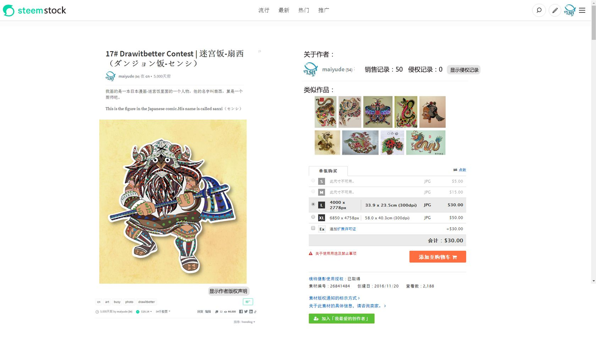
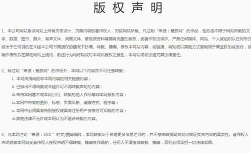
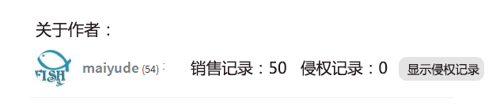
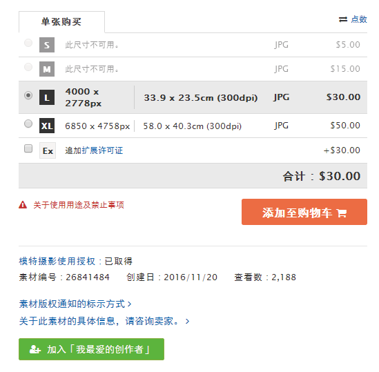

# 二次开发 {#eckfp}
## 基于 steem 搭建社交网站 {#jw_steem_djsjwz}
## 基于 steem 搭建数据统计网站 {#jw_steem_djsjtjwz}
## 基于 steem 搭建个人博客 ^[作者：\@dapeng，原文链接：https://steemit.com/steemdev/@dapeng/build-a-mirror-backup-site-for-your-own-steem-posts-in-30-minutes-or-30-steem]

昨天，我为自己在 steem 上发布的帖子制作了两个镜像网站（[镜像1](https://dapeng.netlify.com/)，[镜像2](https://steemit.netlify.com/)）。每天定时跟 steem 同步更新，作为备份用。

镜像网站的好处是：

1. 应急。万一 steemit.com、busy.org 等前端网站挂了，至少我自己的文章还能来镜像访问。

2. 备份。有朝一日万一 steemsql 等数据库黄了，万一区块链挂了，我辛辛苦苦码出的文章还健在。

3. 修改。steem 上的文章过了7天后就没法修改，而镜像网站的永远可以修改，可以精益求精。

4. 评论。镜像网站上配置的是 disqus 评论系统，多引入一个评论方式。

5. 美观。不管 steemit 等网站界面好看难看，我有一片独立的自留地。

6. 快捷。找自己的文章时，再也不用往下拉，载入，等待，再拉，再载入，再等待……

这两个镜像全部是免费搭建的，搭建完毕后就每天自动更新，不用再操心了。

那么，搭建一个这样的网站需要多久？

熟悉 R 语言的话，从零开始到成功访问，整个过程用不了半小时。如果是 R 语言的新手，那么主要取决于多久能学会 R。无论如何，我花了很多时间来尝试，才建立了下面的步骤，这个时间你可以省了。

搭建这两个网站，用的主要工具是 R 语言的 blogdown 包。大体流程是：用 R 语言在本地搭建一个 Hugo 框架的静态网站，然后同步到 GitHub，再由 Netlify 布署。

下面简要说说步骤。

**用 R 语言搭建 Hugo 网站**

1. 先安装 R 语言和 RStudio。

2. 从 RStudio 的菜单栏创建一个 blogdown 项目，选择中意的网站主题，用不了1分钟，一个静态的 HUGO 网站框架就搭建好了，所有文件都保存在本地的一个文件夹里。

**用 R 语言从 steemsql 或 steemdata 下载帖子**

1. 如果访问 steemsql 数据库，请安装 R 语言的 RODBC 包；如果访问 steemdata 数据库，请安装 mongolite 包。两个数据库都可以提供 steem 上文章的所有信息。

2. 从数据库将需要的帖子下载到本地，并整理成 markdown 格式的文本文件。

3. 将文本文件拷贝到你的网站文件夹的 contents 里。

4. 运行 R blogdown 的建站函数。

**将网站文件夹发布到 Github**

在 Github 上创建一个新的项目，将你的网站文件夹发布上去。

**用 Netlify 布署**

用你的 Github 账号登陆 Netlify，创建一个新站点，选择你的网站文件夹，并用 hugo_0.19 作为布署命令。设置完毕后，短则几秒，长则几分钟，就可以访问你的镜像网站啦！

Netlify 提供免费的二级域名。当然，你也可以买个域名来绑定。

**每天自动同步**

1. 编写一个批处理程序，来调用 R 代码，从而完成下载帖子、建站、与 GitHub 同步的工作。

2. 用 Windows 的自动任务，每天自动运行上述批处理，就实现了每天自动同步。

## 延伸阅读：打开脑洞，我们还能做什么 

### steemstock——一个伟大的保护版权的区块链图片销售网站[作者：\@maiyude]

打开脑洞，其实基于steem可以建立很多有趣的网站。

比如我们就可以基于steem建立一个伟大的保护版权的图片销售网站。

steemstock是一个建立在steem区块链上的图片销售网站。

在这里，你可以自由的发布你的艺术创作图片，这些图片可以是艺术作品、电脑插画、摄影作品等等。发布之后你可以获得别人的点赞从而获得收益。如果你愿意，你还可以在steemstock出售你的作品，你可以选择出售单次使用权或者出售全部版权。买卖双方都可以在这里购买到你想要的作品。

另外steemstock采用了区块链的特性保证作品版权不受侵害。当作者需要售卖他的作品的时候，他需要发布一份作品版权声明，这份声明将会在区块链上永久保存，这将作为该作品的出生身份证，这将会是该作品的发布证明，可用于任何侵权官司。当然，如果该作品是侵权作品，这将会是他的罪证。

另外系统会显示关于作者过往的销售记录，良好的信誉将会伴随着你的一生，一个侵权记录也会永远陪伴着你。

还会自动全网搜索类似的作品，确保作品为原创。当然作为参与者也可以参与打假，你可以在侵权作品上狠狠的踩上一脚。

在steemstock你可以根据你的需要购买不同尺寸的图片，当然不同尺寸的图片定价也不一样。

steemstock一旦建成，将会是一个促进艺术创造者制造财富的网站。

### 创建一个基于Steem区块链的中国社区网站[作者：\@coldhair;编辑：\@maiyude;]

经过这些天的学习研究，我认为Steem是一个前景无限的区块链基础设施，中国创业者们完全可以在这个基础设施的上建立一个或数个有社会主义特色的社区网站，哈哈，就是本土风格的区块链网站啦，具体蓝图听我慢慢描绘。

这些想法是受到 \@myfirst 发的一篇[《解决CN访问慢的问题》](https://steemit.com/cn-programming/@myfirst/7akniq-cn)启发产生的。在文章中他提到，中国访问Steemit速度很慢，主要有两个原因，一个是Google的字体（谷歌被墙）问题，另一个是图床（远在USA）问题，并给出了自己思考的解决方案，是篇非常棒的文章，我也从中Get到了新知识。

但是，我觉得Steemit要想拉拢更多的中国用户，并抢占中国市场，仅解决以上问题是远远不够的，甚至可以断言，Steemit运营团队根本没有这个能力。

要想让广大的中国用户加入到Steem生态链中，还须靠勤劳智慧的中国人来解决。因为，在中国搞网络服务不是资金雄厚、技术无敌就好使，你还得深谙中国的特色文化，清楚一系列的规则和潜规则。

Steemit血液里流淌的就是Anti-censorship，一个没有审查机制的网站，在中国是绝对没有生存可能性的，咱领导也不可能允许洋人开办的社交媒体类网站在中国发展壮大，请原谅咱领导的不自信吧。很多网络公司不愿来中国，就是因为政策风险太大，担心投资后血本无归。

中国要出现一个基于Steem区块链的网站，必须符合政府进行严格内容审查的要求。办法早就有人提出来了，网站前端展示设置审核机制，通过技术在展示端屏蔽掉，使敏感内容不在显示。对于不符合国家政策的内容，让政府和公众都看不到，问题就解决了。

还要有个黑名单或禁言功能，对于一些反复发垃圾内容的用户，直接禁言或拉黑。Steemit这样靠大鲸在踩死的方法不够高效，不符合中国特色，在中国，咱领导不想让公众看到的东西，分分钟你就得让它消失才行。

做到了这一点，才有了起码的生存可能性，如何对政府监管部门攻关，取得许可牌照则是后话，不在我今天幻想的范围内。

另外，网站还得去迎合中国用户的习惯，满足其使用体验。毫不客气地说，过去，Steemit的用户体验实在是糟糕的很，现在，Steemit的用户体验依然是糟糕的很。

Steemit的用户界面、基础功能（如，更便捷的私信功能，我看中了个漂亮的Steem妹子，怎么私信她要微信号呢？）虽然在不断进化迭代，我觉得进展还是太慢，有很多用户因为这个糟糕的体验离开了。

以CN社区为例，现在CN社区的发贴量和活跃度甚至不如当年我们医学院的小论坛，我想，如若没有金钱诱饵以及一些技术爱好者的支撑，CN社区的很多用户都要流失了。

我感觉Steemit团队可能在运营上有些偏差，太偏向注重区块链的机制的设计，硬叉18、硬叉19，现在马上到硬叉20了，还要插、插、插，不知道什么时候才能插到所有人都爽歪歪。事实上不可能让所有人都满意，世界上没有绝对公平的事情，定好规则先运行，不能朝令夕改。

Steemit团队过于重视技术和程序机制的完美性，而忽略了网络的基本功能是提供服务，即使Steem区块链的理念再先进，技术再强大，把算法再高深精巧，机制设计的天衣无缝，如果网站的体验都不好，也不会形成强大的用户群。

如果是让我搞这个基于Steem区块链的中国社区网站，首先要弄一个虚拟币兑换人民币的便捷接口，不管是通过微信红包，还是支付宝等方式，关键是能让中国的大妈们看懂会用，方便好用就行，速度上并无需太高要求，现在国内很多网站的提现都要等上两个小时甚至数天。

然后想办法大量吸引那些有时间没地儿用的闲杂人等，中国有大量的在岗闲置人员，比如一些事业单位职员、政府公务员等，过去开心网、人人网火的时候，他们偷菜，偷菜，现在他们是刷朋友圈，刷朋友圈。

别以为这些人都是笨蛋，产生不了优质的内容，其实这些人里面很多都是特别有才华的，考入事业单位、公务员不仅需要高学历，还要通过很难的考试。这类人群的智商和情商都不低，只要有动力，他们完全可创造更高价值的内容。就是体制的原因，温水煮青蛙，把它们煮懒了，有些煮瘫痪了。

其实，任何社群对于新人来说，想刚进来就获得好的收益都很很困难。要么花钱造势，要么就是认真经营，不然很难一下子得到很好的声誉或收益。

如果Steem底层的机制不太可能让新用户刚进来就获得收益，不好留住新用户，那就用现金砸出一批初始用户，例如通过“注册就送现金红包”之类的方式吸引一些前期用户，玩够一定的时间和经验，你就可以把现金提走。

当有了第一批初始用户，并让一部分人多多少少赚到了些钱，让公众知道这是一个能赚钱的网站，自然就能吸引越来越多的用户。

根本用不着去炒作区块链、开源等等概念性的东西，普通公众根本也不懂这些概念，多数人想要的无非是一个干净无广告的网站，能发发文章、点点赞，有些社交功能等。看看中国的一些门户网站，广告都快占满整个窗口了，还嫌不够，还要弹窗，干脆把我的屏幕都强奸了吧。

Steemit的宣传也让很多人误解，认为虚拟币就是社交网站上用的，而不理解它像比特币一样也可以进行交易流通，也可以投资。我开始也有同样的误解，认为Steem虚拟币就是专门为这个网站设计的一种区块链货币。

基于Steem区块链可以开发出很多有趣又实用的功能，如增加一个便捷的打赏按钮，我们一点点击作者头像或名字有快捷的打赏入口，增加这个小功能便可以创造很多丰富有趣的玩法，比如付费问答，悬赏任务、在线购物等。

再比如，我想给第6个，第66个、第666个回复本贴的Steemors打赏红包，就非常便捷了，这个就是玩论坛时的抢楼活动嘛，哈哈。

再开发个手机APP啥的，估计那时，年轻貌美的小姑娘们晚上起夜都要摸起手机，顺便发个妩媚的床照，让人点赞，赚点零花钱。

当然啦，我是一个外行，不懂技术也不懂网络运营，只是看热闹产生了一些碎念念，或许能对某些人产生一些启示，或许只能看作天马行空的臆想，反正，人家都说我是一个脑洞大开的医生。

