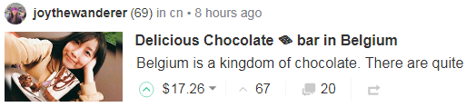

# 专题：Steem 十讲^[作者：\@deanliu，编辑：\@dapeng，校对：\@meixia] {#zt_steem_sj}

## 预告^[原文链接：https://steemit.com/cn/@deanliu/steem] {#liu0}

CN区的朋友们好，

如果你们还在，如果你们还在看，还在写， 那应该是近乎真爱了吧？我还在写，很少看，不太点，确定不是真爱，真爱是没有问号的。

我的收入比起你们还好多了，我继续写没什么好骄傲的，所以向各位还在认真写的致敬了！

真爱假爱，也罢，多赚少挣，也罢。既然我们都还在，表示party继续，每个人跳每个人的舞，要是有缘碰在一起，就一起摇摆一首歌，这一篇文章，就是要预告，我在这大party里，在我们这一个冷掉的一角，试着再点燃一些什么，或许，没多久，这一角还能再旺说不定……

一年多过去，前一波高潮过去，正好是一个潜心 <del>向佛</del> 修行的好机会，我一直以来也有很多想法，也许也多少说过一些，但总是没有系统性地落为文字，正好这次借此机会，跟还有点爱的朋友们继续切磋聊聊。我刚好也不必冒着speak ill of steem的风险，冒着在正热的舞会上冷言冷语造成负面能量的风险，反而现在是真正可以放开聊的好时机。另一方面，也可以再次跟朋友们说说话，弥补我没法一一点各位的遗憾。大家都可以有点成长？hopefully……

我准备要开始分为十次，谈谈我过去一年多来对于Steem的一些总结心得，包括一些看好的地方，包括一些看坏的地方。既然是我个人的心得看法，必然有所缺失与偏颇，这也是我希望能够跟各位，不论是超级旧朋友，普通旧朋友，资深新朋友，或是根本是超级菜鸟新朋友，可以一起切磋的地方。

这十篇会各自有主题，下次第一篇就会把总纲公布。若是在讨论时，内容已属于其他次主题的，就等那次到了再讨论，避免失焦。我既希望能把我的想法就教于大家，如果是有价值的，能够幸运的能给你们带来一些知识，那我幸甚之；也希望如果我想法其实有点问题，有人能不客气明白地指出，那更对我是非常有价值的。我相信大家既然还在，既然没卖，一定都还关切着Steem的未来，也必然会有自己独特的观察。

为了表示对于好的见解的鼓励，我每篇讨论希望至少给出3次100%（大概会有$2-$3吧）给提出好见解或好的指正的参与者（如果太冷清就不排除从缺，请见谅），表示对于有价知识的尊重。注意，刻意赞美我的看法是没有点赞的，但我会说谢谢喔！另外，我的点赞当然也是由我来判断，这个判断也可能是偏颇的，不认同也请见谅了！

这一轮完成后，我预期综合这些讨论与意见修正，另外重写十篇，届时就是写英文的，希望对于我的Steem之旅在2017年即将结束之际，作出阶段性的总结，并同时也可以让英文区的各路大神指教一番。这先期的中文十讲，就算是大家帮助我来全面理解这个迷人又烦死人的Steem吧！

## 第一讲：行为的主体^[原文链接: https://steemit.com/cn/@deanliu/2qg2ar-steem] {#liu1}

什么是Steem行为的主体？那得先说说什么是Steem行为。差不多地说，就是各种transactions，包括你发文章、点赞或踩、财务作为的power up/down、转帐等等都是。那这些「行为」的主体是什么？人啊！是吗？不够精确，对应到transaction的话，应该说是accounts帐号才对，至少在code层次上，account才有所定义。来这里的朋友们不用太久就会知道什么是bot，bot也是account，也具有「行为能力」的。

如果你看到这一讲的标题后，第一时间想到人，但经过这样说说，你或许开始可以感受到，Steem上的各式行为的主体，其实并不是那么简单定义的一件事。但，这议题重要吗？我的看法是－非常重要：确认行为主体的性质，才有机会好好建构一个以此为单元的网/链，后续的任何应用才能有坚固的基础。这也是选为第一讲议题的原因之一。

为了方便讨论，我们把Steem上的行为主体简单分为两类（或说两层次）：users与accounts；可以简单地说，前者是人的层次，后者是机器层次。每个user至少会有一个account，这是一定的。

在account层次，可以讨论的是一个user使用多个account的情况，这应该也是颇为普遍的。有几种情况：1) user使用额外的account作为便于区别blogging活动用（例如 \@dapeng使用 \@pzhao），这点可以理解，因为Steem并未提供适当方式给多元产出的作者使用；2) 为了家人朋友、囤积帐号、获得免费steem等原因多注册的；3) 多人合作之公共帐号使用如 \@laodr茶馆（当然这例子严格说是一个account映对多个users使用）

在user层次，由于user不是严格定义的概念，我们可以说user是一个「被认知」为自然人的用户。那什么是被认知呢？就是大家认为你是个人啦！如果要区别一下，我们可以进一步把「被认知」且事实上也是自然人的用户称为Steemians。这其实就带入了之前比较常讨论的马甲（sock puppets）的问题，也就是马甲是Steemians的相反，被认知是但事实上不是人，或是说这「人」已经被其他account给代表了。例如如果其实 \@oflyhigh是 \@deanliu的马甲，文章都是我在发的，那么这就是马甲，但多数人不知道，以为我们是两个人。甚至，有种情况比较少讨论的是，人头帐号，例如我用我儿子照片跟名义等也注册了帐号，说要给他写日记什么的，结果是我自己假装小孩子在写，这完全可以是两个users，但真正在大部分时间只有一个Steemian就是我。这种情况几乎没有人能说嘴，因为真有这人存在，他还同意我这么用。

是不是搞得你头昏了？好，直接谈重点，为什么把行为主体想清楚很重要？

对于我来说，**Steem最大的优势之一就是把区块链从account层次，透过blogging这种人类行为，带到了user层次**。你去看比特币、以太，当然他们都有community，甚至大很多，只是这些community并不在链上面，而是分布在其他特定讨论区或Apps上。Steem是区块链界第一个以「人」为单位、为特色的应用，透过人最基本的「交流」需求，创造了一个众生的网络。最难能可贵的是，这是一个「一般人」的网络，容易亲近，不像是比特币一上来就是钱包、就是一堆钥匙等等。

以「人」为主体的网络为什么很重要？你想想看在真实世界，广告商要投放广告，当然是希望投到有效阅读量大的报纸，如果我印一堆免费赠阅报，号称我有几百万发行量，但都被丢到垃圾桶去，那广告商能被我骗吗？其实，所谓Attention economy，当然是要计较attention of humans, not accounts，所以克制account的滥用，当然是非常重要的了。再例如有人曾幻想过 \@steemit帐号的巨资，有一天可以空投给已注册的用户，那请问该怎么发？一个account算一份？那你还不立马去搞成百上千个帐号去吗？另一个小例子像是CN区之前许多比赛用投票方式产生优胜者也是（得马甲者得天下？）。

这就延伸到SP为什么是重要的。你可能也知道Steem是DPoS机制，DPoS天生就是重视股权的，SP就是股权。很久以前确实有过空投，Golos这个Steem的俄罗斯兄弟就曾空投过Golos币给当时的Steem用户。怎么投？当然是依据SP持有量来发囉！

Steem其实在HF19之前的设计其实是鼓励users在SP的存放上集中到单一account的，就是透过curation的平方曲线，但这个特质的好处又会造成富人影响力提高的坏处，取捨之下，目前形成线性奖励曲线，所以目前大鲸鱼分散SP存放是没有什么代价的。

说了一堆，其实就是要说，如何在这个人的区块链上确认人，很重要，但还没能妥善解决。既然谈attention，表示一定要能有大量真人用户，然后multiple accounts应该要降低使用动机，才不会稀释掉attention的浓度，也才能有后面的economy。SP在某种程度上可以用来处理这问题，但非常有限，这也是造成HF19的背后心理动机。

很多人来到Steem都会谈公平问题，通常想像的是接近民主投票的「一人一票」式公平。而Steem以SP运作的模式是接近「一SP一票」的逻辑，所以才会有那么多牢骚。这里其实隐隐指出两个内在不同的逻辑：单一正常使用的自然人帐户是有价值的，与此同时，DPoS是以资本量为价值的基底逻辑。**Steem是以后者来建构的，但试图要撷取前者的果实，造成许多矛盾之处。**

我是写到这里才意识到这点，但还没有想清楚。

接近尾声，我先提出几个我一个天马行空且或许是存在于未来的解方—关于如何确认Steem行为主体 for 任何后续的有价值运用：那就是...

1) 运用例如AI之类的技术，对于每个account，针对其blogging history (posts/comments)给出**humanity index**，只要是正常且略活跃的用户，这指数就应该接近100。bot用户自然就得分很低，因为可能是大量复製贴上。

2) 建构Steemian**相互背书**机制：其实特定社区内谁是真人谁又有疑虑，大部分成员都会多少知道，不知道谁是假的，至少知道谁是真的；那就可以利用这个community information来鼓励大家认证其他人，但如果万一后来证明你错了，你的真人指数也会下降之类的... 或许rep也可以在这里面有些角色？....

3) **线下认证**真实身分：这点很直观，但实行很困难。未来如果数位身份成为全球化趋势，那或许就可以直接采用了... (认证跟隐私可以分开处理)

## 第二讲：Steem之链 ^[原文链接: https://steemit.com/cn/@deanliu/steem-steem] {#liu2}

在这里很重要，重要到很常见，但又不厌其烦地要说的一句话就是『Steem是区块链，Steemit是UI，Steemit Inc是公司』。在上一讲的讨论中也说了一下。我希望这一句话，读者们已经具备初步理解，才不会在这一讲里面迷失。

今天这第二讲，讲的就是，**Steem区块链，一切的根本，Steem世界万物之依归**。在中华文化里，『道』贯穿天地，一以贯之，为万事万物之依归。Steem之链，近乎于此。

要怎么谈这条链？当然，希望你也已经具备基本的区块链相关知识，简单即可，我也不是什么专家，但总是我们这讲，讲Steem之链，不讲什么是区块链。不过，我还是帮大家复习一下：Steem区块链采用的是跟Bitshares一样的石墨烯(Graphene)区块链技术，其共识模式是DPoS，Delegated Proof of Stake，大致上说，就是由持股者按持股比例投票选出代表(Witnesses)来维护、验证区块链网路 （ 简单对照比特币是PoW，藉由算力来决定共识之产生）。哈哈，不过这跟我们要谈的没太大关係。

区块链很多，甚至DPoS类型的也有一些，重点在于Steem之链的特色是什么？你可能说是内容链平台。这么说也没有错。帮你更精确地说，是内容上链，持股者按照权重，可以决定按照机制设计好的新增代币，要如何分配到各见证人(Witnesses)、持股者(SP holders)、内容创造者(authors)以及内容发现者(curators)身上。当然，大部分是分配给内容创造者的。新增代币分给后二者部分称为奖励池(Reward Pool)，目前是累积七天，动态发给，各持股者以vote形式(正负两种)来进行权重投票，七天后结算。

Steem之链，是万物之母。Steemit.com、Busy、eSteem、ChainBB、Utopian.io、Steepshot、Zappl、DTube、Dsound、Dlive、Dmania等等（SMT比较特别，我还没研究透彻，但基本上也要用到Steem链）…. 这些App，都必须透过存取Steem之链，来完成各自的功能，所以才叫生态系嘛！这大概你们也都知道...

听起来，都没什么新鲜的东西？很好，因为接下来才是我希望可以打开你想像的地方，尤其是，对于有开发能力的朋友。

大部分目前的应用，都是以Blogging类型为基本概念，只是以不同样貌出现，例如强调影像、声音；强调短文快发、或是快照分享 … 无论如何，基本不脱『内容点赞』概念。这当然很自然，Steem之链，本来就是以此为基本蓝图构建的。不过，我只是想带大家重新思考更基本的东西，在区块链上运行的各种行为，是不是还能有更广的可能性，藉此，让你更了解这条链，以及或许更多的潜力？

让我们暂时抛开Blogging、内容创造等等字眼，回到区块链的根本操作。重新起名字。（为了便于聚焦，先忽略掉SP孳息、见证人机制等部分）

1. 这一条链，按时按既有总量新增一定比例代币。
2. 每个用户，都可随时新增一种可接受代币的物件，姑且称为**TAO** (Token accepting object)，每一TAO下都可增加次一层TAO，但无论层次，TAO的基本性质相同。
3. TAO为新增代币发放的载体，但创造TAO者，并不独享TAO全部代币。
4. 所有SP持有者决定新增代币之发放，透过TAO Voting (TV) 的操作，每个TAO以各自累积之总TV权重在决算时分发代币，大部分分给TAO创造者，其他给予TV参与者。TV权重按照以下因素决定：TV用户之SP量、Voting Power、Voting Weight；后两者是在个别用户定时定量TV能量概念下的两个面向限制。

好，我知道可能很多人看得昏了，但或许你多少可以看到，其实TAO就是Post（以及下面各comments），TV就是Upvoting(先忽略掉downvote)，代币分配，就是作者收入（大头）与点赞收入（小头）。那为什么要特别另外取名字呢？就是希望各位能够看到这件事情在机器层次的意义，不必然一定要跟「内容创造」、「点赞」、「内容发掘」等概念连在一起。开发者必须先认知到这件事，才能够打开想像力...

再说清楚一点，Steem区块链，除了能够进行一般区块链都可以做的直接转帐之外，最大特色在于新增贷币的分配，是用权重，利用对TAO执行TV行为，分配到主动创造TAO的用户与TV执行者身上。

此链对于内容产生或是社交媒体的创新与作用，留待日后再论。

另外说明一点，HF19改为线性奖励后，可以说是对于TV行为与分配代币的规则改变，造成很大的变化，直接地说就是每个SP holders对于自己当下可以分配的代币数量能够清楚掌握，这也会影响其上商业模式的思考... 

如果还有点昏，那试试看看些例子，在此就分享一些我天马行空的想法，可能都很不成熟，但都刻意列出不与内容产生有关的应用场景：

* 点赞买东西：卖家以TAO做出例如 `$10 / $5 / $1`面额的「收据」，买家可以用点赞/TV达此金额来claim这一张收据，然后到卖家的商店去选购东西，例如买本书`$16`块就是10+5+1各一张。那么，持有SP就可以定期有免费coupon的意思，跟卖赞在逻辑上有点类似 [我想到这点子后不久就看到最近热门的 \@vote2ico其实是类似的点子只是卖的东西是什么的问题，大家可以去研究一下]

以上这类型的应用，基本上必须是在线性规则下，才能行得通，这类型应用可以有非常广的空间，但问题在于可能产生在既有内容产生模式下的资源排挤问题，就跟卖赞被看不起一样道理。我认为如果未来APP能够分清楚，然后或许新增代币可以按照某种机制来分开对待（多池而非仅一大池），或许是可以考虑的方式，毕竟这种商业应用有很多潜力，甚至可以跟内容生产一起共存，产生加乘效果，例如商家既有广告文宣或是提供bloggers开箱文奖励，又可以接受upvote付款与直接转帐付款（当然前者的rate要比较差），我感觉是可以思考的方向。

**Steem之链是机器无感的，在上面运行的东西是活的，是被人赋予意义的**，先了解这不停加解密的链条的真正操作是什么，再问我们可以用它，配合其他APP，甚至其他区块链，来做出什么伟大事业呢？

答案，就在你心里。

**Seek and you shall find.**

## 第三讲：Curation，上帝之手？ ^[原文链接: https://steemit.com/cn/@deanliu/steem-curation] {#deanliu3}

在上一讲的「Steem之链」中，已经稍微看到curation（行为者称curator）的踪影。当我们在谈TAO，谈内容创造者能够得到新增代币的大部分，我们只是稍微带到curation。如果你就此以为，创作才是内容平台之根本，其他都是其次的话 ... 我不会说你是错的，因为这要视你观察的角度而言。从整体系统的运作来看，curation，甚至比creation要更为重要。

举个例子，以近年流行的韩国K-Pop来说，台上跳着舞的美丽性感女人与深情酷帅的男人重要？还是背后的经纪公司与演艺界里的各个运作机制重要？你再怎么想说你的偶像是不世出的经典，也无法忽略，如果没有背后这些复杂的商业运作，偶像可能还在便利店上大夜班的可能。It just could be anyone, or at least quite a few *someone*....

内容相关的产业，都脱不了curation概念的运作，甚至，你要说curation is God也不为过。如何把可能具有潜力的内容，透过适当的方式，推到众人目光之前，是一切的开始。任何内容都需要舞台，而舞台的搭建，上台的档期等等，都是有规则的。这就是curation常常被翻译成「策展」的原因，类似于策划一个展览，向群众推销。

在Steem上，基本的curation相对没产业里那么复杂，主要以upvote这个动作（或是前一讲说的TV）来进行。但这里的复杂度，在于这种机械化的奖励分配机制，是否能够有效让「好的」内容持续往上，得到最高奖励与最大曝光度？

显然，这件事，让很多很多人失望了。当然，成功与失败，其实很难论断，常听到 ***quality is subjective*** 这个说法，尽管论述没错，却无助于促进沟通，往往是用来阻断进一步的讨论。以我自认的客观来说，确实Steem上的curation还有很长的路要走，但是与此同时，也不能说这是一个全然失败的模式，这里面有太多需要定义、细论与沟通的地方了。

我过去已经多次公开或私下说过，Curation是Steem要做内容或社交平台的最关键之处，这也是整个区块链规则里，最为重要也最为复杂的一块。其复杂度不在技术层面，而反而是在人的行为与其结果层面。到底，什么样的规则，能够在区块链允许的复杂度下，达到有效率的curation效果？这也是今天B文提出新的建议的大背景。如果你愿意好好去看这篇文章下面的讨论，你就会大概知道，这件事真的是很难的，这要不是得靠一个洞悉人性与技术的有力主导者来决断，那就是得靠一次又一次的硬叉实验来慢慢调整，吸收经验教训，或许有一天也能到达明亮的彼岸 ... 

同样的，我这篇不谈细节的curation rules。我大概可以告诉你，那些是重点环节：1. SP点赞与奖励分配规则（目前是HF19下的线性规则）；2. creator/curator分成方式（目前为75/25）；3. 发掘奖励原则，即早点赞者获利原则；4. 抢点惩罚（30分钟）；5. 接受curation的期限（目前为）7天。

这五项应该涵盖了绝大部分Steem上的curation面向。B文即提议 2. 改为50/50与 4. 改为5分钟。此处不讨论这项提议是否能改进，因为我也没把握能跟你讨论，我只是初步认为是有道理的，可以试试看。

CN区知名点赞师 \@htliao应该对于这些都很熟悉，他的点赞效率确实是很不错的。但如果你去问他，目前的规则是否让他以最佳内容为主要考虑？我肯定他知道（就像我很清楚一样），想要收益最大化，与内容好坏，其实关係不大，尽管不能说没有关係。这里说的「最佳内容」当然是主观的，可以是他心中的，也可以是他认为别人心中的最佳即可，不要求是客观事实。我想他跟我一样，不会单纯以点赞收益最大化为唯一考量，但这的考量占了很大的份量是一定的。

所以，与其期待SP持有者都能够以「利他」精神来发掘好内容，不如尽量在规则层面优化，让利他与利己能够尽量地接近，这才是最好的办法。怎么做？我当然还不知道了，不然不就可以拿 **丹拉瑞莫奖** 了吗？lol ... 大家好好想吧！

最后我可以说的一个我的观点，当成是加值部分吧！

最后一棒可能是一切的关键。

如果你够了解curation，你就会知道，最后一个点赞者是最亏的。这道理很简单，因为要奖励先发掘好内容的人，反过来就是这结果。那，如果你去generalize这个观察角度，甚至可以得到，没有人想要在别人后面点赞的结论（因为谁想当最后的抬轿者呢）！事情没有在现实中发生，那当然是因为很多最后点的人的考量并不是收益最大化。但这个逻辑缺陷，自始至今，Steem从没能好好面对过。

我原本以为他们已经准备好面对了... 就是当Ned好久前提出Attention economy概念时，甚至后来蓝皮书暗示了SMT的存在，我都以为那就是一切的解决方案。但似乎并不是。至少就我目前理解的SMT，也不是要解决这个的。

先说说为何这很重要。正常非区块链的平台式媒体内容世界，具有一个自我完成的价值循环，阅听者被收费（以各种收费机制）或是以注意力看广告付出代价，得到内容，获得满足；内容提供者与创作者分享收费（订阅或广告），各安天命；广告者付出代价，得到广告效果，不能抱怨 ... 以上每个角色都可以从自利角度在这个内容循环里得到好处，所以是个稳定可实现的体系。

Steem内容平台里，就缺少了最后一哩路。最后点赞者，如何能从自利角度来点下去呢？可能的答案还是在于广告商（不一定要叫这名字，总之是注意力的购买者，而注意力是有价的这点早已被公认）。如果最后一点赞，后面还是有广告收益分成的可能性，那么就从逻辑上，解开了这个问题，剩下的只是如何调整比例或方式的问题了...

到现在我还没看到这个东西 ... 你们以后要是看到，再告诉我一声好吗？

暂时不从attention buyers的角度来想的话，还有一个办法，就是确保鱼缸里有好些够大的鱼，是以内容为考量，不计代价地在当最后一棒，这样也行，事实上目前也有一些，在过渡期，暂时就先这样过吧.... 

## 第四讲：面子，还是里子？ ^[原文链接: https://steemit.com/cn/@deanliu/steem-the-social-factor] {#deanliu4}

Steem，如果先不论[第二讲](https://steemit.com/cn/@deanliu/steem-steem)所提的放开想像力让这条链发挥天马行空的潜力的话，基本上，这里就是以内容的产生为主要诉求的区块链。问题在于，如何激励这些「内容」的生产？「内容」的对象是谁？易言之，也就是这条内容的价值链，究竟应该运行才好？

这些问题，看似跟前一讲所讨论的Curation是类似的问题，但当然不可能重复啦，我们今天谈的「价值」更抽象一些，前一讲谈的价值链条，主要是指金钱价值，你甚至可以把金钱动机类比为人类基因里的储存动机（或是个体生存动机）；而人类基因里另一项重要的驱动力，就是「社交」，或是一种集体生活的渴求，对于他人认同的需求等，此一力量亦不容小觑。

一般而言，刚到这平台的朋友，多半会把这里当成是类似Medium类型的Blogging平台。其实也很合理，我们前三讲讨论的区块链运行，其实其假想对象，就是如何以区块链特性来激励出优质的内容来构想的。网路内容定价问题，向来是极难啃的骨头，看起来Steem确实在这方面，以区块链优势，做出了历史性的创举。我们都活到今天了不是吗？

问题在于，如果真的解决了这问题，Steem哪里是个位数美金可以买到的呢？

在区块链（我认为）以Blogging为思考的设计下，社区里却时时刻刻以facebook为打倒的对象：脸书偷取你的内容，不分享利润给你还让你看广告，用无数人的内容成就自己上市几百亿美金的市值，打倒它！打倒祖克伯！

我特别去看了官方的说法，在 ”What is Steemit.com?” 这个问题下，答案是：

>Steemit is a social network and content rewards platform that makes the crowd the beneficiaries of the attention economy.

所以，其实是social media？我以为，Steem官方，从来也没有好好处理过定位问题。

一定得定位吗？也不一定，但你得要有个说法或做法，因为平台的基本逻辑必须要简单明确。也或许，官方认为「写文章可以赚钱」这个逻辑就够简单明白了？

请容我简单用容易懂的语言，为您分析一下：假设是文章式平台，重视的是「里子」，一切以内容的「绝对」品质为依归，整个系统就是要以「最好的文章给最大的奖励」为原则来考量。假设是社交平台，重视的是「面子」，一切以人际网络的「相对」亲疏为准绳，文章好不好，是在一种人际网络的前提上去评价的。这两类逻辑，在本质上就是不同的，尽管不会是完全相反。

脸书facebook真的那么糟吗？当然不！很多对脸书的批评都是取暖用的：脸书求你加入了吗？脸书有承诺过你写文章可以分享利润了吗？都没有。人家有超过10亿用户，这可不是简单的事啊！

让我们先看看脸书的价值链：几乎你所有的朋友都在上面，所以你也想去，价值；你去了之后可以看到别人都在干嘛，好玩，天天有新鲜事，价值；你也有样学样，把自己吃路边麵摊，听五月天演唱会的动态，通通一股脑写上去，记录生活，价值；你朋友看到你的动态，按赞按笑按哭按大心，你看了也开心，价值；广告商可以依据你们的动态内容来推送广告，价值 ….

为地球上超过十亿人提供这种不间断的服务，市值有200多亿美金，Why not?

问题在于，这十亿人在脸书上玩的好好的，他们会需要get paid to social吗？我感觉，显然不会。所以，Steemit只能说get paid to blog。但你认识多少人在脸书上blog？当然有，但是绝对是少数。

为什么get paid to social没有吸引力？很简单，

**Social behavior本身就是一种payment。**

一种心理的、人际的payment：好友互赞，困境时的关心问候；吃好吃的能被羡慕；分享私房景点被感谢；生日脸友们准时当天轮番送上祝福 … 等等等等，the payment is done already!! 你仔细想想，如果，你的脸书现在马上可以加入点赞送钱功能，就先假设每人权重一样好了，你是欣喜若狂，还是困扰不已？要我的话，必然是后者，原因很简单，当你只能送出定量的赞，你就得开始对朋友有分别心，喔，不！每个人原本就对人都有分别心，修正：是必须「被看见」你对朋友的分别心。（p.s.这是我一个多月前开始不点赞的原因之一，之一啦！）

现在你还觉得，Steem可以disrupt脸书吗？

Medium的运作，我比较不清楚，但猜测应该也是走专业内容加上广告创收路线，目测应该没太多社交元素。Steemit如果想走这条路，目前看来也不太成功，trending的文章，靠的是「面子」多，还是「里子」多？你我心知肚明。当然，我这里可完全无意说「里子」路线优于「面子」路线，对我来说，两者各有千秋，只是不同，没有优劣。但你不能说这个，但做那个，那就容易GG了。

我感觉一直以来，Steemit似乎两者兼具，一方面大家都认知，或是政治正确是，要好好写文章，要点赞优质内容；另一方面，大家的行为却比较接近社交平台，也有人说我就是想天天频发小短文，为什么不可以？

两者都没有错，错在基本逻辑的打架，没有被妥善处理。或许Steemit Inc集中精力于Steem区块链的精进，放着这UI不管，事有优先缓急，也不是不可能。我也没有答案，或许我们都该把目光脱离Steemit，人家都改版换logo让你别混淆了，或许我们不该对它过度期待。

要我说的话，这里天生就是会走上社交平台之路，这是不可避免的。但这里的社交特性，跟脸书有个很大的不同：这里比较接近真实世界，真实世界的社交就是有价的，不管你够不够机敏可以看到标籤，看不到而得付出代价，久了你也大概知道了。脸书不一样，爱你不用以不爱她为代价，所以所有人都爱所有人，但你真的以为你生日有人记得吗？

那优质内容怎么办？我以为，一个健康的社区，靠着好的社群组成，还是有机会推出相对优质的内容。有没有可能，Steem区块链上，有着一个一个异质多元的社群生态系，每个社群既竞争又共荣，社群内，是一个个以特定特色聚集而成的群体，虽然点赞仍有社交元素，但毕竟使用者的「人」层次还是能够筛选出好内容（集体意识），如果前一讲谈到的最后一哩路，能够接在每个社群筛选出的内容后，来奖励好的社群经营，那么 .... 或许，这就接近我理想中的Steem world了 …

最后，谈一个相关的话题：卖赞。

卖赞，在社区内争议很大，负面印象居多。到底这件事该怎么看？我的看法，again，没有绝对的对错。卖赞，基本上当然是倾向负面，你想想，如果「所有人」都卖赞去，那这区块链还有存在的意义吗？所以，当然这个动作被负面看待是有道理的。

但话说回来，有合理存在空间吗？我认为还是有一些的，但我就不一一细述了，包括有人希望「购买」文章曝光度，这样对于投资者较有吸引力等等。也不都完全没道理。对我来说，一个社交平台，如果你把你的SP都卖赞卖光了，那就代表着你其实没有能力为你的朋友创造价值，那你的朋友为什么要为你创造价值（点你赞）？这里说的，还只是一种人与人之间的互相，不是一定就要对价，你SP多少我多少，所以我们互点等等。

人与人之间的事，有时很复杂，有时很简单。有了价格的社交平台，复杂度与人间俗世有得比。但一些起码的原则是：如果你要以一个社区成员的姿态出现，那么请留着够你有诚意与人互动的SP别卖了；如果你是个神龙见首不见尾的投资帐户，那么你要卖赞卖光，说实在的也没人能对你说三道四，顶多是用0.001 SBD骂你两句，你还可以赚一点。

比卖赞还糟糕的，就是猛发帖或发回帖，然后自己点自己（一个人的内容经济）。这我就不评论了啊，还用说吗？呵呵~~~~

**当然啦，最好大家都点赞 <del>刘美女的</del> 优质内容啦！这样才有大未来喔！^^**

↑↑↑↑↑↑↑↑↑↑↑  正确示范社交平台应有的姿态  ↑↑↑↑↑↑↑↑↑↑↑↑↑

## 第五讲：透明人？^[原文链接: https://steemit.com/cn/@deanliu/steem-on-transparency] {#deanliu5}

「公开透明」，「阳光法案」，「一切摊在阳光下」... 这一类的词彙，是不是让你感觉到充满一种正气凛然，沛然莫之能御的爽感？我们一般人，小老百姓们，对于公开透明的渴求，其实反映的是对于许多公共领域之事务，被有权力的个人上下其手，或中饱私囊，或欺压弱势，但却因为总能够操控全局而隐于幕后，我们连知道都没办法，的这种无奈。

前讲说过，Steem如江湖，如人生，所以，我们在这里三不五时，偶尔看到有人"胆敢"拿大鲸鱼的行为来分析分析，类似于把这些行为给曝光了的时候，往往群众都是叫好不已，欢呼透明万岁的。这样的心理状态，相信你也曾有过，你至少也在心里叫好过，我也一样的~~~~ (注：Steem上面的曝光指的是透过处理与分析，让事情更容易理解与看到，其实所有资料都是公开的)

难道「**透明**」这件事，就真的具有这么高的价值吗？那么，我们得从另一面来看，那就是「**隐私**」。

「隐私权法案」，「个人资讯保护」，「高级私密会所」... 怎么好像这一类「反透明」的词彙，也很吸引人呢？其实很简单，就看主词是谁就知道了，让我quote Dan文章一段精彩的话：

>in our natural pursuit of personal power we desire to simultaneously increase our own privacy while gathering as much information about others as we can

我想知道你钱包有多少钱，这是「透明度」；我不想你知道我钱包有多少钱，这是「隐私权」。换了主词，立场就变，人人皆然。这也是Dan紧接着就指出这一论述的伪善之处。让我来试着帮伪善的人说说话：

**但凡具有公共意义的讯息，必须透明；此外，个人隐私必须予以保障。**

这句话翻译一下就是：我还是不想给人看光光，但你的我就不看算了，除非你的里面有我应得的（公共）。

其实在逻辑上是有道理的，其实在现实中差不多也就是这么安排的。

**但现实里，我们很难定义公共。**

于是乎，我们看到狗仔们成天跟拍明星名人，总是打着「知的权利」，以名人没有私领域的概念，对其穷追猛跟。于是乎，贪赃枉法的政客，会好好利用这「个人隐私」让理论上是有公共色彩的资金，进入神圣不可侵犯的私人帐户。Steem上也是，你把大鲸鱼自我点赞的行为曝光了，通常会给个rape reward pool这类大家一听就很不爽的公共理由给贴上去，但，??定就是吗？ ... 

Dan的文章里还有个很重要的角色－**政府**。他认为政府就是会极力确保人民之间相互不知道彼此的讯息（立法保障个人资讯哪，好政府！)，但政府同时却也极力掌握所有个人讯息（保障公共利益哪，好政府！），所以人民最终都会被奴役化。所以，他提倡一种极端的透明无隐私，让政府无从恐吓你，从而无力量的人民能够以「合气道」的方式，取回属于自己的自由。(看到这篇我就想起总有人说steem要取代facebook等等，其实在Dan心中，他才不鸟什么facebook，他这辈子就是希望能够以区块链来实践他的人民自由解放运动哪！那要打倒谁不就很清楚了？)

上面这段就是他这篇对我最大的启发，我不见得完全同意，至少感觉还有没说清楚的地方，但这逻辑实在太精采了啊！（有段关于Secrecy是属于高能量状态的比喻实在是太经典了啊！）

 Steem上没有政府概念，让我们回到透明与隐私上面来。

仔细想想，在Steem上面（在这里主要是指钱财与点赞行为）你为何需要隐私？其实所有原因不外乎以下：1) 你做了怕被别人认知为坏事的事（可能真是坏事也可能你认为不是）；2) 你怕成为别人恶意行为的对象。

然而，「不该有隐私」的论述逻辑是很强大的。让我用生活里的例子来说明。我的大长腿内侧有个很大颗的痣，很噁心，我拍我大长腿的照片都会避开它，我不想让人知道，因为人家都称我「大长腿杀人鲸刘美女」，如果传出去，那我不就变成「**大长腿 (P.S.上面有痣) 杀人鲸刘美女**」了吗？这... 还要做人吗？

我该不该拥有保有大腿痣祕密的权利？众人皆说应该，因为每个人总有不欲人知的秘密，这是一种集体的利益交换。但是 .... 对，但是。这是建立在别人知道有痣后会嘲笑你的这种恶意，或非恶意但很机车的行为前提上。如果有个世界，人们平和善良，真挚诚恳，彼此互信互爱.... 

似乎.... 隐私的需求只会剩下如果你真的为恶。

我知道这太理想，我知道现实世界不是这样，但就是我说的，「不该有隐私」的论述逻辑是很强大的。我想这就是Dan打造Steem (或Graphene) 时想过的问题，因为一个不论是Blogging或是Social Media的平台，都远远比bitcoin或是ethereum这些chain要有更多关于information的考量。

不过，Steem上面在技术层面，没有帐号隐私没错。但实践层面呢？其实，很多讯息还是没办法得知的。我们前面的讲谈过，帐号不等于个人，要是我想作恶就用个马甲来使劲儿刷钱、散布谣言，主帐号就多方布施，专门大力点赞小鱼的好帖，那大家还不把我当个超级好人来崇拜吗？甚至，我跟个小鱼谈好，这里我点你，你在场外给我比特币吧，链外世界除了当事人，我们又岂能知道呢？

谈到这里，似乎也没谈到什么实质的。顶多是带着大家重新跟着Dan，思考一下透明与隐私的意义罢了~~~ 原本我想谈的还有另一个相关主题，但貌似可以延伸到当成下一讲的题目来完整说说，那我就先在此打住了。

最后，顺带提一下刚刚得知的CN区又有朋友遭到帐户盗取的毒手啦！这次苦主是 .... 猫女Teresa！

[My SBD and Steem are stolen 我的Steemit帐号的钱被偷光光了](https://steemit.com/steemit/@catwomanteresa/my-sbd-and-steem-is-stolen-steemit)

可庆幸的是帐号已取回改密码与做好安全措施（看文章），但损失了不少金钱，请大家给予慰问一下吧！为何要提这件事呢？不是花絮，是你可以看到这件事跟上次的[事件](https://steemit.com/cn/@twinkledrop/2-ways-to-recover-your-stolen-account)，大家都可以看到谁是坏人，甚至眼睁睁看着坏人在你眼前正在做坏事~~~

**知道贼还不抓，看到偷东西还不阻止，确实是区块链世界特有的奇异景象。**

我还不那么快就下结论说这有待改进，我比经倾向把这些现象当成**我们正在学习走向新世界的过程**，正如同大家或许都熟悉的2016年6月的[DAO事件](https://www.cryptocompare.com/coins/guides/the-dao-the-hack-the-soft-fork-and-the-hard-fork/)，导致了ETC的诞生（还是导致了ETH的重生？这要看你的观点了lol）... **Code is law** 的概念我们都还不是很能习惯，我们习惯了centralization的旧世界，这里有警察、有秩序、有政府、有法律 .... 

要进入区块链的未来世界，还有好多事情还等着我们去学习、调整跟习惯哪！

## 第六讲：人生相对论 ^[原文链接: https://steemit.com/cn/@deanliu/steem-relativity-of-life] {#deanliu6}

你该不会真的以为我要谈[爱因斯坦的相对论](https://steemit.com/cn/@deanliu/299-792-458-11)吧？我可是有加个「人生」两字啊~~ 但是刚好我突发奇想，把这个着名的公式略为另类诠释一下，也算是提到了。

$E = MC^2$

很熟吗？至少看过吧？让我来另类发挥一下：你对人的妒忌 (***E***, envy)，等于你们之间的金钱差距 (***M***, money)，乘上你们之间接近度（距离之相反）的平方 ($C^2$, closeness)。

好，差不多说完了，下课吧！

哈哈，有这么好的事吗？不敢不敢，有大肠腿也不敢这么造次，毕竟我也想慢慢[招生来当老师去](https://steemit.com/steemit/@deanliu/pay-to-enroll-in-a-steemit-blogging-courses-surprise-surprise)，不能得罪学生 (客户) 的。

好的。区块链全透明的运作着，乘载一个其实不是这么运作的人类社会，于是新的议题就会产生出来，一直到习惯旧秩序的人类们，开始适应新环境为止。

什么是旧秩序？现在人类社会也很透明啊，你说。对也不对。对，因为跟更古老的社会比，现代社会真的是 information at your finger tips 无误，资讯爆炸，问题在于筛选正确信息，不在于是否有access。不对，因为其实你不知道的事情还是太多了，不知道不是指你没想知道（如果是你没想知道，那么再透明都没有用），而是指你想知道也无从知道，甚至，你连「想知道」的可能都没有，因为你不知道其存在。

你知道李加乘有多少财富？嗯，可能知道，因为有人统计嘛，顶多帮他double或triple一下，也就差不多。那好，你知道他怎么把财富分享给他的左右手、爱人情人、儿子女儿孙子们，甚至是"长官们"？显然，很难知道。

但是在区块链上，除了我们[第一讲](https://steemit.com/cn/@deanliu/2qg2ar-steem)谈的问题除外，你要去看大神财富的移转，看他都点赞谁，转帐给谁，基本上都看的到，一清二楚，永远留存。而且，大神也知道别人都看得到，我们也都知道大神知道我们看得到.... 当然不只大神，小神、大鱼、小鱼、虾米与浮游生物，都是一样的。

看又怎么了？没怎么，只是看久可能会忌妒，如果 ... 别人钱比你多。

帐户比你多钱，帖子比你多钱，点赞金额比你多，回帖热烈度比你高 ... 都有可能引发忌妒。

忌妒不是坏事，这是推动人类前进的重要机制，我们总是会比较。学者做过研究，关于工作的薪资，人们真正关心的实质，你可能会很惊讶，是相对工资，而不是绝对工资。同部门同事，差不多年资，差不多业务，但要是你知道他拿了比你多20%的工资，你一定极度不满，对比之下你可能宁愿减薪一点，但他跟你拿一样多。

人生相对论，在这世界处处都是，如果你够敏感，你一定可以举出无数的例子。

区块链上的透明，招致了这个结果，常常忌妒的产生，没有导向正面的激励（或是一开始有但后来终于还是转向了），而最后以挫败收场。我们对此还不熟悉吗？这一年多来的古往今来，多少雄心壮志的写作计画在此展开，多少作家美梦在这里酝酿，最后忿忿离开，或许骂两句而没人听到，或许根本就无声无息消失...

这一点，其实在Dan那篇文章里并没有触及。当然，很多正经的人可能会觉得这是非常trivial的事情，然而我认为，只要是影响行为的议题，皆无小事。影响可大了~~~ 只是，如同开头说的，或许这只能等待时间来改变人在新环境的认知~~~ 

以上只讲了一半，甚至更少。我们谈了 M，M 导致的 E。但真正关键的，其实是 C，人家可是平方效果哪！

相对效果很重要没错，问题关键是**「相对于谁？」**

有人之为 Aspiration，可以简单说就是：**你预期自己可以比较的对象，或"应该"达到的水准**。

你会跟李加乘比财富吗？除非你是郭抬茗，否则大概不在乎吧？说真的他们财富多几十亿几百亿，干我们啥事呢？但如果是你的大学同学，你的亲戚，你的同事，跟你同领域的陌生人.... 他们的多，就是你的压力。同样的，你的多，也是他们的压力。

如果我手上有两笔机密资料，一笔是香港所有富豪榜上人所有香港房地产的真实总值，一笔是你公司内各部门同年资同事的薪资，你只能看一笔资料，你会选哪一个？

Aspiration的形成，是很复杂的，但作为生活在人间几十年的你，可能又都不陌生。

在Steem上面来说，想当然你不会太在乎大神们的财富，不管是「他早来的」、「他预挖的」、「他技术强所以可以」，总之你不会把自己跟他们比。但如果他们开始写作，写得很不怎么样，你有可能会开始 judge，内心OS：「不怎么样嘛，那么多钱，还不是因为....」为什么？因为写作这个动作，改变了 Aspiration，使得你可以开始跟原先你认为 out of your league 的人有比较的基础：**我们都是blogger嘛！**

这是Steemit上最常见的aspiration change情况之一。这会随着你对于高收入作者内容的不认同，以及你对于自己内容与收入不匹配的挫折，而每天累积。

圣经告诉我们，不要垂涎邻居拥有的东西。关键字：**邻居**。

>“You shall not covet your neighbor's house; you shall not covet your neighbor's wife, or his male servant, or his female servant, or his ox, or his donkey, or anything that is your neighbor's.” ~~ Exodus 20:17

**在忌妒的方程式里，物质差距是存在的前提，但你与对象之间的距离，才是真正的关键**。

在Steem上，谁是你的「邻居」？

很可能是跟你同时间来的人，很可能是跟你参加同一个比赛的人，很可能是跟你写一样主题却拿更多的人，很可能是大神的新欢而你是曾经的旧爱...

Oh, come on!! 忌妒在我们的血液里，勇敢承认，不要勇敢说。永远的标准姿态是 ...

**一起加油吧！嗯，你也写得很棒啊！你赢得比赛真替你高兴！哇，你好幸运喔~~~~**

<del>幸运 My Ass ....</del>

哈哈，你看看你看看，我专门挑起人们的劣根性哪！该不会你们都中计了吧？开始盘算起谁谁来~~~~ 

区块链记录所有交易，但它并不??录所有「查看」交易的动作。要是有的话，那可就热闹了~~~ 谁又在看凤凰于飞？谁又在等雪花纷飞？谁三不五时一直看着大神的Voting Power？谁又随时在看谁的unrealized payouts... 

差不多说完了。

你以为我有什么结论或答案之类的？其实没有。我只是想点醒这个事实。让你能够在这里能更理性一点（对，攀比行为其实是很生物性的原始本能），存在的舒服一点，<del>不要再关心我帖子收入多少</del>，快乐一点~~~

如果真的要一点结论来安心一下的话，那就是：

**走一条自己的路吧！当你建立了个人特色，甚至个人品牌，那么你的 Aspiration以及别人对你的 Aspiration都会改变，你会往更高地方走去，而别人也不再以你为假想敌了~~~~**

有道理吗？希望是囉。^_^

## 题外话：在区块链上，你需要露多少？^[原文链接: https://steemit.com/blockchain/@deanliu/4cw1f7-steem] {#deanliuapp}

呵呵呵，标题党又出现了。说的当然是关于你个人的讯息了，没有其他意思，能有什么意思吗？

话说，第五讲谈了讯息透明与隐私，只是，我们都是从对于整体系统来说是好是坏的角度来说的，在乎的是这样世界规则设计是不是对于所有人都是产生最终比较好的结果（<del>因此币价以后可以大涨特涨</del>），进而实现礼运大同篇.... 算了... 

而事实上，对于每一个个人来说，**当前的**，**自利的**，在这平台上行为的方式，才是更为现实的问题。

好。新人来了，热心助人的老用户要不顺手指点，要不耳提面命，我们常常听到的一种说法是：你要附上个「认证照片」，手里拿着有你手写帐号的一张纸之类的，拍个照，最好人能露个脸，给别人建立起自己是个「真人」的印象，这样有助于往后在这里的发展... 

说的还真对啊，热心的老司机们真是棒棒的~~~ 有这认证后，你比较不会被认为是个马甲啦，是个机器人啦等等。人总是喜欢跟真人来往嘛~~~~~ 

于是新人渐老，终究没忘记这铁律：给人真实感，是很重要的技巧！

这铁律也还真的铁！你去看看 \@joythewanderer跟 \@liflorence的旅游纪事文章，她们总不吝分享入镜照片，是不是感觉更有说服力呢？你似乎就是跟着她们一起在欧洲各处玩了呢！虽然她们都是有公信力的资深作者了，但是如果有篇文章都没有她们出现，尽管不会怀疑照片真是她们拍的，似乎就是隐隐少些参与的感觉，对吧？(至于如果作者是男生的问题，这是好问题，但我不在此讨论了...)

然后，吃美食除了拍美食最后也要来张大口吃照片，许多活动也都会以个人的照片为参与要件，例如<del>傻笑</del> 很有正能量的[微笑挑战](https://steemit.com/trending/smilechallenge)...

再来，社交平台要写什么？这常常是许多人的困扰，不写怎么赚钱？所以得找题材。不意外，最后大家一定常写关于自己生活的文章：*我工作如何啦，公司与老闆与同事如何啦，我住的地方在哪里有什么好玩的啦，我大学念什么然后这是我同学他也来了啦，我朋友某某某的故事...* 

生活题材好吗？

当然好啦！人嘛！世界各地生活还不就是这些面向，但我们总想听听别人的生活... 很棒啊！

什么？你在等我的BUT，好好好，来了来了~~~~~

先别说这些了，你听过 **人肉搜索** 吗？

想必有吧。我们就先别说区块链其实有潜力可以成为下世代互联网的技术而让使用者的个人资料可以自由决定分享范围吧~~~ 

但目前的网路状态，甚至更厉害的是目前Steem区块链的运作，就是：**任人搜索，任任意人搜索，任百年千年后代搜索，任以后可能超级厉害可以一秒钟比你还更深入认识你的AI来搜索**。

我让这听起来很可怕，其实只是第五讲的全透明的情况而已，再加上万一Steem大成功，此链百年千年不灭而已。

我记得 \@tumutanzi说过，他完全不介意把他个人信息公开，我似乎还隐约记得他的名字，还有许多他个人求学与经历的一些事的具体信息似乎都曾出现过。我很佩服他这么自在，像我就完全属于那种躲起来的类型。

土木罈子，或许现在还真没什么危险。让我们看看另一个例子。

>像是人人称赞的XXXXX＠xxxxxxxx，已经是Steemit上的资深作者之一了，真是令人刮目相看啊！从XXXX的所有文章，我就可以知道许多讯息，姓什么常常可以从帐号推测，学校名称get，专业get，最近参加什么XXXX活动get，从XXX到XXX的照片get ... 朋友是谁，住在哪里，喜欢去哪间咖啡厅，生日何时.... 都不是太难

[*本段纯粹是示范某假想的Steemit作者的情况*]

像是刘美女心机 **不** 那么重的人都可以轻鬆找出许多个人讯息，这些第一手讯息还可以拿到现实里去加以运用，例如去公司学校问啦，去活动主办单位打听... 更狠的是找徵信社。如果你把家人好朋友都弄上来了，那就更多线索与方向可以去推敲了。

上个网写文章赚钱，要不要这么恐怖啊？别吓我~~~~

当然没有啦！

至少现在应该没有吧... 是吗？我不知道，我又不是坏人... 又不是你仇人....

我只是想多提醒你们而已。

很多人都还年轻，未来还很长，Steem涨越多，你越要担心这件事，如果你在过去的发文里没有小心一点点的话。

**你曾经放上Steem的东西，将会永远在那里。请记得并理解这句话。**

这句话可以很棒很正面，因为人生可以被记录在一个不会遗失的地方是很棒的。但与此同时，未来这么长，你要想一想有没有什么不妥的可能性。

例如，一个普遍的风险是：Steem涨到一百刀，许多人口袋都会多了许多钱，Steem红了，举世疯狂。「听说妳女儿是大博客啊！资产值好几百万哪！我们都看到了啊~~~ 她表弟最近开刀，能不能帮点忙？」舅妈打电话来跟你妈说了....  **能说不吗？** 「唉呀，你上礼拜说爸爸生病了没空来打牌，怎么我看你Steemit上写你去香港玩了？... **这个嘛**~~~~ [寻找封锁按钮未果~~~]

这些说不定都还只是小事。<del>***绑票，预谋抢劫 .... 犯罪行为.....***</del>

我真不是要吓人，我只是用父母的心态在担心着，担心孩子们涉世未深，一股脑把网路上什么自称美女的大叔当成好朋友，然后天天把自己的生活跟素未谋面的亿万人分享.... 是不是该装个保全系统了啊~~~~~

唉，过于唠叨了，写太长~~~ 先打住，还有一些，有机会下次再说~~~~~

**按下 Post 之前，你可以多想三秒钟。**

题外话，我们下回继续~~~~~

就像是我到现在一直记得 \@xxxxxx 有X颗比特币.... orz
