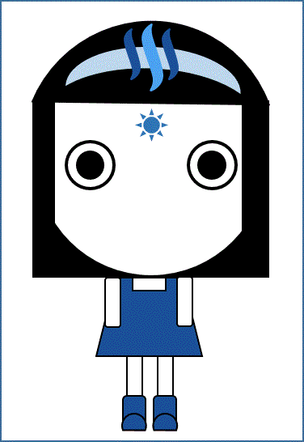

\appendix

# 附录 {#fl}
 
## 我的steem故事

### 我和Steemit的故事 by sweetsssj [作者:\@sweetsssj;]
- 一个机缘巧合上了Steemit

说起第一次点开Steemit的网页，需要把时光机倒带回2016年8月6号那一天，打开网页的那一刻也注定了我与Steemit朝朝暮暮560多日的缘分。

记得在8月初我和微信上的一位好友闲聊的时候，第一次听说了Steemit，日常的我很喜欢写东西和分享照片，所以朋友极力推荐我注册Steemit一试，并鼓励我发文。

那时候的我，对于区块链世界好似一头雾水，所以刚开始的一个月里，我是在不断的摸索和学习中度过的。那时候Steemit对我来说是一个神秘又充满吸引力的新世界。平台上的用户热情又友好，大家畅所欲言，分享生活里的正能量，与此同时，我也结识了一批中文区德才兼备的朋们，并得到大家的鼎力支持。整个中文群气氛温馨又和睦，大家互相帮助，共同成长。

- 刚起步就进入平台低谷期

刚刚起步的Steemit网站，就像稚嫩的新生儿，在学习走路的过程中难免有些跌跌撞撞，但是却从来没有放弃对于成长的渴望。刚开始在Steemit发布图文兼备的文章很不容易，但是随着平台工作人员一点一滴的改善，Steemit的功能越来越多，使用起来也越来越便利。

我必须承认我是一个幸运的人，在Steemit上刚刚开始写作生涯，就得到了几位大鲸鱼的关注，大家的点赞和留言给了我很大的信心继续写作。不过渐渐的，Steemit从币价的高峰期到了它发展阶段的第一个低谷，眼看着周围在平台很有名望的作者逐渐离开，有些伤感。但是我自己依旧对写作兴趣满满，尽管那时候没有再像之前那样得到大鲸鱼的关注，但是我没有灰心，无论赏金多少，还是继续坚持发文，同时努力自学提高文章的质量，并认真的和平台用户互动。从最开始毫无主题的随机发文，到后来渐渐找到了写旅游博客的方向，我一直没有放弃过写作。后来的一次机遇，得到了外国点赞团队的信任，协助发现中文区的优质文章，那个时候还是条小鱼的我通过点赞团队，帮助了很多中文区的优质作者增加收入，让我第一次感受到给予其实比索取更快乐。Steemit是个充满爱的平台，最好的实现了赠人玫瑰，手留余香的概念。

- 和Steemit一起成长是我最幸福的事

如今通过不懈的努力，曾经那条初出茅庐的小鱼也在平台上得到了成长，看着Steemit社群一点点壮大，心中感到无比幸福。陪伴Steemit一起成长，是一件非常愉快的事，希望每一位朋友都能在平台上发现自己的初心，找到属于自己的角落，并成为自己想要成为的人。

### \@yellowbird与steemit的故事 [作者:\@yellowbird;]

我来steemit是自己一路摸索过来的，最早知道steemit是《学习学习再学习》的公众号文章中发现的，然后出于对区块链项目的好奇，就网上搜索尝试了解，那时网上关于steemit的信息不多。

大部分时候，我也只是作为一个旁观者，尝试了解熟悉这个英语网站。英语不好的我开始没太多兴趣（因为大部分看不懂），后来偶然发现有中文的帖子，顺藤摸瓜就找到了steemit里的cn中文社区，原来已经聚集了不少的中文写作者。

通过中文社区的一些文章，我对steemit有了更深入的了解。如果不是中文社区的存在，显然我可能就是个匆匆过客。很快，我开始尝试注册，开始摸索如何发文，摸索如何在steemit里生存，也摸索如何在steemit里成功发起一个活动——[steemit中文区“我的2017年终总结”写作活动](https://steemit.com/cn-2017/@yellowbird/9un86-steemit-2017)——活动很成功，有60多人参加，活动也送出了一个34.3SBD的大奖。

我加入steemit是在17年8月份，赶上了一个最好的时候，那时\@ned代理了大量的SP给中文区，在中文区众多大鲸的照顾下，我通过写文章很快的发展起来，也赚到了人生中通过写作而获得的最大一笔钱。

因为发现steemit对中文用户不太友好，特别是注册。从加入steemit开始，我就通过自己的实践开始写关于steemit的教程。也因此被邀请加入到《区块链生存训练》的一个社群，写关于steemit相关的内容，也因此认识到更多的行业内牛人。

有不少人通过我关于steemit的分享来到了这里，我得意的当然是推荐了\@angelina6688来steemit，她成长速度极快，也许可以成长为未来的大鲸鱼。在分享steemit的道路上，我后来厚着脸皮写了篇《写作四个月，赚到四万元》的文章。标题党的好处让我尝试了人生的更多体验——[人生第一次微信语言直播分享，人生第一次线下活动演讲](https://steemit.com/cn/@yellowbird/6btoz2)。然后，因为这些假装自己也是个牛人。

steemit于我来说仿佛就是一个魔盒，打开之前你不知道里面会带给你什么，打开之后它让我的2017年多了很多的不一样。

### 苹果树下[作者:\@dancingapple;]

宛若流水飘灯
于幽蓝静谧深处
守一隅昏黄温暖
浮浮荡荡滴滴点点
不耀眼
这样的地方啊
适合抬头
看星星

这个适合看星星的地方，就是dancingapple在steem上的家。

在这里，有理性，有感性，但两者之间并没有什么逻辑。
就像地球与火星的距离，客观存在，主观维系。

在这里，有亲情、友情、爱情，也有其他说不清道不明的各种情，唯独没有假意和虚情。
就像南风过境，你看不见风的模样，但你能站在高岗上，真真切切感受它的变幻无形。

在这里，你可以把每一篇文章都看成一场独舞，文字是每一个细微动作，章节是无声的乐章。
没有卖弄的风情，但有含蓄的性感。
没有精致的脸庞，但有诗意的身段。

我无法在五十年里扫净五百年的尘埃，也无法在五百字里完整阐述\@dancingapple在steem上的故事。

因为熙熙攘攘，相遇才显得意外。

舞只跳给有情人看，文字写给有心人赏。
很庆幸，一路走来，收获了许多同伴。

来到这里写的第一篇文章叫《大树乌有》，仿佛种下了一颗树苗，自那以后，几乎每天我都上来灌溉，不管是暖春还是寒冬。

在这里，我们彼此都是旁观者，彼此都是过客。
我们呈现出来的，是自己最想要的模样。

人来人往，车马喧嚣，我就在这棵没有任何成长逻辑可言的树下，不询你的过去，不问你的未来。
就只在这当下一刻，在steem小城里，与我邻居的你，我愿意倾听你的故事，细看你的模样。

小城故事多，
充满喜和乐。
若是你到小城来，
收获特别多。

文章最后，希望我没有离题……

### 我的Steem的故事 by vickylin[作者:\@vickylin;]

【Steem指南】由\@dapeng发起的项目正在如火如荼的开展中，几乎可以说是一天一个变化。即使是临近过年，大家依然干劲十足的忙碌着。目前我主要参加注意事项篇中个人隐私这块的素材收集和写作，晚点还会在基本常识篇中挑选自己比较熟悉的一块内容进行整理。

说到我的steemit故事，熟悉我的朋友都知道，我是在我们家长老的介绍下开始写的。记得当时，他看了我的影评，对我说：“你文章放在个人博客上，看到的人寥寥无几。放在简书上，虽然叫好但不叫座，等人从口袋里掏出钱来给你打赏，太难了，何况这平台还规定得累积到一百才能提现。你可以把文章发到steemit上去，让文章得到最大的发挥，让更多的人可以看到，更何况还能赚钱呢。”他大概是去年7月份的时候得知这个网站，注册并发布了写文章，但并未上心维护。这使得我后来常调笑他说：“我感觉你错过了个好时代，要是坚持下来，指不定也是条小鱼了。”

自从去年12月开始，我关闭了朋友圈，卸载了微博，对我来说获取外界消息的，一个是当日的报纸，另一个就是推特。推特上戾气太重，实在不适合成为日常阅读的媒体。然而，steemit则不同，这里真的是人才济济。有超级it男神\@skenan，有乐于帮助新人的\@rivalhw \@dapeng\ @justyy，有steemit百事通\@oflyhigh，有万能的\@tvb，有超级奶爸\@mangoanddaddy，有热爱分享生活的\@ace108 \@chann，有摄影达人\@stabilowl，有超级爱看书的妹纸\@weisheng167388，有超赞的\@angelina6688 \@vivia\ @irisz，有文笔超好的\@hannahwu \@dancingapple。我社交能力比较差，目前认识的人还很少，希望在未来的日子里面和更多人结识，在他们身上学习到我所没有的特质。

steemit也让我恢复了写作的习惯。我是一个每天习惯用纸笔记录下日记的人，只是那些太琐碎了。为了拿出不那么水，勉强能看得下去的文章，每天我都得在电脑前起码冥思苦想一个来小时，有时候甚至为了一篇文章花上五六个小时的时间。

目前我主要写的还是电影/电视的推荐、影评以及一些小Geek知识。之前丢失的账号在\@skenan的帮助下也恢复了，希望自己能慢慢找到适合自己的方向，将两个账号的内容隔断开，吸引到不同喜好的读者。我始终对自己说，书写的目的不是赚钱，起码不是主要理由。我是个爱分享的人，如果有人因为看了我分享的东西，使他们的生活添加了快乐，会让我超有成就感。

很开心长老向我介绍了steemit，很感激steemit里大家的陪伴和支持。

未来的日子，请大家也多多指教啦。

谢谢大家的来看我的文章，如果您喜欢的话，请在steemit上关注我\@vickylin，或给我点赞和留言，再次感谢～

### 我的steem故事——编写过程中的心得体会 by vickylin[作者:\@vickylin;]

- 1、语言风格
我惯常于影评，语言风格自然会选择轻松诙谐的类型，也非常喜欢用到“呢”、“哈”、“哇”之类的语气词，符号上常用到“...”、“～”、“>..<!!!”诸如此类，个人觉得这样子显得比较有亲和力，容易拉近和读者之间的距离。

然而这点在编写《Steem指南》的时候，却是不行的。无论这本书最终是以PDF格式存在，还是以实体书的方式出版，我都希望总体的语言风格，在保有一定可读性的同时尽量采用严谨严肃的语气和行文规范来处理。就像\@dapeng在文中写的那样：

> 最好不要用像“:)”的表情符号，除非十分有必要——想想印在纸质书里的感觉。

- 2、集思广益
我是个做事情非常独立的人，常常自诩自己是“多思之人”，总觉得自己可以想到事情的方方面面。在编写《Steem指南》的时候，深切的感知到自己太独断了。

比如在写《Steem 指南》基础常识篇——关于评论中点赞、踩灰你需要知道的事（上）的时候，@\maiyude前辈指出：

> 这就使得有些朋友在给对方upvote的时候，专门留言说上一句。遇上这种留言，一般来说我也会找到对方的主页，挑选一篇我喜欢的文章“回礼”，部分人会选择无视，当然也可能会引起一部分用户的反感，这时候就有可能遭到downvote。

> 这段稍微有点问题，叙述的不是很清楚。对方到底留了什么言呢？回礼了什么呢？一头雾水。

笔者在写作的时候，很容易犯这种“我懂了，所以我觉得你也能懂”的错误。我们在写这本书的时候，更应该换位思考，把自己放在一个“纯菜鸟”的角度，来阐述每个问题。

再比如在写《Steem 指南》基础常识篇——关于评论中点赞、踩灰你需要知道的事（下）的时候，再次得到\@maiyude前辈的指导：

> 关于点赞叙述了很多，但是关于踩和踩灰叙述过少。什么 是踩？为什么会被踩？什么样的行为和帖子会被人踩？踩多了变成灰色了怎么回事？踩人我会付出什么代价？

一句惊醒梦中人！

在写作的过程中，我几乎处于闭门造车的状态，写着写着很容易就偏离了自己原本要写的方向。看了他的评论后，我回头去看自己的标题，再看看自己的内容，发现自己的内容并没有把标题提及的问题讲清楚，于是回过头去修改文章。

- 3、书稿语法
开始加入《Steem指南》编辑组的时候，我大概刚加入Steemit40天。在过去的日子里，前一个月我用的是“Raw HTML”，甚至一度以为这就是Markdown。也难怪，一次我问朋友如何添加链接的时候，他一脸懵逼的说：

> 我理解中的markdown不是这样的，你确定我们说的是同一件东西？

\@dapeng在《Steem指南》启动之初就注明markdown是”官方语言”，这就成了我弄懂它的一个契机。尝试了bear和MWeb两款软件，发现后者更符合我的使用习惯。在14天试用版到期后，果断入手了正版。看着现在自己编写出来的文章，非常满足。

- 4、团队协作
我是个相对喜欢单打独斗的人，虽说曾经参加过学生会，但那也是好几年前的事。

很佩服\@dapeng组织起这个项目，组内有四五十人，大家的留言也很多，但他总能找到症结所在，然后给出很中肯的答复，颇有摇着羽扇诸葛孔明之架势。

很感激\@maiyude一人挑起了整个项目组艺术设计方面的大梁，给大家带来一次次视觉上的惊喜。同时他在自己写“小雅”故事的同时，利用空闲时间像润滑剂一样深入到每个写作组，给大家的文章以建议。

很感谢\@skenan做了cnsteem.io这个网站，让国区的朋友们可以更方便的开启steemit。同时，他还贡献了几千SP给这个活动，和\@dapeng一起让参与这个项目的朋友们更有动力。

### 我的steem故事 by angelina6688[作者:\@angelina6688;]

以上三张图片大概可以包含我日常50%的生活特点。

去年2017年10月21日来到steemit这个大家庭。认识了cn区许多优秀的小伙伴和前辈们。从此我的人生从碌碌无为的工作家庭两点一线，开始发生默默的转变。

以前有关自己steemit总结性的文章也写过好几篇。这里我就简明扼要的列出几条概括一下：

- A. 3个半月奋斗，等级达到58.64，sp达到1100+，粉丝数达到600。发帖数160+，互动评论留言5496个。

- B. 被steemit好友赞助或收购绘画作品4幅。

- C. 为Yoyow潘多拉计划绘制“爬山”创意画。

- D. 为 @skenan制作的cnsteem中文网站设计网站Logo。

- E. 为 @melaleuca老铁设计专属steem头像。

- F. 参加外国朋友绘画比赛，并获奖若干。

- G. 构思月旦评“琅琊榜”点子，被主办人大伟老师 @rivalhw采纳，并被文武双全的大鹏哥 @dapeng设计程序得以实现。

- H. 自己策划并举办cn-drawing第1届“齐白石杯绘画大赛”圆满收官，第2届比赛年后即将开始，敬请期待。

- I. 三天前有幸竞聘成功为cn区月旦评艺术组评委之一。

- J. 期待自己能在steem创造更多属于自己有趣故事，与所有小伙们互相学习，共同进步！期待一起变身大鲸鱼的那天！

梦想还是要有的，万一实现了呢？在这里，我好像被打了一针强心剂，从来没想过自己原来除了天天上班设计路桥画钢筋图之外，还能做成这么多事。最后希望自己在接收新的知识的过程中不断学习，使自己在2018新的一年中变得越来越好。

### 我的Steem故事 by towardsthesun[作者:\@towardsthesun;]

去年7月，老三三个月大，我注册了Steemit账号，却没时间琢磨。好在\@tumutanzi创建了Steemit微信群聊，大牛们谆谆教导，我也学习了不少。终于在8月份发了第一篇文章，紧接着又发了一篇中英文自我介绍。之后我一门心思忙我的全职工作，Steemit顾不上，一周最多发一篇。

错过了\@ned给CN区代理的快速成长期，我倒不觉得惋惜。一开始，我就不懂虚拟币，也没指望来这里挣钱。那来Steemit做什么呢？

我有三个孩子，还在高校全职教书，所以我的生活非常忙。我最想要的是孙悟空的分身术，一个分身专心提升事业技能，一个分身育儿顾家，另一个就只顾自己。为家人为事业而牺牲自我的精神很伟大，也很悲伤。毕竟生命都奉献给了别人，那自己呢？

玩Steemit就是我的独处方式，聆听自我的时刻。

我决定把Steemit当成一个“升级游戏”来玩，花钱买了150SP当是游戏装备。

我开始把家庭和教育作为Steemit上的博文主题。我创建了 #cn-family标签，发了第一篇cn-family的博文，也号召大家积极参与。可惜我的声望值不高，SP低，宣传cn-family也是心有余而力不足。但也很惊喜地发现，cn-family标签下面多了不少的创作者。过阵子，我应该会开篇关于教育的博文，希望能把那个系列写下去。此外，我还分享人间烟火，琐碎的日常。

我不知道我还会在Steemit上玩多久。我希望我的博文是“高质量”，因此投入了大量时间，让我有些精疲力尽。毕竟才华不够，靠努力来凑。或许我会调整心态，只在乎玩，只取悦自己。

希望，在未来能与你相遇！

这照片是我在Steemit发的第一张照片，当时我正在喂奶，老大老二也凑在镜头前。

### 我的steem故事 by enjoyy [作者:\@enjoyy;]

First of all, at the beginning of this post, I want to thank \@speeding and \@yellowbird,
they let me knew there is a web called steemit.com based on blockchain technology.
So I can come here and saw the brand-new web.

My first steemit account is \@walkerin that registered in October 2017 since I didn’t explicitly realize the web steemit, and afterward something not good happened, I doubted the ID’s private keys were revealed, so I decided to register another account. Experience a long time waiting; I finally enrolled a new account called \@enjoyy in November 2017, until now I have been using it.

It has been a different experience on steemit.com than some other content platforms; I directly earn income through publish posts or leave comments despite the earnings little or much. And on steemit.com other applications are developing, such as steemit chat, steemit shop, steemit app center and so on.

This time I want to tell you is what I experience on steemit.com; I wrote some posts in public, compare other writers I got much less income than theirs, in this place you should stand with big one and energetically participate their activities, and upvote posts each other with minnows,
In these ways, you can earn more upvotes and more income,
These are essential rules in this place, because of some reasons I haven't had much time to take part in some activities, so folks haven’t known me much, it’s fair, no pay no gain.

And what I got over here, I knew new blockchain technology applications, and I knew some writers from all over the world, and I knew some communities of other countries. Furthermore, I’ll know more methods of playing on steemit.com.
If fortunately, I’ll make some new friends here, maybe they are my coworkers at new industries, they are perhaps not only in China but also come from different places of the whole world, that’s possible in this science developed day and age.

- Everything is possible, isn’t it?
- Do you agree with my opinions?

首先，在这篇文章的开头，我要感谢\@speeding和\@yellowbird, 是他们让我知道了基于区块链技术的steemit.com这个网站，因此，我才能来到这里，来见识这个全新的、完全不一样的网站。

我的第一个steemit账号是\@walkerin，是在2017年10月份注册的，由于当时对网站完全不了解，加上后来发生了一些事情，我怀疑密匙泄密了，所以当时决定要注册另一个新的账号。经过了漫长的等待，终于在11月份的时候，注册了新的账号，这个账号ID是\@enjoyy，我一直用到今天。

在steemit的经历是与其它的内容平台网站完全不同，我都是直接从在平台上公开发表文章和评论别人的文章而获益，当然收获也有时多有时少。这个平台的一些其它的应用也正在进一步发展之中，譬如：steemit 聊天、商店、app 中心等等。

我在这个平台的主要经历是发表了一些帖子，还有看其他作者的文章获取新的知识。与其它的作者相比，我在经济上的收获比他们少得多。在这里，你要跟大佬在一起，积极参加他们举办的活动，跟小鱼小虾们混熟并且互相点赞，这样才能获得更多的点赞，获得更多的收益。
这些都是些基本的规则。由于某些原因，我没有那么多的时间参加各种活动，大家对我的了解自然就不多。
付出少收获就少，这也很公平。

不过我在这里还是有收获的。在这里我了解了区块链技术的应用，认识了一些来自世界各地的不同的作者，了解了这个平台上几个不同国家的社区，当然由于时间很短暂，了解不深入，更进一步看的话，还会了解一些在这个平台上的更多新的玩法。

如果幸运的话，在这里还会结识一些新的朋友，他们以后可能会是我在新行业的伙伴或是合伙人，这些朋友可能不仅仅是来自中国，很可能会来自世界上不同的国家和地区，在这个科技发达昌明的时代，这不是不可能的事。

- 一切皆有可能！你也同意我的观点吗？

### 我的steem故事 by susanli3769 [作者:\@susanli3769;]

【Steem指南】已经启航。大家献策献力。围观的围观，有点子的出点子，有才气的贡献自己的文章。作为中文区steemit 一份子，我也自愿加入附录组。我接下来主要专注在FAQ（常问问题）上。如果大家有什么好的点子和想法，请帮忙积极献策。目前，我的想法是先参照借鉴Steemit 本身上面的FAQ。不知道之前是否已经有人翻译过。如果有的话，可以把你之前的投稿发给协作组一起编辑。在此先谢谢大家。

我的Stemmit 故事。说来纯粹是误打误撞。我付费参加李大师的【通往财富自由】的专栏。想着学习借鉴成功人士的经验，看是否可以得到一些启发和收获。在专栏进行大半后，开始聊到比特币，区块链，同时提及作者参与过的区块链投资项目。其中就提到了steemit. 我当时就想如果是大师投过的并能拿出来讲，那么还是值得进去看看到底是什么东西，到底适不适合自己。就这样，机缘巧合，来到了steemit 的世界。

进入steemit后，最大的收获就是认识了很多志同道合的朋友，也学习到了很多新知识。进入了一个之前都没进去过的全新世界。有喜悦也有失望，有收获也有煎熬。和所有人都经历过的一样，经历了各种心理历程，最后还在这坚持着。

我很佩服那些有各种才能的朋友们，有的是画画天才，有的音乐才人，有的写作高手，有的体育达人，更有很多编程方面的高手... 这是知识爆炸的时代，任何你的才能都可以被拿来换钱和更多人分享。所以看到中文区各种活动层出不穷，很是高兴。只要是自己有能力参加的，都尽可能参加。比如之前\@helene 举办的画画挑战，\@jubi 举办的写作比赛，\@utopian-io & \@cn-reader 的翻译等，可惜五音不全，否则\@tvb 举办的唱歌也一定去凑个热闹。

由于大家举办的各种活动，也更加让自己看到自己不足的地方。比如在电脑编程方面，甚是羡慕那些IT 达人，也让自己有那种想开始学习了解基础入门的想法。希望接下来可以花点时间在上面。

同样在区块链方面的投资和了解还只是入门级。在Steemit 上写文章目的之一是希望能够挣点外快。可是随着在steemit 上学习的东西越多，更觉得应该控制自己在上面的时间。更多的时间应该花在那些可以给自己长远发展带来进步的地方。比如编程，画画以及对区块链的进一步认知上。很多时候，要理解短利和长久发展的关系真不容易。俺没有大智慧，可是，当看到更多成功的例子，和自己的距离是如此之大的时候，也该鞭策自己做好选择，专注长远而非眼前小利。对自己的投资是一刻也不能减少的。今天借着我的steemit 的故事也算是立个志吧。鞭策自己继续往着长远目标努力着。

这也是Steemit 带给我的改变，所以，我大力支持\@dapeng 等人对此指南的设想和愿景。希望自己也能贡献一份力量。

最后，再次希望大家如果对FAQ 的策划和内容有什么想法的话，请在以下留言。这样我们可以更好地编辑整理，希望能够尽可能全面达到大家的预期。谢谢。

### 我的steem故事 by bring [作者:\@bring;]

我可以说是个比较传统和守旧的人，并不容易接受新生事物。我的哥哥 \@wnh518518是在2017年5月加入到Steemit中的，那时正是中文区的繁荣时期。有一天哥哥指着Steemit上的一篇帖子对我说，你看写一篇文章就能有上百美元的收入，你在这上面写写文章，不是很好吗？我未置可否，一笑了之。天下竟有这样的好事？就这样我与Steemit便擦肩而过。

后来是哥哥的现身说法让我信服，确信那不是看不见摸不着、虚无缥缈的东西。自己爱好写作，也喜爱并从事着英语翻译，如果能够有个展示的平台，还能够有不错的收益，何乐而不为呢。

哥哥便帮着我注册起账号来，几次未果，便求救于前辈 \@myfirst，不想前辈慷概相赠，便把他此前注册的 \@bring 这个账号送给了我。所以，尽管这个账号显示的注册日期为2016年10月，实则为2017年7月30日。我很感激前辈 \@myfirst，是他使我的梦想成真。

与君初相识，犹如故人归。与Steemit的相遇、相识、相知，让我有了一个可以倾诉的知己，也让我有了一个展示自己的平台，同时也让我看到了自己的不足。高质量的文章，原汁原味的英语帖子，让我望尘莫及，更让我不敢停息和稍有懈怠。

\@sweetsssj前辈的文章让我惊讶，不止是她文章的收益，更是那地道的英文。

可终有那么一点点缺憾，Steemit是一个平台，也是一个舞台，每个人既是选手，又是评委。名人一出场，欢呼声震耳欲聋，应者云集，纵是摆个pose，也会引来无数的点赞。可小鱼们的辛苦写作，有时却无人问津。

细细一想，还是自己才能的差距。大师不会担心自己会被埋没，唯有微光才会容易被熄灭，是金子总会发光。

世上没有完美的东西，正如人生没有意义一样，你要把它变得有意义。

你和我，我和你，会在Steemit上演绎着一个个美丽的故事，一个个值得念起的故事。

### 我的Steemit故事：从寻找到认识最终归于理性[作者:\@rileyge;]

- 1、缘起
大约在一个月前，我加入了Steemit这个社区，这并不是巧合，而是我苦苦寻找的结果。

我是一个不知名的博客写手，自己的博客写了两年，原创文章也两百多篇，但读者却寥寥几人，让自己非常伤心。穷则思变，所以自己的博客坚持了两年之后我知道我需要一点新的东西，来驱动自己的写作生活。所以Steemit，我来了。

其实在很早之前，就看到其他知名博主，在推荐Steemit，但那时自己没有动心。具体原因记不清楚了，可能由于当时国内访问Steemit并不太容易吧，也可能觉得区块链是什么鬼，没有安全感吧。总之，我们错过一次，终于，我来了。

- 2、迷茫
Steemit有一个魔鬼一样的规则，这个魔鬼把影响力发挥到了让人不安的地步。

在这个世界里，可以说 Reputation 是一切。如果你是浮游生物，那么你的声音只有被淹没。因为你的点赞或者踩并不会影响到比你等级高的人的声誉，因为你的点赞只会增加非常非常少的收入。在这种魔鬼的机智下，每个人都被无形有大手推着和别人互动，希望得到回馈，希望自己能一天天的成长起来，享受在这个圈子里面呼风唤雨。

我清楚的记得，刚进入这个社区时看到一位大神写了一篇关于他的开发的事。大家的点赞留言的热情超过我所见过的所有博客。那一刻我感觉我的春天来了，这个圈子里的人这对开发这么感兴趣，这简直是我的天堂啊！我也赶紧写了一篇我的开发历程。或许没有大神的那么精彩，但也相去不远，但结果却不可同日而语。只有区区的几个浏览，还不如自己的博客的浏览量，怎么能让人不伤心。

那几天我想的最多的不是怎么写好的文章，而是怎么能快速升级，怎么能在这个社区里面有自己的发言权。

- 3、认识
这样几天之后，感觉自己的社区里混的也有点起色了吧。此时我花费大精力写的一个 WordPress 的插件 Sync WP Steem Comments 上线并到交到了 #utopian-io 。在提交之前我都想过了，当我提交之后的盛景。很多人评论，很多人点赞，很多人支持我继续开发。剩下的就是我好好开发插件，大家你好我也好。

但事实却出乎我的意料，几乎没什么人对此有兴趣。更可气的是我在提交到 #utopian-io 时 #cn 标签，有一条大鲸鱼发现了，给我留言说不允许滥用热门标签，立刻有人给他点赞。这条大鲸鱼一条评论的收入比我花大心思写的插件的收入还高！而且还是因为一条看起来那么像机器人发表的评论。自己变的很焦躁。

现在回头想想，哪里都不是什么净土，更何况是一个被恶魔驱动的社区。

- 4、不忘初心 继续前行
作为一名共产党员，作为一名无产阶级斗士，我很快的调整了自己的心态。

回头想想，自己来Steemit的初衷是什么？是赚钱吗？应该不是，毕竟自己的文章没人看自己都写了两年。而是想让自己写的文章被更多的人看到，而是让自己的话让更多的人听到，而是找到更多志同道合的朋友一起用我们的文字来影响这个世界。

发觉这个问题之后，我豁然开朗。无论这个社区是被谁驱动，无论这个圈子的风气是否浮躁，我能在这里实现自己的初心，那么这个圈子就是我的助力。

人要驱动社区，莫让社区驱动了我们，在无边苦海中越走越远。虽然我还只是浮游生物，但Steemit给我提供了更大的海洋，让我有了更多的可能性。

- 5、后记
这一个月的故事不长，但这一个月的感悟却很多，多谢\@dapeng倡议的《Steem 基础及开发指南》的编写，也感谢\@melaleuca对Steemit故事的征集，我也希望我的故事能让更多的人看到。

### 我的steem故事 by yaru [作者:\@yaru;]

我是2017年10月来steemit的

我来steemit，纯属赶鸭子上架！

什么情况呢，为了让我生活更充实一些，儿子帮我注册了一个账号，并鼓励我写些东西在上面。

可是我认为，steemit这个地方，大多是有能力的年轻人施展才华、互相沟通的地方。
我老太太一枚，年轻人怎会愿意看我写的东西，儿子为了给我打气，给我找了几位在steemit的榜样人物说服我。

榜样的力量，还真管用。

我振作起来开始写，可以说是绞尽脑汁的写，一周最少也写一篇，坚持写了 10来篇的时候，终于还是坚持不住了，停了下来。

之后不经意间看了一篇文章，《不爱看书学习的中国人》，触发了我继续看书、学习、写作的信心，才又开始开始写了。

写写停停，时不时需要一种力量推一把，刺激一下。

谢谢在steemit上推我一把的你，让我继续坚持着……

在steemit的时间里，我从朋友们的美文中得到了学习，也提升了我的英语水平，对我来说，确实有很大收获。

特别谢谢这个平台。

2018愿与steemit的伙伴们继续同行。

### 我的steem故事 by dongfengman[作者:\@dongfengman;]

- 1、加入
刚参加工作的时候（2005年），我在深圳上班，也是一名基层IT从业者，所以周末会在家搜索一些IT文章和深圳相关信息看看，机缘巧合就找到了这个

> [程序员小辉](https://www.xiaohui.com/)

那时候这个网站里有很多源码资源和\@xiaohui的个人经历，很有意思，马上把它纳入了我的关注圈。

时间来到了2016年的7月份，我也已经定居杭州，看到了小辉正在宣传STEEM，就是这篇文章。

[Welcome to Steemit-China / 欢迎进入 Steemit 中文区](https://www.xiaohui.com/weekly/steemit.htm)

那时候我就在Steemit注册了个ID \@jianghao 并写了一些文章， 嗯，是的，它就是我之前使用的ID。

- 2、离开
一段时间之后，我发现不光是中文区，Steemit上面很多人活跃一段后就离开了，因为Steem的币价一直在下跌，加上大鲸很少关注我们浮游生物，社群的文章质量也是良莠不齐。在既没有“钱”的激励，也没有社群的人际奖励的大环境下，人气瞬间下降，我也设置了Power down，离开了。

- 3 、回归
2017年下半年开始，慢慢发现币价大幅上涨，接着Steem的币价也起飞了。更令人惊讶的是，Steem社区的中文区人气大涨，掀起了各种活动，比如好声音，比如月旦评活动，比如齐白石杯绘画大赛等等，这些活动参与度非常高，并且质量杠杠的。

我发现这里就像很久以前的天涯，更早以前的BBS，充满温度，并且有着不菲的“钱”的激励。想着用\@jianghao这个账号登录，没想到提示我带宽不够，查原因是我已经Power down了，SP为0。一怒之下，我就重新注册了我的新账号\@dongfengman，头像采用了哆啦A梦的，哦，对了，我在简书也有地盘，不过简书没有这里有趣。

一个月多月来，我也成长为了40级，发表27篇帖子，嗯，我也经常到中文区的伙伴们的帖子下面去点赞和勾搭，伙伴们都很热情并且有才气。

- 4、愿望
在春节前，\@dapeng 发起了《Steem 指南》 的编写活动，我果断报名参与，并且领取了任务，在往后的Steem时光中，希望通过类似的活动结交到更多有才艺的伙伴，在这些伙伴的peer pressure下，迅速成长，变得可以成为其他伙伴们的大树。

### 我的steemit畅游之旅 by songtiejun[作者:\@songtiejun;]

我之所以能够来到steemit，要非常感谢\@yellowbird，是他带我进入到了这个神奇的世界。说来有缘，我们在同一时间段加入007行动不出局，并成了57班的战友。期间，@yellowbird分享的文章[《写作四个月，我赚到10000元》](https://mp.weixin.qq.com/s/H5AcRbfBFM5KrL4NpTDcbg)，引起了我的巨大好奇。开始关注并了解steemit，才逐渐了解到，\@yellowbird加入时间并不长，但进步却神速，原以为很遥远的小目标早已成为现实，用一步一个脚印的自我成长实践证明：只要你愿意付出自己的真诚、努力和汗水，每个人在steemit不仅可以有所作为，而且大有作为。无论你的出发点是为了获得更多的财富奖励，还是想认识更多的人、知道更多有趣的事，还是想实现更大的自我价值，steemit给你提供了无限的可能和实现梦想的机会。

在对steemit产生了浓厚的兴趣之后，逐篇细读\@yellowbird系列文章，并按照步骤一步一步地进行尝试，在去年12月份非常顺利地注册成功，但因各种原因并没有发帖。后来，在我们007不出局57班的开班仪式上，\@yellowbird又被邀请作了一次关于steemit的专题分享，又强烈刺激了我的好奇心。从那时开始，陆续在steemit上发帖评论。

迄今为止，发了20余篇帖子，各个帖子的收益参差不齐。第一篇帖子收入是4美分，虽然很少但还是让我非常兴奋。多数文章是颗粒无收，收益最多的50多美分。当然，反观我的进步是很慢的，已经注册快三个月的时间，声望只有32，是steemit浩瀚大海之中一条名副其实的小鱼。

steemit是一个全新的事物，充满着新奇，畅游其中，不断探索定会有与众不同的发现和收获。关于新加入steemit的朋友们，已经有很多人分享了很多优秀的帖子，一定要认真的学习实践，会使我们少走很多弯路。感兴趣的朋友，可以加入到\@yellowbird知识星球组建了steemit抱团成长群，里面有很多的干货。有问题可以随时提问，\@yellowbird都不厌其烦的回答，我经常向\@yellowbird讨教。当然，可以到steemit去自己寻找，但需要一定的英语基础。

作为一个steemit中的小鱼，我觉得：

一是一定要学深吃透社区规则，这是在steemit畅游的根本前提，熟知并运用规则才会如鱼得水，快速成长。

二是不要单纯为了获得收益而去发帖，也许花费很大精力完成的创作收益微乎其微，否则可能会患得患失。

三是学会长跑，而不是短跑冲刺，创作最好与兴趣专长、工作生活结合起来，打持久战、打攻坚战。

四是steemit是创作分享平台，更是一个社交网络平台，本质上是人与人之间的关系，积极互动并参与其中形成良好的人际关系网络，会助力成长。

关注感兴趣的领域，追随有影响力大鲸鱼，坚持原创，真诚评价，积极投票，始终保持一双发现美的慧眼。

### 我的神奇steemit冒险故事[作者:\@wilhb81;]

一名平平无奇的过期老腊肉，第一次踏入五花八门的Steemit平台，开始了一段充满趣味梦幻旅程。

我，\@wilhb81，一个时常沉醉与文字打交道的家伙，对写作的执着和要求，远远超越自己可以想象的范围。

从发现Steemit平台那一刻起，我赫然的察觉，内心深处有一股巨大的能量蠢蠢欲动。它就像是一只被囚禁许久的激动猛兽，忽然意识到前方是一片人间净土，迫不及待地想从内心深渊的地牢，挣脱厚重的枷锁，以迅雷不及掩耳的速度，扑向那个仙乐都。

我挥动那根隐形的魔法棒，试图把Steemit变化成心目中的移动魔法堡垒。自己则是该城堡的城主，驾驶着这艘庞然大物，自由自在地翱翔于浩瀚的“区块链宇宙”里。在起航前，我把 \@melaleuca Steem 球星 - 贝克.斯蒂姆给邀请上去，一起去探索这刺激的宇宙探险记。

当我驾着这艘移动魔法堡垒穿梭于不同的星球、星系、空间与维度之际，我遇上了许多不同兴趣爱好的伙伴们。他们的热情与亲和力，瞬间打动了我的心。我使出平身所习得的魔法，尽量将欢乐带给每位朋友，让他们带着愉悦的心情，继续朝心中的梦想出发。

在未来的日子，我会策划成立一个“魔科系列作品俱乐部”，让更多脑洞大开、天马行空的志同道合伙伴们，能够毫无拘束尽情发挥他们的创作天分！

最后，我在此召唤所有勇敢的冒险者，从这一刻开始，加入Steemit冒险联盟，展开一趟你毕生难忘的冒险之旅……

### 我的steem故事 by wangwenjing[作者:\@wangwenjing;]

> 天空没有留下翅膀的痕迹
>  
> 但我已飞过
> 
> ——泰戈尔

2017 年 9 月 4 日，误打误撞来到 Steemit，开启了我人生的新篇章。

我的人生平静而简单，一切都按部就班地进行着，没有波澜，却也温馨美好。我用一颗真诚的心，记录着岁月的点点滴滴，抒发着内心的真情实感。

为自己设计了我的 Steemit 卡通形象，并乐此不疲地玩着换装游戏。

多次参与并入围“月旦评”活动，为自己的人生留下了宝贵的痕迹。

阅读着大家的文字，想象着文字背后一张张可爱的脸和一颗颗温暖的心。时而与作者感同身受，时而为作者拍手叫好，并常常从中受益匪浅。

在这短短的半年时间里，结交了各路身怀绝技的朋友，接触了加密货币，在一定程度上提高了写作能力。作为一个理工科学生，这半年来的经历，与我以往的生活差异很大，让我体验到了前所未有的成就感，这是以往任何其他平台所没有带给我的。

机缘巧合下，有幸参与《Steem 指南》的写作，与更多的朋友分享我关于 Steem 的理解与认识，心中充满了成就感、自豪感与幸福感。

> Steemit 留下了文字的脚印
> 
> 因为我来过
> 
> ——@wangwenjing

### 我的steem故事 by nationalpark[作者:\@nationalpark;]

大约十年前我经常使用搜狐博客写写游记，偶尔也评论一下时事，在那里也交了不少朋友。因为知道搜狐公司在国内要遵守中国法律，所以写文章时都是自己先过滤一遍，以防被和谐。最终不知碰了哪一根红线，忽然有一天搜狐博客就毫无征兆地被封禁，既不能访问也不能登录。所有的文章全部丢掉，所有的朋友也全部失联。从那以后就再也没写过博客。

2017 年开始使用 Steem，了解到区块链既不能封号，也不能删帖，感觉这是我写博客的一个好平台。当然更好的是在这里还可以赚取数字货币。当然区块链的公开性和不能删除记录既是优点也是缺点。如果在这里写下来让自己后悔的文字也将是不能抹掉的。曾经有一个用户请大家大力踩他，以深埋他自己写下的不该写的文字。

Steem 跟很多社区一样是一个少数人赚大钱，多数人赚小钱的地方。如果只是为了写自己想写的东西，把任何收入都当作福利，也就不会太计较收入的多少。如果为了赚钱在这里写作，大部分情况都会失望的。

Steem 虽然不能删帖，但是还是可能被踩灰。比如现在有一个有几万 SP 声望 71 的人就天天盯着我踩。但是不管他有多少 SP，都不可能把我的文字从区块链上抹去。如果是几个月前我会在意自己的文字被踩灰。现在认识到 Steem 的访问量非常之小，换句话说几乎没人读，基本都是作者和几个朋友自娱自乐，也就无所谓帖子是否被踩灰了。所以，我可以完全不理他，该怎么玩，就继续怎么玩，想写什么就可以继续写什么，也算是一种自由。

### 初认识steem——一个博客[作者:\@evathinking;]

我是从知乎上一篇文章知道这里的，[《写给区块链社区Steemit的新用户：写篇文章赚了1000美金，真相是扎心啊老铁！》](https://link.zhihu.com/?target=https%3A//mp.weixin.qq.com/s%3F__biz%3DMzIxODQ4NTA5Mg%3D%3D%26mid%3D2247485192%26idx%3D1%26sn%3D7b5eb17ad0e25538a7377e5e8596cb98%26chksm%3D97e89f03a09f1615f2d384c20463fe886bd6d943d6293725a08471a92a00808d804f9ab2803b%23rd)，里面就是说的steem平台，而且还是个英文平台，太符合我的定位了。

今年2月初注册了账号，肯定在正规渠道没有注册成功，但认为2美元也不贵，就在cnsteem上注册了evathinking。

我怀着写好文章就能赚到钱的想法，只把这里当做一个写博客的地方，很快我就发现：

1、这个博客平台真难用啊，一点不像国内的知乎、简书好操作。

2、大致知道这是一个基于区块链的技术平台了，最近这个词刷爆了我的朋友圈，有必要了解。

3、零零散散的steem教程看了些，不系统，无非还是让你写高质内容，好吧，无法理解深意的我也是这么想的。

4、发了第一篇文章，被点赞了，感谢@\skenan鼓励，有点小兴趣了。

5、什么Steem币啊，SBD啊，SP啊，什么玩意，没看过教程，也不care！（没接触过虚拟货币的小白），似乎也没影响到我。

6、看到了\@dapeng的steem教程编写号召，想起第2条，后来才想明白这是这个平台最重要的一环：社交性。

请看我的 ，[《steem 指南》的小故事：初认识steem---社交性](https://steemit.com/cn/@evathinking/steem-steem#)

这个阶段就是典型文科生的状态，哇，博客，可以写文章挣钱的博客。

### steem小故事：总有人默默支持你[作者:\@irisz;]

（看我画的“桃花扇”）

接触steemit的初心就是来分享一些绘画作品，但没想到steemit为我打开的是一扇多彩的大门，这里有好多的绘画摄影比赛，还有好多的文字活动，生活立即变得丰富有趣了。

由于不善交际，文字能力较弱，没有为社区做出什么贡献，许多文章都没有收益。每当感到心灰意冷的时候，就有一位大鲸，会轻轻点燃我心中即将熄灭的希望火焰。每当看到他为我点赞，我就对自己和steemit 充满的期待和信心。

这位大鲸从未留下只言片语，素未谋面也没有留言交流，但我知道他一直在默默的鼓励着我，真的非常感谢他。

另外steemit上的许多朋友也常常为我加油，每一个赞和每一句留言都深深的影响了我，steemit 是一个温暖的大家庭。感谢所有相遇，期待更多美好！

### 我的steem故事 by littlett666[作者:\@littlett666;]

年前就看到、@melaleuca发起的“我的Steem故事” 作品集活动，还有幸被点名，说好了积极参加活动的，结果开心过大年去了，现在才来交上我的“作业”。
我是通过、@angelina6688的引荐进入到steem的大平台的，那个时候刚好经历了一段时间的心理挣扎，我姑且将其定义为“中年危机”，恨透了之前的碌碌无为，所以在而立之年希望能有所转变，如果是原来的我在听到“发文赚钱”这个诱引时可能会听听然后一笑而过，毕竟没啥专长，想要赚钱谈何容易，但是一切就是这么的刚巧，碰上我想挑战新的事物，于是下定决心要来尝试一下全新的区块链，不为赚钱更多的是为挑战自己。我是一个很怕麻烦的人，在听完、@angelina6688曲折的注册经历后，我居然没有放弃还寻求了国际友人的帮忙，最终无比顺利（顺利的超乎我的想象，一天之内注册成功）的加入到了steem中，可见我想改变的决心还是非常坚定的。

加入steem的时间不长，到现在还不到两个月，要说故事什么的，感觉也没啥好说的，其中有个小插曲就是刚开始加入的时候不知道“钱包”里的收益还需要特地去点击提取，在经、@angelina6688的提点后才记得时不时的要去点击一下收益，不过在她告诉我这个事情的时候，我已经错过了我在steem上最大的一笔收益，就是大伟哥帮忙点赞的第一篇介绍文，10个刀的收益，就这么白生生的错过了，感觉错过一个亿，也不知道下次何时才会再有这么多的收益。

听说steem上来来走走了很多新人，因为不能短期的看到可观收益，最后很多人选择了放弃，我想说坚持真的挺难的，辛辛苦苦发一篇文，没有多少人看更没有多少人点赞，有种“一江春水付之东流”的感觉，后来加入了一个新人群，也认识了很多志同道合的小伙伴，大家互相支持互相鼓励，和、@melaleuca也是在群中认识的，很好的一个同志，热情，友善，就像一个邻家大哥哥一样默默的支持着群里的每个人。Steem真的是个很好的平台，牛人多多，看到那么多比你优秀的人还比你努力真的对自己也是种很大的激励。

没有才华的我在steem上晋级还是很难的，想为自己定个小目标，不是升多少级不是吸多少粉，只希望自己能一直坚持下去，希望steem能见证我的成长。

### 我与steem情缘未了[作者:\@anniezhang;]

说实在的，是我自作多情，单恋着steem。

初识它，是我的妹妹\@irisz牵线搭桥，那段时间是产后不久，在家带一个不会说话的襁褓中的娃娃，没黑没夜的，几乎封闭了与外面世界的联系，都快抑郁了。这时steem走入我枯燥又烦闷的生活，给我开启世界的另一扇门，给了我动力和信念支撑，从此我的世界又有了阳光和雨露，在它们的滋润下，黑夜被娃娃叫醒个七八次也不再烦躁，白日抱他四五个小时也不觉得那么累了，哈哈。

如果说爱情一开始是狂热的，那么总会有伤心流泪的时候，那就是当写了自认为不错的好文时，没人欣赏，没人认可，没人关注，心情哇凉哇凉的，就好像喜欢一个人，他却不理睬你。
不过坎坷的情路也有另一番滋味，就好像酸酸甜甜初恋的味道。当突然有好心人给点个赞时，又破涕为笑，阳光明媚，于是继续单恋，继续前行。

我的爱好-手作，将会是我在steem的主课，也请steem监督我，激励我，我会努力做出更好的作品让大家一起欣赏。cn-handmade标签虽然目前几乎没有人使用，但是相信坚持总会有收获的。

图片是以前郊游时采集的小野花做成的花束，仿佛隔着屏幕还能闻到清香，心情好了生活中也到处都有美好。

