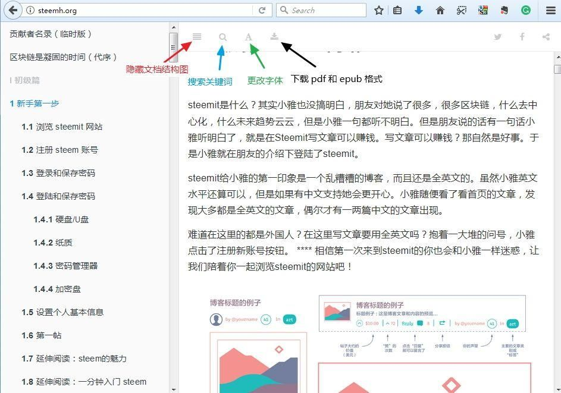
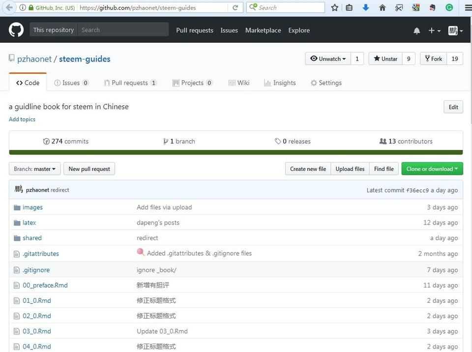
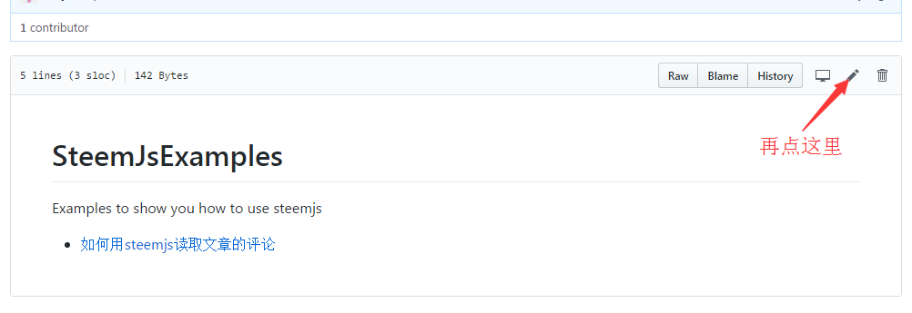
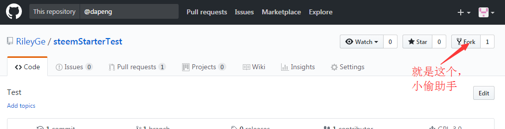
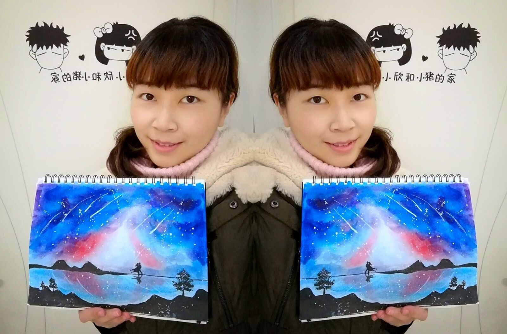
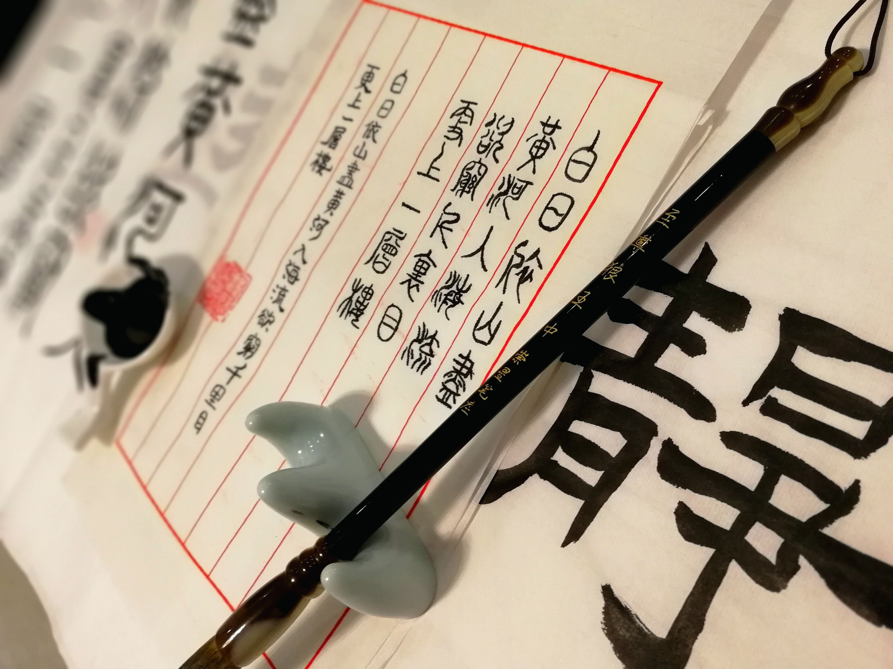
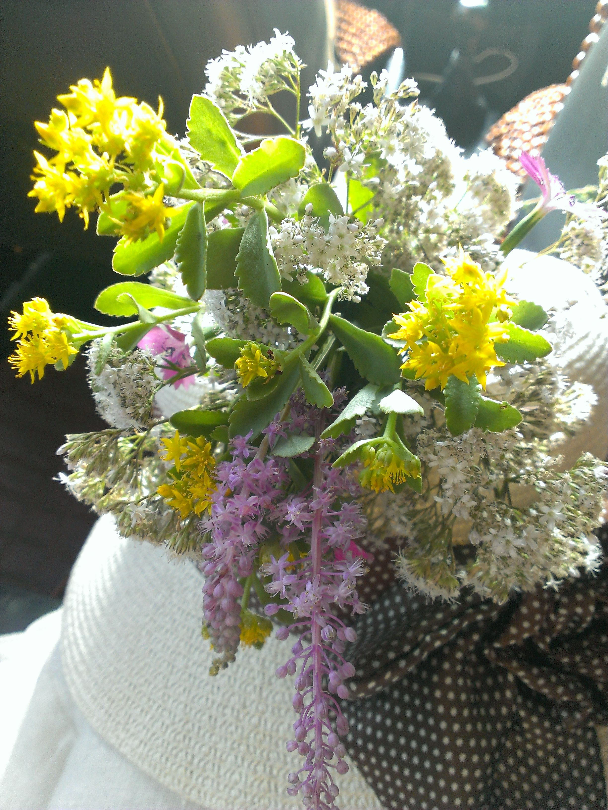

\appendix

# 如何参与《Steem 指南》的编写 ^[作者：\@dapeng，原文链接：https://steemit.com/cn/@dapeng/steem-handbook-2018-04-06] {#how-to-get-involved}

《Steem 基础与开发指南》（简称《指南》）是一本正在编写的书稿。自《指南》项目开始以来，先后有很多朋友询问，能不能加入编写工作，如何加入。

这部书稿旨在帮助 steem 新用户入门，同时为高级用户提供参考。书稿由“初级篇”、“中级篇”、“高级篇”三个分册组成，steem cn 区多位作者联合编写。书稿的编写是个长久的工作。任何人都可以加入，来添加本书缺失的内容，或修改和更新已有的内容，或者修改错别字等。

那么，如何加入到书稿的编写工作中呢？本文在已有教程的基础上，做个相对全面的介绍。此外，最好先读一下我们的[项目实施纲要](https://github.com/pzhaonet/steem-guides/blob/master/shared/outline.md)，里面详细介绍了项目的来龙去脉，投稿要求和格式，参考资料列表等。

本文会反复提到两个网页：一个是“[项目网页](https://github.com/pzhaonet/steem-guides/)”，相当于幕后；一个是“[书稿预览网页](http://steemh.org)”，相当于台前。

**第 1 步：先来我们写书的书桌。**

《指南》一书的编写模式，在 steem 上史无前例。为了方便理解，我们打个比方。

我们协作写书，好比一张书桌上摆放一个空白本子，好几位作者手里各持一支笔，往这同一个本子里写字。怎样保证他们之间不冲突、不打架？

我们的办法是，先把本子拆成 16 份，每份为 1 章，然后让这些作者各自挑选擅长和喜欢的章节，当然也可以跟别人合写，也可以帮别人涂涂改改。书桌旁边安装摄像机，把编写和修改的过程全部录下来。这样，谁贡献了哪些就很清楚了。

回到现实里，我们选择了 github.com 这张书桌。我们的项目 [pzhaonet/steem-guides/](https://github.com/pzhaonet/steem-guides/) 就好比一个空白本子。打开这个项目，你会看到很多像 01.0.Rmd, 02.0.Rmd 这样的文件，共 16 个，前两位数字就是章节的编号。点击就能打开看里面现有的内容。而其他的文件和文件夹是系统文件，不用理。

那么摄像机在哪里？github 自带摄像机！每个作者所有的修改过程，都会被保存下来！这就是我们选择 github 的主要原因。

为了让 github 知道谁做了什么工作，你需要先在 github **注册**。打开 github.com，依次输入你希望用的用户名、你的有效邮箱、你希望下次登录 github 所用的密码，确认就可以了。下面的步骤全部选默认，“Continue”，最后提交（“Submit”）。你的邮箱里面就会收到一封邮件，点击里面的链接来验证邮箱是有效的，就可以了。

下次访问项目主页 https:// github.com/pzhaonet/steem-guides，点击右上角的“sign in ”登录即可。

关于 github 平台的介绍和注册方法，可以进一步阅读 @rileyge 编写的[github使用实战演练（文科妹子篇）](https://steemit.com/cn/@rileyge/github)。

**第 2 步：挑选你想编写或修改的章节。**

打开书稿预览网页 http://steemh.org，看看你想编写或修改哪一章（例如第 2 章），那么在 github 项目主页点击对应的书稿源文件（例如 02.0.Rmd），就打开了源文本。建议你将预览网站跟源文件对照着看，了解一下什么样的源文件能生成什么样的书稿。

下一步，我们对文本进行添加或修改。

**第 3 步：添加或修改文字。**

承接上一步，打开书稿某章源文件后，添加或修改文字的步骤最简单。

图片来自@rileyge 编写的[github使用实战演练（文科妹子篇）](https://steemit.com/cn/@rileyge/github)

1. 点击编辑窗口右上角的铅笔符号。
2. 在编辑窗口里添加新文字或修改旧文字。
3. 编辑结束后，在底部的 Propose file change 窗口里输入标题（必填）和内容（可不填），用来简要说明一下你修改了什么，然后点击下面的绿色按钮提交。
4. 在出现的新窗口上方，点击绿色按钮“Create pull request”（也就是我们常说的 PR）。
5. 在新窗口右下角，再点击绿色按钮“Create pull request”。

这样，你的修改就提交到了项目里。剩下的你就不用管了。

关于上述添加和修改文字的演示，可以看 @maiyude 制作的视频教程[5分钟学会往《steem 指南》上传书稿（1）](https://steemit.com/dlive/@maiyude/f9e13220-2f04-11e8-8c78-95b7c3b77998)。

**第 4 步：插图。**

如果你添加和修改时需要插入图片，那么操作稍微复杂一点。先为要插入的图片命名为“章节编号_备注”的格式，例如 02_test.jpg，文件名里不要有中文或任何特殊字符。

图片来自@rileyge 编写的[github使用实战演练（文科妹子篇）](https://steemit.com/cn/@rileyge/github)

1. 在项目主页右上角点击 Fork 按钮，等待一段时间，就把项目复制到了你自己名下。网页会自动切换到你名下的项目主页。以下如无说明，均在你名下的项目里操作。
2. 点击 images 文件夹，然后点击右上角的 Upload files 按钮。
3. 将图片拖入新窗口的中央。或者点击中央的 choose your files，在弹出的窗口里选择要上传的图片。
4. 在下方的 commit changes 栏，输入标题和内容，简要说明你上传了什么，然后点击绿色按钮。
5. 跟添加文字类似，在书稿需要插入图片的地方，输入图片的相对路径，如 `images/02_test.jpg`，保存修改即可。
6. 最后，在你名下的项目主页左上角，点击 New pull request。
7. 后面的步骤跟添加文字的方法类似，点击绿色按钮“Create pull request”即可。

关于上述添加和修改文字的演示，可以看 @maiyude 制作的视频教程[5分钟学会往《steem 指南》上传书稿（2）](https://steemit.com/dlive/@maiyude/933ab400-2f05-11e8-8c78-95b7c3b77998)。

**至此，你的工作已经完成。**

书稿在提交 PR 之后，需要以下步骤，才能最终在书稿预览网页上呈现。这些步骤目前由 @dapeng 完成，以下是简略介绍（不需要你来做）。

1. 简单审查，看看新文稿是不是三观正确，有没有不当言论。
2. 将你提交的修改版跟原文稿合并。如果存在冲突，需要仔细解决冲突。
3. 利用软件对源文本进行编译，对编译时产生的错误进行修正，最后生成网页、pdf、epub 三种格式的预览文件。
4. 将预览文件上传到 steemh.org 服务器。

上面介绍的是参加本书编写的最简单方法，仅用网页浏览器就可以完成，不需要任何其他软件。

当然，你可以使用文本编辑器（如typora），将文稿写好之后再复制粘贴到项目里；可以使用 github 的桌面软件，对项目进行管理。这些高级操作，可以参考以下教程：

- @evathinking [如何参与dapeng《Steemit 教程》Github多人写作](https://steemit.com/github/@evathinking/github)
- @evathinking [Github网站上面的按钮灰掉不可用](https://steemit.com/github/@evathinking/github-how-to-delete-github-repository)
- @rileyge 的系列教程
  - [git使用简明教程（一）：Branch和Merge的概念](https://steemit.com/cn/@rileyge/git-branch-merge) 
  - [git使用简明教程（二）：git中常见概念](https://steemit.com/cn/@rileyge/git-git) 
  - [git使用简明教程（三）：github使用实战演练（文科妹子篇）](https://steemit.com/cn/@rileyge/github) 
  - [git使用简明教程（四）：git及github实战演练（理科汉子篇）](https://steemit.com/cn/@rileyge/git-git-github) 
  - [git使用简明教程（五）：fork功能的使用](https://steemit.com/cn/@rileyge/github-fork) 
  - [使用github书稿编辑精简明快版](https://steemit.com/steem-guides/@rileyge/5giegh-github) 
  - [github落后了吗？要挨打了吗？](https://steemit.com/cn/@rileyge/3tpcyz-github) 
  

# Steem 指北:人物与八卦 {#fl}

## 有胆评

### 《Steem 指北》steem人物大杂烩
话说当日地陷东南，这东南一隅有处曰姑苏，有城曰阊门者，最是红尘中一二等富贵风流之地。这阊门外有个十里街，街内有个仁清巷，巷内有个古庙，庙里有个和尚，这和尚原名叫@melaleuca，本来是红尘中的一名足球巨星，人送外号“贝克.斯蒂姆（Becksteem”。他听别人说币市红火，于是向steem第一大银行行长@justyy借了一大笔款项，投资了一个叫做足球链的币。谁知道钱才投下去，就遇到了大熊市，真金白银的钱化成了一堆空气币。

钱没了怎么办？面对@justyy的追债，@melaleuca只能跑啊。好不容易跑到了人迹罕至的老庙做了个和尚，@melaleuca心想啊“我可能这辈子踢不成球了，起码脑袋还要像个球一样圆。”@melaleuca从此就在这老庙安心的做了一个和尚，念的不是经，是足球。

@justyy也郁闷，当初@melaleuca抵押给他的资产都是假资产，变卖不了几个钱。于是@justyy就寻思着，这@melaleuca好歹是个球星，多少有点名气吧。于是@justyy找了steem上最红火的旅游博主@sweetsssj帮忙给@melaleuca写了几篇小文，@sweetsssj可是不得了的大人物，号称一个笑容值一千万的大红人。这文章一写就不得了了，@melaleuca一下子变成了传奇球星，身价暴涨，自传和各种周边卖的红红火火，@justyy一下子就收回了欠款，还把@melaleuca从老庙请了回来继续当球星，这回他们两个可能还正忙着数钱呢。

不过这都是后话了，今天要说的不是这个故事，说的是什么呢？说的是@melaleuca和小和尚说故事，故事是从前有座山，山里有座庙，那座庙叫steem，庙里有个活神仙叫@dapeng。这活神仙@dapeng原来也只是个普通的凡人，但是他按着自己的兴趣爱好创办了steemr这个网站，这网站帮助到了许许多多的steemit的粉丝们，于是这些粉丝就把@dapeng奉为神人，还建了个小庙供奉了起来。

不过@dapeng可不乐意这样，他人生两大乐趣就是唱歌和晒娃，被供起来算什么事儿？于是乎，这天他又跑去找@tvb唱歌去了。这@tvb是何许人也？说起来这@tvb也是了不起的大人物，她分别在币乎和steem拥有两座大山头。她还举办了无数的活动，最有名的属“三好兔噢”活动。江湖上流传着这样的一句话：“steemit上的新人，几乎都在@tvb手上走过一遭。”@tvb阅人无数，看过的文章堪比星河，吐过的槽比你吃过的饭还多。江湖上混出头的新人，没有一个不被@tvb照顾过。

这会@tvb和@dapeng就唱起了rap：

“时机到了！什么时机？

你别管什么时机，你只管打开收音机！

我赶紧打开收音机，收听@tumutanzi的演讲！

@tumutanzi，大博士，古今中外样样通！

但论有趣，还是听@oflyhigh闲聊有意思！

什么？你的心，要远行？那就跟着@sweetsssj去旅游！

我们来到广州见到大神@rivalhw！

大神“月旦评”办的红火！

再到台湾找@deanliu，

你到底是“游北里”还是“刘美女”？

大江南北，万里河山，我一键遨游。

我去看@lovemyson晒照片，跟着@angelina6688学画画。

没钱的时候跟着@htliao学投资，有钱了再去找@irisz画头像！

什么？你还想要点赞？那你要问@abit答不答应！”

the end

### "有胆评"写作计划 ^[作者：\@dapeng，原文链接：https://steemit.com/cn/@dapeng/2018]

1

2018 年马上要来了。我被 \@towardsthesun 点名写个 2018 年计划。谢谢。

要不是 \@towardsthesun 留言提醒，我可能还不知道。因为我一直用 [steemdata mentions](https://mentions.steemdata.com/find?q=@dapeng) 来查老师留的作业，但是这网站显示最近没作业啊？——如果错过了你留的作业，请莫要见怪，我实在是没看见。 \@kona 留给我的黑白摄影作业我还没做呢。

其实，看到大家精彩的计划书，我有点恐慌。记得上大学那会儿，每次寒暑假，我都从图书馆借满满一包书背回家；假期结束，再原样背回大学，里面的书一页都没翻。下回还背。

年初计划这种东西，也一样。我几乎每年都有，只是从来不敢公开。因为，总是完不成，怕打自己的脸。要是非要写一个，其实我用一句话就能写完，那就是：

> 2018 年，我计划把 2017 年就打算实现的拖到 2016 年还没完成的 2015 年年初计划的 2014 年一定要完成的任务给干掉！

好了，不耍贫嘴了。2018 年，我确实有个计划，这个计划很快就开始实行。我给这个计划起了个名字，叫“**有胆评**”。

请 \@rivalhw 先把西红柿和臭鸡蛋收起来，让我把话说完。

2

在电视连续剧 《[Steem 十讲](https://steemit.com/cn/@deanliu/2qg2ar-steem)》第一集里，有一句话让我醍醐灌顶。我抄在了小笔记本里，当作最高指示，时不时翻出来读一读：

> 對於我來說，Steem最大的優勢之一就是把區塊鏈從account層次，透過blogging這種人類行為，帶到了user層次。

古文读不懂？来，容我翻译成现代文：

> 对于我来说，Steem最大的优势之一就是把区块链从account层次，透过blogging这种人类行为，带到了user层次。

要是再读不懂，就去读原文。或者我换个说法，就是：steem 这个社交平台上交友，我们交的不是账号，而是账号背后活生生的人；我们不是在读帖，而是在听人倾诉；我们不是在自说自话，而是说给别人听。

由于区块链数据的开放性，账号的所有行为都是透明的。于是，我们可以轻易看到一个账号背后使用者的兴趣爱好；稍微挖掘一下，就能知道他的饮食起居；他的各种言行稍微对照一下，想了解他的人品并非难事。所以我说过：

> 在 steem 上，君子是真君子，小人是真小人。

当然，也有人会藏得很深，比如：

- [24 x 7 在线](https://www.google.com/url?q=https://steemit.com/cn/%40dapeng/steem-tvb&sa=U&ved=0ahUKEwjPqdX1iajYAhXE8qQKHUlmCyQQFggFMAA&client=internal-uds-cse&cx=011445933062884569876:-jmpkfnkicw&usg=AOvVaw1qKDmam)的 \@tvb 到底是一个人，还是 t 和 v 和 b 三姐妹轮值；
- \@jubi 和 \@dapeng 到底[谁是谁的马甲](https://steemit.com/cn/@dapeng/or-10-sbd-to-build-a-mirror-site-for-your-own-steem-posts#@deanliu/re-jubi-re-deanliu-re-dapeng-or-10-sbd-to-build-a-mirror-site-for-your-own-steem-posts-20171108t122942)；
- \@coldhair 的[小号到底是什么](https://steemit.com/cn/@coldhair/6mbkpw#@dapeng/re-coldhair-6mbkpw-20171222t153442507z)等等。

然而，纸包不住火，只要想挖，就有料。甚至数据挖掘本身也成为玩 steem 的乐趣之一。如果你想找些例（乐）子，我推荐去看看 \@nationalpark 的帖子。如果说，在 steem 上活动的第一原则是“别忘记你的密码"，那么第二原则就是：

> 要想人不知，除非己莫为。

这是我来到 steem 没多久就发现的一条打死人不偿命的原则。

3

记得刚来那会儿，我写了一系列数据分析报告，仅凭我这三脚猫的功夫，就挖掘出了一些鲜为人知的真相。汇总在这里，给大家满足一下八卦之心：

- \@tumutanzi：
  - [Steemit 的新手们，你们考虑过数据隐私的问题吗](https://steemit.com/cn/@dapeng/steemit)
  - [看到他暴露的 Steem 用户数据后我震惊了](https://steemit.com/cn/@dapeng/steem-a-preliminary-analysis-of-a-steem-id-s-data)
  - [坛中酒醉： steem 的帖子到底应该怎么写](https://steemit.com/cn/@dapeng/no-1s-of-his-steem-posts-steem)
- \@justyy：[Steem 史记： @justyy 列传](https://steemit.com/cn/@dapeng/steem-id-report-1-justyy-1)
- \@htliao：[Steem 史记： @htliao 列传](https://steemit.com/cn/@dapeng/steem-htliao-steem-s-watch-a2)
- \@shenchensucc：[Steem 史记： @shenchensucc 列传](https://steemit.com/cn/@pzhao/steem-shenchensucc)
- \@mrspointm：[Steem 史记： @mrspointm列传](https://steemit.com/cn/@dapeng/steem-mrspointm)
- \@hannahwu：[Steem 史记： @hannahwu 列传](https://steemit.com/cn/@dapeng/steem-hannahwu)
- \@mrpointp：[Steem 史记： @mrpointp 列传](https://steemit.com/cn/@dapeng/steem-mrpointp)
- \@tvb：[Steem 史记： @tvb 列传](https://steemit.com/cn/@dapeng/steem-tvb)

steem 的人物传记并非我首创。小猎豹 \@incrediblesnow 就写过《[介绍华语区元老 1](https://steemit.com/cn/@incrediblesnow/cn-part1)》和《[介绍华语区元老 2](https://steemit.com/cn/@incrediblesnow/cn-cny-part2)》以及《[优秀作者推荐](https://steemit.com/cn/@incrediblesnow/cn-cny-part3)》。\@zsilence 也简略写过《[Steemit 人物志》](https://steemit.com/cn/@zsilence/4dybom-steemit)——如果你去翻这篇的留言，就会发现我写《steem 史记》系列文章的源头。

后来，因为各种原因吧，我把《steem 史记》系列停掉了。与其展示枯燥的数字，我更愿意写写人物本身，例如：

- \@deanliu：[关于大长腿杀人鲸刘美女 @deanliu 的一切](https://steemit.com/cn/@dapeng/deanliu-or-all-bout-deanliu)
- \@yingpingzhang：[爱音乐的人：推荐 @yingpingzhang 的歌](https://steemit.com/cn/@dapeng/yingpingzhang-or)

4

兜了这么个大圈子，最后终于可以说到重点了。

2018 年，我的宏伟计划之一就是：延续上述两篇帖子的风格，不定期地写 steem 人物介绍。可能会写到你哦。

这种介绍，肯定不会面面俱到，可能仅仅是我了解的侧面；肯定会有很主观臆想的成分，毕竟信息仅仅从每个人发布的帖子里获得的。多半只是管窥蠡测，点到为止。

不过，我觉得还是挺有意思的。因为，透过凝固的文字，绕开枯燥的数据，我们看到的，是背后有血有肉的人。这样的文章应该是广大人民群众喜闻乐见的。你瞧，直到今天，[关于大长腿杀人鲸刘美女 \@deanliu 的一切](https://steemit.com/cn/@dapeng/deanliu-or-all-bout-deanliu) 还[被引用](https://cnsteem.com/cn/@deanliu/beauty-is-only-skin-deep)呢。

我打算写 12 篇，平均每个月一篇（我内心的计划是 52 篇，每周一篇，但是看到 [\@winniex 的计划](https://steemit.com/cn/@winniex/winniex-2018#@dapeng/re-winniex-winniex-2018-20171226t085509651z)里说计划要保守一点才方便超额完成，咳咳）。可能会重点捞一下像 \@yingpingzhang 这样快被埋没的牛人，也有可能抱一抱像 \@deanliu 这样的大神大腿——后者的分寸比较难把握，有些陈年旧事我并不清楚，玩不好可能会被大腿踩，需要一点胆量。

所以，我给这个计划取名为“有胆评”，新建了个'cn-people'标签。当然是山寨 \@rivalhw的“月旦评” 啦。

这个活动将效仿最近几个活动的链式点名制，评谁谁就被点名来写下一个人。当然，纯属自愿，不写也无妨啦。

你有胆来 steem 混，我就有胆评。

你，准备好了吗？

### \@deanliu：关于大长腿杀人鲸刘美女的一切 ^[作者：\@dapeng，原文链接：https://steemit.com/cn/@dapeng/deanliu-or-all-bout-deanliu]

昨天我发了个广告，[提供制作 steem 镜像备份网站的有偿服务](https://cnsteem.com/cn/@dapeng/or-10-sbd-to-build-a-mirror-site-for-your-own-steem-posts)，第一个报名的就是人称“刘美女”的前辈 \@deanliu ，一下订购了三个月的备份服务 。

刘美女何许人也？新人可能不太了解。刘美女 的 ESP 在 [全网 40 万用户里排名 229](https://cnsteem.com/steemit/@nationalpark/observation-and-analysis-to-please-the-lord)，华语区排名前 5，声望 72.35，级别是杀人鲸。一句话：你就知道刘美女是个大腿就好了。

保持尊重，认真去抱。

[刘美女的镜像网站](https://deancrypto.netlify.com/)很快做好了，将近 400 篇原创文章，一目了然，欢迎大家围观。本来，我只是想赚点零花钱，然而，没想到这回有很多意外收获。

这里我先道个歉，本文标题"关于前辈刘美女 \@deanliu 的一切"取得哗众取宠了，配图也是在网上随便找的，目的是想吸引大家的眼球。好在，本文确实是有点料的。

比如，有个问题困扰了我很久：刘美女到底是男是女？产生这个问题的原因我就不详述了，总之困惑的不止我一个人。这回，在镜像网站上，我很快找到了答案，就在刘美女注册当天发布的[自我介绍帖里](https://deancrypto.netlify.com/post/a-father-from-taiwan-thinking-introducing-myself-a-bit/)。

再比如， "deanliu" 到底是什么意思？是姓“刘”还是姓“柳”？我曾经疑心刘美女的真名是不是叫“柳得安”。这回，在镜像网站上，我找到了个刘美女自己认可的解释：“电流”。

从镜像网站收获的不只是八卦。我来 steem 实际只有三个多月，错过了很多往日的精彩，如今一边读刘美女的文章，一边再次感叹，原来很多人在 steem 上的心路历程都是如此相似。我们现在提的问题、有的困惑、自以为惊人的新发现，其实早就被前辈们说过了。

比如，注册 14 天的刘美女[研究过每天几点钟发帖赚钱多](https://deancrypto.netlify.com/post/cn/)，并且问了诸如[Follow 和 Mute 是什么含义](https://deancrypto.netlify.com/post/question-about-steem-2-in-chinese-steemit/)，[账号的几个密码到底怎么用的](https://deancrypto.netlify.com/post/security-warning-for-cn-newbies/)小鱼问题。 如今的小鱼们可以从中得到一些慰藉，你看大腿们当年也是这么过来的嘛。

比如，未满月的刘小鱼发现了 the abit line，为此提出了[忠告](https://deancrypto.netlify.com/post/post-payout-cn-cn/)，直到今天仍然是金玉良言：

> 知福之后，要知祸。什么祸？被宠坏的祸。知祸才能避祸。如果随意写个今天天气不好的文章都能每天吃碗面，那这肯定不能长久。大家可能都知道大神也有点赞限制，一天点个20-40次就差不多了，他也没法在用户大量扩张下照顾所有人，大家必须自我成长，或许发英文帖，双语帖，或许寻求累积有内涵的中文作品，等待中国用户来临后才能开始发光发热。**因为当海量用户来临时，海量的专业性竞争也会来** (英文圈正在发生)，先到者因为熟悉环境而有些先发优势，但仅此而已，天气文章终究只能发到微博吧。如此，此福才是福，知祸则祸离。

刚满月的刘小鱼，曾经[为疏忽家庭和工作而懊恼](https://deancrypto.netlify.com/post/owo-farewell/)：

> 将暂时与各位告别一周，听起来很短，但在Steemian Time里可是很长的。接下来这一周我将不再发文章、不再参与讨论，也不再点赞（可以看我刚刚发的英文帖#oneweekoff ），要把时间留给这个月来被我疏忽的家庭、进度落后的工作、脸书上的朋友，以及最重要的身体的健康。毕竟，日子还长呢，养精蓄锐之后，才能为自己的SteemLife注入新的能量。

还有[一篇帖子](https://deancrypto.netlify.com/post/4wdgxj/)，是刘美女归来时对别人打招呼，读来会有种“咦，原来大神们小时候是这样一起玩大的”感觉。

注册一个半月的时候，刘美女对 steem 的思考已经很深了，见《[Steemit世界裡的加減乘除](https://deancrypto.netlify.com/post/calculate-your-way-into-the-steemit-ocean-steemit/) 》一文，至今仍然可以作为新人们的指南。

我每天发布的《希望工程日报》里搜集整理了很多对新人有益的帖子，但是上面这些基本都错过了——区块链的文章沉底太快，埋得太深。不过，这次做镜像网站倒是个发掘旧文八卦、回顾往日精彩的机会。

敢问路在何方？从前辈的帖子里剥茧抽丝，我们就可以看到，一条小鱼成长为大鲸的道路，原来就在我们自己的脚下。

### \@yingpingzhang：爱音乐的人 ^[作者：\@dapeng，原文链接：https://steemit.com/cn/@dapeng/yingpingzhang-or]

参加“华语好声音”活动的朋友里，很多是真心爱唱歌。其中有一位比较特别，是 \@yingpingzhang 。

他的歌有原创（如《来时的路》 ），有改编（如《风的季节》《驿动的心》），也有翻唱（如《睡在我上铺的兄弟》《灰姑娘》）。都是自弹自唱，一把吉他，干干净净。我自己只会弹一点吉他，很业余，所以不敢对 \@yingpingzhang 的水平妄加评价。但是，我能确定的是， \@yingpingzhang 是个真正爱音乐的人。

他是目前给“好声音”活动投稿最多的人，却是获奖最少的人。每看到这种千里马被埋没的事情，我就很痛心，生怕他哪一天失望地从这里离开，而仅凭我个人有限的能力又挽留不住。

他在《[一个技术人员的独白](https://cnsteem.com/cn/@yingpingzhang/2uv2yq)》里写道：

> 每天累得像狗一样，但充满了快乐，因为IT是我喜欢的第二职业。为什么是第二职业，因为在此之前我一直在做音乐.....

又在《[区块链中年艺人](https://cnsteem.com/cn/@yingpingzhang/5yjknw)》一文里说道：

> 吉他基本上陪伴我走过了青春最彷徨的岁月。多少个骚情的岁月，都是音乐陪伴着我。到了大学，和系上的有共同爱好的同学一起弹唱，在各大院校进行校演。那段时间是人生最难忘的岁月。

读来颇有共鸣。我也是啊。

唱得好又弹得好。可惜的是，\@yingpingzhang  每次参加“华语好声音”，拿的都是末等的幸运奖。“华语好声音”是以文章的评论人数来评奖的。给 \@yingpingzhang 帖子留言的人，并不多。因为注意力有限，我本人也不能保证每次有留言和点赞。steemr.org 显示他的帖子平均每篇才得到 11 个赞。

\@yingpingzhang 跟我从来没有过私下交流，我写本文也没有事先跟他做过沟通。之所以今天有这个感触，是因为今天看到他六天前发布的自弹自唱《[睡在我上铺的兄弟](https://steemit.com/cn/@yingpingzhang/2c6xjy)》，收益 7 毛钱，留言人数是 1。眼看就要埋没沉底了，我赶紧点赞。

在这里，我向大家推荐  \@yingpingzhang 的歌。 喜欢民谣的朋友们， 或许从他那里会有收获； IT 界的同行，说不定也可以交个朋友。

下面是我唱的《睡在我上铺的兄弟》，伴奏选的是黄磊的钢琴版，算是跟 [\@yingpingzhang 的吉他版](https://steemit.com/cn/@yingpingzhang/2c6xjy)有个呼应。录音里有娃捣乱，唱的节奏和音准把握得不够好，抱歉了。

点击播放键直接播放，或[跳转](http://node.kg.qq.com/play?s=wXGVaGwk0CZoPwC3&g_f=personal)。
<iframe width="100%" height="166" scrolling="no" frameborder="no" src="https://w.soundcloud.com/player/?url=https%3A//api.soundcloud.com/tracks/374510573&amp;color=%23ff5500&amp;auto_play=false&amp;hide_related=false&amp;show_comments=true&amp;show_user=true&amp;show_reposts=false&amp;show_teaser=true"></iframe>

### \@nationalpark: 在这个骗人的舞台上我们能做些什么
 ^[作者：\@dapeng，原文链接：https://steemit.com/cn/@dapeng/nationalpark-or-or-what-can-we-do-on-a-lying-platform]
 
（1）

昨晚，\@nationalpark 说他要写一篇 steem 白皮书读后感，我就一直很期待。没想到这么快，今早起床就[读到了](https://cnsteem.com/cn/@nationalpark/review-of-steem-whitepaper)，大呼过瘾之余，我回忆起刚来 steem 时读 \@coldhair 文章的快感。那时我就读过白皮书，早忘干净了，可能是因为当时是新手，走马观花，没读懂吧。

\@nationalpark 是我的前辈——我还没来的时候， 他已经开始[发旅游贴](https://cnsteem.com/introduceyourself/@nationalpark/national-park)了；我还在摸索该发什么帖子的时候，他已经在研究[什么是 hot 什么是 trending 了](https://cnsteem.com/cn/@nationalpark/hot-trending)；我终于明白新人入门的捷径是发旅游帖的时候，他已经搞明白要在[30分钟内点赞](https://cnsteem.com/cn/@nationalpark/when-to-upvote-within-30min)了：我以为我是率先提醒大家注意数据隐私的，其实，比我早一个月的时候，他已经在告诫大家[注意这里没有秘密](https://cnsteem.com/cn/@nationalpark/newbie-for-newbies)了。——我还一度提醒他多注意肉身安全，看来是我多虑了。在美国混，他有枪（别惹他）。

看，我就说了，新人先去看看前辈的文章，能少走多少弯路啊。

\@nationalpark 在美国从事房地产工作，现居纽约。\@nationalpark 的文章，大体分两类。第一类是旅游，里面有专业的旅游照片，和详尽的景点介绍。事实上，他有个[自己的网站](http://www.parkofchina.com/)，专门介绍中国的国家公园。 

第二类是对 steem 上的用户和数据进行分析和揭露。跟我的“大鹏观察”系列文章的温情脉脉很不同，他的观点犀利，笔法冷峻。在竞相抱大腿、四处拍马屁的 steem 上，人人为 steem 歌功颂德，他却总是唱衰歌，就像皇帝新装里的那个小男孩，可爱又可恨。

我说：“ 我也唱衰啊。看我写的[steem 的三大谎言](https://cnsteem.com/cn/@dapeng/three-lies-on-steemit)。”

他说：“你是假唱衰，我是真唱衰。”

看，就是这么一针见血，一剑封喉。

十步杀一人，千里不留行。他是一位侠客。

侠客的声望最近一直停留在 62。真是冯唐易老，李广难封。

（2）

歌舞升平的时候，我们需要有人居安思危，保持警醒。 \@nationalpark 今天的这篇文章里转述了个关于螃蟹的故事。我认为这个故事威力巨大，像颗原子弹。

我们这些努力拉朋友来 steem 的行为，我们这些努力举办各种活动活跃气氛的行为，我们这些努力留住新人的行为，什么“新人希望工程”，什么“三个一活动”，全部被解构了——其实我们都是螃蟹，所做的一切，只是用螯把别人揪回 steem 这个桶里而已。

这个比喻不是 \@nationalpark 的原创，而是来自白皮书。所以，我觉得很多高人是明白这一点的，只是没有刻意点破。

文章里还有更多醍醐灌顶的文字，值得反复玩味。

如果把 steem 比作一个舞台，那么舞台的设计者事先就把聚光灯调好了位置。被聚光灯笼罩的位置，早就被人占据，他们是故事的主角，粉丝最多，出场费最高；后上台的群众演员，只能挤在舞台上的黑暗角落，领点盒饭，同时误以为台下的掌声和喝彩是为他们响起。

既然 steem 是个骗人的舞台，而且舞台上大字明白写着“我就是骗你们”，那么，我们为什么来这里？在这个舞台上，我们能做什么？

（3）

我的本职工作是科研，混的是学术圈。这些年，我也算是走南闯北，现实生活里，结识的人不少，形形色色。网络世界里，有独立博客圈、微信朋友圈和 facebook 等，朋友名单也很长。

然而，不知何故，在这些已有的圈子里，我却从来没有见过像 \@oflyhigh 这样技术牛、卖萌呆、文笔美的人，像 \@htliao 这样年纪轻轻就在币圈大有作为的人，还有像 \@dancingapple 这样酷爱书法以及周边八卦又古怪精灵的人，以及 \@angelina6688 这样绘画技法如此高超又热情洋溢的人。

当然，他们肯定会谦虚地说，这不算什么，在他们自己的圈子里，有更厉害的角色。

但是我不管。我的圈子里，这些领域，他们就是最牛的。——就当我是孤陋寡闻吧。

这个舞台的搭建者，也许真像 \@nationalpark 讲的那样，技术层面就是骗人的；然而舞台上活跃的角色，却是真实的。

最初的马化腾，做 OICQ，技术层面只是个山寨版的 ICQ，后来却做出了腾讯这个富可敌国的公司，弄出了微信这个全中国人离不开的东西。

最初的扎克伯格，技术层面只是恶俗地为了给同校美女打分，后来却弄出了 facebook 这个全世界人离不开的东西。

那么，最初的 steem，技术层面是为了骗人，但是从人类行为层面，未来能做出什么东西来？

我们不知道。

时钟倒拨 20 年，马化腾和扎克伯格也不知道。

眼下我们看到了 DTube 和 Utopian.io，这是用 steem 骗人的丑恶之水浇出来的美丽之花。

哪怕昙花一现，他们曾经开过。

（4）

骗人的舞台，到处都有。

我小时候，一直坚信自己就是共产主义接班人，准备着为推翻万恶的欧美资本主义和解救亚非拉受苦受难的劳苦大众奉献出我的一生，时刻准备着。

长大了发现，生活本身就是骗人的舞台。用 \@winniex 的语气来讲，就是有万般无奈，那能怎么样，还不得好好过日子，难不成要我去直播吃辣椒？

前两天说 steem 上的”得失“。在 steem 上奋战几个月，我赚了点声望和 SP。如果来 steem 这个舞台是为了赚钱，那么完全有可能被骗进去大量的时间还赚不到。但是在钱以外，我还赚到了很多新朋友，开拓了眼界，提高了写作水平，深入学习了 R 语言。其中有些朋友，即使将来 steem 黄了，我相信我们还会继续交往。这些，稳赚不赔，哪怕来自一个骗人的平台。

我把 steem 看成一个网络游戏。除了最初象征性地捐了点 SBD 给 \@tumutanzi 的[公益活动](https://tumutanzi.com/charity)以感谢他带我来 steem 之外，我一分钱都没有提现。等到穷得实在揭不开锅的时候，我会卖掉装备换点现金；否则，我就算是把钱取出来，不还得找地方投资嘛，那可能又投回 steem 了，何苦折腾。

\@rivalhw 说：”我真正佩服的是这样一种：认清生活真相后依然热爱生活的人。“

在 steem 这个骗人的舞台上，我很幸运，有你们这群真诚的人。

### \@jiangchen：寂寞的原创者 ^[作者：\@dapeng，原文链接：https://steemit.com/cn/@dapeng/jiangchen-or]

(1)

上个月某一天，steem 中文区好几位，包括 \@jubi、 \@tvb 等人，几乎同时发帖聊起了“原创”这个话题。

在steem 上，原创的人不在少数，而我一看到“原创”二字，首先跳入脑海的人物，就是 \@jiangchen。

我以为，所谓“原创”，第一是“原”，写的是自己的真情实感，能让人读出文字背后的独特灵魂；第二是“创”，写别人没写过的东西，而且写的东西要像个样子，不是随便一篇流水账就可以称作“创作”的。

回顾我自己写过的帖子，惭愧得很，没有几篇能称得上“创作”；还好，我的措辞大部分是“来 steem 上写东西”，或许偶尔哪次不慎妄用了“写作”二字，我可以拿醉酒当说辞，在新人面前不至于下不来台。

而 \@jiangchen，则是一个真正潜心原创的文学青年。

于是，当时我就想应和一下 \@jubi 和 \@tvb，甚至已经为“有胆评之二”打好了腹稿。意外的是，我用来挖掘 \@jiangchen 文章的洛阳铲 steemr.org 所依赖的 steemdata 数据库遭遇粗暴升级，整整一个月没法使用，这事儿就搁置了。等升级完毕，我发现腹稿已经忘干净了。

本文就一直拖到了今天。

(2)

\@jiangchen，中文名“姜辰”，字“梦远”，曾以“墨水也不白”、“冷情”、“墨舞”等 ID 行走江湖，17 岁开始写博客，如今是即将走上人民教师讲台的大学生。他在帖子里贴过自己的照片，那是嫩得能掐得出水的青春，让人好生羡慕。

在老夫我眼里，他是新疆孩纸一枚；在新疆孩纸眼里，他是敬爱的姜老师。

新疆孩纸眼里的姜老师，十八般武艺样样精通，实习期间什么科目都教，除了英语。

老夫眼里的这个新疆孩纸，曾经在壮丽的星空下山盟海誓，如今在寂寥的沙漠旁独自一人。

好想生个女儿嫁给他。

其实，上面这些信息，我并不确定哪些是真，那些是幻。从姜辰的[自我介绍帖](https://mail.google.com/mail/u/0/#inbox)里，几乎读不到任何透露身份的信息。而在他其他的帖子里，有诗歌、有小说、有散文，视角常常是第一人称，弄不清楚何时是虚构。

然而，从这样的文字，一个桀骜而专注的灵魂跃然纸上，那么上面这些信息是真是幻，又有什么关系？

(3)

尽管文字写得好，我觉得姜辰是寂寞的。

从 2017 年 7月 17 日发布第一篇文章以来，他写了 103 篇，半数帖子的收益都低于 2 SBD，目前的声望只有 57。好多篇文章，写得很棒，后面的评论数是 0。

我不知道这是为什么。我只说说为什么我没有给姜辰留言。

事实上，早在来 steem 之前，我跟姜辰就通过彼此的独立博客相互认识了。不过，很长一段时间里，我把他的“[梦幻辰风](https://www.mhcf.net/)”博客跟另一个名叫“忘想”的博主的名为“拟月幻真”的博客弄混：因为他俩都是原创，博客名字都是四个字，而且意境相似，一“风”一“月”，而姜辰多次强调他的文章“只谈风月”。

这其实是我的问题，因为俩人的博客我读得都不多。老实说，姜辰的帖子，我不爱读。

这并非他写得不好，而是因为他落笔细腻而敏感。他的文字里，似乎能听得到砰砰心跳的声音，会感受到年轻人独有的怅惘、困惑、纠结和坚定。作为一个曾经同样有理想有抱负的热血青年，现在变成了天天为柴米油盐操心的中年大叔，读姜辰的文字，我容易陷进去不可自拔，一愣神儿的工夫，给娃热的牛奶溢了出来，滋滋作响，糊了灶台。

如果用“代沟”来形容，并不夸张。

那一年，我一边用录音机大声放着艾敬的“我的1997”，一边在中学教室的后黑板画了一期“庆祝香港回归”的黑板报；与此同时，有个胎儿在母亲腹中待产，两个月后呱呱坠地，这个婴儿就是姜辰。

代沟，不一定是无法互相理解，有时候是沉溺在自己的烦恼里而无暇他顾。

姜辰曾经[写道](https://steemit.com/cn/@jiangchen/3vuqhb)：

> 给时光以生命，而不是给生命以时光。

我一读便知，这句话脱胎于[《三体》](https://steemit.com/cn/@jiangchen/4kdrhq)。然而，这又能如何呢？我没法像年少时一个电话过去彻夜长谈。明早我还得起来给娃准备早餐呢。

好在，姜辰的《[谁人齐天，谁人成佛](https://steemit.com/cn/@jiangchen/6e2y9p-or)》一文在”月旦评“获奖，从此便于“琅琊榜”上有了名号，而且可能是最年轻的一位（与他的年龄媲美的可能只有 \@berlin1997），让人欣慰。

(4)

最近，六神磊磊跟周冲对掐，为我们普及了“洗稿”的概念。姜辰，曾经以他不高的声望和不多的 SP，踩过中文区的洗稿，哪怕对方的声望比他高得多。

我们常常对新人强调，在 steem 上要“原创”，\@tvb 甚至把 steemit 新人之家 QQ 群的入群验证问题设置为“steem 上要不要原创”。如此洁癖，带来了很多有趣现象。比如，会有新人刨根问底：

> 我抄袭会怎样？——会被踩。
>
> 如果没被发现呢？——迟早会被发现。
>
> 发现了会怎样？——没人陪你玩了。
>
> 那又怎样？……

问到你理屈词穷。

再比如，另一个稍微不太新的人，对一个新人强调要原创时，后者问：

> 为什么这么强调原创呢？

前者答道：

> 我也不知道，但是我刚来时前辈就是这么强调的。

这回答让我忍俊不禁。想起了那个著名的关于”传统“的猴子实验，谁摸香蕉谁挨打，最后全都忘了为什么不能摸香蕉，只管打。

原创是为了让别人读到更美的文字？

不是。很多人写的文字，还不如抄来的好。

原创能让作者在 steem 上快速赚钱？

不是。看看姜辰就知道了。

那么，为什么要原创呢？

我的回答是：无他，只为展示一个独特的灵魂，就像 \@jiangchen。

### \@dancingapple：舞个苹果折腾地球 ^[作者：\@dapeng，原文链接：https://steemit.com/cn/@dapeng/dancingapple-steem-or]

(1)

很久很久以前，在一个遥远的星系里，有一颗苹果，在自由飘舞。随心所欲，她从南舞到北，从东舞到西。

不不，太空里不分南北，也没有东西。

太空好冷，真空很静。不知舞了多久，终于有一天，苹果感到了一丝寂寞。

低头一看，那是一颗蔚蓝的星球，缓缓旋转。一旋转，便有了南北，有了东西。

她喜欢这个有东西的地方。

她喜欢上一个大花园。那里，四条河流缓缓流过，一棵繁密的大树挺立中央。

苹果身子一摇，轻飘飘落在树上沉睡过去。

这一睡，便是千年。

一条蛇悄然而至，跟谁说些什么。苹果打了个哈欠。一只纤纤玉手将苹果轻轻摘下，放在女人的唇边，轻咬了一口。

苹果核砰砰乱跳。

女人突然惊恐地丢下苹果，飞奔而去。

一个声音轰然而至：“夏娃，你怎能不听禁令，偷食禁果？你必被放逐，我必多多加增你怀胎的苦楚，你生产儿女必多受苦楚。 你必汗流满面才得糊口，直到你归了土，因为你是从土而出的。你本是尘土，仍要归于尘土……”

苹果战栗着打了个转，翩然而去。

她不知道，这个星球从此为她翻覆。

(2)

如此又舞了数千年。这个星球太美，她舍不得离去。

一只手将飘舞的苹果托住，一个声音道：“随我来，历经一段奇缘。”

金光里，苹果头晕目眩，浑然睡去。

醒来时，苹果躺在一只强壮的手上。是一位英俊的小伙子。

苹果听到女人的声音：“帕里斯，如果你把金苹果给我，你将成为全亚洲的国王。”

另一个女人：“给我吧，你会成为世上最聪明和最为功勋显赫的人。”

第三个女人：“给我，你将得到海伦。”

托着苹果的手一动不动。年轻人在沉默。

苹果核砰砰乱跳。

片刻之后，苹果被缓缓送出，送到一个女人的手里。

苹果听到这个女人放声大笑。另外两个女人咬牙切齿的声音渐行渐远。

随后，苹果被丢在一旁。日久天长，金光褪去，无人理睬。

这就是奇缘吗？苹果觉得了无趣味，便打了个转，翩然而去。

苹果不知道，这是她第二次折腾地球。

(3)

三千年过去了。

对苹果来说，不长，也不短。

她看见一片空旷的农场，农场中间有一棵树挺立。

苹果忆起几千年前的那条蛇、那棵树，和那个惊恐的女人。她决定再回到树上，美美地睡上几千年。

坠落，坠落，越来越近，一个不留神，苹果从树叶的间隙掉了下去！

“——咚！”

“——哎呀！”

一个年轻的小伙子，一边揉着脑袋，一边盯着脚下的苹果发愣。

苹果一动不动，装作什么都没有发生。

苹果核砰砰乱跳。

远处传来悠悠的呼喊：“艾萨克，回家吃饭啦！”

年轻人一边拍脑袋一边跳起来跑开了，边跑边叫道：“我知道了！我知道了地球围绕太阳转的规律！我手里有了打开宇宙奥秘的钥匙！”

这孩子，不是被自己砸出毛病来了吧！

苹果害怕了，打了个转，翩然而去。

第三次折腾地球，她仍然毫无察觉。

(4)

转身之间，又是几百年。

苹果觉得，这个星球的变化似乎越来越快，越来越危险。在天空舞，会撞到硬邦邦的大鸟；在地上舞，会碰上四个轮子的怪兽。

她躲进一个空车库的角落。这里很安静，可以安全地跳舞。

只有两个年轻人在摆弄一些奇怪的东西。

她听到一个声音说：“看，这里有个烂苹果。还被咬了一口。”

苹果想起几千年前咬她一口之后被放逐的那个女人。

另一个声音说：“我来看看。”

苹果被一只手捡起来托住，被一双眼睛端详。

苹果核砰砰乱跳。

那人看着看着，笑了：“史蒂夫，我对咱们的新公司有个想法……”

苹果被放在角落，听两个人继续谈笑，忙碌，离开。

她再也没有见到这两个年轻人。

数十年后，苹果想出去透透气。

再次来空中飘舞时，她惊讶了。

她看到街上的人们熙熙攘攘，每个人手里都握着一个小盒子，或黑或白，背后都画有一颗苹果，被咬了一口，酷似她的相貌。

第四次折腾地球，每个人都知道了她，令她感到不安。

她决定销声匿迹，再也不以相貌示人。

苹果成了传说。从此之后，这颗苹果了无音讯，没人知道她去了哪里。

(5)

直到有一天，这个星球上出现了一个 steem， steem 上出现了一个 \@dancingapple。

她的来历众说纷纭。有人说，她为月旦评[设计的 logo](https://steemit.com/cn/@dancingapple/logo)，宛若一颗苹果，在外太空飘舞。

她从不以相貌示人。即使示人，也仿佛被咬了一口。

她在全民 k 歌上的录音，从来不等音乐放完，好像总是被咬掉一口。

她的第一篇文章[《大树乌有》](https://steemit.com/cn/@dancingapple/4heixx)，讲述的树仿佛就是伊甸园的那一棵，也仿佛是牛顿乘凉的那一棵。

她习字，作画，手抄笑话，还写了很多故事，老周、薰桃、兴央……粉墨登场，假的写得像真的。七个月来，190 篇文章，获得了6000 个赞。

然而她的自我介绍（[1](https://steemit.com/cn/@dancingapple/steemit), [2](https://steemit.com/cn/@dancingapple/3tqj8e)）里，却遮遮掩掩，真的写得像假的，让人摸不着头脑。

唯一能猜测的，是她的饮食起居时间。

[她说](https://steemit.com/cn/@dancingapple/dancingapple-2018)她要去浮潜和冲浪，要去莫高窟，触摸千年前她曾经起舞的地方。她要开个小客栈，当老板娘——在此之前，先携茶叶萌宠[去老道茶馆当店小二](https://steemit.com/laodr-teahouse/@rivalhw/6tk4fm#@dancingapple/re-rivalhw-6tk4fm-20180322t141601839z)实个习。

她加入了[月旦评评委](https://steemit.com/cn/@dancingapple/dancingapple-art)，天天发掘好作品和优秀作者。

她发起了[环保主题征文活动](https://steemit.com/cn/@dancingapple/23yxzp)。也许只有这样，天下的苹果树才能长得更茁壮。

折腾地球，这次跟以往不同。

这次，她是故意的。

依稀仿佛回到亿万年前，一颗苹果，随心所欲，在太空自由飘舞。

## 我的steem故事

### 我和Steemit的故事 by sweetsssj [作者:\@sweetsssj;]
- 一个机缘巧合上了Steemit

说起第一次点开Steemit的网页，需要把时光机倒带回2016年8月6号那一天，打开网页的那一刻也注定了我与Steemit朝朝暮暮560多日的缘分。

记得在8月初我和微信上的一位好友闲聊的时候，第一次听说了Steemit，日常的我很喜欢写东西和分享照片，所以朋友极力推荐我注册Steemit一试，并鼓励我发文。

那时候的我，对于区块链世界好似一头雾水，所以刚开始的一个月里，我是在不断的摸索和学习中度过的。那时候Steemit对我来说是一个神秘又充满吸引力的新世界。平台上的用户热情又友好，大家畅所欲言，分享生活里的正能量，与此同时，我也结识了一批中文区德才兼备的朋们，并得到大家的鼎力支持。整个中文群气氛温馨又和睦，大家互相帮助，共同成长。

- 刚起步就进入平台低谷期

刚刚起步的Steemit网站，就像稚嫩的新生儿，在学习走路的过程中难免有些跌跌撞撞，但是却从来没有放弃对于成长的渴望。刚开始在Steemit发布图文兼备的文章很不容易，但是随着平台工作人员一点一滴的改善，Steemit的功能越来越多，使用起来也越来越便利。

我必须承认我是一个幸运的人，在Steemit上刚刚开始写作生涯，就得到了几位大鲸鱼的关注，大家的点赞和留言给了我很大的信心继续写作。不过渐渐的，Steemit从币价的高峰期到了它发展阶段的第一个低谷，眼看着周围在平台很有名望的作者逐渐离开，有些伤感。但是我自己依旧对写作兴趣满满，尽管那时候没有再像之前那样得到大鲸鱼的关注，但是我没有灰心，无论赏金多少，还是继续坚持发文，同时努力自学提高文章的质量，并认真的和平台用户互动。从最开始毫无主题的随机发文，到后来渐渐找到了写旅游博客的方向，我一直没有放弃过写作。后来的一次机遇，得到了外国点赞团队的信任，协助发现中文区的优质文章，那个时候还是条小鱼的我通过点赞团队，帮助了很多中文区的优质作者增加收入，让我第一次感受到给予其实比索取更快乐。Steemit是个充满爱的平台，最好的实现了赠人玫瑰，手留余香的概念。

- 和Steemit一起成长是我最幸福的事

如今通过不懈的努力，曾经那条初出茅庐的小鱼也在平台上得到了成长，看着Steemit社群一点点壮大，心中感到无比幸福。陪伴Steemit一起成长，是一件非常愉快的事，希望每一位朋友都能在平台上发现自己的初心，找到属于自己的角落，并成为自己想要成为的人。

### \@yellowbird与steemit的故事 [作者:\@yellowbird;]

我来steemit是自己一路摸索过来的，最早知道steemit是《学习学习再学习》的公众号文章中发现的，然后出于对区块链项目的好奇，就网上搜索尝试了解，那时网上关于steemit的信息不多。

大部分时候，我也只是作为一个旁观者，尝试了解熟悉这个英语网站。英语不好的我开始没太多兴趣（因为大部分看不懂），后来偶然发现有中文的帖子，顺藤摸瓜就找到了steemit里的cn中文社区，原来已经聚集了不少的中文写作者。

通过中文社区的一些文章，我对steemit有了更深入的了解。如果不是中文社区的存在，显然我可能就是个匆匆过客。很快，我开始尝试注册，开始摸索如何发文，摸索如何在steemit里生存，也摸索如何在steemit里成功发起一个活动——[steemit中文区“我的2017年终总结”写作活动](https://steemit.com/cn-2017/@yellowbird/9un86-steemit-2017)——活动很成功，有60多人参加，活动也送出了一个34.3SBD的大奖。

我加入steemit是在17年8月份，赶上了一个最好的时候，那时\@ned代理了大量的SP给中文区，在中文区众多大鲸的照顾下，我通过写文章很快的发展起来，也赚到了人生中通过写作而获得的最大一笔钱。

因为发现steemit对中文用户不太友好，特别是注册。从加入steemit开始，我就通过自己的实践开始写关于steemit的教程。也因此被邀请加入到《区块链生存训练》的一个社群，写关于steemit相关的内容，也因此认识到更多的行业内牛人。

有不少人通过我关于steemit的分享来到了这里，我得意的当然是推荐了\@angelina6688来steemit，她成长速度极快，也许可以成长为未来的大鲸鱼。在分享steemit的道路上，我后来厚着脸皮写了篇《写作四个月，赚到四万元》的文章。标题党的好处让我尝试了人生的更多体验——[人生第一次微信语言直播分享，人生第一次线下活动演讲](https://steemit.com/cn/@yellowbird/6btoz2)。然后，因为这些假装自己也是个牛人。

steemit于我来说仿佛就是一个魔盒，打开之前你不知道里面会带给你什么，打开之后它让我的2017年多了很多的不一样。

### 苹果树下[作者:\@dancingapple;]

宛若流水飘灯
于幽蓝静谧深处
守一隅昏黄温暖
浮浮荡荡滴滴点点
不耀眼
这样的地方啊
适合抬头
看星星

这个适合看星星的地方，就是dancingapple在steem上的家。

在这里，有理性，有感性，但两者之间并没有什么逻辑。
就像地球与火星的距离，客观存在，主观维系。

在这里，有亲情、友情、爱情，也有其他说不清道不明的各种情，唯独没有假意和虚情。
就像南风过境，你看不见风的模样，但你能站在高岗上，真真切切感受它的变幻无形。

在这里，你可以把每一篇文章都看成一场独舞，文字是每一个细微动作，章节是无声的乐章。
没有卖弄的风情，但有含蓄的性感。
没有精致的脸庞，但有诗意的身段。

我无法在五十年里扫净五百年的尘埃，也无法在五百字里完整阐述\@dancingapple在steem上的故事。

因为熙熙攘攘，相遇才显得意外。

舞只跳给有情人看，文字写给有心人赏。
很庆幸，一路走来，收获了许多同伴。

来到这里写的第一篇文章叫《大树乌有》，仿佛种下了一颗树苗，自那以后，几乎每天我都上来灌溉，不管是暖春还是寒冬。

在这里，我们彼此都是旁观者，彼此都是过客。
我们呈现出来的，是自己最想要的模样。

人来人往，车马喧嚣，我就在这棵没有任何成长逻辑可言的树下，不询你的过去，不问你的未来。
就只在这当下一刻，在steem小城里，与我邻居的你，我愿意倾听你的故事，细看你的模样。

小城故事多，
充满喜和乐。
若是你到小城来，
收获特别多。

文章最后，希望我没有离题……

### 我的Steem的故事 by vickylin[作者:\@vickylin;]

【Steem指南】由\@dapeng发起的项目正在如火如荼的开展中，几乎可以说是一天一个变化。即使是临近过年，大家依然干劲十足的忙碌着。目前我主要参加注意事项篇中个人隐私这块的素材收集和写作，晚点还会在基本常识篇中挑选自己比较熟悉的一块内容进行整理。

说到我的steemit故事，熟悉我的朋友都知道，我是在我们家长老的介绍下开始写的。记得当时，他看了我的影评，对我说：“你文章放在个人博客上，看到的人寥寥无几。放在简书上，虽然叫好但不叫座，等人从口袋里掏出钱来给你打赏，太难了，何况这平台还规定得累积到一百才能提现。你可以把文章发到steemit上去，让文章得到最大的发挥，让更多的人可以看到，更何况还能赚钱呢。”他大概是去年7月份的时候得知这个网站，注册并发布了写文章，但并未上心维护。这使得我后来常调笑他说：“我感觉你错过了个好时代，要是坚持下来，指不定也是条小鱼了。”

自从去年12月开始，我关闭了朋友圈，卸载了微博，对我来说获取外界消息的，一个是当日的报纸，另一个就是推特。推特上戾气太重，实在不适合成为日常阅读的媒体。然而，steemit则不同，这里真的是人才济济。有超级it男神\@skenan，有乐于帮助新人的\@rivalhw \@dapeng\ @justyy，有steemit百事通\@oflyhigh，有万能的\@tvb，有超级奶爸\@mangoanddaddy，有热爱分享生活的\@ace108 \@chann，有摄影达人\@stabilowl，有超级爱看书的妹纸\@weisheng167388，有超赞的\@angelina6688 \@vivia\ @irisz，有文笔超好的\@hannahwu \@dancingapple。我社交能力比较差，目前认识的人还很少，希望在未来的日子里面和更多人结识，在他们身上学习到我所没有的特质。

steemit也让我恢复了写作的习惯。我是一个每天习惯用纸笔记录下日记的人，只是那些太琐碎了。为了拿出不那么水，勉强能看得下去的文章，每天我都得在电脑前起码冥思苦想一个来小时，有时候甚至为了一篇文章花上五六个小时的时间。

目前我主要写的还是电影/电视的推荐、影评以及一些小Geek知识。之前丢失的账号在\@skenan的帮助下也恢复了，希望自己能慢慢找到适合自己的方向，将两个账号的内容隔断开，吸引到不同喜好的读者。我始终对自己说，书写的目的不是赚钱，起码不是主要理由。我是个爱分享的人，如果有人因为看了我分享的东西，使他们的生活添加了快乐，会让我超有成就感。

很开心长老向我介绍了steemit，很感激steemit里大家的陪伴和支持。

未来的日子，请大家也多多指教啦。

谢谢大家的来看我的文章，如果您喜欢的话，请在steemit上关注我\@vickylin，或给我点赞和留言，再次感谢～

### 我的steem故事——编写过程中的心得体会 by vickylin[作者:\@vickylin;]

- 1、语言风格

我惯常于影评，语言风格自然会选择轻松诙谐的类型，也非常喜欢用到“呢”、“哈”、“哇”之类的语气词，符号上常用到“...”、“～”、“>..<!!!”诸如此类，个人觉得这样子显得比较有亲和力，容易拉近和读者之间的距离。

然而这点在编写《Steem指南》的时候，却是不行的。无论这本书最终是以PDF格式存在，还是以实体书的方式出版，我都希望总体的语言风格，在保有一定可读性的同时尽量采用严谨严肃的语气和行文规范来处理。就像\@dapeng在文中写的那样：

> 最好不要用像“:)”的表情符号，除非十分有必要——想想印在纸质书里的感觉。

- 2、集思广益

我是个做事情非常独立的人，常常自诩自己是“多思之人”，总觉得自己可以想到事情的方方面面。在编写《Steem指南》的时候，深切的感知到自己太独断了。

比如在写《Steem 指南》基础常识篇——关于评论中点赞、踩灰你需要知道的事（上）的时候，\@maiyude前辈指出：

> 这就使得有些朋友在给对方upvote的时候，专门留言说上一句。遇上这种留言，一般来说我也会找到对方的主页，挑选一篇我喜欢的文章“回礼”，部分人会选择无视，当然也可能会引起一部分用户的反感，这时候就有可能遭到downvote。

> 这段稍微有点问题，叙述的不是很清楚。对方到底留了什么言呢？回礼了什么呢？一头雾水。

笔者在写作的时候，很容易犯这种“我懂了，所以我觉得你也能懂”的错误。我们在写这本书的时候，更应该换位思考，把自己放在一个“纯菜鸟”的角度，来阐述每个问题。

再比如在写《Steem 指南》基础常识篇——关于评论中点赞、踩灰你需要知道的事（下）的时候，再次得到\@maiyude前辈的指导：

> 关于点赞叙述了很多，但是关于踩和踩灰叙述过少。什么 是踩？为什么会被踩？什么样的行为和帖子会被人踩？踩多了变成灰色了怎么回事？踩人我会付出什么代价？

一句惊醒梦中人！

在写作的过程中，我几乎处于闭门造车的状态，写着写着很容易就偏离了自己原本要写的方向。看了他的评论后，我回头去看自己的标题，再看看自己的内容，发现自己的内容并没有把标题提及的问题讲清楚，于是回过头去修改文章。

- 3、书稿语法

开始加入《Steem指南》编辑组的时候，我大概刚加入Steemit40天。在过去的日子里，前一个月我用的是“Raw HTML”，甚至一度以为这就是Markdown。也难怪，一次我问朋友如何添加链接的时候，他一脸懵逼的说：

> 我理解中的markdown不是这样的，你确定我们说的是同一件东西？

\@dapeng在《Steem指南》启动之初就注明markdown是”官方语言”，这就成了我弄懂它的一个契机。尝试了bear和MWeb两款软件，发现后者更符合我的使用习惯。在14天试用版到期后，果断入手了正版。看着现在自己编写出来的文章，非常满足。

- 4、团队协作

我是个相对喜欢单打独斗的人，虽说曾经参加过学生会，但那也是好几年前的事。

很佩服\@dapeng组织起这个项目，组内有四五十人，大家的留言也很多，但他总能找到症结所在，然后给出很中肯的答复，颇有摇着羽扇诸葛孔明之架势。

很感激\@maiyude一人挑起了整个项目组艺术设计方面的大梁，给大家带来一次次视觉上的惊喜。同时他在自己写“小雅”故事的同时，利用空闲时间像润滑剂一样深入到每个写作组，给大家的文章以建议。

很感谢\@skenan做了cnsteem.io这个网站，让国区的朋友们可以更方便的开启steemit。同时，他还贡献了几千SP给这个活动，和\@dapeng一起让参与这个项目的朋友们更有动力。

### 我的steem故事 by angelina6688[作者:\@angelina6688;]

以上三张图片大概可以包含我日常50%的生活特点。

去年2017年10月21日来到steemit这个大家庭。认识了cn区许多优秀的小伙伴和前辈们。从此我的人生从碌碌无为的工作家庭两点一线，开始发生默默的转变。

以前有关自己steemit总结性的文章也写过好几篇。这里我就简明扼要的列出几条概括一下：

- A. 3个半月奋斗，等级达到58.64，sp达到1100+，粉丝数达到600。发帖数160+，互动评论留言5496个。

- B. 被steemit好友赞助或收购绘画作品4幅。

- C. 为Yoyow潘多拉计划绘制“爬山”创意画。

- D. 为 @skenan制作的cnsteem中文网站设计网站Logo。

- E. 为 @melaleuca老铁设计专属steem头像。

- F. 参加外国朋友绘画比赛，并获奖若干。

- G. 构思月旦评“琅琊榜”点子，被主办人大伟老师 @rivalhw采纳，并被文武双全的大鹏哥 @dapeng设计程序得以实现。

- H. 自己策划并举办cn-drawing第1届“齐白石杯绘画大赛”圆满收官，第2届比赛年后即将开始，敬请期待。

- I. 三天前有幸竞聘成功为cn区月旦评艺术组评委之一。

- J. 期待自己能在steem创造更多属于自己有趣故事，与所有小伙们互相学习，共同进步！期待一起变身大鲸鱼的那天！

梦想还是要有的，万一实现了呢？在这里，我好像被打了一针强心剂，从来没想过自己原来除了天天上班设计路桥画钢筋图之外，还能做成这么多事。最后希望自己在接收新的知识的过程中不断学习，使自己在2018新的一年中变得越来越好。

### 我的Steem故事 by towardsthesun[作者:\@towardsthesun;]

去年7月，老三三个月大，我注册了Steemit账号，却没时间琢磨。好在\@tumutanzi创建了Steemit微信群聊，大牛们谆谆教导，我也学习了不少。终于在8月份发了第一篇文章，紧接着又发了一篇中英文自我介绍。之后我一门心思忙我的全职工作，Steemit顾不上，一周最多发一篇。

错过了\@ned给CN区代理的快速成长期，我倒不觉得惋惜。一开始，我就不懂虚拟币，也没指望来这里挣钱。那来Steemit做什么呢？

我有三个孩子，还在高校全职教书，所以我的生活非常忙。我最想要的是孙悟空的分身术，一个分身专心提升事业技能，一个分身育儿顾家，另一个就只顾自己。为家人为事业而牺牲自我的精神很伟大，也很悲伤。毕竟生命都奉献给了别人，那自己呢？

玩Steemit就是我的独处方式，聆听自我的时刻。

我决定把Steemit当成一个“升级游戏”来玩，花钱买了150SP当是游戏装备。

我开始把家庭和教育作为Steemit上的博文主题。我创建了 #cn-family标签，发了第一篇cn-family的博文，也号召大家积极参与。可惜我的声望值不高，SP低，宣传cn-family也是心有余而力不足。但也很惊喜地发现，cn-family标签下面多了不少的创作者。过阵子，我应该会开篇关于教育的博文，希望能把那个系列写下去。此外，我还分享人间烟火，琐碎的日常。

我不知道我还会在Steemit上玩多久。我希望我的博文是“高质量”，因此投入了大量时间，让我有些精疲力尽。毕竟才华不够，靠努力来凑。或许我会调整心态，只在乎玩，只取悦自己。

希望，在未来能与你相遇！

这照片是我在Steemit发的第一张照片，当时我正在喂奶，老大老二也凑在镜头前。

### 我的steem故事 by enjoyy [作者:\@enjoyy;]

First of all, at the beginning of this post, I want to thank \@speeding and \@yellowbird,
they let me knew there is a web called steemit.com based on blockchain technology.
So I can come here and saw the brand-new web.

My first steemit account is \@walkerin that registered in October 2017 since I didn’t explicitly realize the web steemit, and afterward something not good happened, I doubted the ID’s private keys were revealed, so I decided to register another account. Experience a long time waiting; I finally enrolled a new account called \@enjoyy in November 2017, until now I have been using it.

It has been a different experience on steemit.com than some other content platforms; I directly earn income through publish posts or leave comments despite the earnings little or much. And on steemit.com other applications are developing, such as steemit chat, steemit shop, steemit app center and so on.

This time I want to tell you is what I experience on steemit.com; I wrote some posts in public, compare other writers I got much less income than theirs, in this place you should stand with big one and energetically participate their activities, and upvote posts each other with minnows,
In these ways, you can earn more upvotes and more income,
These are essential rules in this place, because of some reasons I haven't had much time to take part in some activities, so folks haven’t known me much, it’s fair, no pay no gain.

And what I got over here, I knew new blockchain technology applications, and I knew some writers from all over the world, and I knew some communities of other countries. Furthermore, I’ll know more methods of playing on steemit.com.
If fortunately, I’ll make some new friends here, maybe they are my coworkers at new industries, they are perhaps not only in China but also come from different places of the whole world, that’s possible in this science developed day and age.

- Everything is possible, isn’t it?
- Do you agree with my opinions?

首先，在这篇文章的开头，我要感谢\@speeding和\@yellowbird, 是他们让我知道了基于区块链技术的steemit.com这个网站，因此，我才能来到这里，来见识这个全新的、完全不一样的网站。

我的第一个steemit账号是\@walkerin，是在2017年10月份注册的，由于当时对网站完全不了解，加上后来发生了一些事情，我怀疑密匙泄密了，所以当时决定要注册另一个新的账号。经过了漫长的等待，终于在11月份的时候，注册了新的账号，这个账号ID是\@enjoyy，我一直用到今天。

在steemit的经历是与其它的内容平台网站完全不同，我都是直接从在平台上公开发表文章和评论别人的文章而获益，当然收获也有时多有时少。这个平台的一些其它的应用也正在进一步发展之中，譬如：steemit 聊天、商店、app 中心等等。

我在这个平台的主要经历是发表了一些帖子，还有看其他作者的文章获取新的知识。与其它的作者相比，我在经济上的收获比他们少得多。在这里，你要跟大佬在一起，积极参加他们举办的活动，跟小鱼小虾们混熟并且互相点赞，这样才能获得更多的点赞，获得更多的收益。
这些都是些基本的规则。由于某些原因，我没有那么多的时间参加各种活动，大家对我的了解自然就不多。
付出少收获就少，这也很公平。

不过我在这里还是有收获的。在这里我了解了区块链技术的应用，认识了一些来自世界各地的不同的作者，了解了这个平台上几个不同国家的社区，当然由于时间很短暂，了解不深入，更进一步看的话，还会了解一些在这个平台上的更多新的玩法。

如果幸运的话，在这里还会结识一些新的朋友，他们以后可能会是我在新行业的伙伴或是合伙人，这些朋友可能不仅仅是来自中国，很可能会来自世界上不同的国家和地区，在这个科技发达昌明的时代，这不是不可能的事。

- 一切皆有可能！你也同意我的观点吗？

### 我的steem故事 by susanli3769 [作者:\@susanli3769;]

【Steem指南】已经启航。大家献策献力。围观的围观，有点子的出点子，有才气的贡献自己的文章。作为中文区steemit 一份子，我也自愿加入附录组。我接下来主要专注在FAQ（常问问题）上。如果大家有什么好的点子和想法，请帮忙积极献策。目前，我的想法是先参照借鉴Steemit 本身上面的FAQ。不知道之前是否已经有人翻译过。如果有的话，可以把你之前的投稿发给协作组一起编辑。在此先谢谢大家。

我的Stemmit 故事。说来纯粹是误打误撞。我付费参加李大师的【通往财富自由】的专栏。想着学习借鉴成功人士的经验，看是否可以得到一些启发和收获。在专栏进行大半后，开始聊到比特币，区块链，同时提及作者参与过的区块链投资项目。其中就提到了steemit. 我当时就想如果是大师投过的并能拿出来讲，那么还是值得进去看看到底是什么东西，到底适不适合自己。就这样，机缘巧合，来到了steemit 的世界。

进入steemit后，最大的收获就是认识了很多志同道合的朋友，也学习到了很多新知识。进入了一个之前都没进去过的全新世界。有喜悦也有失望，有收获也有煎熬。和所有人都经历过的一样，经历了各种心理历程，最后还在这坚持着。

我很佩服那些有各种才能的朋友们，有的是画画天才，有的音乐才人，有的写作高手，有的体育达人，更有很多编程方面的高手... 这是知识爆炸的时代，任何你的才能都可以被拿来换钱和更多人分享。所以看到中文区各种活动层出不穷，很是高兴。只要是自己有能力参加的，都尽可能参加。比如之前\@helene 举办的画画挑战，\@jubi 举办的写作比赛，\@utopian-io & \@cn-reader 的翻译等，可惜五音不全，否则\@tvb 举办的唱歌也一定去凑个热闹。

由于大家举办的各种活动，也更加让自己看到自己不足的地方。比如在电脑编程方面，甚是羡慕那些IT 达人，也让自己有那种想开始学习了解基础入门的想法。希望接下来可以花点时间在上面。

同样在区块链方面的投资和了解还只是入门级。在Steemit 上写文章目的之一是希望能够挣点外快。可是随着在steemit 上学习的东西越多，更觉得应该控制自己在上面的时间。更多的时间应该花在那些可以给自己长远发展带来进步的地方。比如编程，画画以及对区块链的进一步认知上。很多时候，要理解短利和长久发展的关系真不容易。俺没有大智慧，可是，当看到更多成功的例子，和自己的距离是如此之大的时候，也该鞭策自己做好选择，专注长远而非眼前小利。对自己的投资是一刻也不能减少的。今天借着我的steemit 的故事也算是立个志吧。鞭策自己继续往着长远目标努力着。

这也是Steemit 带给我的改变，所以，我大力支持\@dapeng 等人对此指南的设想和愿景。希望自己也能贡献一份力量。

最后，再次希望大家如果对FAQ 的策划和内容有什么想法的话，请在以下留言。这样我们可以更好地编辑整理，希望能够尽可能全面达到大家的预期。谢谢。

### 我的steem故事 by bring [作者:\@bring;]

我可以说是个比较传统和守旧的人，并不容易接受新生事物。我的哥哥 \@wnh518518是在2017年5月加入到Steemit中的，那时正是中文区的繁荣时期。有一天哥哥指着Steemit上的一篇帖子对我说，你看写一篇文章就能有上百美元的收入，你在这上面写写文章，不是很好吗？我未置可否，一笑了之。天下竟有这样的好事？就这样我与Steemit便擦肩而过。

后来是哥哥的现身说法让我信服，确信那不是看不见摸不着、虚无缥缈的东西。自己爱好写作，也喜爱并从事着英语翻译，如果能够有个展示的平台，还能够有不错的收益，何乐而不为呢。

哥哥便帮着我注册起账号来，几次未果，便求救于前辈 \@myfirst，不想前辈慷概相赠，便把他此前注册的 \@bring 这个账号送给了我。所以，尽管这个账号显示的注册日期为2016年10月，实则为2017年7月30日。我很感激前辈 \@myfirst，是他使我的梦想成真。

与君初相识，犹如故人归。与Steemit的相遇、相识、相知，让我有了一个可以倾诉的知己，也让我有了一个展示自己的平台，同时也让我看到了自己的不足。高质量的文章，原汁原味的英语帖子，让我望尘莫及，更让我不敢停息和稍有懈怠。

\@sweetsssj前辈的文章让我惊讶，不止是她文章的收益，更是那地道的英文。

可终有那么一点点缺憾，Steemit是一个平台，也是一个舞台，每个人既是选手，又是评委。名人一出场，欢呼声震耳欲聋，应者云集，纵是摆个pose，也会引来无数的点赞。可小鱼们的辛苦写作，有时却无人问津。

细细一想，还是自己才能的差距。大师不会担心自己会被埋没，唯有微光才会容易被熄灭，是金子总会发光。

世上没有完美的东西，正如人生没有意义一样，你要把它变得有意义。

你和我，我和你，会在Steemit上演绎着一个个美丽的故事，一个个值得念起的故事。

### 我的Steemit故事：从寻找到认识最终归于理性[作者:\@rileyge;]

- 1、缘起

大约在一个月前，我加入了Steemit这个社区，这并不是巧合，而是我苦苦寻找的结果。

我是一个不知名的博客写手，自己的博客写了两年，原创文章也两百多篇，但读者却寥寥几人，让自己非常伤心。穷则思变，所以自己的博客坚持了两年之后我知道我需要一点新的东西，来驱动自己的写作生活。所以Steemit，我来了。

其实在很早之前，就看到其他知名博主，在推荐Steemit，但那时自己没有动心。具体原因记不清楚了，可能由于当时国内访问Steemit并不太容易吧，也可能觉得区块链是什么鬼，没有安全感吧。总之，我们错过一次，终于，我来了。

- 2、迷茫

Steemit有一个魔鬼一样的规则，这个魔鬼把影响力发挥到了让人不安的地步。

在这个世界里，可以说 Reputation 是一切。如果你是浮游生物，那么你的声音只有被淹没。因为你的点赞或者踩并不会影响到比你等级高的人的声誉，因为你的点赞只会增加非常非常少的收入。在这种魔鬼的机智下，每个人都被无形有大手推着和别人互动，希望得到回馈，希望自己能一天天的成长起来，享受在这个圈子里面呼风唤雨。

我清楚的记得，刚进入这个社区时看到一位大神写了一篇关于他的开发的事。大家的点赞留言的热情超过我所见过的所有博客。那一刻我感觉我的春天来了，这个圈子里的人这对开发这么感兴趣，这简直是我的天堂啊！我也赶紧写了一篇我的开发历程。或许没有大神的那么精彩，但也相去不远，但结果却不可同日而语。只有区区的几个浏览，还不如自己的博客的浏览量，怎么能让人不伤心。

那几天我想的最多的不是怎么写好的文章，而是怎么能快速升级，怎么能在这个社区里面有自己的发言权。

- 3、认识

这样几天之后，感觉自己的社区里混的也有点起色了吧。此时我花费大精力写的一个 WordPress 的插件 Sync WP Steem Comments 上线并到交到了 #utopian-io 。在提交之前我都想过了，当我提交之后的盛景。很多人评论，很多人点赞，很多人支持我继续开发。剩下的就是我好好开发插件，大家你好我也好。

但事实却出乎我的意料，几乎没什么人对此有兴趣。更可气的是我在提交到 #utopian-io 时 #cn 标签，有一条大鲸鱼发现了，给我留言说不允许滥用热门标签，立刻有人给他点赞。这条大鲸鱼一条评论的收入比我花大心思写的插件的收入还高！而且还是因为一条看起来那么像机器人发表的评论。自己变的很焦躁。

现在回头想想，哪里都不是什么净土，更何况是一个被恶魔驱动的社区。

- 4、不忘初心 继续前行

作为一名共产党员，作为一名无产阶级斗士，我很快的调整了自己的心态。

回头想想，自己来Steemit的初衷是什么？是赚钱吗？应该不是，毕竟自己的文章没人看自己都写了两年。而是想让自己写的文章被更多的人看到，而是让自己的话让更多的人听到，而是找到更多志同道合的朋友一起用我们的文字来影响这个世界。

发觉这个问题之后，我豁然开朗。无论这个社区是被谁驱动，无论这个圈子的风气是否浮躁，我能在这里实现自己的初心，那么这个圈子就是我的助力。

人要驱动社区，莫让社区驱动了我们，在无边苦海中越走越远。虽然我还只是浮游生物，但Steemit给我提供了更大的海洋，让我有了更多的可能性。

- 5、后记

这一个月的故事不长，但这一个月的感悟却很多，多谢\@dapeng倡议的《Steem 基础及开发指南》的编写，也感谢\@melaleuca对Steemit故事的征集，我也希望我的故事能让更多的人看到。

### 我的steem故事 by yaru [作者:\@yaru;]

我是2017年10月来steemit的

我来steemit，纯属赶鸭子上架！

什么情况呢，为了让我生活更充实一些，儿子帮我注册了一个账号，并鼓励我写些东西在上面。

可是我认为，steemit这个地方，大多是有能力的年轻人施展才华、互相沟通的地方。
我老太太一枚，年轻人怎会愿意看我写的东西，儿子为了给我打气，给我找了几位在steemit的榜样人物说服我。

榜样的力量，还真管用。

我振作起来开始写，可以说是绞尽脑汁的写，一周最少也写一篇，坚持写了 10来篇的时候，终于还是坚持不住了，停了下来。

之后不经意间看了一篇文章，《不爱看书学习的中国人》，触发了我继续看书、学习、写作的信心，才又开始开始写了。

写写停停，时不时需要一种力量推一把，刺激一下。

谢谢在steemit上推我一把的你，让我继续坚持着……

在steemit的时间里，我从朋友们的美文中得到了学习，也提升了我的英语水平，对我来说，确实有很大收获。

特别谢谢这个平台。

2018愿与steemit的伙伴们继续同行。

### 我的steem故事 by dongfengman[作者:\@dongfengman;]

- 1、加入

刚参加工作的时候（2005年），我在深圳上班，也是一名基层IT从业者，所以周末会在家搜索一些IT文章和深圳相关信息看看，机缘巧合就找到了这个

> [程序员小辉](https://www.xiaohui.com/)

那时候这个网站里有很多源码资源和\@xiaohui的个人经历，很有意思，马上把它纳入了我的关注圈。

时间来到了2016年的7月份，我也已经定居杭州，看到了小辉正在宣传STEEM，就是这篇文章。

[Welcome to Steemit-China / 欢迎进入 Steemit 中文区](https://www.xiaohui.com/weekly/steemit.htm)

那时候我就在Steemit注册了个ID \@jianghao 并写了一些文章， 嗯，是的，它就是我之前使用的ID。

- 2、离开

一段时间之后，我发现不光是中文区，Steemit上面很多人活跃一段后就离开了，因为Steem的币价一直在下跌，加上大鲸很少关注我们浮游生物，社群的文章质量也是良莠不齐。在既没有“钱”的激励，也没有社群的人际奖励的大环境下，人气瞬间下降，我也设置了Power down，离开了。

- 3 、回归

2017年下半年开始，慢慢发现币价大幅上涨，接着Steem的币价也起飞了。更令人惊讶的是，Steem社区的中文区人气大涨，掀起了各种活动，比如好声音，比如月旦评活动，比如齐白石杯绘画大赛等等，这些活动参与度非常高，并且质量杠杠的。

我发现这里就像很久以前的天涯，更早以前的BBS，充满温度，并且有着不菲的“钱”的激励。想着用\@jianghao这个账号登录，没想到提示我带宽不够，查原因是我已经Power down了，SP为0。一怒之下，我就重新注册了我的新账号\@dongfengman，头像采用了哆啦A梦的，哦，对了，我在简书也有地盘，不过简书没有这里有趣。

一个月多月来，我也成长为了40级，发表27篇帖子，嗯，我也经常到中文区的伙伴们的帖子下面去点赞和勾搭，伙伴们都很热情并且有才气。

- 4、愿望

在春节前，\@dapeng 发起了《Steem 指南》 的编写活动，我果断报名参与，并且领取了任务，在往后的Steem时光中，希望通过类似的活动结交到更多有才艺的伙伴，在这些伙伴的peer pressure下，迅速成长，变得可以成为其他伙伴们的大树。

### 我的steemit畅游之旅 by songtiejun[作者:\@songtiejun;]

我之所以能够来到steemit，要非常感谢\@yellowbird，是他带我进入到了这个神奇的世界。说来有缘，我们在同一时间段加入007行动不出局，并成了57班的战友。期间，@yellowbird分享的文章[《写作四个月，我赚到10000元》](https://mp.weixin.qq.com/s/H5AcRbfBFM5KrL4NpTDcbg)，引起了我的巨大好奇。开始关注并了解steemit，才逐渐了解到，\@yellowbird加入时间并不长，但进步却神速，原以为很遥远的小目标早已成为现实，用一步一个脚印的自我成长实践证明：只要你愿意付出自己的真诚、努力和汗水，每个人在steemit不仅可以有所作为，而且大有作为。无论你的出发点是为了获得更多的财富奖励，还是想认识更多的人、知道更多有趣的事，还是想实现更大的自我价值，steemit给你提供了无限的可能和实现梦想的机会。

在对steemit产生了浓厚的兴趣之后，逐篇细读\@yellowbird系列文章，并按照步骤一步一步地进行尝试，在去年12月份非常顺利地注册成功，但因各种原因并没有发帖。后来，在我们007不出局57班的开班仪式上，\@yellowbird又被邀请作了一次关于steemit的专题分享，又强烈刺激了我的好奇心。从那时开始，陆续在steemit上发帖评论。

迄今为止，发了20余篇帖子，各个帖子的收益参差不齐。第一篇帖子收入是4美分，虽然很少但还是让我非常兴奋。多数文章是颗粒无收，收益最多的50多美分。当然，反观我的进步是很慢的，已经注册快三个月的时间，声望只有32，是steemit浩瀚大海之中一条名副其实的小鱼。

steemit是一个全新的事物，充满着新奇，畅游其中，不断探索定会有与众不同的发现和收获。关于新加入steemit的朋友们，已经有很多人分享了很多优秀的帖子，一定要认真的学习实践，会使我们少走很多弯路。感兴趣的朋友，可以加入到\@yellowbird知识星球组建了steemit抱团成长群，里面有很多的干货。有问题可以随时提问，\@yellowbird都不厌其烦的回答，我经常向\@yellowbird讨教。当然，可以到steemit去自己寻找，但需要一定的英语基础。

作为一个steemit中的小鱼，我觉得：

一是一定要学深吃透社区规则，这是在steemit畅游的根本前提，熟知并运用规则才会如鱼得水，快速成长。

二是不要单纯为了获得收益而去发帖，也许花费很大精力完成的创作收益微乎其微，否则可能会患得患失。

三是学会长跑，而不是短跑冲刺，创作最好与兴趣专长、工作生活结合起来，打持久战、打攻坚战。

四是steemit是创作分享平台，更是一个社交网络平台，本质上是人与人之间的关系，积极互动并参与其中形成良好的人际关系网络，会助力成长。

关注感兴趣的领域，追随有影响力大鲸鱼，坚持原创，真诚评价，积极投票，始终保持一双发现美的慧眼。

### 我的神奇steemit冒险故事[作者:\@wilhb81;]

一名平平无奇的过期老腊肉，第一次踏入五花八门的Steemit平台，开始了一段充满趣味梦幻旅程。

我，\@wilhb81，一个时常沉醉与文字打交道的家伙，对写作的执着和要求，远远超越自己可以想象的范围。

从发现Steemit平台那一刻起，我赫然的察觉，内心深处有一股巨大的能量蠢蠢欲动。它就像是一只被囚禁许久的激动猛兽，忽然意识到前方是一片人间净土，迫不及待地想从内心深渊的地牢，挣脱厚重的枷锁，以迅雷不及掩耳的速度，扑向那个仙乐都。

我挥动那根隐形的魔法棒，试图把Steemit变化成心目中的移动魔法堡垒。自己则是该城堡的城主，驾驶着这艘庞然大物，自由自在地翱翔于浩瀚的“区块链宇宙”里。在起航前，我把 \@melaleuca Steem 球星 - 贝克.斯蒂姆给邀请上去，一起去探索这刺激的宇宙探险记。

当我驾着这艘移动魔法堡垒穿梭于不同的星球、星系、空间与维度之际，我遇上了许多不同兴趣爱好的伙伴们。他们的热情与亲和力，瞬间打动了我的心。我使出平身所习得的魔法，尽量将欢乐带给每位朋友，让他们带着愉悦的心情，继续朝心中的梦想出发。

在未来的日子，我会策划成立一个“魔科系列作品俱乐部”，让更多脑洞大开、天马行空的志同道合伙伴们，能够毫无拘束尽情发挥他们的创作天分！

最后，我在此召唤所有勇敢的冒险者，从这一刻开始，加入Steemit冒险联盟，展开一趟你毕生难忘的冒险之旅……

### 我的steem故事 by wangwenjing[作者:\@wangwenjing;]

> 天空没有留下翅膀的痕迹
>  
> 但我已飞过
> 
> ——泰戈尔

2017 年 9 月 4 日，误打误撞来到 Steemit，开启了我人生的新篇章。

我的人生平静而简单，一切都按部就班地进行着，没有波澜，却也温馨美好。我用一颗真诚的心，记录着岁月的点点滴滴，抒发着内心的真情实感。

为自己设计了我的 Steemit 卡通形象，并乐此不疲地玩着换装游戏。

多次参与并入围“月旦评”活动，为自己的人生留下了宝贵的痕迹。

阅读着大家的文字，想象着文字背后一张张可爱的脸和一颗颗温暖的心。时而与作者感同身受，时而为作者拍手叫好，并常常从中受益匪浅。

在这短短的半年时间里，结交了各路身怀绝技的朋友，接触了加密货币，在一定程度上提高了写作能力。作为一个理工科学生，这半年来的经历，与我以往的生活差异很大，让我体验到了前所未有的成就感，这是以往任何其他平台所没有带给我的。

机缘巧合下，有幸参与《Steem 指南》的写作，与更多的朋友分享我关于 Steem 的理解与认识，心中充满了成就感、自豪感与幸福感。

> Steemit 留下了文字的脚印
> 
> 因为我来过
> 
> ——@wangwenjing

### 我的steem故事 by nationalpark[作者:\@nationalpark;]

大约十年前我经常使用搜狐博客写写游记，偶尔也评论一下时事，在那里也交了不少朋友。因为知道搜狐公司在国内要遵守中国法律，所以写文章时都是自己先过滤一遍，以防被和谐。最终不知碰了哪一根红线，忽然有一天搜狐博客就毫无征兆地被封禁，既不能访问也不能登录。所有的文章全部丢掉，所有的朋友也全部失联。从那以后就再也没写过博客。

2017 年开始使用 Steem，了解到区块链既不能封号，也不能删帖，感觉这是我写博客的一个好平台。当然更好的是在这里还可以赚取数字货币。当然区块链的公开性和不能删除记录既是优点也是缺点。如果在这里写下来让自己后悔的文字也将是不能抹掉的。曾经有一个用户请大家大力踩他，以深埋他自己写下的不该写的文字。

Steem 跟很多社区一样是一个少数人赚大钱，多数人赚小钱的地方。如果只是为了写自己想写的东西，把任何收入都当作福利，也就不会太计较收入的多少。如果为了赚钱在这里写作，大部分情况都会失望的。

Steem 虽然不能删帖，但是还是可能被踩灰。比如现在有一个有几万 SP 声望 71 的人就天天盯着我踩。但是不管他有多少 SP，都不可能把我的文字从区块链上抹去。如果是几个月前我会在意自己的文字被踩灰。现在认识到 Steem 的访问量非常之小，换句话说几乎没人读，基本都是作者和几个朋友自娱自乐，也就无所谓帖子是否被踩灰了。所以，我可以完全不理他，该怎么玩，就继续怎么玩，想写什么就可以继续写什么，也算是一种自由。

### 初认识steem——一个博客[作者:\@evathinking;]

我是从知乎上一篇文章知道这里的，[《写给区块链社区Steemit的新用户：写篇文章赚了1000美金，真相是扎心啊老铁！》](https://link.zhihu.com/?target=https%3A//mp.weixin.qq.com/s%3F__biz%3DMzIxODQ4NTA5Mg%3D%3D%26mid%3D2247485192%26idx%3D1%26sn%3D7b5eb17ad0e25538a7377e5e8596cb98%26chksm%3D97e89f03a09f1615f2d384c20463fe886bd6d943d6293725a08471a92a00808d804f9ab2803b%23rd)，里面就是说的steem平台，而且还是个英文平台，太符合我的定位了。

今年2月初注册了账号，肯定在正规渠道没有注册成功，但认为2美元也不贵，就在cnsteem上注册了evathinking。

我怀着写好文章就能赚到钱的想法，只把这里当做一个写博客的地方，很快我就发现：

1、这个博客平台真难用啊，一点不像国内的知乎、简书好操作。

2、大致知道这是一个基于区块链的技术平台了，最近这个词刷爆了我的朋友圈，有必要了解。

3、零零散散的steem教程看了些，不系统，无非还是让你写高质内容，好吧，无法理解深意的我也是这么想的。

4、发了第一篇文章，被点赞了，感谢\@skenan鼓励，有点小兴趣了。

5、什么Steem币啊，SBD啊，SP啊，什么玩意，没看过教程，也不care！（没接触过虚拟货币的小白），似乎也没影响到我。

6、看到了\@dapeng的steem教程编写号召，想起第2条，后来才想明白这是这个平台最重要的一环：社交性。

请看我的 ，[《steem 指南》的小故事：初认识steem---社交性](https://steemit.com/cn/@evathinking/steem-steem#)

这个阶段就是典型文科生的状态，哇，博客，可以写文章挣钱的博客。

### steem小故事：总有人默默支持你[作者:\@irisz;]

（看我画的“桃花扇”）

接触steemit的初心就是来分享一些绘画作品，但没想到steemit为我打开的是一扇多彩的大门，这里有好多的绘画摄影比赛，还有好多的文字活动，生活立即变得丰富有趣了。

由于不善交际，文字能力较弱，没有为社区做出什么贡献，许多文章都没有收益。每当感到心灰意冷的时候，就有一位大鲸，会轻轻点燃我心中即将熄灭的希望火焰。每当看到他为我点赞，我就对自己和steemit 充满的期待和信心。

这位大鲸从未留下只言片语，素未谋面也没有留言交流，但我知道他一直在默默的鼓励着我，真的非常感谢他。

另外steemit上的许多朋友也常常为我加油，每一个赞和每一句留言都深深的影响了我，steemit 是一个温暖的大家庭。感谢所有相遇，期待更多美好！

### 我的steem故事 by littlett666[作者:\@littlett666;]

年前就看到、@melaleuca发起的“我的Steem故事” 作品集活动，还有幸被点名，说好了积极参加活动的，结果开心过大年去了，现在才来交上我的“作业”。
我是通过、@angelina6688的引荐进入到steem的大平台的，那个时候刚好经历了一段时间的心理挣扎，我姑且将其定义为“中年危机”，恨透了之前的碌碌无为，所以在而立之年希望能有所转变，如果是原来的我在听到“发文赚钱”这个诱引时可能会听听然后一笑而过，毕竟没啥专长，想要赚钱谈何容易，但是一切就是这么的刚巧，碰上我想挑战新的事物，于是下定决心要来尝试一下全新的区块链，不为赚钱更多的是为挑战自己。我是一个很怕麻烦的人，在听完、@angelina6688曲折的注册经历后，我居然没有放弃还寻求了国际友人的帮忙，最终无比顺利（顺利的超乎我的想象，一天之内注册成功）的加入到了steem中，可见我想改变的决心还是非常坚定的。

加入steem的时间不长，到现在还不到两个月，要说故事什么的，感觉也没啥好说的，其中有个小插曲就是刚开始加入的时候不知道“钱包”里的收益还需要特地去点击提取，在经、@angelina6688的提点后才记得时不时的要去点击一下收益，不过在她告诉我这个事情的时候，我已经错过了我在steem上最大的一笔收益，就是大伟哥帮忙点赞的第一篇介绍文，10个刀的收益，就这么白生生的错过了，感觉错过一个亿，也不知道下次何时才会再有这么多的收益。

听说steem上来来走走了很多新人，因为不能短期的看到可观收益，最后很多人选择了放弃，我想说坚持真的挺难的，辛辛苦苦发一篇文，没有多少人看更没有多少人点赞，有种“一江春水付之东流”的感觉，后来加入了一个新人群，也认识了很多志同道合的小伙伴，大家互相支持互相鼓励，和、@melaleuca也是在群中认识的，很好的一个同志，热情，友善，就像一个邻家大哥哥一样默默的支持着群里的每个人。Steem真的是个很好的平台，牛人多多，看到那么多比你优秀的人还比你努力真的对自己也是种很大的激励。

没有才华的我在steem上晋级还是很难的，想为自己定个小目标，不是升多少级不是吸多少粉，只希望自己能一直坚持下去，希望steem能见证我的成长。

### 我与steem情缘未了[作者:\@anniezhang;]

说实在的，是我自作多情，单恋着steem。

初识它，是我的妹妹\@irisz牵线搭桥，那段时间是产后不久，在家带一个不会说话的襁褓中的娃娃，没黑没夜的，几乎封闭了与外面世界的联系，都快抑郁了。这时steem走入我枯燥又烦闷的生活，给我开启世界的另一扇门，给了我动力和信念支撑，从此我的世界又有了阳光和雨露，在它们的滋润下，黑夜被娃娃叫醒个七八次也不再烦躁，白日抱他四五个小时也不觉得那么累了，哈哈。

如果说爱情一开始是狂热的，那么总会有伤心流泪的时候，那就是当写了自认为不错的好文时，没人欣赏，没人认可，没人关注，心情哇凉哇凉的，就好像喜欢一个人，他却不理睬你。
不过坎坷的情路也有另一番滋味，就好像酸酸甜甜初恋的味道。当突然有好心人给点个赞时，又破涕为笑，阳光明媚，于是继续单恋，继续前行。

我的爱好-手作，将会是我在steem的主课，也请steem监督我，激励我，我会努力做出更好的作品让大家一起欣赏。cn-handmade标签虽然目前几乎没有人使用，但是相信坚持总会有收获的。

图片是以前郊游时采集的小野花做成的花束，仿佛隔着屏幕还能闻到清香，心情好了生活中也到处都有美好。

### Steem足球萌将Becksteem｜我的steem故事[作者:\@melaleuca;]

你听说过贝克.斯蒂姆（Becksteem）吗，一个热爱足球的家伙，在steem自封球星，他的个人主页标签是“教练｜coach”，原因是他希望未来自己能成为一个带孩子们踢球的教练，还厚颜无耻地给自己定格在“永远十八岁”，真当踢球的长生不老啊。

贝克.斯蒂姆是这个家伙和steem好友们在闲聊时聊出来的名字，然后这个家伙就这样光明正大地给占为己有了。

封面图，就是Becksteem在steem和区块链世界的个人LOGO：植入比特币“芯片”的足球萌将。

这个家伙就是我 \@melaleuca

我很喜欢使用steem，就像在捣腾一个变化多端的玩具，作为区块链内容创作平台的首航船，充满了想象力和无限的探索空间。你可以在《Steem 指南》一书中得知它的前世今生。

我已经在这艘首航船上呆了一段时间，做了一些事，得到了一些收获。为什么我会坚定地跟着steem一同航行，因为我觉得这是活在未来的一种生活方式。

我在steem上成立了[剑客足球行动基金](https://steemit.com/cn/@melaleuca/sword)，因为我要拥有自己的足球场。我还发起了[【Steem.足球竞猜游戏】](https://steemit.com/cn/@melaleuca/steemit-001-sbd-steem)，希望为steem的朋友们带来更多乐趣，增长足球知识。同时，更有意义的是，我在steem开始记录我的每一场球赛，即使暂时只能用文字的方式。当然，为了更加生动，我还请steem好友为我设计了一系列“踢球记”logo：

steem这艘未来之船正带给你无穷无尽的美好风光，这艘船上有许多可爱的同行者，他们在船上尽情地展示自己无限的潜力。我愿和他们一起，乘风破浪，驶向远方！

 
### \@yellowbird参加吐槽大会[作者:\@yellowbird;]

大家好，我是@yellowbird！
 
>鼓掌鼓掌！！！

很高兴来作为嘉宾来参加由@tvb组织的吐槽大会，看到这个活动的介绍，我就想吐槽一番，吐槽大会怎么没有主题呢，就像吐槽大会没有主咖一样，这怎么行。

所以，我强烈推荐这期的主咖就是给大家发钱的大财主斯迪姆（steemit）。

欢迎欢迎！

说到组织这次活动的\@tvb，她在steemit可是无人不知无晓，最成功的是假装自己是机器人。可能来steemit新手不是很了解@tvb，因为最近中文区的人太多了，工作量太大，24小时不够用了，终于假装不下去了。

对于@tvb不知道是自称还是别人这样称呼的，叫她steemit一姐，是啊，tvb很有一姐的情怀，也许，她最早是想假装自己是香港电视台。

>鼓掌鼓掌，大笑大笑！（此处文字特效）

啊，我听到台下有人不乐意了，说我这样给自己打文字特效有意思吗。我想说，要不你来点实在的，给我这篇文章点几个赞！！！

好，继续聊聊台下的第二位嘉宾\@angelina6688，angelina6688不得了，看名字就知道有多么的不得了，取名安朱丽娜还不够，再来个尾巴“牛牛發發”。你看angelina6688文章的尾巴也是够长的，我觉得吧，名字的尾巴再长点比如“牛牛牛發發發”就更顺口了。

看这“牛牛發發”的名字取得多好，你再看看人家\@melaleuca，叫mel什么来着。来来来，下面的那位，你自己说说，你叫什么。叫“贝克.斯蒂姆”啊，嗯这回终于记住了。

>鼓掌鼓掌，大笑大笑！！！

最后来说说聊聊我们的主咖，我们的主咖斯迪姆武功了得，擅长放毒蛊惑人心。

最近又来了不少新人啊，我这里就问问大家：你们是不是很久没刷朋友圈了，你们是不是连X生活的时间都没有了......

>疯狂点头点头！！！

其实，你们是中了一种的奇毒，此毒叫斯迪姆毒。比如我们的老司机\@tumutanzi，就在某一中毒征兆上尤为明显，世人皆知。

谢谢大家！我是yellowbird，如果觉得我吐槽得不好，得罪了人还请各位包涵，如果觉得我吐槽的好，千万不要送我小红旗，谦虚是美德。
### @team-cn 【新手村计划】

### 【新手村计划#1】@fatball 来自香港的一位中学生用户的访谈
在构想「新手村计划」时，在Steemit的主页最新消息里，看到一位来自香港的中学生发自我介绍帖。因为很少遇到这么年龄的用户，故此立即联系他作简短访问。

问 : @fatball 您好, 您是住在哪里的华人? 想人们怎样称呼您?
答 : 我是住在香港的华人，可以称呼我 Boris。

问 : 您是什么原因加入Steemit?
答 : 因为朋友介绍下，才知道steemit，之后抱着尝试一下的心态注册加入了。

问 : 现时，您主要分享什么类别的内容?
答 : 我打算分享生活中的观点，进而与大家交流讨论。此外，还想写一点小故事，会尝试写不同的文章。

问 : 您想认识什么类型的朋友?
答 : 其实我没怎么想过认识那一类型的朋友，希望是各种各样的人吧。我希望通过认识不同的人，互相学习更多。

Boris答覆访谈与及思考问题的回覆，均十分爽快，很有香港人率直的特性。

### 【新手村计划#2】@tydebbie 来自美国的一位年轻女中医博士的访谈
大约两星期前，发了一篇文章，发现有一位陌生的朋友留言。因我是新人关系，每天会留言来访及被关注的朋友都不多，好奇下点进用户的资料中看一看，发觉原来同样是香港人，只是移居了美国十多年。

期后，再细看几篇文章后，发觉她是牛人!!! 很年轻便取了中医博士!!

因为，刚刚在设立 @team-cn 的构想，立即写了几道问题，访问这位年轻的小妮子 Debbie (@tydebbie)。

问: 请问您是住在那里的华人? 想人们怎样称呼您?
Debbie : 住在美国加州，称呼我 Debbie 便可以，相熟的朋友会称呼我「迪比」。

问: 是什么原因加入Steemit?　现时主要分享什么类别的内容?
Debbie : 我加入Steemie的想开始记下自己的心情记录。
文章内容没有特定主题，写心情，写所思所看的，也写一些养生的文章。
或许年纪大了，养生的文章，我也很喜欢看。

问：现时，您在Steemit起步时期，会遇到什么难处?
Debbie : 在Steemit最困难是......没找到写文章的思路......

问: 那么，在写作时未有清晰的思路，您会怎样寻求突破?
Debbie : 就随着心情去写，写所喜欢写的，也去看看别人写的。

问: 感谢您接受这简短的「新手村计划」访谈，您想什么类型的朋友关注您?
Debbie : 友善的，喜欢聊天打闹的就好了。

经过短短的文字交流，感到Debbie是一位开朗的女中医博士，文字中表达着欢笑。
好高兴在设立 @team-cn 后，她成为第二位受访者

### 【新手村计划#3】@coder-bts 来自美国的一位中学生的访谈
刚发布【新手村计划】就收到了第一位报名参加访谈的朋友@coder-bts。账户也是前几天才建的，非常新的新人。

问：@coder-bts 您居住在哪里？
答：我现在主要居住在美国Charlotte，NC（北卡）

问：您的职业是？
答：现在主要是一名中学生，但是因为写了七年的代码的缘故，所以被所有人叫做程序猿

问：希望大家怎么称呼您？
答：大家可以叫我码农BTS，或者更简单点BTS，想直接叫我id也好似没有问题的，只是名字的翻译罢了。至于BTS，是我以前的英文名的缩写。

问：什么原因让您加入Steemit？
答：第一次了解到Steemit其实是因为坛子哥 @tumutanzi, 因为做了一年多独立博客也关注到了坛子哥。然后本身对区块链也有很大的关注，曾经给过两个区块链讲座，参加了一些AWS的会议，入过一些比特币，然后看到介绍Steemit就觉得很创新，就加入啦。

问：您主要分享什么类型的内容？
答：我主要会分享一些日常散文，对一些新旧事物，人物的个人看法，有时候也会写一些技术文章，代码解析；偶尔会分享一些照片之类的。

问：您想什么类型的朋友关注您？
答：如果对技术，对日常生活，对批判性思维，对人物看法感兴趣的朋友能够关注我，那就在好不过啦！

BTS是一个非常有才华和年轻的程序员。从8岁就开始学习编程，至今有7年的编程经验。真的感叹一下：长江后浪推前浪，前浪死在沙滩上。。。希望得到大家的关注让他壮大，更好的帮助社区的发展。

### 【新手村计划#4】@snailsong来自重庆的一位帅气骚年的访谈
接下来的这位访谈者一直活跃在新人群里，每次发言都可以感受到重庆人性格的火辣和热情。

问：@snailsong，您居住在哪里？
答：大家好 我是来自重庆雾都的崽儿，这里的重庆人热情火辣，给你吃火锅，我吃火锅底料，我们最爱在最热的夏天吃最辣的火锅，微辣是我们最后的妥协哈哈。

问：您的职业？
答：现在是一名资深的大学生

问：希望大家怎么称呼您？
答：我steemit叫 snailsong 因为我性格比较慢热和蜗牛差不多，但是我reply的速度还是很快的。大家可以叫我 喵哥 我是资深的猫奴，但是没有养猫哈哈

问：什么原因让您加入Steemit？
答：我加入steemit希望和大家一起交流，希望有更多的朋友，而且这里不需要VPN，自己写文章还会有点小钱，很满足

问：您主要分享什么类别的内容？
答：由于技术有限 大多分享生活日常 读书感悟 历史事件的看法 有时候发点技术贴

问：您想什么类型的朋友关注您？
答：各路大v都来关注我最好，希望更多程序员小哥多交流 还有币圈的各位朋友们 小姐姐更是欢迎哦

这位帅小伙就是 @snailsong
QQ图片20180409213320.jpg

做完访谈还不忘给重庆打广告。 重庆的照片：
QQ图片20180409213329.jpg

不要看喵哥看起来不着调的，其实人家可是很有才华的一个人。看看这字写得，那是一个漂亮！

下回谁要是去重庆，记得找 喵哥 @snailsong， 他会带你去吃火锅，他自己吃火锅底料～ 勒是霧都！

### 【新手村计划#5】@aellly来自广东的一个壮小伙/大叔的访谈
接下来要接受访谈的这位网友为了这次访谈特意跑到篮球场运动起来，想着等到他上场的时候可以给大家看他最佳（瘦）的状态。
webwxgetmsgimg.jpg

可惜留给他的时间不多了，1，2，3！ 西瓜 @aellly 走起～

问：@aellly 您居住在哪里？
答：现在住在海南翰林镇。来自广东。

问：您的职业是？
答：水电工程师。

问：希望大家怎么称呼您？
答：西瓜。这是我的绰号。这个叫法很亲切。

问：什么原因让您加入Steemit？
答：写书。以前看了很多的网络小说，所以向往有自己的作品。

问：您主要分享什么类型的内容？
答：小说作品。把我写的作品分享给爱看书的朋友。

问：您想什么类型的朋友关注您？
答：比较有内涵素养的。特别是希望爱看书的。当然其他爱好的朋友我也想交。朋友行业越多越丰富生活。

问：还记得您刚在Steemit起步时的情况吗？
答：记得，很不容易。很渴望结识到Steemit里的朋友。很多Steemit上的操作都不懂。

问：您想过放弃吗？
答：想过放弃。而且不只一次想放弃。因为主要是的作品没有被推广。没人欣赏所以很沮丧。

问：您是怎样走出起步的困局的？
答：在低谷的时候认识了 @ericet @liuzg @xiguang 三位亦师亦友。讲解了心中很多困惑。非常感谢他们

西瓜是我在一个新人群里认识的，到现在一直坚持写着他的原创网络小说。网络小说在steemit上算是一个小众类别，关注的人很少。对于一个刚起步不久的新人来说就更少。希望对小说有兴趣的朋友可以关注关注他。

分享一下西瓜年轻时候的照片：
webwxgetmsgimg (1).jpg

曾经的壮小伙也挨不过岁月这把杀猪刀！你们还在等什么！你们再不关注西瓜 @aellly 他真的被岁月这把杀猪刀剥完皮了！

### 【新手村计划#6】@liuzg来自安徽的一位大叔药剂师访谈
接下来要介绍的这位是个闷骚暖男，虽然现实里他不善于言辞，但是在网络上可打开了他的话匣子。

问：@liuzg 您居住在哪里？
答：中国安徽省芜湖市

问：您的职业是？
答：药剂师，中医学徒。

问：希望大家怎么称呼您？
答：小白(我是steemit小白) (我觉得"老刘头"更好点）

问：什么原因让您加入Steemit？
答：直接原因是好奇，@tumutanzi 老师的一篇博文。最主要的原因是以为这里能挣很多钱 ！现在已经不这么认为了，不劳而获是不现实的。

问：您主要分享什么类型的内容？
答：随笔，中医读书笔记

问：您想什么类型的朋友关注您？
答：有思想的or友善的or乐于助人的

问：还记得您刚在Steemit起步时的情况吗？
答：刚入steemit时什么都不懂。借着谷歌翻译疯狂看帖，当时不知道还有cn区。在QQ、微信上查找steemit相关群和公众号加入，在群里寻求帮助。

问：您想过放弃吗？
答：没想过放弃，有点太耗时间，可能在线时间会缩短。

问：您是怎样走出起步的困局的？
答：啊，我好像还没走出起步的困局！但是我在steemit认识了很多朋友以后我觉得现在这样也挺好。抛开挣钱的烦恼，steemit是个有趣的地方！

当我们刚发布 @tydebbie 的访谈，老刘头就兴奋的像个小孩子一样在新人群里说，Debbie的访谈和他的访谈很像。对比了一下，还的确有点相似。不止他们都同是中医这个行业的，交友选择，分享类别也很相似。因为很多的相似，他和Debbie也聊的很起劲。

回头看看我们 @team-cn 创立的目的除了帮助新人得到更多人的关注，并且帮助一些人找到有同样话题的朋友，建立起他们在steemit上的朋友圈，让他们更容易融入steemit这个社区。

这是老刘头：

### 【新手村计划#7】@biorabbit来自德国的一位思想家的访谈
这期访谈的对象是 @biorabbit，来自德国。当我读完他的访谈回复之后，我已经惊呆了。我想用“思想家”这三个字来形容@biorabbit一点也不为过。@biorabbit既精通中华文化，又了解现代科技，而且对区块链，去中心化，以及他们会对当今人类社会产生什么样的影响有着自己独到的见解。@biorabbit还独创了一套“金字塔体系”，并且把这个体系放到了Github中，希望与大家分享。另外@biorabbit还在cn区发起了关于成立cn-education教育版块的倡议。总之@biorabbit绝对是文武双全，希望大家多多支持哦。

@biorabbit虽然2017年7月份就加入了steemit，但最近一个月前才开始写文章，而且现在还有系统代理的SP，所以我们也认为@biorabbit属于新人，并且最后三个问题（@biorabbit合并回答了）是为@biorabbit量身定做的。

最后希望大家多多关注支持@biorabbit.

问：@biorabbit 您居住在哪里？
德国北部。

问：您的职业？
创业者。

问：希望大家怎么称呼您？
Ga村居士。纪念那个生活多年，人生中最重要的，我们称之为G-Town或Ga村的小村庄。

问：什么原因让您加入Steemit？
从@tumutanzi那开始听到Steem创新的奖励机制时，就感觉这是未来的趋势，而且自己也在新浪博客上写，为什么不尝试有奖励呢？反正都是写，没钱也写的啊。当时是17年7月就注册了，只是那会事比较多，而且自己的文章老长，感觉还要翻译成英文还是蛮累的。也是当时看到国内的YOYOW也正在酝酿中，原理相同，开发计划说10月份就推出来了，想想就等它吧。结果等等怎么就出不来啊？大家都知道，难产了，半年过去了才终于临盆。期间也没有太关注Steemit，直到今年2月底，当自己的金字塔思想体系已然成熟，又一波写作高潮来临的时候，Steemit的中文区也已然颇具规模，而且我更看中Steem的国际化的，所以一切自然就水到渠成，我开始了Steemit之路。

问：您主要分享什么类别的内容？
我想感谢@team-cn的朋友愿意采访我，因为他们帮了我一个大忙，让我终于把早就想写的下文完成了，不然还不知会拖多久。:)

我想和朋友们分享的是我的工作、生活、还有思想。具体地讲是一些底层的东西。区块链从出现，发展到至今，我想这个时机已经成熟了。一个取代旧秩序，重建新秩序的时机已经成熟了。一方面是资本体系中心化的旧秩序：1%的人群占据了超过50%的财富。因为人的本性是不会主动放弃既得利益的，所以这是一个不可逆的过程，财富会继续集中，而且越来越快。那99%的人早晚是要革命的，是到60%的财富集中的时候，还是70%、80%？只是时间问题，也是一个方式的问题：暴力还是非暴力的问题。其实如今的世界火药味已然非常之浓烈了。

另一方面，基于区块链的加密货币和开源方式是未来的趋势，而创新的奖励机制更是给他们按上了腾飞的翅膀。无论现在是否成熟，这必将是未来的趋势，它颠覆了旧有中心化的价值评估体系，重新开创了另一种体系。因为构成体系的是个体的集合，体系只有建立在人的基础上才能存在、才有意义。而世界上的人数量是一定的，不是在这个体系中，就是在另一个中。而每当一个个体从这个体系跳入另一个体系，都意味这彼此之间力量的此消彼长。如果新体系对大多数人是更有吸引力的，那所有这一切都将导致一个结果：去中心化。我想这正是眼下所发生的。不过，这个去中心化到这一层还不能算是彻底地完成，充其量只能说完成了一半，或者说完成了线上的去中心化。

请不要忘记，人还是人，填饱肚子的不是steem、也不是SBD，而是食物。你生病了还是要去医院，你的小孩还是要上学校接受教育。而当你的食物、医疗和教育等等这些最底层、最基本的生存要素还是需要依赖旧体系的话，我想你还没有资格说已经彻底完成去中心化，和彻底自由了。放心吧，旧体系绝对不可能轻易放弃自己的阵地的。

很有意思的是，过去几年，我一直专注于食物、医疗、教育等等这些最底层的要素，致力于构建一套如何实现这些的自主权，也就是生活的自主权。我称其为“金字塔体系”，如今已经成熟了。关于这个体系更详细介绍请看: Read me-1, 这是怎样一个博客？v. 1.0 | 月旦评 。这更像是一套线下的体系，如果和开源、加密货币、以及奖励机制结合起来会如何呢？是否可以完成彻底的去中心化、我们可以彻底自由了呢？我很自信我的体系的生命力，因为她源自古老中华文明的哲学思想。她既不左，也不右，而是中庸的。她符合儒家的“以人为本”、“修身齐家治国平天下”、“推己及人”，符合道家的“道法自然”、“天人合一”，也符合心学的“吾性自足，不假外求”、“知行合一”的思想，当然佛家是怎么样都可以的，呵呵。建立新秩序可以有选择的，可以是非暴力的。

WechatIMG29.jpeg

如果要问这个体系具体能干什么？她能干很多事情，比如健康、教育，自我发展等个人问题、家庭问题、社会问题，如环保（我还准备写文章参与@dancingapple的环保活动）、心理辅助等等，可以任由想象力的发挥。我之前也有提过“关于成立cn-education教育版块和自荐版主的倡议 ”，还有“OSL，Open Source Lifestyle，开源生活方式” 项目，如今两个项目都在进展中 。如果要形容这个体系的话，她更像是个内核，我希望她是像Linux那样的内核。所有人可以根据自己的需要，任意地DIY出个性化的产物。

以下略带广告。尽管金字塔体系的思想已经成熟，但还远没有完善。虽然我已尽了自己的最大努力，但苦于才疏学浅，文字功底的欠缺等等，这完全不是我一己之力可以完成的。好在似乎所有的平台都已经有了，我已经将这个体系慢慢放入了Github中：Pyramid-chinese项目 。使用的是GPL-3.0的许可证，也就是说完全开源了。我会持续地维护和改进，接下来会尝试在utopian.io上发布任务请求。这些对于我一个非IT业的从业人员来说，还是费了好一阵子去理解，好像也没有完全理解。之所以将她开源，就是希望通过开源的力量来完善她，让她能发挥更大的作用。

所以也想趁此机会，向朋友们征求各方意见和建议，比如针对线下线上的观点、金字塔体系、之后的完善、utopian.io的运作等等。当然也热情欢迎有合作意向的朋友们，比如文章的改进、翻译、衍生品及项目的开发等等。同时也欢迎朋友们以代理SP或直接捐助的方式支持这个项目。谢谢！

“生命本没有意义，你要能给它什么意义，它就有什么意义，与其终日冥想人生有何意义，不如试用此生做点有意义的事。”----- 胡适

问：您想什么类型的朋友关注您？
无所谓何种类型，皆是缘份。

问：还记得您刚在Steemit起步时的情况吗？您想过放弃吗？您是怎样走出起步的困局的？
这三个问题我一并回答。在Steemit我没有起步、困局和放弃的问题，因为这些问题我早在加入Steemit之前就解决了。在我的思维方式从“我-->钱-->幸福”切换到“我-->幸福”的模式之后就解决了。具体请阅读我的博文：经济自主-4，不一样的“钱”-2

### 【新手村计划#8】@weitz 来自江苏连云港的啤酒酿酒师
现在朝我们走来的是身高192cm，还在长身体的“大柱” @weitz

问：@weitz 您居住在哪里？
答：我是来自江苏连云港的weitz。

问：您的职业是？
答：我的职业是一名啤酒酿酒师

问：希望大家怎么称呼您？
答：我希望大家称呼我为 大柱

问：什么原因让您加入Steemit？
答：
1、我觉得steem是个非常有意思的公共平台，可以让我接触到更多有趣的事情。
2、个人的英语确实很差，平台里有很多的英语文章，可以让我学习。

问：您主要分享什么类型的内容？
答：我主要分享的是有关啤酒的一些小知识，一些经典啤酒的历史、来源、啤酒品鉴小知识、后期可能会分享一些啤酒的酿造，让小伙伴在家自己也能酿啤酒。
当然，也可能会分享一些当日的所见所闻等。

问：您想什么类型的朋友关注您？
答：我希望一些啤酒爱好者可以关注我，包括一些问题也可以留言给我，但别忘了点赞哦。 ：-)

大柱对啤酒真的是非常有研究，大家如果有任何关于啤酒的问题，欢迎给他留言。

酷帅酷帅的大柱：
webwxgetmsgimg.jpg

### 【新手村计划#9】@pgr 来自希腊被大鲸看中的画家
接下来我们要采访一下据他自己说他是个老实人的老实人 @pgr

问：@pgr 您居住在哪里？
答：大家好！我目前住在希腊雅典。

问：您的职业是？
答：我是一名美术工作者。在学校时主修的是雕塑（这也是我到希腊的原因），目前主要从事绘画和一些艺术设计类的项目。“春草美术”是我的个人工作室。

问：希望大家怎么称呼您？
答：大家就叫我小p吧。另外，“春草美术”正在筹划一个子版块，叫“狗剩画室”，所以大家叫我狗剩也可以（是的，这名字很文艺，我很喜欢）。

问：什么原因让您加入Steemit？
答：为了多个渠道散发小广告。

问：您主要分享什么类型的内容？
答：主要是自己的原创美术作品。大致会分为两个部分：
“春草美术”分享一些严肃正规的创作，以及创作的过程，背景，心得等等。
“狗剩画室”会发布一些轻松搞笑的涂鸦。呐，做人呢，最重要是开心。

问：您想什么类型的朋友关注您？
答：
春草美术：“随缘最好。”
狗剩画室：“走过路过不要错过！瞧一瞧看一看了嘿！各位南来的北往的，点赞不花钱，转发交好运了喂！一个赞，点不了吃亏，也点不了上当...”

大家一定好奇为啥标题写小p是被大鲸看中的画家？这个典故来自小p的一个帖子：
Duckling & Balloons 鴨仔與氣球~
这个帖子得到了大鲸的点赞，瞬间帖子价值$72。这对于新人来说是一笔巨资。
相信很多新人一定在steemit上迷茫过，我每天发帖，为什么没人给我点赞？我的付出值得吗？
再看看小p，他的每篇帖子都写得认认真真，一幅幅插画都要花很长时间才能完成。
他认认真真的态度得到了回报，相信如果大家也这样认认真真对待每篇帖子，也都将得到回报！

小P @pgr 比较害羞，不愿意发他的自拍，就发一张他的画吧。
webwxgetmsgimg (1).jpg
### 指南编写期间的三件利好，我都不好意思说。

我从2月份加入steem，开始和大家一起写教程，结果中途总是因为各种原因导致教程编写受阻，总的来说，三件大事，过年、steem币大跌，币乎上线。无论哪一件，都让大家编写教程的热情受到打击，但对我来说，不好意思，全都是利好啊！！！

过年就不说了，回家畅畅快快的玩了几天，教程里很多都是华侨，不过年，但是我在国内，就不一样了，到处都是玩的。所以这算第一件利好。

第二个就是steem价格大跌，我刚加入时，大概是40块1个币，搞得我想充值都不愿意，总觉得一个写博客的，写就行了，干嘛还投钱进去，从这个角度上说，区块链真的有一定的非法集资的嫌疑，还自编逻辑合理万分。到了3月底，币的价格跌到12块，而且还有可能下跌，这可愁怀了dapeng等人，这可是他们真金白银啊，整个编辑组的气氛都不大高，没激情写，对于这个梗，我真不想说利好，我没投钱，所以巴不得币价跌，这样充值门槛更低。哈哈哈，我的权重才有望提升。

第三个大事就是币乎来了，号称中国的steem，这可忙坏我了，应该说忙坏了大家了，两边跑，steem指南的编辑工作又落下了。但是币乎搞得风生水起，一大帮人以迅雷不及掩耳之势建立了自己的威信，大家都怕错过了这个红利期，都纷纷狂写文章，tvb还把我狂k了一顿，我可能要一直留下阴影了。我呢，没办法，没太参与，粉丝没建好，就200多个，文章也写的烂，辛苦码字，还不如平台炒作，币乎我暂时不好评价，因为我也投了钱，投了心血，投了我的价值观，投了我的判断和分析。希望他能越走越远。

三件大事都对《steem指南》造成了冲击，冲到了北，然后就诞生了《steem 指北》，搜罗吐槽，我把我一直不好意思说的三件我都很high的事写到指北里面。

特此记！

