\appendix

# 如何参与《Steem 指南》的编写 ^[作者：\@dapeng，原文链接：https://steemit.com/cn/@dapeng/steem-handbook-2018-04-06] {#how-to-get-involved}

《Steem 基础与开发指南》（简称《指南》）是一本正在编写的书稿。自《指南》项目开始以来，先后有很多朋友询问，能不能加入编写工作，如何加入。

这部书稿旨在帮助 steem 新用户入门，同时为高级用户提供参考。书稿由“初级篇”、“中级篇”、“高级篇”三个分册组成，steem cn 区多位作者联合编写。书稿的编写是个长久的工作。任何人都可以加入，来添加本书缺失的内容，或修改和更新已有的内容，或者修改错别字等。

那么，如何加入到书稿的编写工作中呢？本文在已有教程的基础上，做个相对全面的介绍。此外，最好先读一下我们的[项目实施纲要](https://github.com/pzhaonet/steem-guides/blob/master/shared/outline.md)，里面详细介绍了项目的来龙去脉，投稿要求和格式，参考资料列表等。

本文会反复提到两个网页：一个是“[项目网页](https://github.com/pzhaonet/steem-guides/)”，相当于幕后；一个是“[书稿预览网页](http://steemh.org)”，相当于台前。

**第 1 步：先来我们写书的书桌。**

《指南》一书的编写模式，在 steem 上史无前例。为了方便理解，我们打个比方。

我们协作写书，好比一张书桌上摆放一个空白本子，好几位作者手里各持一支笔，往这同一个本子里写字。怎样保证他们之间不冲突、不打架？

我们的办法是，先把本子拆成 16 份，每份为 1 章，然后让这些作者各自挑选擅长和喜欢的章节，当然也可以跟别人合写，也可以帮别人涂涂改改。书桌旁边安装摄像机，把编写和修改的过程全部录下来。这样，谁贡献了哪些就很清楚了。

回到现实里，我们选择了 github.com 这张书桌。我们的项目 [pzhaonet/steem-guides/](https://github.com/pzhaonet/steem-guides/) 就好比一个空白本子。打开这个项目，你会看到很多像 01.0.Rmd, 02.0.Rmd 这样的文件，共 16 个，前两位数字就是章节的编号。点击就能打开看里面现有的内容。而其他的文件和文件夹是系统文件，不用理。

那么摄像机在哪里？github 自带摄像机！每个作者所有的修改过程，都会被保存下来！这就是我们选择 github 的主要原因。

为了让 github 知道谁做了什么工作，你需要先在 github **注册**。打开 github.com，依次输入你希望用的用户名、你的有效邮箱、你希望下次登录 github 所用的密码，确认就可以了。下面的步骤全部选默认，“Continue”，最后提交（“Submit”）。你的邮箱里面就会收到一封邮件，点击里面的链接来验证邮箱是有效的，就可以了。

下次访问项目主页 https:// github.com/pzhaonet/steem-guides，点击右上角的“sign in ”登录即可。

关于 github 平台的介绍和注册方法，可以进一步阅读  \@rileyge 编写的[github使用实战演练（文科妹子篇）](https://steemit.com/cn/@rileyge/github)。

**第 2 步：挑选你想编写或修改的章节。**

打开书稿[预览网页](http://steemh.org)，看看你想编写或修改哪一章（例如第 2 章），那么在 github 项目主页点击对应的书稿源文件（例如 02.0.Rmd），就打开了源文本。建议你将预览网站跟源文件对照着看，了解一下什么样的源文件能生成什么样的书稿。

下一步，我们对文本进行添加或修改。

**第 3 步：添加或修改文字。**

承接上一步，打开书稿某章源文件后，添加或修改文字的步骤最简单。

图片来自 \@rileyge 编写的[github使用实战演练（文科妹子篇）](https://steemit.com/cn/@rileyge/github)

1. 点击编辑窗口右上角的铅笔符号。
2. 在编辑窗口里添加新文字或修改旧文字。
3. 编辑结束后，在底部的 Propose file change 窗口里输入标题（必填）和内容（可不填），用来简要说明一下你修改了什么，然后点击下面的绿色按钮提交。
4. 在出现的新窗口上方，点击绿色按钮“Create pull request”（也就是我们常说的 PR）。
5. 在新窗口右下角，再点击绿色按钮“Create pull request”。

这样，你的修改就提交到了项目里。剩下的你就不用管了。

关于上述添加和修改文字的演示，可以看  \@maiyude 制作的视频教程[5分钟学会往《steem 指南》上传书稿（1）](https://steemit.com/dlive/@maiyude/f9e13220-2f04-11e8-8c78-95b7c3b77998)。

**第 4 步：插图。**

如果你添加和修改时需要插入图片，那么操作稍微复杂一点。先为要插入的图片命名为“章节编号_备注”的格式，例如 02_test.jpg，文件名里不要有中文或任何特殊字符。

图片来自 \@rileyge 编写的[github使用实战演练（文科妹子篇）](https://steemit.com/cn/@rileyge/github)

1. 在项目主页右上角点击 Fork 按钮，等待一段时间，就把项目复制到了你自己名下。网页会自动切换到你名下的项目主页。以下如无说明，均在你名下的项目里操作。
2. 点击 images 文件夹，然后点击右上角的 Upload files 按钮。
3. 将图片拖入新窗口的中央。或者点击中央的 choose your files，在弹出的窗口里选择要上传的图片。
4. 在下方的 commit changes 栏，输入标题和内容，简要说明你上传了什么，然后点击绿色按钮。
5. 跟添加文字类似，在书稿需要插入图片的地方，输入图片的相对路径，如 `images/02_test.jpg`，保存修改即可。
6. 最后，在你名下的项目主页左上角，点击 New pull request。
7. 后面的步骤跟添加文字的方法类似，点击绿色按钮“Create pull request”即可。

关于上述添加和修改文字的演示，可以看  \@maiyude 制作的视频教程[5分钟学会往《steem 指南》上传书稿（2）](https://steemit.com/dlive/@maiyude/933ab400-2f05-11e8-8c78-95b7c3b77998)。

**至此，你的工作已经完成。**

书稿在提交 PR 之后，需要以下步骤，才能最终在书稿预览网页上呈现。这些步骤目前由 \@dapeng 完成，以下是简略介绍（不需要你来做）。

1. 简单审查，看看新文稿是不是三观正确，有没有不当言论。
2. 将你提交的修改版跟原文稿合并。如果存在冲突，需要仔细解决冲突。
3. 利用软件对源文本进行编译，对编译时产生的错误进行修正，最后生成网页、pdf、epub 三种格式的预览文件。
4. 将预览文件上传到 steemh.org 服务器。

上面介绍的是参加本书编写的最简单方法，仅用网页浏览器就可以完成，不需要任何其他软件。

当然，你可以使用文本编辑器（如typora），将文稿写好之后再复制粘贴到项目里；可以使用 github 的桌面软件，对项目进行管理。这些高级操作，可以参考以下教程：

-  \@evathinking [如何参与dapeng《Steemit 教程》Github多人写作](https://steemit.com/github/@evathinking/github)
-  \@evathinking [Github网站上面的按钮灰掉不可用](https://steemit.com/github/@evathinking/github-how-to-delete-github-repository)
-  \@rileyge 的系列教程
  - [git使用简明教程（一）：Branch和Merge的概念](https://steemit.com/cn/@rileyge/git-branch-merge) 
  - [git使用简明教程（二）：git中常见概念](https://steemit.com/cn/@rileyge/git-git) 
  - [git使用简明教程（三）：github使用实战演练（文科妹子篇）](https://steemit.com/cn/@rileyge/github) 
  - [git使用简明教程（四）：git及github实战演练（理科汉子篇）](https://steemit.com/cn/@rileyge/git-git-github) 
  - [git使用简明教程（五）：fork功能的使用](https://steemit.com/cn/@rileyge/github-fork) 
  - [使用github书稿编辑精简明快版](https://steemit.com/steem-guides/@rileyge/5giegh-github) 
  - [github落后了吗？要挨打了吗？](https://steemit.com/cn/@rileyge/3tpcyz-github) 
  

# Steem 指北:人物与八卦 {#fl}

## 有胆评

### 《Steem 指北》steem人物大杂烩
话说当日地陷东南，这东南一隅有处曰姑苏，有城曰阊门者，最是红尘中一二等富贵风流之地。这阊门外有个十里街，街内有个仁清巷，巷内有个古庙，庙里有个和尚，这和尚原名叫 \@melaleuca，本来是红尘中的一名足球巨星，人送外号“贝克.斯蒂姆（Becksteem”。他听别人说币市红火，于是向steem第一大银行行长 \@justyy借了一大笔款项，投资了一个叫做足球链的币。谁知道钱才投下去，就遇到了大熊市，真金白银的钱化成了一堆空气币。

钱没了怎么办？面对 \@justyy的追债， \@melaleuca只能跑啊。好不容易跑到了人迹罕至的老庙做了个和尚， \@melaleuca心想啊“我可能这辈子踢不成球了，起码脑袋还要像个球一样圆。” \@melaleuca从此就在这老庙安心的做了一个和尚，念的不是经，是足球。

 \@justyy也郁闷，当初 \@melaleuca抵押给他的资产都是假资产，变卖不了几个钱。于是 \@justyy就寻思着，这 \@melaleuca好歹是个球星，多少有点名气吧。于是 \@justyy找了steem上最红火的旅游博主 \@sweetsssj帮忙给 \@melaleuca写了几篇小文， \@sweetsssj可是不得了的大人物，号称一个笑容值一千万的大红人。这文章一写就不得了了， \@melaleuca一下子变成了传奇球星，身价暴涨，自传和各种周边卖的红红火火， \@justyy一下子就收回了欠款，还把 \@melaleuca从老庙请了回来继续当球星，这回他们两个可能还正忙着数钱呢。

不过这都是后话了，今天要说的不是这个故事，说的是什么呢？说的是 \@melaleuca和小和尚说故事，故事是从前有座山，山里有座庙，那座庙叫steem，庙里有个活神仙叫 \@dapeng。这活神仙 \@dapeng原来也只是个普通的凡人，但是他按着自己的兴趣爱好创办了steemr这个网站，这网站帮助到了许许多多的steemit的粉丝们，于是这些粉丝就把 \@dapeng奉为神人，还建了个小庙供奉了起来。

不过 \@dapeng可不乐意这样，他人生两大乐趣就是唱歌和晒娃，被供起来算什么事儿？于是乎，这天他又跑去找 \@tvb唱歌去了。这 \@tvb是何许人也？说起来这 \@tvb也是了不起的大人物，她分别在币乎和steem拥有两座大山头。她还举办了无数的活动，最有名的属“三好兔噢”活动。江湖上流传着这样的一句话：“steemit上的新人，几乎都在 \@tvb手上走过一遭。” \@tvb阅人无数，看过的文章堪比星河，吐过的槽比你吃过的饭还多。江湖上混出头的新人，没有一个不被 \@tvb照顾过。

这会 \@tvb和 \@dapeng就唱起了rap：

“时机到了！什么时机？

你别管什么时机，你只管打开收音机！

我赶紧打开收音机，收听 \@tumutanzi的演讲！

 \@tumutanzi，大博士，古今中外样样通！

但论有趣，还是听 \@oflyhigh闲聊有意思！

什么？你的心，要远行？那就跟着 \@sweetsssj去旅游！

我们来到广州见到大神 \@rivalhw！

大神“月旦评”办的红火！

再到台湾找 \@deanliu，

你到底是“游北里”还是“刘美女”？

大江南北，万里河山，我一键遨游。

我去看 \@lovemyson晒照片，跟着 \@angelina6688学画画。

没钱的时候跟着 \@htliao学投资，有钱了再去找 \@irisz画头像！

什么？你还想要点赞？那你要问 \@abit答不答应！”

the end

### "有胆评"写作计划 ^[作者：\@dapeng，原文链接：https://steemit.com/cn/@dapeng/2018]

1

2018 年马上要来了。我被 \@towardsthesun 点名写个 2018 年计划。谢谢。

要不是 \@towardsthesun 留言提醒，我可能还不知道。因为我一直用 [steemdata mentions](https://mentions.steemdata.com/find?q= \@dapeng) 来查老师留的作业，但是这网站显示最近没作业啊？——如果错过了你留的作业，请莫要见怪，我实在是没看见。 \@kona 留给我的黑白摄影作业我还没做呢。

其实，看到大家精彩的计划书，我有点恐慌。记得上大学那会儿，每次寒暑假，我都从图书馆借满满一包书背回家；假期结束，再原样背回大学，里面的书一页都没翻。下回还背。

年初计划这种东西，也一样。我几乎每年都有，只是从来不敢公开。因为，总是完不成，怕打自己的脸。要是非要写一个，其实我用一句话就能写完，那就是：

> 2018 年，我计划把 2017 年就打算实现的拖到 2016 年还没完成的 2015 年年初计划的 2014 年一定要完成的任务给干掉！

好了，不耍贫嘴了。2018 年，我确实有个计划，这个计划很快就开始实行。我给这个计划起了个名字，叫“**有胆评**”。

请 \@rivalhw 先把西红柿和臭鸡蛋收起来，让我把话说完。

2

在电视连续剧 《[Steem 十讲](https://steemit.com/cn/@deanliu/2qg2ar-steem)》第一集里，有一句话让我醍醐灌顶。我抄在了小笔记本里，当作最高指示，时不时翻出来读一读：

> 對於我來說，Steem最大的優勢之一就是把區塊鏈從account層次，透過blogging這種人類行為，帶到了user層次。

古文读不懂？来，容我翻译成现代文：

> 对于我来说，Steem最大的优势之一就是把区块链从account层次，透过blogging这种人类行为，带到了user层次。

要是再读不懂，就去读原文。或者我换个说法，就是：steem 这个社交平台上交友，我们交的不是账号，而是账号背后活生生的人；我们不是在读帖，而是在听人倾诉；我们不是在自说自话，而是说给别人听。

由于区块链数据的开放性，账号的所有行为都是透明的。于是，我们可以轻易看到一个账号背后使用者的兴趣爱好；稍微挖掘一下，就能知道他的饮食起居；他的各种言行稍微对照一下，想了解他的人品并非难事。所以我说过：

> 在 steem 上，君子是真君子，小人是真小人。

当然，也有人会藏得很深，比如：

- [24 x 7 在线](https://www.google.com/url?q=https://steemit.com/cn/%40dapeng/steem-tvb&sa=U&ved=0ahUKEwjPqdX1iajYAhXE8qQKHUlmCyQQFggFMAA&client=internal-uds-cse&cx=011445933062884569876:-jmpkfnkicw&usg=AOvVaw1qKDmam)的 \@tvb 到底是一个人，还是 t 和 v 和 b 三姐妹轮值；
- \@jubi 和 \@dapeng 到底[谁是谁的马甲](https://steemit.com/cn/@dapeng/or-10-sbd-to-build-a-mirror-site-for-your-own-steem-posts# \@deanliu/re-jubi-re-deanliu-re-dapeng-or-10-sbd-to-build-a-mirror-site-for-your-own-steem-posts-20171108t122942)；
- \@coldhair 的[小号到底是什么](https://steemit.com/cn/@coldhair/6mbkpw# \@dapeng/re-coldhair-6mbkpw-20171222t153442507z)等等。

然而，纸包不住火，只要想挖，就有料。甚至数据挖掘本身也成为玩 steem 的乐趣之一。如果你想找些例（乐）子，我推荐去看看 \@nationalpark 的帖子。如果说，在 steem 上活动的第一原则是“别忘记你的密码"，那么第二原则就是：

> 要想人不知，除非己莫为。

这是我来到 steem 没多久就发现的一条打死人不偿命的原则。

3

记得刚来那会儿，我写了一系列数据分析报告，仅凭我这三脚猫的功夫，就挖掘出了一些鲜为人知的真相。汇总在这里，给大家满足一下八卦之心：

- \@tumutanzi：
  - [Steemit 的新手们，你们考虑过数据隐私的问题吗](https://steemit.com/cn/@dapeng/steemit)
  - [看到他暴露的 Steem 用户数据后我震惊了](https://steemit.com/cn/@dapeng/steem-a-preliminary-analysis-of-a-steem-id-s-data)
  - [坛中酒醉： steem 的帖子到底应该怎么写](https://steemit.com/cn/@dapeng/no-1s-of-his-steem-posts-steem)
- \@justyy：[Steem 史记：\@justyy 列传](https://steemit.com/cn/@dapeng/steem-id-report-1-justyy-1)
- \@htliao：[Steem 史记： \@htliao 列传](https://steemit.com/cn/@dapeng/steem-htliao-steem-s-watch-a2)
- \@shenchensucc：[Steem 史记： \@shenchensucc 列传](https://steemit.com/cn/@pzhao/steem-shenchensucc)
- \@mrspointm：[Steem 史记： \@mrspointm列传](https://steemit.com/cn/@dapeng/steem-mrspointm)
- \@hannahwu：[Steem 史记： \@hannahwu 列传](https://steemit.com/cn/@dapeng/steem-hannahwu)
- \@mrpointp：[Steem 史记： \@mrpointp 列传](https://steemit.com/cn/@dapeng/steem-mrpointp)
- \@tvb：[Steem 史记： \@tvb 列传](https://steemit.com/cn/@dapeng/steem-tvb)

steem 的人物传记并非我首创。小猎豹 \@incrediblesnow 就写过《[介绍华语区元老 1](https://steemit.com/cn/@incrediblesnow/cn-part1)》和《[介绍华语区元老 2](https://steemit.com/cn/@incrediblesnow/cn-cny-part2)》以及《[优秀作者推荐](https://steemit.com/cn/@incrediblesnow/cn-cny-part3)》。\@zsilence 也简略写过《[Steemit 人物志》](https://steemit.com/cn/@zsilence/4dybom-steemit)——如果你去翻这篇的留言，就会发现我写《steem 史记》系列文章的源头。

后来，因为各种原因吧，我把《steem 史记》系列停掉了。与其展示枯燥的数字，我更愿意写写人物本身，例如：

- \@deanliu：[关于大长腿杀人鲸刘美女 \@deanliu 的一切](https://steemit.com/cn/@dapeng/deanliu-or-all-bout-deanliu)
- \@yingpingzhang：[爱音乐的人：推荐 \@yingpingzhang 的歌](https://steemit.com/cn/@dapeng/yingpingzhang-or)

4

兜了这么个大圈子，最后终于可以说到重点了。

2018 年，我的宏伟计划之一就是：延续上述两篇帖子的风格，不定期地写 steem 人物介绍。可能会写到你哦。

这种介绍，肯定不会面面俱到，可能仅仅是我了解的侧面；肯定会有很主观臆想的成分，毕竟信息仅仅从每个人发布的帖子里获得的。多半只是管窥蠡测，点到为止。

不过，我觉得还是挺有意思的。因为，透过凝固的文字，绕开枯燥的数据，我们看到的，是背后有血有肉的人。这样的文章应该是广大人民群众喜闻乐见的。你瞧，直到今天，[关于大长腿杀人鲸刘美女 \@deanliu 的一切](https://steemit.com/cn/@dapeng/deanliu-or-all-bout-deanliu) 还[被引用](https://cnsteem.com/cn/@deanliu/beauty-is-only-skin-deep)呢。

我打算写 12 篇，平均每个月一篇（我内心的计划是 52 篇，每周一篇，但是看到 [\@winniex 的计划](https://steemit.com/cn/@winniex/winniex-2018# \@dapeng/re-winniex-winniex-2018-20171226t085509651z)里说计划要保守一点才方便超额完成，咳咳）。可能会重点捞一下像 \@yingpingzhang 这样快被埋没的牛人，也有可能抱一抱像 \@deanliu 这样的大神大腿——后者的分寸比较难把握，有些陈年旧事我并不清楚，玩不好可能会被大腿踩，需要一点胆量。

所以，我给这个计划取名为“有胆评”，新建了个'cn-people'标签。当然是山寨 \@rivalhw的“月旦评” 啦。

这个活动将效仿最近几个活动的链式点名制，评谁谁就被点名来写下一个人。当然，纯属自愿，不写也无妨啦。

你有胆来 steem 混，我就有胆评。

你，准备好了吗？

### \@deanliu：关于大长腿杀人鲸刘美女的一切 ^[作者：\@dapeng，原文链接：https://steemit.com/cn/@dapeng/deanliu-or-all-bout-deanliu]

昨天我发了个广告，[提供制作 steem 镜像备份网站的有偿服务](https://cnsteem.com/cn/@dapeng/or-10-sbd-to-build-a-mirror-site-for-your-own-steem-posts)，第一个报名的就是人称“刘美女”的前辈 \@deanliu ，一下订购了三个月的备份服务 。

刘美女何许人也？新人可能不太了解。刘美女 的 ESP 在 [全网 40 万用户里排名 229](https://cnsteem.com/steemit/@nationalpark/observation-and-analysis-to-please-the-lord)，华语区排名前 5，声望 72.35，级别是杀人鲸。一句话：你就知道刘美女是个大腿就好了。

保持尊重，认真去抱。

[刘美女的镜像网站](https://deancrypto.netlify.com/)很快做好了，将近 400 篇原创文章，一目了然，欢迎大家围观。本来，我只是想赚点零花钱，然而，没想到这回有很多意外收获。

这里我先道个歉，本文标题"关于前辈刘美女 \@deanliu 的一切"取得哗众取宠了，配图也是在网上随便找的，目的是想吸引大家的眼球。好在，本文确实是有点料的。

比如，有个问题困扰了我很久：刘美女到底是男是女？产生这个问题的原因我就不详述了，总之困惑的不止我一个人。这回，在镜像网站上，我很快找到了答案，就在刘美女注册当天发布的[自我介绍帖里](https://deancrypto.netlify.com/post/a-father-from-taiwan-thinking-introducing-myself-a-bit/)。

再比如， "deanliu" 到底是什么意思？是姓“刘”还是姓“柳”？我曾经疑心刘美女的真名是不是叫“柳得安”。这回，在镜像网站上，我找到了个刘美女自己认可的解释：“电流”。

从镜像网站收获的不只是八卦。我来 steem 实际只有三个多月，错过了很多往日的精彩，如今一边读刘美女的文章，一边再次感叹，原来很多人在 steem 上的心路历程都是如此相似。我们现在提的问题、有的困惑、自以为惊人的新发现，其实早就被前辈们说过了。

比如，注册 14 天的刘美女[研究过每天几点钟发帖赚钱多](https://deancrypto.netlify.com/post/cn/)，并且问了诸如[Follow 和 Mute 是什么含义](https://deancrypto.netlify.com/post/question-about-steem-2-in-chinese-steemit/)，[账号的几个密码到底怎么用的](https://deancrypto.netlify.com/post/security-warning-for-cn-newbies/)小鱼问题。 如今的小鱼们可以从中得到一些慰藉，你看大腿们当年也是这么过来的嘛。

比如，未满月的刘小鱼发现了 the abit line，为此提出了[忠告](https://deancrypto.netlify.com/post/post-payout-cn-cn/)，直到今天仍然是金玉良言：

> 知福之后，要知祸。什么祸？被宠坏的祸。知祸才能避祸。如果随意写个今天天气不好的文章都能每天吃碗面，那这肯定不能长久。大家可能都知道大神也有点赞限制，一天点个20-40次就差不多了，他也没法在用户大量扩张下照顾所有人，大家必须自我成长，或许发英文帖，双语帖，或许寻求累积有内涵的中文作品，等待中国用户来临后才能开始发光发热。**因为当海量用户来临时，海量的专业性竞争也会来** (英文圈正在发生)，先到者因为熟悉环境而有些先发优势，但仅此而已，天气文章终究只能发到微博吧。如此，此福才是福，知祸则祸离。

刚满月的刘小鱼，曾经[为疏忽家庭和工作而懊恼](https://deancrypto.netlify.com/post/owo-farewell/)：

> 将暂时与各位告别一周，听起来很短，但在Steemian Time里可是很长的。接下来这一周我将不再发文章、不再参与讨论，也不再点赞（可以看我刚刚发的英文帖#oneweekoff ），要把时间留给这个月来被我疏忽的家庭、进度落后的工作、脸书上的朋友，以及最重要的身体的健康。毕竟，日子还长呢，养精蓄锐之后，才能为自己的SteemLife注入新的能量。

还有[一篇帖子](https://deancrypto.netlify.com/post/4wdgxj/)，是刘美女归来时对别人打招呼，读来会有种“咦，原来大神们小时候是这样一起玩大的”感觉。

注册一个半月的时候，刘美女对 steem 的思考已经很深了，见《[Steemit世界裡的加減乘除](https://deancrypto.netlify.com/post/calculate-your-way-into-the-steemit-ocean-steemit/) 》一文，至今仍然可以作为新人们的指南。

我每天发布的《希望工程日报》里搜集整理了很多对新人有益的帖子，但是上面这些基本都错过了——区块链的文章沉底太快，埋得太深。不过，这次做镜像网站倒是个发掘旧文八卦、回顾往日精彩的机会。

敢问路在何方？从前辈的帖子里剥茧抽丝，我们就可以看到，一条小鱼成长为大鲸的道路，原来就在我们自己的脚下。

### \@yingpingzhang：爱音乐的人 ^[作者：\@dapeng，原文链接：https://steemit.com/cn/@dapeng/yingpingzhang-or]

参加“华语好声音”活动的朋友里，很多是真心爱唱歌。其中有一位比较特别，是 \@yingpingzhang 。

他的歌有原创（如《来时的路》 ），有改编（如《风的季节》《驿动的心》），也有翻唱（如《睡在我上铺的兄弟》《灰姑娘》）。都是自弹自唱，一把吉他，干干净净。我自己只会弹一点吉他，很业余，所以不敢对 \@yingpingzhang 的水平妄加评价。但是，我能确定的是， \@yingpingzhang 是个真正爱音乐的人。

他是目前给“好声音”活动投稿最多的人，却是获奖最少的人。每看到这种千里马被埋没的事情，我就很痛心，生怕他哪一天失望地从这里离开，而仅凭我个人有限的能力又挽留不住。

他在《[一个技术人员的独白](https://cnsteem.com/cn/@yingpingzhang/2uv2yq)》里写道：

> 每天累得像狗一样，但充满了快乐，因为IT是我喜欢的第二职业。为什么是第二职业，因为在此之前我一直在做音乐.....

又在《[区块链中年艺人](https://cnsteem.com/cn/@yingpingzhang/5yjknw)》一文里说道：

> 吉他基本上陪伴我走过了青春最彷徨的岁月。多少个骚情的岁月，都是音乐陪伴着我。到了大学，和系上的有共同爱好的同学一起弹唱，在各大院校进行校演。那段时间是人生最难忘的岁月。

读来颇有共鸣。我也是啊。

唱得好又弹得好。可惜的是，\@yingpingzhang  每次参加“华语好声音”，拿的都是末等的幸运奖。“华语好声音”是以文章的评论人数来评奖的。给 \@yingpingzhang 帖子留言的人，并不多。因为注意力有限，我本人也不能保证每次有留言和点赞。steemr.org 显示他的帖子平均每篇才得到 11 个赞。

\@yingpingzhang 跟我从来没有过私下交流，我写本文也没有事先跟他做过沟通。之所以今天有这个感触，是因为今天看到他六天前发布的自弹自唱《[睡在我上铺的兄弟](https://steemit.com/cn/@yingpingzhang/2c6xjy)》，收益 7 毛钱，留言人数是 1。眼看就要埋没沉底了，我赶紧点赞。

在这里，我向大家推荐  \@yingpingzhang 的歌。 喜欢民谣的朋友们， 或许从他那里会有收获； IT 界的同行，说不定也可以交个朋友。

下面是我唱的《睡在我上铺的兄弟》，伴奏选的是黄磊的钢琴版，算是跟 [\@yingpingzhang 的吉他版](https://steemit.com/cn/@yingpingzhang/2c6xjy)有个呼应。录音里有娃捣乱，唱的节奏和音准把握得不够好，抱歉了。

点击播放键直接播放，或[跳转](http://node.kg.qq.com/play?s=wXGVaGwk0CZoPwC3&g_f=personal)。
<iframe width="100%" height="166" scrolling="no" frameborder="no" src="https://w.soundcloud.com/player/?url=https%3A//api.soundcloud.com/tracks/374510573&amp;color=%23ff5500&amp;auto_play=false&amp;hide_related=false&amp;show_comments=true&amp;show_user=true&amp;show_reposts=false&amp;show_teaser=true"></iframe>

### \@nationalpark: 在这个骗人的舞台上我们能做些什么
 ^[作者：\@dapeng，原文链接：https://steemit.com/cn/@dapeng/nationalpark-or-or-what-can-we-do-on-a-lying-platform]
 
（1）

昨晚，\@nationalpark 说他要写一篇 steem 白皮书读后感，我就一直很期待。没想到这么快，今早起床就[读到了](https://cnsteem.com/cn/@nationalpark/review-of-steem-whitepaper)，大呼过瘾之余，我回忆起刚来 steem 时读 \@coldhair 文章的快感。那时我就读过白皮书，早忘干净了，可能是因为当时是新手，走马观花，没读懂吧。

\@nationalpark 是我的前辈——我还没来的时候， 他已经开始[发旅游贴](https://cnsteem.com/introduceyourself/@nationalpark/national-park)了；我还在摸索该发什么帖子的时候，他已经在研究[什么是 hot 什么是 trending 了](https://cnsteem.com/cn/@nationalpark/hot-trending)；我终于明白新人入门的捷径是发旅游帖的时候，他已经搞明白要在[30分钟内点赞](https://cnsteem.com/cn/@nationalpark/when-to-upvote-within-30min)了：我以为我是率先提醒大家注意数据隐私的，其实，比我早一个月的时候，他已经在告诫大家[注意这里没有秘密](https://cnsteem.com/cn/@nationalpark/newbie-for-newbies)了。——我还一度提醒他多注意肉身安全，看来是我多虑了。在美国混，他有枪（别惹他）。

看，我就说了，新人先去看看前辈的文章，能少走多少弯路啊。

\@nationalpark 在美国从事房地产工作，现居纽约。\@nationalpark 的文章，大体分两类。第一类是旅游，里面有专业的旅游照片，和详尽的景点介绍。事实上，他有个[自己的网站](http://www.parkofchina.com/)，专门介绍中国的国家公园。 

第二类是对 steem 上的用户和数据进行分析和揭露。跟我的“大鹏观察”系列文章的温情脉脉很不同，他的观点犀利，笔法冷峻。在竞相抱大腿、四处拍马屁的 steem 上，人人为 steem 歌功颂德，他却总是唱衰歌，就像皇帝新装里的那个小男孩，可爱又可恨。

我说：“ 我也唱衰啊。看我写的[steem 的三大谎言](https://cnsteem.com/cn/@dapeng/three-lies-on-steemit)。”

他说：“你是假唱衰，我是真唱衰。”

看，就是这么一针见血，一剑封喉。

十步杀一人，千里不留行。他是一位侠客。

侠客的声望最近一直停留在 62。真是冯唐易老，李广难封。

（2）

歌舞升平的时候，我们需要有人居安思危，保持警醒。 \@nationalpark 今天的这篇文章里转述了个关于螃蟹的故事。我认为这个故事威力巨大，像颗原子弹。

我们这些努力拉朋友来 steem 的行为，我们这些努力举办各种活动活跃气氛的行为，我们这些努力留住新人的行为，什么“新人希望工程”，什么“三个一活动”，全部被解构了——其实我们都是螃蟹，所做的一切，只是用螯把别人揪回 steem 这个桶里而已。

这个比喻不是 \@nationalpark 的原创，而是来自白皮书。所以，我觉得很多高人是明白这一点的，只是没有刻意点破。

文章里还有更多醍醐灌顶的文字，值得反复玩味。

如果把 steem 比作一个舞台，那么舞台的设计者事先就把聚光灯调好了位置。被聚光灯笼罩的位置，早就被人占据，他们是故事的主角，粉丝最多，出场费最高；后上台的群众演员，只能挤在舞台上的黑暗角落，领点盒饭，同时误以为台下的掌声和喝彩是为他们响起。

既然 steem 是个骗人的舞台，而且舞台上大字明白写着“我就是骗你们”，那么，我们为什么来这里？在这个舞台上，我们能做什么？

（3）

我的本职工作是科研，混的是学术圈。这些年，我也算是走南闯北，现实生活里，结识的人不少，形形色色。网络世界里，有独立博客圈、微信朋友圈和 facebook 等，朋友名单也很长。

然而，不知何故，在这些已有的圈子里，我却从来没有见过像 \@oflyhigh 这样技术牛、卖萌呆、文笔美的人，像 \@htliao 这样年纪轻轻就在币圈大有作为的人，还有像 \@dancingapple 这样酷爱书法以及周边八卦又古怪精灵的人，以及 \@angelina6688 这样绘画技法如此高超又热情洋溢的人。

当然，他们肯定会谦虚地说，这不算什么，在他们自己的圈子里，有更厉害的角色。

但是我不管。我的圈子里，这些领域，他们就是最牛的。——就当我是孤陋寡闻吧。

这个舞台的搭建者，也许真像 \@nationalpark 讲的那样，技术层面就是骗人的；然而舞台上活跃的角色，却是真实的。

最初的马化腾，做 OICQ，技术层面只是个山寨版的 ICQ，后来却做出了腾讯这个富可敌国的公司，弄出了微信这个全中国人离不开的东西。

最初的扎克伯格，技术层面只是恶俗地为了给同校美女打分，后来却弄出了 facebook 这个全世界人离不开的东西。

那么，最初的 steem，技术层面是为了骗人，但是从人类行为层面，未来能做出什么东西来？

我们不知道。

时钟倒拨 20 年，马化腾和扎克伯格也不知道。

眼下我们看到了 DTube 和 Utopian.io，这是用 steem 骗人的丑恶之水浇出来的美丽之花。

哪怕昙花一现，他们曾经开过。

（4）

骗人的舞台，到处都有。

我小时候，一直坚信自己就是共产主义接班人，准备着为推翻万恶的欧美资本主义和解救亚非拉受苦受难的劳苦大众奉献出我的一生，时刻准备着。

长大了发现，生活本身就是骗人的舞台。用 \@winniex 的语气来讲，就是有万般无奈，那能怎么样，还不得好好过日子，难不成要我去直播吃辣椒？

前两天说 steem 上的”得失“。在 steem 上奋战几个月，我赚了点声望和 SP。如果来 steem 这个舞台是为了赚钱，那么完全有可能被骗进去大量的时间还赚不到。但是在钱以外，我还赚到了很多新朋友，开拓了眼界，提高了写作水平，深入学习了 R 语言。其中有些朋友，即使将来 steem 黄了，我相信我们还会继续交往。这些，稳赚不赔，哪怕来自一个骗人的平台。

我把 steem 看成一个网络游戏。除了最初象征性地捐了点 SBD 给 \@tumutanzi 的[公益活动](https://tumutanzi.com/charity)以感谢他带我来 steem 之外，我一分钱都没有提现。等到穷得实在揭不开锅的时候，我会卖掉装备换点现金；否则，我就算是把钱取出来，不还得找地方投资嘛，那可能又投回 steem 了，何苦折腾。

\@rivalhw 说：”我真正佩服的是这样一种：认清生活真相后依然热爱生活的人。“

在 steem 这个骗人的舞台上，我很幸运，有你们这群真诚的人。

### \@jiangchen：寂寞的原创者 ^[作者：\@dapeng，原文链接：https://steemit.com/cn/@dapeng/jiangchen-or]

(1)

上个月某一天，steem 中文区好几位，包括 \@jubi、 \@tvb 等人，几乎同时发帖聊起了“原创”这个话题。

在steem 上，原创的人不在少数，而我一看到“原创”二字，首先跳入脑海的人物，就是 \@jiangchen。

我以为，所谓“原创”，第一是“原”，写的是自己的真情实感，能让人读出文字背后的独特灵魂；第二是“创”，写别人没写过的东西，而且写的东西要像个样子，不是随便一篇流水账就可以称作“创作”的。

回顾我自己写过的帖子，惭愧得很，没有几篇能称得上“创作”；还好，我的措辞大部分是“来 steem 上写东西”，或许偶尔哪次不慎妄用了“写作”二字，我可以拿醉酒当说辞，在新人面前不至于下不来台。

而 \@jiangchen，则是一个真正潜心原创的文学青年。

于是，当时我就想应和一下 \@jubi 和 \@tvb，甚至已经为“有胆评之二”打好了腹稿。意外的是，我用来挖掘 \@jiangchen 文章的洛阳铲 steemr.org 所依赖的 steemdata 数据库遭遇粗暴升级，整整一个月没法使用，这事儿就搁置了。等升级完毕，我发现腹稿已经忘干净了。

本文就一直拖到了今天。

(2)

\@jiangchen，中文名“姜辰”，字“梦远”，曾以“墨水也不白”、“冷情”、“墨舞”等 ID 行走江湖，17 岁开始写博客，如今是即将走上人民教师讲台的大学生。他在帖子里贴过自己的照片，那是嫩得能掐得出水的青春，让人好生羡慕。

在老夫我眼里，他是新疆孩纸一枚；在新疆孩纸眼里，他是敬爱的姜老师。

新疆孩纸眼里的姜老师，十八般武艺样样精通，实习期间什么科目都教，除了英语。

老夫眼里的这个新疆孩纸，曾经在壮丽的星空下山盟海誓，如今在寂寥的沙漠旁独自一人。

好想生个女儿嫁给他。

其实，上面这些信息，我并不确定哪些是真，那些是幻。从姜辰的[自我介绍帖](https://mail.google.com/mail/u/0/#inbox)里，几乎读不到任何透露身份的信息。而在他其他的帖子里，有诗歌、有小说、有散文，视角常常是第一人称，弄不清楚何时是虚构。

然而，从这样的文字，一个桀骜而专注的灵魂跃然纸上，那么上面这些信息是真是幻，又有什么关系？

(3)

尽管文字写得好，我觉得姜辰是寂寞的。

从 2017 年 7月 17 日发布第一篇文章以来，他写了 103 篇，半数帖子的收益都低于 2 SBD，目前的声望只有 57。好多篇文章，写得很棒，后面的评论数是 0。

我不知道这是为什么。我只说说为什么我没有给姜辰留言。

事实上，早在来 steem 之前，我跟姜辰就通过彼此的独立博客相互认识了。不过，很长一段时间里，我把他的“[梦幻辰风](https://www.mhcf.net/)”博客跟另一个名叫“忘想”的博主的名为“拟月幻真”的博客弄混：因为他俩都是原创，博客名字都是四个字，而且意境相似，一“风”一“月”，而姜辰多次强调他的文章“只谈风月”。

这其实是我的问题，因为俩人的博客我读得都不多。老实说，姜辰的帖子，我不爱读。

这并非他写得不好，而是因为他落笔细腻而敏感。他的文字里，似乎能听得到砰砰心跳的声音，会感受到年轻人独有的怅惘、困惑、纠结和坚定。作为一个曾经同样有理想有抱负的热血青年，现在变成了天天为柴米油盐操心的中年大叔，读姜辰的文字，我容易陷进去不可自拔，一愣神儿的工夫，给娃热的牛奶溢了出来，滋滋作响，糊了灶台。

如果用“代沟”来形容，并不夸张。

那一年，我一边用录音机大声放着艾敬的“我的1997”，一边在中学教室的后黑板画了一期“庆祝香港回归”的黑板报；与此同时，有个胎儿在母亲腹中待产，两个月后呱呱坠地，这个婴儿就是姜辰。

代沟，不一定是无法互相理解，有时候是沉溺在自己的烦恼里而无暇他顾。

姜辰曾经[写道](https://steemit.com/cn/@jiangchen/3vuqhb)：

> 给时光以生命，而不是给生命以时光。

我一读便知，这句话脱胎于[《三体》](https://steemit.com/cn/@jiangchen/4kdrhq)。然而，这又能如何呢？我没法像年少时一个电话过去彻夜长谈。明早我还得起来给娃准备早餐呢。

好在，姜辰的《[谁人齐天，谁人成佛](https://steemit.com/cn/@jiangchen/6e2y9p-or)》一文在”月旦评“获奖，从此便于“琅琊榜”上有了名号，而且可能是最年轻的一位（与他的年龄媲美的可能只有 \@berlin1997），让人欣慰。

(4)

最近，六神磊磊跟周冲对掐，为我们普及了“洗稿”的概念。姜辰，曾经以他不高的声望和不多的 SP，踩过中文区的洗稿，哪怕对方的声望比他高得多。

我们常常对新人强调，在 steem 上要“原创”，\@tvb 甚至把 steemit 新人之家 QQ 群的入群验证问题设置为“steem 上要不要原创”。如此洁癖，带来了很多有趣现象。比如，会有新人刨根问底：

> 我抄袭会怎样？——会被踩。
>
> 如果没被发现呢？——迟早会被发现。
>
> 发现了会怎样？——没人陪你玩了。
>
> 那又怎样？……

问到你理屈词穷。

再比如，另一个稍微不太新的人，对一个新人强调要原创时，后者问：

> 为什么这么强调原创呢？

前者答道：

> 我也不知道，但是我刚来时前辈就是这么强调的。

这回答让我忍俊不禁。想起了那个著名的关于”传统“的猴子实验，谁摸香蕉谁挨打，最后全都忘了为什么不能摸香蕉，只管打。

原创是为了让别人读到更美的文字？

不是。很多人写的文字，还不如抄来的好。

原创能让作者在 steem 上快速赚钱？

不是。看看姜辰就知道了。

那么，为什么要原创呢？

我的回答是：无他，只为展示一个独特的灵魂，就像 \@jiangchen。

### \@dancingapple：舞个苹果折腾地球 ^[作者：\@dapeng，原文链接：https://steemit.com/cn/@dapeng/dancingapple-steem-or]

(1)

很久很久以前，在一个遥远的星系里，有一颗苹果，在自由飘舞。随心所欲，她从南舞到北，从东舞到西。

不不，太空里不分南北，也没有东西。

太空好冷，真空很静。不知舞了多久，终于有一天，苹果感到了一丝寂寞。

低头一看，那是一颗蔚蓝的星球，缓缓旋转。一旋转，便有了南北，有了东西。

她喜欢这个有东西的地方。

她喜欢上一个大花园。那里，四条河流缓缓流过，一棵繁密的大树挺立中央。

苹果身子一摇，轻飘飘落在树上沉睡过去。

这一睡，便是千年。

一条蛇悄然而至，跟谁说些什么。苹果打了个哈欠。一只纤纤玉手将苹果轻轻摘下，放在女人的唇边，轻咬了一口。

苹果核砰砰乱跳。

女人突然惊恐地丢下苹果，飞奔而去。

一个声音轰然而至：“夏娃，你怎能不听禁令，偷食禁果？你必被放逐，我必多多加增你怀胎的苦楚，你生产儿女必多受苦楚。 你必汗流满面才得糊口，直到你归了土，因为你是从土而出的。你本是尘土，仍要归于尘土……”

苹果战栗着打了个转，翩然而去。

她不知道，这个星球从此为她翻覆。

(2)

如此又舞了数千年。这个星球太美，她舍不得离去。

一只手将飘舞的苹果托住，一个声音道：“随我来，历经一段奇缘。”

金光里，苹果头晕目眩，浑然睡去。

醒来时，苹果躺在一只强壮的手上。是一位英俊的小伙子。

苹果听到女人的声音：“帕里斯，如果你把金苹果给我，你将成为全亚洲的国王。”

另一个女人：“给我吧，你会成为世上最聪明和最为功勋显赫的人。”

第三个女人：“给我，你将得到海伦。”

托着苹果的手一动不动。年轻人在沉默。

苹果核砰砰乱跳。

片刻之后，苹果被缓缓送出，送到一个女人的手里。

苹果听到这个女人放声大笑。另外两个女人咬牙切齿的声音渐行渐远。

随后，苹果被丢在一旁。日久天长，金光褪去，无人理睬。

这就是奇缘吗？苹果觉得了无趣味，便打了个转，翩然而去。

苹果不知道，这是她第二次折腾地球。

(3)

三千年过去了。

对苹果来说，不长，也不短。

她看见一片空旷的农场，农场中间有一棵树挺立。

苹果忆起几千年前的那条蛇、那棵树，和那个惊恐的女人。她决定再回到树上，美美地睡上几千年。

坠落，坠落，越来越近，一个不留神，苹果从树叶的间隙掉了下去！

“——咚！”

“——哎呀！”

一个年轻的小伙子，一边揉着脑袋，一边盯着脚下的苹果发愣。

苹果一动不动，装作什么都没有发生。

苹果核砰砰乱跳。

远处传来悠悠的呼喊：“艾萨克，回家吃饭啦！”

年轻人一边拍脑袋一边跳起来跑开了，边跑边叫道：“我知道了！我知道了地球围绕太阳转的规律！我手里有了打开宇宙奥秘的钥匙！”

这孩子，不是被自己砸出毛病来了吧！

苹果害怕了，打了个转，翩然而去。

第三次折腾地球，她仍然毫无察觉。

(4)

转身之间，又是几百年。

苹果觉得，这个星球的变化似乎越来越快，越来越危险。在天空舞，会撞到硬邦邦的大鸟；在地上舞，会碰上四个轮子的怪兽。

她躲进一个空车库的角落。这里很安静，可以安全地跳舞。

只有两个年轻人在摆弄一些奇怪的东西。

她听到一个声音说：“看，这里有个烂苹果。还被咬了一口。”

苹果想起几千年前咬她一口之后被放逐的那个女人。

另一个声音说：“我来看看。”

苹果被一只手捡起来托住，被一双眼睛端详。

苹果核砰砰乱跳。

那人看着看着，笑了：“史蒂夫，我对咱们的新公司有个想法……”

苹果被放在角落，听两个人继续谈笑，忙碌，离开。

她再也没有见到这两个年轻人。

数十年后，苹果想出去透透气。

再次来空中飘舞时，她惊讶了。

她看到街上的人们熙熙攘攘，每个人手里都握着一个小盒子，或黑或白，背后都画有一颗苹果，被咬了一口，酷似她的相貌。

第四次折腾地球，每个人都知道了她，令她感到不安。

她决定销声匿迹，再也不以相貌示人。

苹果成了传说。从此之后，这颗苹果了无音讯，没人知道她去了哪里。

(5)

直到有一天，这个星球上出现了一个 steem， steem 上出现了一个 \@dancingapple。

她的来历众说纷纭。有人说，她为月旦评[设计的 logo](https://steemit.com/cn/@dancingapple/logo)，宛若一颗苹果，在外太空飘舞。

她从不以相貌示人。即使示人，也仿佛被咬了一口。

她在全民 k 歌上的录音，从来不等音乐放完，好像总是被咬掉一口。

她的第一篇文章[《大树乌有》](https://steemit.com/cn/@dancingapple/4heixx)，讲述的树仿佛就是伊甸园的那一棵，也仿佛是牛顿乘凉的那一棵。

她习字，作画，手抄笑话，还写了很多故事，老周、薰桃、兴央……粉墨登场，假的写得像真的。七个月来，190 篇文章，获得了6000 个赞。

然而她的自我介绍（[1](https://steemit.com/cn/@dancingapple/steemit), [2](https://steemit.com/cn/@dancingapple/3tqj8e)）里，却遮遮掩掩，真的写得像假的，让人摸不着头脑。

唯一能猜测的，是她的饮食起居时间。

[她说](https://steemit.com/cn/@dancingapple/dancingapple-2018)她要去浮潜和冲浪，要去莫高窟，触摸千年前她曾经起舞的地方。她要开个小客栈，当老板娘——在此之前，先携茶叶萌宠[去老道茶馆当店小二](https://steemit.com/laodr-teahouse/@rivalhw/6tk4fm# \@dancingapple/re-rivalhw-6tk4fm-20180322t141601839z)实个习。

她加入了[月旦评评委](https://steemit.com/cn/@dancingapple/dancingapple-art)，天天发掘好作品和优秀作者。

她发起了[环保主题征文活动](https://steemit.com/cn/@dancingapple/23yxzp)。也许只有这样，天下的苹果树才能长得更茁壮。

折腾地球，这次跟以往不同。

这次，她是故意的。

依稀仿佛回到亿万年前，一颗苹果，随心所欲，在太空自由飘舞。

## 我的steem故事

### 我和Steemit的故事 by sweetsssj [作者:\@sweetsssj;]
- 一个机缘巧合上了Steemit

说起第一次点开Steemit的网页，需要把时光机倒带回2016年8月6号那一天，打开网页的那一刻也注定了我与Steemit朝朝暮暮560多日的缘分。

记得在8月初我和微信上的一位好友闲聊的时候，第一次听说了Steemit，日常的我很喜欢写东西和分享照片，所以朋友极力推荐我注册Steemit一试，并鼓励我发文。

那时候的我，对于区块链世界好似一头雾水，所以刚开始的一个月里，我是在不断的摸索和学习中度过的。那时候Steemit对我来说是一个神秘又充满吸引力的新世界。平台上的用户热情又友好，大家畅所欲言，分享生活里的正能量，与此同时，我也结识了一批中文区德才兼备的朋们，并得到大家的鼎力支持。整个中文群气氛温馨又和睦，大家互相帮助，共同成长。

- 刚起步就进入平台低谷期

刚刚起步的Steemit网站，就像稚嫩的新生儿，在学习走路的过程中难免有些跌跌撞撞，但是却从来没有放弃对于成长的渴望。刚开始在Steemit发布图文兼备的文章很不容易，但是随着平台工作人员一点一滴的改善，Steemit的功能越来越多，使用起来也越来越便利。

我必须承认我是一个幸运的人，在Steemit上刚刚开始写作生涯，就得到了几位大鲸鱼的关注，大家的点赞和留言给了我很大的信心继续写作。不过渐渐的，Steemit从币价的高峰期到了它发展阶段的第一个低谷，眼看着周围在平台很有名望的作者逐渐离开，有些伤感。但是我自己依旧对写作兴趣满满，尽管那时候没有再像之前那样得到大鲸鱼的关注，但是我没有灰心，无论赏金多少，还是继续坚持发文，同时努力自学提高文章的质量，并认真的和平台用户互动。从最开始毫无主题的随机发文，到后来渐渐找到了写旅游博客的方向，我一直没有放弃过写作。后来的一次机遇，得到了外国点赞团队的信任，协助发现中文区的优质文章，那个时候还是条小鱼的我通过点赞团队，帮助了很多中文区的优质作者增加收入，让我第一次感受到给予其实比索取更快乐。Steemit是个充满爱的平台，最好的实现了赠人玫瑰，手留余香的概念。

- 和Steemit一起成长是我最幸福的事

如今通过不懈的努力，曾经那条初出茅庐的小鱼也在平台上得到了成长，看着Steemit社群一点点壮大，心中感到无比幸福。陪伴Steemit一起成长，是一件非常愉快的事，希望每一位朋友都能在平台上发现自己的初心，找到属于自己的角落，并成为自己想要成为的人。

### \@yellowbird与steemit的故事 [作者:\@yellowbird;]

我来steemit是自己一路摸索过来的，最早知道steemit是《学习学习再学习》的公众号文章中发现的，然后出于对区块链项目的好奇，就网上搜索尝试了解，那时网上关于steemit的信息不多。

大部分时候，我也只是作为一个旁观者，尝试了解熟悉这个英语网站。英语不好的我开始没太多兴趣（因为大部分看不懂），后来偶然发现有中文的帖子，顺藤摸瓜就找到了steemit里的cn中文社区，原来已经聚集了不少的中文写作者。

通过中文社区的一些文章，我对steemit有了更深入的了解。如果不是中文社区的存在，显然我可能就是个匆匆过客。很快，我开始尝试注册，开始摸索如何发文，摸索如何在steemit里生存，也摸索如何在steemit里成功发起一个活动——[steemit中文区“我的2017年终总结”写作活动](https://steemit.com/cn-2017/@yellowbird/9un86-steemit-2017)——活动很成功，有60多人参加，活动也送出了一个34.3SBD的大奖。

我加入steemit是在17年8月份，赶上了一个最好的时候，那时\@ned代理了大量的SP给中文区，在中文区众多大鲸的照顾下，我通过写文章很快的发展起来，也赚到了人生中通过写作而获得的最大一笔钱。

因为发现steemit对中文用户不太友好，特别是注册。从加入steemit开始，我就通过自己的实践开始写关于steemit的教程。也因此被邀请加入到《区块链生存训练》的一个社群，写关于steemit相关的内容，也因此认识到更多的行业内牛人。

有不少人通过我关于steemit的分享来到了这里，我得意的当然是推荐了\@angelina6688来steemit，她成长速度极快，也许可以成长为未来的大鲸鱼。在分享steemit的道路上，我后来厚着脸皮写了篇《写作四个月，赚到四万元》的文章。标题党的好处让我尝试了人生的更多体验——[人生第一次微信语言直播分享，人生第一次线下活动演讲](https://steemit.com/cn/@yellowbird/6btoz2)。然后，因为这些假装自己也是个牛人。

steemit于我来说仿佛就是一个魔盒，打开之前你不知道里面会带给你什么，打开之后它让我的2017年多了很多的不一样。

### 苹果树下[作者:\@dancingapple;]

宛若流水飘灯
于幽蓝静谧深处
守一隅昏黄温暖
浮浮荡荡滴滴点点
不耀眼
这样的地方啊
适合抬头
看星星

这个适合看星星的地方，就是dancingapple在steem上的家。

在这里，有理性，有感性，但两者之间并没有什么逻辑。
就像地球与火星的距离，客观存在，主观维系。

在这里，有亲情、友情、爱情，也有其他说不清道不明的各种情，唯独没有假意和虚情。
就像南风过境，你看不见风的模样，但你能站在高岗上，真真切切感受它的变幻无形。

在这里，你可以把每一篇文章都看成一场独舞，文字是每一个细微动作，章节是无声的乐章。
没有卖弄的风情，但有含蓄的性感。
没有精致的脸庞，但有诗意的身段。

我无法在五十年里扫净五百年的尘埃，也无法在五百字里完整阐述\@dancingapple在steem上的故事。

因为熙熙攘攘，相遇才显得意外。

舞只跳给有情人看，文字写给有心人赏。
很庆幸，一路走来，收获了许多同伴。

来到这里写的第一篇文章叫《大树乌有》，仿佛种下了一颗树苗，自那以后，几乎每天我都上来灌溉，不管是暖春还是寒冬。

在这里，我们彼此都是旁观者，彼此都是过客。
我们呈现出来的，是自己最想要的模样。

人来人往，车马喧嚣，我就在这棵没有任何成长逻辑可言的树下，不询你的过去，不问你的未来。
就只在这当下一刻，在steem小城里，与我邻居的你，我愿意倾听你的故事，细看你的模样。

小城故事多，
充满喜和乐。
若是你到小城来，
收获特别多。

文章最后，希望我没有离题……

### 我的Steem的故事 by vickylin[作者:\@vickylin;]

【Steem指南】由\@dapeng发起的项目正在如火如荼的开展中，几乎可以说是一天一个变化。即使是临近过年，大家依然干劲十足的忙碌着。目前我主要参加注意事项篇中个人隐私这块的素材收集和写作，晚点还会在基本常识篇中挑选自己比较熟悉的一块内容进行整理。

说到我的steemit故事，熟悉我的朋友都知道，我是在我们家长老的介绍下开始写的。记得当时，他看了我的影评，对我说：“你文章放在个人博客上，看到的人寥寥无几。放在简书上，虽然叫好但不叫座，等人从口袋里掏出钱来给你打赏，太难了，何况这平台还规定得累积到一百才能提现。你可以把文章发到steemit上去，让文章得到最大的发挥，让更多的人可以看到，更何况还能赚钱呢。”他大概是去年7月份的时候得知这个网站，注册并发布了写文章，但并未上心维护。这使得我后来常调笑他说：“我感觉你错过了个好时代，要是坚持下来，指不定也是条小鱼了。”

自从去年12月开始，我关闭了朋友圈，卸载了微博，对我来说获取外界消息的，一个是当日的报纸，另一个就是推特。推特上戾气太重，实在不适合成为日常阅读的媒体。然而，steemit则不同，这里真的是人才济济。有超级it男神\@skenan，有乐于帮助新人的\@rivalhw \@dapeng\  \@justyy，有steemit百事通\@oflyhigh，有万能的\@tvb，有超级奶爸\@mangoanddaddy，有热爱分享生活的\@ace108 \@chann，有摄影达人\@stabilowl，有超级爱看书的妹纸\@weisheng167388，有超赞的\@angelina6688 \@vivia\  \@irisz，有文笔超好的\@hannahwu \@dancingapple。我社交能力比较差，目前认识的人还很少，希望在未来的日子里面和更多人结识，在他们身上学习到我所没有的特质。

steemit也让我恢复了写作的习惯。我是一个每天习惯用纸笔记录下日记的人，只是那些太琐碎了。为了拿出不那么水，勉强能看得下去的文章，每天我都得在电脑前起码冥思苦想一个来小时，有时候甚至为了一篇文章花上五六个小时的时间。

目前我主要写的还是电影/电视的推荐、影评以及一些小Geek知识。之前丢失的账号在\@skenan的帮助下也恢复了，希望自己能慢慢找到适合自己的方向，将两个账号的内容隔断开，吸引到不同喜好的读者。我始终对自己说，书写的目的不是赚钱，起码不是主要理由。我是个爱分享的人，如果有人因为看了我分享的东西，使他们的生活添加了快乐，会让我超有成就感。

很开心长老向我介绍了steemit，很感激steemit里大家的陪伴和支持。

未来的日子，请大家也多多指教啦。

谢谢大家的来看我的文章，如果您喜欢的话，请在steemit上关注我\@vickylin，或给我点赞和留言，再次感谢～

### 我的steem故事——编写过程中的心得体会 by vickylin[作者:\@vickylin;]

- 1、语言风格

我惯常于影评，语言风格自然会选择轻松诙谐的类型，也非常喜欢用到“呢”、“哈”、“哇”之类的语气词，符号上常用到“...”、“～”、“>..<!!!”诸如此类，个人觉得这样子显得比较有亲和力，容易拉近和读者之间的距离。

然而这点在编写《Steem指南》的时候，却是不行的。无论这本书最终是以PDF格式存在，还是以实体书的方式出版，我都希望总体的语言风格，在保有一定可读性的同时尽量采用严谨严肃的语气和行文规范来处理。就像\@dapeng在文中写的那样：

> 最好不要用像“:)”的表情符号，除非十分有必要——想想印在纸质书里的感觉。

- 2、集思广益

我是个做事情非常独立的人，常常自诩自己是“多思之人”，总觉得自己可以想到事情的方方面面。在编写《Steem指南》的时候，深切的感知到自己太独断了。

比如在写《Steem 指南》基础常识篇——关于评论中点赞、踩灰你需要知道的事（上）的时候，\@maiyude前辈指出：

> 这就使得有些朋友在给对方upvote的时候，专门留言说上一句。遇上这种留言，一般来说我也会找到对方的主页，挑选一篇我喜欢的文章“回礼”，部分人会选择无视，当然也可能会引起一部分用户的反感，这时候就有可能遭到downvote。

> 这段稍微有点问题，叙述的不是很清楚。对方到底留了什么言呢？回礼了什么呢？一头雾水。

笔者在写作的时候，很容易犯这种“我懂了，所以我觉得你也能懂”的错误。我们在写这本书的时候，更应该换位思考，把自己放在一个“纯菜鸟”的角度，来阐述每个问题。

再比如在写《Steem 指南》基础常识篇——关于评论中点赞、踩灰你需要知道的事（下）的时候，再次得到\@maiyude前辈的指导：

> 关于点赞叙述了很多，但是关于踩和踩灰叙述过少。什么 是踩？为什么会被踩？什么样的行为和帖子会被人踩？踩多了变成灰色了怎么回事？踩人我会付出什么代价？

一句惊醒梦中人！

在写作的过程中，我几乎处于闭门造车的状态，写着写着很容易就偏离了自己原本要写的方向。看了他的评论后，我回头去看自己的标题，再看看自己的内容，发现自己的内容并没有把标题提及的问题讲清楚，于是回过头去修改文章。

- 3、书稿语法

开始加入《Steem指南》编辑组的时候，我大概刚加入Steemit40天。在过去的日子里，前一个月我用的是“Raw HTML”，甚至一度以为这就是Markdown。也难怪，一次我问朋友如何添加链接的时候，他一脸懵逼的说：

> 我理解中的markdown不是这样的，你确定我们说的是同一件东西？

\@dapeng在《Steem指南》启动之初就注明markdown是”官方语言”，这就成了我弄懂它的一个契机。尝试了bear和MWeb两款软件，发现后者更符合我的使用习惯。在14天试用版到期后，果断入手了正版。看着现在自己编写出来的文章，非常满足。

- 4、团队协作

我是个相对喜欢单打独斗的人，虽说曾经参加过学生会，但那也是好几年前的事。

很佩服\@dapeng组织起这个项目，组内有四五十人，大家的留言也很多，但他总能找到症结所在，然后给出很中肯的答复，颇有摇着羽扇诸葛孔明之架势。

很感激\@maiyude一人挑起了整个项目组艺术设计方面的大梁，给大家带来一次次视觉上的惊喜。同时他在自己写“小雅”故事的同时，利用空闲时间像润滑剂一样深入到每个写作组，给大家的文章以建议。

很感谢\@skenan做了cnsteem.io这个网站，让国区的朋友们可以更方便的开启steemit。同时，他还贡献了几千SP给这个活动，和\@dapeng一起让参与这个项目的朋友们更有动力。

### 我的steem故事 by angelina6688[作者:\@angelina6688;]

以上三张图片大概可以包含我日常50%的生活特点。

去年2017年10月21日来到steemit这个大家庭。认识了cn区许多优秀的小伙伴和前辈们。从此我的人生从碌碌无为的工作家庭两点一线，开始发生默默的转变。

以前有关自己steemit总结性的文章也写过好几篇。这里我就简明扼要的列出几条概括一下：

- A. 3个半月奋斗，等级达到58.64，sp达到1100+，粉丝数达到600。发帖数160+，互动评论留言5496个。

- B. 被steemit好友赞助或收购绘画作品4幅。

- C. 为Yoyow潘多拉计划绘制“爬山”创意画。

- D. 为 \@skenan制作的cnsteem中文网站设计网站Logo。

- E. 为 \@melaleuca老铁设计专属steem头像。

- F. 参加外国朋友绘画比赛，并获奖若干。

- G. 构思月旦评“琅琊榜”点子，被主办人大伟老师 \@rivalhw采纳，并被文武双全的大鹏哥 \@dapeng设计程序得以实现。

- H. 自己策划并举办cn-drawing第1届“齐白石杯绘画大赛”圆满收官，第2届比赛年后即将开始，敬请期待。

- I. 三天前有幸竞聘成功为cn区月旦评艺术组评委之一。

- J. 期待自己能在steem创造更多属于自己有趣故事，与所有小伙们互相学习，共同进步！期待一起变身大鲸鱼的那天！

梦想还是要有的，万一实现了呢？在这里，我好像被打了一针强心剂，从来没想过自己原来除了天天上班设计路桥画钢筋图之外，还能做成这么多事。最后希望自己在接收新的知识的过程中不断学习，使自己在2018新的一年中变得越来越好。

### 我的Steem故事 by towardsthesun[作者:\@towardsthesun;]

去年7月，老三三个月大，我注册了Steemit账号，却没时间琢磨。好在\@tumutanzi创建了Steemit微信群聊，大牛们谆谆教导，我也学习了不少。终于在8月份发了第一篇文章，紧接着又发了一篇中英文自我介绍。之后我一门心思忙我的全职工作，Steemit顾不上，一周最多发一篇。

错过了\@ned给CN区代理的快速成长期，我倒不觉得惋惜。一开始，我就不懂虚拟币，也没指望来这里挣钱。那来Steemit做什么呢？

我有三个孩子，还在高校全职教书，所以我的生活非常忙。我最想要的是孙悟空的分身术，一个分身专心提升事业技能，一个分身育儿顾家，另一个就只顾自己。为家人为事业而牺牲自我的精神很伟大，也很悲伤。毕竟生命都奉献给了别人，那自己呢？

玩Steemit就是我的独处方式，聆听自我的时刻。

我决定把Steemit当成一个“升级游戏”来玩，花钱买了150SP当是游戏装备。

我开始把家庭和教育作为Steemit上的博文主题。我创建了 #cn-family标签，发了第一篇cn-family的博文，也号召大家积极参与。可惜我的声望值不高，SP低，宣传cn-family也是心有余而力不足。但也很惊喜地发现，cn-family标签下面多了不少的创作者。过阵子，我应该会开篇关于教育的博文，希望能把那个系列写下去。此外，我还分享人间烟火，琐碎的日常。

我不知道我还会在Steemit上玩多久。我希望我的博文是“高质量”，因此投入了大量时间，让我有些精疲力尽。毕竟才华不够，靠努力来凑。或许我会调整心态，只在乎玩，只取悦自己。

希望，在未来能与你相遇！

这照片是我在Steemit发的第一张照片，当时我正在喂奶，老大老二也凑在镜头前。

### 我的steem故事 by enjoyy [作者:\@enjoyy;]

First of all, at the beginning of this post, I want to thank \@speeding and \@yellowbird,
they let me knew there is a web called steemit.com based on blockchain technology.
So I can come here and saw the brand-new web.

My first steemit account is \@walkerin that registered in October 2017 since I didn’t explicitly realize the web steemit, and afterward something not good happened, I doubted the ID’s private keys were revealed, so I decided to register another account. Experience a long time waiting; I finally enrolled a new account called \@enjoyy in November 2017, until now I have been using it.

It has been a different experience on steemit.com than some other content platforms; I directly earn income through publish posts or leave comments despite the earnings little or much. And on steemit.com other applications are developing, such as steemit chat, steemit shop, steemit app center and so on.

This time I want to tell you is what I experience on steemit.com; I wrote some posts in public, compare other writers I got much less income than theirs, in this place you should stand with big one and energetically participate their activities, and upvote posts each other with minnows,
In these ways, you can earn more upvotes and more income,
These are essential rules in this place, because of some reasons I haven't had much time to take part in some activities, so folks haven’t known me much, it’s fair, no pay no gain.

And what I got over here, I knew new blockchain technology applications, and I knew some writers from all over the world, and I knew some communities of other countries. Furthermore, I’ll know more methods of playing on steemit.com.
If fortunately, I’ll make some new friends here, maybe they are my coworkers at new industries, they are perhaps not only in China but also come from different places of the whole world, that’s possible in this science developed day and age.

- Everything is possible, isn’t it?
- Do you agree with my opinions?

首先，在这篇文章的开头，我要感谢\@speeding和\@yellowbird, 是他们让我知道了基于区块链技术的steemit.com这个网站，因此，我才能来到这里，来见识这个全新的、完全不一样的网站。

我的第一个steemit账号是\@walkerin，是在2017年10月份注册的，由于当时对网站完全不了解，加上后来发生了一些事情，我怀疑密匙泄密了，所以当时决定要注册另一个新的账号。经过了漫长的等待，终于在11月份的时候，注册了新的账号，这个账号ID是\@enjoyy，我一直用到今天。

在steemit的经历是与其它的内容平台网站完全不同，我都是直接从在平台上公开发表文章和评论别人的文章而获益，当然收获也有时多有时少。这个平台的一些其它的应用也正在进一步发展之中，譬如：steemit 聊天、商店、app 中心等等。

我在这个平台的主要经历是发表了一些帖子，还有看其他作者的文章获取新的知识。与其它的作者相比，我在经济上的收获比他们少得多。在这里，你要跟大佬在一起，积极参加他们举办的活动，跟小鱼小虾们混熟并且互相点赞，这样才能获得更多的点赞，获得更多的收益。
这些都是些基本的规则。由于某些原因，我没有那么多的时间参加各种活动，大家对我的了解自然就不多。
付出少收获就少，这也很公平。

不过我在这里还是有收获的。在这里我了解了区块链技术的应用，认识了一些来自世界各地的不同的作者，了解了这个平台上几个不同国家的社区，当然由于时间很短暂，了解不深入，更进一步看的话，还会了解一些在这个平台上的更多新的玩法。

如果幸运的话，在这里还会结识一些新的朋友，他们以后可能会是我在新行业的伙伴或是合伙人，这些朋友可能不仅仅是来自中国，很可能会来自世界上不同的国家和地区，在这个科技发达昌明的时代，这不是不可能的事。

- 一切皆有可能！你也同意我的观点吗？

### 我的steem故事 by susanli3769 [作者:\@susanli3769;]

【Steem指南】已经启航。大家献策献力。围观的围观，有点子的出点子，有才气的贡献自己的文章。作为中文区steemit 一份子，我也自愿加入附录组。我接下来主要专注在FAQ（常问问题）上。如果大家有什么好的点子和想法，请帮忙积极献策。目前，我的想法是先参照借鉴Steemit 本身上面的FAQ。不知道之前是否已经有人翻译过。如果有的话，可以把你之前的投稿发给协作组一起编辑。在此先谢谢大家。

我的Stemmit 故事。说来纯粹是误打误撞。我付费参加李大师的【通往财富自由】的专栏。想着学习借鉴成功人士的经验，看是否可以得到一些启发和收获。在专栏进行大半后，开始聊到比特币，区块链，同时提及作者参与过的区块链投资项目。其中就提到了steemit. 我当时就想如果是大师投过的并能拿出来讲，那么还是值得进去看看到底是什么东西，到底适不适合自己。就这样，机缘巧合，来到了steemit 的世界。

进入steemit后，最大的收获就是认识了很多志同道合的朋友，也学习到了很多新知识。进入了一个之前都没进去过的全新世界。有喜悦也有失望，有收获也有煎熬。和所有人都经历过的一样，经历了各种心理历程，最后还在这坚持着。

我很佩服那些有各种才能的朋友们，有的是画画天才，有的音乐才人，有的写作高手，有的体育达人，更有很多编程方面的高手... 这是知识爆炸的时代，任何你的才能都可以被拿来换钱和更多人分享。所以看到中文区各种活动层出不穷，很是高兴。只要是自己有能力参加的，都尽可能参加。比如之前\@helene 举办的画画挑战，\@jubi 举办的写作比赛，\@utopian-io & \@cn-reader 的翻译等，可惜五音不全，否则\@tvb 举办的唱歌也一定去凑个热闹。

由于大家举办的各种活动，也更加让自己看到自己不足的地方。比如在电脑编程方面，甚是羡慕那些IT 达人，也让自己有那种想开始学习了解基础入门的想法。希望接下来可以花点时间在上面。

同样在区块链方面的投资和了解还只是入门级。在Steemit 上写文章目的之一是希望能够挣点外快。可是随着在steemit 上学习的东西越多，更觉得应该控制自己在上面的时间。更多的时间应该花在那些可以给自己长远发展带来进步的地方。比如编程，画画以及对区块链的进一步认知上。很多时候，要理解短利和长久发展的关系真不容易。俺没有大智慧，可是，当看到更多成功的例子，和自己的距离是如此之大的时候，也该鞭策自己做好选择，专注长远而非眼前小利。对自己的投资是一刻也不能减少的。今天借着我的steemit 的故事也算是立个志吧。鞭策自己继续往着长远目标努力着。

这也是Steemit 带给我的改变，所以，我大力支持\@dapeng 等人对此指南的设想和愿景。希望自己也能贡献一份力量。

最后，再次希望大家如果对FAQ 的策划和内容有什么想法的话，请在以下留言。这样我们可以更好地编辑整理，希望能够尽可能全面达到大家的预期。谢谢。

### 我的steem故事 by bring [作者:\@bring;]

我可以说是个比较传统和守旧的人，并不容易接受新生事物。我的哥哥 \@wnh518518是在2017年5月加入到Steemit中的，那时正是中文区的繁荣时期。有一天哥哥指着Steemit上的一篇帖子对我说，你看写一篇文章就能有上百美元的收入，你在这上面写写文章，不是很好吗？我未置可否，一笑了之。天下竟有这样的好事？就这样我与Steemit便擦肩而过。

后来是哥哥的现身说法让我信服，确信那不是看不见摸不着、虚无缥缈的东西。自己爱好写作，也喜爱并从事着英语翻译，如果能够有个展示的平台，还能够有不错的收益，何乐而不为呢。

哥哥便帮着我注册起账号来，几次未果，便求救于前辈 \@myfirst，不想前辈慷概相赠，便把他此前注册的 \@bring 这个账号送给了我。所以，尽管这个账号显示的注册日期为2016年10月，实则为2017年7月30日。我很感激前辈 \@myfirst，是他使我的梦想成真。

与君初相识，犹如故人归。与Steemit的相遇、相识、相知，让我有了一个可以倾诉的知己，也让我有了一个展示自己的平台，同时也让我看到了自己的不足。高质量的文章，原汁原味的英语帖子，让我望尘莫及，更让我不敢停息和稍有懈怠。

\@sweetsssj前辈的文章让我惊讶，不止是她文章的收益，更是那地道的英文。

可终有那么一点点缺憾，Steemit是一个平台，也是一个舞台，每个人既是选手，又是评委。名人一出场，欢呼声震耳欲聋，应者云集，纵是摆个pose，也会引来无数的点赞。可小鱼们的辛苦写作，有时却无人问津。

细细一想，还是自己才能的差距。大师不会担心自己会被埋没，唯有微光才会容易被熄灭，是金子总会发光。

世上没有完美的东西，正如人生没有意义一样，你要把它变得有意义。

你和我，我和你，会在Steemit上演绎着一个个美丽的故事，一个个值得念起的故事。

### 我的Steemit故事：从寻找到认识最终归于理性[作者:\@rileyge;]

- 1、缘起

大约在一个月前，我加入了Steemit这个社区，这并不是巧合，而是我苦苦寻找的结果。

我是一个不知名的博客写手，自己的博客写了两年，原创文章也两百多篇，但读者却寥寥几人，让自己非常伤心。穷则思变，所以自己的博客坚持了两年之后我知道我需要一点新的东西，来驱动自己的写作生活。所以Steemit，我来了。

其实在很早之前，就看到其他知名博主，在推荐Steemit，但那时自己没有动心。具体原因记不清楚了，可能由于当时国内访问Steemit并不太容易吧，也可能觉得区块链是什么鬼，没有安全感吧。总之，我们错过一次，终于，我来了。

- 2、迷茫

Steemit有一个魔鬼一样的规则，这个魔鬼把影响力发挥到了让人不安的地步。

在这个世界里，可以说 Reputation 是一切。如果你是浮游生物，那么你的声音只有被淹没。因为你的点赞或者踩并不会影响到比你等级高的人的声誉，因为你的点赞只会增加非常非常少的收入。在这种魔鬼的机智下，每个人都被无形有大手推着和别人互动，希望得到回馈，希望自己能一天天的成长起来，享受在这个圈子里面呼风唤雨。

我清楚的记得，刚进入这个社区时看到一位大神写了一篇关于他的开发的事。大家的点赞留言的热情超过我所见过的所有博客。那一刻我感觉我的春天来了，这个圈子里的人这对开发这么感兴趣，这简直是我的天堂啊！我也赶紧写了一篇我的开发历程。或许没有大神的那么精彩，但也相去不远，但结果却不可同日而语。只有区区的几个浏览，还不如自己的博客的浏览量，怎么能让人不伤心。

那几天我想的最多的不是怎么写好的文章，而是怎么能快速升级，怎么能在这个社区里面有自己的发言权。

- 3、认识

这样几天之后，感觉自己的社区里混的也有点起色了吧。此时我花费大精力写的一个 WordPress 的插件 Sync WP Steem Comments 上线并到交到了 #utopian-io 。在提交之前我都想过了，当我提交之后的盛景。很多人评论，很多人点赞，很多人支持我继续开发。剩下的就是我好好开发插件，大家你好我也好。

但事实却出乎我的意料，几乎没什么人对此有兴趣。更可气的是我在提交到 #utopian-io 时 #cn 标签，有一条大鲸鱼发现了，给我留言说不允许滥用热门标签，立刻有人给他点赞。这条大鲸鱼一条评论的收入比我花大心思写的插件的收入还高！而且还是因为一条看起来那么像机器人发表的评论。自己变的很焦躁。

现在回头想想，哪里都不是什么净土，更何况是一个被恶魔驱动的社区。

- 4、不忘初心 继续前行

作为一名共产党员，作为一名无产阶级斗士，我很快的调整了自己的心态。

回头想想，自己来Steemit的初衷是什么？是赚钱吗？应该不是，毕竟自己的文章没人看自己都写了两年。而是想让自己写的文章被更多的人看到，而是让自己的话让更多的人听到，而是找到更多志同道合的朋友一起用我们的文字来影响这个世界。

发觉这个问题之后，我豁然开朗。无论这个社区是被谁驱动，无论这个圈子的风气是否浮躁，我能在这里实现自己的初心，那么这个圈子就是我的助力。

人要驱动社区，莫让社区驱动了我们，在无边苦海中越走越远。虽然我还只是浮游生物，但Steemit给我提供了更大的海洋，让我有了更多的可能性。

- 5、后记

这一个月的故事不长，但这一个月的感悟却很多，多谢\@dapeng倡议的《Steem 基础及开发指南》的编写，也感谢\@melaleuca对Steemit故事的征集，我也希望我的故事能让更多的人看到。

### 我的steem故事 by yaru [作者:\@yaru;]

我是2017年10月来steemit的

我来steemit，纯属赶鸭子上架！

什么情况呢，为了让我生活更充实一些，儿子帮我注册了一个账号，并鼓励我写些东西在上面。

可是我认为，steemit这个地方，大多是有能力的年轻人施展才华、互相沟通的地方。
我老太太一枚，年轻人怎会愿意看我写的东西，儿子为了给我打气，给我找了几位在steemit的榜样人物说服我。

榜样的力量，还真管用。

我振作起来开始写，可以说是绞尽脑汁的写，一周最少也写一篇，坚持写了 10来篇的时候，终于还是坚持不住了，停了下来。

之后不经意间看了一篇文章，《不爱看书学习的中国人》，触发了我继续看书、学习、写作的信心，才又开始开始写了。

写写停停，时不时需要一种力量推一把，刺激一下。

谢谢在steemit上推我一把的你，让我继续坚持着……

在steemit的时间里，我从朋友们的美文中得到了学习，也提升了我的英语水平，对我来说，确实有很大收获。

特别谢谢这个平台。

2018愿与steemit的伙伴们继续同行。

### 我的steem故事 by dongfengman[作者:\@dongfengman;]

- 1、加入

刚参加工作的时候（2005年），我在深圳上班，也是一名基层IT从业者，所以周末会在家搜索一些IT文章和深圳相关信息看看，机缘巧合就找到了这个

> [程序员小辉](https://www.xiaohui.com/)

那时候这个网站里有很多源码资源和\@xiaohui的个人经历，很有意思，马上把它纳入了我的关注圈。

时间来到了2016年的7月份，我也已经定居杭州，看到了小辉正在宣传STEEM，就是这篇文章。

[Welcome to Steemit-China / 欢迎进入 Steemit 中文区](https://www.xiaohui.com/weekly/steemit.htm)

那时候我就在Steemit注册了个ID \@jianghao 并写了一些文章， 嗯，是的，它就是我之前使用的ID。

- 2、离开

一段时间之后，我发现不光是中文区，Steemit上面很多人活跃一段后就离开了，因为Steem的币价一直在下跌，加上大鲸很少关注我们浮游生物，社群的文章质量也是良莠不齐。在既没有“钱”的激励，也没有社群的人际奖励的大环境下，人气瞬间下降，我也设置了Power down，离开了。

- 3 、回归

2017年下半年开始，慢慢发现币价大幅上涨，接着Steem的币价也起飞了。更令人惊讶的是，Steem社区的中文区人气大涨，掀起了各种活动，比如好声音，比如月旦评活动，比如齐白石杯绘画大赛等等，这些活动参与度非常高，并且质量杠杠的。

我发现这里就像很久以前的天涯，更早以前的BBS，充满温度，并且有着不菲的“钱”的激励。想着用\@jianghao这个账号登录，没想到提示我带宽不够，查原因是我已经Power down了，SP为0。一怒之下，我就重新注册了我的新账号\@dongfengman，头像采用了哆啦A梦的，哦，对了，我在简书也有地盘，不过简书没有这里有趣。

一个月多月来，我也成长为了40级，发表27篇帖子，嗯，我也经常到中文区的伙伴们的帖子下面去点赞和勾搭，伙伴们都很热情并且有才气。

- 4、愿望

在春节前，\@dapeng 发起了《Steem 指南》 的编写活动，我果断报名参与，并且领取了任务，在往后的Steem时光中，希望通过类似的活动结交到更多有才艺的伙伴，在这些伙伴的peer pressure下，迅速成长，变得可以成为其他伙伴们的大树。

### 我的steemit畅游之旅 by songtiejun[作者:\@songtiejun;]

我之所以能够来到steemit，要非常感谢\@yellowbird，是他带我进入到了这个神奇的世界。说来有缘，我们在同一时间段加入007行动不出局，并成了57班的战友。期间， \@yellowbird分享的文章[《写作四个月，我赚到10000元》](https://mp.weixin.qq.com/s/H5AcRbfBFM5KrL4NpTDcbg)，引起了我的巨大好奇。开始关注并了解steemit，才逐渐了解到，\@yellowbird加入时间并不长，但进步却神速，原以为很遥远的小目标早已成为现实，用一步一个脚印的自我成长实践证明：只要你愿意付出自己的真诚、努力和汗水，每个人在steemit不仅可以有所作为，而且大有作为。无论你的出发点是为了获得更多的财富奖励，还是想认识更多的人、知道更多有趣的事，还是想实现更大的自我价值，steemit给你提供了无限的可能和实现梦想的机会。

在对steemit产生了浓厚的兴趣之后，逐篇细读\@yellowbird系列文章，并按照步骤一步一步地进行尝试，在去年12月份非常顺利地注册成功，但因各种原因并没有发帖。后来，在我们007不出局57班的开班仪式上，\@yellowbird又被邀请作了一次关于steemit的专题分享，又强烈刺激了我的好奇心。从那时开始，陆续在steemit上发帖评论。

迄今为止，发了20余篇帖子，各个帖子的收益参差不齐。第一篇帖子收入是4美分，虽然很少但还是让我非常兴奋。多数文章是颗粒无收，收益最多的50多美分。当然，反观我的进步是很慢的，已经注册快三个月的时间，声望只有32，是steemit浩瀚大海之中一条名副其实的小鱼。

steemit是一个全新的事物，充满着新奇，畅游其中，不断探索定会有与众不同的发现和收获。关于新加入steemit的朋友们，已经有很多人分享了很多优秀的帖子，一定要认真的学习实践，会使我们少走很多弯路。感兴趣的朋友，可以加入到\@yellowbird知识星球组建了steemit抱团成长群，里面有很多的干货。有问题可以随时提问，\@yellowbird都不厌其烦的回答，我经常向\@yellowbird讨教。当然，可以到steemit去自己寻找，但需要一定的英语基础。

作为一个steemit中的小鱼，我觉得：

一是一定要学深吃透社区规则，这是在steemit畅游的根本前提，熟知并运用规则才会如鱼得水，快速成长。

二是不要单纯为了获得收益而去发帖，也许花费很大精力完成的创作收益微乎其微，否则可能会患得患失。

三是学会长跑，而不是短跑冲刺，创作最好与兴趣专长、工作生活结合起来，打持久战、打攻坚战。

四是steemit是创作分享平台，更是一个社交网络平台，本质上是人与人之间的关系，积极互动并参与其中形成良好的人际关系网络，会助力成长。

关注感兴趣的领域，追随有影响力大鲸鱼，坚持原创，真诚评价，积极投票，始终保持一双发现美的慧眼。

### 我的神奇steemit冒险故事[作者:\@wilhb81;]

一名平平无奇的过期老腊肉，第一次踏入五花八门的Steemit平台，开始了一段充满趣味梦幻旅程。

我，\@wilhb81，一个时常沉醉与文字打交道的家伙，对写作的执着和要求，远远超越自己可以想象的范围。

从发现Steemit平台那一刻起，我赫然的察觉，内心深处有一股巨大的能量蠢蠢欲动。它就像是一只被囚禁许久的激动猛兽，忽然意识到前方是一片人间净土，迫不及待地想从内心深渊的地牢，挣脱厚重的枷锁，以迅雷不及掩耳的速度，扑向那个仙乐都。

我挥动那根隐形的魔法棒，试图把Steemit变化成心目中的移动魔法堡垒。自己则是该城堡的城主，驾驶着这艘庞然大物，自由自在地翱翔于浩瀚的“区块链宇宙”里。在起航前，我把 \@melaleuca Steem 球星 - 贝克.斯蒂姆给邀请上去，一起去探索这刺激的宇宙探险记。

当我驾着这艘移动魔法堡垒穿梭于不同的星球、星系、空间与维度之际，我遇上了许多不同兴趣爱好的伙伴们。他们的热情与亲和力，瞬间打动了我的心。我使出平身所习得的魔法，尽量将欢乐带给每位朋友，让他们带着愉悦的心情，继续朝心中的梦想出发。

在未来的日子，我会策划成立一个“魔科系列作品俱乐部”，让更多脑洞大开、天马行空的志同道合伙伴们，能够毫无拘束尽情发挥他们的创作天分！

最后，我在此召唤所有勇敢的冒险者，从这一刻开始，加入Steemit冒险联盟，展开一趟你毕生难忘的冒险之旅……

### 我的steem故事 by wangwenjing[作者:\@wangwenjing;]

> 天空没有留下翅膀的痕迹
>  
> 但我已飞过
> 
> ——泰戈尔

2017 年 9 月 4 日，误打误撞来到 Steemit，开启了我人生的新篇章。

我的人生平静而简单，一切都按部就班地进行着，没有波澜，却也温馨美好。我用一颗真诚的心，记录着岁月的点点滴滴，抒发着内心的真情实感。

为自己设计了我的 Steemit 卡通形象，并乐此不疲地玩着换装游戏。

多次参与并入围“月旦评”活动，为自己的人生留下了宝贵的痕迹。

阅读着大家的文字，想象着文字背后一张张可爱的脸和一颗颗温暖的心。时而与作者感同身受，时而为作者拍手叫好，并常常从中受益匪浅。

在这短短的半年时间里，结交了各路身怀绝技的朋友，接触了加密货币，在一定程度上提高了写作能力。作为一个理工科学生，这半年来的经历，与我以往的生活差异很大，让我体验到了前所未有的成就感，这是以往任何其他平台所没有带给我的。

机缘巧合下，有幸参与《Steem 指南》的写作，与更多的朋友分享我关于 Steem 的理解与认识，心中充满了成就感、自豪感与幸福感。

> Steemit 留下了文字的脚印
> 
> 因为我来过
> 
> —— \@wangwenjing

### 我的steem故事 by nationalpark[作者:\@nationalpark;]

大约十年前我经常使用搜狐博客写写游记，偶尔也评论一下时事，在那里也交了不少朋友。因为知道搜狐公司在国内要遵守中国法律，所以写文章时都是自己先过滤一遍，以防被和谐。最终不知碰了哪一根红线，忽然有一天搜狐博客就毫无征兆地被封禁，既不能访问也不能登录。所有的文章全部丢掉，所有的朋友也全部失联。从那以后就再也没写过博客。

2017 年开始使用 Steem，了解到区块链既不能封号，也不能删帖，感觉这是我写博客的一个好平台。当然更好的是在这里还可以赚取数字货币。当然区块链的公开性和不能删除记录既是优点也是缺点。如果在这里写下来让自己后悔的文字也将是不能抹掉的。曾经有一个用户请大家大力踩他，以深埋他自己写下的不该写的文字。

Steem 跟很多社区一样是一个少数人赚大钱，多数人赚小钱的地方。如果只是为了写自己想写的东西，把任何收入都当作福利，也就不会太计较收入的多少。如果为了赚钱在这里写作，大部分情况都会失望的。

Steem 虽然不能删帖，但是还是可能被踩灰。比如现在有一个有几万 SP 声望 71 的人就天天盯着我踩。但是不管他有多少 SP，都不可能把我的文字从区块链上抹去。如果是几个月前我会在意自己的文字被踩灰。现在认识到 Steem 的访问量非常之小，换句话说几乎没人读，基本都是作者和几个朋友自娱自乐，也就无所谓帖子是否被踩灰了。所以，我可以完全不理他，该怎么玩，就继续怎么玩，想写什么就可以继续写什么，也算是一种自由。

### 初认识steem——一个博客[作者:\@evathinking;]

我是从知乎上一篇文章知道这里的，[《写给区块链社区Steemit的新用户：写篇文章赚了1000美金，真相是扎心啊老铁！》](https://link.zhihu.com/?target=https%3A//mp.weixin.qq.com/s%3F__biz%3DMzIxODQ4NTA5Mg%3D%3D%26mid%3D2247485192%26idx%3D1%26sn%3D7b5eb17ad0e25538a7377e5e8596cb98%26chksm%3D97e89f03a09f1615f2d384c20463fe886bd6d943d6293725a08471a92a00808d804f9ab2803b%23rd)，里面就是说的steem平台，而且还是个英文平台，太符合我的定位了。

今年2月初注册了账号，肯定在正规渠道没有注册成功，但认为2美元也不贵，就在cnsteem上注册了evathinking。

我怀着写好文章就能赚到钱的想法，只把这里当做一个写博客的地方，很快我就发现：

1、这个博客平台真难用啊，一点不像国内的知乎、简书好操作。

2、大致知道这是一个基于区块链的技术平台了，最近这个词刷爆了我的朋友圈，有必要了解。

3、零零散散的steem教程看了些，不系统，无非还是让你写高质内容，好吧，无法理解深意的我也是这么想的。

4、发了第一篇文章，被点赞了，感谢\@skenan鼓励，有点小兴趣了。

5、什么Steem币啊，SBD啊，SP啊，什么玩意，没看过教程，也不care！（没接触过虚拟货币的小白），似乎也没影响到我。

6、看到了\@dapeng的steem教程编写号召，想起第2条，后来才想明白这是这个平台最重要的一环：社交性。

请看我的 ，[《steem 指南》的小故事：初认识steem---社交性](https://steemit.com/cn/@evathinking/steem-steem#)

这个阶段就是典型文科生的状态，哇，博客，可以写文章挣钱的博客。

### steem小故事：总有人默默支持你[作者:\@irisz;]

（看我画的“桃花扇”）

接触steemit的初心就是来分享一些绘画作品，但没想到steemit为我打开的是一扇多彩的大门，这里有好多的绘画摄影比赛，还有好多的文字活动，生活立即变得丰富有趣了。

由于不善交际，文字能力较弱，没有为社区做出什么贡献，许多文章都没有收益。每当感到心灰意冷的时候，就有一位大鲸，会轻轻点燃我心中即将熄灭的希望火焰。每当看到他为我点赞，我就对自己和steemit 充满的期待和信心。

这位大鲸从未留下只言片语，素未谋面也没有留言交流，但我知道他一直在默默的鼓励着我，真的非常感谢他。

另外steemit上的许多朋友也常常为我加油，每一个赞和每一句留言都深深的影响了我，steemit 是一个温暖的大家庭。感谢所有相遇，期待更多美好！

### 我的steem故事 by littlett666[作者:\@littlett666;]

年前就看到、 \@melaleuca发起的“我的Steem故事” 作品集活动，还有幸被点名，说好了积极参加活动的，结果开心过大年去了，现在才来交上我的“作业”。
我是通过、 \@angelina6688的引荐进入到steem的大平台的，那个时候刚好经历了一段时间的心理挣扎，我姑且将其定义为“中年危机”，恨透了之前的碌碌无为，所以在而立之年希望能有所转变，如果是原来的我在听到“发文赚钱”这个诱引时可能会听听然后一笑而过，毕竟没啥专长，想要赚钱谈何容易，但是一切就是这么的刚巧，碰上我想挑战新的事物，于是下定决心要来尝试一下全新的区块链，不为赚钱更多的是为挑战自己。我是一个很怕麻烦的人，在听完、 \@angelina6688曲折的注册经历后，我居然没有放弃还寻求了国际友人的帮忙，最终无比顺利（顺利的超乎我的想象，一天之内注册成功）的加入到了steem中，可见我想改变的决心还是非常坚定的。

加入steem的时间不长，到现在还不到两个月，要说故事什么的，感觉也没啥好说的，其中有个小插曲就是刚开始加入的时候不知道“钱包”里的收益还需要特地去点击提取，在经、 \@angelina6688的提点后才记得时不时的要去点击一下收益，不过在她告诉我这个事情的时候，我已经错过了我在steem上最大的一笔收益，就是大伟哥帮忙点赞的第一篇介绍文，10个刀的收益，就这么白生生的错过了，感觉错过一个亿，也不知道下次何时才会再有这么多的收益。

听说steem上来来走走了很多新人，因为不能短期的看到可观收益，最后很多人选择了放弃，我想说坚持真的挺难的，辛辛苦苦发一篇文，没有多少人看更没有多少人点赞，有种“一江春水付之东流”的感觉，后来加入了一个新人群，也认识了很多志同道合的小伙伴，大家互相支持互相鼓励，和、 \@melaleuca也是在群中认识的，很好的一个同志，热情，友善，就像一个邻家大哥哥一样默默的支持着群里的每个人。Steem真的是个很好的平台，牛人多多，看到那么多比你优秀的人还比你努力真的对自己也是种很大的激励。

没有才华的我在steem上晋级还是很难的，想为自己定个小目标，不是升多少级不是吸多少粉，只希望自己能一直坚持下去，希望steem能见证我的成长。

### 我与steem情缘未了[作者:\@anniezhang;]

说实在的，是我自作多情，单恋着steem。

初识它，是我的妹妹\@irisz牵线搭桥，那段时间是产后不久，在家带一个不会说话的襁褓中的娃娃，没黑没夜的，几乎封闭了与外面世界的联系，都快抑郁了。这时steem走入我枯燥又烦闷的生活，给我开启世界的另一扇门，给了我动力和信念支撑，从此我的世界又有了阳光和雨露，在它们的滋润下，黑夜被娃娃叫醒个七八次也不再烦躁，白日抱他四五个小时也不觉得那么累了，哈哈。

如果说爱情一开始是狂热的，那么总会有伤心流泪的时候，那就是当写了自认为不错的好文时，没人欣赏，没人认可，没人关注，心情哇凉哇凉的，就好像喜欢一个人，他却不理睬你。
不过坎坷的情路也有另一番滋味，就好像酸酸甜甜初恋的味道。当突然有好心人给点个赞时，又破涕为笑，阳光明媚，于是继续单恋，继续前行。

我的爱好-手作，将会是我在steem的主课，也请steem监督我，激励我，我会努力做出更好的作品让大家一起欣赏。cn-handmade标签虽然目前几乎没有人使用，但是相信坚持总会有收获的。

图片是以前郊游时采集的小野花做成的花束，仿佛隔着屏幕还能闻到清香，心情好了生活中也到处都有美好。

### Steem足球萌将Becksteem｜我的steem故事[作者:\@melaleuca;]

你听说过贝克.斯蒂姆（Becksteem）吗，一个热爱足球的家伙，在steem自封球星，他的个人主页标签是“教练｜coach”，原因是他希望未来自己能成为一个带孩子们踢球的教练，还厚颜无耻地给自己定格在“永远十八岁”，真当踢球的长生不老啊。

贝克.斯蒂姆是这个家伙和steem好友们在闲聊时聊出来的名字，然后这个家伙就这样光明正大地给占为己有了。

封面图，就是Becksteem在steem和区块链世界的个人LOGO：植入比特币“芯片”的足球萌将。

这个家伙就是我 \@melaleuca

我很喜欢使用steem，就像在捣腾一个变化多端的玩具，作为区块链内容创作平台的首航船，充满了想象力和无限的探索空间。你可以在《Steem 指南》一书中得知它的前世今生。

我已经在这艘首航船上呆了一段时间，做了一些事，得到了一些收获。为什么我会坚定地跟着steem一同航行，因为我觉得这是活在未来的一种生活方式。

我在steem上成立了[剑客足球行动基金](https://steemit.com/cn/@melaleuca/sword)，因为我要拥有自己的足球场。我还发起了[【Steem.足球竞猜游戏】](https://steemit.com/cn/@melaleuca/steemit-001-sbd-steem)，希望为steem的朋友们带来更多乐趣，增长足球知识。同时，更有意义的是，我在steem开始记录我的每一场球赛，即使暂时只能用文字的方式。当然，为了更加生动，我还请steem好友为我设计了一系列“踢球记”logo：

steem这艘未来之船正带给你无穷无尽的美好风光，这艘船上有许多可爱的同行者，他们在船上尽情地展示自己无限的潜力。我愿和他们一起，乘风破浪，驶向远方！

 
### \@yellowbird参加吐槽大会[作者:\@yellowbird;]

大家好，我是 \@yellowbird！
 
>鼓掌鼓掌！！！

很高兴来作为嘉宾来参加由 \@tvb组织的吐槽大会，看到这个活动的介绍，我就想吐槽一番，吐槽大会怎么没有主题呢，就像吐槽大会没有主咖一样，这怎么行。

所以，我强烈推荐这期的主咖就是给大家发钱的大财主斯迪姆（steemit）。

欢迎欢迎！

说到组织这次活动的\@tvb，她在steemit可是无人不知无晓，最成功的是假装自己是机器人。可能来steemit新手不是很了解 \@tvb，因为最近中文区的人太多了，工作量太大，24小时不够用了，终于假装不下去了。

对于 \@tvb不知道是自称还是别人这样称呼的，叫她steemit一姐，是啊，tvb很有一姐的情怀，也许，她最早是想假装自己是香港电视台。

>鼓掌鼓掌，大笑大笑！（此处文字特效）

啊，我听到台下有人不乐意了，说我这样给自己打文字特效有意思吗。我想说，要不你来点实在的，给我这篇文章点几个赞！！！

好，继续聊聊台下的第二位嘉宾\@angelina6688，angelina6688不得了，看名字就知道有多么的不得了，取名安朱丽娜还不够，再来个尾巴“牛牛發發”。你看angelina6688文章的尾巴也是够长的，我觉得吧，名字的尾巴再长点比如“牛牛牛發發發”就更顺口了。

看这“牛牛發發”的名字取得多好，你再看看人家\@melaleuca，叫mel什么来着。来来来，下面的那位，你自己说说，你叫什么。叫“贝克.斯蒂姆”啊，嗯这回终于记住了。

>鼓掌鼓掌，大笑大笑！！！

最后来说说聊聊我们的主咖，我们的主咖斯迪姆武功了得，擅长放毒蛊惑人心。

最近又来了不少新人啊，我这里就问问大家：你们是不是很久没刷朋友圈了，你们是不是连X生活的时间都没有了......

>疯狂点头点头！！！

其实，你们是中了一种的奇毒，此毒叫斯迪姆毒。比如我们的老司机\@tumutanzi，就在某一中毒征兆上尤为明显，世人皆知。

谢谢大家！我是yellowbird，如果觉得我吐槽得不好，得罪了人还请各位包涵，如果觉得我吐槽的好，千万不要送我小红旗，谦虚是美德。

### 指南编写期间的三件利好，我都不好意思说。

我从2月份加入steem，开始和大家一起写教程，结果中途总是因为各种原因导致教程编写受阻，总的来说，三件大事，过年、steem币大跌，币乎上线。无论哪一件，都让大家编写教程的热情受到打击，但对我来说，不好意思，全都是利好啊！！！

过年就不说了，回家畅畅快快的玩了几天，教程里很多都是华侨，不过年，但是我在国内，就不一样了，到处都是玩的。所以这算第一件利好。

第二个就是steem价格大跌，我刚加入时，大概是40块1个币，搞得我想充值都不愿意，总觉得一个写博客的，写就行了，干嘛还投钱进去，从这个角度上说，区块链真的有一定的非法集资的嫌疑，还自编逻辑合理万分。到了3月底，币的价格跌到12块，而且还有可能下跌，这可愁怀了dapeng等人，这可是他们真金白银啊，整个编辑组的气氛都不大高，没激情写，对于这个梗，我真不想说利好，我没投钱，所以巴不得币价跌，这样充值门槛更低。哈哈哈，我的权重才有望提升。

第三个大事就是币乎来了，号称中国的steem，这可忙坏我了，应该说忙坏了大家了，两边跑，steem指南的编辑工作又落下了。但是币乎搞得风生水起，一大帮人以迅雷不及掩耳之势建立了自己的威信，大家都怕错过了这个红利期，都纷纷狂写文章，tvb还把我狂k了一顿，我可能要一直留下阴影了。我呢，没办法，没太参与，粉丝没建好，就200多个，文章也写的烂，辛苦码字，还不如平台炒作，币乎我暂时不好评价，因为我也投了钱，投了心血，投了我的价值观，投了我的判断和分析。希望他能越走越远。

三件大事都对《steem指南》造成了冲击，冲到了北，然后就诞生了《steem 指北》，搜罗吐槽，我把我一直不好意思说的三件我都很high的事写到指北里面。

特此记！

## 新手村计划

这个计划是每期会访问一些cn区的新人，问他/她一些加入Steemit的问题，然后我们总结一下使用team-cn这个账户发帖。每一篇访谈的底部，都加入前几位访问朋友的链接，以及后一位的预告。

这样会帮助这个新人得到更多的关注，同时帖子得到的SBD收益归介绍的这个新人，帮助他们在这个平台起步。而得到的SP归team-cn这个账户，team-cn将会像cn-buddy一样给cn区的新人发的帖子点赞。

team-cn目前将由： \@honoru \@ericet \@softmetal 管理，也希望更多人加入我们一起管理。

我们将使用cn-interview这个标签

怎么算是新人呢？

注册三月以内或者账户还有Steem代理的SP

*特殊情况可以酌情处理

提问的问题暂且如下：

-您居住在哪里？

-您的职业？

-希望大家怎么称呼您？

-什么原因让您加入Steemit？

-您主要分享什么类别的内容？

-您想什么类型的朋友关注您？

在steemit上有一定阅历的可以回答一下问题：

-还记得您刚在Steemit起步时的情况吗？

-您想过放弃吗？

-您是怎样走出起步的困局的？

发帖时间：

每周二，四，六发访谈新人的帖子。这样每次发帖间隔2天左右，不至于频繁的消耗大家的点赞能量。

怎么联系我们？

可以回复此贴或者发邮件至：steemit.teamcn\@gmail.com

希望大家多支持一下这个新手村计划

### 【新手村计划#1】\@fatball 来自香港的一位中学生用户的访谈
在构想「新手村计划」时，在Steemit的主页最新消息里，看到一位来自香港的中学生发自我介绍帖。因为很少遇到这么年龄的用户，故此立即联系他作简短访问。

问 : \@fatball 您好, 您是住在哪里的华人? 想人们怎样称呼您?

答 : 我是住在香港的华人，可以称呼我 Boris。

问 : 您是什么原因加入Steemit?

答 : 因为朋友介绍下，才知道steemit，之后抱着尝试一下的心态注册加入了。

问 : 现时，您主要分享什么类别的内容?

答 : 我打算分享生活中的观点，进而与大家交流讨论。此外，还想写一点小故事，会尝试写不同的文章。

问 : 您想认识什么类型的朋友?

答 : 其实我没怎么想过认识那一类型的朋友，希望是各种各样的人吧。我希望通过认识不同的人，互相学习更多。

Boris答覆访谈与及思考问题的回覆，均十分爽快，很有香港人率直的特性。

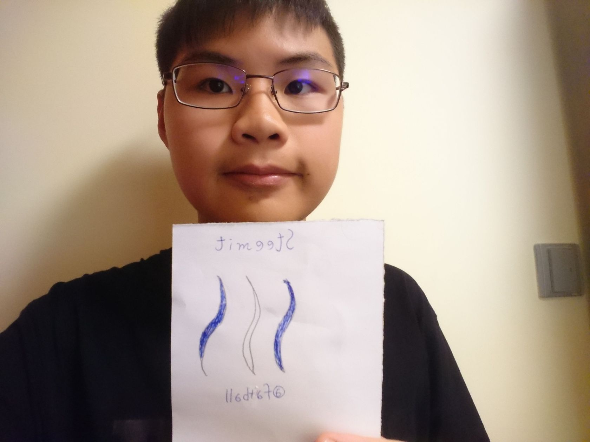

### 【新手村计划#2】\@tydebbie 来自美国的一位年轻女中医博士的访谈
大约两星期前，发了一篇文章，发现有一位陌生的朋友留言。因我是新人关系，每天会留言来访及被关注的朋友都不多，好奇下点进用户的资料中看一看，发觉原来同样是香港人，只是移居了美国十多年。

期后，再细看几篇文章后，发觉她是牛人!!! 很年轻便取了中医博士!!

因为，刚刚在设立 \@team-cn 的构想，立即写了几道问题，访问这位年轻的小妮子 Debbie (\@tydebbie)。

问: 请问您是住在那里的华人? 想人们怎样称呼您?

Debbie : 住在美国加州，称呼我 Debbie 便可以，相熟的朋友会称呼我「迪比」。

问: 是什么原因加入Steemit?　现时主要分享什么类别的内容?

Debbie : 我加入Steemie的想开始记下自己的心情记录。

文章内容没有特定主题，写心情，写所思所看的，也写一些养生的文章。

或许年纪大了，养生的文章，我也很喜欢看。

问：现时，您在Steemit起步时期，会遇到什么难处?

Debbie : 在Steemit最困难是......没找到写文章的思路......

问: 那么，在写作时未有清晰的思路，您会怎样寻求突破?

Debbie : 就随着心情去写，写所喜欢写的，也去看看别人写的。

问: 感谢您接受这简短的「新手村计划」访谈，您想什么类型的朋友关注您?

Debbie : 友善的，喜欢聊天打闹的就好了。

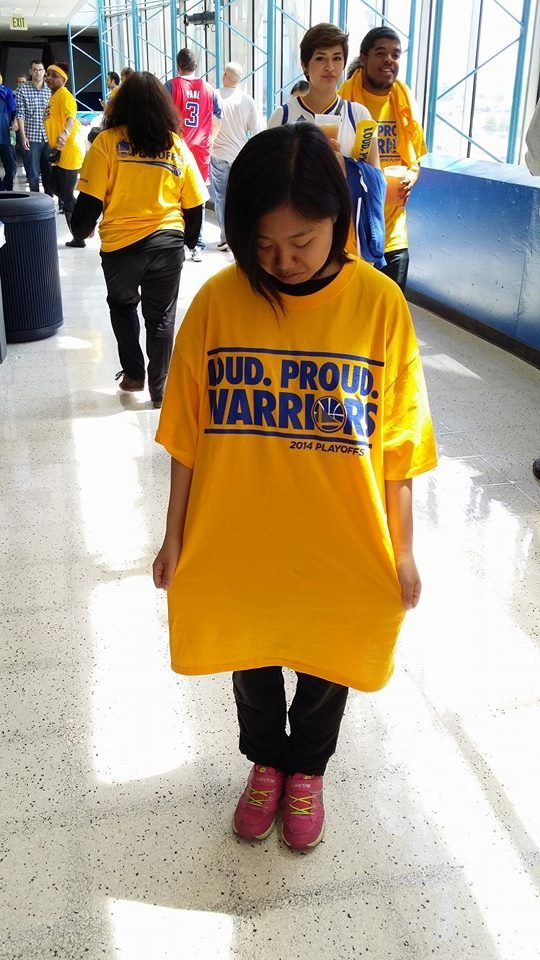

经过短短的文字交流，感到Debbie是一位开朗的女中医博士，文字中表达着欢笑。

好高兴在设立 \@team-cn 后，她成为第二位受访者

### 【新手村计划#3】\@coder-bts 来自美国的一位中学生的访谈
刚发布【新手村计划】就收到了第一位报名参加访谈的朋友\@coder-bts。账户也是前几天才建的，非常新的新人。

问：\@coder-bts 您居住在哪里？

答：我现在主要居住在美国Charlotte，NC（北卡）

问：您的职业是？

答：现在主要是一名中学生，但是因为写了七年的代码的缘故，所以被所有人叫做程序猿

问：希望大家怎么称呼您？

答：大家可以叫我码农BTS，或者更简单点BTS，想直接叫我id也好似没有问题的，只是名字的翻译罢了。至于BTS，是我以前的英文名的缩写。

问：什么原因让您加入Steemit？

答：第一次了解到Steemit其实是因为坛子哥 \@tumutanzi, 因为做了一年多独立博客也关注到了坛子哥。然后本身对区块链也有很大的关注，曾经给过两个区块链讲座，参加了一些AWS的会议，入过一些比特币，然后看到介绍Steemit就觉得很创新，就加入啦。

问：您主要分享什么类型的内容？

答：我主要会分享一些日常散文，对一些新旧事物，人物的个人看法，有时候也会写一些技术文章，代码解析；偶尔会分享一些照片之类的。

问：您想什么类型的朋友关注您？

答：如果对技术，对日常生活，对批判性思维，对人物看法感兴趣的朋友能够关注我，那就在好不过啦！

BTS是一个非常有才华和年轻的程序员。从8岁就开始学习编程，至今有7年的编程经验。真的感叹一下：长江后浪推前浪，前浪死在沙滩上。。。希望得到大家的关注让他壮大，更好的帮助社区的发展。

### 【新手村计划#4】\@snailsong来自重庆的一位帅气骚年的访谈
接下来的这位访谈者一直活跃在新人群里，每次发言都可以感受到重庆人性格的火辣和热情。

问：\@snailsong，您居住在哪里？

答：大家好 我是来自重庆雾都的崽儿，这里的重庆人热情火辣，给你吃火锅，我吃火锅底料，我们最爱在最热的夏天吃最辣的火锅，微辣是我们最后的妥协哈哈。

问：您的职业？

答：现在是一名资深的大学生

问：希望大家怎么称呼您？

答：我steemit叫 snailsong 因为我性格比较慢热和蜗牛差不多，但是我reply的速度还是很快的。大家可以叫我 喵哥 我是资深的猫奴，但是没有养猫哈哈

问：什么原因让您加入Steemit？

答：我加入steemit希望和大家一起交流，希望有更多的朋友，而且这里不需要VPN，自己写文章还会有点小钱，很满足

问：您主要分享什么类别的内容？

答：由于技术有限 大多分享生活日常 读书感悟 历史事件的看法 有时候发点技术贴

问：您想什么类型的朋友关注您？

答：各路大v都来关注我最好，希望更多程序员小哥多交流 还有币圈的各位朋友们 小姐姐更是欢迎哦

这位帅小伙就是 \@snailsong

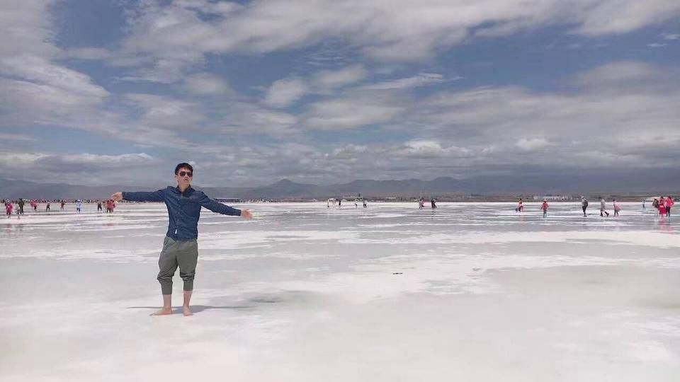

做完访谈还不忘给重庆打广告。 重庆的照片：

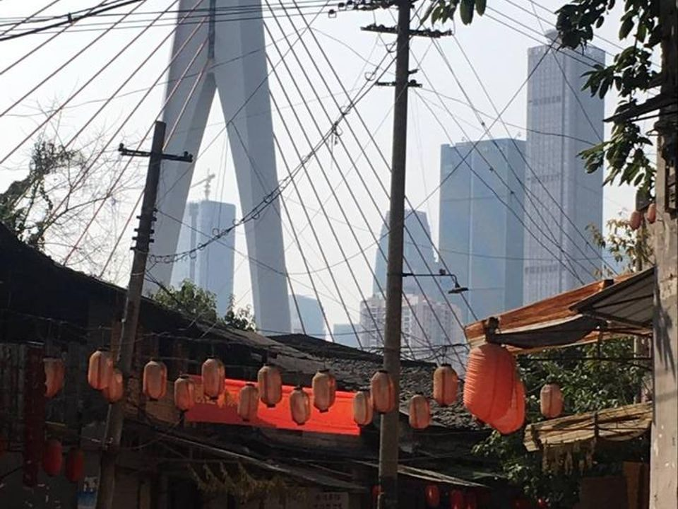

不要看喵哥看起来不着调的，其实人家可是很有才华的一个人。看看这字写得，那是一个漂亮！

下回谁要是去重庆，记得找 喵哥 \@snailsong， 他会带你去吃火锅，他自己吃火锅底料～ 勒是霧都！

### 【新手村计划#5】\@aellly来自广东的一个壮小伙/大叔的访谈
接下来要接受访谈的这位网友为了这次访谈特意跑到篮球场运动起来，想着等到他上场的时候可以给大家看他最佳（瘦）的状态。

可惜留给他的时间不多了，1，2，3！ 西瓜 \@aellly 走起～

问：\@aellly 您居住在哪里？

答：现在住在海南翰林镇。来自广东。

问：您的职业是？

答：水电工程师。

问：希望大家怎么称呼您？

答：西瓜。这是我的绰号。这个叫法很亲切。

问：什么原因让您加入Steemit？

答：写书。以前看了很多的网络小说，所以向往有自己的作品。

问：您主要分享什么类型的内容？

答：小说作品。把我写的作品分享给爱看书的朋友。

问：您想什么类型的朋友关注您？

答：比较有内涵素养的。特别是希望爱看书的。当然其他爱好的朋友我也想交。朋友行业越多越丰富生活。

问：还记得您刚在Steemit起步时的情况吗？

答：记得，很不容易。很渴望结识到Steemit里的朋友。很多Steemit上的操作都不懂。

问：您想过放弃吗？

答：想过放弃。而且不只一次想放弃。因为主要是的作品没有被推广。没人欣赏所以很沮丧。

问：您是怎样走出起步的困局的？

答：在低谷的时候认识了 \@ericet \@liuzg \@xiguang 三位亦师亦友。讲解了心中很多困惑。非常感谢他们

西瓜是我在一个新人群里认识的，到现在一直坚持写着他的原创网络小说。网络小说在steemit上算是一个小众类别，关注的人很少。对于一个刚起步不久的新人来说就更少。希望对小说有兴趣的朋友可以关注关注他。

分享一下西瓜年轻时候的照片：

曾经的壮小伙也挨不过岁月这把杀猪刀！你们还在等什么！你们再不关注西瓜 \@aellly 他真的被岁月这把杀猪刀剥完皮了！

### 【新手村计划#6】\@liuzg来自安徽的一位大叔药剂师访谈
接下来要介绍的这位是个闷骚暖男，虽然现实里他不善于言辞，但是在网络上可打开了他的话匣子。

问：\@liuzg 您居住在哪里？

答：中国安徽省芜湖市

问：您的职业是？

答：药剂师，中医学徒。

问：希望大家怎么称呼您？

答：小白(我是steemit小白) (我觉得"老刘头"更好点）

问：什么原因让您加入Steemit？

答：直接原因是好奇，\@tumutanzi 老师的一篇博文。最主要的原因是以为这里能挣很多钱 ！现在已经不这么认为了，不劳而获是不现实的。

问：您主要分享什么类型的内容？

答：随笔，中医读书笔记

问：您想什么类型的朋友关注您？

答：有思想的or友善的or乐于助人的

问：还记得您刚在Steemit起步时的情况吗？

答：刚入steemit时什么都不懂。借着谷歌翻译疯狂看帖，当时不知道还有cn区。在QQ、微信上查找steemit相关群和公众号加入，在群里寻求帮助。

问：您想过放弃吗？

答：没想过放弃，有点太耗时间，可能在线时间会缩短。

问：您是怎样走出起步的困局的？

答：啊，我好像还没走出起步的困局！但是我在steemit认识了很多朋友以后我觉得现在这样也挺好。抛开挣钱的烦恼，steemit是个有趣的地方！

当我们刚发布 \@tydebbie 的访谈，老刘头就兴奋的像个小孩子一样在新人群里说，Debbie的访谈和他的访谈很像。对比了一下，还的确有点相似。不止他们都同是中医这个行业的，交友选择，分享类别也很相似。因为很多的相似，他和Debbie也聊的很起劲。

回头看看我们 \@team-cn 创立的目的除了帮助新人得到更多人的关注，并且帮助一些人找到有同样话题的朋友，建立起他们在steemit上的朋友圈，让他们更容易融入steemit这个社区。

这是老刘头：

### 【新手村计划#7】\@biorabbit来自德国的一位思想家的访谈
这期访谈的对象是 \@biorabbit，来自德国。当我读完他的访谈回复之后，我已经惊呆了。我想用“思想家”这三个字来形容\@biorabbit一点也不为过。\@biorabbit既精通中华文化，又了解现代科技，而且对区块链，去中心化，以及他们会对当今人类社会产生什么样的影响有着自己独到的见解。\@biorabbit还独创了一套“金字塔体系”，并且把这个体系放到了Github中，希望与大家分享。另外\@biorabbit还在cn区发起了关于成立cn-education教育版块的倡议。总之\@biorabbit绝对是文武双全，希望大家多多支持哦。

\@biorabbit虽然2017年7月份就加入了steemit，但最近一个月前才开始写文章，而且现在还有系统代理的SP，所以我们也认为\@biorabbit属于新人，并且最后三个问题（\@biorabbit合并回答了）是为\@biorabbit量身定做的。

最后希望大家多多关注支持\@biorabbit.

问：\@biorabbit 您居住在哪里？

答： 德国北部。

问：您的职业？

答： 创业者。

问：希望大家怎么称呼您？

答： Ga村居士。纪念那个生活多年，人生中最重要的，我们称之为G-Town或Ga村的小村庄。

问：什么原因让您加入Steemit？

答： 从\@tumutanzi那开始听到Steem创新的奖励机制时，就感觉这是未来的趋势，而且自己也在新浪博客上写，为什么不尝试有奖励呢？反正都是写，没钱也写的啊。当时是17年7月就注册了，只是那会事比较多，而且自己的文章老长，感觉还要翻译成英文还是蛮累的。也是当时看到国内的YOYOW也正在酝酿中，原理相同，开发计划说10月份就推出来了，想想就等它吧。结果等等怎么就出不来啊？大家都知道，难产了，半年过去了才终于临盆。期间也没有太关注Steemit，直到今年2月底，当自己的金字塔思想体系已然成熟，又一波写作高潮来临的时候，Steemit的中文区也已然颇具规模，而且我更看中Steem的国际化的，所以一切自然就水到渠成，我开始了Steemit之路。

问：您主要分享什么类别的内容？

答： 我想感谢\@team-cn的朋友愿意采访我，因为他们帮了我一个大忙，让我终于把早就想写的下文完成了，不然还不知会拖多久。:)

我想和朋友们分享的是我的工作、生活、还有思想。具体地讲是一些底层的东西。区块链从出现，发展到至今，我想这个时机已经成熟了。一个取代旧秩序，重建新秩序的时机已经成熟了。一方面是资本体系中心化的旧秩序：1%的人群占据了超过50%的财富。因为人的本性是不会主动放弃既得利益的，所以这是一个不可逆的过程，财富会继续集中，而且越来越快。那99%的人早晚是要革命的，是到60%的财富集中的时候，还是70%、80%？只是时间问题，也是一个方式的问题：暴力还是非暴力的问题。其实如今的世界火药味已然非常之浓烈了。

另一方面，基于区块链的加密货币和开源方式是未来的趋势，而创新的奖励机制更是给他们按上了腾飞的翅膀。无论现在是否成熟，这必将是未来的趋势，它颠覆了旧有中心化的价值评估体系，重新开创了另一种体系。因为构成体系的是个体的集合，体系只有建立在人的基础上才能存在、才有意义。而世界上的人数量是一定的，不是在这个体系中，就是在另一个中。而每当一个个体从这个体系跳入另一个体系，都意味这彼此之间力量的此消彼长。如果新体系对大多数人是更有吸引力的，那所有这一切都将导致一个结果：去中心化。我想这正是眼下所发生的。不过，这个去中心化到这一层还不能算是彻底地完成，充其量只能说完成了一半，或者说完成了线上的去中心化。

请不要忘记，人还是人，填饱肚子的不是steem、也不是SBD，而是食物。你生病了还是要去医院，你的小孩还是要上学校接受教育。而当你的食物、医疗和教育等等这些最底层、最基本的生存要素还是需要依赖旧体系的话，我想你还没有资格说已经彻底完成去中心化，和彻底自由了。放心吧，旧体系绝对不可能轻易放弃自己的阵地的。

很有意思的是，过去几年，我一直专注于食物、医疗、教育等等这些最底层的要素，致力于构建一套如何实现这些的自主权，也就是生活的自主权。我称其为“金字塔体系”，如今已经成熟了。关于这个体系更详细介绍请看: Read me-1, 这是怎样一个博客？v. 1.0 | 月旦评 。这更像是一套线下的体系，如果和开源、加密货币、以及奖励机制结合起来会如何呢？是否可以完成彻底的去中心化、我们可以彻底自由了呢？我很自信我的体系的生命力，因为她源自古老中华文明的哲学思想。她既不左，也不右，而是中庸的。她符合儒家的“以人为本”、“修身齐家治国平天下”、“推己及人”，符合道家的“道法自然”、“天人合一”，也符合心学的“吾性自足，不假外求”、“知行合一”的思想，当然佛家是怎么样都可以的，呵呵。建立新秩序可以有选择的，可以是非暴力的。

如果要问这个体系具体能干什么？她能干很多事情，比如健康、教育，自我发展等个人问题、家庭问题、社会问题，如环保（我还准备写文章参与\@dancingapple的环保活动）、心理辅助等等，可以任由想象力的发挥。我之前也有提过“关于成立cn-education教育版块和自荐版主的倡议 ”，还有“OSL，Open Source Lifestyle，开源生活方式” 项目，如今两个项目都在进展中 。如果要形容这个体系的话，她更像是个内核，我希望她是像Linux那样的内核。所有人可以根据自己的需要，任意地DIY出个性化的产物。

以下略带广告。尽管金字塔体系的思想已经成熟，但还远没有完善。虽然我已尽了自己的最大努力，但苦于才疏学浅，文字功底的欠缺等等，这完全不是我一己之力可以完成的。好在似乎所有的平台都已经有了，我已经将这个体系慢慢放入了Github中：Pyramid-chinese项目 。使用的是GPL-3.0的许可证，也就是说完全开源了。我会持续地维护和改进，接下来会尝试在utopian.io上发布任务请求。这些对于我一个非IT业的从业人员来说，还是费了好一阵子去理解，好像也没有完全理解。之所以将她开源，就是希望通过开源的力量来完善她，让她能发挥更大的作用。

所以也想趁此机会，向朋友们征求各方意见和建议，比如针对线下线上的观点、金字塔体系、之后的完善、utopian.io的运作等等。当然也热情欢迎有合作意向的朋友们，比如文章的改进、翻译、衍生品及项目的开发等等。同时也欢迎朋友们以代理SP或直接捐助的方式支持这个项目。谢谢！

“生命本没有意义，你要能给它什么意义，它就有什么意义，与其终日冥想人生有何意义，不如试用此生做点有意义的事。”----- 胡适

问：您想什么类型的朋友关注您？

答： 无所谓何种类型，皆是缘份。

问：还记得您刚在Steemit起步时的情况吗？您想过放弃吗？您是怎样走出起步的困局的？

答：这三个问题我一并回答。在Steemit我没有起步、困局和放弃的问题，因为这些问题我早在加入Steemit之前就解决了。在我的思维方式从“我-->钱-->幸福”切换到“我-->幸福”的模式之后就解决了。具体请阅读我的博文：经济自主-4，不一样的“钱”-2

### 【新手村计划#8】\@weitz 来自江苏连云港的啤酒酿酒师
现在朝我们走来的是身高192cm，还在长身体的“大柱” \@weitz

问：\@weitz 您居住在哪里？

答：我是来自江苏连云港的weitz。

问：您的职业是？

答：我的职业是一名啤酒酿酒师

问：希望大家怎么称呼您？

答：我希望大家称呼我为 大柱

问：什么原因让您加入Steemit？
答：

1.我觉得steem是个非常有意思的公共平台，可以让我接触到更多有趣的事情。

2.个人的英语确实很差，平台里有很多的英语文章，可以让我学习。

问：您主要分享什么类型的内容？

答：我主要分享的是有关啤酒的一些小知识，一些经典啤酒的历史、来源、啤酒品鉴小知识、后期可能会分享一些啤酒的酿造，让小伙伴在家自己也能酿啤酒。

当然，也可能会分享一些当日的所见所闻等。

问：您想什么类型的朋友关注您？

答：我希望一些啤酒爱好者可以关注我，包括一些问题也可以留言给我，但别忘了点赞哦。 ：-)

大柱对啤酒真的是非常有研究，大家如果有任何关于啤酒的问题，欢迎给他留言。

酷帅酷帅的大柱：

### 【新手村计划#9】\@pgr 来自希腊被大鲸看中的画家
接下来我们要采访一下据他自己说他是个老实人的老实人 \@pgr

问：\@pgr 您居住在哪里？

答：大家好！我目前住在希腊雅典。

问：您的职业是？

答：我是一名美术工作者。在学校时主修的是雕塑（这也是我到希腊的原因），目前主要从事绘画和一些艺术设计类的项目。“春草美术”是我的个人工作室。

问：希望大家怎么称呼您？

答：大家就叫我小p吧。另外，“春草美术”正在筹划一个子版块，叫“狗剩画室”，所以大家叫我狗剩也可以（是的，这名字很文艺，我很喜欢）。

问：什么原因让您加入Steemit？

答：为了多个渠道散发小广告。

问：您主要分享什么类型的内容？

答：主要是自己的原创美术作品。大致会分为两个部分：

“春草美术”分享一些严肃正规的创作，以及创作的过程，背景，心得等等。

“狗剩画室”会发布一些轻松搞笑的涂鸦。呐，做人呢，最重要是开心。

问：您想什么类型的朋友关注您？

答：

春草美术：“随缘最好。”

狗剩画室：“走过路过不要错过！瞧一瞧看一看了嘿！各位南来的北往的，点赞不花钱，转发交好运了喂！一个赞，点不了吃亏，也点不了上当...”

大家一定好奇为啥标题写小p是被大鲸看中的画家？这个典故来自小p的一个帖子：

Duckling & Balloons 鴨仔與氣球~

这个帖子得到了大鲸的点赞，瞬间帖子价值$72。这对于新人来说是一笔巨资。

相信很多新人一定在steemit上迷茫过，我每天发帖，为什么没人给我点赞？我的付出值得吗？

再看看小p，他的每篇帖子都写得认认真真，一幅幅插画都要花很长时间才能完成。

他认认真真的态度得到了回报，相信如果大家也这样认认真真对待每篇帖子，也都将得到回报！

小P \@pgr 比较害羞，不愿意发他的自拍，就发一张他的画吧。

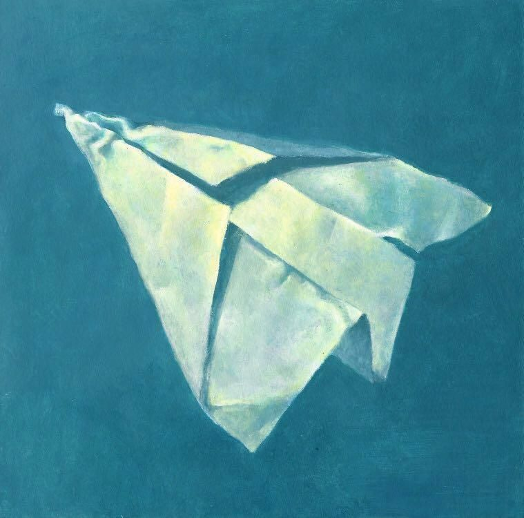

### 【新手村计划#10】\@jaffer 一位来自古都西安的码农
接下来要访谈的\@jaffer活跃于好几个写作平台，还是几个QunQun的群主。

问：\@jaffer 您居住在哪里？

答：我现在居住在中国十三朝古都—西安，西安作为丝绸之路的起点，文化历史悠久，也富有许多名胜古迹，当然丰富多样的小吃也是应有尽有，最重要的一方水土可以培育一方美人。

欢迎steemit的朋友们来西安旅游，不要忘了联系我哦。如果可能的话，给单身的你介绍个妹子也不错哈。

问：您的职业是？

答：目前作为一名刚毕业的小硕，从事码代码工作，专职的码农。

问：希望大家怎么称呼您？

答：我的steemit为\@jaffer，如果是中国人，可以称我为果之郎，因为我的媳妇名字有个果字，故得之 “果之郎”。

问：什么原因让您加入Steemit？

答：偶然间在网上第一次了解到Steemit，其实是因为坛子哥 \@tumutanzi写的帖子，没有原因，就想来看看什么样的社区还能够发帖子赚钱哈。“好奇心往往害死人哈”，真是一入steemit深似海哈，不过更多的还是感觉幸运。

能够认识这么多有才的小伙伴们，让我们一起快乐的成长。

问：您主要分享什么类型的内容？

答：目前由于刚加入steemit不久，重点还是关注下目前社区朋友们分享的帖子。类型的话其实我更关注一些科技、航空、日常生活、技术帖子，当然也少不了区块链的内容。

希望自己做一个博学的人吧。感觉steemit上面大神级别的人还是非常多的。先以低姿态的学习的心态去看待吧。后续自己思考之后才会确定侧重哪些方面的内容。

问：您想什么类型的朋友关注您？

答：大神、大神、大神，重要的事情说三遍，还有志同道合的朋友们。

譬如\@rivalhw， \@tumutanzi，\@justyy、\@dapeng、\@breathewind等等吧，其实还有很多。希望他们关注并不是因为他们的点赞带来丰厚的收入，而是需要向优秀的他们学习，学习他们的生活态度，学习他们对每个帖子高标准严要求的持续创作、学习他们不断完善自我的这种修养。不要问我怎么看出来的，如果你有空，请看看他们过往的帖子，你都能从中受益匪浅。

每个人的写作天赋可能不太一样，但我想能在steemit快速成长的永远是那些靠自己不断的认真，反复的勤奋去用心创作的人。当然也不能忘了勤与steemit的朋友们交流，毕竟是一个大型的社区交流平台。只有跟别人交流，才能彼此发现美的源泉。

问：还记得您刚在Steemit起步时的情况吗？您想过放弃吗？

答：谈何起步啊，现在就想刚在steemit出生的幼儿，连走还不会走呢，求老司机带带我，我要去省城。我是2018.03.13号注册的，记得当时整整等了两周呢，真是不容易啊。【放弃】是什么鬼？

在我字典里从来都没有这个词，为了对得起我苦等两周的时间我也得坚持个若干世纪吧，开个玩笑。。。能不能活那么久还不知道呢。

问：您是怎样走出起步的困局的？

答：问我如何走出困局的，这个问题真是让人难以回答啊。其实我也想顺便问下来看这个帖子的你们，如果我有幸能够走出困局，我希望这里面有你们的一份功劳。

我相信在未来的某个时刻，我会发个帖子或者更郑重的姿态去感谢每个来到这里的人。是你们的欣赏和鼓励让我有勇气和动力去坚持在steemit创作下去。

来吧，steemit的朋友们，伸出你的双手，展开你的臂膀，轻轻的用你的手在下面的某个地方点下去，支持一下\@jaffer刚来不久的新人。小弟我将万分感激。

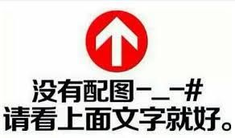

### 【新手村计划#11】\@fishlucy 一位来自英国的全职妈妈
接下来这位是 \@bobdos 的老友（cn区2个小可爱的巴比）

问：\@fishlucy 您居住在哪里？

答：英国Stoke-on-Trent英超里面的斯托克城

问：您的职业是？

答：职业是全职妈妈加self-employed自雇做商务咨询翻译签证旅游留学考察等等中介服务

问：希望大家怎么称呼您？

答：路西

问：什么原因让您加入Steemit？

答：老友\@bobdos去年9月就强力推荐，可惜现在才有时间，一听说他准备全职做steemit，我就赶快加入了

问：您主要分享什么类型的内容？

答：主要分享家庭旅游小孩教育各种生活点滴，都是一时兴起拍拍照，随性而作有感而发

问：您想什么类型的朋友关注您？

答：估计关注我的为人父母居多，比较能感同身受，也希望能在cn区结交更多志同道合的朋友

问：还记得您刚在Steemit起步时的情况吗？

答：也就20几天前，进来了很兴奋，恶补steem知识，看到好文就点赞，一下子vp用完了，虽然还不值钱，呵呵

问：您想过放弃吗？

答：没有，\@bobdos很好的，一开始就告诉我刚起步阶段收益很少的，还把他半年前的帖子给我看，不仅代理了100sp给我，还有问必答，我也喜欢做各种试验，乐此不疲。

问：您是怎样走出起步的困局的？

答：等积累了一定知识，觉得还是有投资的必要的，特别是\@bobdos带着玩过比特币莱特币，这些并不陌生，所以前后投资了1000多镑，在这段时间最低点的时候也买过（超级得意），目前对以后的上涨前景蛮乐观的，手里有钱了收入也稳定了；而且我是慢性子，做什么都顺其自然，现在完全把steemit当微信朋友圈在玩，也蛮开心的。

偷偷的在这里告诉你们，\@fishlucy Lucy是一个很nice的人！每次你给她的帖子回复都会给你点赞！她的点赞价值还不低的哦～

你们给她回复的时候记得给她的点赞哦～ 不要欺负这么nice的人！

Lucy还有一对可爱的女儿～

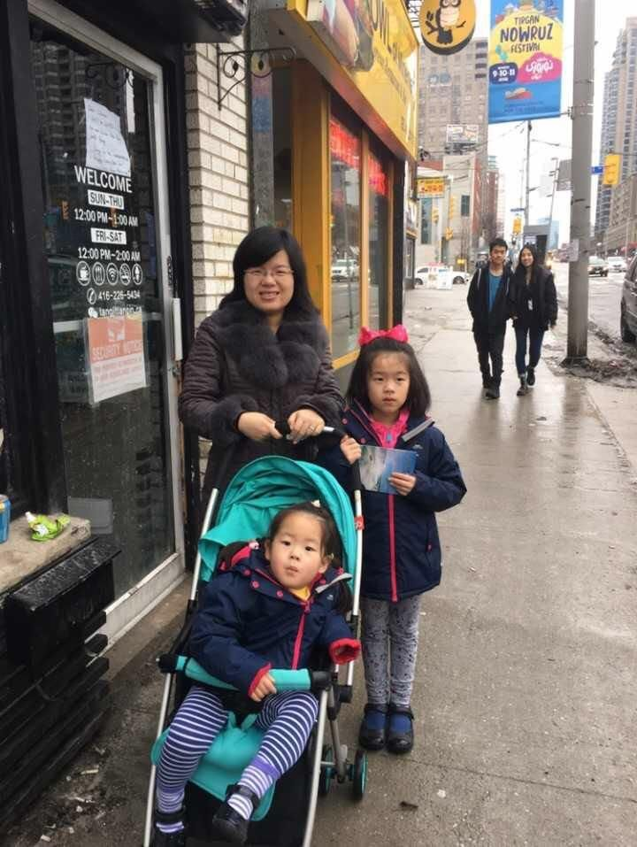

### 【新手村计划#12】\@lulucy 一位来自四川爱读书的销售
接下来要介绍的这位是和上一位\@fishlucy 同名的 \@lulucy 小鹿～

问：\@lulucy 您居住在哪里？

答：四川一个小城市

问：您的职业是？

答：销售

问：希望大家怎么称呼您？

答：中文的话叫小鹿吧，英文可以叫lucy

问：什么原因让您加入Steemit？

答：加入Steemit其实是比较好奇，很想看看外面的世界。

我英文是不会的哈，其实一直有好好学习英文的打算，感觉不会英文在现在的时代，太吃亏了。偶然的机会发现了steemit ，所以很想了解下，就进来了 。

我最初的想法只是，玩steemit，总是不可避免的会接触到英文，那我不必须去学习，查字典什么的。

问：您主要分享什么类型的内容？

答：我分享的内容主要跟读书有关，书评、读书笔记 以及我自己的一些散文，随笔。

读书，写字本身是自己喜欢做的事情，刚好这个平台也可以展示下

问：您想什么类型的朋友关注您？

答：对于什么类型的朋友关注的话，我没有限制，多元化吧，能够接触到更多新知识

问： 您有什么爱好吗？

答：读书，写作，旅游

问：能谈谈您的steemit ID由来吗？

答：lulucy前面的lu是我的姓，本来之前注册的另外的id，结果账号密码忘了找不回，只好重新注册，所以说起来没什么特别的。

回顾小鹿\@lulucy的帖子，感觉她是一个静静写文章的人。文章的产量虽然不高，但是每篇都值得慢慢静下心来阅读。希望大家关注她，给予新人更多的机会！

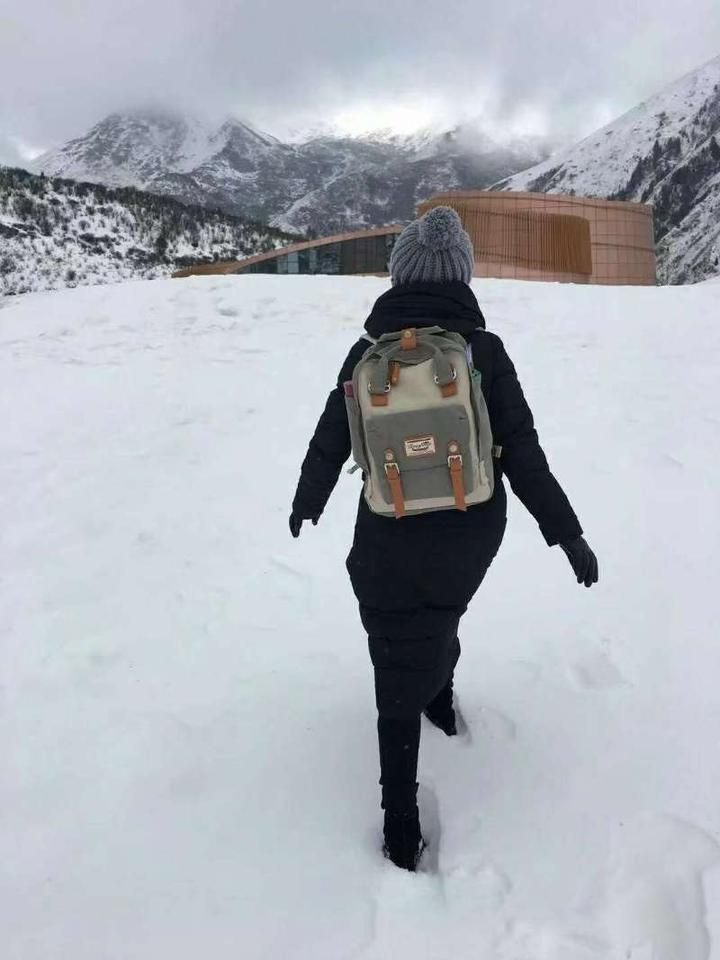

### 【新手村计划#13】\@crowflew 一位来自云南昆明知识青年
接下来这位可是入围月旦评的常客 \@crowflew 维参

问：\@crowflew 您居住在哪里？

答：目前在家乡中国云南昆明，9月开学后会去北京

问：您的职业是？

答：将要读研，社会学专业

问：希望大家怎么称呼您？

答：维参或crowflew，具体见我名字的来历

问：什么原因让您加入Steemit？

答：因为\@weisheng167388金兽大叔一直在读书群里说，就想来写写东西。之前一直没有写作，所以决定尝试一下。

问：您主要分享什么类型的内容？

答：主要是以下几个部分：

1.中外诗歌相关

2.社会学和哲学著作的解析

3.其它读书笔记

4.好声音

5.随机杂谈，我兴趣广泛，将会继续发出各种各样有趣的内容

问：您想什么类型的朋友关注您？

答：没有要求，保持开放，希望发现更多可能。

问：还记得您刚在Steemit起步时的情况吗？

答：当时看了一小堆新手帖子，然后\@TVB美女的“三个一”活动出个“年”字，我就凑了一下当时面色欺春雪，古藤阴下梦少年，好歹有个年字。

这篇文章是翻着《宋史》和《淮海居士长短句笺注》写的，用了三个多小时。没想到还挺受欢迎——实际上也是到目前为止收入最高的一篇。

所以起步还算蛮顺利的。

问：您想过放弃吗？
答：没有。一则本来就是为了写作才上steemit，虽然收益不算多，但就写作来看还是蛮有所得。最初一个月可以说是写作上瘾。二来结识了很多有趣的朋友，对我来说steemit也是观察和参与自治社区形成与自我治理的场所。第三，随着了解的深入，对区块链也逐渐有一些兴趣，所以打算坚持学习。

问：您是怎样走出起步的困局的？

答：虽然第一个帖子效果不错，但实际上后来也有大量帖子看的人不多，收益也不高，时间上和大量写作的区间相重合。

我认为这不是自己的问题，是社区的正常波动，逐渐回到新人帖子的正常情况。

所以主要做了两件事：

1.减少发帖量，差不多每天1贴

2.保证帖子质量

现在的话基本上稳定在每天1贴，写作投入1个小时左右时间，社交的话其实本来就要支出，在微信群还不如在steemit上~

虽然不能说我的帖子都是高质量的，但至少也没有水，没有完全不值得一读的。我想这一点最重要。能够持续地输出优秀内容（包括回帖），一定会得到认可和支持。

\@crowflew 是个文艺青年，这个月月旦评有4篇文章入围。

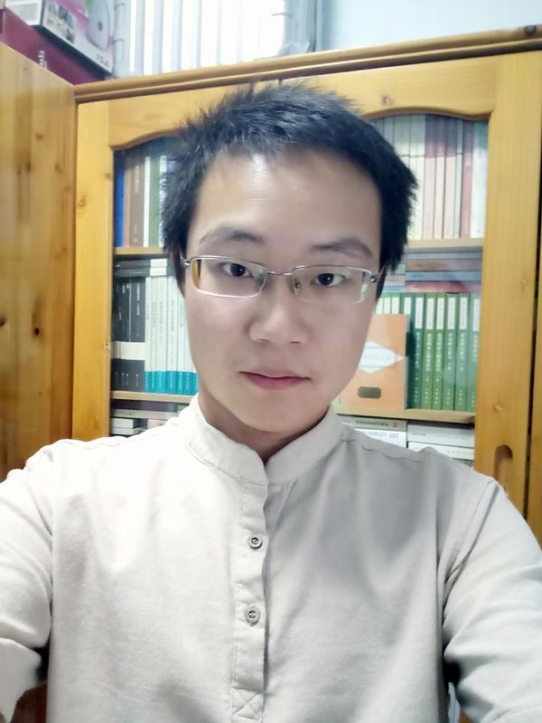

### 【新手村计划#14】\@peanut77 来自成都的前-前端开发美女工程师
这期的访谈对象是 \@peanut77，在新手村微信群里，大家都叫她花生阿姨。

问： \@peanut77 您居住在哪里？

答：成都。

问：您的职业是？

答：前-前端开发工程师，现-无业游民家里蹲儿。

问：希望大家怎么称呼您？

答：像我的ID 叫我花生好啦。

问：什么原因让您加入Steemit？

答：之前做了快7年的互联网开发，基本再也没写过字，最近离职中，想要慢下来感受一些其他有趣的东西，所以会想有地方积累记录，而且这里写作有回报有新朋友，何乐而不为呢？

问：您主要分享什么类型的内容？

答：美食，美景，美物，后面也可以加入技术相关。最近的目标是分享一系列和美食有关的温情故事，steemit上建一家属于自己的“深夜食堂” :)

问：您想什么类型的朋友关注您？

答：爱生活，爱分享，三观正吧。总之希望各种有趣的人儿和我做朋友！

问： 您有什么爱好吗？

答：读书，动漫，旅游，美食。

问：能谈谈您的steemit ID由来吗？

答：因为我超喜欢吃花生，所以选了peanut，然后7是我的幸运数字，也是我真实名字的谐音，所以组合一起就是peanut77啦！

花生阿姨 \@peanut77的运气不是一般的好，参加过2期 \@ace108举办的露三点活动，2次中奖。有一次还猜中全部3位数的数字！这个机率只有0.1%！厉害了，我们的花生阿姨～ \@tvb举办的三个一和吐槽大会活动，花生阿姨也多次得奖！真是人生赢家，上帝宠儿！

大家快关注关注花生阿姨，沾点福气～

### 【新手村计划#15】\@maranran 一位来自广东的美丽女中医
前几天在steemit的feed频道闲逛，我发现有个新号更新了两篇有关针灸、拔罐的帖子。出于对职业的敏感，我发现这又是一位中医。经过攀谈我知道这是一位热爱生活、兴趣广泛的东北大妞儿。

问：\@maranran，您居住在哪里？

答：大家好 ，我来自东三省，我是东北大妞儿，我现在生活在广东东莞。

问：您的职业？

答：我的主业：中医，副业：医院行政小白领。也可以反过来说，这不矛盾。

问：您希望大家怎么称呼您？

答：我在steemit叫maranran,大家可以叫我：小马！

问：什么原因让您加入Steemit？

答：我喜欢steemit言论自由的环境，我觉得四海之内皆是朋友。我加入steemit希望和大家一起交流，畅所欲言。

问：您主要分享什么类别的内容？

答：我分享的内容：

（1）医学方面，包括医院行政办事流程，比如你去办特定门诊，或者想转院，或者产生医疗纠纷等等，我在三甲医院医务科工作几年了，对这些比较专业的。还有医疗新技术，对于一些高精尖的治疗方法，我比较清楚。这些用到时不知所措的小知识还是可以跟大家分享下的。还有，就是我自己的专业是针灸，会跟大家分享一些小保健常识吧

（2）生活感悟：大学时读了很多书，也读得下去。现在不知道是书出的内容不行，还是自己主观意见已形成，一本书很难翻到最后了。其实很多事情，真理，不需要写成一本书那么厚。经典嘛，必须要精。

问：您想什么类型的朋友关注您？

答：看到我的图文，不由自主往下翻看的那位就是有缘人啊。不限定，职业、年龄、性别、取向、无论平穷富贵，疾病与健康。来着皆是朋友。常来坐坐

\@maranran 小马初入steemit时，还不太懂这里的规则,曾经直接照搬的大鲸的文章，也不知道怎么在dlive分享她生活中的视频留影。

她性格乐观、勇于探索，一直在寻找在dlive分享视频的方法。

她有太多的原创想和朋友们分享，奈何初到的困境还在缠绕着她。

那么，让我们一起关注她\@maranran、帮助她！

这就是我们的小马，拥有较好的容貌、168cm身高、104斤的傲人身材。

（声明：小马自己要提供的，我们没有硬性要求需要提供）

### 【新手村计划#16】\@chineseman 一位来自江苏扬州的大数据推广专员
接下来要介绍的这位是我们新手村的神算1号。

问：\@chineseman 您居住在哪里？

答：江苏扬州，这是一座美丽的城市，有着“烟花三月下扬州的美誉”

问：您的职业是？

答：大数据推广专员

问：希望大家怎么称呼您？

答：大家可称呼为“大饼”，这是我上学的时候就跟着我的外号，我的朋友都这么叫我，我自己也不反感。

问：什么原因让您加入Steemit？

答：我是一次偶然的机会在一篇软文上看见了关于steemit的文章，对它产生了好奇，当然也想看看自己能不能在里面赚到钱，我想很多人都有这种想法。

问：您主要分享什么类型的内容？

答：主要分享美食，我以前在上学那会闲暇之余学过一段时间的厨艺，也当过一段时间的厨师，后来因为各方面的原因就放弃了，但是这并不妨碍我对美食的热爱，每周休息天我都喜欢在家做饭，也喜欢教我妻子做饭。

问：您想什么类型的朋友关注您？

答：本人喜欢美食和旅游，也想结交一些这方面的朋友，同时希望能够通过steemit社区，让我能够大开眼界，毕竟中国上网有着限制，最主要的是能交到可以相互让对方快乐的朋友，毕竟生活有太多苟且！

大饼 \@chineseman 有丰富的韭菜收割股市操作经验，对币市的分析也是很准确，所以被村里称为神算1号（把 \@softmetal 软哥从这个位置上踢了下去）。他写的文章都很有见解和内涵，希望大家多关注关注他。

大饼 \@chineseman看起来还蛮年轻的

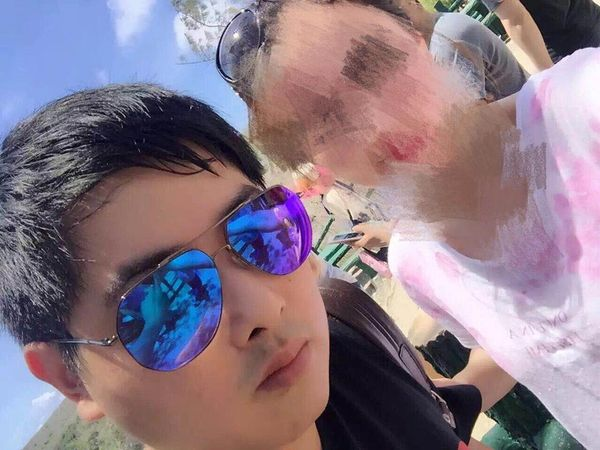

### 【新手村计划#17】\@xiaoyuanwmm 一位来自美国的全职妈妈
接下来要介绍的这位\@xiaoyuanwmm 是集美貌与才华于一身的村长夫人。。。（村长 \@ericet 乖巧的在一旁拿上键盘跪好）

问：\@xiaoyuanwmm 您居住在哪里？

答：美国 新泽西

问：您的职业是？

答：曾经是一名测试工程师和科研工作者，目前全职家庭主妇

问：希望大家怎么称呼您？

答：沿着人生的轨迹，有过很多不同的称呼，小王，王博士，王工，村长夫人，勇敢妈妈。我相信以后会有更多的称呼等待大家去发掘。

问：什么原因让您加入Steemit？

答：我其实一直算是编外人员。是村长背后的女人，写手，粉丝。后来发现，steemit上有很多有趣的灵魂。哈哈，不是都说有趣的灵魂万里挑一么，怎么都在这了。所以以后会努力多写多分享多交流。

问：您主要分享什么类型的内容？

答：美食，育儿，生活中的事，旅游。

问：您想什么类型的朋友关注您？

答：讨厌浣熊的请举手好吗？我想最近我们比较有共同语言。

问： 您有什么爱好吗？

答：烹饪，阅读，旅游

\@xiaoyuanwmm 在其他论坛上面发表了很多的美食，旅游精品文章。最近也开始回复一些帖子，并开始关注大家的文章。相信不久的将来她也会慢慢的被我带入坑里给我们带来更多的精品文章，并成为社区的活跃份子。

一家三口合照

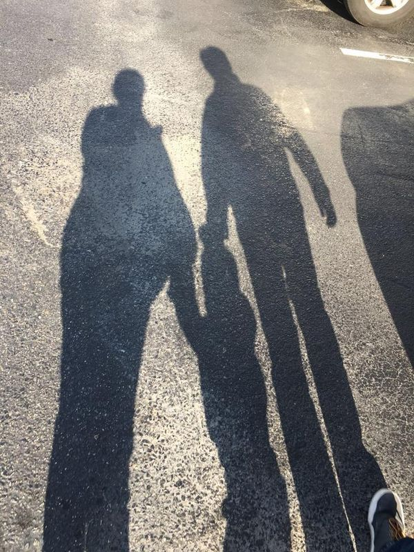

### 【新手村计划#18】\@sharonqian 一位多才多艺的美国高中生
这期的访谈又是一个高中生，正在美国高中读12年级，多才多艺的虾仁 \@sharonqian。

问：\@sharonqian 您居住在哪里？

答：大家好～我叫Sharon目前在美高12年级。平时在美高上学所以居住在美国北卡夏洛特～ 回国度假的时候居住在南京～

问：您的职业是？

答：Sharon目前在美高12年级～

问：希望大家怎么称呼您？

答：大家称呼我Sharon就好～或者虾仁也是可以哒（因为是Sharon的谐音）。

问：什么原因让您加入Steemit？

答：Sharon最初是由朋友引荐来的 了解了steemit后我非常看好steemit基于区块链的平台因为我觉得好的产品一定是有独特见解价值的 故也非常看好steemit的前景～（最初是由朋友\@coder-bts引荐的）

问：您主要分享什么类型的内容？

答：主要分享自己的平时画的原创美术和摄影作品，假期会分享旅游美食照片和自己随手写的散文。

问：您想什么类型的朋友关注您？

答：对美术感兴趣和喜欢旅游的文艺朋友们。当然！强烈推荐吃货们也关注我（笑）

虾仁是一个很有才华和思想的高中生。大家可以看看她的美术创作，很多创作来源于生活，对环境保护的思考。

虾仁也很健谈乐观，希望更多多关注和支持她！

有才华又美貌的虾仁～

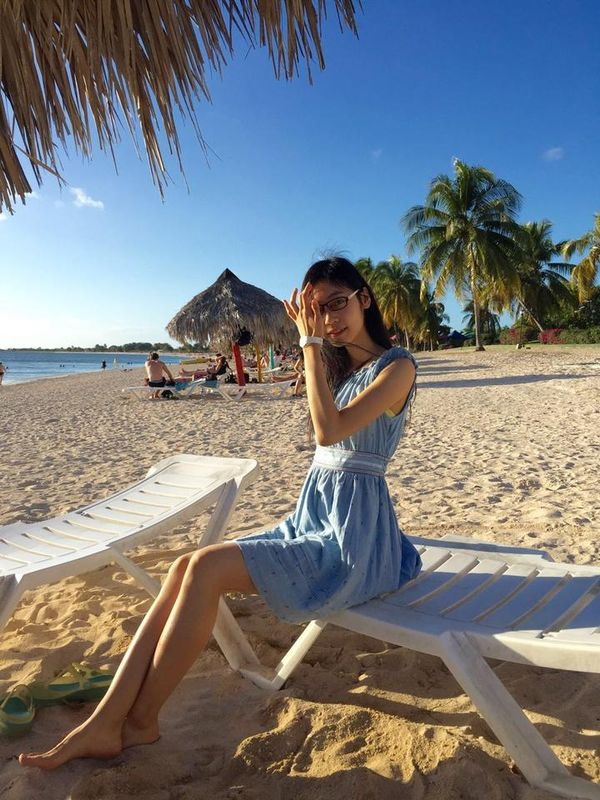

### 【新手村计划#19】\@wwstreet 一位来自帝都北京的移动互联网项目管理
接下来要介绍的这位是来自帝都北京的项目管理

问：\@wwstreet 您居住在哪里？

答：帝都 北京

问：您的职业是？

答：移动互联网PM 项目管理（程序员们的头号敌人）

问：希望大家怎么称呼您？

答：street

问：什么原因让您加入Steemit？

答：在了解区块链技术的时候，无意中发现了这个steemit。没记错的话应该是在“简书”上看到的推荐。

加入及连续使用的原因有三个：

1、透过steemit深入了解区块链技术

2、将自己的内容输出打上唯一标签

3、认识一群新朋友，在这里再次找回2000年左右使用QQ的感觉 “世界的另一头有一群很熟悉的陌生朋友”

问：您主要分享什么类型的内容？

答：对互联网产品、技术、商业逻辑的思考；生活日常

问：您想什么类型的朋友关注您？

答：有趣、有料就好

问：还记得您刚在Steemit起步时的情况吗？

答：刚开始起步对于中文内容寻找，steemit业务逻辑不了解，概括地说不知道怎么玩。

问：您想过放弃吗？

答：没有

问：您是怎样走出起步的困局的？

答：在网络上找攻略，加社群

\@wwstreet 因为是项目管理出身，所以会从高层次看待事物。透过他的文章，可以对一样新事物有不同的了解。

目前他在致力于建一个面向与中文用户的steemit app，希望不久的将来我们会用上他的APP。希望大家支持和关注 \@wwstreet。

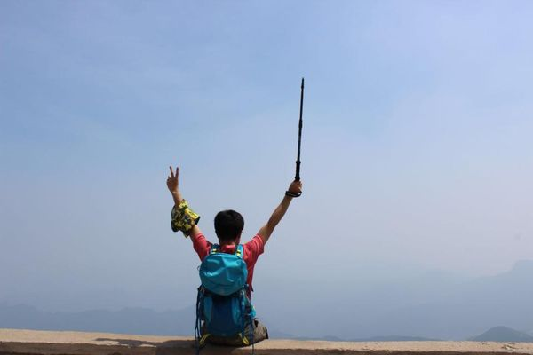

### 【新手村计划#20】\@valleybkk 一位现居泰国曼谷的数据分析师
接下里这位是现居泰国曼谷，来自澳门的 \@valleybkk

问： \@valleybkk 您居住在哪里？

答：泰国曼谷

问：您的职业是？

答：曾经在银行工作多年，现主要做一些零售数据分析。

问：希望大家怎么称呼您？

答：大家可以叫我腿(Ham，这可是香喷喷的大腿！）

问：什么原因让您加入Steemit？

答：也是不经意间看到的，进来发现挺有趣的，跟FB等其它社交有点不同，感觉内容比较有意思。

问：您主要分享什么类型的内容？

答：想分享在曼谷遇到的趣事，美食、旅游等，同时也希望分享有关泰国的国情、行业数据及股票分析等。因为接触泰国的股票市场有一段时间，跟之前接触的香港、美国及内地市场不太一样，可能会有点枯燥哈。

问：您想什么类型的朋友关注您？

答：交友无界限，在STEEMIT就是想拓阔眼界，了解更多不同的知识，希望大家都多交流。

问： 您有什么爱好吗？

答：长跑，原因是其他运动都玩不好﹐很爱看足球、动漫、做饭等。

问：能谈谈您的steemit ID由来吗？

答：我的ID是VALLEYBKK，VALLEY是我跟太太在BKK第一次开店的店名。

越来越觉得新手村已经变成了地球村了，来自世界各地的steemit新人能聚集在一起都是缘分！

Ham分享了很多泰国的趣事，见闻。希望大家可以关注他。

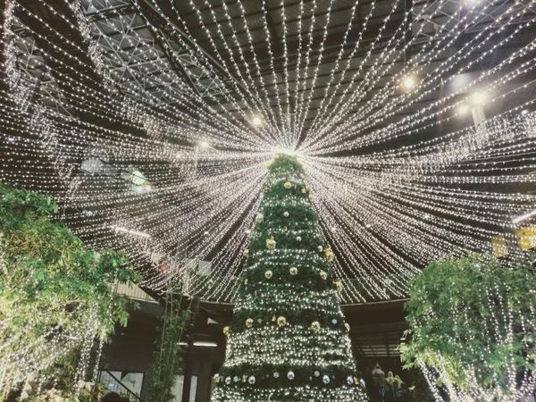

### 【新手村计划#21】\@stepbie 一位来自美国加州的会计
接下来要接受访谈的是迪比 \@tydebbie的老公 \@stepbie 曾老公。

问：\@stepbie 您居住在哪里？

答：美國加州聖荷西市 (就是矽谷的地方)

问：您的职业是？

答：現在是在一家太陽能公司看管財政部 (我對數字很敏感)

问：希望大家怎么称呼您？

答：Stepbie 和 小牛（都是打電腦遊戲時的名稱）

问：什么原因让您加入Steemit？

答：我在買賣電子貨幣時看到steem, 覺得可以玩玩! 同時也想開始在網上寫點東西, 這原本對於我來說, 是不可能的事情。但hey. 新一年新挑戰, why not?

问：您主要分享什么类型的内容？

答：信仰，金錢，個人理財，健康，食物和旅遊

问：您想什么类型的朋友关注您？

答：什麼朋友都可以！我最喜歡交朋友!! 可以跟陌生人聊天聊了整程回港的飛機。

问：还记得您刚在Steemit起步时的情况吗？

答：剛開始時, 我花了很多時間去搞憧遊戲規則, 時間過得很快！每天都在學新事物的感覺很好~

但問題是要不斷去想要寫的東西, 有時候還蠻高難度。

问：您想过放弃吗？

答：沒有！我不太容易說放棄的。

问：您是怎样走出起步的困局的？

答：暫時還沒有甚麼困局。

问： 您有什么爱好吗？

答：運動，旅遊，吃好吃的東西，煮飯，看球賽

问：能谈谈您的steemit ID由来吗？

答：我有post過的！

https://busy.org/@stepbie/steemit-name-challenge-or

曾老公 \@stepbie 是一个很喜欢聊天并且热爱生活的人。据\@tydebbie爆料，曾老公对钱很敏感，以至于Debbie每次拿到帖子收益都要吵着要喝珍珠奶茶。。。

请曾老公善待我们的Debbie，这篇帖子收益出来后记得给Debbie买杯奶茶哦！

很恩爱的一对，相爱相念十几载！

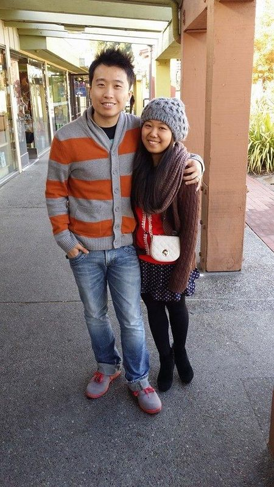

### 【新手村计划#22】\@senkicanton 一位来自广东的高中生
我们之前已经访谈过好几位高中生了，今天这位又是高中生！Steemit开始年轻化了！

问：\@senkicanton 您居住在哪里？

答：我居住在广东……是名广东土著

问：您的职业是？

答：高二生……惭愧

问：希望大家怎么称呼您？

答：千奇，或者叫senki也好！

问：什么原因让您加入Steemit？

答：其实一直有在运营公众号，然后在某位币圈大佬的文章里接触到了steemit，一开始被它的机制所吸引……去中心化，有一个自由的创作环境（不受审查），这对创作者来说是好事，而且这里有五湖四海的steemians，人都感觉挺nice的，所以我觉得加入一个社群分享自己的想法，也是十分不错的。于是赶紧注册了一个账号

问：您主要分享什么类型的内容？

答：说实话……我关注的方面很杂，因此我发布的内容无法简单描述。我喜欢涉猎，我同时也喜欢疯狂地接触新事物/新文化，而且我的思维自认还算比较活跃，作为一名INTP型，我更倾向于根据当天自己突然的想法/想分享的内容来写文章分享，可能是一些设计比较优秀的图片，也可能是分享一首歌，或者科普一些冷门的东西，再者就是自己写的小文章/小杂感之类的……我可能也会发布一些歌评/书评/服装/语言方面的东西，甚至是十分意识流的常人难以理解的思想垃圾？总之真的会有很多……我觉得在今天这个注重垂直内容的世界中，我完全是一个反垂直内容的异端者……

不过目前的话，我想做一个介绍粤语的企划。希望可以教会大家一点基本的粤语，以及粤语背后的文化底蕴，粤语其实是一门很有意思的语言。可惜，现在粤语“内交外困”，内有粤吹让国人们对粤语有不好印象，外有推普计划，让很多小朋友更侧重于讲普通话……而忽视了广府文化。所以我希望凭自己的绵薄之力，先在这里起步，为粤语正名。

问：您想什么类型的朋友关注您？

答：噢，我太喜欢和不同的人聊天了，每次和别人聊天都可以扩充我的视界，我很喜欢这么做。只要不是很高冷/无趣/不友善，无论性别年龄种族语言，我都很希望大家赏脸关注我的！

问：还记得您刚在Steemit起步时的情况吗？

答：事实上，挺痛苦的。难得写好一篇文章，在恐怖的排版系统的摧残下，战战兢兢地发布，但一个星期后，0.00赫然出现在我的视线……感觉到自己的东西，果然还是没人认可吧？会有失望的感觉。

问：您想过放弃吗？

答：有，正如我微信公众号也常因为没有曝光率，所以更新频率不高……但每次看到公众号的新增人数变成“1”，我就会整个人打鸡血一般，想着我的内容还是能吸引到同好的，就会很有动力。同样的，当我在steemit看见“0.01”时，即便是小小的变化，也会令我备受鼓舞。

问：您是怎样走出起步的困局的？

答：无视收入，把它当成我自己的个人博客来写，很自由，没有任何限制，我一直暗示自己：我只想好好表达我自己想表达的，这样一来，就可以保持每天更新的频率了。尽管我每天更新的时间只有1小时……而且更新的内容往往不多（但在小说写好之后，就会多起来了）

问： 您有什么爱好吗？

答：听歌/学语言/编程（学习中）/看不同的服装搭配/做一些小设计/滑板

问：能谈谈您的steemit ID由来吗？

答：可以，senki是我的英文名字，canton则是广东，这同时也是我某些门户网站的名字（嘘）

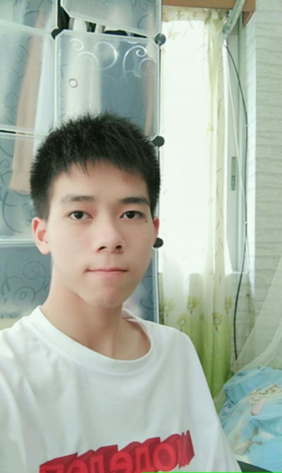

### 【新手村计划#23】\@thedreamsun66 一位来自广东的服务行业人员
接下来这位在steemit摸爬滚打一段时间后，终于找到CN区的入口了。

问：\@thedreamsun66 您居住在哪里？

答：暂住广东省.

问：您的职业是？

答：本人目前是一位服务行业人员.

问：希望大家怎么称呼您？

答：在下姓刘，各位可以叫我小刘.

问：什么原因让您加入Steemit？

答：特别喜欢和不同语种的人交流，一个特殊的机会让我知道了steemit.

问：您主要分享什么类型的内容？

答：本人喜欢写作，虽然文笔不是特别的好.但是还是很坚持.

问：您想什么类型的朋友关注您？

答：这个看情况而定，没有太多规矩.集百家之长吧.

问：还记得您刚在Steemit起步时的情况吗？

答：刚刚起步很困难，没有志同道合的人，一进网站全是英文，多少有点懵了，还好自己有翻译，多少还能操作操作.

问：您想过放弃吗？

答：这里引用网上一段经典的对话吧：放弃是不可能的，这辈子是不可能放弃的.

问：您是怎样走出起步的困局的？

答：这个是直到我搜索了很久，才知道了一个所谓的cn区，里面全部是国人，文字是一个人最基本的语言，不会，就没有交流，有了交流，有了借鉴，才逐渐起步。

问： 您有什么爱好吗？

答：喜欢旅游.喜欢品尝美食！

问：能谈谈您的steemit ID由来吗？

答：我的id是慎重考虑的！thedreamsun66梦想的太阳，我的梦想很远大，但还在为自己的梦想努力着.

自从找到CN区的入口之后，小刘 \@thedreamsun66 很积极的参加各个活动和讨论。相信如果他继续这样积极下去，他会有好的发展。

### 【新手村计划#24】\@shine.wong 一位来自上海的C#程序员
接下来这位我至今搞不清楚是男生还是女生的 \@shine.wong. 大家看完访谈可以猜一猜 :P

问：\@shine.wong 您居住在哪里？

答：上海

问：您的职业是？

答：程序员，几乎写C#吧，期间荒废了几年，还有不少需要提高的~想学python。

问：希望大家怎么称呼您？

答： 叫我Shine就可以啦~

问：什么原因让您加入Steemit？

答：查资料发现某个答复者的回复正好是我想要的，然后在帖子的最后写了句以后不混这里了，混steemit了，所以出于好奇，就google了下什么是steemit（我已经不记得这个人是谁了，反正是某C#的问题），好奇心真的蛮重要哒~🧐

问：您主要分享什么类型的内容？

答：吃货的我，碰到特别好吃的，有性价比的美食，我应该会分享下，但是我的口味不是特浓郁就是特清淡，不知道能不能找到同样口味爱好的朋友（我很能吃辣和麻至少在上海人里算是能吃的，但是又不爱甜腻的食物，目前吃清淡了也不爱很咸的）

C#或者其他我学习语言中发现或解决的小问题吧，因为有些真的很小所以也不用发GitHub啦~

也可能会有我家猫咪的照片来给你们养眼，如果它们肯配合的话。

我很少旅游，但是还是很想写近期我台湾的游记啊，但是懒癌发作，再等等吧！

我也爱健身，可能什么时候就会发健身有关的内容啦，几乎每天早上都会运动，拖延症犯了的时候可能会拖延到晚上~希望自己有一天能炫腹！

以上这些都是可能涉及到的内容，先后顺序和占比没有关系哟~具体看我心情！

问：您想什么类型的朋友关注您？

答：只要我分享的内容你有兴趣看，我都欢迎啊，但是有一点，留言提问前请确保你认真看了我的帖子，我真的不喜欢做重复的答复，特别是我帖子里有写的内容还问，我会不开森的

问： 您有什么爱好吗？

答：这个好难啊，我的爱好大部分写在分享类别里了，余下的可能就是美剧、游戏和赚钱了吧，几年前还能在激战2（Guild Wars 2）里弄公会天天晚上玩战场，大半夜还和朋友开黑LOL，现在都忙着自己的健康和提升自己的能力啦，忙完就想睡觉，我很宅，休息日真的只想窝家里看美剧，饿了么都买会员了好么，不过偶尔兴致来了，出去逛一天也是可以的~

问：能谈谈您的steemit ID由来吗？

答： 这个由来有点久远。我先说不那么久远的那部分吧，我的ID \@shine.wong，其中wong很好解释是我真名的姓；shine部分就有点久远的演变历程了，我从最早的说起吧，那个时候年少不懂事，看到flash很帅😎就想学（不是那个闪电侠，那个学不来🙈，我说的是Macromedia Flash的软件），发挥了我自学的能力，略有成果后就很白痴的在flash的中文意思里选了个“闪”作为网名，然后又演变成了Shine（因为音接近，意思也接近）。

### 【新手村计划#25】\@zilin 一位来自美丽的园林之都苏州的销售
接下来让我们欢迎这位又爱装嫩又爱卖萌的老新人 \@zilin 蔚阿姨。

问:\@zilin 您居住在哪里？

答：人们常说上有天堂，下有苏杭，我居住在美丽的园林之都----苏州

问：您的职业是？

答：我的职业：销售（电子辅助材料，如手机，IPAD，笔记本等生产过程中需要的辅助材料）

问：希望大家怎么称呼您？

答：我的steemit ID是\@zilin,大家可以叫我zilin。

我本名含有“蔚”大家叫我蔚阿姨也可以，毕竟都奔四了，o(￣)￣)o

问：什么原因让您加入Steemit？

答：和表妹 \@sunnyjolly聊天经常听她说起steemit，通过聊天发现加入steemit还能得到很多收获，

收获一，steemit中文社区有很多朋友都在国外，可以通过他们的文章读到从未看到过的风景。

收获二，里面有很多朋友都超级会画画，又因我一直对画画感兴趣，正好可以学习。

收获三，通过参加社区各个活动，可以提高写作水平，当然现在的我还不行，只会写些白话文，不会得到大佬们的认可，但我相信通过不断的学习和进步终有一天会得到大佬们的认可。

收获四，可以改掉我喜欢逛淘宝，看泡沫剧的坏毛病。

收获五，那就是最俗不可耐的啦，可以赚钱，o(￣)￣)o

问：您主要分享什么类型的内容？

答：我分享的内容主要有：

参加社区的月旦评，三个一，吐槽大会，摄影等等活动。

参加 \@angelina6688举办“齐白石杯”绘画大赛，我参加这个纯粹是学习和激励自己。喜欢一件事情就应该坚持下去，为什么说是激励，因为学画画不可能一开始就能学的很好，往往会因为自己画的不好而选择放弃，所以要时常的激励自己。不管自己画的是否会被朋友喜欢哪怕是吐槽也没关系，只要自己是进步的，都值得被鼓励。

分享美食与旅游

分享与孩子的日常

生活感悟

问：您想什么类型的朋友关注您？

答：O(￣)￣)o肯定关注我的朋友越多越好啦，

希望前辈们能关注我，多给我建议和帮忙，如果能给我点赞，是对我最大的支持和鼓励。

希望新人朋友关注我，可以一起学习，一起进步。

问：还记得您刚在Steemit起步时的情况吗？

答：刚起步的时候，写文章都几个赞，每篇文章都只有几分钱，最少的时候0.01，那会想着文章写的差没人关注，再这样写下去一点动力都没有了。后来想想现在写的差没关系，先学习好了，这就是为什么我进steemit，今天正好200天，可我的等级确只有45级，真是很惭愧。

问：您想过放弃吗？

答：说实话想过放弃，但想着这么多人都能坚持下来，为什么我不行，这个想法就被我的意志力消灭了。

问：您是怎样走出起步的困局的？

答：针对新人走出困境和能被大家认识，我觉得最好的就是多参加活动，我就是多参加活动。在这里真的要感谢 \@rivalhw, \@tvb, \@angelina6688举办的活动，让我慢慢走出困境。

每次他们的赞，能让我开心很久。

问： 您有什么爱好吗？

答：喜欢花艺，公司楼下有家鲜花批发，所以经常去光顾。

喜欢瑜伽，但是业余的，每天晚上会和小朋友一起练习。有时懒惰症犯了，小朋友会帮我把瑜伽垫铺好，硬拉着我一起练习。

还喜欢收集发夹，每当走到饰品店，我就完全走不动非要进去挑些别致的发夹收藏（我和娃两个人的）。我家小朋友头发不肯长，为此婆婆经常抱怨：“头发没几根，发夹一大堆”^_^没办法喜欢没理由。

问：能谈谈您的steemit ID由来吗？

答：其实zilin,是我家小朋友的名字，刚开始创建自己steemit ID时是 \@sunnyjolly帮我申请的，因为网限制，只能请她帮忙。

Sunnyjolly问我：“你ID用什么名字？”

我想了半天都没想到很好的名字，听sunnyjolly说这个网站文章和评论是不可以删除了，我想了想反正经常会记录小朋友的日常，日后等她长大了也可以帮忙她回忆小时候有趣的事情，就干脆用小朋友的名字。

⁄(⁄ ⁄•⁄ω⁄•⁄ ⁄)⁄是不是感觉很草率。

另外再分享一个让我开心到跳起来，抱着我家小朋友狂亲的事情，就是之前写过一篇“亲子相处模式”

https://steemit.com/cn/@zilin/3zvtcb

这篇是我从开始到现在收益最高的一篇19.39，当然大佬们看到会笑我，这点都能高兴成这样，真是有点二。但这种心情估计大佬们无法理解。

我也知道这篇不是我写的好，而是我写的主题大佬们比较喜欢，但不管怎样说明我进步了，是吧，所以说其实只要自己肯努力，终有一天写的文章会得到大家的喜爱和认可。

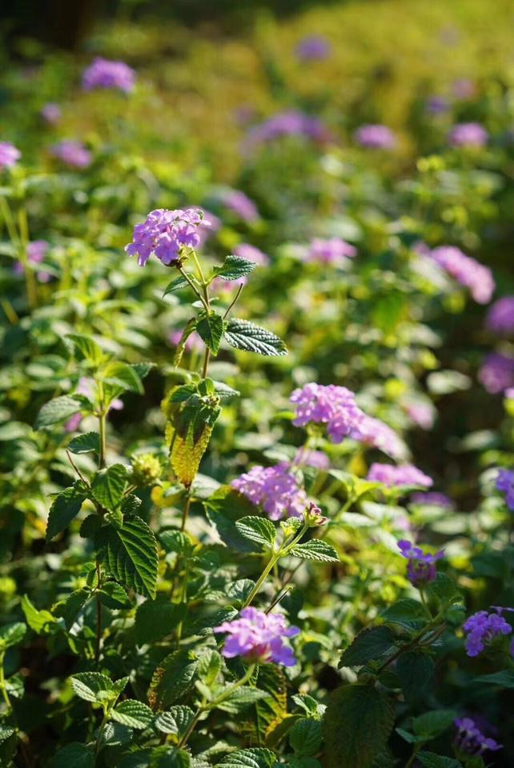

### 【新手村计划#26】\@circlepoint 一位来自浙江宁波的初中语文女教师
接下来这位是最近几天忙于搜索家里私房钱的初中语文老师 \@circlepoint 圈点。

问： \@circlepoint 您居住在哪里？

答：现居俗称的“海定则波宁”的甬城——宁波

问：您的职业是？

答：我的职业是教师（初中语文教师）顺便兼职设计师（三维、平面设计）

问：希望大家怎么称呼您？

答：因为的名字关系，我取了就近的circlepoint，大家可以叫我小C。但是因为不特殊原因真名流露后，大伙们都已经改叫我圈点、柚子老师（\@pgr）、圈圈、圆圆、圆点，甚至还有紫圆圆、红圆圆、绿圆圆等等等。

这可能是我喜欢给我家先生取好多好多外号的后果吧，我竟也有了如此居多的称呼。

不过我挺喜欢这些外号，毕竟都很好听呀。

同时谢谢大家喜欢我！

问：什么原因让您加入Steemit？

答：因为先生算是科技人员（程序员、设计师）对于币圈微微了解一些，常常吃饭间隙都会与我谈起，而我简直就是一个币圈小白。因为不想太没话题就在课间知乎了起来，逛乎间无意阅中了一篇‘区块链’、‘练字’、‘币’等字样标题的文章，讲述了steemit中发表文章可以赚钱；可以交友；可以发表自己的文章。

因为婚后开始有了个人空间，都会编写文章或是临摹一些毛笔字帖发表到‘站酷’、‘头条’等平台中。

约思考了十来秒和我先生打了一个电话让他帮我寻思下怎么注册账号。

直到拿到账号，进了村，聊了天，发了文至今约有半个月，让我感觉了了小伙伴们的热情、好助、幽默。

以至于现在我离不开steemit，很多东西都可以分享。

这就回到主题，什么原因让您加入Steemit？

因为这里有可爱的村长、村委书记、村支书和我所有可爱的村民小伙伴们！

（最最最最感谢瓜叔 \@aellly！！瓜叔帮了村里好多忙！！）

所以我加入！

问：您主要分享什么类型的内容？

答：因为成长升级我会参加三个一、月旦评、好声音、人生旅途等活动（最关键的是得奖有SBD拿，大家都来参加呀！）

主要写的内容会以毛笔、硬笔等临摹练习

然后会常常蹭一下热点，写一点自己的观点（端午节快到了，正在筹备一篇关于端午节的文章，到时候小伙伴都来捧捧场）（这里打广告应该会被打，快逃！）

最近太忙没有旅游，之后旅游了还会分享旅途上所见所闻所‘吃’！

因为看着我们老艺术家（小P）\@pgr毕业自己开了画廊。自己准备慢慢的弄一个书法廊。（不过还早还早还可以在偷懒偷懒）

之后准备把国画拾起来，能拿出手来了，也会发出来，大家期待呦（可能会因为我的懒惰没了下文）

问：您想什么类型的朋友关注您？

答：当然是希望好多好多朋友来关注我呀，（贪心了）。

问： 您有什么爱好吗？

答：爱好好多好多呢，

吃

吃

吃

写字

画画（都是泪）

读书

旅行

吃

吃

吃

问：能谈谈您的steemit ID由来吗？

答：是谈ID的名字么？Circle Point？

说来也很尴尬，因为上文说到过我在‘站酷’一类的平台发表所以和我先生想了好多个礼拜的名字。

什么“圈点文艺录”、“圈点文艺志”、“笔芯”等等等等，（我这个语文老师当到头了）然后因为注册账号必须用英文，就取了圈点两字的英文圈（Circle）点（Point）

\@circlepoint 圈点写的字

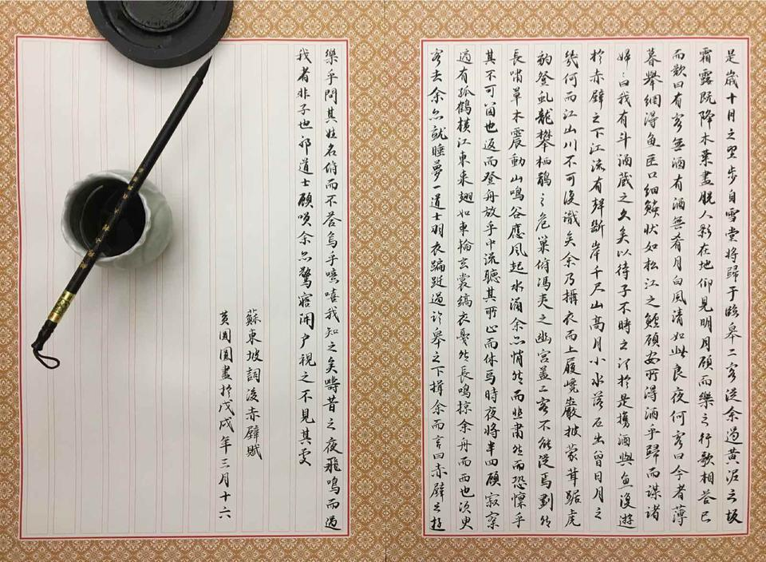

### 【新手村计划#27】\@lifelikeline 一位来自深圳爱好写作的外贸员
接下来这位写了很多让人发人深省文章的板凳作家 \@lifelikeline

问： \@lifelikeline 您居住在哪里？

答：-目前居住于中国深圳

问：您的职业是？

答：外贸员，亚马逊专员，开过公司创过业，后来失败告终，有机会跟大家聊下创业失败的心得和经验，互相指教

问：希望大家怎么称呼您？

答：金樽上、板凳作家、Robert.哈哈哈

问：什么原因让您加入Steemit？

答：最大的原因就是写作，以前曾经尝试写小说，几篇短篇，长篇的写到一半又断了。乐趣吧，倾向于精神追求，一笔一纸就心满意足，能将所思所想一同跟大家分享实在是我的荣幸。

问：您主要分享什么类型的内容？

答：单纯写作，偶尔吐吐槽，或者旅游心得什么的。没有技术类的文章哦，我都比较偏向心理学，哲学这一类的作品。当然 了，喜欢看电影（教父是心中的No.1），所以有的时候可能也会写些看电影的心得或者偶尔吐槽下。

问：您想什么类型的朋友关注您？

答：哈哈，喜欢交朋友，目前在steemit上也结识了不少人了。至于类型嘛，都还好吧，能聊得来的就行。

问： 您有什么爱好吗？

答：写诗词文章，看电影，骑车旅行，吃。

问：能谈谈您的steemit ID由来吗？

答：通过Gmail注册，之前QQ注册数次没有结果，Gmail注册很快就下来了。

说下自己对进入steemit这段时间以来的看法，刚知道steemit的时候就兴致勃勃，前后注册花了半个多月的时间。注册下来以后，逐步了解机制，确实又有些低落，后来积极参加些新手活动之后，得到了不少人的关注，目前信心倍长，看好，加油大家。

### 【新手村计划#28】\@sevenusdchain 一位来自地狱的使者
给我起个搞笑的绰号，我最喜欢的、被赞最多的有奖金。

接下来这位是来自地狱的 \@sevenusdchain。

问： \@sevenusdchain 您居住在哪里？

答：地狱。说真话会激怒满嘴谎言的掌权者，愿匿踪，请见谅。

问：您的职业是？

答：职业厌倦中。目前很多时间专注于加密数字货币领域，我准备发币，纪念币，暂无上市计划。

问：希望大家怎么称呼您？

答：我期待看到本文的网友送我一个一听到就会笑出声的绰号昵称。我回送sbd。我选一个我最爱的送1sbd，被赞最多的送0.5sbd，欢迎点赞并在本帖评论参与（现在只有这么多sbd，嘻嘻）。

问：什么原因让您加入Steemit？

答：炒币发现的，调查币种时进Steemit看了一看，我操一篇渣文能挣几百美元，立马就来了，现已知非易事，被steem的魔力吸引并与它坠入爱河且聪明又有趣的人比我的头发还多，和你们一起聊聊天也是极有意思的。

问：您主要分享什么类型的内容？

答：画、真话、有益有趣的内容。

问：您想什么类型的朋友关注您？

答：人类，只要你愿意，一个赤裸的鬼魂灵魂期待着相爱相杀。。

问： 您有什么爱好吗？

答：美人、自由、好汉、啪啪啪；上网、画画、唱歌、扭屁丫。

问：能谈谈您的steemit ID由来吗？

答：鸡块链和嘻块链的7块链，是我的微信公众号（泡steem，好多天没更新，嘿嘿），活生生被我翻译成seven usd chain，净值增长了6.3倍。

sevenusdchain弄了翻墙教程合辑，人工筛选推荐新/好帖子的日抱，英汉对照版steemit常见问题解答，一些画。

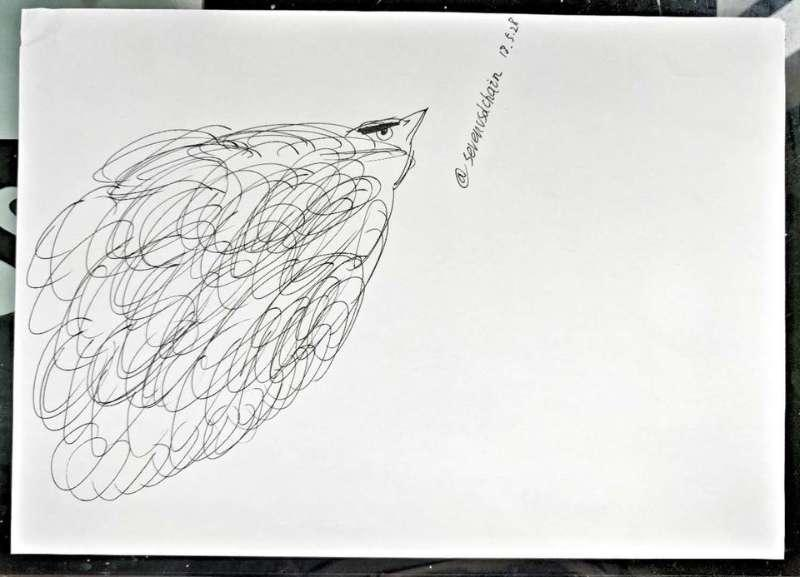

### 【新手村计划#29】\@xiaoliu 一位来自苏州的美女程序员
接下来这位是cn区少有的女程序员。

问： \@xiaoliu 您居住在哪里？

答：苏州

问：您的职业是？

答：程序员

问：希望大家怎么称呼您？

答：六子，感觉听上去很亲切，会减少距离感。

问：什么原因让您加入Steemit？

答：是steemit的小伙伴曾蔚小姐姐介绍知道这个平台的存在，觉得既可以挣点钱还可以写写东西，感觉很好。真的加入了steemit之后，觉得自己获得的更多，多个国家、多种语言、多个职业，都让我的见识有了很大的扩展，也更加对未知的领域有了更多的兴趣。

问：您主要分享什么类型的内容？

答：非常想写推文，因为看过很多小说，但是怕自己写不出来它的好。

现在可能会想起什么写什么。

还有可能写自己做的梦，因为我做梦从来都是天方夜谭一般，不过这个情况近两年有点变化。

问：您想什么类型的朋友关注您？

答：希望很多爱好旅游的人关注，因为想刺激自己多出去看看这个世界的美好。本人程序员，所以有程序员的通病，就是宅。

问： 您有什么爱好吗？

答：写毛笔字，但是写的不好；爬山，也很久没去爬了；看小说，这可能是最大的爱好了，从初中到现在。

问：能谈谈您的steemit ID由来吗？

答：Steemit ID是\@xiaoliu，是因为在家里这一辈排行老六，是不是很羡慕。

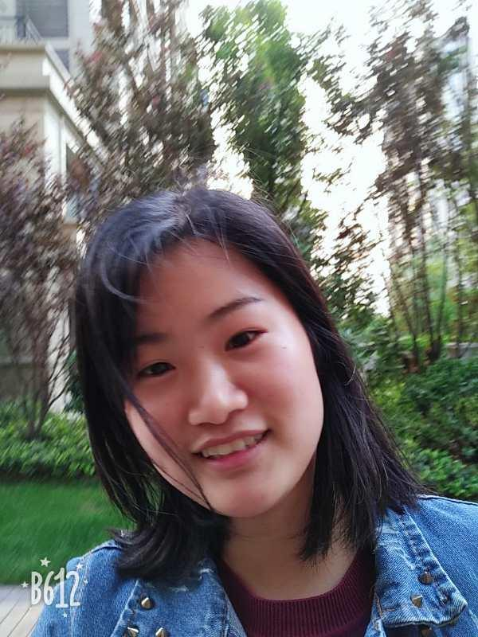

### 【新手村计划#30】\@julian2013 一位来自上海的电子研发工程师
接下来这位是致力于对抗人类的机器人 \@julian2013 小机机。

问： \@julian2013 您居住在哪里？

答：上海，新疆回沪知青子女，从上大学开始在上海，之前都在新疆

问：您的职业是？

答：电子研发工程师，刚好发了一个自我介绍的帖子，大家有兴趣可以看看

https://steemit.com/introduceyourself/@julian2013/2wgncc

还有十真一假也可以看看

https://steemit.com/cn-activity/@julian2013/6xghpb

里面除了我不是上海人是假的，其它都是真的。

问：希望大家怎么称呼您？

答：机器人杀手（是机器人的杀手，专杀机器人的那种）

实在不行那就随你们便啊！摊手o(︶︿︶)o唉

问：什么原因让您加入Steemit？

答：区块链相对比较陌生，是在了解区块链的过程中发现了steemit。因为自己比较喜欢写点小感想，有做个微信公众号“吻火者说”，觉得steemit也是个非常好的平台，所以就投入进来啦。

进来以后发现不少人是冲着挣钱来的，我倒是真没有。主要原因是这点钱也解决不了问题啊

问：您主要分享什么类型的内容？

答：主要是分享一下对生活的感悟，偶尔写点开脑洞的搞笑文字，和有缘人交个朋友。

我总觉得我现在经历的，疑惑的，思考的，应该和大部分人都一样。有些人已经解惑，有些人还在思考。这样一来，彼此之间应该都能相互学习学习了。

问：您想什么类型的朋友关注您？

答：什么朋友都行啊，三人行必有我师。平时喜欢思考人生的话题可能就更多啦！

最想和艺术，宗教相关的偏唯心的人交流，因为自己这方面很欠缺。如果是从唯物转变成唯心的那就更加完美了，有这种经历应该最懂我，目测软哥 \@softmetal 和村长 \@ericet有这个嫌疑。老实艺术家 \@pgr我也很崇拜，但往往跟不上他的节奏，苦闷~

问： 您有什么爱好吗？

答：原来的爱好是加班，写个程序，做个小玩意啥的，现在最大的爱好就是带娃啦，思考怎样教育孩子挺有意思的。

另外就是写点小东西，这样可以聚集志同道合的朋友一起聊聊。

其它都挺杂的，偶尔弹弹琴，雕个东西啥的。

这两年爱看一些哲学书。

问：能谈谈您的steemit ID由来吗？

答：julian是我儿子的英文名，2013出生的。julian注册时被占用了，就有了这么一个类似于终结者更新版的id。

儿子是我的希望么，区块链是未来的希望，都是希望~

问：还记得您刚在Steemit起步时的情况吗？

答：两眼一抹黑，看谁都是大神。说到底还是要感谢 \@kingwriting，她把我从大街上捡到一个群里，然后才有机会到凉亭来见到你们这些妖魔鬼怪啊。

问您想过放弃吗？

答：这倒没有。确切地说是村里人让我真正开始泡这个社区的，如果没有凉亭的话，我大概就是和我的公众号同步post吧，不会比较活跃。

问：您是怎样走出起步的困局的？

答：就是和村里人一起鬼混啊！村长你 \@ericet还有Michael \@honoru都给过我很多指点，非常感谢你们。

但是说真的，不能再这样鬼混了，得有个度，好歹我也是个有点小追求的读书人，这段时间读书真的是荒废了，这样不行。三日不知油墨味，空虚寂寞冷冷清清凄凄惨惨切切。

不阅读不思考，文章写不出来，就又只能工作了，这绝对不行。

小机机 \@julian2013 绝对能称的上是写霸，写的帖子无论是字数还是质量都是cn区少有的。

希望大家关注 \@julian2013，虽然他有点自恋，但是还是一个不错的人 :P

小机机 \@julian2013 本人照片：

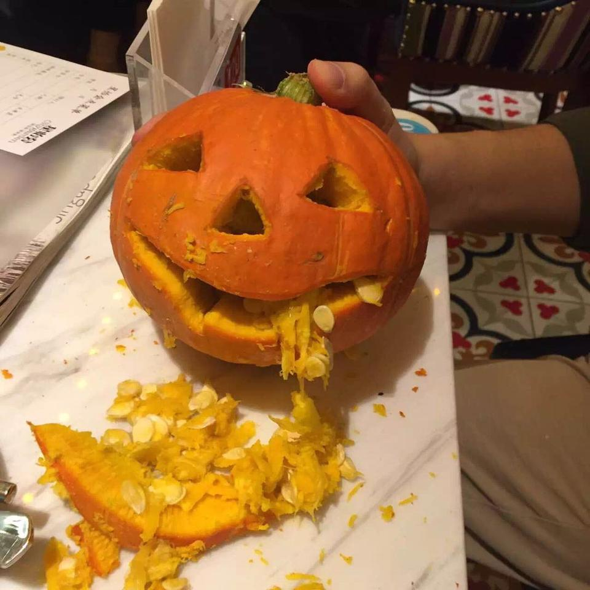

### 【新手村计划#31】\@wuxing 一位来自南京的美女会计师

接下来这位是来自南京的美女 星星 \@wuxing，她靠着盛世美颜在steemit上快速的成长着。

问： \@wuxing 您居住在哪里？

答：我居住在江苏南京，地地道道的南京女孩，从小学到大学都没离开过的地方，一口标准的南京话，非常喜欢我在的这座城市，古老而又不失现代化。欢迎社区的小伙伴来南京玩呢，希望南京的美食和历史文化不会让大家失望，当然男性朋友不要错过南京哦，南京出美女的！

问：您的职业是？

答：我的工作么 我在南京的一家建筑公司做会计 上班的地方离家还挺远的 也想着跳槽出去闯闯 但很可惜一直没能实现。我的工作么 我在南京的一家建筑公司做会计 上班的地方离家还挺远的 也想着跳槽出去闯闯 但很可惜一直没能实现。

问：希望大家怎么称呼您？

答：我希望大家称呼自己为星星就好啦 上学的时候同学都那么称呼我的。

问：什么原因让您加入Steemit？

答：是属于那种糊里糊涂就进来steemit了吧，也是朋友推荐的!确实是非常好奇写文章也能赚钱，好不容易翻墙上网才注册的账号，过了几天才下来的呢！刚开始就觉得上面全是外国人呢，英语不好的我也很担心怎么写文章，后来才知道原来国内也有好多小哥哥小姐姐在玩，在这么一个平台能和他们互动确实比较开心。

问：您想什么类型的朋友关注您？

答：我希望性格开朗懂得生活的小哥哥小姐姐们关注我呢~

问： 您有什么爱好吗？

答：特别喜欢摄影 打算入手一台单反 还有我喜欢旅游 只是上班以后没什么时间出去了 想去泰国 日本 !

问：能谈谈您的steemit ID由来吗？

答：就是我自己的名字拼音啊~。

星星\@wuxing 自拍：

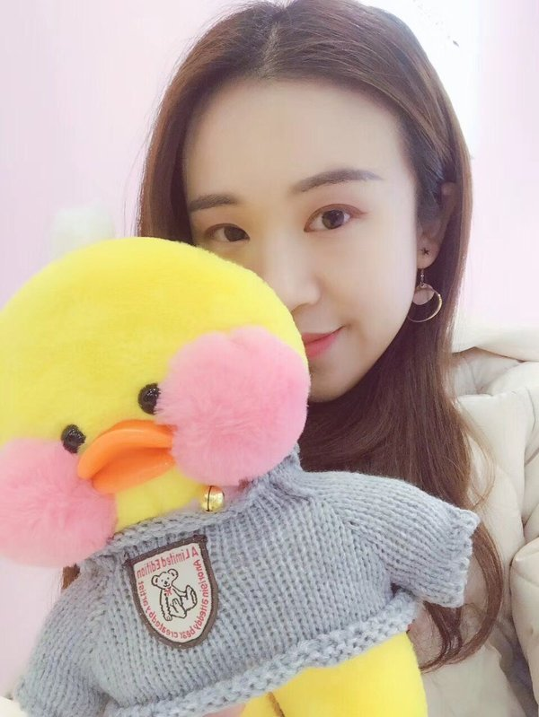

### 【新手村计划#32】\@ishenyaya 一位来自厦门的办公室女职员

接下来这位是爱读书的小曲 \@ishenyaya

问： \@ishenyaya 您居住在哪里？

答：福建厦门，距离台湾最近的

问：您的职业是？

答：目前在公司负责文案，之后打算做自由职业

问：希望大家怎么称呼您？

答：可以叫我小曲，小曲是小人物的狂想曲简称，我平时爱幻想，哈哈

问：什么原因让您加入Steemit？

答：朋友介绍的，觉得Steemit很自由，还可以和不同生活背景的人一起交流，发现很多有趣的事情

问：您主要分享什么类别的内容？

答： 主要是分享一些与读书有关的文章，平时喜欢阅读各类不同的书籍，然后也会把读书的感受记录下来，偶尔也会分享一些自己的生活感悟。

问：您想什么类型的朋友关注您？

答：当然最希望的是各路大神啦，当然，如果不是大神我也欢迎，我觉得不同人身上都有闪光点。

问： 您有什么爱好吗？

答：画画、听故事、瑜伽、最近开始喜欢上了手机摄影，想把自己拍的美美的，哈哈

问：能谈谈您的steemit ID由来吗？

答：ishenyaya，ishen是一个好朋友的英文名，yaya是我小名的拼音，合在一起证明我们一直都是好闺蜜。

小曲\@ishenyaya 随笔画：

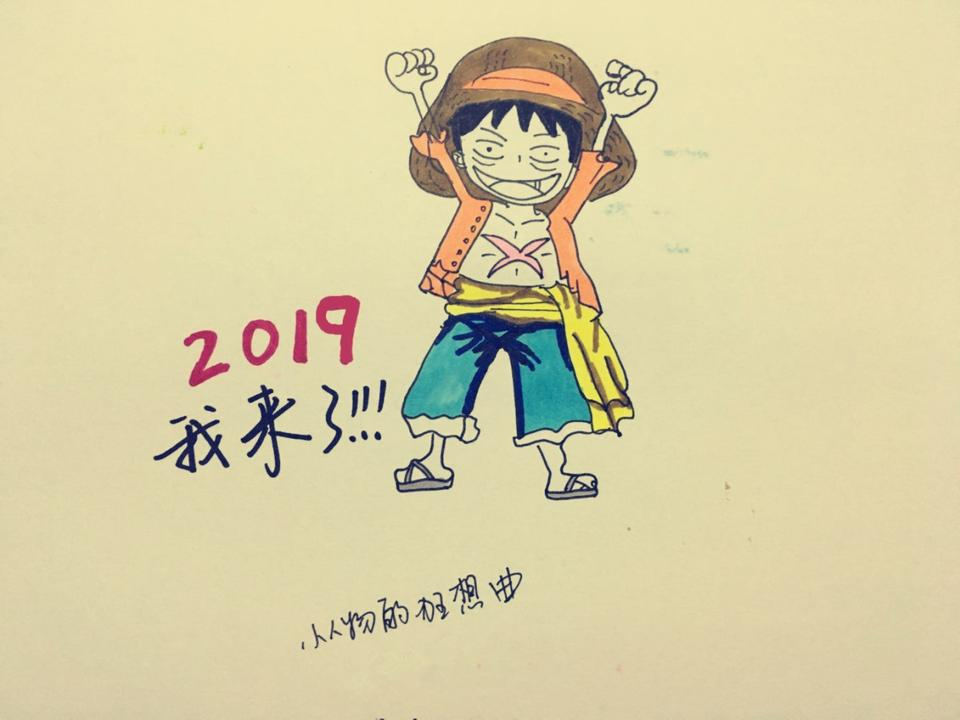

### 【新手村计划#33】\@hansheng 一位来自黑龙江很有阅历的私营业主

接下来这位是有很多阅历的鸭仔 \@hansheng.

问： \@hansheng 您居住在哪里？

答：我是来自中国 黑龙江 省牡丹江 年过30白羊座老男人一枚。

问：您的职业是？

答：我的职业是针织厂私营小业主一枚 ，由于规模小 所以也兼职厂里 设计师 工艺师 制版师 机修师 激光复课师。

问：希望大家怎么称呼您？

答：怎么称呼都好，毕竟名字只是一个代号而已。（经过新手村村民投票，叫他鸭仔）

问：什么原因让您加入Steemit？

答：因为平时喜欢看看文章，最近看到几篇这里发出的文章 所以就来到了这里，并且发现这里的规则真的很有想法 所以决定留了下来看看。

问：您主要分享什么类别的内容？

答： 我平时打算给大家分享一些我的不成熟小看法 ，与一些浅薄的见闻。总之重在分享 重在参与。

问：您想什么类型的朋友关注您？

答：我希望和朝气向上 有想法与见地 的人成为很好的朋友。

问： 您有什么爱好吗？

答：由于我是个闲不下来的人，所以爱好很多比如 射箭 木工 电焊 激光雕刻 手工皮具 双截棍什么的 偶尔也会打打沙袋，总之是个闲不下来的人，有时候我媳妇都怀疑我有多动症。

问：能谈谈您的steemit ID由来吗？

答：ID的由来 很简单我名字的缩写

还记得您刚在Steemit起步时的情况吗？

答：记得 ，注册账号就非常费劲。然后注册完毕，进来之后两眼一摸黑 啥也不懂，之后就耐心的读完了教程 ，教程对我帮助很大，还有新手村的诸位前辈。

您想过放弃吗？

答：没想过，我能说 我把这里当成了一个业余养成休闲游戏了么。哈哈哈

您是怎样走出起步的困局的？

答：哪里有困局，多教教朋友。多去互动 自然就会好走很多，心态放的稳就好了

鸭仔 \@hansheng 是一个很有故事的人，因为经历过大风大雨，所以遇事有一种处事不惊的态度。欢迎大家关注鸭仔 \@hansheng并了解他的故事。

\@hansheng 自拍：

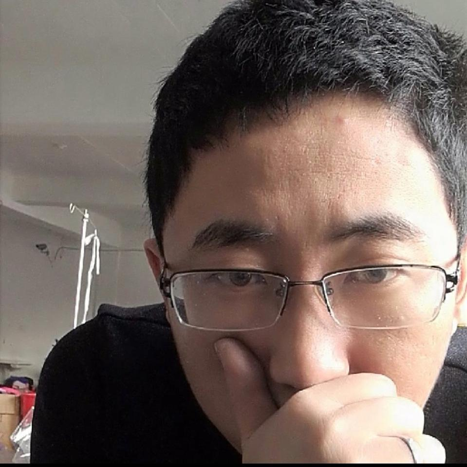

### 【新手村计划#34】\@abcallen 一位来自云南曲靖有颜有才的歌手

大家好，我很高兴能接受这次采访，这是我莫大的荣幸啊！

问： \@abcallen 您居住在哪里？

答：大家一定很好奇我来自哪里，你们的这种好奇让我感到骄傲和自豪！我呢，来自一个东方国家中国。在这个伟大国度里有一个美丽的省份“云南”，它被大家亲切的称为“动植物王国”，这个称号可不是吹的哦，在我的家乡，那真的是植被茂密，各种各样的动物和谐共生于这个王国里。在云南，意味着“云的最南端，彩云之南”。在我的故乡，民族多样性也是很明显的，比如汉族，苗族，独龙族，佤族等等名族，所以也呈现了一个语言多样性，希望这个美丽的国度也吸引了你！

问：您的职业是？

答：说到我的职业，我现在的职业其实很简单，但是又让很多人羡慕，我是一名原创歌手，同时也是吉他老师，声乐老师，统称为“老师”。还有呢，我也是一名自由职业者，其他的职业我混的还可以。那我为什么会是自由职业呢？原因是我觉得我们应该自己做点事，而不是只知道打工，被称为一个上班族，每个月拿着死工资，过着只见物价上涨了，工资却不上涨的生活。当然，我不是歧视上班族，而是我希望我们的财务可以自由化，所以我选择自由职业！

问：希望大家怎么称呼您？

答：我叫Allen，中文是艾伦。当然，我很希望大家可以称呼我为Allen，这是我的英文名，简单 ，方便，好记，最重要的一点是，这个称呼很有亲切感！

问：什么原因让您加入Steemit？

答：对于为啥加入steemit，什么让我加入steemit，这真的是一个非常有趣的问题！我加入steemit，更多的是为了结交更多的朋友，学习更多的东西，没办法啊，谁让steemit是一个国际化的社交平台呢，steemit就是真的具有吸引力，在这里，你总是能够得到你所想要的，steemit是区块链平台，这是一个新领域的平台，steemit就是这么神奇，让你想了解他，加入他，想必你也和我一样是这样的加入steemit的！

问：您主要分享什么类别的内容？

答： 在steemit，大家都会发布自己的文章，当然也包括我自己，在steemit，有些各种各样的文章，大部分文章都是作者呕心沥血的产物，我自己比较喜欢创作发布一些和艺术有关的文章，比如音乐的，摄影的，美食的，当然，作为一名老师，我还发过一些和教学有关的帖子，我认为在steemit应该互帮互助，虽然在这个平台我们可以获得收入，但是我们不能只考虑自己，steemit，是一个大家庭，你只有学会融入，维护这个大家庭，你的steemit之路才能一帆风顺的走下去！

问：您想什么类型的朋友关注您？

答：刚开始来steemit，对于初来乍到的我就像是一个懵懂的小孩，啥都不知道，我发现，一开始没发几篇文章就会有很多人关注我，大概我是新人吧，虽然现在也是新人，但是我希望关注我的朋友，是热爱生活，热情友好的。我不求关注我的人一定得喜欢音乐，我只希望我们可以和谐相处，互帮互助，一起来维持好我们的社交，一起交流，一起学习，一起笑:-D，这个才是最重要的！

问： 您有什么爱好吗？

答：说到爱好，那么我的爱好就是排长队等待点名啦！我的爱好有这些，音乐，烹饪，摄影摄像，登山，旅行，武术，绘画，交友，帮助他人，因为我比较热爱生活，所以爱好有点多，这么多爱好，我的小皮箱都快塞满了。接下来得换个大点的皮箱了，爱好会越来越多的！

问：能谈谈您的steemit ID由来吗？

答：对于steemit的id，这可是一个人在steemit的明信片啊，对于我的id这个很有意义，在未加入steemit这个大家庭时，我一直很希望能够有一些国外的朋友，然后我就给自己起了个英文名叫做Allen，中文是阿伦，后来呢我真的有了一些国外的朋友，Allen这个名字也被他们记住了，后来我来到了steemit，我知道这是个国际化的社交平台，肯定也能交到很多国外的朋友，所以我再次用到了我的英文名作为我的steemit id，不过前面加了个abc，所以我的id就成了abcallen，虽然我不想加abc的，但是注册steemit账号时Allen这个名字与别人的id相同了，用不了，只好加上abc了，小伙伴们，我的id很有意思吧！

还记得您刚在Steemit起步时的情况吗？

答：说到我刚来steemit的情况，其实我还是比较幸运了，刚开始的第一篇自我介绍的文章，就有很多人来给我点赞，而且获得了收入，虽然不多，但是我已经很满意了，我到现在在steemit两个来月，新人的信誉刚开始都是25，而我才第一个月就升到了40以上，我感觉自己真的很幸运，感觉就像是幸运女神在对我眷顾一样，虽然有时候再创作文章时偶尔出现一种“江郎才尽”的现象，但是这并不能让我停止创作，艺术来源于生活，生活还在，创作不息！

我觉得steemit是一个很有潜力的平台，不说在这里我可以挣到多少收入，虽然经济基础决定上层建筑，但是最好的一点是在这里我们真的可以交到很多朋友，学到很多东西，所以我会一直支持steemit，并且维护好我的账户的，不会放弃steemit的！

您是怎样走出起步的困局的？

答：对于刚起步的我，说真的有好多东西都是不懂，但是我刚来时就说过不懂就要问，就要学，所以在不懂的地方，我冒着会被踩死的风险给很多文章创作的好的steemit用户留言，虽然有时候不会回复我，但是也有热心的朋友为我做了解答，渐渐的，我的文章越来越好的，朋友也越来越多了，看样子问与学习是一把金钥匙啊，这是打开友情，成功大门的金钥匙！

感谢，真的很感谢今天的采访，这真是我的荣幸！

Allen \@abcallen又有才华又有颜值，更要命的是还是非常努力的男孩！因为生活，他比任何人都要努力。希望大家可以关注Allen！

Allen因为对新手村的热爱，还特意为新手村写了一首主题曲【动起来】。大家可以听听。

steemit_cn新手村村歌-原创歌曲《动起来》，为咋们村加油！: https://steemit.com/cn/@abcallen/steemitcn-steemitcn-novice-village-song-original-song-move-up-for-our-village

\@abcallen 自拍：

### 【新手村计划#35】\@robin.han 一位来自青岛的自动化工程师

接下来这位是来自青岛，为了了解区块链技术而加入steemit 的Robin  \@robin.han

问： \@robin.han 您居住在哪里？

答：目前居住在中国青岛，估计不久的将来的会搬到潍坊市去。

问：您的职业是？

答：现在的职业是一枚自动化工程师。曾经经历过三种行业。

问：希望大家怎么称呼您？

答：大家还是称呼我为小伙伴吧，或者叫我robin也行。

问：什么原因让您加入Steemit？

答：其实是在不经意间了解到steemit这个社区的。我主要是为公司搜集区块链相关的战略信息，偶然读到妙笔生金相关的介绍文章，一方面为自己可以发文章赚钱而窃喜；一方面为里面的精致的经济系统设计而着迷，就一心加入进来。还有就是通过这个社区，可以让我对区块链有更深的了解。

问：您主要分享什么类别的内容？

答： 刚刚来呢，前期主要是收集一些区块链相关的基础知识，数据，一点点随笔；后续会陆续展开一些社会时评，邀请一些写作者开专栏了，且行且看吧，但肯定会慢慢形成几大类别的。

问：您想什么类型的朋友关注您？

答：我来自山东。我们喜欢五湖四海的朋友，志同道合的的朋友。就我而言，谈的来，就可以了。能收获几个挚友，那是幸运了。呵呵。

问： 您有什么爱好吗？

答：主要是喜欢读书，上网；喜欢看动漫，电影。下班后，也常常去快走，偶尔会去爬山。

问：能谈谈您的steemit ID由来吗？
答：这个ID的由来很简单。在公司里面英文名就是robin，注册的时候顺手就用了，当时菜鸟一个啊，没有好好去想名字。

Robin \@robinhan 是个有趣的人，几乎每天会爬新手村的微信群，然后给大家总结每天新手村的村民在瞎扯些什么。希望大家关注一下这个有趣的人 \@robin.han.

\@robin.han 自拍：

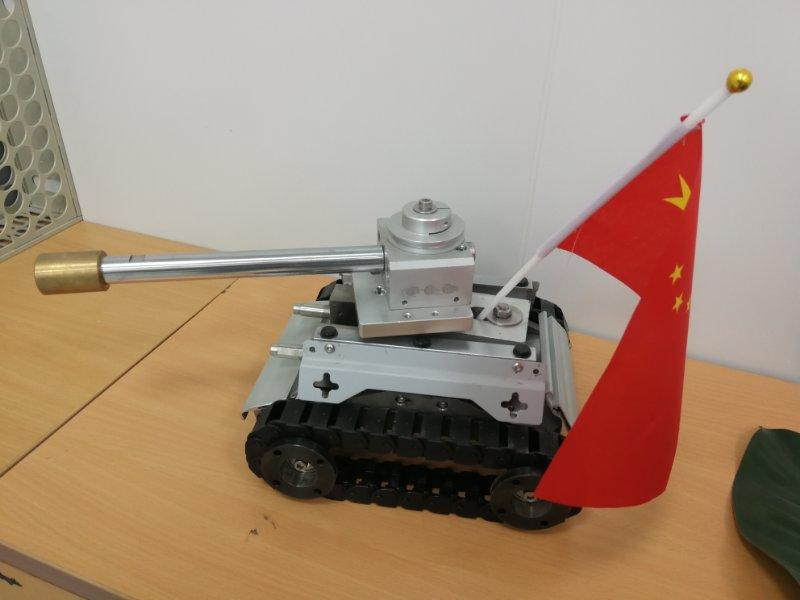

### 【新手村计划#36】\@changxiu 一位来自天津的美女公务员

接下来这位是来自天津爱读书的北北 \@changxiu

问： \@changxiu 您居住在哪里？

答：土生土长的天津人（我会承认自己离开天津的时长不超过一礼拜么）。长期生活在这个叫做静海的小县城，致力于为家乡的79万人口提供公共卫生服务~

问：您的职业是？

答：公务员。从事卫生行政工作，目前在疾控科，主要负责精神卫生服务、传染病防控、慢性病防控等。临床专业出身，干起公卫专业的活儿了.

问：希望大家怎么称呼您？

答：北北~身边玩儿的好的小伙伴们都这么叫我，自带亲切感

问：什么原因让您加入Steemit？

答：\@weisheng167388 金兽大哥的推荐啊！我知道前边至少有两位是金兽大哥带动进来的了，维参和叶不言，都是读书群的书友。

在爱读书爱分享的公号平台上发过几回帖子，挣了些收益，发现日常打卡还能变现。鉴于大哥忙于开发自己的新事业去了，不好意思老添麻烦，干脆自己申了账号加入~很荣幸的得到了新手村的帮助，不胜感激

问：您主要分享什么类别的内容？

答： 以读后感为主，兴趣比较单一。之余参杂着贴一些生活小感悟、养娃儿小快慰啥的，期待在交流中互有增益。

问：您想什么类型的朋友关注您？

答：多多益善。能相互听得懂，不偏激的掐架的就好

问： 您有什么爱好吗？

答：兴趣单一，爱读书，小说为主。今年主要围绕诺贝尔文学奖作品，调剂着鼓励自己看些社科方面的书籍，增加一些知识储备。

爱聊大天儿，喜欢正儿八经的交流，然而实际上并没有找到合适的小团体能够真诚的说道说道自己的生活，好像日常生活不值得一聊似的……

问：能谈谈您的steemit ID由来吗？

答：长修是我儿儿的名字。之前注册的自己名字的账号因为不晓得密码的重要性就辣么浪费了……

会不会很无趣…

其实正经人吐槽起来也不含糊的

期待您的关注～～～

\@changxiu 照片：

### 【新手村计划#37】\@maggieliew1704 一位来自马来西亚吉隆坡的美女商业分析员

经过大家不懈的努力，曾经的男性交友新手村，终于男女比例协调了，越来越多的美女加入了新手村。

接下来这位是来自马来西亚的美女 Maggie \@maggieliew1704。

问： \@maggieliew1704 您居住在哪里？

答：我居住在马来西亚吉隆坡，一个有着繁忙交通的城市，也是马来西亚的首都，有许多来自不同州的游子包括我自己在这城市为了生活而努力奋斗中。

问：您的职业是？

答：在一间IT公司担任Business Analyst 商业分析员，有机会参与不同的计划。

问：希望大家怎么称呼您？

答：大家可以称呼我为Maggie或者华语名美琪也可以。马来西亚有一款快熟面也叫Maggi（少了一个E哦）

问：什么原因让您加入Steemit？

答：朋友介绍我加入Steemit这个大家庭的。有一天，朋友说起他有写文章的习惯，同时间也能赚些钱。听了他的故事后，觉得挺不错的，可以和别人分享的同时也能赚钱，有谁会不心动呢？

问：您主要分享什么类别的内容？

答： 我主要分享食物、生活类别的内容，因为我喜欢到处去走走逛逛和吃吃，是一名标准的吃货哦

问：您想什么类型的朋友关注您？

答：什么类型的朋友关注都可以，没有特定的类型，欢迎大家来关注我哦！

问： 您有什么爱好吗？

答：爱好是看戏，烹饪，做手工艺品

问：能谈谈您的steemit ID由来吗？

答：我的steemit ID是我的名字和我的生日日期组合的哦

### 【新手村计划#38】\@artsymelanie 一位现居大理从心出发的大长腿美女客栈合伙人

接下来这位据说拥有2米长大白腿，用心体验生活的 \@artsymelanie 美丽。

问： \@artsymelanie 您居住在哪里？

答：目前暂居大理。

问：您的职业是？

答：客栈合伙人。现有两家店。

我不是很喜欢做客栈，但是经常会被他们拉回来。后来我跟我弟弟协商后达成一致，我们的后半生应该去做各自喜欢的事情，于是他跟随内心去做了潜水教练，我考到潜水长以后，发现我的性格不大适合做教学。于是潜水就从可行性的职业转变为业余爱好。我现在的模式就是喜欢做什么就做什么。

客栈现在基本由合伙人打理。

问：希望大家怎么称呼您？

答：村里的地主恶霸们 热心村民们已经给我起了很多~~外号~~ 爱称。每周换一波，还能不重样。厉害吧！你们喜欢就好。我在风中各种凌乱。

问：什么原因让您加入Steemit？

答：朋友是区块链专家，跟我科普过区块链的知识。

在另一个灵修的板块，我对区块链有了另外一个层面的了解。唯物主义的可以飘过。

区块链，是一个你看不见的意识之战，是两个正在发生的平行交叠时空的战争。做个类比：

如果把区块链比为天使一方：

	即代表为—原创，灵魂，分享，量子，独特性及相互尊重等

如果把传统商业模式及集体意识比为魔鬼一方：

	即代表为—抄袭，单一，无能量，刺激消费欲望，独裁，垄断，商业化，过度包装

现今的商业集团，多是想如何从别人那里获取更多的能量，想如何垄断市场，过度消耗及刺激贪婪欲望产生匮乏与恐惧。

区块链是给那些原创性，独特性，有灵魂的人，智慧财产需要被保护的对象。同时区块链还有更多还未被发现的隐藏的核心价值。

在另外一个平行时空，每个人都可以做自己，勇敢真实快乐的表达自己，没有人可以被取代，永远丰盛，不匮乏。

目前的计算机没有办法计算能量，未来会演化出量子计算机，量子设备，还有最终的自由能源设备。

简单的说区块链与传统商业模式的战争是一场天使与魔鬼的战争。天使跟魔鬼一直在打仗，并不一定每次都是天使赢，但是不管从哪个层面，我相信到最后，未来一定是留给有创造力，有热情，有理想，爱这个世界的人。

所以，我支持区块链也愿意积极尝试区块链的相关应用。

问：您主要分享什么类别的内容？

答： 艺术，佛学，灵修

问：您想什么类型的朋友关注您？

答：同频的会自动跟我相连，不同频的想连也连不上，会自动屏蔽跟过滤。其实整个宇宙都是能量和频率的振动。你的频率到什么程度，你就和那一层的频率相印相合。从而感知那一层的真理，你就能够理解那一层次了。

我需要做的只是要不断努力提升自身频率跟高频相连。保持与高我和谐一致的振频下，成为完整的自己，然后我就可以去帮助别人了。

问： 您有什么爱好吗？

答：其实我本人不喜欢话多，按照我的表达习惯就是一句话表诉完毕。

村长 \@ericet表示…不接受…

村霸 \@softmetal，官大一级压死人，你忍一忍……

当初进这个村，以为抱到了大腿，找到了鲸鱼爹，现如今只能45度角望天，哎，浮游生物就算了，还能升级打怪兽，忍一忍又是什么鬼？忍者神龟么？

漫漫人生路，总要错几步。

来吧，端杯热茶听我诉衷肠 鬼扯淡……

人在地球上轮回转世，经历了很多世，不管你是一直在地球轮回的还是来自于外太空的个体，都会带有许多记忆碎片，就像大拼图里面的一个个小拼图。

整个太阳系就是一个道场。我们所经历的痛苦，磨难，生离死别都是在磨练我们的心性。宇宙是个实相。实相只是意识的投射，当你体验这个实相时，你关注自己，限制自己，然后忘记自己，这样可以从全新的视角，来体验“重新回忆起你自己”，完成你的记忆拼图，做完整的自己。

我的爱好比如画画，潜水，打坐，佛学，灵修等这些都只是在遵循内在兴奋的指引，当你做的事情是在遵循最高兴奋指引的时候，尽自己最大的努力去行动，全力以赴，不执着，不期待于某种特定的结果。这样就可以与真我的频率相连，你的心，就能为喜悦而活。所有的同步性事件就会开始发生。也就是奇迹的发生。

这个有点象在地球上体验实相，如何体验，如何让你的人生大戏更完整，更有趣，更自由。当了解这些之后，才慢慢觉得人生开始有点意思了。

问：能谈谈您的steemit ID由来吗？

答：我的两个号\@melaniewang \@artsymelanie

一个是我的英文名melanie，一个是想分享的类别art。一个写小文章，一个画画。

欢迎大家关注，分享及点赞。

如果对我分享的内容有兴趣或者疑问，欢迎留言。

谢谢村长\@ericet给这个专访机会。愿大家在村里玩的开心。愿各位此生都能找到真实与完整的自我。谢谢！

从美丽 \@artsymelanie 的交流中，可以看出她是一个从心出发，尊重内心感受的人。 她从另外一个层面解析了区块链和传统商业模式，也是让我对区块链有了新的认识。希望大家可以关注这位美丽知性的  \@artsymelanie。

\@artsymelanie 美丽真人照：

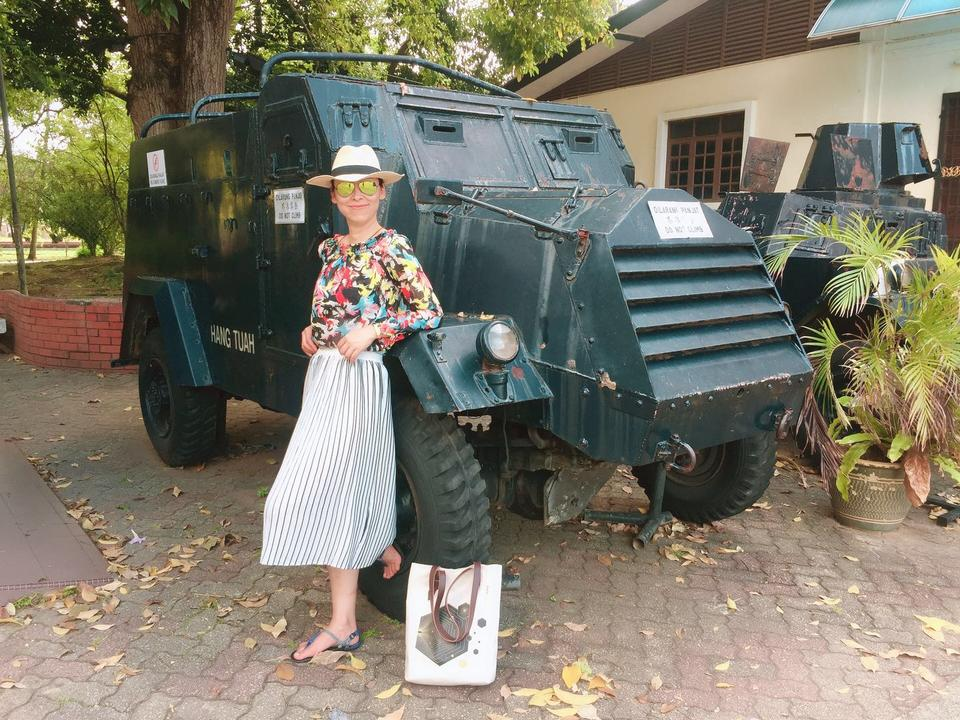

### 【新手村计划#39】\@gerer 一位来自江苏的工程项目经理

接下来这位是个很疼爱女儿的  \@gerer 晨歌

问： \@gerer 您居住在哪里？

答：河南新乡，原籍江苏徐州。

问：您的职业是？

答：工程项目经理，建筑和机电专业建造师，主项为：装饰、幕墙。

问：希望大家怎么称呼您？

答：gerer,可以叫我：晨歌。

问：什么原因让您加入Steemit？

答：可以自由开放写作，直抒胸臆，当然肯定不会触碰网站约定及公序良俗。

问：您主要分享什么类别的内容？

答： Steem、sports、life、travel、news、blockchain

问：您想什么类型的朋友关注您？

答：希望所有的朋友都来关注我，多多益善，有点贪心啊，能够互相尊重、互相理解就好！

问： 您有什么爱好吗？

答：足球、旅游、唱K、健身，写作是儿时的一个梦想。

问：能谈谈您的steemit ID由来吗？

答：我女儿名字谐音，稍加改动，她是我的宝贝。

问：还记得您刚在Steemit起步时的情况吗？

答：走了弯路，4月份加入steemit,到五月份通过关注才加入cn区，加入steemit微信好友群和新手村，特别感谢，回家的感觉真好！

问：想过放弃吗？

答：我从事过广告和工程的销售，经验告诉我：坚持不一定胜利，不坚持只有放弃，对认可的东西要多点耐心和执著，一切都会好起来。

问：您是怎样走出起步的困局的？

答：感谢cn、新手村及steemit上所有朋友的关心鼓励，要特别感谢\@justty \@tvb \@ericet \@honoru \@kingwriting 给予的大力帮助，更多的参与活动，加强互动（因工作较忙，这方面做得不太好）

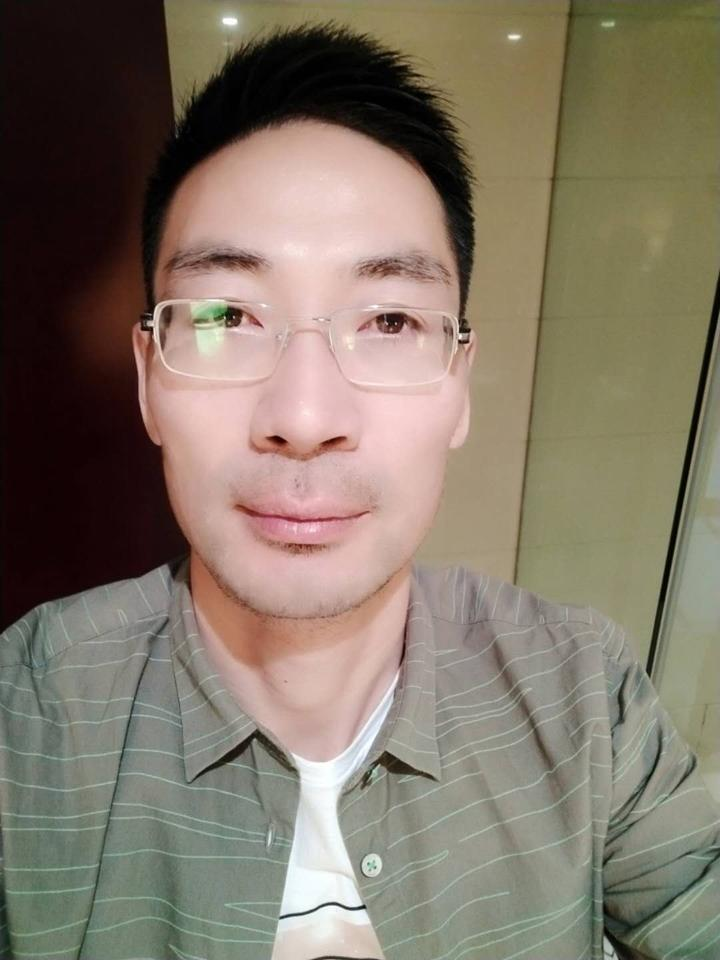

### 【新手村计划#40】 \@richestjackma 一位现居香港的自媒体

接下来这位有个霸气的steemit id：\@richestjackma(最富马云）。

问： \@richestjackma 您居住在哪里？

答：目前在香港，希望明年和以后能到丽江去定居。去丽江旅游过一圈，风景、蓝天白云、空气、人，都太美好。

问：您的职业是？

答：自媒体吧（其实也就是个写公众号（大咖岛）的，拥有上万个投资人和企业家铁粉，行业有一定的影响力）

另外也做做投资。（其实也就是炒币）

问：希望大家怎么称呼您？

答：有很多人动不动就叫我老师老师，其实我不喜欢这个称呼，觉得人人平等，相互学习，叫我阿伍就好。

问：什么原因让您加入Steemit？

答：自从做自媒体开始，我就思考着怎么才能在美国开设自媒体栏目，赚美元，东搜一下，西搜一下，搜到了土木坛子的软文，便入了这个坑。

问：您主要分享什么类别的内容？

答： 一些日常的想法。有的关于商业，也有关于读书和电影的。

问：您想什么类型的朋友关注您？

答：多多益善。如果这个问题是，“你不想什么类型的朋友关注你？”，我会这么回答：我不希望满口脏话的喷子关注我，天天和这些人对骂，不仅拉低了身位，还显得自己很没格局。

问： 您有什么爱好吗？

答：爱好美食、美酒、美人、看电影、玩吃鸡。

另外我还假装喜欢读书、旅游、运动。总之，都是比较正能量的爱好。

问：能谈谈您的steemit ID由来吗？

答：我的ID名是：richestjackma。翻译过来应该是首富马云，主要是出于对马云的崇拜吧。

问：还记得您刚在Steemit起步时的情况吗？

答：当然记得，一开始兴致冲冲。结果一篇文章发布出去，一没人看，二没人点赞，三没有收入（哦，说错了，有几分钱收入），那种感觉有点痛苦。

问：您想过放弃吗？

答：何止想过，曾经有一段时间直接放弃这个平台了。

问：您是怎样走出起步的困局的？

答：后来总群里面一个人跟我说，让我把文章写好后，链接丢到群里让大家点赞。我试了一下，效果果然比以前好，所以感觉还可以抢救一段时间。以后就当作是一个兴趣交友平台吧，我感觉想通过这个平台致富，还是不太现实。

### 【新手村计划#41】 \@sunai 一位现居大理做茶生意的商人

接下来这位是现居大理的小懒猫 \@sunai， 喵喵喵～

问： \@sunai 您居住在哪里？

答：暂时居住在云南大理。

大理是个好地方。天蓝云白，慢生活。古朴的民风，又有着美丽的传说。“上关花、下关风、苍山雪、洱海月”是大理最著名的四大景观，合起来就是“风花雪月”。很美！

问：您的职业是？

答： 一个机缘巧合做了茶生意。也开始对茶有了一些了解。是茶让我本浮躁的心慢慢变得平稳了。正如人常说：茶如人生。无人时泡上一壶茶，看上几页喜欢的书，偶尔吹一埙曲，即使心中有千千结，也慢慢释然了。

问：希望大家怎么称呼您？

答：法尘凉生(但私下朋友们又叫我小懒猫。因为我贪睡。虽然睡眠是抵御数字资本主义的天然屏障，可我又拼命的想醒着。因为生命短暂，真不想太多的时间去睡眠。可是我有一具不容我反抗的脆弱肉身要休息，而且“周公”总是约我去喝茶，无奈呀！

问：什么原因让您加入Steemit？

答：通过区块链。五月份Steem上线火币网，百度了一下，看到\@yellowbird写的《Steemit注册详细教程》一文，被吸引了。

问：您主要分享什么类别的内容？

答： 一些生活感悟。我的一些碎碎念。有时有一些佛法类（因为我信仰佛教）。

问：您想什么类型的朋友关注您？

答： 各类朋友都可以。因为来自地球村各个领域的朋友会带来更多我未知的东西，让我有机会了解、学习。开阔视野。而且能够与各类朋友相识，也是成就一份善缘。很开心。

问： 您有什么爱好吗？

答： 读书，旅游。喜欢佛经（因为佛是大觉者，大医王。我们要学习佛的大智慧）。另外非常喜欢埙，只是吹的一般般啦。

问：能谈谈您的steemit ID由来吗？

答： 看了\@yellowbird的文章之后就注册了。可却等待了漫长的7天通过了。心中非常欢喜。

问：还记得您刚在Steemit起步时的情况吗？

答：可以说刚起步时有点儿找不到门，呵呵。有些着急。

问：您想过放弃吗？

答：从没想过要放弃。Steemit这个平台非常好！我喜欢这个氛围。这里聚集太多优秀的人。值得我学习。尽管我文笔不怎样，但我会努力，一直走下去。

问：您是怎样走出起步的困局的？

答：这得感谢我们新手村凉亭微信群的村长\@ericet。在QQ群与他相遇，是他把我带到新手村凉亭。新手村里的朋友们非常热情，尽管我时常要爬上千层的楼（因为有时太忙，不能在村里），但我学会了太多东西，让我一步步了解Steemit。在此感谢\@yellowbird、\@ericet和新手村凉亭、聚贤阁、及Steemit中国社区所有的朋友们！

感恩大家！

### 【新手村计划#42】 \@slientstorm 一位现居珠海的软件开发工程师

接下来这位是一位爱画画的程序员阿杰 \@slientstorm。

问： \@slientstorm 您居住在哪里？

答：我现在居住在中国珠海，中国南方的一个滨海城市，和澳门、中山是邻居，与香港深圳隔海相望。珠海有着“浪漫之城”、“百岛之市”的称号，同时也多 次被评为“中国最宜居城市”。最重要的是，这里也是我出生成长的地方，是唯一可以称为“家”的城市，在珠海生活我感到满满的幸福感。

问：您的职业是？

答：我是一名软件开发工程师，涉足过多个方面，曾经做过后端开发，目前的主职是iOS开发，业余时间会做一些手机游戏开发。

问：希望大家怎么称呼您？

答：大家可以叫我Jack，或者阿杰都行。

问：什么原因让您加入Steemit？

答：由于比特币的热度，我从去年开始就加入了炒币大军，也是最近炒币的过程中了解到Steem币，便对其背后的Steemit社交平台产生了浓厚的兴趣。说实在的 ，最主要的就是被它发帖能赚钱的概念吸引到了，于是就加入了Steemit，哈哈！其次就是想了解一个社交平台是如何在区块链技术下运作起来的，看能不能为 以后做区块链相关的一些尝试时提供一些灵感。

问：您主要分享什么类别的内容？

答： 我可能会分享的内容主要围绕着我三个方面的爱好，首先是美食相关的，自己做的或者在外面吃的。还有就是我自己画的一些画，我自己比较喜欢画画，但 由于平时比较忙，经常拖稿拖很久才完成，导致产量不是很高，希望在Steemit这里大家能督促我多画些画，也希望能提高自己的水平。第三就是会分享一些游 戏的心得，有时候玩游戏会有一些奇思妙想，到时可以给大家分享一下。

问：您想什么类型的朋友关注您？

答：我希望有共同兴趣爱好的朋友来关注我，或者是有趣的，对生活充满热情的朋友！

问： 您有什么爱好吗？

答：游戏、画画、美食、电影、动漫、射箭，都是些体力运动量不大的，比较适合我这种宅男，还有其他爱好正在发掘中。

问：能谈谈您的steemit ID由来吗？

答：我的ID是\@slientstorm，这个ID我用了很久了，那是出自一款游戏的名字，叫“寂静风暴（Silent Storm）”，风暴给人的感觉是吞噬一切的破坏力，而寂 静则像是暴风雨来临前的宁静，给人一种不知道什么时候爆发的感觉，个人很喜欢。那时候注册博客时发现silentstorm这个ID已经被别人注册了，所以就把第 二、三个字母“il”改成“li”，同时因为“Li”是我的姓，所以感觉这样改也挺贴切的，便一直沿用至今。顺便再给大家说一个典故，以前皇帝的玉玺上面的 刻字都是会故意写错的，其目的是为了防伪。所以，认准\@slientstorm，这就是我。

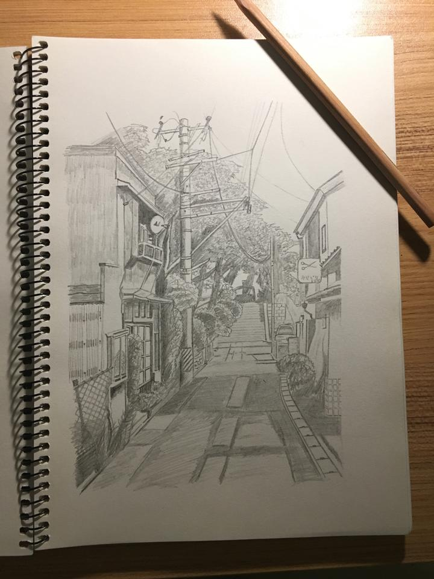

### 【新手村计划#43】 \@odillegogh 一位现居泰国来自青岛的自媒体人

接下来这位是现居泰国，很有个性的自媒体人 \@odillegogh.

问： \@odillegogh 您居住在哪里？

大家好，我是\odillegogh，来自山东青岛，目前居住在泰国。

问：您想人们怎样称呼您？

答：叫我Odille就好啦。

问：您的职业是？

答：刚刚毕业，想做职业自媒体人。

问：什么原因让您加入Steemit？

答：应该是他人介绍加好奇吧，而且我感觉我这个人戏比较多，再加特别会吃喝玩乐，想在不同的媒体上拓展粉丝群体吧。

问：您主要分享什么类别的内容？

美食，美景，美人儿，摄影，绘画，时尚，文学，观点。既然是自媒体，这些东西自然是围绕着我个人来，想向大家分享我的生活吧。

问：您想什么类型的朋友关注您？

什么类型都挺好的呀。

问：您有什么爱好吗？

我爱这个世界上一切的美好。

问：能谈谈您的steemit ID由来吗？

Odille来源于俄罗斯著名芭蕾舞剧《天鹅湖》里面的一个角色。是做出著名二十四转，魅惑众生魔鬼Lothbart的女儿，黑天鹅Odille。Gogh的话是我的姓氏——高，用这个拼写是因为特别喜欢梵高大佬的色感，就非常崇敬地用了他姓氏的拼写。

从Odille制作的视频和写的文章中可以看出她是一个很有个性的女生。希望大概关注一下这位有个性的女生 \@odillegogh.

### 【新手村计划#44】 \@edwardchan 一位现居广州的游戏业人士

问： \@edwardchan 您居住在哪里？您想人们怎样称呼您？

大家好，我是Edward，目前居住在广东广州。

问：您的职业是？

这个问题一直觉得很难准确回答，游戏公司的特色渠道运营工作者，属于client work，也承担部分营运工作，不完全是游戏内容运营。

问：什么原因让您加入Steemit？

因为区块链的火爆，和相识多年的 \@honoru 从探讨互联网行业趋势，到最后他带着我一起探索区块链的世界，感受时代的进步。

问：您想什么类型的朋友关注您？

希望能结识更多朋友，类型尽量广泛，科技，美食、运动、旅行、文化推广，搞怪，当然也欢迎不同领域地域的歪果仁。

问：您有什么爱好吗？

美食的、运动的、旅游的、文化习俗的探究，与外国友人交流，算是特殊爱好。

问：能谈谈您的steemit ID由来吗？

我的steemit ID源自我的英文名Edward Chan，也是希望来自世界各地的人们都能记得住的一个名字，毕竟大部分老外是记不住汉语的。

问：还记得您刚在Steemit起步时的情况吗？

尤其记得第一篇帖子，一开始并没意识到Steemit是blog形式，任性地使用国内的科普贴模式，几番调整后终于有blog感觉了，开熏！村长和村民非常欢迎新人，不吝赞赏，在凉亭内也热心为新人解答疑问。

问：想过放弃吗？

答案是肯定的，作为非互联网原住民，我只经历过一小段时间的博客时代，后来很快就出现微博、Facebook等轻量化产品，从那以后的博客的概念就是140字、配图片、 \@人等。我应该连轻度用户都不太算得上，所以不擅长搜集写作材料，也因文章关注度少，感受不到写作乐趣。

问：您是怎样走出起步的困局的？

一切仍是 \@honoru 引导，教我如何更好地体验blog的乐趣。后来我也为自己设下目标，从steemit上多了解结识朋友，在这里我不需要是专家，但Steemit时刻告诉我，我是有生活、有记录的人。

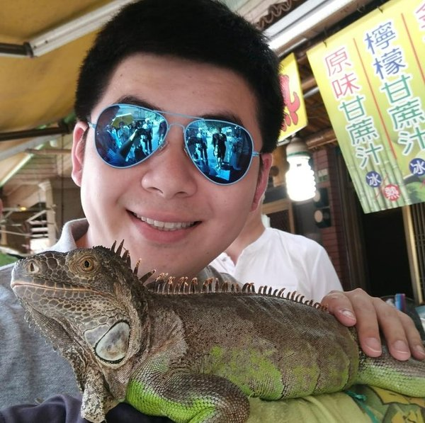

### 【新手村计划#45】 \@victorleung 一位现居香港的篮球小子

问： \@victorleung 您居住在哪里？您想人们怎样称呼您？

大家好，我是Victor，现居住于香港。

问：您的职业是？

我是一间货运代理公司的高级主任，我在这行业很多年了，除了这份工作我也积极寻找其他有兴趣的兼职。

问：什么原因让您加入Steemit？

是我的妹妹推介我加入STEEMIT的，她说我可以在STEEMIT介绍一下自己喜欢的东西，好像篮球，足球，打电动等，我想她一定是觉得我很宅男吧😅😅😅

问：您想什么类型的朋友关注您？

其实交朋友都没有想过什么类型，志趣相投当然就最好，能谈谈共同的爱好，就好像  \@wilhb81 那样，我很喜欢和他讨论足球。

问：您有什么爱好吗？

篮球，看足球，打电动，最近因为买了一个三轴防震杆，所以也多了外出拍片。

问：能谈谈您的steemit ID由来吗？

我的STEEMIT ID就是我爸给我的名字和姓氏啊。

问：还记得您刚在Steemit起步时的情况吗？

哈哈，我刚开始的时候真的不知如何入手的，什么DLIVE， BUSY也不懂，第一个帖子也搞不好呀

问：想过放弃吗？

老实说，刚开始时真的想过放弃，因为真的不知怎样才能投入其中，最后因为妹妹一轮说教才能继续下去。

问：您是怎样走出起步的困局的？

刚刚也提及是因为妹妹的唠叨才能继续，但其实是我开始明白放轻松点去玩，不用强迫自己要好像其他人一样，慢慢地就投入起来， 当然也要感谢新手村的各人，还有 \@wilhb81 ， \@aaronli ， \@honoru 等人的帮忙，

### 【新手村计划#46】 \@cryptocurrencyhk来自香港的反洗黑钱调查员

问：\@cryptocurrencyhk您居住在哪里 ? 希望大家怎样称呼您?

我是一位土生土长的香港人，因在管理区块链粉丝页习惯了被读者叫「小编」，各位称呼我「小编」便可。

 

问：您的职业是 ?

小编是在银行业任职反洗黑钱的调查员，职责主要是审查有可疑的户口及撰写调查的报告，现时的副识是在社交平台上向大众分享自己对于加密货币的认知及知识。

 

问：什么原因让您加入Steemit?

其实加入Steemit前，小编主要是使用社交平台Facebook作分享。但是，在去年的某一天，刚好在Youtube上，看到了一位Youtuber分享了自身使用Steemit的经历和介绍，当时的我，万万想不到，使用了区块链技术的内容平台，添加了加密货币作为激励的原素，竟然可以用于激励创作者，在发布的文章中的同时赚取收入。因此，为了可以帮补自己少少的生计，以及多一个管道让大家认识自己，所以在去年的九月小编便加入了Steemit。

 

问：您想什么类似的朋友关注您 ?

其实，我自己并没有指定哪一个类型，因为除了加密货币外，我自己本身兴趣亦有很多，好像电动游戏、足球或是桌球等等，只要大家志趣相投，小编什么都可以聊，当然，如果您是加密货币的爱好者，非常欢迎您前来关注一下我。

 

问：您有什么爱好 ?

其实我本身挺爱做运动，之前我经常去踢足球，打篮球及健身，不过自从接触加密货币后，因需要经营专页的关系，便减少了很多运动的时间。不过，我的爱好依然会有球类活动的存在，而加密货币算是我的新爱好吧。

 

问：能谈谈您的 Steemit ID 由来吗 ?

我的Steemit ID是Cryptocurrencyhk，取名来自于自己的Facebook专页，名字是指一个来自香港的加密货币信息站，当然，不只是香港，小编希望是可以帮助到整个中文小区的读者。

 

问：还记得您刚在Steemit 起步时的情况吗 ?

刚开始的时候，并未有太多人知识Steemit，关于Steemit的教学大多都是来自国外，中文小区的人也十分少，所以一开始入手时，都要靠自己摸索一段时间，才可以完成自己的第一篇文章发布。现在我还记得第一次看到文章有奖励的时候，心情是十分兴奋。

 

问：想过放弃吗 ?

当然有，如果您知道小编的账户是从去年9月登记，直到现在，还是小鱼级别，您便知道小编放弃了Steemit已经好一段时间。原因在于当时并没有深入了解Steemit的规则及模式，在Steemit分享的文章，并没有什么反应，所以就放弃了这个平台。

 

问：您是怎样走出起步的困局的 ?

在Steemit，我觉得最近才算是自己的真正起步，步出这个困局的主因，主要是因为加入了新手村，多得村里各位好朋友的帮助，小编才开始得到更多人的关注，让自己更有动力在Steemit重新出发，更用心去写文章，再一次感谢村中的弟兄姊妹。最后，小编希望将来会有更多Steemit的新手加入到新手村里，让中文小区一步一步地壮大，而小编当然也希望，未来有机会可以为村子贡献自己的力量。

### 【新手村计划#47】 \@sherry.gong 一位现居泰国清迈的宿舍女老师

接下来这位是现居泰国清迈的美女老师

问：\@sherry.gong您居住在哪里 ? 

目前我居住在泰国清迈已经有差不多四个年头。我的祖籍在四川省巴中市（离成都三个小时车程）。

问：希望大家怎样称呼您?

叫我sherry就好，当然如果是前辈可以叫我小巩。

问：您的职业是 ?

我在清迈一所国际学校当宿舍老师，平常也有做一些翻译和私教的工作。

 

问：什么原因让您加入Steemit?

两个月以前有一位客户让我帮他翻译几页关于加密货币的文章，我虽然准时完成任务但也着实花了不少时间。

因为第一次接触加密货币，里面的专业术语实在是太多搞得我一头雾水。后面跟客户聊到这个问题，是他推荐给我steemit，说这个网站上有很多关于此类话题的文章，我可以多看看，当然如果我喜欢写东西这也是个好去处。

这便是我加入steemit的原因。

问：您主要分享什么类别的内容？

我主要倾向于发表一些关于生活，心理学以及美食方面的文章，不过很遗憾作品还不多。更多的时候我是在看别人写的，虚心学习，才能进步。

问：您想什么类似的朋友关注您 ?

不管什么类型的朋友关注我都是令人开心的。如果一定要我列举一二，我非常想认识一些心理学家，艺术家以及爱好旅游热爱生活的人。
 

问：您有什么爱好 ?

我的爱好听起来像是陈词滥调：做瑜伽，看书，骑单车还有学英语。不过这些的确是我的爱好哈哈。
 

问：能谈谈您的 Steemit ID 由来吗 ?

这个太简单了，sherry.gong：sherry是我的英文名，gong（巩）是我的姓，简单易记。

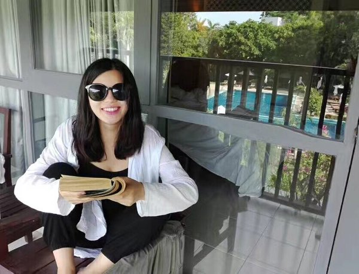

### 【新手村计划#48】 \@andrewwayne 一位来自浙江嘉兴的准高中生

这位是有趣的准高中生 \@andrewwayne 小黑/撸仔/未成年

问： \@andrewwayne您居住在哪里 ? 

我现在居住在一个的小城市浙江嘉兴（国内随便哪里都有我们的五芳斋粽子我超级佩服，而且粽子要吃咸口才好吃！

问：希望大家怎样称呼您?

希望大家能称呼我小黑，或者……随便你们吧

问：您的职业是 ?

我现在是一个高中生了，由于学业压力特别大，要努力当(huo)学(xia)霸(qu)所以steemit投入精力可能不会非常多。

问：什么原因让您加入Steemit?

当然是因为好友bts的热(sheng)情(la)邀(ying)请(zhuai)，并且我也对Steemit这个平台十分感兴趣，虽然我也不求赚钱，就是想接触一下，其实就是来当志愿韭菜的。

插一句，我刚注册的时候是4月份因为真人验证批的特别慢好像隔了快一个月，然后又因为翻不出墙收不到密码所以账号真正开始用都将近7月了。

问：您主要分享什么类别的内容？

主要会分享个一些生活中看到的趣事(比如我弟的惊人言论)啊，美食啊，好风景啊，Dlive上可能会学Allen哥发个弹吉他的视频什么的。

（但我唱歌真的很差（但我弟(5岁)唱歌很好，可能会发他唱歌

问：您想什么类似的朋友关注您 ?

不管是什么类型的朋友，只要是来交朋友的，当然都欢迎啦。

问：您有什么爱好 ?

我最大的爱好应该是计算机编程，但现在为了参加算法竞赛拿加分，这变成我的课业内容了

，我还挺喜欢弹吉他，做菜（炸锅系列，黑暗系传人），骑自行车也是大爱的。

问：能谈谈您的 Steemit ID 由来吗 ?

我的steemit ID是andrewwayne，其中andrew是我原本的英文名，是我7年级时候的英语老师让我给自己取个名字然后自己上网搜"流行英文名"第一个就是andrew（我也没觉得哪里流行啊，wayne是我给自己加的姓，蝙蝠侠是我最喜欢的一个超级英雄，Bruce Wayne的家族名Wayne，给自己也取姓为Wayne也是希望自己能努力做到Wayne一样成功

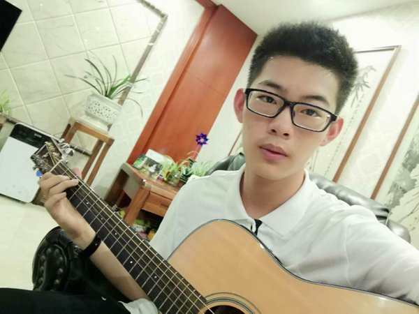

### 【新手村计划#49】 \@haidaming 一位来自深圳的摄影师

问： \@haidaming 您居住在哪里 ? 

深圳

问：希望大家怎样称呼您?

haidaming

问：您的职业是 ?

摄影师

问：什么原因让您加入Steemit?

自己平时会写点东西，也发东西，steemit 使自己写的东西有价值，还有就是能认识些写文的朋友，也接触到新的平台。

问：您主要分享什么类别的内容？

摄影为主，文章也写，主要摄影作品也是工作之余给朋友拍的，或者自己拍的一些片子，文章写些感想啊，心得啊，有事也会写小诗，当然都是要继续学习才行~

问：您想什么类似的朋友关注您 ?

这个嘛没多大关系，喜欢摄影，喜欢美图，喜欢文章或者其它专长的呀，总之热情的你都欢迎,五湖四海能认识的都是朋友啦。

问：您有什么爱好 ?

摄影啊，徒步，画画，周末休息的话就会出去拍照，或者去看画展，双休呢就会选择跟户外的朋友去徒步~

问：能谈谈您的 Steemit ID 由来吗 ?

我自己的微信公众号啊，秒拍啊都叫嗨大明~所以就沿用到steemit 里了

问：还记得您刚在Steemit起步时的情况吗？

刚申请的时候从自己微信公众分享了两篇文章过来但是没朋友点赞，也没人看，然后就断了一两个月没发文章，后面很意外的遇到了一些朋友，拉我进了微信群，然后又开始发了些文章，能继续在steemit 呆着还是蛮感谢这朋友 \@wwstreet 。后面呢有遇见了很多玩steemit的朋友，现在呢有进到了新手村，认识了村长啊，还有 \@julian2013， \@kingwriting等等朋友。真是万分的荣幸~谢谢你们，我的朋友

问：您想过放弃吗？

有想过啊，刚开始的时候，什么朋友也不认识，也没人看，打击大

问：您是怎样走出起步的困局的？

在群里跟朋友一起玩，有人聊天说话也就不孤单了，有人陪着很重要。我这个人怕孤单，感觉不到有朋友的存在自己也会越来越懒。

其实现在也不能说自己走出了困局吧，自己一直想做视频内容自媒体，但是呢自己一个人没多大的动力。我认为自己的惰性还是很强，还希望有朋友鼓励与支持，更愿意点我的缺点咯~

最后欢迎大家来点评我拍的相片，然后你可以说我拍的不好啊，或者给我更好的指导。当然也欢迎你们约我拍照，约我吃喝玩乐，啊哈哈，我也是个小吃货，对吃的不抗拒

### 【新手村计划#50】 \@cairou 一位来自广州的美女英语产品编辑专员

第50个新人访谈了～

这位美女因为steemit id 叫cairou，所以大家叫她cairou包子 :D

问：\@cairou您居住在哪里 ?

大家好啊，我是\@cairou，是一枚刚毕业的应届生呢，正在广州奋斗，故而居住在广州啦嘻嘻。

问：希望大家怎样称呼您?

Cairou ---->彩柔，可以叫我本名啦，但村长给我取了“包子”这个小名哈哈哈，也是蛮可爱，蛮有意思的。

问：您的职业是 ?

刚毕业嘛，从文案&平面设计实习，现在的英语产品编辑专员，一直都在接触电商行业呢，也不知道电商还能热门多久呢。

问：什么原因让您加入Steemit?

怎么说呢，这大概是一种契机吧，\@lemooljiang 老师想开个小工作室，在招募人才，同学超级有兴趣，同时也想拉上我作伴，于是，我便开启了我的steemit世界的大门。但一直没啥才华，也面临着毕业、就业实习的压力，暂时没在区块链找到属于自己的一片天地。

问：您主要分享什么类别的内容？

我嘛，主要还是分享自己的生活吧嘻嘻，分享自己拍的照片，晒晒美食，写写影剧观后感，遇到小猫小汪也喜欢去分享他们的可爱。世界之大，能分享的东西还是应有尽有的嘛~

问：您想什么类似的朋友关注您 ?

嘻嘻，这就看缘分啦，志同道合的人总会相互吸引的嘛，期待每一次和你们的相遇啦。

问：您有什么爱好 ?

爱好呀，爱吃，爱拍照，爱看电影算吗嘻嘻嘻

问：能谈谈您的 Steemit ID 由来吗 ?

这ID呀，是厚着脸皮让\@lemooljiang老师帮忙申请的呢（在此还得感谢老师呢），连名字都是本名凑合的直接用的，没点个性哈哈哈。

问：还记得您刚在Steemit起步时的情况吗？

当然记得，那是期末备考期间，坐在图书馆，默默地敲出了第一篇steemit文章——我的自我介绍，当时，虽然也没很多人点赞，但那一点点的变化，就足以让自己开心了不久呢。

问：您想过放弃吗？

有吧，实习工作是单休的，学的专业又是设计方面的，毕业设计需要设计出作品，还要制出模型，于我而言，还是超级耗费精力的，就是不会好好分配自己的休息时间，也就没有好好顾及管理steemit了呢。

问：您是怎样走出起步的困局的？

我算是时间上的分配而产生了困扰吧，真正毕业了嘛，从此真正成为社会人了呢，工作也换了，喜欢分享生活，也想分享生活啊，于是，便想起并回归到了steemit了呢。希望我也能在这交到一群志同道合的小伙伴呀！

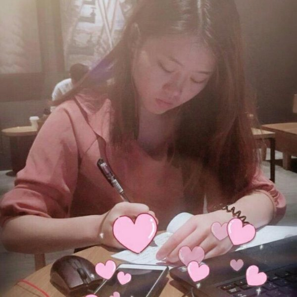

### 【新手村计划#51】 \@minloulou 一位来自香港的全职投资人

问： \@minloulou 您居住在哪里？

「香港」我最喜爱的城市。

问：您的职业是？

主要工作是投资，大部份投资产品( 股票，衍生产品，加密货币等都有)都有认识及操作，副业是在证券行业从事客户服务。其实我都分不清楚职业的概念是什么。

问：什么原因让您加入Steemit？

是投资的兴趣，首先是在香港讨论区「连登」看到有人推荐其中一个赚加密货币的方法，便是在STEEMIT发展，所以喜欢尝试的我就来到Steemit了。如果要说「真正的加入」是最近的时期，可能是币市不景气关系，自己炒币也没有赚到很多及很顺风，所以就来逛逛Steemit，然后不知不觉就上瘾了。

问：您想什么类型的朋友关注您？

我想认识对投资有兴趣的朋友/Steemitian，或者是喜欢研究科技及区块链的朋友。另外是吃货、爱咖啡，运动，饮酒，旅游，总之是对生活有热情，有睇法的人，我都希望他们不单单是关注我，也要与我交流交流. 不知那里出来的一句说话 「身边的人都是你的人生导师喔!?」

问：您有什么爱好吗？

主要也是投资，阅读/读书，科技; 其次是运动，咖啡，，奶茶，品酒，饮食. 投资投机炒卖等等. 不要太分散。投资，投资，投资就是了。

问：能谈谈您的steemit ID由来吗？ 与及想人们怎样称呼您？

Minloulou其实2部分，起始是指mining，就是”min”另外lou是我的英文称呼Louis的简称，因为Louis有点介乎英文与法文之间(使用了之后才发现)，所以这个字比较不好发音而改用loulou (读Lulu)来称呼我，所以就这样好了. 当然，其他称呼也可以，我也不会介意. 名字的由来其实没有什么特别意思。

问：还记得您刚在Steemit起步时的情况吗？

那时没有新手村，没有steemh.org，就很简单上上Steemit看看其他人的发表文章. 然后以为点点赞，留留言就可以慢慢累积财富. 但原来不是，速度也很慢，就离开了。

问：想过放弃吗？

来了不久(一、两星期)就放弃啦，那时认为不容易赚到钱，或许我不擅长这种模式去赚STEEM，上年同时间炒币很盛行而利润颇丰，我自己也有点心得及操作手法，而月回报也不错，所以就很少来了. 之后其实也不时来看看，但也不知道应该如何游玩，自己也不擅长写作、创作. 直至最近…

问：您是怎样走出起步的困局的？

因为steemh.org 吧，可看看我的历程，「账户开了近十个月，我才发现了steemh.org，https://steemit.com/cn/@minloulou/steemh-org 」，花了近一日时间就产生兴趣了. 了解到STEEM，SP，SBD的原理后就开始试发文，试用平台等等. 话说回头，我对发掘Steemit外围的产品/应用/活动是最大兴趣的，比如steepshot，busy，steempeak，steemhunt，partiko，steemworld，vote bot等等. 回头看steepshot很近乎香港人使用网上平台的风格，就慢慢尝试，然后再看到其他文章用busy发文被点赞，然后是有中文的cn区，然后是新手村，steemhunt寻找有趣的产品，再有Steempeak用网格快速浏览Steemit，方便手机 iPhone 使用的app Partiko. 简而言之「贴地」的应用，就觉得很有趣了。

问：Louis，您自己看好STEEM的短至中期前景吗？

暂时3年来，我都认为OK，因为Steemit流量真的很强(可是不知道为什么，注册登记要排队等候??). 2018年是币灾年，但这个环境下还是有很多人投入发展，从各式各样的APPs/projects的诞生可见一斑. 例如projects(cn村，malay村，kr村，MSP)，browsers(dtube，dlive，busy，steempeak，esteem)，APPs(Partiko，esteem，steepshot，steempress，steempay，actfit)，也有不同Events(月旦评，world-cup，steemboard，bunnypuncher)，甚至于bot的投资(最近在研究)(bot tracker，steemdesk，steemworld)等等.一年时间内(我注册了近一年)，Steemit从很没趣，发展到这样子，并且仍不断推陈出新(看见很多项目暂停/死了，也有之前积极发文的人也沉静下来). 如果说这里没有潜力是废话！不过说实在的，人还是会沿着天生对利益的触角去生存的。

「天下大势，分久必合，合久必分」，STEEM/STEEMIT虽然流量很强，但能持续地发展才是王道，不然这个领头羊的优势很快会被追到. 短期先看看SMT的成效吧，中期看看用家的观感以及币市的发展. 说实用的，对手也愈做愈强，国内的"币乎"? EOS生态的"Tryre"?等 百家争鸣的情况尤如春秋战国. 所以STEEM/STEEMIT要再加把劲。

最后容许我斗胆预测一下，STEEM上到US$10甚至更多，会是这两、三年的事。

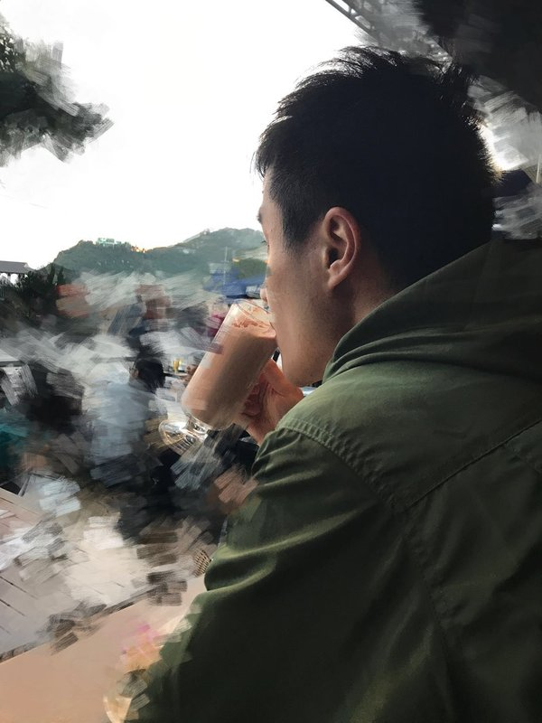

#### 【新手村计划#52】 \@zy-sb 一位来自湖南的保险代理人

问：\@zy-sb 您居住在哪里 ?

中国大陆湖南省常德市（桃花源在这里，芙蓉王的烟产自这里）

问：希望大家怎样称呼您?

ZY，二姐，阳阳，文文，Dear......（都可以，名称就是个代号而已）

问：您的职业是 ?

保险代理人

问：什么原因让您加入Steemit?

朋友波哥(\@julian2013)介绍说，Steemit是个很好玩的地方，可以，认识很多有趣的人。我平常三不五时也会写点文字，听说Steemit是个妙笔生金的地方，而我是个财迷，所以就加入了。因为不会翻墙，连这个账号都是另外一个朋友也夫帮我申请的（也夫同时帮自己和我用各自的邮箱申请Steemit账号，结果我过了，他的没过）。衷心感谢波哥和也夫（网络的奇妙之处，让我们这样在生活中素昧平生的陌生人，也会成为朋友并帮助我）

问：您主要分享什么类别的内容？

其实我想分享的内容很多，凡是我看到感觉到美的东西我都想分享给别人，音乐，图片，电影，书，画...

但Steemit是一个国际化的平台，涉及到版权问题，暂时我分享的就是自己写的文字。

问：您想什么类似的朋友关注您 ?

我希望看我文字的朋友能留言，人都是在互动中交流，无论是评价，建议或是默默关注，都是缘分（不要觉得缘分这两个字好俗，我们谁不是俗人呢？）

我很惭愧的一点是，我平常花在Steemit上的时间太少了

问：您有什么爱好 ?

我最大的爱好就是做梦（白日做梦，自由幻想）；其次，是对世界充满好奇；其他的爱好就跟大家一样，书，影视，运动，旅行，美食......

问：能谈谈您的 Steemit ID 由来吗 ?

我一直认为自己是个蠢人, 比较笨。我老妈老说我是个老实孩子，又经常念叨说老实就是蠢的代名词，所以我在我老妈心目中就是个蠢孩子，但这并不妨碍她爱我。zy是我名字首字母的缩写，sb是傻逼，而我一向喜欢特立独行，与众不同，所以我的Steemit ID 是zy_sb，应该不会有人和我ID重名。（好吧，sb也是super best的缩写，但这是我后来想到的解释）

问：还记得您刚在Steemit起步时的情况吗？

我是误打误撞进来的，第一，对电脑程式不懂；第二，我比较懒；所以我算不算起步了？自己都不是很清楚。

包括这篇在内,从上个月到今天，我在Steemit上总共发了16个帖子。其实让我随心写，肯定不止这个数量。但是朋友告诉我，不要发水帖，所以希望至少一周一篇。

问：您想过放弃吗？

如果这个问题是问我想过放弃Steemit没有？我的回答是没有。虽然我做事经常是虎头蛇尾，三分钟热度。因为有了欣赏自己的文字的朋友，虚荣和骄傲，让我很难放弃。

问：您是怎样走出起步的困局的？

关于写文字。以前看多了琼瑶，有点“为赋新词强说愁”，心情不太好的时候就会写写写发泄一下。现在还没修到“却道天凉好个秋”的豁达，有时写点文字就是为了自嗨，自我感觉良好一番。在人生这个局中，身，是被困在当下的；心，那就，你懂的......

既然是访谈，那访谈的目的可能是为了让别人更了解我，所以，以下是我的自我问答：

你的生日是什么时候？是什么星座？什么血型？

我的生日是9月22号，处女座，A型血。

你喜欢的数字是什么？你喜欢的颜色是什么？

喜欢22。以前超级喜欢蓝色，后来知道蓝色代表忧郁，不想自己那么忧郁就喜欢了红色。现在是，五颜六色都喜欢，比如橙色，黄色，绿色......

你喜欢吃什么？

我回答应该是不喜欢吃什么，因为我不挑食。我不喜欢吃肥肉，但是炖得很烂的肘子，东坡肉，梅菜蒸扣肉不包括在内。不喜欢吃黄花菜，没有为什么，反正从小不喜欢吃。不喜欢吃鱼皮，鸡皮。

你对自己的评价？

一个矫情的女人

你的目标是什么？为什么？

尽量努力健康地活得长久些，看山，看海，看世界。在世界比较和平的前提下，享受科技带给人类的便利和变化。

感谢村长给我这个访谈的机会

感谢两个群里的兄弟姐妹们：

宗旨--懒 波哥，Lucas王二狗，也夫，柚子妹妹，丽江哥哥,大愚，大明，土豆妹妹，小熊，Da., 睿睿，星晴，释寒，豆豆掌门，王楠，阳光3Q......

Steemit_cn新手村凉亭 村长\@ericet,\@tvb小姐姐，王美丽小姐姐\@artsymelanie，瓜瓜\@aellly，\@tydebbie，米高\@honoru，拉仔\@davidke20，小兔子\@kidsreturn，老刘头\@liuzg，软哥&软妹\@softmetal，\@pgr，深沉哥\@shenchensucc，大鹏\@dapeng，阿伦\@abcallen,\@changxiu才下眉头......、

### 【新手村计划#53】 \@huiguannova 一位来自上海的视觉设计师

问：\@huiguannova 您居住在哪里 ? 

本妹子居住在上海，是一枚土生土长的上海路痴，如果来到上海你比我路熟请不要惊讶。

问：希望大家怎样称呼您?

大家可以叫我元元或者NOVA或者慧观。

问：您的职业是 ?

我的职业是视觉设计师，什么叫视觉设计师呢。。咳咳就是目力所见一切皆可管管，其中当然更擅长的是平面设计，网页，电商，插画 。。林林总总总总林林，各位看官有钱的捧个钱场有人的捧个人场。。咳咳。。快跑题了。

问：什么原因让您加入Steemit?

加入STEEMIT是群里的美丽姐介绍我来的，刚开始我对区块链社区完全没啥概念。

问：您主要分享什么类别的内容？

我分享的内容也是我的爱好使然，这里的话其中更多的会是我自己创作的插画以及设计视觉，中间还会有些生活的小插曲以及大师篇幅的推荐。

问：您想什么类似的朋友关注您 ?

除了黄色暴力负能量之外欢迎大家多多关注我哦 ，朋友类型不限美好的事物希望同大家分享。

问：您有什么爱好 ?

我的爱好略多……其中有一些危险系数略高就放弃了比如滑雪，其他的绘画，创作，旅行，身心灵探索，神秘学，不定期闭关……所以有时候会潜水潜水潜水...，爱好这个事情受到时空干扰和自身情况比较多所以也不好说，不过从长远的角度看爱好太多其实对人本身也可能未必是好事。

问：能谈谈您的 Steemit ID 由来吗 ?

以前我有一个名字叫慧观，慧眼观照宇宙而不为有相所执 英文huiguan是按拼音来的,nova 因为之前酷爱BOSSANOVA的音乐所以取了后面nova做保留，nova英文解释又是新星，希望自己永保纯心，万丈高楼拔地起，清清源头养万物。

在和宇宙对话的元元：

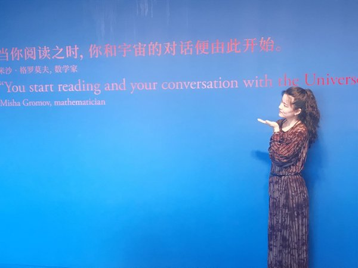

