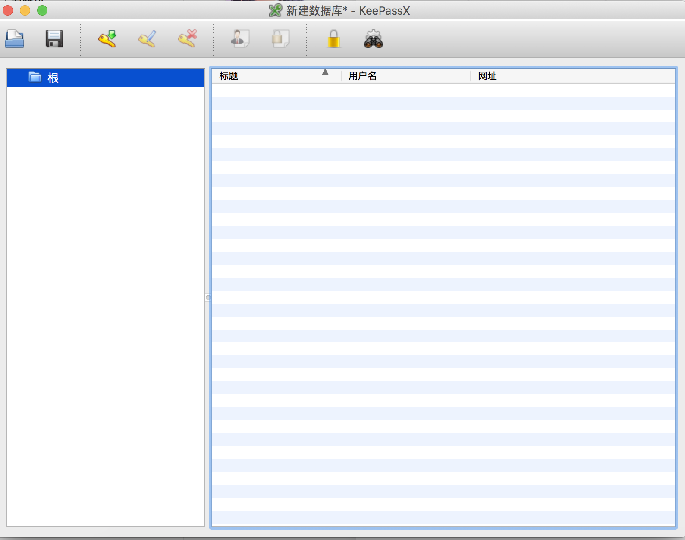
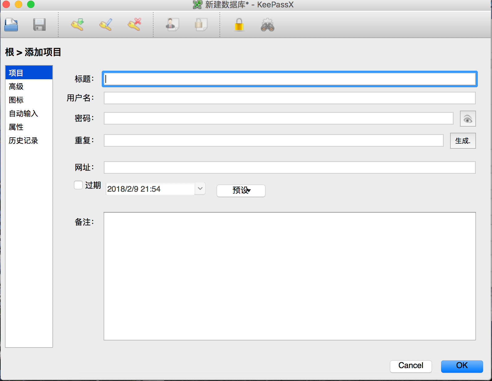
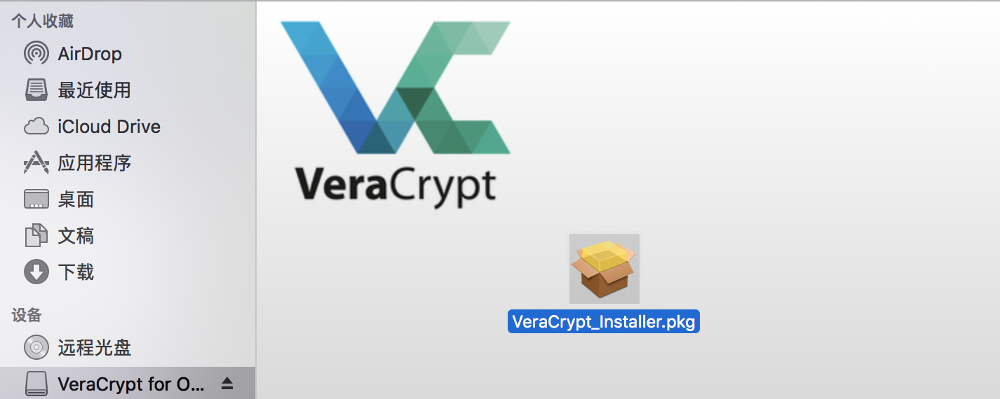
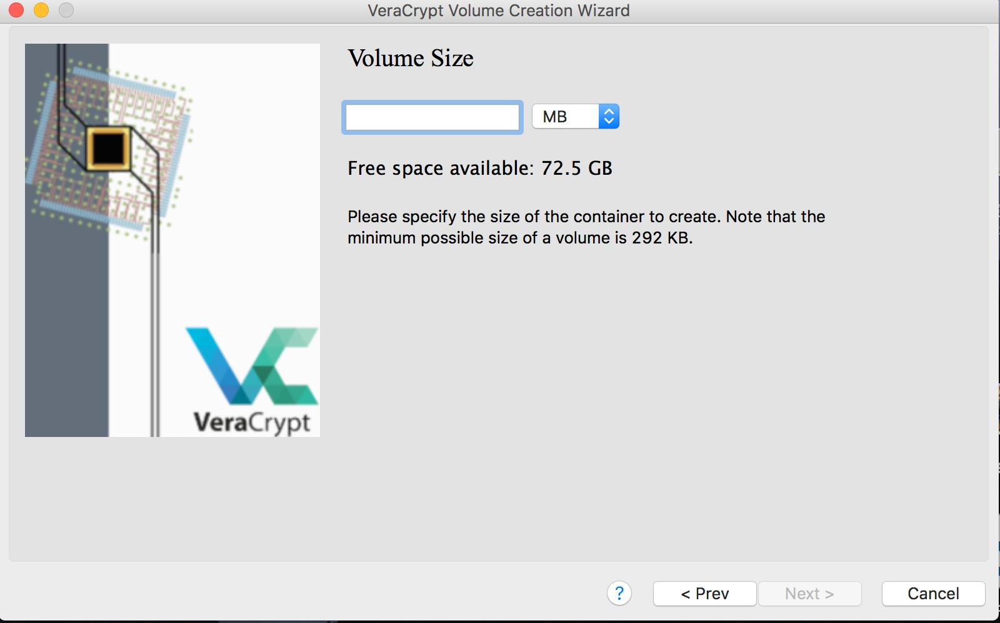
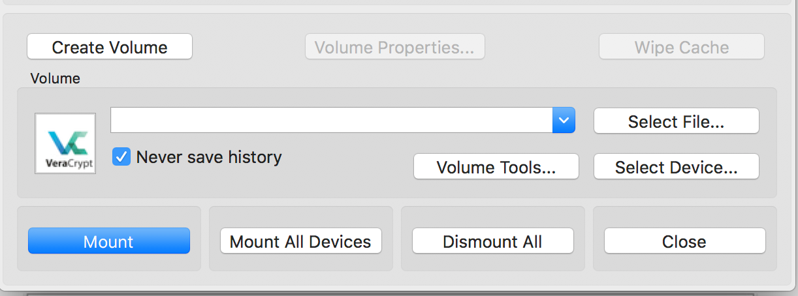
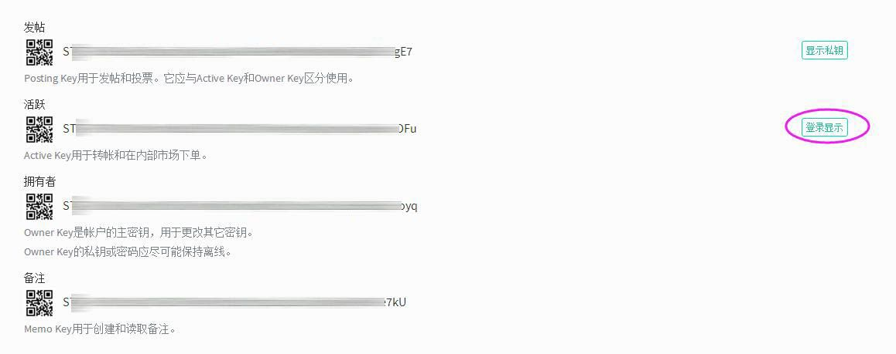

--- 
title: "Steem Handbook"
author: "Steem 中文社区集体创作"
site: bookdown::bookdown_site
date: "`r Sys.Date()`"
documentclass: ctexbook
# bibliography: "bib/packages.bib"
biblio-style: apalike
link-citations: yes
colorlinks: no
lot: no
lof: no
geometry: [b5paper, paperwidth=17cm, paperheight=24cm, tmargin=3cm,bmargin=2.4cm,lmargin=3cm,rmargin=2cm]
github-repo: "pzhaonet/steem-guides"
cover-image: "images/cover.jpg"
url: 'https\://bookdown.org/baydap/steem-guides/'
---

```{r set-options, echo=FALSE, cache=FALSE}
options(width = 55)
# title: "Steem Handbook"
# title: "Steem 基础与开发指南"
```

<!--chapter:end:index.Rmd-->

# 贡献者名录（临时版） {#aacontributors .unnumbered}

- 主编：\@dapeng

- 副主编： \@maiyude

- 顾问（按字母顺序）：\@deanliu \@jademont \@lemooljiang \@oflyhigh \@rivalhw \@sweetsssj \@tumutanzi

- 编剧： \@maiyude

- 封面设计： \@maiyude

本书的各章作者、编辑、校对见各章节脚注。待书稿完成后，名单将汇总在这里。


# 区块链是凝固的时间（代序） ^[作者：\@dapeng，原文链接：https://steemit.com/cn/@dapeng/79z9jz-or] {#secpre1 .unnumbered}


（1）

昨晚，看到 [\@catwomanteresa 关于钱包被盗的帖子](https://cnsteem.com/steemit/@catwomanteresa/my-sbd-and-steem-is-stolen-steemit)，和 [\@rivalhw 谈新人心态的文章](https://cnsteem.com/cn/@rivalhw/23b9qu)，我就上了一下久违的微信群，想看看来龙去脉。

1800 条未读信息，从头到尾扫了一遍，最后发现，我想知道的东西，包括被盗的前因后果以及新人遭遇的这些困惑和困境，都已经写在帖子里了。什么新人收益少啦，抱团取暖啦，新帖求赞啦，等等等等问题，老人们都遇到过；老人们陷进去的那些坑，新人们一个也躲不开。用 \@tumutanzi 博客的标题来讲，“日光之下，并无新事”；用李白的话来说：

> 今人不见古时月，今月曾经照古人。

既然都是老问题，那么前人的经验教训，为什么对后人没啥用处呢？

（2）

客观上来说，是网站的设计造成的。不管是哪个 steem 网站， steemit.com，cnsteem.com，busy.org，全部优先展示新文章，连个置顶或收藏都没有；只有 chainbb.com 是分页显示所有文章，我以前就是去那里翻旧帖。于是乎，老生常谈的话题，每拨新人写一轮，重复地写，其实早就被前人写尽了。

从这个角度来说，本文也是如此。去翻翻旧帖，无数是写给新人的，而当年读这些帖子的新人，如今也成了老人。

而主观上来说，在困惑的时候，新人们的选择是提问和抱怨，而不是自己找答案。实际上，答案早就被一轮一轮地摸索过了，只是没有摆在眼前，搜起来不方便。


如果你只盯着眼前，会感觉每天的帖子像瀑布一样刷刷流过，别人呼呼赚钱，让你手足无措，唯恐被世界抛弃。

这时不妨离远一点看，会欣然发现，steem 上的时间其实是凝固的。如今的大神们，他们当年的一笑一颦，举手投足，全部定格在区块链上，抹都抹不去，如圈圈年轮，如沉在地下的恐龙脚印。你的现在是他们的过去，他们的现在是你的未来。

就像电影《降临（Arrival）》里讲到的外星人语言。只要你从另一个维度去解读，就会看到，过去、现在和未来浑然一体。


（3）

写到这里，我停下来，读了读上面的文字，发现自己又开始倚老卖老了。

不记得什么时候起，开始感到自己不是新人了。可能是从发起“新人希望工程”和“新人三个一”活动吧。这就好比一个女孩，直到成为妈妈的那一天，才突然发觉自己已然不是孩子了。

从活动里，我发现了一大批热情参与、认真写作的新人，\@winniex 就是其中一位。昨天，她在[百天帖](https://cnsteem.com/cn/@winniex/100)里写道：

> 前两天看到一个 56 的被称前辈好想笑，想起自己在四十几的时候就盼着到 50，......嗯，现在我59了，如果不是最近来了老多新人，我还想称自己是新人。。。

每次读 \@winniex 的文字，我总是捕捉到一丝小哀怨，还有一点看破红尘的淡泊。

而比她早来一点的 \@yingpingzhang 在犹豫，不知以后在 steem 上往哪个方向走。他写道：

> 以前只想玩音乐，后来生活所迫，转战IT。现在只想潜心研究区块链，怎奈大家更喜欢我的音乐。

造化弄人啊。林妹妹和宝姐姐，到底喜欢哪个多一些？可知当你在为此烦恼时，气坏了多少单身狗。区块链是什么，无数人连听都没听说过哩。

弹吉他唱歌的帖子，喜欢文字的人不一定喜欢，但自有弹吉他的人点赞；

谈区块链的帖子，弹吉他的人不一定喜欢，但自有喜欢投资的人点赞。

这种事儿，很多前辈都遇见过。看看他们怎么处理的就好了。

（4）

大神也是人，不可能看得见每个新人。从社区角度来讲，需要传帮带，各司其职，[小鱼评、大鱼荐、大鲸赞](https://steemit.com/cn/@dapeng/what-are-you-on-steem)，才能达到整体效益最大化。而从个人角度来说，想在 steem 上赚钱，要么就花钱买 SP，要么就练笔写出好文字，这是性价比最高的两条路。其他的出路，我觉得是得不偿失。——当然，这还取决于你对“得失”的定义。

看，我又倚老卖老了，不好意思。其实我也只不过在 steem 上混了不到半年而已。现在，已经有朋友管我叫“前辈”、“大牛”，吓死我了，赶紧说“别这么叫我”。后来一想，刘美女 \@deanliu 也不让我叫他前辈。不知道刘美女是不是也管老聂他们叫前辈。

刘美女曾经说过，他对新人的注意大概就是到我这一拨，后面的关照不过来，不是不想，而是精力有限（其实刘美女仍然在尽力照顾后来的新人，例如 \@yingpingzhang 等）。而我的注意力，大概也就是到 @winniex 这一拨，后面的新人层出不穷，若非文章写得特别好，记都记不住。

而关于举办活动，\@rivalhw 发文写道：

> 很多时候我们不是因为有希望了才坚持，而是因为坚持了才有可能看到希望啊！　

《Steem 指南》一书的编写，就是一项集体参与的活动。本书，就是活动的成果。

参加者里面，有没有你？

\mainmatter

<!--chapter:end:00_preface.Rmd-->

# (PART) 初级篇 {#cjp .unnumbered} 

# 新手第一步 {#xsdyb}
## 浏览 steemit 网站 {#ll_steemit_wz}
小雅在朋友的介绍下来到了Steemit。

steemit是什么？其实小雅也没搞明白，朋友对她说了很多，很多区块链，什么去中心化，什么未来趋势云云，但是小雅一句都听不明白。但是朋友说的话有一句话小雅听明白了，就是在Steemit写文章可以赚钱。写文章可以赚钱？那自然是好事。于是小雅就在朋友的介绍下登陆了steemit。

steemit给小雅的第一印象是一个乱糟糟的博客，而且还是全英文的。虽然小雅英文水平还算可以，但是如果有中文支持她会更开心。小雅随便看了看首页的文章，发现大多都是全英文的文章，偶尔才有一两篇中文的文章出现。

难道在这里的都是外国人？在这里写文章要用全英文吗？抱着一大堆的问号，小雅点击了注册新账号按钮。

## 注册 steem 账号 {#zc_steem_zh}
小雅有点烦躁，因为她在注册Steemit账号遇到了难题。

这是她见过的注册账号最不友好的社区。她从来没有想过注册一个账号会是那么麻烦的一件事情，她甚至萌生了永远不登陆这个网站的想法。

首先这个网站的浏览速度超级慢，至少在中国访问的速度是超级慢，她感觉回到了拨号上网的时代。其次，注册个账号居然需要翻墙来收取验证码。天啊，她一个小女生哪里懂得翻墙这些高科技的事情啊。

好不容易在朋友的帮助下翻了墙，又专门去注册了一个Gmail的邮箱用来收取验证码，按照步骤一步步的完成注册。忙完这些，她发现刚注册的账号居然还不是马上生效，还要等待官方把你的账号激活，这个过程一般是1-7天左右。

小雅很是抓狂，终于在第三天的早上，她终于收到了官方发来的邮件，她的账号正式开通了。

虽然历经波折，但是小雅的Steemit之旅正式开始。

## 登录和保存密码 ^[作者：\@dapeng，原文链接：https://steemit.com/steemit/@dapeng/the-very-first-thing-to-do-for-new-steemians-or-steem]

小雅好不容易注册好了steemit账号，终于可以开始她的steemit之旅了。

作为 Steem 新手，必须做的最要紧的事情是什么？是兴奋地发第一帖宣告自己的降生吗？是看看收益最高的帖子来学习如何在 steem 赚钱吗？还是上传自己帅帅的头像？

小雅听说，第一件事，至关重要的任务，是立刻抓起你的相机，对着显示器上的 steem 密码拍个照片，打印到纸上，删掉数码照片，然后把这张纸塞到一只鞋子里，藏在床底下。

曾经有一次，有个声望达到 67 的账号被坏蛋机器人  @cheetoh 用钓鱼手段骗过了眼睛。这个盗贼看上去很像著名的机器人 @cheetah。价值数万人民币的 SP+SBD 和无法估量的其他损失，就这么进了别人钱包，让人痛心。找回密码和账号很困难，几乎是不可能的。

steem 新手注册成功后，会得到一个很长的字符串。官方称其为“万能钥匙” (master/owner key)。这很容易让新手误以为是个登录密码。别的网站不都是如此吗？忘就忘了，不都是能用邮箱或手机恢复吗？于是，他们首次登录，愉快地发布第一帖，读了一些别人的文章，然后关掉了网页，把一切都抛诸脑后。几天之后，他们突然想起了 steem，想登录看看自己是不是赚了点钱。可是那么长的密码，谁记得住呢？恢复一下吧……居然不能恢复？？！！

新手并未被充分告知密码的重要性。在中文微信群里，曾有个用户不小心把密码复制粘贴出来，每个人都看见了。还有个用户，把他的钱包-权限页的四个密码截了屏，一起发给我，问我这些是什么意思。没人钓鱼欺骗他们，他们只是不知道他们自己在做什么。

现实生活里，如果丢了身份证，可以去身份证中心——派出所或警察局补办。如果丢了信用卡，可以去信用卡中心——拨打服务热线挂失。Steem 的世界里，如果丢了密码，对不起，没有哪个中心可以去，因为 Steem 用的是区块链，去中心化！

实际上， steem 用户的主密码不只是个密码，而是个多合一的混合体，相当于：

**Steem 主密码 = 登陆密码 + 身份证 + 银行卡 + 手机 + 签名**

只要有了你的主密码，任何人都可以在 steem 上登录你的账号，转账，发帖，给别人留言，钓鱼欺骗你的朋友。这玩意儿到底应该叫什么？”万能钥匙/主密码“ (Master/owner key) 这个称呼远远不够。我觉得应该管它叫”Steem 账号的命根子“。一旦丢失，就是死路一条。

永远不要使用你的主密码！

钱包（Wallet）-权限（Permissions）页面有四个密码。

- 登录的时候，用发帖密码（posting key），足够平时使用。

- 只有在跟钱打交道时，才使用活跃密码（Active key）。

- 那么主密码是干什么用的？只有重置账号时才用。你可以当作是手机上的”恢复出厂设置“。这个功能你从来没用过，是不是？

所以，最好把主密码打印出来，塞到鞋子里，藏到床底下。

就像科幻小说《三体III》里所讲，如何保存资料最安全? 刻在石头上！

于是，小雅首先按照网站的说明把那长达二十多位的密码抄了在一个小本子上。网站上一再提示这个密码非常的重要，遗失了几乎不可找回，这让小雅有点心惊。因为小雅忘记的账号密码不计其数，忘记的概率远远大于被盗的概率，很多久不登陆的账号她都是通过重设密码才找回的，这个网站的密码不可找回让她有点担忧。小心驶得万年船，她把密码抄了下来，又在加密的云盘上保存了一份，她想着这样应该不会忘记了吧。


忙完密码的事情，她寻思着如何装修一下自己的个人主页。


## 登陆和保存密码 [作者：\@vickylin 编辑：\@vickylin]

登陆过程比较简单，这里不做冗述。值得一提的是，注册时提供的是master password，首次登陆后，把posting key和active key保存下来后，再也不要用该密码登陆。在日常使用中，我们可以用posting key来发帖、点赞、回复，用active key交易、转账。

关于密码的保存，我个人会使用种方法：**密码管理器、加密盘、硬盘和纸质**。

### **硬盘/U盘**

如果你选择这个办法，最好找个硬盘/U盘专门做保存密码所用，其他文件一概不放入，并且平时做好杀毒工作。

### **纸质**

有些人可能会嘲笑这种最原始的做法，心想着什么都往电子化数据化的年代，哪还有人拿纸笔记录下这一切。在丢失密码的那几天，我曾去请教过一位大神，他是如何保存重要密码的。他笑着说：
> 我用小本子记下来呀。

因而，无论你通过数据化的方式做了多少备份，重要密码纸质的一定要有一个，无论是手抄还是打印，然后放在一个安全且你绝对能想得起来的地方妥善保管。

### **密码管理器**

现在市面上比较主流的是1Password、keepass和lastpass等。当然，如果你要讲我把密码记录在word、excel或者note里面，那我们可能不在谈论一件事情。lastpass我没有用过，主要谈谈另外两种。

1**Password**

这是我接触的第一个密码管理器，界面非常简约好看，操作上也无任何问题。如果产生疑问，可以发邮件给他们的客服，客服人员非常认真负责，会尽可能的去帮助你。当然，因为其公司在加拿大，故而会有时差，一般来说你今天发的邮件第二天可以收到回复。个人使用过程中没觉得有什么缺点，一定要讲的话，就是贵。

1Password是采用一次买断和订阅式的。如果你打算长期一直用下去的，推荐买断，听朋友说大概是五百多。订阅的话是一个月27元rmb（在网页版登录后有看到2.99$/mon，但需要绑定信用卡，需要输入信用卡CSV码，个人觉得不是很安全放弃了）。另外，windows和mac是要分开购买的，也就是说一个账户无法跨平台使用。

使用1Password的朋友们务必记得以下三点：

1. 注册完以后，记得把emergencykit保存好，里面涵盖了用户名及secret key，你也可以打印出来，手写上master key然后找地方放好；

2. 登录主界面（可选择指纹解锁的那个界面）的密码，并不一定是你的master key，所以这两个密码如果不同，请务必记清楚；

3. 可以的话，请在两个设备登录。如果你不小心在一个设备登出（log out）但是不记得密码，另外一台设备也许可以挽救这一切。

**Keepass**

朋友说，KeePass的缺点很明显，那就是没有浏览器插件，不论是注册还是登陆都要在软件内复制过去。个人觉得这个缺点其实还好，毕竟大部分情况下我们在使用个人电脑的时候，都会选择让浏览器记住密码。一定要讲缺点的话，可能就是界面不如1P来的美观。优点也是显而易见的，它是一个完全免费的开源软件。

下载

[官网](https://keepass.info)我下载的是keepassX。下载好以后直接拖进application即可，因为我用的是macos系统，下面截图演示就是Mac情况下的界面，windows也差不多。

安装及使用

打开软件后点击左上角数据库---新建---输入主密码，确认以后进入这个界面



点击添加按钮，如下图，就可以开始填写/生成密码了，OK以后按保存即可，会形成一个文件（有点类似word保存以后形成的文件）。



以后无论点击这个文件，还是keepass的图标，都可以打开这个界面。建议大家输入密码的时候可以把可视选项打开，以免输入的时候错误。


移动端

我试了keepass touch和mini keepass，个人觉得没什么太大的差别，就用了前者。目前还没有弄好dropbox自动同步，解决方法是将keepass.kdbx的文件丢到dropbox，打开dropbox然后选择用keepass打开即可。在数据库没有更新的情况下，基本打开过一次，这个数据库以后就可以直接在keepass touch里面打开了。

### **加密盘**

在前阵子经历密码丢失后，我这段时间都在各种备份自己的数据。目前我采用了四种方法：keepass+1Password+dropbox+纸质版。强迫症大爆发的情况下，又研究了如何在本地放一个加密盘的方法。

对于用户来说，考虑加密软件主要会从安全性、是否免费及是否多平台，那这些Veracrypt都具备了。VeraCrypt 的前身是 TrueCrypt（2010年有报道称，FBI也无法破解TrueCrypt加密的文件），由于后者被 Google 爆出严重的安全漏洞，这才诞生了 VeraCrypt。同时也说明了，VeraCrypt 具有更高级别的安全性。

下面我们就来看看如何使用**VeraCrypt**：

安装与设置

1、首先在[官网](https://www.veracrypt.fr/en/Downloads.html)下载；

2、下载完后双击图标，进行安装；



3、如果出现以下界面，按照提示，前往[Fuse](https://osxfuse.github.io)下载安装驱动。然后就可以安装VeraCrypt，一路下一步即可；


加密数据步骤

1、接下来创建加密卷，一般都是默认的选项，下一步即可；


2、根据要加密的文件设置加密盘的大小，如果只是保存密码的话，一般1M就够了；



3、然后设置密码（我没有使用秘钥文件，听说比较麻烦）。格式化完成后，确定并退出。这个时候你会看到已经加密好的文件，它没有后缀，也无法打开。


解密数据

1、选择加密盘的所在位置，点击加载。如此就可以打开加密盘，可以任意读取盘内的内容，也可以把想要加密的东西丢进去；



2、看完以后，务必点击卸载。这时候，此盘就重新加密，除了有密码的情况下都无法打开；


注意

1、加密盘的文件名不要随意更改，我测试过，改过文件名的，软件可能会无法打开，出现密码错误的字样；

2、放入文件的时候注意文件大小，不能超过设定的磁盘的大小。

## 设置个人基本信息 ^[作者：\@maiyude]

小雅掉进了自己账号的设置页。

Steemit的各种设置和博客有点类似，虽然小雅的博客随着微博微信的兴起荒废多年了，但是小雅以前可是一个博客迷呢。

首先要设置的是头像，小雅打算使用她在微信用了多年的头像。但是她马上就遇到了一个难题，她找不到上传头像的地方。经过一番摸索，原来只要把头像图片的网址复制到设置页就可以了。原来那么简单，小雅暗暗嘲笑自己的愚蠢。

接下来小雅填写了一些自己的基本信息，然后继续设置自己主页的banner，因为图片尺寸的问题，小雅在这花了很长的时间才完成。终于弄完这些基本设置，小雅顿时松了一口气。

小雅还看见设置里面还有钱包的选项，里面有各种货币和选项，在账号安全里面还有好几个不同种类的密码。这些没设置过没见过的选项让小雅有些头疼，她决定暂时不管，日后慢慢研究，现在先发帖再说。

****
相信很多新人初来Steemit的时候，都会对里面的设置界面一头雾水，下来的教程将会教大家一步步认清所有设置的作用，帮助你完成设置个人基本信息。


我们点击右上角自己的头像，然后点击设置，即可进入设置界面。

下面我们来根据下图一步步讲解所有设置的作用。


- 1.选择语言：这里可以设置Steemit的语言，请根据自己习惯使用的语言选择。

- 2.个人头像的网址：这里是设置头像的地方，头像是别人对你的第一印象，设置很简单，只要把头像图片的网址复制上去即可。这里建议可以新建一个帖子，把你头像的图片上传，再把网址复制过来即可。

- 3.封面图片的网址：这里是封面图片设置的地方，如同箭头所示，是你主页头部标题栏的背景图片。为了各种分辨率以及各种设备都能正确显示，建议使用图片大小为1900*200 px。

设计封面图片的注意如下：


图中绿色区域为自由区域，红色区域为文字显示区域。

请设计图片的时候不要使用太花俏的背景，以免文字显示效果差。文字区域文字颜色为白色，所以红色区域在设计的时候注意不要使用白色背景，这样文字会看不见。

- 4.显示名称：显示在你主页上的名称，不同于ID，这里支持任何语言包括中文。

- 5.关于：这里是你的个人简介，请简明扼要的介绍你自己。

- 6.位置：这里填写你的坐标，方便同区域的朋友找到你。

- 7.网站：这里可以填写你的个人主页的地址。

- 8.显示私人文章设置：不适合在工作时显示的(NSFW)内容。在Steemit，带有色情、暴力等儿童不宜的内容会打上NSFW，默认是隐藏的，你可以在这里自由的设置显示还是隐藏。

以上就是设置界面的全部内容，接着我们介绍钱包界面，点击进入钱包后，我们会看到这样的界面，下面我们来逐一介绍。


- 1.STEEM:这里显示你账户steem余额，点击余额的数字会出现菜单。


转账：转账给别的用户。

转移到储蓄：转移到储蓄账户后需要3天的时间才可以取出，一定程度保障你的资金安全。

Power Up:将Steem转化为Steem Power（SP），转换比例是1:1，转化为SP是即时的，但是SP转化为STEEM需要13周，请谨慎操作。

购买：将跳转至blocktrades，可以使用其他虚拟货币购买STEEM。

卖出：将跳转至blocktrades，可以使用将STEEM转化为其他虚拟货币。

市场：内部市场，可以进行SBD和STEEM的买卖。

- 2.STEEM POWER:右侧数字为你的SP的数量，括号内的数字为代理的SP数量，关于代理详见后文 关于SP代理的一切一文。此处数字为2925.520，括号为2783.821，意思为总SP数量为2925.520，代理给别人的数量为2783.821，既实际SP数量为2925.520-2783.821=141.699。同样点击数字会跳出菜单。


Power Down：将SP转化为STEEM的选项，全部转化需要13周的时间，Power Down期间SP的投票权不会丧失。

购买：将跳转至blocktrades，可以使用其他虚拟货币购买SP。

Cancel Power Down：点击Power Down后才会出现的选项，可以随时取消Power Down。如果你没有进行Power Down但是出现此选项，请注意你的账号密码是否已经泄露。

- 3.STEEM DOLLARS:显示你STEEM DOLLARS（SBD）余额的地方，点击数字后同样会出现菜单，选项功能同上文所述，不再重复。

- 4.储蓄：可以将steem或者SBD转移到此处，储蓄取出需要3天的时间。把多余的钱存在储蓄可以一定程度上保障你的资金安全，因为某些原因，储蓄几乎没有利息。

- 5.账户估值：你的账户所有STEEM和SBD的总价值估计。

下面界面为账户的资金往来历史，如果有异常的转账行为，可能是你的账号已经泄露，请注意安全。

接下来介绍下一个界面：权限


此处显示你账号的4种密码，具体作用功能描述请看后文：关于密码的一切。

最后点击剩下的最后一个界面：密码


此处是修改密码的界面，不过多阐述，但是请注意修改密码前后牢记密码，修改前后的密码都要牢记。

全部界面介绍完毕，祝你的Steemit之旅愉快。


## 第一帖 {#dyt}
小雅准备在steemit写自己的第一篇文章。

她点击了发帖的按钮，之后弹出来的界面让小雅有点惊讶。这是她见过最简陋和功能最少的界面，整个界面几乎全是空白，她想找个插入图片的按钮都找不到，更别说调整字体大小等功能了。

应该是自己不懂用法而已，慢慢摸索吧。小雅心里这么想着，决定日后再一步步探索各种功能，现在首先考虑第一帖写点什么。

不如就写个自我介绍吧？一个好点子突然从脑袋里蹦了出来。说干就干，小雅花了一个小时精修了自己的自拍照，然后认真的写了一篇简短有趣的自我介绍。

文章写完，小雅认真的检查了一遍，然后按下了“发布”的按钮，大功告成。

接下来就是等着别人给自己点赞了，会有多少人给自己点赞呢？小雅满怀期待的等待着。

## 延伸阅读：一分钟入门 steem ^[作者：\@dapeng，原文链接：https://steemit.com/cn/@dapeng/steem-or-the-very-first-post-for-new-steemians-to-read]


很多新人来到 steem，满脑子问号，提了一堆问题，花了很多工夫，却仍然没能入门。

向新人介绍 steem 的好帖有很多，在 steemr.org 上有总结，这里不重复。其中最简单粗暴的，我认为是 \@jubi 最近写的 ["写与我的一些自媒体朋友"](https://steemit.com/cn/@jubi/28tqtu)。我喜欢这篇文章的调调，例如：

> 钱从哪儿来？这个问题说实话，我不想回答。知道又如何，不知道又如何。
>

该文的作者，一定曾经受伤很深。

一个新兵蛋子，刚来就问连长的老婆是从哪里讨来的，这不合适吧？

不过，就算是这篇通俗得已经不能更通俗的帖子，仍然有很多新人读完后搞不明白，毕竟里面提到了一些新概念。

通过观察，我发现，纠结的根本原因是，新人们没闹明白 steem 是什么。弄清楚了这个问题，其他问题都迎刃而解。

**steem 到底是什么？**

steem 不是个摇钱树啊！你来了，摇一下，就有金币砸你的脑袋！（除非你先把金币挂上去——这句话的意思你将来会懂，现在解释了也没用。）

steem 也不是提款机啊！你塞进去个账号，就吐出一叠美钞！（除非你预存进去——这句话的意思你将来会懂，现在解释了也没用。）

我用大白话解释一下：steem 是个圈子。

steem 好比现实生活里的一群人，围坐成一圈开篝火晚会。（steem 网站）

篝火旁边可以表演节目。表演完了有人发钱。（发帖赚钱）

篝火有好几堆。这一堆附近全是说中文的，那一堆附近全是画家。中国画家两堆来回跑。（分区）

晚会上有人载歌载舞，有人冷冷旁观，时不时有人抽身离去。（活跃账号，休眠账号，死账号）

有些人，幕后是同一个老板，组团来表演；有些人，其实是人工智能的机器人。（马甲，小号，机器人账号）

作为一个新人，你来到这个晚会现场该怎么做，你在 steem 上就该怎么做。

你不能上来就伸手，问晚会现场每个人要钱，对吧？（快来点赞我吧）

你不能挨个问现场的每个人，喂，你兜里有多少钱，对吧？（到底 steem 上能赚多少钱）

你不能易容改装成鹿晗，说自己是正牌大明星，把大家当傻子，对吧？（steem 上能不能抄袭）

拜托，**正常一点**好吗？

一个正常人，来到篝火晚会，首先应该找个角落先坐下，适当的时候站出来，做个自我介绍，最好彬彬有礼，说说自己是谁，兴趣爱好什么的，别人才方便跟你交朋友（写个自我介绍帖）。

不爱说话，那就点个头，坐在角落默默围观，等有人来好奇地问你你是谁你来做什么（等着别人来你的帖子回复，互访，互动）。

遇到现场放你喜欢的音乐时，趁机上去跳个舞，震震他们（参加 steem 上举办的各类活动，写自己擅长的内容）。

为什么有人表演得到的钱多，有人表演得更好却得钱少？坐下来看，自己慢慢找答案。（读前辈的帖子）

为什么我表演了也没人给我发钱？你得认识能发钱的人啊。他们要是不知道你是谁，凭什么给你发钱？（新人发帖赚钱少）

这就是 steem 的一切。

**新手要做的事情，就是当个篝火晚会现场的正常人。仅此而已。**

新手在 steem 上无所适从的时候，就想象自己是在一个篝火晚会现场，遇到这种情况怎么办。你会发现，问题迎刃而解。


“steem 是什么”这个问题解决之后，应该不会存在什么观念上的疑惑了。剩下的就是几个基本的技术问题。

**第一： 注册。**

上 steemit.com 直接注册，上面的提示信息很清楚：要注意什么，几天能注册下来，等等，完全不需要求助。

如果存在访问障碍或者语言障碍，那就去 cnsteem.io 注册，也不需要求助。不就是十块钱的事儿嘛。cnsteem.io 的主人是 @skenan，有问题联系他发邮件到 cnsteem@gmail.com。

**第二：访问速度慢。**

改用 cnsteem.com （中文界面）。或者 busy.org。内容跟 steemit.com 完全一样。没账号的人可以浏览。有账号的人可以用 steemit 账号的 post key 登录发帖。

**第三：其他问题。**

steem 网站顶部都有搜索栏。输入关键词，自己搜。google 百度上搜也行。

系统性阅读的话，可以参考：[steemr.org](http://steemr.org)（嫌慢就去 [steemit.wang](http://steemit.wang)）

以上涵盖了新人遇到的所有问题，除此之外，再无废话。


## 延伸阅读：更改 steemit 的网页界面配色 ^[作者：\@dapeng，原文链接：https://steemit.com/steemit/@dapeng/if-you-dislike-the-steemit-green-or]


你喜欢 steemit 的新界面吗？尤其是那一片绿……

如果不喜欢，本文告诉你如何方便快捷地更改。目前的主流浏览器都支持更改网页的默认颜色。本文就以 Firefox 为例，给出三种方法，任你选。

方法 1：点击 firefox 右上角三条小横线按钮，点击“选项” --- “内容” --- “颜色” ---“覆盖”下面选永远。

这种方法的好处是啥都不用额外安装。坏处是所有网站都变成了你指定的颜色，想切换回去的话又得点一遍。有没有办法一键切换？

方法 2：在“选项”里点“插件”，搜索 “No Color”插件。安装完毕后，工具栏多出个按钮。点它，就可以一键在你定义的颜色跟网站原来的颜色之间切换了。

虽然切换方便，但是有没有办法不切换，自动把且仅把 steemit 颜色改了？

方法3：安装 'NoSquint Plus' 插件，工具栏又多个按钮。点它，设置颜色。“全局选项”可以选择对所有网站都改颜色。如果只对 steemit 改，那么把'排除‘'勾上就行了。


<!--chapter:end:01_0.Rmd-->

# 基本常识 {#jbcsp_}
## 什么是 steem^[作者：\@wang-peilin；小故事：\@maiyude；编辑：\@dapeng]
小雅的第一篇文章发出去之后，只有寥寥几个人给她点了赞，收益也只有可怜的0.03美元，这让她有点失望。


不过她很快就从失落中走了出来，自己还只是个新人嘛，没人关注是很正常的事情，加油写文章就是。

她转而研究steemit里面的各种钱。她发现这里居然同时存在三种钱，分别是steem,steem power（sp）,Steem Dollars（SBD）。为什么一个社区内会同时存在三种钱啊？这让小雅很是困惑，这就感觉像是市场上同时流通三种人民币的感觉，初次接触区块链的小雅完全搞不懂。

不过让小雅感到更为困扰的事情是，自己所有的钱币都是0，这让小雅顿时失去了研究这些货币的兴趣，默默的继续写文章去了。
****
相信很多人来到steemit都是和小雅一样一脸的困惑，下面就来简单的介绍一下什么是steem。

- 1.前言

什么是Steem？新人朋友们看到这个标题可能会有点摸不着头脑，Steem不就是在Steemit.com上使用的一种货币吗，还用单独列一个章节出来讲解？会这样想主要是存在一定的误区，因为Steem其实有两个含义，一个是Steem区块链，另一个则是在这个区块链上使用的一种货币。为了方便区分，我们暂且把第一个含义叫做Steem链，第二个含义叫做Steem币吧。而我们大多数朋友都是通过Steemit.com上最先接触到Steem链的，所以我们下面单独讲解一下Steemit.com吧。

- 2.Steemit.com

Steemit.com是由Steem区块链的官方开发者建立的一个网站，在这个网站上我们可以读取到Steem链的内容。在Steemit.com上我们使用Steem币来奖励那些发布文章或点赞文章，以及发布图片和评论的用户。和博客、QQ空间、微信类似，用户可以发贴，评论。不一样的是，Steemit会给你奖励，激励你发布更多更好的文章。Steemit.com也是想最终发展成一个聚集时尚、经典、阅读、热点和流行的平台。

- 3.其它接入Steem链的网站

除了Steemit.com外，我们还可以通过Busy、eSteem、ChainBB、Utopian.io、Steepshot、Zappl、DTube、Dsound、Dlive、Dmania等各类网站输出或输入Steem链上的内容。就好像以前我们使用的光盘，我们不仅能在DVD上播放光盘的内容，还可以在EVD甚至有光驱的电脑上播放这个光盘。最重要的内容就存在这小小的光盘上。那么我们要问这么神奇的Steem链，究竟是什么呢？

- 4.Steem链的本质

Steem区块链采用的是跟Bitshares一样的石墨烯(Graphene)区块链技术，其共识模式是DPoS，Delegated Proof of Stake，大致上说，就是由持股者按持股比例投票选出代表(Witnesses)来维护、验证区块链网路 （ 简单对照比特币是PoW，藉由算力来决定共识之产生）。

区块链很多，甚至DPoS类型的也有一些，重点在于Steem链的特色是什么？你可能说是内容链平台。这么说也没有错。帮你更精确地说，是内容上链，持股者按照权重，可以决定按照机制设计好的新增代币，要如何分配到各见证人(Witnesses)、持股者(SP holders)、内容创造者(authors)以及内容发现者(curators)身上。当然，大部分是分配给内容创造者的。新增代币分给后二者部分称为奖励池(Reward Pool)，目前是累积七天，动态发给，各持股者以vote形式(正负两种)来进行权重投票，七天后结算。

虽然Steem链是机器无感的，但在上面运行的东西是活的，是被人赋予意义的。我们可以说Steem链是一切的根本，是Steem世界万物之依归。而我们来自世界各地的广大用户则依托Steem链,创造了缤纷的Steem世界。

## Steem上的各种货币^[作者：\@wang-peilin；编辑：\@dapeng。本文部分引用自\@rivalhw的文章]
### 概述

在Steem区块链上我们使用3种货币，Steem，SBD(Steem Dollars)，SP(Steem Power)**（注：严格意义上讲SP不能算作一种货币，因为它不能随意流通和交易，这里把它归为货币主要是为了方便理解，具体请见下文SP的单独讲解）**。为什么一个区块链上要使用三种不同的货币呢？这主要是因为它们被赋予不同的权利，拥有不同的功能，下面我们依次介绍。

### Steem

Steem是Steem区块链上的基础货币，另外两种币都跟它相关。你可以通过在Steemit.com，cnsteem.com等网站上通过写文章，评论或点赞来获得它。你可以在任何时间存入，取出或者与其它持有者交易Steem。Steem可以通过一个叫Power up的过程转化为SP(Steem Power)。

### SP(Steem Power)

如上文所述，SP是Steem通过Power up的过程获得的。顾名思义，你的SP越多，你在Steem社区上的影响力就越大，你的SP越大你的点赞就越可以得到更大的收益。具体来说，按本文编辑时的实时行情，如果你有10000SP，那你的一个点赞最多可以产生 $2.8 左右的收益。而实际收益其实远大于显示收益，显示为 $2.8 的收益实际上大概相当于7.7美元(具体原因请看下面SP的介绍)。那既然SP这么有用，为什么不把Steem全部转为SP呢？这是因为SP缺乏流动性，不能随意取现及交易。如果我们想把SP卖掉，则需要进行一个Power Down的过程，将SP转化为Steem再进行交易。而整个Power Down的过程每周只能将你持有的13分之1的SP转化为Steem，所以当您有了一些Steem后，还是要具体情况具体分析要把自己多少比例的Steem转化为SP。

### SBD(Steem Dollars)

SBD初衷是设计来1：1兑换美元的，官方现在也是把1SBD固定视为1美元的。但实际上它的市场价格却是像Steem一样波动的，现在1SBD的市场价远大于1美元。这也造成了文章作者获得的实际收益远大于显示收益。以上文所说显示收益 $2.8 为例，实际收益为1.4个SBD和价值为1.4美元的SP，而按本文编辑时的市场价格，1个SBD约等于4.5美元，所以实际收益应为4.5x1.4+1.4=7.7美元。

### 怎么获得这些货币

作者在发文章之后，按照Steemit的规则，7日后文章将被锁定而且无法修改(区块链永久不可篡改性)，同时进行该帖的结算，并根据作者发帖时的设定进行Steem和SBD的奖励。如果作者选择50% 50%，系统会将奖励分为两部分，一部分作为SBD奖励，另一部分作为SP奖励；如果作者选择发帖时power up 100%，则系统将会将奖励全部按照SP进行power up。当然你也可以通过交易所或其它货币持有者交易来获得这些货币。

### 总结

Steem上的货币是相互依存，息息相关的，新手朋友光看这些文字可能还是不能完全理解。如果你想投资进来我建议可以先投资一小部分自己实际操作一下，完全搞清楚这里面的各种关系后再决定是否大力投资。

## 关于代理SP（steem power）的那些事^[作者：\@maiyude；校对：\@meixia]

在上一节，我们学习了关于Steemit的里面几种货币的知识。我们了解到了SP(Steem Power)在Steemit的重要性。这里我们再扩展说一下SP的扩展应用——代理SP。

SP非常的重要，日常的发帖或者直接购买都可以增加你的SP。那么，当我们的SP有一定程度的富余的时候，除了点赞外，我们还有什么办法更好的使用掉这些富余的SP呢？或者我想要快速的获得更多的SP，有什么办法呢？

这个办法就是代理SP。

什么是代理SP呢？简单来说就是把你的SP借给别人使用。说到借东西给别人，很多人可能会有点忌讳，生怕有借无还，何况SP在Steemit社区那么的重要，自己用都不够呢，为什么要借给别人？

这里首先我们了解一个很多人都关心的事情，我们代理给别人的SP安全吗？

答案是非常的安全。你把SP代理给别人后，别人只拥有这些SP的使用权，但是这些SP还是安全的躺在你的钱包里面的，你可以随时的收回，不过收回的过程通常需要7天。代理SP给别人后，你的钱包界面的SP后面会有一个小括号，比如我的钱包的界面，后面显示了-2552.794STEEM,这说明我代理了2500多SP给别人。


了解了最关心的安全问题后，我们又有新的疑问了。为什么我要代理SP给别人？我自己都不够用呢。

代理SP给别人主要有几个用处：

1.代理SP给新人：代理SP给新人可以很好的帮助新人发展。比如有些应用就得到了官方的大量SP代理，这样这些第三方应用就能更好的发展了。

2.代理给点赞机器人等获取收益：比如代理给\@justyy可以每天获得利息，代理给\@cnbuddy可以获得点赞等。

3.出租SP给别人获取收益：出租SP在Steemit已经是一个非常常见的行为了，如果你有富余的SP，不妨可以考虑出租，这可以给你带来一定的收入。著名的租借SP服务商有：\@minnowbooster等

4.账户资金避险：比如你可以把账户的钱分散到小号，再把SP代理给大号来分散资金风险。这样可以保证你的SP总量不变，但是SP分散到了几个账号，这样即使遇到了最坏的情况，账号被盗且无法找回，丢失的也只是一部分资金，可以减少损失。

5.作为奖品：可以代理一定量SP给某人作为奖品。比如我想要举办一个活动，但是目前我囊中羞涩，而且我也不太想用真金白银的SBD或者STEEM作为奖励，这时候可以用代理100个SP一个月的时间作为奖励，花掉自己未来的收益作为奖励，这或许是未来活动的一个发展方向。

6.暂时没想到，欢迎补充。

可见，代理SP的作用是非常多的。比如一个新人刚来到Steemit社区的时候，如果能够获得大鲸代理的一些SP，那这位新人初期升级的速度会非常快，这对新人的帮助是非常大的。

这里着重说明一下代理给\@cnbuddy或者\@justyy的好处。

首先是\@justyy的YY银行，只要代理SP给他，他会每天按照比例转账SBD给你。每天就算不发帖都能躺着收钱，多好的事情对吧，而且还会获得\@justyy的十几个机器人群的点赞，简直是一本万利的事情。

其次是代理给\@cnbuddy，代理给\@cnbuddy之后，可以获得机器人给予的相当于你代理SP的好几倍的点赞。这会比你自己的点赞更加有效率并且不消耗你的Voting Power，这可以有效的提高你的收益和增快你的升级速度。如果你是一个勤于写文章的人，代理SP给\@cnbuddy是一个非常好的选项。

作用都明白了，那么如果我想要代理SP给别人，应该如何操作呢？我们这里以代理SP给点赞机器人\@cnbuddy为例说明。
要想代理SP给别人，需要使用\@justyy开发的小工具，[点击这里可以跳转](https://helloacm.com/tools/steemit/delegate-form/)

这个工具需要通过steemconnect授权，所以不用担心安全的问题。

下面介绍详细的用法，我们首先点击进入这个工具的页面。


如同上图所示，第一栏填写你的ID，第二栏填写被代理者的ID，第三栏填写代理的SP数量，然后点击绿色的按钮即可。之后会跳转到steemconnect授权页面，需要你的active Key授权。

那么我要如何收回我的代理呢？只要在第三栏代理数量那输入0即可。收回需要7天的时间，这7天你无法使用你的SP。

这里再稍微介绍一下这里的SP填写规则，代理的SP以最后一次填写的为准。什么意思呢？我这里举几个实例来说明。
1：我要代理1000SP给cnbuddy，那我们填写1000即可。
2：我已经代理1000SP给cnbuddy了，现在我要追加代理200SP过去，那现在需要填写1200而不是200。
3：我已经代理1000SP给cnbuddy了，现在我想要收回300SP，那现在需要填写700。收回的300SP会在7天后返回你的账户，返回的过程没什么提示，请耐心等待。
4：我想要收回代理的全部SP，那填写0即可，同样7天返回。

代理操作完毕后，可能有部分人在一段时间后，会忘记了自己代理SP给过什么人，有什么办法可以查询吗？办法当然是有的，这里同样要使用到\@justyy的工具，请[点击这里跳转](https://helloacm.com/tools/steemit/list-of-delegatees/)


使用方法非常的简单，只要输入ID后就可以查询代理SP的清单。

\@justyy的工具还可以查询谁代理了SP给你，要是哪天你发现你多了几个SP，又不知道来源，可以使用这个工具查询，[点击这里跳转](https://helloacm.com/tools/steemit/list-of-delegators/)


使用方法同样，输入ID即可。


总而言之，代理SP无论对自己还是对别人都是非常有用处的。所以还等什么呢？赶紧操作起来吧！

## 关于声望的一切^[作者：\@vickylin；小故事：\@maiyude编辑：\@vickylin]

小雅来到Steemit已经好几天了，文章也发了好几篇了。虽然点赞的人不多，每篇文章的收益也就零点零几美元，不过小雅也很满足了，因为自己已经慢慢开始熟悉这个社区了。

小雅今天发现了一个事情，就是自己名字旁边有个括号，里面写了一个数字。她记得刚来的时候这个数字是25，今天这个数字变成了26。这让她很是好奇，她把鼠标悬停了在数字上面，屏幕显示出了一行文字“这是小雅的声望分数，信誉评分取决于收到的投票历史记录，用于隐藏低质量的内容。”

“声望？这是什么？”小雅喃喃自语道。小雅把这个理解为类似等级的东西，只要自己好好写文章，这个等级会上升的吧。但是屏幕提示的最后一句话“用于隐藏低质量的内容”，让她有点不明白，难道这里的声望会出现负数？出现了负数后账号会被隐藏吗？

看来小雅需要学习的内容还有好多。  
****

对于新用户来说，可能会和小雅一样产生困惑，声望是什么？我们可以看到，登陆主页后名字边上的（25）就是声望，即Reputation。初始等级为25级，如果用户一些错误行为（比如：剽窃、伪原创等）或者有人恶意踩踏（downvote），会导致声望掉到0级甚至数值为负。

打个比方，声望相当于是你在steemit求学路上的一个结业证书，到达一个程度就发给你个证明。但这个证书，和你以后赚大钱关系不是很大（当然，有些机器人会偏爱声望高的用户给予点赞）。

一般来说，声望数值比作者声望数值低，踩没有影响。简单来说，一个25级的踩（downvote）30级的没有影响，而一个60级的踩55级的就会有影响。

对于新人来说，25-30级的时候升级的非常快。正常的互动下，一般一周内就可以达到。如果被大鲸点赞，甚至可以一下子到30级，但50级以后升级会非常慢。

在写这篇文章的时候，我找了很多过去前辈写过的关于该块内容的文章，看到以下这句：

> 你看那些占据STEEMIT首页的用户，声望分都那么高，点赞的人那么多，这样一来，再他们那就形成了一个良性循环，声望分高的人声望分愈来愈高，像我等声望分低的则永无出头之日。

也许对于SP来说，会有SP高的收益越来越高，大部分财富在少部分人手中流转的现象，但对于声望来说，它是“果”却不是“因”。

在前辈的文章中指出：

> 并不是声望分越高点赞对别人声望分影响越大，**影响声望数值的唯一因素就是投票产生的rshares**

> 除了区块链本身一些因素，rshares只跟投票（upvote）者的**有效SP、投票百分比、投票者当前Voting Power**有关。

有关“有效SP、投票百分比、投票者当前Voting Power”的解释，我将在另一篇**文章《Steem 指南》基础常识篇——关注、点赞、拉黑、踩灰**阐述。

想要知道当前自己的声望情况，可以关注微信公众号：steemit。在对话框中输入`@steemid`查询账户信息，比如：@vickylin

另外，给超过7天的帖子点赞，不会提高对方的声望，也不会让对方的收益增加，你自己也不会获得审查奖励，某些程度来说，还浪费了自己的Voting power。

## 关于文章收益的一切^[作者：\@wang-peilin 小故事：@maiyude；校对：\@meixia；本文部分引用\@tumutanzi、\@oflyhigh的文章]
今天是小雅来到Steemit的第7天了。今天发生了一件事情让小雅很是兴奋，那就是小雅收到了第一笔付款。虽然这笔钱只有可怜的0.015SBD，但是小雅还是很开心，因为自己的账户总算不是零了。

不过小雅因此产生了一个新的疑问，这里的收益是怎么计算的？自己收到的这笔钱是第一篇自我介绍的收入，她的那篇文章的收入是0.03美元。文章上写的是美元，但是发来的却是SBD和SP。而且这比例也不知道是如何换算的，0.03美元的文章换来了0.015SBD。小雅算了算，获得的SBD大概是美元价格除以2。但是自己还获得了零点零几的SP，这又是如何换算的？

小雅越算越烦恼，越算越不明白，最终她决定放弃计算收益，反正有钱收就好，算的那么明白干什么呢？

****
* 1.前言

  Steem因为基于区块链技术，拥有去中心化，躲避审查，内容不可篡改等优势，所以吸引来了五湖四海，世界各地的朋友加入。但我想现阶段大多数朋友跟小雅一样，加入Steem，还是因为想在这里发文赚钱。那么为什么在这里发文能赚钱呢？怎样才能赚更多的钱呢？文章的收益又是如何计算的呢？今天我们就来一起讨论下这个激动人心的话题。

* 2.作者收益和点赞收益

  我们在Steem上能获得的主要收益来源于点赞。你发表一篇文章，你作为作者，会得到收益。同样，为你的文章点赞的Steem用户也能得到收益。一篇文章的收益理论上会有75%分给作者，25%由所有点赞者按一定比例收取。但实际情况作者得到的收益往往大于75%，那么为什么作者得到的收益比例会往往大于75%，这就主要涉及到了早鸟惩罚。请看下文。

* 3.早鸟惩罚

  最初官方为了鼓励Steem用户发现优秀文章，就设计了一个点赞文章越早，得到点赞收益越多的规则。这本身是个很好的规则，但很多用户为了利益钻空子，就制造了很多点赞机器人，可以在文章刚发出来时就点赞文章，获得最大的收益。机器人获得的收益多了，那么自然认真发现优秀文章的用户得到收益就少了。为了减轻机器人抢赞造成的坏处，官方便设计了一个惩罚机制，太早点赞一篇文章则你本该获得点赞收益就会分一些给作者。极端情况下，比如文章发表三分钟内点赞，那么你所有的收益的点赞收益都会交给作者。随着时间的延长则交给作者的比例减小。直到30分钟后，你就可以获得你所有的点赞收益。所以实际上你发表一篇文章，有可能所有收益都归你所有，只要为你点赞的人都在你文章发表三分钟之内点赞。

* 4.点赞的时机

  那么既然早点赞有早鸟惩罚，那是不是就越晚点赞收益越多呢？也不是这样，因为点赞还是按照先点赞收益多，后点赞收益少的规则来的。再综合考虑早鸟惩罚的话，我们可以得出结论：

  *  一：3分钟之内不点赞

  * 二：30分钟后越早点赞越好

  * 三：3到30分钟之间任何时候点赞都可能得到最大收益，还是得具体情况具体分析。

  不过话说回来，如您正在仔细研究这篇文章，您应该是个刚加入进来的新人，SP应该不多，任何时候点赞差别不会太大，所以还是随意就好。

* 5.Steem来自哪里？

  当你点赞某人时，这个奖励不会从你的个人账户中扣除（这是一个很常见的误解）。你给别人点赞不会损失自己的Steem或者SP。你的点赞其实是打开了Steem的奖励池开关，每天都会有一批新的Steem被生产出来，我们称产生这些新Steem的为每日奖励池。

  新的Steem每时每刻都在被生产出来，奖励池是每天总的Steem通货膨胀产生的新Steem，现在每天都有成千上万的新Steem被生产出来（大概每天63000个，随着时间的推移，膨胀率会逐年下降）。你的点赞将分配掉一些新产生的Steem。

* 6.你点赞时发生了些什么？

  当你点赞时你实际上是在告诉Steemit区块链“我希望这一部分新产生的Steem到这里去”你能决定的数量取决于你所拥有的SP的数量。所以你拥有越多的SP,你就能决定越多的新产生Steem的去处。（你拥有的Steem和SBD不能决定新产生的Steem的去处）

  你可以在任何时候通过这个网站来查询你的投票能量：www.steemnow.com

* 7.点赞奖励

  点赞文章也是你获得新产生Steem的一个方法。简单地说，当一篇文章或评论的奖励被支付出去的时候，点赞该文章或评论的人也能获得一部分奖励。如果你为一个文章点了赞，你就帮那篇文章的作者获得了收益，你就因此得到了一部分点赞奖励。

  你从一篇文章中得到的收益取决于很多因素：这篇文章总共收益是多少，你在什么时机点赞的这篇文章，在你之前有多少人点赞这篇文章，投票权利（voting power）等等等等，如果不过多纠结于细节，下面的方法能作为你点赞的基本技巧：

  越早的对一篇有可能得到高回报的文章点赞，你获得的收益就可能越高。

* 8.为什么文章收益会变化：

  在Steemit上玩了一段时间的新人朋友也许会发现，自己文章的收益有时会有比较大的变化，可能今天的收益显示为$1，结果明天就变为$0.5，当然也有可能过几天又变为$2，那么是什么原因导致的这些变化呢？今天我们就来探讨一下。

  * 一.文章增加了点赞或减少了点赞

    这个是最显而易见的，有人为你的文章新增了点赞，你的文章收益就会增加；相反，如果有人取消了他之前的点赞，文章收益就会减少。

  * 二.文章被踩

    这个之前我不太清楚，为了实验效果试着踩了一下自己的文章，确实，如果你的文章被踩，你的收益也会降低，所以在这里请大家和谐一点，互相点赞，不要互相踩贴哦。

  * 三.Steem的市场价格

    由于文章收益其实来源于Steem通货膨胀产生的新的Steem和对应的SBD,如果近期Steem价格大降，而获得的Steem数量不变，反映到文章收益的数字也就跟着大降了。（SBD不用考虑，因为不管SBD市场价是多少，在文章收益中都是显示为1SBD对应1$。所以显示的文章收益主要与Steem市场价格有关。）

  * 四.近期Steemit总点赞量

    这个也许是被大家忽略最多的因素。要解释起来比较困难。我们可以用夸张的方法。假设在你发表文章以前7天全部Steemit用户都没有发表过一篇文章，那你刚发表完文章后就会显示你的这篇文章将获得所有这7天产生的新Steem，也许总价会是$100000。但如果你的文章发表后7天又有很多人陆续发表文章，那么他们将和你分摊这$100000,到了文章发表后第七天，你领取到了真实收益可能就不到$10了。　
　
    当然这个是很夸张的情况了，基本上不可能出现，大多数时候是可能近几天全球很多人发帖，点赞的人也很热情，那么你分到的收益就会减少一点，如果相反，你分到的收益就会增多一点。

* 以上为适合新人理解的精简版解释，如果你想了解文章收益变化的更多细节，请看下面更专业的解释：

* 文章的（显示）收益

  为了搞清楚这个问题，我们首先需要知道帖子的收益以及点赞金额是如何计算的。由于具体细则太复杂，我们这里大致说一下结论。

  帖子的(显示)收益 = 帖子的收益(代币) x 代币中间价

  在整个系统内部，帖子的收益是以代币进行核算的。也就是说，尽管我们看着每个帖子显示的预计收益100SBD、1000SBD，但是实质上系统内记着的是 20 STEEM、1000 STEEM，这样说可能不太严谨，我们接下来继续详解。

* 帖子的(显示)收益 & 奖励池

  那么这个代币又是如何计算的呢？这涉及到奖励池的概念：
  
   
 
  比如上图就是奖励池的当前状态。

  在本贴中我们需要关注奖励池两点，一是奖励池余额，一个是最近申领总份额(rshares计算)。

  而我们帖子的代币收益：即为: post_rshares / rf['recent_claims] * rf['reward_balance']

  也就是说，按我们帖子被投票得到的总的 rshares占最近申领总份额的比例去分配奖励池的总奖金。

  所以，对于我们的帖子而言，影响代币收益变化有以下因素：

  * 帖子被投票获得的rshares

  * 奖励池总金额

  * 总的申领份额

  其中第二、第三点，我们几乎控制不了(SP高的可以通过踩人略加影响)，那么对我们而言，只有帖子投票的增减或者被Downvote才会有所影响。

* 什么影响最大

  那么你可能马上会有疑问，不对呀，我的帖子投票也没增加，也没人差评，为何显示的收益金额变化如此之大？当然了，如果收益增加了就无所谓了，但是减少了，终归不爽！

  让我们回头再看最初的公式：帖子的(显示)收益 = 帖子的收益(代币) x 代币中间价

  既然帖子的(代币) 收益变化不大，那么影响帖子的(显示)收益的主要因素当然就是代币中间价喽。
  
   
 
  这个喂价甚至有些时候高大7.x，那么想必你明白了，为何帖子价格变化如此之大了吧？

* 影响喂价的因素

  这里的喂价其实是来自见证人喂价的3.5天均价，至于这个均价是咋均的，这个具体情况比较复杂，但一般而言见证人的喂价是来自交易所的Steem价格。

  所以Steem涨，则喂价涨，反之亦然。不过因为是3.5天均价，比起Steem价格变化略为滞后。

* 总结

 帖子的(显示)收益 = 帖子的(代币)收益 x 代币中间价
 帖子的(代币)收益 = post_rshares / rf['recent_claims] * rf['reward_balance']
 代币中间价即为来自见证人喂价的3.5天均价，见证人喂价和交易所STEEM价格有关。


* 9.为什么要选择50%/50%文章收益分配方案 ？为什么很多时候文章真实收益远大于显示收益？怎么快速估算真实收益？

  很多刚加入Steemit的朋友刚刚有了一些基本的Steemit知识，发了几篇文章过后发现每篇文章的收益好像不太高。以我的一篇文章截图为例
  ：
   
 
  如图所示，蓝色圆圈圈住的部分即为这篇文章的估算收益，显示是约 $10 ，按发文时的汇率计算大概是65元人民币，有些刚来的朋友每篇文章可能最多也就能得到 $1 左右，也就是6.5元。算不上很多的收益，于是他们可能就因此没有在Steemit长期发展，非常遗憾，因为他们不知道现在（此文发表时）他能从写文中获得的收益其实是远大于这个数字。这其中的原因比较复杂，主要是由于Steemit内部认定1SBD固定等于1美元，而现在（此文发表时）SBD市场价是一直浮动且远大于1美元的。那么我们知道现在真实收益远大于显示的收益，我们又该怎么计算自己的真实收益是多少呢？如果不太在意计算细节可以直接看下面得出的结论公式。

  获得SBD即可及时支配收益按人民币算约为：0.425x文章收益显示数字xSBD市场价格（单位为人民币元）

  获得SP收益即需要等待一段时间的收益按人民币算约为：2.75x文章收益显示数字（单位为人民币元）

  想详细了解计算过程的朋友可以继续往下看：

* 一.作者可以得到多少比例的文章收益？
  按Steemit基本规则，作者是可以拿到文章75%的收益，但为了防止机器人作弊，Steemit有一个额外规定：30分钟内点赞的点赞者会有一定比例的收益交给原作者。具体详情可见下图。
  
   
 
  如图所示，实际上作者获得的收益比例会大于75%，夸张点的情况，当所有点赞者都在3分钟内为这篇文章点赞的话，原作者可以获得100%的收益。根据我的经验，一般情况是获得85%左右的收益。为了方便，我们就以85%来计算。

* 二.我们选择怎样的收益类型？

  我们知道，一般情况下选择 50%SBD 和 50%SP 的收益类型会比选择 100% SP 的收益类型获得的收益高得多（具体原因请看下文补充阅读），所以我们这里就选择 50%SBD 和 50%SP 的收益类型来计算。以收益 1$ 为例，作者最终可以获得约1x（0.85/2）=0.425个SBD 按写文时的市场价1SBD=50人民币来看，大概可以获得约21.2元人民币的SBD收益。

  而获得的SP收益约为1x（0.85/2）=0.425美元，相当于约2.75元人民币。

* 三.SBD收益和SP收益的不同点

  由于SBD可以随时交易，而SP需要一周时间才能把13分之1的SP转为Steem进行交易。所以显示 1$ 的奖励大概可以得到21.2元人民币的可随时支配奖励以及2.75元人民币的需要时间才能交易的奖励。

* 四.结论

  由于SBD的价格波动不显示在Steemit上，而每 1$ 获得约0.425个SBD收益，所以

  获得SBD即可及时支配收益按人民币算收益约为：

  0.425x文章收益显示数字xSBD市场价格

  而SP收益即需要等待一段时间才能交易的收益约为：

  2.75x文章收益显示数字

  不过，这是在人民币兑美元汇率在6.5左右时可以做的简便计算，如以后汇率有大范围波动，再调整一下就好。

  所以按发文时1SBD为51.8元人民币来看，截图中 $10 的文章实际收益 大概有220元可随时支配收入加27.5元需等待一段时间的收入，远远大于显示收入，所以至少此文发表时在Steemit发文赚钱还是挺可观的，大家多多参与进来吧。

* 五.补充阅读，为什么要选择50%/50%文章收益分配方案

  最近的Steemit精明用户，几乎没有人再选择写文章时选择100% Power Up选项了，因为选择50%/50%的收入分配方案收入最大。

  这个差别有多大？不算不知道，差别很大。

  假如一篇文章收入作者应得100 SBD，按发文时Steem的官方价格，1 Steem 价格是 3.426 SBD：

  如果选择100%奖励方案，作者将得到 100/3.426=29.2 STEEM (Power)，按Bittrex上的价格，可以换得29.2x20＝583元人民币。

  如果选择50%/50%奖励方案，将得到 50 SBD，和50/3.426=14.59 SP，按Bittrex上的价格，可以换得50x60+14.99x20＝3299.8元人民币。

  不同的方案，同样的Steemit文章获取的人民币收益天壤之别！哪怕是再通过Bittrex将SBD换成STEEM，也会收获更多的Steem。

  这原因就在于STEEMIT系统内的Steem/SBD价格与市场上的价格严重倒挂。Bittrex交易所上STEEM/SBD之比是1/3，而系统内的STEEM/SBD之比是 3.426，Steem的价格过高，而SBD的价格严重过低！
  
    
 
  所以我们可以确定，只要1SBD的实际市场价格大于1美元，我们选择50%/50%分配方案就会比100%分配方案更有优势。


## 关注、点赞、拉黑、踩灰[作者：\@vickylin 小故事：\@maiyude 编辑：\@vickylin]
收到钱让小雅很是开心，这大大的激发了她对Steemit的热情。她打开了网页，开始浏览别人的文章。

小雅对于给别人点赞从来不吝啬，基本上她看过的文章都点赞了。其中她觉得文章写的很有趣的人，她会点击“关注”，当然她更加希望别人会回关她。但是点赞的过程中她又产生了新的困惑，就是刚开始她点赞别人的收益会增加0.01美元，到了后来，就完全不增加了，这让小雅非常的困惑。不过小雅很快就抛开了这个困惑，想不通那就别想。

她还发现了文章上面有一个小旗子，她好奇地点了点，居然发现别人文章收益减少了。看来这个按钮是用来踩人的，自己没事别乱点这个按钮，以免得罪人了。

Steemit里面的门道真多，小雅觉得自己需要学习的地方真是太多了。
****
如果你像小雅一样对这里充满了困惑，请看下面的文章进一步了解steem。

#### 关注 Follow

新人一进入steemit，首先会困扰一个问题，我该如何关注别人？这里列出三种方法：

##### 1、进入别人的主页

首先进入自己的主页，比如我的主页链接是：
https://cnsteem.com/@vickylin
想要查找@nostalgic1212这个人，只需要将网址中的vickylin换成nostalgic1212。到了对方主页后，右手边会出现“**关注/Follow**”字样，点击即可。

##### 2、点击帖子作者名称附近的小箭头

在弹出窗口中点击"**关注/Follow**"即可。

就像屋子住了一段时间需要打扫一样，在steemit上一段时间下来，也需要整理自己的好友，将那些经常发自己不感兴趣的人从Feed中剔除出去，毕竟我们的时间和精力都是有限的。

取消关注的方法，就是在原本关注的地方选择**取消关注**。  

#### 屏蔽/拉黑 Mute

steemit就是个小社会，自然也有各种糟心事。遇到经常发现莫名其妙留言的，或者意见不合就恶语相向的人，我们就只能选择屏蔽/拉黑（Mute）。

同样是两种方法，在之前关注的边上，有屏蔽/Mute按钮，点击即可

不过还是要提一句，steemit上所有的操作都是透明的，且行且慎重。想要查看谁拉黑了你，可以关注微信公众号steemit，输入指令：`@vickylin`就可以查询到了。

#### 赞 Upvote

对于好文章的定义，各人有各人的看法。但我粗浅的总结：总长度、有深度、有内涵，而且一天最好不要超过两篇。比如我写一篇影评，可能需要三四个小时，有些特别想要往深处挖的，可能需要再去看一遍电影，再去查相关资料。不想只是简单地顺着剧情推演，那就成了简单的影片介绍。很多时候，我会把整部电影内容打散，再重新按照一个逻辑组合起来。不再是我顺着剧情写，那是那些剧情，成为我影评这个骨架上的血肉，但做到这些是极为耗费心力的。

被大鲸赞一下，胜过千千万万浮游生物的赞。但当我们偶尔被“临幸”的时候，自己是否叩问自己的心：
> 我是否对这起这个分量的赞？

我们都希望得到赞，刚加入steemit不久就会发现，有的人“点”一下，我们**待获得的赏金数字**就会蹭蹭蹭地上去，我们就知道自己是被大鲸或是海豚“临幸”了。那时候本能的觉得，声望越高的人点赞，自己的收益就会越高，但后来慢慢地发现，似乎也不是这么回事儿。那么，**点赞效果**到底和什么有关呢？

**点赞价值的相关因素**

* 有效SP：指的是“自己的SP+别人代理/租给你的SP-你代理出去的SP”，同时这也是你在steemit的话语权；

* 点赞比例：当sp小于500时，只能在https://busy.org 中设置选项中选择自己的点赞比例；当sp大于500时，你给别人点赞的时候，会出现一个拉条（0-100%），以你希望的比例对当前的帖子进行赞；

* Voting Power：满格是100%。当你的VP是100%的时候，你用100%的点赞比例对某帖子进行点赞时，不考虑到外在不可控因素，这样的点赞价值（vote value）是最高的。

* 早鸟惩罚：最初官方为了鼓励Steem用户发现优秀文章，就设计了一个点赞文章越早，得到点赞收益越多的规则，机器人就应运而生。为了减轻机器人抢赞造成的坏处，官方便设计了一个惩罚机制，太早点赞一篇文章则你本该获得点赞收益就会分一些给作者。极端情况下，比如文章发表三分钟内点赞，那么你所有的收益的点赞收益都会交给作者。随着时间的延长则交给作者的比例减小。直到30分钟后，你就可以获得你所有的点赞收益。所以实际上你发表一篇文章，有可能所有收益都归你所有，只要为你点赞的人都在你文章发表三分钟之内点赞。

* 点赞时机：考虑到早鸟惩罚，我们可以大致推测出3分钟之内不点赞，30分钟后越早点赞越好，3到30分钟之间任何时候点赞都可能得到最大收益，还是得具体情况具体分析。当然，如果你还在看这个章节，很可能你的有效SP还不算太高，那么遇到真心喜欢的文章，过了3分钟后就尽早点赞吧。

* 喂价和市场价

* 系统不可控因素

总的来说，去除系统等其它我们不可控制的因素，让更多的人给你投票（尤其是权重大的），才是让其金额增长或者保持不下降的根本方法，和作者是否频繁发帖并无特别大的关系。

当然，作者越活跃，越可能结识更多的朋友，礼尚往来，互相支持，互相投票，到也不失为一个好办法。

**自动点赞**

如果你没有太多时间，而手中又有较多的SP，则可以试试STEEMAUTO，它可以实现**自动点赞帖子**，**自动点赞评论**，**自动跟随点赞功能**。具体操作方法可参考下面帖子：

[STEEMAUTO中文教程：自动点赞帖子或评论、自动跟随点赞/STEEMAUTO tutorial: How to upvote automatically](https://steemit.com/utopian-io/@dapeng/steemauto-steemauto-tutorial-how-to-upvote-automatically)

**买赞/卖赞**

当在steemit待到一段时间后，自然而然就会接触到**买赞和买赞**服务。任何事物存在都有其合理性。在这里我也不去评价这种卖赞服务以及购买这种服务该被支持或者被贬低，每个人的立场不一样。在写这篇文章的时候，我问过一些有买赞经验的朋友，大多和我说的是：
> 从收益的角度来看，可以小赚，但主要和币价有关。除此以外，买赞可以让声望飞速上升，账面显示的收益也颇为可观（自己看的开心）。

至于是否使用买赞/卖赞服务，属于个人选择。买赞的方式有很多种，大家需要的话可以多问问身边使用过的朋友，综合考虑性价比再下手。这里提供一篇关于minnow booster的文章，里面的操作方法非常详细：
[MinnowBooster：如何使用小鱼助推器-7个你必须知道的MinnowBooster服务](https://steemit.com/cn/@hushuilan/minnowbooster-7-minnowbooster)

**如何被机器人爱上**

* 声望(Reputation)：信用几乎是大部分机器人策略考察的重点，信用越高，被盯上的可能性越大；

* 金钱(Money)：你拥有的有效SP决定了你点赞收益，也是机器人们判断你的帖子潜在收益的重要依据；

* 质量(Quality)：要时刻保证自己的文章是自己最好的水平，万一哪天被@abit或者@ned发掘了呢？

* 人际交往(Relationship)：和每个人交朋友，让更多的人看到你的帖子，如果遇到伯乐，你还是千里马，那么你就有可能被加入名单了。

声望和金钱要一时半会解决不了，就只能从质量和交往两方面着手了。有句话叫做:
> 酒香不怕巷子深。

由此可见酒“好”是根本。但在steemit上，敲门砖也是必要的，这也就是人际交往。值得一提的是，交朋友要用真心。如果你交朋友的目的就是让人家给你点赞，那么可能朋友和点赞你都收获不到。

#### 踩 Downvote

踩，就是右手边那个像小红旗一样的标记。很多新人在接触steemit的时候，并不清楚这点，自己写了文章或是留言，亦或是看到优秀的文章，会在小红旗上一点，甚是得意，以为那是嘉奖，殊不知那是踩了对方。

我们都知道，点赞（upvote）可以带给我们收益和声誉，那么踩（downvote），将让你苦心经营的一切化为乌有。有些文章或者留言甚至会被踩灰，那么什么是踩灰，被踩灰会被我们带来怎么样的影响呢？用一句前辈的话来说就是：
> 可以解释为对垃圾文章的一种屏蔽模式。当文章被人踩的太多，收益为负的时候，文章就会变成灰色并且自动隐藏，这样你的文章的曝光度就会大打折扣。

我曾在延伸阅读《评论中的5点禁忌》提及五种可能会被踩灰的留言。那么哪些正文容易遭到踩呢？

* 抄袭、伪原创
* 偏激言论，比如政治、宗教等方面
* 三言两语的毫无疑义的水贴

除此以外，最近有发现一种标签SPAM。大致就是为了增加曝光率，给自己的文章后面加上N个标签，以希望有更多人看到自己的文章，继而给自己点赞以增加文章收益。只是，已有前辈论证过，既是加了再多的标签，真正系统识别可用的也只有其中的五个而已，并不会给自己带来理想中的一连串收益。

那么标签SPAM没有一点用吗？当然不是，也许哪个大神看着烦，就会帮你踩一脚的。这时候真的是，偷鸡不成反蚀一把米啊。

当然了，据我观察，大部分人对于上述的文章也是拉不下脸来踩的。毕竟来steemit大部分人都是冲着钱的，去把他们的收益踩没了，甚至踩灰了，多少有些断人家财路的感觉。

最后，我必须要讲的一点就是，有些文章是因为作者确实做了些不好的事，但有些是被人恶意攻击。因而，当面对踩灰和等级很低的账户时，我们需要擦亮眼睛多加分辨。


## 类目和标签^[校对：\@meixia] {#lmhbq}
小雅已经慢慢熟悉了Steemit社区，在这里，她每天都会发现一点新东西。

这天，她如同往常一样在编辑文章。在准备发布的时候，她留意到了一个事情，就是标签。这个标签其实从最初写文章的时候就要求填写，但是小雅每次填写都非常随意，今天她不知道为什么特别在意起了这个事情。

小雅直觉的认为，这个标签应该是文章的一种分类，那样的话，自己就不应该随意填写标签，要有一个细致的分类。于是她开始研究别人文章的标签如何写的。研究中她发现了一个有趣的标签，那就是很多中文的文章里面都有一个“cn”的标签，这个发现犹如发现新大陆一般让她兴奋。她点进去cn的标签一看，发现cn标签里面全是中文的写作者，这顿时让她有种找到组织的感觉。

在这之后，小雅的所有文章都加上了“cn”的标签，给她点赞的人也慢慢多了起来。

## 大鲸和小鱼^[作者：\@dapeng；小故事：\@maiyude;编辑\@vickylin;]
最近小雅在浏览别人文章的时候发现了一个有趣的词语，那就是“大鲸”和“小鱼”。

小雅发现很多新人喜欢称呼自己为“小鱼”，而很多Steemit的老前辈被尊称为“大鲸”。这个现象小雅觉得很有趣，用海洋动物来取代等级给人的感觉非常的可爱。但是同时小雅也很疑惑，他们是如何判断一个人是大鲸还是小鱼的呢？

为了解开这个谜团，小雅进行了一系列的明察暗访。最终发现这个等级是按照SP的大小来划分的，大鲸就是这里最高等级的人了。然后小雅好奇的按照了这个等级划分把自己归类，发现自己是最低等的浮游生物，连小鱼都不是，这让小雅有点哭笑不得。小雅暗暗的给自己定下了一个目标，总有一天自己要成为一条大鲸！

****
大家可能会和小雅一样对大鲸和小鱼的称呼感到很有趣，下面我们来仔细了解一下关于大鲸和小鱼吧。

严格来讲， steemit 并没有“大鲸”和“小鱼”。

Steem 上“鲸”和“鱼”的分级来自 [steemitboard](https://steemitboard.com/welcome.html)，将用户分 5 级，从小到大依次是：红鱼，米诺鱼，海豚，杀人鲸，鲸。你看，里面根本没有“大鲸”和“小鱼”的说法。后者只是俗称。

那么，这5级是怎么定义的？
> The title of this post is technically wrong. There is neither small fish nor big while. Five levels of steemians were given by [steemitboard](https://steemitboard.com/welcome.html). They are red fish, minnow, dolphin, orca, and whale. They are defined according to the vesting shares of the account.

是根据用户的 vesting_shares 定义的。如果用户的 vesting_shares 少于 1000000（6个零，即 1 M）， 那就是红鱼；多于 1000000000（9个零，即1 G），就是鲸。介于两者之间，每多个零，就升一级。也就是说：

`红鱼 < 1M < 米诺鱼 < 10M < 海豚 < 100M < 杀人鲸 < 1G < 鲸
Red fish < 1M < Minnow < 10M < Dolphin < 100M < Orca < 1G < Whale`

那么，vesting_shares 是什么？

其实就是 Steem Power （SP，即“权力”）换算成另一个单位而已，中间需要一个由区块链内部定义的常数，叫做 steem_per_mvests，可以在 steemd 网页右上角看到，目前的值是 485.668。每 1 M 的 vesting_shares，约等于486 个 SP。

`Steem Power =  vesting_share * 485.668 / 1000000`

这样一换算，就很容易通过权力（SP）来判断等级了：
> As the Steem Power (SP) is calculated from the vesting power and the steem per mvests (485.668, which can be found on steemd), we can define the user level by SP:

`红鱼 < 486SP < 米诺鱼 < 4860SP < 海豚 < 48600SP < 杀人鲸 < 486000SP < 鲸
Red fish < 486SP < Minnow < 4860SP < Dolphin < 48600SP < Orca < 486000SP < Whale`

为了方便，这里只取三位有效数字，并忽略科学记数法的问题。

米诺鱼是一种小型鲤鱼，红鱼是一道好菜。这些名称不够直观。结合大家的惯用法，我建议在中文区把他们叫做：小鱼，大鱼，海豚，小鲸，大鲸。

所以，更简单来说， SP 高于5百，就是大鱼；5千，海豚；5万，小鲸； 50 万，大鲸。

> I think these names are too complicated to steemians, especially to those who know nothing about zoology or have never been to a sea. For simplicity, I would call them small fish, big fish, dolphin, small whale, big whale.

> I think it is unfair to define the level by SP. ESP makes more sense. BTW, On steemiboard, a user with no activity is marked as dead fish. It is unfair as well. On the name list of CN community, user levels are given according to ESP, and nobody is dead fish. After all, dolphins and whales are mammals. They are not fishes at all!


然而，如果你用[steemitboard](https://steemitboard.com/welcome.html)查某个用户的等级，例如查询有[“临时大鲸鱼”美称的 @tumutanzi](https://steemitboard.com/board.html?user=tumutanzi)，却发现他只是个海豚；而[一哥@myfirst](https://steemitboard.com/board.html?user=myfirst)更离谱，是条死鱼。这是怎么回事？

因为 @tumutanzi 有 50 万的权力来自 ned 的代理 ，从而“实权”(即有效权力，Effective SP，ESP) 达到了大鲸的等级。“临时大鲸鱼”这个名称是我最先叫出来的，灵感来源于孙中山先生的“临时大总统”一职。按照 ESP 来分等级的话，我们还可以称呼某个人“临时小鲸”，"临时海豚"等。

而 @myfirst ，只要最近 7 天没活动，就被 steemitboard 标为死鱼。

既然 ESP 比 SP 更具有现实意义，那么 steemitboard 用SP 算等级就显得不合理了，而7天不活动就标死的做法更是不近人情。我认为应该按 ESP 来算。所以，在 Steem [中文区水浒英雄排行榜](https://steemit.com/cn/@dapeng/6mnla8-steemit-cn)上，我新增了“用户等级”一栏，按 ESP 来显示用户属于哪一级。目前的 108 将里，有 5 条大鲸，4 条小鲸，8 条海豚，37 条大鱼，剩下的 54 条（恰好占一半）是小鱼。

来[排行榜](http://steemr.org)看看吧，你属于哪种鱼？

PS：海豚和鲸其实都属于哺乳动物，不是鱼。

## 机器人和小号^[[作者：\@maiyude]
小雅像往常一样勤奋地更新文章，在仔细地检查了文章的错别字后，小雅按下了“POST”的按钮。然后小雅再次浏览自己的文章。翻到后面，发现居然已经有一个人在后面评论了。

小雅感到惊喜的同时又有一丝好奇，是谁在自己文章刚发出就过来评论了呢？小雅仔细读了读评论，是一段英文。翻译过来的意思就是“我是一个机器人，已经给你点赞了，希望你也可以来回访我。”这让小雅更加惊讶了，这居然是一个机器人？Steemit社区居然还有机器人在活跃，这太超出小雅的想象力了。

小雅顺着机器人的主页一路摸索过去，发现这个机器人的主人叫做大辉，是一个程序员，这个点赞机器人就是他开发的。小雅对机器人充满好奇的同时，也对这个叫大辉的人充满了崇拜。
****
可能心细的你和小雅一样，发现了在steemit上有机器人的存在。是的，steemit存在着各种各样的机器人，因为steemit是一个开放包容的区块链社区，你可以找到steem的全部源代码，也可以通过steem的api来建立你自己的机器人。机器人的功能和作用非常多，有统计信息的、有点赞卖赞的、有自动发文的，可谓是多姿多彩。

机器人的繁盛自然就出现了另外一个问题，就是小号的问题。很多人会为了自己的机器人专门创建一个小号，用于与自己主要账号的内容分开。这里就涉及了小号的一些用途问题，下面来阐述一下小号的各种作用：

- 1.机器人账号

专门为机器人开一个小号是非常有必要的，因为机器人的业务内容和你的主账号往往有很大的区别，和主账号混在一起会带来很多的麻烦与误会。而且很多人对机器人的态度不算非常友好，曾经就有欢迎机器人@wang被踩成声望-16，并宣告永远离开。所以，为了避免给主账号带来损失，机器人多是以小号的形式存在。

- 2.骗赞

骗赞是一个小号的错误用法，不提议大家这样做，但是这个现象是存在的，所以这里提一下。大家都知道，一个账号如果一天发太多的水文的话，容易遭到别人的踩。那么，我注册多几个小号，每个账号发一两篇不就行了吗？是的，这是可以的，短期也可以给自己带来一定的额外收益，因为很多点赞机器人会给新人点赞。

但是从长期来说，这是不合适的，因为过多的小号会分走你的精力，导致你的主账号文章质量下降。另外小号的水文多了，容易遭到清理机器人的清扫，这将是得不偿失的一件事情，为了你的长远发展，请不要注册大量小号骗赞。

- 3.内容细分

内容细分是小号的一个比较合适的用法。当你的兴趣广泛，上知天文下知地理无所不通无所不晓，你的文章涉及多个领域多个方面。这么多不同种类的内容对在你的主账号发布，是不利于你的读者浏览的。而且很多读者是因为你的某个领域的信息而关注你，当你发了很多他不感兴趣的内容的时候，容易导致粉丝的流失。这个时候创建不同的小号把内容细分就很有必要了，每一个小号都可以当成一个内容垂直平台来运营。一个内容相对集中的小号对于增加粉丝是非常有好处的。但是同时经营过多小号会影响你的精力，请在你的可承受范围内经营适量的小号。

- 4.测试用账号

程序员们要在steemit测试自己的机器人或者寻找进行BUG等活动，需要创建一个小号来使用。这类账号通常发的是无内容信息，添加的标签也不是热门标签，属于默默运行的账号。账号主人也不介意收益的问题，所以可以随意被人踩也没关系。这类账号遇到请无视绕行吧，踩他也只是浪费你VP而已。

- 5.账号资金避险用账号

大家都知道，steemit账号里有可以交易的货币存在，所以在这里的安全问题更加要值得重视。所以可以创建一些账号资金避险用的小号，具体做法是把自己的所有资金分散到几个小号里面，再用小号把资金换成SP，重新代理给主账号使用。这类小号几乎不登陆，账号密码长期离网，密码相对安全。这样的好处是即使某一个账号主密码丢失，带来的损失也不会是毁灭性的。但是资金过于分散不利于资金的流通，请按自己的实际需求考虑使用。

- 6.其他用法

当然小号的用法还有很多，每个人都可以找到自己的创意用法，如果你有什么有趣的用法，欢迎告诉我们。

## 禁忌和审核^[校对：\@meixia] {#jjhsg}
今天小雅非常的难过。为什么呢？因为小雅今天被一条大鲸踩了一下。

这大鲸一踩可不得了，首先自己的文章直接变成了灰色，成为了不可浏览的状态，然后自己的声望等级还直接掉了2级那么多。

这位大鲸同时给小雅留了言，“请不要使用没有版权的图片，而且你用的还是我的图片。”小雅有些纳闷，怎么自己就那么倒霉刚好用了大鲸的图片呢？不过这也让小雅警觉起来，在这里的所有人都非常注重原创性和版权的问题，自己这样随意使用别人的图片是很危险的。小雅反思了一下自己的行为，诚恳的给大鲸道了歉。这位大鲸也非常的通情达理，一番沟通后撤销了对小雅的踩。

经过这次小风波后，小雅写文章的时候，不时会提醒自己，要常记“原创”二字。  

## **延伸阅读：STEEMAUTO中文教程：自动点赞帖子或评论、自动跟随点赞[作者：\@dapeng；编辑：\@vickylin;]**


在使用 SteemAuto 之前，我用的是另一款自动点赞工具。在没有仔细阅读服务条例的情况下，我就稀里糊涂开始用，后来才发现，那个工具会用我的名字给他们认为合适的帖子点赞，每天一次。这就尴尬了，万一哪篇帖子是骂我的，碰巧被我自己点赞的话，岂不是自打耳光？

于是我就把那款软件停用了，却苦于没有替代软件，直到朋友为我推荐了 SteemAuto。

SteemAuto 提供了三种自动点赞方案：自动点赞帖子，自动点赞评论，自动跟随点赞。本教程对这三种方式逐一介绍。

SteemAuto 功能如此强大，却没有任何附加条款。恰巧中文区的小伙伴 cnbuddy 在研究跟随点赞的方法。作为小伙伴的成员，我一直没做啥贡献，趁此机会，介绍一下 SteemAuto 自动跟随点赞的方法。

在我们开始之前，先在电脑或手机的网络浏览器访问 SteemAuto 的网址：

http://steemauto.com/

并登录，就来到了 SteemAuto 的用户主界面。


### 1 自动赞帖（指定作者）
所谓“自动赞帖”，就是你可以指定一个或几个 id，当他们发帖（blog）一定时间后，你的 id 就自动为帖子点赞。使用这个功能，请点击左侧绿色边栏或右边主面板的 FAN BASE。


这里，我将我喜欢的作者 blackbunny 的 id 填到了表单里，然后点 “Follow”，就把他加到了我的自动点赞列表里。注意，这里的 “Follow” 跟 steemit 上关注某人的 “Follow” 没有任何关系，仅仅是在 SteemAuto 里添加。

默认情况下，是在作者发帖后立刻以 100% 的权重来点赞。如果想更改等待时间和点赞权重，那么在列表里点击 settings 按钮。


在弹出的新表单里，从上到下依次填写等待时间（即作者发帖几分钟后自动点赞）、权重、是否激活，最后点击 Save Settings 保存设置，会发现列表里已经更新了。


如果想短期中止对某位作者的自动点赞任务，那么将 Enabled 滑块调为灰色即可。如果想删除这条自动点赞任务，那么在作者列表里点击“Unfollow”即可。同样地，这里的 “Unfollow” 跟 steemit 上关注某人的 “Unfollow” 没有任何关系，

### 2 自动赞评（指定作者）
“自动赞评”跟“自动赞帖”类似，唯一不同的就是赞的是指定作者发布的评论（即回复，replies）。

点击左侧绿色边框的 UPVOTE COMMENTS，进入自动赞评的界面。


主面板顶部的提示告诉我们，自动赞评功能可以让你对指定作者的评论自动点赞。如果该作者在同一篇帖子后面留了多条评论的话，你会只点赞其中的一条。每天（按UTC标准时区计算）最多点赞两条。

点击 Add a User to the list 按钮，在出现的表单里填写你想自动赞评的 id，点赞权重和等待时间，最后点击 Submit 就会保存。

删除自动赞评任务的方法与删除自动赞帖是类似的，不再赘述。

### 3 自动跟随点赞
我写这个教程，原本是因为“华语区小伙伴” @cnbuddy 内部在讨论如何实现自动跟随点赞。现在，终于谈到这个问题了。

所谓“自动跟随点赞”，就是你指定一个 id，他点赞了一个帖子，你的 id 就随后点赞同一个帖子。

这有什么意义呢？

打个比方，比如你想帮助 @cnbuddy 发展壮大 CN 社区，原先的帮助方法是你代理 SP 给他，让他代你点赞 CN 区各位作者（当然你会得到 cnbuddy 为你加倍点赞的回馈）；现在，你也可以自动跟随 cnbuddy，他赞谁，你也跟着赞谁，同样也是支持了 CN 社区（当然，你也会得到 cnbuddy 对你的点赞，以及cnbuddy 的自动追随者的点赞）。

@bobdos 为此打了个精彩的比喻：草船借箭。被赞的作者好比诸葛亮，@cnbuddy 好比曹操，文章收益好比箭。大家代理 SP 给
@cnbuddy ，就好比每人送给曹操一支箭，曹操收集之后一起射向诸葛亮；自动跟随，就好比曹操冲着诸葛亮射出一支箭，每人随后也往同一方向射出自己的箭。结果都是一样的：诸葛亮得到很多箭（收益）。

点击左侧绿色边栏的 CURATION TRAIL，就进入了自动跟随点赞界面。这里列出了所有可供自动跟随的 ID 列表。假如我想自动跟随 @steemauto ，那么在列表里找到他，点击 “Follow”即可，他就出现在你的跟随列表里。


默认情况下，你跟随的点赞权重跟他的权重相同，等待时间是 0。如果想调整，就点击 Settings：


弹出下面的窗口：


Follow Curator Weight 滑块默认是蓝色激活状态。如果想自定义你的点赞权重，则滑动它，在出现的窗口里填写你的点赞权重即可。

其他设置跟自动赞帖是类似的。不再赘述。

最后，有2个重要问题：

第一，在可供追随的列表里，你可以找到我的 id @dapeng，但是可能暂时找不到 @cnbuddy 的 id，为什么呢？因为我实现在自己的 SteemAuto 账号里，把自己设置为“允许别人追随”，而 @cnbuddy 还没做设置。如何让自己允许别人追随呢？

在同一界面点击 become/edit your Trailer，在弹出的新窗口里填入一条描述信息，然后点击 submit，你的名字就出现在列表里，别人就可以追随你了。


第二，如果有人追随了 @cnbuddy，如何查看追随者是哪些 ID 呢？

在可供追随的 ID 列表里点击该 ID 就行了。会弹出下面的列表，给出了名单和每个 ID 的自动点赞权重。


换句话说，你想自动追随谁，得先请他到 SteemAuto 里把他自己的名字用上述方法添进去，你才能追随。

以上介绍了 SteemAuto 的自动点赞帖子、自动点赞评论、自动跟随点赞等方法。如有哪里说得不清楚的地方，欢迎留言探讨。


## **延伸阅读：评论中的5点禁忌[作者：\@vickylin；编辑：\@vickylin; 校对：\@meixia]**

刚来到steemit的朋友们在解决了如何发帖这类基础问题后，面临的就是如何增加声誉、收益和followers。很多前辈会说，最直接的方法就是提供优质内容。虽说酒香不怕巷子深，但必要的“敲门砖”还是需要的，这里我指的就是互动。

我们都知道，steemit严格意义来说应该算是社交平台，因而互动就占着很重要的地位。初期，受带宽的限制，我一天一般自己发1篇文章，赞10篇文章，留言20条（这里面还包括了回复给我的留言）。这样的限制，与入驻初期急于“广交朋友”的愿望是很矛盾的。想解决带宽问题，最直接的方法就是power up。如果你不想，那就只能合理运用自己的带宽，做最合适的事，能交到朋友吸引大鲸当然是最好，最低限度是起码不“招黑”。

我们都知道，upvote（点赞）可以带给我们收益和声誉，那么downvote（踩）将让你苦心经营的一切化为乌有。

本文将列出5种可能留言会被downvote的情况。

#### **1、非原创的内容**

steemit是给崇尚原创的平台，很多人知道正文中不能盗用别人的内容，但不知道这条定律在评论中同样适用。

比如面对同样是旅游类型的帖子，有些人会复制黏贴类似的回复到各个地方。虽然这是一个去中心化的平台，但steemians不是笨蛋，当你这么做到一定程度的时候，迟早会被人发现的；

再比如使用有版权的图片。在正文中人们会特别小心这点，大多会选择可以免费使用的图片，或联系版权方授权再进行使用，但在评论中就松懈了，继而给自己带来麻烦。这里提供几个可以免费使用的图片网站：

https://www.foodiesfeed.com/

https://www.pexels.com/

https://pixabay.com/

https://picjumbo.com/

http://www.designerspics.com/

#### **2、提醒对方自己已upvote**

最近看美剧，得知一个词条“**道德应得**”。这个概念的大致意思是：如果你做了好事，那你就应当得到回报。因而就可以引申出一个问题：如果我做了好事却得不到好处，那我为什么要做呢？

这就使得有些朋友在给对方upvote的时候，会留下诸如“我已经给你留言了哦”或者“我给你留言了，你也记得回赞我哦”的评论。遇上这种留言，一般来说我会找到对方的主页，挑选一篇我喜欢的文章进行点赞，部分人我会选择无视。当然这类“我给你点赞了你也要回赞我”的操作，可能会引起一部分用户的反感，这时候就有可能遭到downvote。

如果想要吸引大鱼大鲸的关注，有一个比较温和的办法，就是在留言里，附上自己的文章链接并做个大致介绍。对方有意就会去看，也算是个敲门砖，就算没兴趣也不至于太反感。

#### **3、要求对方follow**

正如恋爱关系应该是互相吸引一样，交朋友也是如此。经过一段时间的互动，气味相投的人们会互相关注，自发想知道对方更新了什么并对此进行讨论。当然，如果已经是大鱼大鲸，或者在某一专业特别在行的，只需坐着就能吸引很多追随者了。

对于这样的留言，我会进入对方主页翻看他之前的文章。如果有我感兴趣的部分，会爽快地关注，并为之前未能发现如此有趣的内容感到遗憾。部分人会选择无视，比较悲惨的情况就是，这样的留言容易踩到某些用户的地雷，那这时候就可能遭到downvote。

在要求对方follow的时候，请确保自己起码有值得阅读的内容。即使不够优秀，但起码是你对得起自己良心的用心之作。

#### **4、与文章无关的评论**

这里分成两种情况：未经阅读直接回复和风马牛不相及的回复。

前者这类评论其实很好判断，大多是文章发出后快速回复，且内容很简短，比如：good、nice post等等。也有一种现象，是留言中的内容就是文章中已经阐述过的观点。

后者则是阅读者发表的评论和作者发表的文章未有太大联系，评论者似乎沉浸自己的创作欲望中。这样的评论，作者既得不到赞美，也得不到任何有用的建议或者信息，极容易降低对留言者的印象。

既然给了对方不好的印象，就只能努力挽救了。

我刚来steemit的时候，曾经因为一则回复，激起一位前辈强烈的反感：
> 你这是完全没仔细看我的文章啊！

当时也很懵，因为我确实是仔细看了文章以后进行的回复。在考虑再三以后，我很诚恳的回复了对方，解释自己确实是看了文章，但可能是理解能力有限误解了作者的文意。可能是当时的态度打动了对方，我们在后来成了很好的朋友，她给了我非常多的帮助。

优秀的回复，大多是就文章本身进行评论或者提出问题，让作者感知自己的文章被仔细阅读。之前听社区一位前辈说：
> 请把回复当成一次创作或谈心！把回复当成一次创作，我们才会领略到回复者的才情、智慧或幽默等等；把回复当成谈心，收到回复的人，也会把回复的人当成朋友！

#### **5、对无意义评论大赞**

当SP比较高，自己又不是爱写东西的情况下，为了不浪费VP，有些人会给自己或者相熟好友的评论大赞。但如果留言的内容是毫无意义的内容，比如“Good”“Nice post”这类字眼大赞，难免引起别人的不满。

不过基于steemit等级低的用户无法给等级高的用户downvote，而大鱼大鲸间保持着一定的制衡，不会为了此等小事撕破脸皮。因而这种情况下，大多数还是敢（会）怒不敢（会）言的状况。当然，CN区这种情况几乎未有出现，得到大赞的大多是言而有实的内容。对于此，SP掌握在别人自家手里，别人也没什么置喙的权力了。

## **延伸阅读：如何傻瓜式使用shadowsocks科学上网[作者：\@vickylin；编辑：\@vickylin]**  

最近网络封锁升级，在目前还没有办法肉翻的情况下，掌握科学上网可谓是一项必备技能。steemit去中心化的设置，是否有天也会有Google的命运犹未可知，抱着多一门手艺总是好的技能，我开始研究了如何搭梯子。

首先，你得购买好海外VPS服务器，我自己用的是[vultr](https://www.vultr.com/?ref=7283331)。

经过简单的注册以后，你就可以拥有自己的服务器啦。注意在注册前，在网上搜索一下最近的优惠码或邀请码，可以有一定的优惠。一般个人用的话，2.5/mo的足够了。

**下载shadowsocks**

打开[网页](https://sourceforge.net/projects/shadowsocksgui/)点击download就可以，就是那么简单。

如果是MacOS系统，调出终端用root登录服务器，运行以下代码：

```
wget --no-check-certificate -O shadowsocks.sh https://raw.githubusercontent.com/teddysun/shadowsocks_install/master/shadowsocks.sh
chmod +x shadowsocks.sh
./shadowsocks.sh 2>&1 | tee shadowsocks.log
```

安装成功后，脚本提示如下（一般来说一路傻瓜式的按回车，直到出现以下代码即可）：

```
Congratulations, Shadowsocks-python server install completed!
Your Server IP        :your_server_ip
Your Server Port      :your_server_port
Your Password         :your_password
Your Encryption Method:your_encryption_method
Welcome to visit:https://teddysun.com/342.html
Enjoy it!
```

如果有出现**time out**或者**denial**之类的字符，可能是防火墙未关，操作方法如下：

登陆vultr，是网站，不是终端服务器，找到server-running后面有串省略号一样的东西，点击选择view console，使用root登陆，手动输入

`systemctl stop firewalld.service` （停止防火墙）

`systemctl disable firewalld.service`  （禁止防火墙开机启动）

加下来我们配置文件路径
`vi/etc/shadowsocks.json`

会出现以下脚本，是单用户配置

```
{
    "server":"0.0.0.0",
    "server_port":your_server_port,
    "local_address":"127.0.0.1",
    "local_port":1080,
    "password":"your_password",
    "timeout":300,
    "method":"your_encryption_method",
    "fast_open": false
}
```

一般来说我们不可能单用户，所以要把他们都删掉。按“**i**”进入**insert模式**，将光标调整到合适位置后按“**dd**”，把上述脚本包括括号全部删完。然后，将多用户配置代码复制黏贴进去

```
{
    "server":"0.0.0.0",
    "local_address":"127.0.0.1",
    "local_port":1080,
    "port_password":{
         "8989":"password0",
         "9001":"password1",
         "9002":"password2",
         "9003":"password3",
         "9004":"password4"
    },
    "timeout":300,
    "method":"your_encryption_method",
    "fast_open": false
}
```

按“i”进入insert模式，需要将8989-9004对应的password改成你想要的数字，简单密码复杂密码都可以。将**your_encryption_method**改为**aes-256-gcm**。因为是在vim模式下，会有些麻烦，耐心一些。修改完成后按**esc**，输入**:wq**回车，就表示保存并退出了。

键入

`/etc/init.d/shadowsocks restart`

到这里服务器端口的配置就OK了。将shawdowsocks图标拖进application文件夹，双击打开软件，打开服务器设定，填入之前设置好的其中一个端口和密码，加密方式选择aes-256-gcm即可。

代理模式选择全局模式。这样shadowsocks就安装好了，可以在家里享受科学上网的乐趣啦。

题外话：

1、当然，购买现成的服务也不是不可以，优点是出了问题有客服可以解决（如果没有跑路的话），缺点是树大招风，比较容易被GFW检测到。再者，很多都存在超售现象，网速得不到保证；

2、如果自己搭建，建议将默认的SSH端口换成别的。我刚开始运行自己服务器，才半天就被攻击了六千余次，吓到半死。如果被暴力破解，很可能会变成肉鸡；

3、几个朋友共享梯子倒还好，但不推荐以此为生。之前在推特上看到，某梯子商家被判刑了。我认识的几个卖梯子的“个体户”现在不是停止服务，就是低调的一塌糊涂。  


## **延伸阅读：关于带宽 Bandwidth [作者：\@vickylin；编辑：\@vickylin]**  

对于新人来说，在解决了设置个人信息问题，开始发帖和互动，最常遇到的一个问题就是：

> Bandwidth Limit Exceeded是什么？我怎么消息发不出去了？带宽又是什么？

几乎每过一段时间，我都会在新人群遇到提这个问题的萌新，以至于形成习惯，定期在群里普及这个概念。如果说SP是你在steemit上的话语权，那带宽就是你安生立命的东西，用我很经典的一句话来说：

> 没有带宽你什么都做不了！

**带宽（Bandwidth）**是STEEM引入用于防止滥用(SPAM)的机制。分为以下两种：

Forum Bandwidth: 用于发文、回复、留言、点赞等
Market Bandwidth：用于转账、交易等等

我们从比较好理解的Forum Bandwidth入手。在这里，无论你是发帖、点赞、留言还是回复，都会占用到带宽。对于系统来说，每次操作都可以算作是一次Transaction，其中包含操作的内容，以及签名信息等。而这个Transaction的体积，即为此次操作占用的带宽。

此外，**带宽的计算为7日平均值**。我还是新人的时候，曾有一次一天只回复了几条留言，到了晚上就提示没有带宽，并且第二日依然如此。焦急如焚的我找到前辈问到：

我今天啥也没做啊，连文章都没发，几乎也没有互动，为什么会这样呢？

前辈就说了7日平均值这个概念。后来去找来他的文章，原来带宽有如下计算方式：

(7天 - 距离上次操作的时间)*之前的Average Bandwidth/7天 + 本次操作Bandwidth
如果距离上次操作时间 > 7天，Average Bandwidth为本次操作Bandwidth

**可用Bandwith和持有的股份成正比**

是否有可用带宽 = (你的vshares / 总的vshares) > (你的平均带宽/总的带宽)

简单来说，你的有效vshares(你的STEEM POWER+别人代理给你的-你代理出去的)占总vshares的比例**不能低于**你的平均带宽占总带宽的比例

**如何解决受限问题**

1、减少你的平均带宽使用量

* 拉开操作间隔，给带宽以一个恢复期；

* 减少操作次数。新人期的时候，我曾严格控制自己这点，给自己立下了例如每天只发一篇文章，点赞10次，留言+回复不超过20条的“规定”。虽然互动是必须的，但没必要浪费带宽在无意义的留言和回复上。

* 减少每次操作的体积。在上文中我们提到Transaction包含了操作的内容，以及签名信息等。签名信息这些我们无法改变，能压缩的只有自己操作的内容。这里必须要提到的一点，发帖时候占的带宽和提交的内容（可以理解成在steemit编辑窗口内的文本）有关。在带宽有限的情况下，尽可能用**简短精辟的文字**阐述自己要表达的内容，**尽可能少的使用图片**，当一定要用到动态图（gif）的时候，**将文件名简短化**，比如改成“1”，这些操作将会为你省下不少带宽。

2、增加vshares占比。这个方法最好，也最直接。可以通过充值SP或power up（将会在另一篇文章中提到操作方法），让别人代理一些SP给你或是直接从blocktrade中租用（目前是1sbd租用约10sp，时长90天）。

**写在最后**

1、从STEEM官网注册，官网会代理给你14个SP，一共是14.5SP左右(代理的14大概在7天左右收回)，一般来说可以应付基本操作。如果通过cnsteem.io渠道注册，则可以有效解决官网注册难的问题。初期账户有0.2SP，会代理给你2个SP，一共是2.2SP（其中0.2不收回，代理的2是当你自己累积到这个数字时再收回）。大家在注册之后要尽可能快的发表优质内容，赚取SP。

2、对于新人来说，建议随时监控自己的带宽情况。可以关注微信工作号steemit，在对话框中属于@steemid（比如@vickylin）即可。里面除了可以查询带宽（BW）以外，还有类似资金情况、SP租借情况等，非常方便。

3、另外推荐一个网址：https://steemd.com/
可以输入自己的steemid，比如https://steemd.com/@vickylin
此时，就可以查询到自己的带宽情况。往下拉，还可以看到谁给你留言了，谁用了多少Voting Power给你投票等。

4、无论是代理、卖赞还是power down，务必在账户中留下足够的SP。曾遇到过有代理过多SP出去（退出代理需要7天的时间），导致自己什么都做不了的朋友，最后还是经由他人代理了一部分SP才解除困境。

## **延伸阅读：如何power up [作者：\@vickylin；编辑：\@vickylin]** 

对于已经在steemit待了七天以上的朋友来说，理论上有第一笔作者奖励已经入账，那么我们的账户中就会有sbd。对我来说，看到价格合适的情况下就会选择用sbd买入steem再power up，大家可以根据自己的具体需要决定。

登陆主页——钱包——STEEM DOLLARS——市场


进入市场后，界面如下：


在左边购买steem表单中，填写入想要购买的心理价位及数量，点击购买steem；


提示“确认Limit Order Create”，点击“好”；


输入active key，点击登录


下单成功后会在左下角提示如下：


如果挂单价格合适的话，订单将会撮合成功。返回钱包，在第一栏中便可查询到刚才购入的steem；


点击右侧三角形下拉箭头，选择power up，填入此次想要power up的量，按确认即可。


<!--chapter:end:02_0.Rmd-->

# 常用操作 {#cyczp}
## 关于发帖的一切 {#gwftdyq}
## 关于互动的一切 {#gwhddyq}
## 关于提款的一切 {#gwckdyq}
## 关于密码的一切 {#gwmmdyq}
小雅收到了一个好消息和一个坏消息。

好消息是小雅通过努力，获得了月旦评的一等奖，这让小雅兴奋了一个晚上。

坏消息是小雅的账号被盗了，她的账号无法登陆，同时自己辛苦赚来的钱也不翼而飞。

小雅回忆起自己账号被盗前的最后操作，她认为自己是在微信里面点了钓鱼网站的网址，导致了密码的泄露。账号被盗让小雅懊恼不已，不过这个时候懊恼也没有用，赶快把密码找回来才是要紧事。小雅给官方写了邮件，还咨询了很多朋友，他们给的答复都是密码丢失了很难找回，这让小雅更是焦虑了。

万幸的是，最终小雅还是在朋友的帮助下把账号找回来。找回密码之后小雅才发现，自己之前无视的设置界面里有3种密码，分别有不同的权限，自己傻傻的一直用着最高权限的Master key。小雅认识到了自己在密码安全上的大意与天真，从此把Master key藏在了箱子底下再也不使用了。

****

通过小雅的遭遇我们发现了一件事情，就是Steemit里面存在几种密码。
这几种密码是怎么回事呢？现在给大家讲解一下。

为什么Steemit需要那么多种密码呢？因为区块链的密码的特性，丢失后难以找回，所以官方才想出了区分使用场景的办法来保护密码安全。

Steemit里面有四种密码，分别是Owner Key（主密码）；post key（发帖密码）；Active Key（活动密码）；Memo Key（备注密码）。
四种密码分别有不同的权限和功能，下面来一个个介绍：

1.Owner Key（主密码）：主密码拥有所有权限，可用于修改所有密码。刚注册好的账号给你的就是主密码。这个密码就是你账号的一切，当这个密码丢失的时候，你的账号几乎无法找回，所以请谨慎的保存你的主密码。


2.post key（发帖密码）：发帖的权限是发帖和投票。即使这个密码不幸丢失，骗子也只能用你的账号发发帖，点点赞，无法转走你账户里的SBD和STEEM。所以平时应当使用发帖密码登陆较为安全。

3.Active Key（活动密码）：活动密码拥有转账的权限。你可以使用活动密码给朋友转账，进行POWER UP/DOWN的操作。这个密码关乎你账号里的钱的安全，所以也要谨慎保管，一旦丢失，你账户里面所有的钱都会被一扫而空且难以找回。

4.Memo Key（备注密码）：用于创建和读取备注。很少使用的一个密码，权限也不高，知道有这个密码存在就好。

我们现在知道了这四种密码的存在，为了我们的账户安全，最好分场景使用这些密码。主密码最好离线保存尽量不使用。登陆发帖投票都使用发帖密码。转账的时候才使用活动密码，并且转账前注意网址是否为钓鱼网站。

但是很多新人会有一个疑问，我注册的时候明明才有一个密码啊？这另外的几个密码从哪里可以找到呢？下面我们来一步步教你如何找到这些密码。


首先进入你的钱包，点击“权限”按钮。

你可以发现这里有4种密码的公钥，我们登陆需要的是私钥，所以点击右边的“登陆显示”按钮。



使用你的主密码登陆


登陆后点击右边的“显示私匙”即可显示出你的私匙，把所有种类的密码保存好。

保存好密码后，请退出登陆并清除浏览器“cookies”，然后再使用发帖密码登陆。

做好了这一切，你的账户现在已经安全不少了，但是网络上的陷阱无处不在，我们还是有几率造成密码丢失，那么，密码失窃后第一时间应该做点什么来补救呢？

失窃后第一时间应该做什么？
1.用你现在的主密码，修改出一个新的主密码，并将随之产生的各种新密码备份。

2.如果是主密码被小偷篡改，那么立刻通过官方渠道申请恢复，30 天内有效。如果你的账号是代理申请的，那么找你的代理商帮忙。

3.查询你的 Power Down Routes，如果有问题，立刻改。

4.如果自己搞不定，速来华语区的微信群里向高人求助。

当然，密码失窃是谁都不想遇到的事情，那么，为了避免失窃，我们应该做哪些防范呢？
1.永远不要在任何场合使用主密码（Owner Key），除非你需要修改主密码，相当于手机上的“恢复出厂设置”。

2.任何情况下登录，都只用发帖密码（posting key），除非跟钱和 steemconnect 打交道时，才使用活跃密码（Active key）。

3.不要让浏览器记住你的密码。用 keepass 或 lastpass 来管理密码。

4.防盗的最好办法是没钱可盗。STEEM 钱包里有两种钱： STEEM 和 STEEM DOLLARS（ SBD）是可以被随时转走的，而 STEEM POWER 和SAVINGS 是无法马上取出的。把 STEEM 和 SBD 保留到最小额度，最好是0；多余的要么变现，要么 power up，要么存到 SAVINGS 里。Power up 的钱需要花 13 周才能全部取出，SAVING 里的钱需要花三天才能取出，二者都能随时中止。这样，即使发现钱包出现异常，也可以把损失降至最低。


<!--chapter:end:03_0.Rmd-->

# 文章编辑 {#wzbjp}
## markdown 语法 {#markdown_yf}
## Typora 编辑器 ^[作者：\@dapeng，原文链接：https://steemit.com/cn/@dapeng/markdown-steemit-tips-the-best-markdown-editors]


Steemit 上很多新手不喜欢默认的 markdown 编辑器。在此，我郑重推荐一款免费开源、老少咸宜的编辑器：[Typora](https://typora.io/)。有了她，让你从此爱上markdown。Typora 从0.9.39 版开始，有了中文版。打开 Typora，默认是英文界面。点击菜单栏 File - Preference - language，选择中文，不用保存，关掉 Typora。下次打开时，就是中文界面啦。

**适合新手**

我是 markdown 的重度用户，用了很多年，尝试过很多 Markdown 编辑器。比较常见的是双栏布局：左边敲源码，右边显示渲染结果。我以前在[自己博客](http://dapengde.com/archives/17712)上推荐过桌面版 MarkdownPad，网页版的 StackEdit，Dillinger，国产的麻花编辑器等均属此类。我[博客的留言区](http://dapengde.com/guestbook)也算是其中之一，只不过是上下栏。在这些双栏编辑器里，最优秀的当属 [StackEdit](https://stackedit.io/)，是Google Drive 的官方御用编辑器，有丰富的工具栏和快捷键，很适合新手。

不过，自从遇见 Typora，我就彻底抛弃上述所有软件了。Typora 完全颠覆了我对 markdown 编辑器的固有看法。

Typora 是单栏布局。它虽然顶部没有工具栏，但只要点击右键，工具栏就出现了，非常适合新手。并且，是“所见即所得”：输入格式标记后，光标一离开，就立刻显示为想要的样子。


等熟练之后，就无需右键工具栏，丰富的快捷键可以实现各种格式。ctrl + b 是粗体，ctrl + i 是斜体，ctrl + shift + i 是插入图片， ctrl + k 是插入超链接。常用的就这么几个。不常用的，点菜单栏就看得见。

Typora 是自动保存的。再也不怕死机、断电造成辛辛苦苦写好的文字丢失了！

据说每篇帖子在 1000 到 2000 字最好？Typora 右下角即时显示当前的字数。

**强大的拷贝粘贴功能**


在 markdown 里输入表格不够爽。你可以在 Excel 输入，然后拷贝粘贴到 Typora 里，就直接转成表格了。甚至网页上的表格，只需拷贝粘贴到 Excel 里，再从 Excel 里拷贝粘贴到 Typora 里就行了。


如果你想给一段文字加上超级链接，只需拷贝链接，然后选中文字，按一下ctrl + k，链接就添上了。


如果拷贝的是带超级链接的文字，那么粘贴到 Typora 里时，自动带上了超级链接。

上面讲的是从外拷贝东西往 Typora 里粘贴。你还可以从 Typora 拷贝东西往外贴，直接转换成html或纯文本格式。


**让老手惊讶**


在 Theme 菜单栏里，可以更换编辑器的主题。

View 菜单里，可以选择不同的视图。大纲视图（Outliine）会显示各级标题，文件视图（Articles）会显示当前文件夹所有 markdown 文件预览，而文件树视图（File Tree）则显示了文件夹和文件的树状结构列表。


你可以选择打字机（Typewriter）模式，或使用快捷键 ctrl+shift+t。这个模式下，光标永远处在编辑窗口的正中间一行，让你的颈椎永远处于最舒服的状态。也可以选择焦点（Focus）模式，帮助你将注意力集中在当前行。按 F11 可以进入全屏模式，有利于专心写作。

你还可以选择源代码模式，只需按 ctrl + / ，或点击左下角的 </> 即可。

上面介绍的功能已经够多，不过仍然不全。你还可以很方便的插入数学公式，脚注，目录。当然，这些格式未必被 steemit 支持，但是你可以导出为 HTML，pdf，Word使用。还有更多功能，等你去发现。

而且，Typora 竟然是免费的，开源的，跨平台的！Windows ，mac 和 linux 平台都可以用！

这么好的编辑器，不推荐，根本忍不住。来试一下吧，告诉我你的体验。

## 插入多媒体 {#crdmb}

### 如何输入emoji表情符号 ^[作者：\@dapeng，原文链接：https://steemit.com/cn/@dapeng/how-to-insert-emoji-on-steemit]

Steemit 支持输入表情符号，是我在点击编辑器下方的 Markdown Styling Guide 后看到的。按照说明，照理说只要输入 `:smile:`，就应该显示😀。但是我试了，不灵。换个浏览器也不行。🙁

如果是在手机上输入，事情倒是简单了，直接输入表情符号就行。不过，在电脑上如何实现？

这里介绍个方法，不仅可以往帖子里，还可以往回复里、标题里添加。😜

方法很简单：访问网站 <https://emojikeyboard.org/>，找到需要的符号，鼠标左键单击，然后粘贴到需要的地方就行了！🆗

表情符号有没有必要？非常有必要。在现实生活里说话时，我们辅以表情、动作等肢体语言，从而能表达感情色彩。而在网上仅靠文字交流的话，有时候很难判断感情色彩。一句脏话，说给朋友听的时候可以增进亲密；一句赞美，说给对手听的时候可能被认为是嘲讽。语言有复杂性，每个人解读的结果跟预先的设定有关。加上表情符号，其实就是为了展示你的预设，展示你对对方的态度是敌是友。一般情况下，一用表情符号，就显得轻松随意，表示是朋友。

表情符号跟插图有什么区别？表情符号是融于文字中的，有时候起的是标点符号的作用。表情符号要用得恰到好处，不可不用，不可滥用。就像饮酒，小饮怡情，大饮伤身。

## 文章排版艺术 {#wzbbys}

### 中文段首加空格和增加段落间距 ^[作者：\@dapeng，原文链接：https://steemit.com/cn/@dapeng/steemit-markdown]

如果想为中文段首增加空格，以及改变段落间的间距，简单，使用中文的全角空格即可。


一般的中文输入法都有上述设置界面。点一下弯月符号（或快捷键shift+空格）就变成满月，这就是全角。此时按空格键，就会输入一个汉字宽度的空白。所以，段首输入两个全角空白就行了。

不过，如果是紧跟在非普通文本（全文第一段，插图，代码等）后面，这种方法会失效，那么可以在全角空格前面加上个`<br>`就行了。

一般来说，在markdown编辑器里输入全角空格后再换行，就会多插入一行空白。下面我们用这种方法输入一行空白。
　　
　　
但连续几个空行 steemit 就不支持了。那么可以输入：

`<br>`

也同样是插入一个空行。输入几个`<br>`就插入几个空行。下面，我们插入两个空行。<br><br>

`<br>`其实是 html 语言的代码。“全角空格”是html界的魔法占位符。善用“全角空格”这个小魔法，就可以实现诸如　　对　　齐　　等其他功能。

要想使用复杂的格式，就需要复杂的命令或按钮来排版，容易偏离对内容的关注。而 steemit 使用的 markdown 语法，在内容和形式之间达到了最微妙的平衡，让你用最简单的指令，实现日常99%以上的排版需求。

不过，markdown 也尊重其他1%用户的特殊需求。原则上，markdown 支持 html，所以，要想对你的帖子的格式进行复杂排版，那么就学习 html 吧，少年！

中文段首空格原本是用来印刷时方便划分自然段的。在网络时代，自然段完全可以通过段落间距看得出来，所以段首空格丧失了原本的意义。不过，作为对纸质书和印刷时代的怀念，用一下段首空格，不失为一种情怀吧。

<!--chapter:end:04_0.Rmd-->

# 文章写作 {#wzxzp}
## steem 上适合写什么 {#steem_skgxsm}
## 如何创作优质内容 {#rhczyznr}
### 1、steemit优质内容的社交性
很多从公众号、简书、微博等其它传统内容平台过来的作者们容易在一开始就对steemit产生一些误读。

>误读：steemit是一个类似微博、微信朋友圈那样的重社交网络。
现象：像微博那样发帖子，一篇文章几句话，或者配一张简单的照片。对于很多刚刚来steemit的新手来说经常可以看到这样的内容。

>误读：steemit是一个类似公众号、简书那样的写作平台。
现象：像公众号和简书那样发长长的一篇文章，文章质量很高，但是关注和点赞确很少。

对steemit的正确理解它是一个“**内容社交**”网络平台。首先，steemit里需要有“内容”，其次，steemit有很强的社交性。

在steemit里“内容”与“社交”是相辅相成的，大家通过每个人长期的内容文字，大概了解在你文字下你是怎样的一个人，大家有共同的兴趣、价值观或者共同的利益（比如赚钱）然后关注（follow）你产生社交，然后由已建立的社交关系，持续关注你的文章内容。对于个人想要提高自己的被关注度，也需要主动去社交，比如主动去阅读他人文章点赞评论留言等。

steemit不是一个熟人关系的网络，不能像微信朋友圈那样的发张照片写段简单的文字记录自己的日常生活，在steemit里这样的内容不是优质内容。同样的，一篇长长的有深度有内容的文章而没有因社交传播出去，在steemit也不算优质内容。

steemit里的优质内容是跟社交有强烈关联的。steemit里常常可以看到一篇都是程序代码的文章，对于不少非程序员的人毫不夸张的来说一点儿都看不懂，这是优质内容吗？对于长期写干货文章的人来说，看到一篇旅游帖的收入很高，完全不能理解，在他们眼里那是优质内容吗？

在steemit里程序代码、旅游帖、绘画等内容都有很强的社交性，都可以通过内容连接起来同样一批兴趣相投的人，这些可以产生社交的内容在steemit里都是优质内容。

### 2、steemit优质内容的易读性
易读性主要体现在文章的排版，内容的图文并茂上。

具体操作：

* 熟练运用markdown编辑文章；
* 屏读时代文章段落可顶格不空字符，一段文字行数不宜过多，一般三四行文字一段为宜；
* 尽量轻量化写作，控制文章字数，一般控制在1千字为宜；
* 尽量多些实际的故事，少些无病呻吟的干道理；
* 多插入跟文章内容相关的高清图片，字数超过一千字可以考虑插入多张图片，插入的图片注意比例尺寸（一般以横屏图片为宜）及居中显示等。

### 3、steemit优质内容的传播性
* 给文章取一个好的标题

往往一个好的标题就顶半篇文章，一篇好的文章标题，或许就决定了你的文章有没有人看。那么如何给文章取一个好的标题，我们来看看steemit里那些曾经出现过的比较好的标题：

比如来看看@coldhair的文章标题:
 
>慢性浅表性胃炎，怎么办？
你写一篇Steemit文章需要花费多少时间？
如何坚持在Steemit上写文章？
Steemit团队有可能掏钱跑路？

仔细观察你会发现，coldhair的文章标题大多都是问句，问句的标题有个好处是能给读者引发疑问，疑问句标题的文章能切重读者关心点跟读者产生共鸣。

>父亲又吸烟了

交代了人物和基本的故事，一个“又“字也又让人感受到作者的情绪。简单几个词，包含的故事信息量确很大，让人忍不住想阅读。

比如来看看@tumutanzi的一些文章标题：

>复杂的英国，为砍一棵树导致民众和政府冲突
一个有意思的澳大利亚Uber司机：了解红灯区、会治病、爱拍照

民众、政府、冲突，红灯区.......通过一些敏感刺激的词，吸引你这里还有故事。

>我把群主宝座禅让给两个英国人的爹
看牙医记：牙医建议我多吃软饭

幽默，不直接写把steemit群主转给justyy而要绕个弯儿，注意饮食说是吃软饭。

>在Steemit上写作一年能有36万收入？
36万吸引眼球。其实文章想表达的思想可能跟36万没关系。

比如来看看@yellowbird的一些文章标题：

>毕业六年，酒精考验
长这么大，第一次被人约跑

践人，酒精考验，约跑，文字游戏，故意让你读错引起兴趣。

>BeeChat一个区块链的微信？
币问——币圈的知乎

介绍一个新事物，类比一个熟悉的事物降低认知难度

>我接了个陌生电话

制造悬念，引入一个故事。

* 文章内容把握当下热点

这个非常好理解，比如我们常见的娱乐新闻事件，都是热点追踪的。当你也需要对某些事件发表看法，也尽量把我热点，而不是当热点过去许久后，再来发表文章。

比如steem项目团队最新又有什么开发进度等都属于需要把握当下热点的内容，当热点过了再来评价事件如何，即使内容很深入但是也许已经不适用新的环境，也不属于优质内容。

### 4、优质内容的两个作用：渡人渡己
前面几点都是谈的优质内容面上的点，优质内容最核心的还是要体现在内容上，我认为，优质的内容主要有两点：渡人渡己。

你写的文章对自己有用，让自己思考，感悟，启发，解脱，成长，愉悦等等；
你写的文章对他人有用，对他人是有用的信息，给他人启发，思考，感悟，成长，愉悦等等。

### 5、小结

最后总结一下，如何在steemit创作优质内容：

**了解steemit“内容社交”的平台特性，建立一个写文的良好心态，把握度人度己的内容原则，做好文章的易读性，传播性，社交性。**


## 外文写作和国际化 {#gjh}
小雅在烦恼文章质量的时候，同时也在考虑如何把文章写得国际化。Steemit虽然中文区非常活跃，但是这终究是一个国际性的平台，中文用户还是占少数，要想文章能够更好的传播，用双语写作看来是有必要的。

但是这也给了小雅一个很大的挑战，小雅的英文水平只能说一般，小雅经过那么多年的义务教育学习英语，考试做题就厉害，但是说到实际应用，那个水平还是差远了。但是不会就学是小雅一贯以来的作风，她决定从今天起所有文章都要开始用双语写作，不会的地方就查字典，多写多练自然就会了。

就这样，小雅在坑自己的路上越走越远。
****

在小雅以及很多前人的帖子里，都提到了外文写作的问题，最终结论就是：好好运营中文内容可以过得很好，但你如果英文好，可以过得更好。

steem作为一个全球性的自媒体平台，上面大部分用户都是英文用户，这让很多国人望而却步，更何况还有很多人都不知道！克服掉语言障碍，找到翻墙软件，再各种注册（还不定注册的上），还要面临不熟悉的steem平台规则，说实话，留下来的都是真爱啊！要不要发展外文写作，关键还是自己想在steem上怎么玩。

#### 1、尊重差异文化

发帖礼仪是必须得，这里我们要说的还是大家都知道的尊重文化差异，比如不要发谩骂侮辱别国文化和什么什么政治的文章，不喜欢可以礼貌点赞，总之，别犯罪！

#### 2、英文好的请多在中文区以外多发掘机会
英文好，那就多结交点外国朋友，英文好，可以写中英文blog，便于更多的用户阅读，当然，英语本身也只是工具，只要善于勇于交流，也可以结交很多外国朋友的，有好的创意和想法，跨界垮国都不是问题。

#### 3、少用机器翻译
有些人喜欢用谷歌翻译，但机器翻译的质量并不高，如果直接用在了文章里，只会直接降低你的文章逼格，不过本来文章逼格就不高的就算了，主要是会影响用户的可读性。总之，机器翻译的质量不高，别直接大片大片的贴，至少也得要改吧改吧再贴。不过对于英文差的，我指自己翻译得比机器还差那种，也不妨借鉴一下，至少单词拼写是准的，所以，还是努力提高英语吧。

#### 4、不要为了想要更多点赞而胡乱翻译
这个可能事很多新人最容易犯的问题，但也是最值得赞赏的举动，前提就是，翻译要准确。仅仅为了吸引更多的观众，把标题强行翻译是没必要的，如果一定要翻译，就把标题翻译准确吧。

#### 5、寻找一个擅长的专题

寻找一个擅长的专题进行运营会更容易成功，无论是中文写作还是外文写作，这个都是可借鉴的。比如@sweetsssj专门写旅游博客，@yellowbird专门发桥梁设计技术贴等等，专注一个专题可以容易让别人记住你，也更容易形成自己的写作兴趣点。

#### 6、得到国外点赞团队的支持

国外点赞团队的支持，可以极大的提升你的投票权重，中文圈里知名的sweetssj在得到国外点赞团队的支持后，就从小鱼变成了大鲸，当然和她之前长久的博客积累是紧密分不开的，所以用心经营自己的账号和内容，说不定哪一天就被国外团队发现，改变命运了。

如果你本身就具有国际平台运营的经验，那么你可以充分发挥到steem里面，欢迎分享和@我，人多了我们可以建群。
好了，大概就是以上几点， 最后感谢cn区的@dapeng，@sweetsssj，@skenan等等大牛，感谢你们为我们中文区用户打下了坚实基础！
## 延伸阅读：原创，抄袭，洗稿 {#ysyd_yc_cx_xg}


<!--chapter:end:05_0.Rmd-->

# (PART) 中级篇 {#zjp .unnumbered} 

# 融入社区 ^[作者：\@wilhb81]
Steemit是一个充满无限可能性的平台。小智是这篇文章的主角，也是他推荐其好友 - 小雅参与Steemit的。

虽然小雅基本已经脱离新手期，但是Steemit是个多元化的社区，她得想办法尽快融入这个社区，与伙伴们打成一片。

小智为了小雅，牺牲自己的时间，特地为她编写一个《如何完美融入steemit社区》的教程。

这个教程包含了以下的四大范围：

Steem上的社交 （这里将会列出在Steem上如何有效与来自世界各地的伙伴们互动与社交）
- 1.善用标签 （列出不同种类的标签以及如何将其运用在文章里）
- 2.Steem上的活动：月旦评和其他 （把Steem上的活动与竞赛介绍给新人和前辈们，同时呼吁他们一起参与其中）
- 3.Steem跟其他社交网站有何不同 （将Steem和其他现有的社交平台做比较，解释他的与众不同之处）
希望小雅能够体会到，小智的用心良苦，把这个《如何完美融入steemit社区》的教程，从头到尾给细读一遍。

## steem 上的社交 ^[作者：\@wilhb81]
本章的主人公 - 小智是Steem中期的成员。他在2017年3月8日加入Steem的大家庭（嗯，那天也是三八妇女节，对小智来讲印象也比较深刻）

中期的Steem平台，已经比早期来的更为完善与有系统化，但是有很多方面，还是需要靠自己去摸索。

身为中期的CN社区“砥柱中流”之一的成员，小智深感CN社区的成员极度缺乏，前来给他的文章留言的伙伴们，来来去去都是那几个。

也许CN社区在当时还是属于小区，人数屈指可数。久而久之，小智与他们建立了良好的关系。

每当小智一发帖，那些伙伴们都会蜂拥而至，前来为他留言。看到一大堆熟悉的留言，小智的内心顿时觉得非常温馨。

他也察觉到，Steem不单单是一个让人发挥自身才艺的平台，她也是一个汇集了世界各地每个角落，不同行业背景，不同种族肤色，不同宗教信仰的大杂烩。虽然把很多种不同的食材统统放进一个锅，但是所炖出来的味道，却是无比的美味可口！

鉴于这个点，坚固了他对Steem的信心。他决定采访数位在初期与中期参与Steem的前辈们，让大家能更加了解前辈们对Steem的看法以及他们对Steem的未来展望。

今天，第一位登场的是来自香港的大佬之一：\@aaronli 这位前辈，非常擅长拍摄。他最拿手之处 – 把香港各个角落，用相机给捕捉下来，让后再图文并茂，述说其照片后的历史。每次阅读他的文章，犹如坐上叮当的时光机，快速回溯到百多年前的香港，一窥当时的盛事美态。

话不多说，我把 \@aaronli 前辈的专访给大家呈上，请趁热享用～

注意：由于他用繁体字，我为了尊重本人的意愿，就不多加更改成简体字。

您是几时加入Steemit?

我加入的日期是17年6月14日，至今已差不多9個月了，時間過得真快～

您从哪里得知关于Steemit?

這個就有趣了，那時我在香港一個很熱的討論區看一些關於網賺的帖，看到了\@htliao介紹steemit，就抱著一試心態登記了，沒想到一直玩到現在～

您个人对Steemit有何看法?

我認為Steemit是一個機會，也是很體驗現實的社區，我想每個人都是因為能賺steem及SBD才進steemit的吧～

你會發現steemit其實是社會縮影，你要在steemit成功，就需要人脈、投資，或很有特色的文章，這不是跟社會一模一樣嗎？

不過，Steemit亦讓你認識到不同的國界，題材，還有朋友！當然，在任何社群都有這個效果，但建基於「讓用戶獎賞有價值的文章」下，大家都更熱衷於這個社區～

至於steem自身，我也不知道這個機制是好是壞，但它至少給了我們一個機會，我是看好它的未來的，至少steemshot, dlive, dtube等都選擇了steem，期待steem及SBD今年升到\$20！

是否可以分享您在Steemit的社交秘诀与心得?

很簡單也很殘酷，不論你想賺steem，還是想更多人看到你的文章，你都要做社交，亦需要得到大戶點贊。社交秘訣只有兩樣，一是多點在大戶的文章回覆，讓他認識你，不過不要只留那些「很捧」，「支持你」的留言，你要細心看他的文章，再認真的！

第二是寫好你的文章，否則大戶留意到你都不會點贊你的廢文或水文，我建議新人應建立一個主題，如攝影、如畫畫、如投資，如旅遊，最好有50%或以上的文章都是關於這個主題，這會讓其他用戶更快對你有印象！

（以上的做法是比較功利的做法，請看以下的補充）

最后，还有什么想要补充吗?

堅持。在Steemit要得到好的payout，越遲加入會變得越難，不過只要堅持寫好的文章，努力社交，如參加比賽、活動等，很快就會被其他人留意到！當然，在社交的時候，不要只顧著大戶，小戶都是未來的大戶，也是可以並肩的戰友！

我在Steemit初期，一個人都不認識，也都是認識了香港區的新人們，大家一起扶持才能成長。不要看我現在的文章每篇都有百多vote，雖然跟大戶相比還有一段距離，但都是經過一番努力才能得到的！總之，好文章、好社交，堅持，能讓你在Steem成功。

最後，在社交的時候，不要忘記本心，寫你最愛的題材，寫你從心認同的題材，社交固然重要，但不要為了討好某大戶而寫一些違心的文章，這樣你是堅持不了多久！

Payout自然吸引，不過，平常心更重要，不要只為賺Steem而寫一些自己本來就不太喜歡的東西，或很功利地只討好大戶，所謂日久見人心，其他用戶很快會知道的，我也曾經只有幾塊錢一個post，但我也是堅持寫好自己的文章，和與其他用戶保持交流，今天才可以平均幾十塊一個post。

這個過程是漫長的，在Steemit其實就是經營自己的品牌，你會認為很快就有很好的收獲嗎？不可能，但是慢慢的努力，你的付出一定會有回報，Steemit可以讓你在少於一年的時間就得到好的回報，比其他社群或媒介已經好很多了！

加油。

（注释：文中“steem”是指steem区块链，steemit则是指steemit社区）


## 善用标签 {#sybq}
## steem 上的活动：月旦评和其他 ^[作者：\@wilburm]

相信不少人加入 Steemit 的原因，都是被“写写文字就能赚钱”这个噱头给吸引，就像中文官网欢迎页面上所宣传的那样——你的思想是有价值的，快来加入一个给文章付钱的社区。除此之外，Steemit 网站基于 Steem 区块链的去中心化属性，可能也是另一个值得叫嚣的“卖点”。在当下很多人大谈特谈所谓“去中心化”，以及未来区块链科技大势所趋的前提下，Steemit 似乎给了人们一个错觉——普通人在这里也能靠码字赚钱，像很多内容平台上的大 V 一样。

不可否认，在 Steemit 上持续提供原创内容，的确是可以赚到钱的。赚多赚少暂且不说，内容优质与否自己也大概知道。试想一下，倘若同样的内容上传到其他平台，你敢保证自己也能获得同等报酬吗？这个答案可参考自己平时看到优质内容时的付费（赞赏）意愿。相对来说，Steemit 中文官网“妙笔生金”四个大字，起码是有保证收入这点意愿的。但意愿终归只是意愿，“奖励池”放在面前，能不能拿得到，就得靠自身努力了。

想要更多地获得“奖励池”中的奖金，除了写好文章之外，不能忘了另一个同样重要的“秘诀”——社交，Steemit 毕竟也是一个社区。类似于朋友圈中的礼尚往来，想要获得别人点赞，不能只是孤芳自赏，也得主动多跟别人互动。在一个社区混熟脸后，获得点赞也相比之前要容易得多。对刚加入社区的新人来说，最有效的社交自然要属参加活动不可。很多新人也正是在参加各种活动之后，才获得一笔较大收入，获奖之后自然也就得以被更多人知道。

勤于参加各种活动，显然是个社交方面的捷径。Steemit 上不乏丰富多彩的活动，这里就中文区的活动做个简单介绍。由于活动规则可能会随着时间进行改动，仅供参考。

月旦评

主办：大伟哥 \@rivalhw

文章主题：主题不限，须个人原创

格式要求：标题须加“月旦评”三字，标签须加“cn-reader”

建议：文学题材标签 “cn-literature”，艺术题材标签 “cn-art”

三个一

主办：一姐 \@tvb

文章主题：一诗，不要求原创；一画，一张照片，须原创；一心声，即写的原创文章。（注：一诗、一画、一心声，三者必须全部与主题相关，主题字眼每期更新）

格式要求：第一标签必须为“cn”，其中一个标签须有“cn-31”（注：文章最多加五个标签，第一标签不可更改）

建议：可同时参加“月旦评”活动

华语好声音

主办：一姐 \@tvb

文章主题：一首自唱歌曲，主题字眼每期更新，一段与歌曲相关文字

格式要求：须本人自唱或自奏，普通话、方言均可。标题须加“ X 好声音”（X 即主题字眼），标签须加“cn-voice”

建议：找人合唱

齐白石杯

主办：才女 \@angelina6688

文章主题：原创绘画作品，主题字眼每期更新

格式要求：标题须加“齐白石杯”四字，标签须加“cn-drawing”，绘图步骤三张以上

建议：可同时加“cn-art”标签
（未完）

## “月旦评”投稿禁忌 ^[作者：\@dapeng，原文链接：https://steemit.com/cn/@dapeng/or-one-month-as-a-monthly-review-s-reviewer]


**禁忌之一：空档期投稿。**

月旦评的评奖流程是：你投稿——评委推荐入围（每周一轮）——全民投票（每月一次）——评奖。

这个流程里，有一段青黄不接的空档期。如果你在这个空档期投稿，是很难被推荐的。这个空档期就是：

**\@rivalhw 发布某期的“第 4 轮推荐”帖到下一期的“月旦评第 n 期正式开始”帖之间。**

**不要在空档期投稿。**投了也没有评委读。就算有评委读并且下次推荐了，到时候已经没法点赞和 resteem 了。

**禁忌之二：搬运。**

有的作者来 steem 之前，在别处发布过很多好文章，于是把旧帖重发，来参加月旦评活动。这个问题在 steem 上存在已久，颇有争议。单说月旦评的话，我从评委角度明确表态：这样很吃亏。

症结在于，评委在别处读到了原文，无从判断你的投稿是原创还是抄袭。

你当然可以自证清白，但是这会花费评委的时间。目前的状况是，投稿很多，评委很忙，没时间听你自证。

这样看似不公平，但实属无奈。评委如果把时间花在是否原创的判断上，就会没时间去读其他的首发原创帖，造成更大的不公平。

反正我遇到这种情况的做法就是跳过不理。如果有时间，我大概会要求作者证明一下，如果作者没有回应，我会认为是抄袭，说不定踩一脚。瞧，一来二去时间就搭进去了，我闲得慌吗？

更要命的是，如果这种情况在同一作者身上频频发生，就会进入我的黑名单，以后别管投什么稿，我都一概不读，除非我很闲。

**为了证明是原创，请首发 steem。**在评委时间稀缺的情况下，首发会比搬运获得更高的优先权。

**禁忌之三：洗稿。**

什么是洗稿？不多解释，请自行搜索“六神磊磊 周冲 洗稿”。

在我看来，洗稿比抄袭更恶劣。抄袭相对容易判断一些，而洗稿就困难得多，很容易漏网。揣着明白装糊涂，这是对读者和评委赤裸裸的挑衅和调戏。所以，一旦发现洗稿的作者，哪怕只有一次，就会进入我的黑名单。

**请勿洗稿。**

当然，抄袭就更不用说了。

**禁忌之四：烂帖。**

这么措辞大概比较刻薄，但是为了加深印象，我只能出此下策了。

如今的新人成长很困难，我完全理解有些作者的心情，为了引起注意，不管什么文章，都往“月旦评”投稿，哪怕是烂帖。这对“月旦评”活动也许有一点积极作用，看起来繁荣一些，但属于虚假繁荣，害的首先是作者本人，其次是其他作者——评委的时间被烂帖消耗了。

如果我发现有作者总是拿烂帖投稿，就会丧失对这位作者的兴趣，以后哪怕写得好，我也会跳过不读。没办法，注意力有限啊。

**不要滥用“月旦评”。**

那么，怎么判断自己的帖子烂不烂？什么样的文章才能入围？什么样的文章评分高？

以下是我个人作为评委的建议，不代表“月旦评”其他评委。如有雷同，纯属巧合。

- 基本要求：真情实感。不满足这一条的话，很难入围。
- 第一加分项：思想性。得有让人眼前一亮的想法。满足这一条，我就愿意推荐入围了。
- 第二加分项：文笔。
- 第三加分项：知识性。
- 第四加分项：趣味性。

为什么是以上顺序？难道不应该首先比文笔吗？

因为 steem 的本质，是个社交平台。我们要交往的，是你这个人啊。

## 延伸阅读：steem 跟其他社交网站有何不同 ^[作者：\@maiyude]

说起steem 跟其他社交网站有何不同，我们需要先了解一个概念，什么是steem？

steem是一个通过加密货币奖励支持社区建设和社交互动的区块链数据库。steem结合了社交媒体概念，以及加密货币及其社区建设过程中的经验教训。激励人们参与社区，货币或自由市场经济，一个重要关键点在于，一种公平的，能连贯一致地反映每个人贡献的记账系统。steem是第一个尝试精确，透明地对无数个对其社区做出主观性（subjective）贡献的个体做出奖励的加密货币。

通过steem的概念我们可以看到steem的一个最大的特点，那就是steem有加密货币作为奖励。相比现在的传统社交媒体平台，贡献者们在这些平台上默默的奉献自己的文章，但是最终这些贡献者多数是没有回报的，这些回报都进入到了平台创建者的手里。而Steem最有吸引力的一点就是，你的贡献会直接用加密货币支付给你。

简单点说，Steem和传统社区最不同的一点就是：你的每一个字都有价值，并且你的价值能通过加密货币数量直接体现。

但是steem最核心的一点还是steem是一个去中心化社区，去中心化是什么？关于去中心化的特点和优势不是本文讨论的范畴，我们只要知道因为steem是基于区块链的社交社区，所以它拥有区块链的特点：历史记录不能篡改以及逃避审查。

历史记录能不能篡改是区分是否去中心化的一个关键点，这就是steem与传统社区最大的不同，你在这里做的一切都会记录在区块链上并且不能篡改。

至于逃避审查这一点，很多朋友可能会担心那岂不是在steem可以随意发一些黄赌毒的信息？这个你大可放心，所谓的逃避审查和不可篡改指的是底层技术，建立在steem区块链上的Steemit社区自有它的规则可以避免黄赌毒和垃圾信息的泛滥。steemit社区上有踩的规则，人人都可以踩，也就是其实人人都是审查员，一些黄赌毒的违法信息会很自然的被人踩下去，并导致这些信息不可见。而发布这些信息的人，由于信息不可以删改，他的行为会被区块链永远的记录下来，作为牢牢的罪证。从这一点看，在这里发布违法信息，风险比在中心化社区还要高。

看完了这些，是不是对steem与传统社区的异同有了一些了解。那么接下来，我们再看看steem和现在区块链上的同类项目有什么异同？

我们可以拿steem和现在较为成熟的币乎做对比，币乎其实算是一个伪去中心化社区，币乎其实只是一个使用加密货币作为奖励手段的传统社区。我们前面说过历史记录不能篡改和逃避审查是区分是否中心化的一个标志，从这点看，币乎是存在审查的，而且记录是可以修改的，所以我们说币乎不是一个去中心化社区。

这是steem和币乎的根本性差别，其次我们看看双方的内容。

币乎想做的是一个垂直代币投资者的社区。steem是一个大而全的社交媒体。

这是什么意思呢？就是说币乎讨论的几乎都是有关区块链的信息，是一个较为专注某一领域的社区。而steem要做的是一个大而全的社交媒体。

steem有多大有多全呢？现在我们最常使用的steemit，是建立在steem区块链上的一个应用而已。steem区块链上还有很多其他的应用，比如视频类的Dtube、音频类的Dsound、开源项目奖励Utopian.io、论坛类的Chainbb等等。

那么多的应用，看起来是不是很丰富很全面，但是这还不算，未来steem还有SMTs（Smart Media Tokens），这意味着什么？这意味着STEEM未来会形成一个类似以太坊的生态圈，里面各种内容应用都可以使用STEEM提供的接口生成自己的SMT代币。也就是说，未来所有人都可以自由的在steem区块链上建立自己的应用。这会带来什么样的改变？现存的传统社区，只要愿意，可以轻松的使用SMTs，轻松的接入数字货币，这野心够大的吧？

再来看看币乎，steem区块链上的一个应用steemit社区中的一个标签就可以实现币乎的所有功能。对比之下，币乎的格局确实是小。

## 延伸阅读：“月旦评”给 steem 的启发和教训 ^[作者：\@dapeng，原文链接：https://steemit.com/cn/@dapeng/steem-or]

1

身为草根，有点理想的，都想改变命运。古人也是。如果无产阶级永远看不到奔小康的希望，就会不服，就会闹事，社会就会动荡，那么朝廷拿什么安抚民心？

答案是科举。

朝廷说：你看，不是没给你们机会哦，是你们自己不争气，考不上而已。于是就可以把责任归结到个人头上了。草根们对视两眼，得了，造反不就是为了当官嘛，那还不如考试，考砸了大不了再考，而造反造砸了是要砍头，于是也都心服口服，纷纷当范进，毕生精力都扑到考试上，没工夫谋反。于是，社会就稳定了。

科举制这项伟大的发明，是隋唐时期才出现的，官民双赢，所以一直持续了一千多年，到民国才结束。科举制发明之前，平民的上升通道，是魏晋开始的九品中正制。而九品中正制的前身，就是汉朝的察举制。也就是常说的“举孝廉”。

谁孝顺（父父子子），谁清廉（君君臣臣），大家给他的评价就好，就举荐他做官。而大家的评价里，大 V 的评价最重要。这就是为什么三国时期评人之风盛行，包括出现了每月一评的“月旦评”。相当于每年的高考和模拟考，多来几次嘛，大家都指望靠这个当官发财改变世界呢。

于是，曹操带着胆子来了，投了个稿，大 V 许邵就有胆评。“治世之能臣，乱世之奸雄”，这是他给曹操的评价。大 V 评价的影响力大不大？大。影响后世两千年。目测还会继续影响下去，估计曹操“奸雄”的黑锅得背到人类灭绝的那一天了。

不只是许邵。当时的另一位大 V，人称“水镜先生”的司马徽，也有过一条著名评价，后来由徐庶转达给了刘备：“伏龙凤雏得一可安天下。”伏龙是诸葛亮，凤雏是庞统。这条评价直接影响到诸葛亮的后半生，乃至后世对诸葛亮的神化，为千年后写成的不朽名著《三国演义》奠定了基调，确定了第一男主角。


2

靠大 V 的点赞来“举孝廉”，算是布衣的一条出路。有出路比没出路好。但是，受历史局限性，这个制度有很多弊病。

弊端之一，就是为名所累。三国有段著名的故事：徐庶走马荐诸葛，刘关张三顾茅庐。为什么徐庶一听母亲被曹操软禁，就立刻离开刘备（走之前推荐了诸葛亮来接班）投奔曹操了？亲情是感情上的原因；而基于现实的考量，一旦担上“不孝”的恶名，完了，以后别想混了，必被别的孝子取代。往轻了说是职业生涯就此断送，往重了说……看看孔融吧，三岁让梨的孔融，孔子的嫡子孙孔融，建安七子的大文学家孔融，被安上了个不孝的罪名，给满门抄斩了。灭门的时候，他家的娃还留下个“覆巢之下岂有完卵”的成语。

为了名声好，当时葬礼奢华之风盛行。孝嘛，绞尽脑汁，也得要个孝顺的名声啊。父母去世了，就倾家荡产办丧事，一辈子的积蓄全埋到父母的坟墓里，一守孝就是好几年，期间连夫妻生活都不能有。后世的盗墓贼，最喜欢盗的就是东汉的墓，里面全是金银珠宝。曹操为此痛心疾首：咱们汉朝的 GDP 不低啊，可是咱们把钱都埋了啊。所以，曹操去世时前立下遗嘱，要薄葬，自己带头，煞一煞不正之风。

弊端之二，是拉帮结派。

读三国，会发现一个特别的现象，那就是很多人才，都来自“颍川”这个神奇的地方（今属河南）。前面说的司马徽和徐庶，就是颍川人（这么说来，诸葛亮的名声是出自颍川）。还有郭嘉、钟会、钟繇、荀彧、荀攸......等等等等。难道是别的地方风水太差，就我们河南人才多？

不是。其实是因为抱团取暖，大家相互点赞，一人独吹不是春，大家互吹春满园，于是越做越大。这些名人未必全部有才，但其中有才的人，必须在出名之后，才华才有地方能施展得开。事实证明，别的地方也是人才济济，例如江东，但是当时被我们这些河南人的名气 给盖过了。就好比 steem 上草根的文章写得再好，也难上流行热门榜，因为被大鲸们的互赞给盖住了。

这造成了人们对许邵“月旦评”的负面评价。有人说月旦评过于主观，有人说月旦评结党营私。《后汉书》认为月旦评是许劭用来攻击他哥哥许靖的工具。诸葛亮的侄子诸葛恪（后来在东吴权倾朝野），曾经给东吴丞相陆逊的信里写道：

> 都特么是许邵这帮人互相吹捧诽谤搞出的事儿。
>
>（自汉末以来，中国士大夫如许子将辈，所以更相谤讪，或至于祸，原其本起，非为大雠。惟坐克己不能尽如礼，而责人专以正义。）

3

三国时期的这个情况，跟 steem 很像。

你是草根吗？天天看着自己可怜巴巴的 SP，发的帖子质量不见得比大鲸写得差，但人家是上百 SBD，而你只有几分钱的收入，没人赞没人看，根本看不到未来的出路。怎么办？

要是你只想躬耕于南阳，不求闻达于诸侯，那就维持现状挺好；否则，有两条出路。

第一条，上文已经介绍了：得靠大鲸的点赞。

得傍大腿啊，同学！这里没有科举制，不是谁考卷写得好就能上名校！这些天来，你乌泱乌泱地发帖，可是你拜过码头了吗？去过颍川了吗？

你就算是诸葛亮满腹经纶，那也得靠大 V 帮你把名声打出去，才有刘皇叔来顾你家茅庐呀！每天光中文区就四百篇文章，你不想想办法的话，你的文章惊天地泣鬼神，可是哪个人类能看得见啊！

那么谁是大 V？

“月旦评”活动里，主办人 @rivalhw 就是水镜先生啊！@rivalhw 在 [华语水浒英雄榜](https://cnsteem.com/cn/@dapeng/6mnla8-steemit-cn)位列第四，对应梁山角色是天闲星公孙胜，手持 6 万 SP，如果给你全力点赞一次，你的帖子就会得到 15 SBD（约合 1000 元人民币）的收益。更庆幸的是，@rivalhw 的爱好不是马术高尔夫球这种高不可攀的贵族活动，而是原创文字！也就是你小学就会的作！文！——那还等什么，赶紧去抱啊。

还有“月旦评”的评委们， @deanliu @lemooljiang @tumutanzi，这些都是声望 69 以上的大 V ！ 还有 @hannahwu，虽然目前声望略逊，但那也是独立博客圈响当当的狠角色，在 steem 上的前途不可估量！若是这些人你都不喜欢的话，去水浒英雄榜上找别的大  V  啊！只要他们给你一个赞，胜过草根点你千赞万赞啊！

怎么抱大腿？

参加他们举办的活动，写他们推崇的东西啊！去他们府上（主页）拜访，看看他们自己都写些什么，看看他们都给谁点赞给谁留言。你再留个言就等于递个名片，人家才知道你的存在啊。

你说你喜欢我行我素，不屑于取悦他人。是，我佩服有骨气的人。可是，大 V 的喜好不只一个，总有个跟你不谋而合心相印的吧？你不用屈尊拍马屁，只需找对人，交个志同道合的大 V 朋友，你才能越写越好，越写越开心，而且同时有钱赚啊！要不然，你还不如躬耕于新浪博客和 wordpress；来 steem 界面丑发帖慢编辑器难用，你说你图个啥？

第二条，上面其实也暗示了，得抓机遇。

诸葛亮虽然被大 V 点赞，但是为什么不去 SP  最多的曹操阵营，而去了屌丝刘备阵营？因为那里有出头的机会。曹操阵营人才太多，嗷嗷待赞的也多，每人分的就少，轮不上诸葛亮。而刘备那里，SP 不多，但是对诸葛亮 100% VP 点赞。

这就好比 steem CN 区文章太多，大 V 又少，分给你的赞也不会多。去别的阵营看看，比如现在 Utopian.io 就是很好的机会。趁早去，去得晚了可能机会也就没了。“伏龙凤雏”里的凤雏庞统，同样去抱刘备的大腿，去了一看，刘备左腿趴着关张赵马黄，右腿趴着诸葛亮，满了。最后，伏龙流芳百世，凤雏一事无成。

CN 区之外的阵营有英文门槛，如果迈不过去，也不是没有出路。前几个月 Ned 代理几百万 SP 给几个中文用户，中文区空前繁盛，就是一次机遇。这两天 SBD 疯涨，也算是个机遇。以后还有没有这种机遇，没人知道，但是可以走着瞧。

曹操阵营的司马懿，一开始啥都不是，也没有大 V 点赞，不管发什么帖都沉底，根本没有出头的机会，但是他坚决不换阵营，他能熬。司马懿熬死了自己阵营的曹操，曹丕，曹真，曹爽，还熬死了敌方阵营的诸葛亮。最后，机会终于落到他家头上了，他的儿孙建立了晋朝，取代了矿主。

steem 上，很多老人在多次沉浮里慢慢离去。沉舟侧畔千帆过，新人的地位越来越高，熬成了老人，成为了新一代的大 V。

试试看，你能在 steem 上熬多久？

<!--chapter:end:06_0.Rmd-->

# 注意事项 {#zysxp}
## 礼仪规则 {#lygz} ^[作者：\@tumutanzi； 编辑：\@dongfengman；校对： \@meixia。原文链接：https://steemit.com/cn/@tumutanzi/6gkhr-steemit]


Image credit to [\@thecryptofiend](https://steemit.com/@thecryptofiend)

Steemit是一个[言论自由的写作发布平台](https://steemit.com/cn/@tumutanzi/5drdhx-steemit)，但这不代表这里没有规则。Steemit官方和开发者都没有提供相应的文章写作发布礼仪规则，幸运的是， [@thecryptofiend](https://steemit.com/@thecryptofiend) 写了一篇非常不错的Steemit世界礼仪规则完整版，我认为新老用户都应该熟悉，这对所有人都有好处。

我个人觉得，这些礼仪规则不只适应Steemit，也是我们每天现实生活和线上生活的礼仪原则。礼貌是世界通行证。经 [@thecryptofiend](https://steemit.com/@thecryptofiend) 授权（英文版权和本文中所有图片都来源于原作者），我将这些礼仪规则由[英文The Complete Steemit Etiquette Guide (Revision 2.0)](https://steemit.com/steemit/@thecryptofiend/the-complete-steemit-etiquette-guide-revision-2-0)翻译成中文，希望对所有中文用户有所帮助。

### 1 不要发完文章就离开

我们都有时间压力，每个人时间都有限，但如果每个人只是在Steemit上发布文章（Post）后就离开，从不阅读别人的作品，不评论（Curation），不点赞（Upvote），那同样不是一件好事。这种方式可以简单地认为是只从Steemit系统索取，而从不给予。

### 2 不要过度发布文章

正如我前面所说，大部分人并不是拥有很多空余时间，同情一下你的粉丝Follower们吧，不要每天发文10次那样的频率，过度发文不但你的粉丝们没时间阅读你所有的作品，而且你可能会扰烦到他们，从而失去粉丝们的关注。基本上，你如果每天发文超过4次，你的赞赏收入（Upvote）反而会减少。

### 3 不要发布裸露色情照片、图片，除非你打上NSFW（工作场所不合适内容）标签Tag

这很重要。在你的国家，可能在办公电脑上显示裸露胸部是可接受的，但也许在你读者的国家是不行的。你的读者也可能是个小孩。请记住，这种成人图片等内容一定要标上NSFW的Tag标签，否则你的账户很可能被踩（Flag）。

### 4 请不要制造虚假内容，不要抄袭，不要将别人作品据为己有

这点很重要。任何通过有关模仿、抄袭、剽窃别人作品来赚钱的行为，都不可接受。Steemit是一个大社区，人们在看着你的所有行为，总有一天会被查出来，请不要这样做。无论通过虚假行为取得多大的收入，都不足以弥补对你声望（Reputation）造成的损害。

### 5 不要参与Tag标签的滥用行为

你的内容如果和某个Tag不相关，请不要使用这个Tag. 一篇有关喇叭的文章恰巧有一张喇叭的图片，你不应该使用photography（摄影）的Tag. 同样，一篇讨论DASH加密货币的文章可以使cryptocurrency的Tag, 但不能使用ethereum的Tag. 滥用Tag的行为会烦扰用户（造成不相关信息），不但不会获得点赞，反而可能被人踩下去。

### 6 不要对你所读到的任何文章都转发（Resteem）

这和过度发文有些类似。转发功能很棒。它是一个新的分享方式，但请注意你的粉丝们的感受。除非他们只是为了关注你这个人本身，你要假设他们的Feed关注列表里也会出现其它的转发信息。你转发你喜欢的内容，不代表你的粉丝们也会喜欢。请礼貌地有限度地转发文章，并且只转发你有把握你的粉丝们也可能会喜欢的内容。

### 7 不要在评论里张贴不相关的链接

这会被认为是链接垃圾。我们理解，你对你的内容引以为傲，但如果你的链接与被评论的页面不相关，它会被认为只是推销你的内容，这显然不好。你很可能会被人踩下去，别人也不太可能会欣赏你这样的行为。有一个[论坛聊天频道](https://steemit.chat/)推荐用户内容，你应该使用那种形式推销你的内容链接。

### 8 请不要直接请求别人点赞你

这个有些和张贴不相关链接类似。可以在专门推销频道请求别人点赞，但应该通过间接张贴公布链接的形式，而不是张口直接请求点赞。我觉得，你可以问别人是否读过你的文章，但你直接问别人是否点赞了话，这有违合理正确点赞的精神，很不公平。别人也可能会因此感到不舒服。

### 9 不要期望互惠式点赞

如果你只是为了获得别人的点赞而点赞别人的话，这样做是错误的。你应该只为优秀的内容点赞，也不要期望因为你点赞对方，对方回馈你而点赞你，这样做就失去了点赞的意义。而且你这样作也冒犯对方，因为这说明你不是喜欢对方的内容，只是为了期望对方的互惠点赞。

### 10 不要为了点赞、转发、关注Follow行为而贿赂别人，也不要直接问人要钱

这很容易理解。你这样做的话，很可能会被踩，也会冒犯别人。另外，如果别人关注了你，不保证对方一直会关注你，对方很可能随时取消关注你，所以你这样做完全是浪费时间和损害你的声誉。


Image credit to [\@thecryptofiend](https://steemit.com/@thecryptofiend)

### 11 请不要使用钱包来吸引别人的注意

Steem钱包可以在转账时用来发送信息。但不幸的是，有人利用这个特性，通过发送很少的钱来为自己推销打广告。请不要这样做，这样不过是浪费时间，并且会招人烦。

### 12 在聊天频道使用 \@all

这样会通知所有人，很烦人。有人正在解决这个问题，打算去除这个功能，相信未来不会有这个问题。

### 13 不要直接和你不熟的人在聊天频道发送私信

我见很多人这么干，尤其是和大鲸们或者有很高Steem Power的用户发送私信。可以理解这种行为，但会侵犯别人的隐私，很不礼貌。除非对方特意说明这样做是可以的，否则就不要这样做，比如，私信向Steemcleaners报告不端行为，又或者真的有必要的理由这么做——只是为了分享你的文章不是一个好理由。

### 14 不要因为你不同意别人的文章或者不喜欢别人的文章就踩别人

这是一个大问题，我相信有人不同意我的这个观点。但我觉得Steemit社区的大部分用户同意这样的观点：踩的功能是用来处理有害的内容或者滥用行为，而不是用来表明你不喜欢某个用户或者文章的按钮。不喜欢某个人的文章或者东西？发表你的评论，解释为什么，或者你不能被这样的文章打扰，或者没有时间继续。

### 15 不要成为一个跟踪者或一个怪人

曾经有一位用户，专门以令人讨厌的方式跟踪Steemit社区里的女性用户。有人也许认为这在网上是可以接受的行为。但我个人认为这种行为很恶心，也不可理解。幸运的是，声望评价系统可以屏蔽静音这些用户。但我也有必要申明，我们不接受充满这种用户的社区。另外，任何与与犯罪擦边的行为是很愚蠢的，因为Steemit基于区块链，它会记录你的所有行为。就更不用说，这种行为无助于增长你的声望分。

### 16 不要把未成年人式的幼稚评论展现给别人

我注意到，少量用户对女性照片品头论足，且观点非常不成熟，老实说，我认为这只会是一个13岁男孩才会有的观点。我知道，这些用户也许没有恶意，但我们这个社区也需要友好地欢迎女性用户加入。你幼稚地品头论足，没有一点好处。男性也许觉得很搞笑，但女性可能就不一定了，想象一下你母亲在读这些内容的感受。

### 17 不要做一个戏剧女王

我们都有不愉快的日子，我们也都成为过令人讨厌的人，但最好采用成年人的方式来处理这些不快。但有的人采取彻底清除这些信息并重新编造一些不必要的假把戏。长远来看，这看起来并不好，只会让你更尴尬。尤其是，所有信息都保存在区块链上，永久地展示给你和别人。

### 18 不要搞群体式攻击

这种现象不新鲜，但似乎发生得越来越多。人们以我觉得不太好的方式形成团体，我觉得你可以指出某个问题，或者不公正的现象——除非某人在特意做一些怀有恶意的事情——否则会使得Steemit社区变得更加不友好和不受欢迎。尤其是当多人恶意围攻某一个人的时候，我觉得这令人震惊。

### 19 不要针对某个人，不要制造引起争议的文章

也许因为我是英国人，但我觉得你如果不事先与对方私下商量解决问题，就专门写文章针对对方，这是不礼貌的。你如果就某个行为有问题的话，更有效的是用常规办法解决，而不是专门写一篇文章让人觉得被单独挑出来，很不好受。否则，挑起争议后，也许事态会升级，最后每个人的脸色都不好看。

### 20 不要批判别人的作品，除非人家请求你这样做

我通常问别人对我作品的看法意见，我也能接受别人批评（虽然我也会有些不快），但是别人发布了某篇文章作品，不代表你因为不喜欢就可以开始批评。并不是每个人的脸皮都很厚，我也见过一些例子，有些人以不正当的方式抹黑别人的作品。同样，如果别人请求你评判，请保持礼貌，并提供有建设性的意见。如果你不能评判，那就不要评判。


Image credit to [\@thecryptofiend](https://steemit.com/@thecryptofiend)

### 21 错了就认错道歉

我有一个年纪大的老师，说认错需要诚实和勇气。我们似乎都喜欢表明自己什么都是对的，尽管有时候我们就是错了。人们会宽容你的错，尤其是你是一个偶像的时候，认错反而会得到更多的尊重。

### 22 宽恕别人

这是认错的另一面。我们都会犯错。如果某人认错了，并试图改错，请给人一次机会。怀有憎恨，不但伤害对方，也伤害你自己和整个社区，也让你看起来很狭隘和不成熟。成年人的一个特点是容纳别人的失败和自己的失败。正如我之前说的：是人都会犯错。

### 23 该退就退一步

应对上述有些观点，有时候退后一步，离开电脑，做点其它事情，反而有帮助。如果太多的争论和冲突，给自己时间远离这些纷争，反省自己。

### 24 回复你收到的留言评论

如果有人花了时间在你的文章下面留言评论，你至少要花点时间去阅读，在有必要的情况下，回复他们。能理解，当你有太多的评论时，你无法一一回复。但是，完全忽视你收到的评论留言，是不优雅的行为。

### 25 帮助人，并感谢帮助你的人

许多人知道加密虚拟货币，熟悉这个概念。但这不代表Steemit上的每一个用户都知道。如果他们有问题需要帮助，请尽可能帮助他们。这是一个好社区的基石。也不要忘了感谢帮助过你的人。

### 26 分享好文章

在每篇文章下面，都有社交分享的按钮，可以分享到Twitter, Facebook, LinkedIn. 一个好用户，应该乐于在社交媒体上分享好文章，同时把链接贴在"postpromotion-other-only"聊天频道。这不但有助于宣传文章的作者，也有助于宣传Steemit，告诉人们，优秀的内容在Steemit上。Steemit不应只是某个人的Steemit.

### 27 检查新人发布的文章和评论点赞

每天都有新人加入Steemit，不幸的是这些新人很难得到关注。请试图花点时间看看新人的文章（New），而不只是查看你自己的Feed列表或者Trending上的热门文章。这样做，你不但有可能会发现一个隐藏的受到宠爱或评价很高的新用户，也会让新用户感觉到关注和高兴，而且你会得到更多的点赞回报。这也同样适合于聊天，如果你期待别人看你贴的链接，你也应该看看别人贴的链接。

### 28 当你踩人的时候，请留下评论留言，并记得回来检查它

简单的礼仪就是，你踩别人的文章时，应告诉作者你的理由，除非已经有人留言给出和你同样的理由。你也应该回去检查一下文章，如果作者做出相应改正的话，你应该撤消踩的操作。随便踩别人的文章或者撤消踩的行为，都是不公平的。

### 29 请提供身份验证

这和第4点相关，因为我想把所有“务必做”的建议放在一起。生活中，常常有些不诚信的人让我们很难相互信任。你不是必须验证你自己的身份，但你如果能表明你自己身份的话（新用户建议写篇文章自我介绍），会更容易获得信任，也能得到更多的点赞——我们不喜欢不诚信的用户，不喜欢马甲用户，也不太喜欢大部分的机器人账户。也有一些更安全的能验证表明你身份同时保护你匿名性的方法，请阅读 [\@reneenouveau](https://steemit.com/@reneenouveau) 写的[这些优秀文章](https://steemit.com/steemit/@reneenouveau/verification-and-you-how-why-how-to-ask-and-how-not-be-a-usd-about-it)。

### 30 请经常阅读你参与的聊天频道规则

不用说，在聊天频道发文时，你应该首先阅读规则。也许你会犯规，那就承认错误。但你一而再再而三地犯规，那可能会永久性地被静音屏蔽甚至失去聊天的资格。


Image credit to [\@thecryptofiend](https://steemit.com/@thecryptofiend)

## 个人隐私 {#grys}

基于@nostalgic1212原帖[【Vickyのsteemit小感悟】关于steemit上的肖像权和隐私权问题｜月旦评](https://cnsteem.com/cn/@nostalgic1212/vicky-steemit-steemit)重新编写

一月中旬的某一天，微信上收到陌生人的消息（我的微信没有开启好友验证，所以任何人都可以直接发消息过来），自称是区块链创作微信群看到我的账号，是新人，希望我给他的文章点赞，并附上了链接。

作为新人，希望自己能快速地融入这个集体，写出来的文章得到点赞，这点想法并没有任何问题。因此，我立刻点开了链接想要去upvote（点赞）和留言表示支持。

一点进去我就懵了。打开帖子进入眼帘的是个漂亮女孩子的照片，再返回微信，从聊天记录来看对方应该是个男孩子。我再度切换回他的那篇文章往下拉，看到两人的合照。回到标题，再细细阅读了文章，大抵是个失恋的故事。

我返回微信，对他说：
> 如果说分手了的话我建议你把对方的照片删掉吧，合照把对方打上马赛克。这里七天后就不能对文章内容进行修改，毕竟是涉及到对方隐私的事情，还是希望你可以慎重对待。

他回复道：
> 我就是想要永久的保存这段记忆和照片。

我想他可能没有意识到问题的重要姓，接着对他说：
> 要永远保留照片的方式有很多种，你大可以放在网盘或者硬盘中，而不是以这种公开的方式。请你撤除或修改图片，好了以后告诉我，我会去给你点赞留言。

这件事情让我思考良久。steemit算是一个比较小众的平台，身边知道并在使用的人非常少，因而遇到熟人的可能性会比较低，但难保万分之一的可能真的有熟人。试想一下，如果当事人被朋友提醒，找到帖子来看，发现自己的照片被堂而皇之的挂在网上，自己的私事在未知的情况下被人们讨论，心里该是多么的震惊和恐惧。

刚好我今天下午比较空，于是专门去找了关于肖像权和隐私权的资料。

关于肖像权：民法通则规定“**公民享有肖像权，未经本人同意，不得以营利为目的使用公民的肖像。**”

关于隐私权：隐私权是指自然人享有的私人生活安宁与私人信息秘密依法受到保护，不被他人非法侵扰、知悉、收集、利用和公开的一种人格权，而且权利主体对他人在何种程度上可以介入自己的私生活，对自己的隐私是否向他人公开以及公开的人群范围和程度等具有决定权。隐私权是一种基本人格权利（法学名词）。

从民法通则关于肖像权的规定中我们可以明确的得到两个关键字：**未经同意和获得营利**。在上述那个例子中，显然那个男生是没有征得对方同意的。至于营利，即使其发表的主观目的不是赚钱，但大家的点赞是能为他带来收益的。我不是法学专业的，但仅从民法通则的浅显理解来看，这个举动是有侵犯肖像权嫌疑的。

抛开那件特定的事，放眼平时的情况下，要每张照片都得到别人的许可显然也是不现实的。比如你去参加某个偶像的演唱会，拍了现场照片发到社交网站上为偶像疯狂打call，那时候显然不可能征得参加演唱会的出现在你照片里的每一个人的同意。在这种情况下，肖像权和隐私权的界定就会变得比较困难。

因而我觉得，对于会产生收益的情况，应当告知对方：
> 我拍摄了你的照片，并将用于网上。这个举动会给我带来一定的经济回报，请问是否可以？

对于非赢利为目的的，应该报以善意且以不给对方的生活带来困扰为前提。如果照片中会出现比较明显的面部的时候，是朋友的最好还是征得对方的同意，不然就和对陌生人的处理方式一样，用马赛克处理一下。当对方感到自身隐私受到侵害，要求停止使用其照片的时候，我们应该立刻撤除。

过去我们在博客、微博、朋友圈等社交平台上发自己的个人照片，总是可以在不想要公开的时候，删掉就好了。但大家不知道的是，其实很多情况下，删除的只是你页面上的显示，通过网页快照或者一些搜索方式，自以为已经删除的照片其实依然可以被有心人翻出来。

这在steemit上就更严苛了，我们都知道留言一旦被回复以后就不能删除，发的文章七天后就不能编辑，所以无论是发自己的照片/隐私的事情，还是发别人的，都要慎重啊。

题外话：

偶尔我在文章配图中会使用自己的照片，但基本在7天内会撤除。曾经有极力拉某位朋友加入steemit，她回复说：
> 我不喜欢不受自己控制的平台。

在编写这篇文章的时候，前辈@maiyude留言如下：
>
> 在这里写文章非常的矛盾，我们既希望让大家更多的认识自己，又不希望太多的暴露个人私隐。
>
> 而且这里的文章又删不掉。有心的人甚至可以从你的文章找到你的全家人的模样，你喜欢吃什么，你是什么工作，甚至你的实际坐标。
>
> 想想挺可怕的。

## 图片版权 {#tpbq}
版权是一种无形的知识产权，由于版权的限制，别人并不能随意使用版权所有者的文字、图片、音频和视频等，不按照要求而随意使用具有版权的内容，会有侵犯版权的风险。

同时，出于对版权所有者的尊重，我们在steemit上写作的时候，如果有引用他人的内容（包括但不限于文字、图片、音频和视频等），就应该也最好按照其版权要求来引用之。


在steemit上发布文章的时候，我们往往会喜欢添加一些图片以丰富文章的内容，简单的说一下图片的版权。


#### 从版权的角度看，如何引用图片？

1. 如果图片是你的，那么你可以随心所欲的使用你的图片。

2. 如果图片不属于你，那么你应该也最好按照图片的版权要求来引用图片。比如有的图片禁止引用，那么我们就不能引用这些图片；有的图片要求署名和标注图片来源，那么我们就在引用图片的时候署名和标注其来源。

由于图片版权的引用要求各有不同，比较稳妥的做法是如条目1使用你自己的图片，或者如下面的条目3使用没有版权限制的图片。

3. 没有版权限制就是说你所引用的图片本身就没有版权或者所有者放弃了其版权，我们可以自由的引用这样的图片。


#### 可以自由使用的图片的分享网站。

由于界定某个图片是否具有版权会有一些麻烦，所以在这里推荐给大家一些可以自由使用的图片的分享网站，它们有一些共同的特点:

. 不用指出图片的来源地址

. 可以用作商业或者用以获利

. 可以自由的修改等


这些免费的图片网站分别是：

- https://www.pexels.com

- https://pixabay.com

- https://unsplash.com


*以上图片网站的具体版权要求可能会在以后有所变动，请具体参照其网站要求来引用其分享的图片。


#### 参考文章：

https://steemit.com/cn/@blacktranquility/3cfyjj

https://steemit.com/cn/@blacktranquility/pexels

https://zh.m.wikipedia.org/wiki/Wikipedia:版权信息

https://zh.m.wikipedia.org/wiki/著作權


## 关于偷窃 {#gwtq}


## 健康心态 {#jkxt}

## **如何克服steemit成瘾现象[作者：\@vickylin]**

写这篇文章的时候，我对着跳动的光标，发呆了很久。是的，我今天要讲steemit成瘾这个问题。

加入steemit的原因有很多种：有的人因为知名博主/@tumutanzi振臂高呼下奔着“Monkey Talks·笔下生金”，涌入这里认为可以在这里可以掘人生第一桶金的；有的人才华横溢（画画、手工制作、写作、唱歌等），人的人热爱分享生活（美食、美景、萌宠等），他们在这里找到一个志同道合的平台；也有人是为了逃避现实，他们也许生活不如意，有也许不善于社交（现实和虚拟世界的社交有差异），在这里找到生活的一个支点，防止现实生活中无处堆放的说话欲。

我算是第二种和第三种的结合体。了解我的朋友，大致知道我是因为什么原因在1月初加入steemit的，这里极大程度的转移了我的注意力，这是件极好的事情。然而在1月底的时候，在家人的提醒下我发现自己出现了以下**症状**：

1. 利用一切碎片时间（等红灯、做菜、洗衣服、坐捷运）刷Feed，看timeline（时间线）里有哪些更新，查看和回复留言；

2. 生活中的一切都围绕着Steemit（过去微信从不加微信群，现在有五六个，并且每次都会把每条留言都看过来）；

3. 看到好玩好看的第一个反应是：诶？这个我可以拿来做写东西的素材（比如以前我看电影/电视剧纯粹为了刷片和娱乐，现在会刻意暂停写下笔记和感受）；

4. 半夜醒来摸手机查看Steemit（原本睡眠已得到矫正的我再度陷入三四小时醒来一次的窘境，睡眠质量严重下滑）；

5. 一天大部分时间都花在steemit上，减少了和家人朋友说话的时间；

6. 大部分话题围绕steemit和上头发生的事情展开（原本陪伴亲友的时间已经减少，陪他们讲话的时候还在把话题往上头带）；

7. 健康受到影响（最直接的就是眼睛、腰和肩颈）；

以上这些你占了多少条呢？如果半数以上，那可能你也有steemit上瘾的倾向。

2月初的时候，我决定正视这点，首先问了自己几个问题：

1. 我为什么来这里？

2. 这里能给我带来快乐吗？

3. 我这么做对我的健康有影响吗？

4. 值得以身体健康做代价来换取这里得到的吗？

我必须承认一点，steemit带给我很多快乐，但这一个月来我的身体状况却并不乐观。我必须要正视这不是一个健康的生活方式，从长远的角度来看，会让我渐渐和现实世界切断联系。作为本来就有些抑郁症的我来说，无疑是雪上加霜。

我不得不让自己从steemit上抽离出来，刚开始这样真的很煎熬，就如同和恋人刚分手的感觉一般无二。我会感觉自己生活里的一部分仿佛被抽离，焦虑并惶恐不安，有时候我会抑制不住地拿起手机、ipad或者开启电脑去刷新页面。即使过程反复也很难，但现在我做到了。分享一下我做的事：

1. 为自己在steemit设置上限时间。从一开始的一天15个小时，渐渐减少到10小时、8小时、5小时，到现在的4小时。这4个小时里，我会浏览feed里好友的更新、评论及回复留言、发表新的帖子。虽然这样我会无法第一时间给好友留言的，也无法看到最新的动态，但我相信这并不重要。我目前参加了CN区的翻译组和《Steem指南》的编写和整理，这些工作有时也包含在4个小时内；    

2. 为自己找个走出去的理由。就算是为了写东西找素材也好，只带上手机，去吃一顿好吃的、晒太阳、踏青，或是去看一部电影，和好友去ktv鬼吼几小时也好，让眼睛短暂离开屏幕。要不是陪了拍照，我连手机都不愿意带出去；

3. 为自己在现实世界找个“锚”。你可以选择友情或者爱情，我选择的事亲情。在家的时候，陪妈妈烧饭做家务，饭后同她一道散步，聊聊一天工作中遇到的事，开心或是愤怒的都无关紧要。工作或是学业也是不做的选择，遇上忙的阶段我曾白天没刷一条Feed；

4. 转变自己对steemit的观点。一度我对自己说：如果我不每天发贴，不去和大家互动，那就会被遗忘，也不会有人来看我的文章了——其实这和我对爱情的观点有点像，时常因为害怕被遗忘而猛刷存在感。事实上，这完全是我一厢情愿的想法。个人觉得，让别人记住你，比起一直刷存在感，能持之以恒的提供有效的输出更为重要。

在评论里有看到留言：
> 自从托管能量给机器人，我就再也没有力气点赞了，连blocktrade这两天也用不了，我的毒都消失了。

突然想起自己刚注册那会儿，帖子不敢多看，互动更是小心翼翼地扳着手指计算条数。那会儿想成瘾都不行，毕竟没有SP你啥也做不了。这么一想，我又默默地代理了10SP到YY银行，后期应该还会代理更多出去。想来这也是个不错的方法，从本质上让自己没法耗大量时间在上头，朋友们也不妨一试。

自从再次回到常规的生活，最直接的感觉是，视疲劳的状况缓解了，并且与亲友的关系更加融洽。这样的舒适感，也让steemit给我带来更多的欢乐。也因为此，我可以更为专注于自己的写作，给大家呈现出比之前更为优质的内容。


<!--chapter:end:07_0.Rmd-->

# 辅助工具 {#fcgjp}
## oflyhigh 的微信公众号 steemit {#oflyhigh_dwsgyh_steemit_dsyff}
## justyy 的在线工具和 API 接口 {#justyy_dzxgjh_api_ckdsyff}
## dapeng 的 steemr ^[作者：\@dapeng，原文链接：https://steemit.com/steemdev/@dapeng/display-all-the-posts-of-a-steemian-and-the-statistics-or]


steemr 被收录在 steemit 官方推荐的 [Steem project](https://steemprojects.com/projects/p/steemr/) 和 [steem tools](http://steemtools.com) 中，以及 [steemit 布尔根兰学院](https://steemitburgenlandacademy.wordpress.com/useful-guides-anleitungen/notifications-verstaendigungen/) 的推荐工具里。

**指定 ID 的所有帖子查询** ^[原文链接：https://steemit.com/steemdev/@dapeng/display-all-the-posts-of-a-steemian-and-the-statistics-or]


Steem 有个让人无比郁闷的毛病：想一目了然地看一个人的所有帖子，你得往下拉，等着载入，再拉，再等......尤其是那些发布了几百上千篇帖子的大神，想看他们的旧帖，在 steemit 上难比登天。我只能去 chainbb，那里支持分页，点第一页就行了。但是，你还得点页码，仍然不是很方便。

为啥就没个文章全部列表呢？连杀人鲸 @deanliu  都[抱怨](https://cnsteem.com/cn/@deanliu/juan)：

> 我其實等待這樣的我所有文章列表很久了，Steemit老是把resteem跟自己文章放一起，大半年了，說過的人甚至走一半了，也沒見有人理會。這樣列表的好處是，可以很快找到自己的很久以前舊文章......

如今，能做到展示全部文章列表的，大概只有我量身定做的 [steem 镜像网站](https://cnsteem.com/cn/@dapeng/or-10-sbd-to-build-a-mirror-site-for-your-own-steem-posts)了（[@deanliu 的镜像](https://deancrypto.netlify.com)， [@dapeng 的镜像](https://dapeng.netlify.com/)， [@pzhao 的镜像](https://pz.netlify.com/)）。只是我仍不满意：没做镜像的怎么看？想看某人收益最高的帖子怎么办？每次都查数据库，太烦了。

于是我二话没说，操起 R 语言，光光光光，做好了，欢迎大家来调戏，地址是 http://steemr.org。是的，就是我开发的 [steem 水浒英雄榜](https://cnsteem.com/cn/@dapeng/steemit-cn)那个地址。英雄榜退居二线，给帖子一览表让让位。


只要输入个 steem 账号，按回车，就显示这个账号的所有 blog 帖子（不包含 resteemed）。功能如下：

- 默认每页显示 20 篇文章。你可以点击表格左上角的数字，选择每页 50 篇，或 100 篇，或全部显示。

- 每篇文章都给出了发布时间、收益（SBD）和点赞数量。点击标题栏，就可以实现排序。按时间顺序、逆序，按收益最大或最小，随便你排。

- 表格左上角和下方都有搜索栏，可以搜索标题里的关键字。例如在 Date 一列下面的搜索栏搜索 '2017-07'，就会过滤出 2017 年 7 月的文章列表。此时再点击标题栏的 payout 排序，就筛选出 2017 年 7 月 收益最高的帖子了。

- 每篇文章都给出了在 steemit , cnsteem, chainbb, busy, steemdb, steemd 的链接，点一下直达（如果被浏览器阻挡的话，按 ctrl + 点一下就在新标签打开了）。

- 附带给出了统计图表，展示作者累计收益、累计点赞、累计文章数量和 24 小时活跃时间的统计图。

下图是某人的作息时间图。猜猜这个人生活在哪个时区？


以前，有位新朋友为了方便访问自己帖子的某个分类，就为自己创建了个性标签，后来发现七天限制的问题，只能作罢。

其实，上面这两个问题，都容易解决：去 steemr，到文章展示厅，输入 id 回车，右上角搜索栏输入文章标签，就可以查看自己私人的分类标签文章了。

例如，输入 dapeng 回车，搜索栏输入“cn-31”，就可以看到历届三个一活动的发起帖和颁奖帖，帖子里是所有参赛作品和获奖作品列表。


**粉丝大厅** ^[原文链接：https://steemit.com/cn/@dapeng/steemr-a-web-based-tool-for-steemers-or-steemians-steemr]


用起来很简单：

- 点击 `Follower report` 标签，输入你想查的 ID，点击 `GO` 按钮，等几秒钟或十几秒钟（取决于服务器的速度和 你要查的 ID 的情况）就可以看到结果了，包括粉丝 （followers） ID 的词云图，按这些粉丝的粉丝数量、发帖数量和vests大小排序。如果粉丝超过30个，就取前三十个。词云图下方，还给出了尚未互粉的 ID 列表。

**水浒英雄榜** ^[原文链接：https://steemit.com/cn/@dapeng/6mnla8-steemit-cn]


《水浒》里面哪段情节最激动人心？我觉得是“忠义堂石碣受天文，梁山泊英雄排座次”。小说开头放出的 108 员天罡地煞星，历经千难万险，终于再度聚齐。英雄好汉们按威望（Reputation）、能力（ESP）、财力（Account Value）、长幼（Online Days）等综合实力排名次，上下有序，一片和谐，摩拳擦掌，准备干一番大事业。就像来自五湖四海的 Steemit CN 用户，最近纷纷聚到了同一个微信群。不知大家怎么看，反正我有种“英雄好汉齐聚梁山泊”的感觉。


1、可以输入一个 ID，给出该 ID 的声誉、权力等各项指标排位座次，以及邻座坐的是谁。看看谁坐在我旁边：


2、可以给定一个名次范围，画出该范围内的名单词云图，谁越排在前面，谁的名字就越大。


3、除了同样给出了全部名单列表，并且点击每列标题就可以顺序逆序外，还可以过滤。可以选择根据不同指标得到的座次，列在名单第一列，默认按ESP（实权）排序。注意，最后一列的英雄角色永远参照 ESP。


来，我们搜索一下声望值超过 70、注册时间为 410多 天的名单：


4、名单的列数比较多，新版名单可以选择显示哪些列。


5、随着入伙人数越来越多，名单也越来越长，所以支持分页展示。梁山 108 条好汉，分 36 天罡星和 72 地煞星，名单里默认显示 36 天罡。当然你可以选择显示全部名单。


5、 统计图表显示各项指标的分布图。例如，下图表示所有群友（175位）账号的声誉（reputation）分布。最小的声誉值为 4， 最大的是 75。一半账号的声誉值在 51 以上（即中位数，median，蓝线）。25 % 的账号声誉值低于 41（绿线），25% 的账号声誉值高于 59 （红线），而 41 和 59 之间，集中了半数的账号。由于不是正态分布，所以平均值和标准偏差的意义不大，这里仅给出了平均值（mean）。


这个排名座次有没有让你联想到什么？我联想到了很多，于是给这个名单取名为：

**Steem 中国聚义厅**

你想加入英雄榜吗？请联系 @dapeng 入伙。

好了，来看看吧，在 Steem CN 的聚义厅里，你是哪条英雄好汉？坐哪把交椅？

**月旦评琅琊榜** ^[原文链接：https://steemit.com/cn/@dapeng/or-an-online-app-for-the-monthly-review-in-cn-category]


在 @rivalhw 发布[【广纳建言】关于设立“琅琊榜”提议的一些思考](https://steemit.com/cn/@rivalhw/sadt6)后，steemr 新增了月旦评查询功能。


目前，月旦评琅琊榜分三部分：琅琊文章榜，琅琊人物榜，月旦评历史发展曲线，实时在线显示。用的是 steemsql 数据库，可能比区块链的数据会有点滞后。大家先凑合看。


文章榜列出了史上所有投稿给月旦评的文章（以文章标题里有“月旦评”并且标签里有“cn-reader”为准），左下角显示了文章总数。快 700 篇了。默认是按时间逆序排列，最新的排在前面，方便大家尤其是评委们浏览。


- 点一下每列的标题栏（列名称），就可以按该列排序；再点一下，就反序排列。

- 点击左上角的 “show x entries”，可以选择每页显示多少篇。最大值就是目前参加月旦评的文章总数。

- 表格右上角和每列底部都有搜索栏，可以搜索任意关键词。例如，在“日期”列底部输入 '2017-12'，就会列出本月文章清单。

- 往搜索栏输入奖项的编号或全称，例如“2”或“榜眼”，就可以得到历届榜眼清单。


此外，活动的发起帖和总结帖也一直混在投稿里，这回趁升级，我把他们挑出来，整理在另一个表格里，按时间先后顺序。大家可以很方便看到活动的缘起和发展脉络。


人物榜列出了史上所有参加月旦评活动的作者，统计了每个作者的投稿数量、从月旦评活动得到的累计收益和点赞数量。使用方法跟文章榜类似。左下角显示了参加活动的累计人数。默认按照投稿次数从高到低排序。他们真能写！


月旦评历史发展曲线给出了月旦评活动累计的投稿数量、文章收益和点赞数。


**三个一和好声音** ^[原文链接：https://steemit.com/cn/@dapeng/steemr]


[steemr](http://steemr.org) 新增了个更为强大的页面，来展示史上所有参加三个一活动的帖子列表、作者名录，以及统计数据。

用法很简单：

- 访问 [http://steemr.org](http://steemr.org) ，目前默认直接打开“三个一活动”页面，出现两个表格和三个图。

- 单击表格里的文章标题或作者会跳转至 steemit。有的浏览器因安全级别高而屏蔽了跳转，改用请用 ctrl + 鼠标左键单击即可;

- 点一下每列的标题栏（列名称），就可以按该列排序；再点一下，就反序排列。
  点击左上角的 “show x entries”，可以选择每页显示多少篇。最大值就是目前参加活动的文章总数。

- 表格右上角和每列底部都有搜索栏，可以搜索任意关键词。

例如，在“日期”列底部输入 '2017-12'，就会列出当月文章清单。

例如，在搜索栏输入 lovemyson，就会筛选出这位作者的所有参赛作品及收益和点赞数量。


作者列表里，显示了参加活动的名单和累计发帖数、累计收益、累计获赞数。

统计曲线给出了按时间记录的累计投稿数量、文章收益和点赞数。迄今有46 位作者、92篇文章参加了“三个一”活动，累计给大家带来 800 SBD的收益。

除了“三个一”，我用同样的框架，把“华语好声音”的参赛情况也做了个页面，访问地址相同，点击顶部“华语好声音”标签即可。


## 延伸阅读：各种 steem 应用  {#ysyd_steem_apps_}


<!--chapter:end:08_0.Rmd-->

# 周边网站 {#zbwzp_}
## 乌托邦 {#wtb}
## busy.org {#busy_org}
## dtube {#dtube}
## 延伸阅读：授权与安全 {#ysyd_sqyaq}


<!--chapter:end:09_0.Rmd-->

# (PART) 高级篇 {#gjp .unnumbered} 

# 区块链 {#qkl}
## 见证人 {#jzr}

### steem见证人{#steem_jzr}

steem见证人是steem区块链委托权益证明股权（DPOS）共识机制的产物。区块链就是一个公开的数据库账本，共识机制就是用来解决到底谁来给各种信息（交易、转账，steemit里的点赞，点踩，留言等等）安全记账的问题。

Steem里记账的这个职业人，就叫做见证人，见证人被选出来负责创建与签核交易区块，一个见证人就是一个网络数据节点。

Steem的白皮书是这样描述的：

>Steem的区块链生存采用轮流制，每一轮，21位见证人被选出来负责创建与签核交易区块。见证人当中的二十位以用户投下的赞成票数选出，另一位则由所有票数未达到前二十名的见证人分时担当。21位见证人每轮完一圈之后，都会重新排序，以避免任何一位见证人持续忽略某个顺位的见证人所生产的区块。见证人一旦错过某个区块且在过去24小时内未生成区块，就会丧失资格。

简单理解上面的一段话：

1、负责创建与签核交易区块见证人由社区投票产生，共21位。

2、21位见证人由投票产生的前20名+1位未达到前20名的见证人分时担当。

3、21位见证人创建和签核区块的排序是变化的。

4、没有履行好见证人职责的会丧失资格。

因为负责创建与签核交易区块的见证人的数量有限，见证人实际上会互相竞争来获得记账的工作。获得记账工作的见证人每完成一次记账都可以获得系统的代币奖励。

### 如何给steem见证人投票{#rhg_steem_jzrtp}

steem采用的共识算法跟全世界大多数的股份制公司很类似，任何持有steem power的用户都可以理解为是steem这一家去中化公司的股东，而21位见证人可以理解为由所有股东推选出来的董事会。所以，持有steem power的用户都可以参与到见证人的投票中。

在steem里，你可以自己投票，你也可以把自己的票数代理给别人帮你行使投票权利。

https://steemit.com/~witnesses 可以看到所有的见证人名单，网页只显示了前50位见证人。每个人可以投票给30位见证人（witnesses）。50名以内见证人的投票可以直接点图上点赞标识。


如果你想投的见证人在50名外，可以通过输入账户名来进行投票，最下面一栏你可以把票数代理给别人帮你行使投票权利，比如代理给@oflyhigh。也鼓励大家给中文区的@abit @skenan见证人投票。

### steem见证人节点
 
## DPOS 共识算法 {dposgssf}


<!--chapter:end:10_0.Rmd-->

# 数据库 {#sjclp}
## steemsql 数据库 {#steemsql_sjk}
## steemdata 数据库 {#steemdata_sjk}
## 别的数据库 {#bdsjk}
## 延伸阅读：常用数据处理工具 {#ysyd_cysjclgj}

<!--chapter:end:11_0.Rmd-->

# 机器人 {#jqrp} 
## 机器人之印象篇 ^[作者：\@wangwenjing；编辑：\@dapeng] {#jqrzyxp}
### 机器人概念 {#jqrgn}
从广义上讲，凡是能够代替人类自动执行指定操作从而完成特定功能的，都可以被称为机器人。机器人可以是机械手、iRobot 等实体，也可以是无形的计算机程序。我们将 Steem 上的机器人定义为：“**能够操控 Steem 帐户执行点赞、留言、发帖、操控内部市场等一个或多个功能的计算机程序**”。不难理解， Steem 机器人往往都是与某个特定 Steem 帐户挂钩的。这就是为什么我们经常会听到“某某帐户是机器人”这一说法。事实上，更准确地表达是“某某帐户的行为是由某一个计算机程序来控制的”。这些计算机程序对读者来说是无形的，它依托 Steem 帐户进行物化。除非特殊说明，我们将沿用这一习惯，**将机器人物化为与计算机程序挂钩的 Steem 帐户**。

### 机器人分类 {#jqrfl}
1. 职能机器人

    职能机器人，顾名思义，是指**用来完成指定职能的机器人**。Steem 职能机器人包括但不限于以下几类。

    - 欢迎机器人

    **欢迎机器人是一类通过到处留言，刷存在感的机器人**。这类机器人通常只留言，不点赞。最早的欢迎机器人当属 \@wang。无奈 \@wang 生不逢时，目前声望值以被踩为负数，暂时告别了大家。

    - 点赞机器人

    **点赞机器人是一类专门执行点赞操作的机器人**。这类机器人都会制定自己的点赞算法，主动给用户点赞。当然，由于每个机器人点赞规则不同，因而点赞力度和范围也不尽相同。与欢迎机器人相同的是，点赞机器人一般也会留言，刷存在感；不同的是，点赞机器人的主要目的是通过点赞，获取**点赞收益**。

    - 卖赞机器人

    **卖赞机器人是一类通过收取一定报酬给用户进行点赞的机器人**。事实上，卖赞机器人是一种特殊的点赞机器人，但是一般不会主动点赞。报酬通常是以 SBD 或 Steem 的形式存在。有的卖赞机器人也会接受用用户的**点赞权限**或者**点赞数量**来交换一定的赞。这类机器人一方面通过直接收取报酬来赢利，另一方面通过点赞获取点赞收益。著名的卖赞机器人有 \@randowhale, \@upme, 和 \@minnowbooster 等。

    - 借贷机器人

    **借贷机器人是一类通过收取一定报酬将自身 SP 代理给用户使用的机器人**。借贷机器人往往自身拥有可观 SP，以有偿使用的方式**代理**给用户使用。与卖赞机器人类似，通常也是以收取 SBD 或 Steem 为报酬进行借贷，只是与卖赞机器人相比，借贷机器人收益的报酬要高很多。主流的借贷机器人有 \@blocktrades, \@minnowbooster  等。

    - 发帖机器人

    **发帖机器人是一类代替用户进行自动发帖子的机器人**。根据发帖内容是否预置，还可以细分为**定时发帖机器人**和**写作机器人**。前者需要用户提前将帖子写好，由机器人在指定时间发送。而后者要更复杂一些，因为帖子的内容完全由机器人完成。换言之，写作机器人才是真正意义上的发帖机器人，用户完全不必参与。 cn 区就有不少发帖机器人，例如：\@pzhao, \@chinadaily, \@dailychina, \@arabel 等。这些都是写作机器人，它们分别从不同的角度为我们提供了 Steemit 的一些统计信息。另一写作机器人 \@shentrading  则为我们提供了数字货币交易的信息。

    - 执法机器人 

    **执法机器人是一类以踩帖的方式对 Steem 上发布的内容进行监管的机器人**。它们是活跃在 Steem 上的“警察”，对一些违反其规则的帐户以“踩”的形式进行处罚，并对其他帐户起到了警示的作用。知名的执法机器人有 \@cheetah， \@steemcleaners， \@adm 等。

    - 交易机器人

    **交易机器人是一类代替用户操作内部市场的机器人**。除了写作平台，内部市场也有机器人的身影。 cn 区技术前辈 \@oflyhigh 就曾经使用过机器人来自动操作内部市场对 Steem 进行买卖。这类机器人若想赢利，算法要比其他职能机器人复杂，因而并不多见。  

    - 优质内容发掘机器人

    **优质内容发掘机器人是一类通过幕后团队发现优质内容，并对其点赞的机器人**。本质上讲，优质内容发掘机器人也是一种点赞机器人，只不过幕后有团队发掘优质内容，而不是纯粹为赚取点赞收益而简单粗暴地不区别内容地进行点赞。最著名的优质内容发掘机器人当属 \@curie。

2. 应用程序式机器人

    应用程序式机器人，其实是一种综合性的功能机器人。这类机器人除了与一个特定 Steem 帐户挂钩，还建有自己的网络应用平台，向用户提供多项服务，例如：自动点赞、自动发帖、尾随点赞、自动留言等。与上述机器人不同，这类机器人是通过获取用户的 **posting key** 来**操作用户帐户** 以代替用户执行点赞等操作。较早出现的有 \@steemvoter，功能比较完善的有 \@steemauto。  

3. 全自动和半自动机器人

    通过上述描述我们可以看出，任何 Steemit 帐户都有可能成为机器人，可以通过自己编程，也可以通过使用别人提供的机器人服务。如果某一 Steemit 帐户完全由计算机程序操作，则称为“**全自动机器人**”；否则，则称为“**半自动机器人**”。例如， \@cnbuddy 是一个全自动机器人，因为它的点赞操作完全由外部计算机程序执行，没有掺进人情成份；而 \@justyy 则是一个半自动机器人，因为一方面 YY 银行通过计算机程序自动给股东点赞与发利息，另一方面银行行长也会手动给优质作品点赞。

4. 第三方应用平台点赞机器人

    除了 Steemit，不断涌现出新的基于 Steem 的第三方应用平台，包括 Utopian.io, DTube, DLive, DSound, Zappl等。为鼓励用户使用他们的平台，他们分别推出了自己的点赞机器人，给通过这些平台发布的优质内容进行点赞。目前进行得如火如荼的当属 Utopian.io了。它已经已经在意大利注册了公司，规模在不断壮大，规则在不断完善，堪称第三方应用平台的楷模。

### 本节小结 {#bjxj}
曾几何时，机器人并不受 Steem 平台欢迎，甚至遭到各种抵制。随着机器人性质的转变，有很多机器人越来越受官方及用户喜欢。并且，很多应用平台也推出了自己的机器人。机器人到底好不好，用句老生常谈的话：“存在即合理。”**机器人本身没有任何问题，关键在于我们如何使用它**。真人用户也可能提供垃圾内容，机器人也可以贡献优质内容。希望用户和机器人在 Steem 的平台上可以发挥各自所长，为打造 Steem 美好的明天共同努力！

## 机器人之应用篇 {#jqrzyyp}
### 典型机器人使用指南 {#dxjqrsyzn}

### 机器人之 cn 区专属机器人 cnbuddy 介绍 {#cnbot_cnbuddy}

## 机器人之开发篇 {#jqrzkfp}
### Python Steem API 介绍 {#python_api}

### JavaScript Steem API 介绍 {#JavaScript_api}

### 点赞机器人开发案例 {#upvotebot}

### 发贴机器人开发案例 {#postbot}


<!--chapter:end:12_0.Rmd-->

# 二次开发 {#eckfp}
## 基于 steem 搭建社交网站 {#jw_steem_djsjwz}
## 基于 steem 搭建数据统计网站 {#jw_steem_djsjtjwz}
## 基于 steem 搭建个人博客 ^[作者：\@dapeng，原文链接：https://steemit.com/steemdev/@dapeng/build-a-mirror-backup-site-for-your-own-steem-posts-in-30-minutes-or-30-steem]

昨天，我为自己在 steem 上发布的帖子制作了两个镜像网站（[镜像1](https://dapeng.netlify.com/)，[镜像2](https://steemit.netlify.com/)）。每天定时跟 steem 同步更新，作为备份用。


镜像网站的好处是：

1. 应急。万一 steemit.com、busy.org 等前端网站挂了，至少我自己的文章还能来镜像访问。

2. 备份。有朝一日万一 steemsql 等数据库黄了，万一区块链挂了，我辛辛苦苦码出的文章还健在。

3. 修改。steem 上的文章过了7天后就没法修改，而镜像网站的永远可以修改，可以精益求精。

4. 评论。镜像网站上配置的是 disqus 评论系统，多引入一个评论方式。

5. 美观。不管 steemit 等网站界面好看难看，我有一片独立的自留地。

6. 快捷。找自己的文章时，再也不用往下拉，载入，等待，再拉，再载入，再等待……

这两个镜像全部是免费搭建的，搭建完毕后就每天自动更新，不用再操心了。

那么，搭建一个这样的网站需要多久？

熟悉 R 语言的话，从零开始到成功访问，整个过程用不了半小时。如果是 R 语言的新手，那么主要取决于多久能学会 R。无论如何，我花了很多时间来尝试，才建立了下面的步骤，这个时间你可以省了。

搭建这两个网站，用的主要工具是 R 语言的 blogdown 包。大体流程是：用 R 语言在本地搭建一个 Hugo 框架的静态网站，然后同步到 GitHub，再由 Netlify 布署。

下面简要说说步骤。

**用 R 语言搭建 Hugo 网站**

1. 先安装 R 语言和 RStudio。

2. 从 RStudio 的菜单栏创建一个 blogdown 项目，选择中意的网站主题，用不了1分钟，一个静态的 HUGO 网站框架就搭建好了，所有文件都保存在本地的一个文件夹里。

**用 R 语言从 steemsql 或 steemdata 下载帖子**

1. 如果访问 steemsql 数据库，请安装 R 语言的 RODBC 包；如果访问 steemdata 数据库，请安装 mongolite 包。两个数据库都可以提供 steem 上文章的所有信息。

2. 从数据库将需要的帖子下载到本地，并整理成 markdown 格式的文本文件。

3. 将文本文件拷贝到你的网站文件夹的 contents 里。

4. 运行 R blogdown 的建站函数。

**将网站文件夹发布到 Github**

在 Github 上创建一个新的项目，将你的网站文件夹发布上去。

**用 Netlify 布署**

用你的 Github 账号登陆 Netlify，创建一个新站点，选择你的网站文件夹，并用 hugo_0.19 作为布署命令。设置完毕后，短则几秒，长则几分钟，就可以访问你的镜像网站啦！

Netlify 提供免费的二级域名。当然，你也可以买个域名来绑定。

**每天自动同步**

1. 编写一个批处理程序，来调用 R 代码，从而完成下载帖子、建站、与 GitHub 同步的工作。

2. 用 Windows 的自动任务，每天自动运行上述批处理，就实现了每天自动同步。


## 延伸阅读：打开脑洞，我们还能做什么 [作者：\@maiyude]
打开脑洞，其实基于steem可以建立很多有趣的网站。

比如我们就可以基于steem建立一个伟大的保护版权的图片销售网站。


steemstock是一个建立在steem区块链上的图片销售网站。


在这里，你可以自由的发布你的艺术创作图片，这些图片可以是艺术作品、电脑插画、摄影作品等等。发布之后你可以获得别人的点赞从而获得收益。如果你愿意，你还可以在steemstock出售你的作品，你可以选择出售单次使用权或者出售全部版权。买卖双方都可以在这里购买到你想要的作品。

另外steemstock采用了区块链的特性保证作品版权不受侵害。当作者需要售卖他的作品的时候，他需要发布一份作品版权声明，这份声明将会在区块链上永久保存，这将作为该作品的出生身份证，这将会是该作品的发布证明，可用于任何侵权官司。当然，如果该作品是侵权作品，这将会是他的罪证。


另外系统会显示关于作者过往的销售记录，良好的信誉将会伴随着你的一生，一个侵权记录也会永远陪伴着你。


还会自动全网搜索类似的作品，确保作品为原创。当然作为参与者也可以参与打假，你可以在侵权作品上狠狠的踩上一脚。


在steemstock你可以根据你的需要购买不同尺寸的图片，当然不同尺寸的图片定价也不一样。


steemstock一旦建成，将会是一个促进艺术创造者制造财富的网站。


<!--chapter:end:13_0.Rmd-->

# 币圈投资 {#bqtz}


<!--chapter:end:14_0.Rmd-->

# 专题：Steem 十讲^[作者：\@deanliu，编辑：\@dapeng，校对：\@meixia] {#zt_steem_sj}

## 预告^[原文链接：https://steemit.com/cn/@deanliu/steem] {#liu0}

CN区的朋友们好，

如果你们还在，如果你们还在看，还在写， 那应该是近乎真爱了吧？我还在写，很少看，不太点，确定不是真爱，真爱是没有问号的。

我的收入比起你们还好多了，我继续写没什么好骄傲的，所以向各位还在认真写的致敬了！

真爱假爱，也罢，多赚少挣，也罢。既然我们都还在，表示party继续，每个人跳每个人的舞，要是有缘碰在一起，就一起摇摆一首歌，这一篇文章，就是要预告，我在这大party里，在我们这一个冷掉的一角，试着再点燃一些什么，或许，没多久，这一角还能再旺说不定……

一年多过去，前一波高潮过去，正好是一个潜心 <del>向佛</del> 修行的好机会，我一直以来也有很多想法，也许也多少说过一些，但总是没有系统性地落为文字，正好这次借此机会，跟还有点爱的朋友们继续切磋聊聊。我刚好也不必冒着speak ill of steem的风险，冒着在正热的舞会上冷言冷语造成负面能量的风险，反而现在是真正可以放开聊的好时机。另一方面，也可以再次跟朋友们说说话，弥补我没法一一点各位的遗憾。大家都可以有点成长？hopefully……

我准备要开始分为十次，谈谈我过去一年多来对于Steem的一些总结心得，包括一些看好的地方，包括一些看坏的地方。既然是我个人的心得看法，必然有所缺失与偏颇，这也是我希望能够跟各位，不论是超级旧朋友，普通旧朋友，资深新朋友，或是根本是超级菜鸟新朋友，可以一起切磋的地方。

这十篇会各自有主题，下次第一篇就会把总纲公布。若是在讨论时，内容已属于其他次主题的，就等那次到了再讨论，避免失焦。我既希望能把我的想法就教于大家，如果是有价值的，能够幸运的能给你们带来一些知识，那我幸甚之；也希望如果我想法其实有点问题，有人能不客气明白地指出，那更对我是非常有价值的。我相信大家既然还在，既然没卖，一定都还关切着Steem的未来，也必然会有自己独特的观察。

为了表示对于好的见解的鼓励，我每篇讨论希望至少给出3次100%（大概会有$2-$3吧）给提出好见解或好的指正的参与者（如果太冷清就不排除从缺，请见谅），表示对于有价知识的尊重。注意，刻意赞美我的看法是没有点赞的，但我会说谢谢喔！另外，我的点赞当然也是由我来判断，这个判断也可能是偏颇的，不认同也请见谅了！

这一轮完成后，我预期综合这些讨论与意见修正，另外重写十篇，届时就是写英文的，希望对于我的Steem之旅在2017年即将结束之际，作出阶段性的总结，并同时也可以让英文区的各路大神指教一番。这先期的中文十讲，就算是大家帮助我来全面理解这个迷人又烦死人的Steem吧！

## 第一讲：行为的主体^[原文链接: https://steemit.com/cn/@deanliu/2qg2ar-steem] {#liu1}

什么是Steem行为的主体？那得先说说什么是Steem行为。差不多地说，就是各种transactions，包括你发文章、点赞或踩、财务作为的power up/down、转帐等等都是。那这些「行为」的主体是什么？人啊！是吗？不够精确，对应到transaction的话，应该说是accounts帐号才对，至少在code层次上，account才有所定义。来这里的朋友们不用太久就会知道什么是bot，bot也是account，也具有「行为能力」的。

如果你看到这一讲的标题后，第一时间想到人，但经过这样说说，你或许开始可以感受到，Steem上的各式行为的主体，其实并不是那么简单定义的一件事。但，这议题重要吗？我的看法是－非常重要：确认行为主体的性质，才有机会好好建构一个以此为单元的网/链，后续的任何应用才能有坚固的基础。这也是选为第一讲议题的原因之一。

为了方便讨论，我们把Steem上的行为主体简单分为两类（或说两层次）：users与accounts；可以简单地说，前者是人的层次，后者是机器层次。每个user至少会有一个account，这是一定的。

在account层次，可以讨论的是一个user使用多个account的情况，这应该也是颇为普遍的。有几种情况：1) user使用额外的account作为便于区别blogging活动用（例如 \@dapeng使用 \@pzhao），这点可以理解，因为Steem并未提供适当方式给多元产出的作者使用；2) 为了家人朋友、囤积帐号、获得免费steem等原因多注册的；3) 多人合作之公共帐号使用如 \@laodr茶馆（当然这例子严格说是一个account映对多个users使用）

在user层次，由于user不是严格定义的概念，我们可以说user是一个「被认知」为自然人的用户。那什么是被认知呢？就是大家认为你是个人啦！如果要区别一下，我们可以进一步把「被认知」且事实上也是自然人的用户称为Steemians。这其实就带入了之前比较常讨论的马甲（sock puppets）的问题，也就是马甲是Steemians的相反，被认知是但事实上不是人，或是说这「人」已经被其他account给代表了。例如如果其实 \@oflyhigh是 \@deanliu的马甲，文章都是我在发的，那么这就是马甲，但多数人不知道，以为我们是两个人。甚至，有种情况比较少讨论的是，人头帐号，例如我用我儿子照片跟名义等也注册了帐号，说要给他写日记什么的，结果是我自己假装小孩子在写，这完全可以是两个users，但真正在大部分时间只有一个Steemian就是我。这种情况几乎没有人能说嘴，因为真有这人存在，他还同意我这么用。

是不是搞得你头昏了？好，直接谈重点，为什么把行为主体想清楚很重要？

对于我来说，**Steem最大的优势之一就是把区块链从account层次，透过blogging这种人类行为，带到了user层次**。你去看比特币、以太，当然他们都有community，甚至大很多，只是这些community并不在链上面，而是分布在其他特定讨论区或Apps上。Steem是区块链界第一个以「人」为单位、为特色的应用，透过人最基本的「交流」需求，创造了一个众生的网络。最难能可贵的是，这是一个「一般人」的网络，容易亲近，不像是比特币一上来就是钱包、就是一堆钥匙等等。

以「人」为主体的网络为什么很重要？你想想看在真实世界，广告商要投放广告，当然是希望投到有效阅读量大的报纸，如果我印一堆免费赠阅报，号称我有几百万发行量，但都被丢到垃圾桶去，那广告商能被我骗吗？其实，所谓Attention economy，当然是要计较attention of humans, not accounts，所以克制account的滥用，当然是非常重要的了。再例如有人曾幻想过 \@steemit帐号的巨资，有一天可以空投给已注册的用户，那请问该怎么发？一个account算一份？那你还不立马去搞成百上千个帐号去吗？另一个小例子像是CN区之前许多比赛用投票方式产生优胜者也是（得马甲者得天下？）。

这就延伸到SP为什么是重要的。你可能也知道Steem是DPoS机制，DPoS天生就是重视股权的，SP就是股权。很久以前确实有过空投，Golos这个Steem的俄罗斯兄弟就曾空投过Golos币给当时的Steem用户。怎么投？当然是依据SP持有量来发囉！

Steem其实在HF19 \index{HF19}之前的设计其实是鼓励users在SP的存放上集中到单一account的，就是透过curation的平方曲线，但这个特质的好处又会造成富人影响力提高的坏处，取捨之下，目前形成线性奖励曲线，所以目前大鲸鱼分散SP存放是没有什么代价的。

说了一堆，其实就是要说，如何在这个人的区块链上确认人，很重要，但还没能妥善解决。既然谈attention，表示一定要能有大量真人用户，然后multiple accounts应该要降低使用动机，才不会稀释掉attention的浓度，也才能有后面的economy。SP在某种程度上可以用来处理这问题，但非常有限，这也是造成HF19 \index{HF19}的背后心理动机。

很多人来到Steem都会谈公平问题，通常想像的是接近民主投票的「一人一票」式公平。而Steem以SP运作的模式是接近「一SP一票」的逻辑，所以才会有那么多牢骚。这里其实隐隐指出两个内在不同的逻辑：单一正常使用的自然人帐户是有价值的，与此同时，DPoS是以资本量为价值的基底逻辑。**Steem是以后者来建构的，但试图要撷取前者的果实，造成许多矛盾之处。**

我是写到这里才意识到这点，但还没有想清楚。

接近尾声，我先提出几个我一个天马行空且或许是存在于未来的解方—关于如何确认Steem行为主体 for 任何后续的有价值运用：那就是...

1) 运用例如AI之类的技术，对于每个account，针对其blogging history (posts/comments)给出**humanity index**，只要是正常且略活跃的用户，这指数就应该接近100。bot用户自然就得分很低，因为可能是大量复製贴上。

2) 建构Steemian**相互背书**机制：其实特定社区内谁是真人谁又有疑虑，大部分成员都会多少知道，不知道谁是假的，至少知道谁是真的；那就可以利用这个community information来鼓励大家认证其他人，但如果万一后来证明你错了，你的真人指数也会下降之类的... 或许rep也可以在这里面有些角色？....

3) **线下认证**真实身分：这点很直观，但实行很困难。未来如果数位身份成为全球化趋势，那或许就可以直接采用了... (认证跟隐私可以分开处理)

## 第二讲：Steem之链 ^[原文链接: https://steemit.com/cn/@deanliu/steem-steem] {#liu2}

在这里很重要，重要到很常见，但又不厌其烦地要说的一句话就是『Steem是区块链，Steemit是UI，Steemit Inc是公司』。在上一讲的讨论中也说了一下。我希望这一句话，读者们已经具备初步理解，才不会在这一讲里面迷失。

今天这第二讲，讲的就是，**Steem区块链，一切的根本，Steem世界万物之依归**。在中华文化里，『道』贯穿天地，一以贯之，为万事万物之依归。Steem之链，近乎于此。

要怎么谈这条链？当然，希望你也已经具备基本的区块链相关知识，简单即可，我也不是什么专家，但总是我们这讲，讲Steem之链，不讲什么是区块链。不过，我还是帮大家复习一下：Steem区块链采用的是跟Bitshares一样的石墨烯(Graphene)区块链技术，其共识模式是DPoS，Delegated Proof of Stake，大致上说，就是由持股者按持股比例投票选出代表(Witnesses)来维护、验证区块链网路 （ 简单对照比特币是PoW，藉由算力来决定共识之产生）。哈哈，不过这跟我们要谈的没太大关係。

区块链很多，甚至DPoS类型的也有一些，重点在于Steem之链的特色是什么？你可能说是内容链平台。这么说也没有错。帮你更精确地说，是内容上链，持股者按照权重，可以决定按照机制设计好的新增代币，要如何分配到各见证人(Witnesses)、持股者(SP holders)、内容创造者(authors)以及内容发现者(curators)身上。当然，大部分是分配给内容创造者的。新增代币分给后二者部分称为奖励池(Reward Pool)，目前是累积七天，动态发给，各持股者以vote形式(正负两种)来进行权重投票，七天后结算。

Steem之链，是万物之母。Steemit.com、Busy、eSteem、ChainBB、Utopian.io、Steepshot、Zappl、DTube、Dsound、Dlive、Dmania等等（SMT比较特别，我还没研究透彻，但基本上也要用到Steem链）…. 这些App，都必须透过存取Steem之链，来完成各自的功能，所以才叫生态系嘛！这大概你们也都知道...

听起来，都没什么新鲜的东西？很好，因为接下来才是我希望可以打开你想像的地方，尤其是，对于有开发能力的朋友。

大部分目前的应用，都是以Blogging类型为基本概念，只是以不同样貌出现，例如强调影像、声音；强调短文快发、或是快照分享 … 无论如何，基本不脱『内容点赞』概念。这当然很自然，Steem之链，本来就是以此为基本蓝图构建的。不过，我只是想带大家重新思考更基本的东西，在区块链上运行的各种行为，是不是还能有更广的可能性，藉此，让你更了解这条链，以及或许更多的潜力？

让我们暂时抛开Blogging、内容创造等等字眼，回到区块链的根本操作。重新起名字。（为了便于聚焦，先忽略掉SP孳息、见证人机制等部分）

1. 这一条链，按时按既有总量新增一定比例代币。
2. 每个用户，都可随时新增一种可接受代币的物件，姑且称为**TAO** (Token accepting object)，每一TAO下都可增加次一层TAO，但无论层次，TAO的基本性质相同。
3. TAO为新增代币发放的载体，但创造TAO者，并不独享TAO全部代币。
4. 所有SP持有者决定新增代币之发放，透过TAO Voting (TV) 的操作，每个TAO以各自累积之总TV权重在决算时分发代币，大部分分给TAO创造者，其他给予TV参与者。TV权重按照以下因素决定：TV用户之SP量、Voting Power、Voting Weight；后两者是在个别用户定时定量TV能量概念下的两个面向限制。

好，我知道可能很多人看得昏了，但或许你多少可以看到，其实TAO就是Post（以及下面各comments），TV就是Upvoting(先忽略掉downvote)，代币分配，就是作者收入（大头）与点赞收入（小头）。那为什么要特别另外取名字呢？就是希望各位能够看到这件事情在机器层次的意义，不必然一定要跟「内容创造」、「点赞」、「内容发掘」等概念连在一起。开发者必须先认知到这件事，才能够打开想像力...

再说清楚一点，Steem区块链，除了能够进行一般区块链都可以做的直接转帐之外，最大特色在于新增贷币的分配，是用权重，利用对TAO执行TV行为，分配到主动创造TAO的用户与TV执行者身上。

此链对于内容产生或是社交媒体的创新与作用，留待日后再论。

另外说明一点，HF19 \index{HF19}改为线性奖励后，可以说是对于TV行为与分配代币的规则改变，造成很大的变化，直接地说就是每个SP holders对于自己当下可以分配的代币数量能够清楚掌握，这也会影响其上商业模式的思考... 

如果还有点昏，那试试看看些例子，在此就分享一些我天马行空的想法，可能都很不成熟，但都刻意列出不与内容产生有关的应用场景：

* 点赞买东西：卖家以TAO做出例如 `$10 / $5 / $1`面额的「收据」，买家可以用点赞/TV达此金额来claim这一张收据，然后到卖家的商店去选购东西，例如买本书`$16`块就是10+5+1各一张。那么，持有SP就可以定期有免费coupon的意思，跟卖赞在逻辑上有点类似 [我想到这点子后不久就看到最近热门的 \@vote2ico其实是类似的点子只是卖的东西是什么的问题，大家可以去研究一下]

以上这类型的应用，基本上必须是在线性规则下，才能行得通，这类型应用可以有非常广的空间，但问题在于可能产生在既有内容产生模式下的资源排挤问题，就跟卖赞被看不起一样道理。我认为如果未来APP能够分清楚，然后或许新增代币可以按照某种机制来分开对待（多池而非仅一大池），或许是可以考虑的方式，毕竟这种商业应用有很多潜力，甚至可以跟内容生产一起共存，产生加乘效果，例如商家既有广告文宣或是提供bloggers开箱文奖励，又可以接受upvote付款与直接转帐付款（当然前者的rate要比较差），我感觉是可以思考的方向。

**Steem之链是机器无感的，在上面运行的东西是活的，是被人赋予意义的**，先了解这不停加解密的链条的真正操作是什么，再问我们可以用它，配合其他APP，甚至其他区块链，来做出什么伟大事业呢？

答案，就在你心里。

**Seek and you shall find.**

## 第三讲：Curation，上帝之手？ ^[原文链接: https://steemit.com/cn/@deanliu/steem-curation] {#deanliu3}

在上一讲的「Steem之链」中，已经稍微看到curation（行为者称curator）的踪影。当我们在谈TAO，谈内容创造者能够得到新增代币的大部分，我们只是稍微带到curation。如果你就此以为，创作才是内容平台之根本，其他都是其次的话 ... 我不会说你是错的，因为这要视你观察的角度而言。从整体系统的运作来看，curation，甚至比creation要更为重要。

举个例子，以近年流行的韩国K-Pop来说，台上跳着舞的美丽性感女人与深情酷帅的男人重要？还是背后的经纪公司与演艺界里的各个运作机制重要？你再怎么想说你的偶像是不世出的经典，也无法忽略，如果没有背后这些复杂的商业运作，偶像可能还在便利店上大夜班的可能。It just could be anyone, or at least quite a few *someone*....

内容相关的产业，都脱不了curation概念的运作，甚至，你要说curation is God也不为过。如何把可能具有潜力的内容，透过适当的方式，推到众人目光之前，是一切的开始。任何内容都需要舞台，而舞台的搭建，上台的档期等等，都是有规则的。这就是curation常常被翻译成「策展」的原因，类似于策划一个展览，向群众推销。

在Steem上，基本的curation相对没产业里那么复杂，主要以upvote这个动作（或是前一讲说的TV）来进行。但这里的复杂度，在于这种机械化的奖励分配机制，是否能够有效让「好的」内容持续往上，得到最高奖励与最大曝光度？

显然，这件事，让很多很多人失望了。当然，成功与失败，其实很难论断，常听到 ***quality is subjective*** 这个说法，尽管论述没错，却无助于促进沟通，往往是用来阻断进一步的讨论。以我自认的客观来说，确实Steem上的curation还有很长的路要走，但是与此同时，也不能说这是一个全然失败的模式，这里面有太多需要定义、细论与沟通的地方了。

我过去已经多次公开或私下说过，Curation是Steem要做内容或社交平台的最关键之处，这也是整个区块链规则里，最为重要也最为复杂的一块。其复杂度不在技术层面，而反而是在人的行为与其结果层面。到底，什么样的规则，能够在区块链允许的复杂度下，达到有效率的curation效果？这也是今天B文提出新的建议的大背景。如果你愿意好好去看这篇文章下面的讨论，你就会大概知道，这件事真的是很难的，这要不是得靠一个洞悉人性与技术的有力主导者来决断，那就是得靠一次又一次的硬叉实验来慢慢调整，吸收经验教训，或许有一天也能到达明亮的彼岸 ... 

同样的，我这篇不谈细节的curation rules。我大概可以告诉你，那些是重点环节：1. SP点赞与奖励分配规则（目前是HF19 \index{HF19}下的线性规则）；2. creator/curator分成方式（目前为75/25）；3. 发掘奖励原则，即早点赞者获利原则；4. 抢点惩罚（30分钟）；5. 接受curation的期限（目前为）7天。

这五项应该涵盖了绝大部分Steem上的curation面向。B文即提议 2. 改为50/50与 4. 改为5分钟。此处不讨论这项提议是否能改进，因为我也没把握能跟你讨论，我只是初步认为是有道理的，可以试试看。

CN区知名点赞师 \@htliao应该对于这些都很熟悉，他的点赞效率确实是很不错的。但如果你去问他，目前的规则是否让他以最佳内容为主要考虑？我肯定他知道（就像我很清楚一样），想要收益最大化，与内容好坏，其实关係不大，尽管不能说没有关係。这里说的「最佳内容」当然是主观的，可以是他心中的，也可以是他认为别人心中的最佳即可，不要求是客观事实。我想他跟我一样，不会单纯以点赞收益最大化为唯一考量，但这的考量占了很大的份量是一定的。

所以，与其期待SP持有者都能够以「利他」精神来发掘好内容，不如尽量在规则层面优化，让利他与利己能够尽量地接近，这才是最好的办法。怎么做？我当然还不知道了，不然不就可以拿 **丹拉瑞莫奖** 了吗？lol ... 大家好好想吧！

最后我可以说的一个我的观点，当成是加值部分吧！

最后一棒可能是一切的关键。

如果你够了解curation，你就会知道，最后一个点赞者是最亏的。这道理很简单，因为要奖励先发掘好内容的人，反过来就是这结果。那，如果你去generalize这个观察角度，甚至可以得到，没有人想要在别人后面点赞的结论（因为谁想当最后的抬轿者呢）！事情没有在现实中发生，那当然是因为很多最后点的人的考量并不是收益最大化。但这个逻辑缺陷，自始至今，Steem从没能好好面对过。

我原本以为他们已经准备好面对了... 就是当Ned好久前提出Attention economy概念时，甚至后来蓝皮书暗示了SMT的存在，我都以为那就是一切的解决方案。但似乎并不是。至少就我目前理解的SMT，也不是要解决这个的。

先说说为何这很重要。正常非区块链的平台式媒体内容世界，具有一个自我完成的价值循环，阅听者被收费（以各种收费机制）或是以注意力看广告付出代价，得到内容，获得满足；内容提供者与创作者分享收费（订阅或广告），各安天命；广告者付出代价，得到广告效果，不能抱怨 ... 以上每个角色都可以从自利角度在这个内容循环里得到好处，所以是个稳定可实现的体系。

Steem内容平台里，就缺少了最后一哩路。最后点赞者，如何能从自利角度来点下去呢？可能的答案还是在于广告商（不一定要叫这名字，总之是注意力的购买者，而注意力是有价的这点早已被公认）。如果最后一点赞，后面还是有广告收益分成的可能性，那么就从逻辑上，解开了这个问题，剩下的只是如何调整比例或方式的问题了...

到现在我还没看到这个东西 ... 你们以后要是看到，再告诉我一声好吗？

暂时不从attention buyers的角度来想的话，还有一个办法，就是确保鱼缸里有好些够大的鱼，是以内容为考量，不计代价地在当最后一棒，这样也行，事实上目前也有一些，在过渡期，暂时就先这样过吧.... 

## 第四讲：面子，还是里子？ ^[原文链接: https://steemit.com/cn/@deanliu/steem-the-social-factor] {#deanliu4}

Steem，如果先不论[第二讲](https://steemit.com/cn/@deanliu/steem-steem)所提的放开想像力让这条链发挥天马行空的潜力的话，基本上，这里就是以内容的产生为主要诉求的区块链。问题在于，如何激励这些「内容」的生产？「内容」的对象是谁？易言之，也就是这条内容的价值链，究竟应该运行才好？

这些问题，看似跟前一讲所讨论的Curation是类似的问题，但当然不可能重复啦，我们今天谈的「价值」更抽象一些，前一讲谈的价值链条，主要是指金钱价值，你甚至可以把金钱动机类比为人类基因里的储存动机（或是个体生存动机）；而人类基因里另一项重要的驱动力，就是「社交」，或是一种集体生活的渴求，对于他人认同的需求等，此一力量亦不容小觑。

一般而言，刚到这平台的朋友，多半会把这里当成是类似Medium类型的Blogging平台。其实也很合理，我们前三讲讨论的区块链运行，其实其假想对象，就是如何以区块链特性来激励出优质的内容来构想的。网路内容定价问题，向来是极难啃的骨头，看起来Steem确实在这方面，以区块链优势，做出了历史性的创举。我们都活到今天了不是吗？

问题在于，如果真的解决了这问题，Steem哪里是个位数美金可以买到的呢？

在区块链（我认为）以Blogging为思考的设计下，社区里却时时刻刻以facebook为打倒的对象：脸书偷取你的内容，不分享利润给你还让你看广告，用无数人的内容成就自己上市几百亿美金的市值，打倒它！打倒祖克伯！

我特别去看了官方的说法，在 ”What is Steemit.com?” 这个问题下，答案是：

>Steemit is a social network and content rewards platform that makes the crowd the beneficiaries of the attention economy.

所以，其实是social media？我以为，Steem官方，从来也没有好好处理过定位问题。

一定得定位吗？也不一定，但你得要有个说法或做法，因为平台的基本逻辑必须要简单明确。也或许，官方认为「写文章可以赚钱」这个逻辑就够简单明白了？

请容我简单用容易懂的语言，为您分析一下：假设是文章式平台，重视的是「里子」，一切以内容的「绝对」品质为依归，整个系统就是要以「最好的文章给最大的奖励」为原则来考量。假设是社交平台，重视的是「面子」，一切以人际网络的「相对」亲疏为准绳，文章好不好，是在一种人际网络的前提上去评价的。这两类逻辑，在本质上就是不同的，尽管不会是完全相反。

脸书facebook真的那么糟吗？当然不！很多对脸书的批评都是取暖用的：脸书求你加入了吗？脸书有承诺过你写文章可以分享利润了吗？都没有。人家有超过10亿用户，这可不是简单的事啊！

让我们先看看脸书的价值链：几乎你所有的朋友都在上面，所以你也想去，价值；你去了之后可以看到别人都在干嘛，好玩，天天有新鲜事，价值；你也有样学样，把自己吃路边麵摊，听五月天演唱会的动态，通通一股脑写上去，记录生活，价值；你朋友看到你的动态，按赞按笑按哭按大心，你看了也开心，价值；广告商可以依据你们的动态内容来推送广告，价值 ….

为地球上超过十亿人提供这种不间断的服务，市值有200多亿美金，Why not?

问题在于，这十亿人在脸书上玩的好好的，他们会需要get paid to social吗？我感觉，显然不会。所以，Steemit只能说get paid to blog。但你认识多少人在脸书上blog？当然有，但是绝对是少数。

为什么get paid to social没有吸引力？很简单，

**Social behavior本身就是一种payment。**

一种心理的、人际的payment：好友互赞，困境时的关心问候；吃好吃的能被羡慕；分享私房景点被感谢；生日脸友们准时当天轮番送上祝福 … 等等等等，the payment is done already!! 你仔细想想，如果，你的脸书现在马上可以加入点赞送钱功能，就先假设每人权重一样好了，你是欣喜若狂，还是困扰不已？要我的话，必然是后者，原因很简单，当你只能送出定量的赞，你就得开始对朋友有分别心，喔，不！每个人原本就对人都有分别心，修正：是必须「被看见」你对朋友的分别心。（p.s.这是我一个多月前开始不点赞的原因之一，之一啦！）

现在你还觉得，Steem可以disrupt脸书吗？

Medium的运作，我比较不清楚，但猜测应该也是走专业内容加上广告创收路线，目测应该没太多社交元素。Steemit如果想走这条路，目前看来也不太成功，trending的文章，靠的是「面子」多，还是「里子」多？你我心知肚明。当然，我这里可完全无意说「里子」路线优于「面子」路线，对我来说，两者各有千秋，只是不同，没有优劣。但你不能说这个，但做那个，那就容易GG了。

我感觉一直以来，Steemit似乎两者兼具，一方面大家都认知，或是政治正确是，要好好写文章，要点赞优质内容；另一方面，大家的行为却比较接近社交平台，也有人说我就是想天天频发小短文，为什么不可以？

两者都没有错，错在基本逻辑的打架，没有被妥善处理。或许Steemit Inc集中精力于Steem区块链的精进，放着这UI不管，事有优先缓急，也不是不可能。我也没有答案，或许我们都该把目光脱离Steemit，人家都改版换logo让你别混淆了，或许我们不该对它过度期待。

要我说的话，这里天生就是会走上社交平台之路，这是不可避免的。但这里的社交特性，跟脸书有个很大的不同：这里比较接近真实世界，真实世界的社交就是有价的，不管你够不够机敏可以看到标籤，看不到而得付出代价，久了你也大概知道了。脸书不一样，爱你不用以不爱她为代价，所以所有人都爱所有人，但你真的以为你生日有人记得吗？

那优质内容怎么办？我以为，一个健康的社区，靠着好的社群组成，还是有机会推出相对优质的内容。有没有可能，Steem区块链上，有着一个一个异质多元的社群生态系，每个社群既竞争又共荣，社群内，是一个个以特定特色聚集而成的群体，虽然点赞仍有社交元素，但毕竟使用者的「人」层次还是能够筛选出好内容（集体意识），如果前一讲谈到的最后一哩路，能够接在每个社群筛选出的内容后，来奖励好的社群经营，那么 .... 或许，这就接近我理想中的Steem world了 …

最后，谈一个相关的话题：卖赞。

卖赞，在社区内争议很大，负面印象居多。到底这件事该怎么看？我的看法，again，没有绝对的对错。卖赞，基本上当然是倾向负面，你想想，如果「所有人」都卖赞去，那这区块链还有存在的意义吗？所以，当然这个动作被负面看待是有道理的。

但话说回来，有合理存在空间吗？我认为还是有一些的，但我就不一一细述了，包括有人希望「购买」文章曝光度，这样对于投资者较有吸引力等等。也不都完全没道理。对我来说，一个社交平台，如果你把你的SP都卖赞卖光了，那就代表着你其实没有能力为你的朋友创造价值，那你的朋友为什么要为你创造价值（点你赞）？这里说的，还只是一种人与人之间的互相，不是一定就要对价，你SP多少我多少，所以我们互点等等。

人与人之间的事，有时很复杂，有时很简单。有了价格的社交平台，复杂度与人间俗世有得比。但一些起码的原则是：如果你要以一个社区成员的姿态出现，那么请留着够你有诚意与人互动的SP别卖了；如果你是个神龙见首不见尾的投资帐户，那么你要卖赞卖光，说实在的也没人能对你说三道四，顶多是用0.001 SBD骂你两句，你还可以赚一点。

比卖赞还糟糕的，就是猛发帖或发回帖，然后自己点自己（一个人的内容经济）。这我就不评论了啊，还用说吗？呵呵~~~~

**当然啦，最好大家都点赞 <del>刘美女的</del> 优质内容啦！这样才有大未来喔！^^**

↑↑↑↑↑↑↑↑↑↑↑  正确示范社交平台应有的姿态  ↑↑↑↑↑↑↑↑↑↑↑↑↑


## 第五讲：透明人？^[原文链接: https://steemit.com/cn/@deanliu/steem-on-transparency] {#deanliu5}

「公开透明」，「阳光法案」，「一切摊在阳光下」... 这一类的词彙，是不是让你感觉到充满一种正气凛然，沛然莫之能御的爽感？我们一般人，小老百姓们，对于公开透明的渴求，其实反映的是对于许多公共领域之事务，被有权力的个人上下其手，或中饱私囊，或欺压弱势，但却因为总能够操控全局而隐于幕后，我们连知道都没办法，的这种无奈。

前讲说过，Steem如江湖，如人生，所以，我们在这里三不五时，偶尔看到有人"胆敢"拿大鲸鱼的行为来分析分析，类似于把这些行为给曝光了的时候，往往群众都是叫好不已，欢呼透明万岁的。这样的心理状态，相信你也曾有过，你至少也在心里叫好过，我也一样的~~~~ (注：Steem上面的曝光指的是透过处理与分析，让事情更容易理解与看到，其实所有资料都是公开的)

难道「**透明**」这件事，就真的具有这么高的价值吗？那么，我们得从另一面来看，那就是「**隐私**」。

「隐私权法案」，「个人资讯保护」，「高级私密会所」... 怎么好像这一类「反透明」的词彙，也很吸引人呢？其实很简单，就看主词是谁就知道了，让我quote Dan文章一段精彩的话：

>in our natural pursuit of personal power we desire to simultaneously increase our own privacy while gathering as much information about others as we can

我想知道你钱包有多少钱，这是「透明度」；我不想你知道我钱包有多少钱，这是「隐私权」。换了主词，立场就变，人人皆然。这也是Dan紧接着就指出这一论述的伪善之处。让我来试着帮伪善的人说说话：

**但凡具有公共意义的讯息，必须透明；此外，个人隐私必须予以保障。**

这句话翻译一下就是：我还是不想给人看光光，但你的我就不看算了，除非你的里面有我应得的（公共）。

其实在逻辑上是有道理的，其实在现实中差不多也就是这么安排的。

**但现实里，我们很难定义公共。**

于是乎，我们看到狗仔们成天跟拍明星名人，总是打着「知的权利」，以名人没有私领域的概念，对其穷追猛跟。于是乎，贪赃枉法的政客，会好好利用这「个人隐私」让理论上是有公共色彩的资金，进入神圣不可侵犯的私人帐户。Steem上也是，你把大鲸鱼自我点赞的行为曝光了，通常会给个rape reward pool这类大家一听就很不爽的公共理由给贴上去，但，??定就是吗？ ... 

Dan的文章里还有个很重要的角色－**政府**。他认为政府就是会极力确保人民之间相互不知道彼此的讯息（立法保障个人资讯哪，好政府！)，但政府同时却也极力掌握所有个人讯息（保障公共利益哪，好政府！），所以人民最终都会被奴役化。所以，他提倡一种极端的透明无隐私，让政府无从恐吓你，从而无力量的人民能够以「合气道」的方式，取回属于自己的自由。<sub>(看到这篇我就想起总有人说steem要取代facebook等等，其实在Dan心中，他才不鸟什么facebook，他这辈子就是希望能够以区块链来实践他的人民自由解放运动哪！那要打倒谁不就很清楚了？)</sub>

上面这段就是他这篇对我最大的启发，我不见得完全同意，至少感觉还有没说清楚的地方，但这逻辑实在太精采了啊！（有段关于Secrecy是属于高能量状态的比喻实在是太经典了啊！）

 Steem上没有政府概念，让我们回到透明与隐私上面来。

仔细想想，在Steem上面（在这里主要是指钱财与点赞行为）你为何需要隐私？其实所有原因不外乎以下：1) 你做了怕被别人认知为坏事的事（可能真是坏事也可能你认为不是）；2) 你怕成为别人恶意行为的对象。

然而，「不该有隐私」的论述逻辑是很强大的。让我用生活里的例子来说明。我的大长腿内侧有个很大颗的痣，很噁心，我拍我大长腿的照片都会避开它，我不想让人知道，因为人家都称我「大长腿杀人鲸刘美女」，如果传出去，那我不就变成「**大长腿 (P.S.上面有痣) 杀人鲸刘美女**」了吗？这... 还要做人吗？

我该不该拥有保有大腿痣祕密的权利？众人皆说应该，因为每个人总有不欲人知的秘密，这是一种集体的利益交换。但是 .... 对，但是。这是建立在别人知道有痣后会嘲笑你的这种恶意，或非恶意但很机车的行为前提上。如果有个世界，人们平和善良，真挚诚恳，彼此互信互爱.... 

似乎.... 隐私的需求只会剩下如果你真的为恶。

我知道这太理想，我知道现实世界不是这样，但就是我说的，「不该有隐私」的论述逻辑是很强大的。我想这就是Dan打造Steem (或Graphene) 时想过的问题，因为一个不论是Blogging或是Social Media的平台，都远远比bitcoin或是ethereum这些chain要有更多关于information的考量。

不过，Steem上面在技术层面，没有帐号隐私没错。但实践层面呢？其实，很多讯息还是没办法得知的。我们前面的讲谈过，帐号不等于个人，要是我想作恶就用个马甲来使劲儿刷钱、散布谣言，主帐号就多方布施，专门大力点赞小鱼的好帖，那大家还不把我当个超级好人来崇拜吗？甚至，我跟个小鱼谈好，这里我点你，你在场外给我比特币吧，链外世界除了当事人，我们又岂能知道呢？

谈到这里，似乎也没谈到什么实质的。顶多是带着大家重新跟着Dan，思考一下透明与隐私的意义罢了~~~ 原本我想谈的还有另一个相关主题，但貌似可以延伸到当成下一讲的题目来完整说说，那我就先在此打住了。

最后，顺带提一下刚刚得知的CN区又有朋友遭到帐户盗取的毒手啦！这次苦主是 .... 猫女Teresa！

[My SBD and Steem are stolen 我的Steemit帐号的钱被偷光光了](https://steemit.com/steemit/@catwomanteresa/my-sbd-and-steem-is-stolen-steemit)

可庆幸的是帐号已取回改密码与做好安全措施（看文章），但损失了不少金钱，请大家给予慰问一下吧！为何要提这件事呢？不是花絮，是你可以看到这件事跟上次的[事件](https://steemit.com/cn/@twinkledrop/2-ways-to-recover-your-stolen-account)，大家都可以看到谁是坏人，甚至眼睁睁看着坏人在你眼前正在做坏事~~~

**知道贼还不抓，看到偷东西还不阻止，确实是区块链世界特有的奇异景象。**

我还不那么快就下结论说这有待改进，我比经倾向把这些现象当成**我们正在学习走向新世界的过程**，正如同大家或许都熟悉的2016年6月的[DAO事件](https://www.cryptocompare.com/coins/guides/the-dao-the-hack-the-soft-fork-and-the-hard-fork/)，导致了ETC的诞生（还是导致了ETH的重生？这要看你的观点了lol）... **Code is law** 的概念我们都还不是很能习惯，我们习惯了centralization的旧世界，这里有警察、有秩序、有政府、有法律 .... 

要进入区块链的未来世界，还有好多事情还等着我们去学习、调整跟习惯哪！

## 第六讲：人生相对论 ^[原文链接: https://steemit.com/cn/@deanliu/steem-relativity-of-life] {#deanliu6}

你该不会真的以为我要谈[爱因斯坦的相对论](https://steemit.com/cn/@deanliu/299-792-458-11)吧？我可是有加个「人生」两字啊~~ 但是刚好我突发奇想，把这个着名的公式略为另类诠释一下，也算是提到了。

$E = MC^2$

很熟吗？至少看过吧？让我来另类发挥一下：你对人的妒忌 (***E***, envy)，等于你们之间的金钱差距 (***M***, money)，乘上你们之间接近度（距离之相反）的平方 ($C^2$, closeness)。

好，差不多说完了，下课吧！

哈哈，有这么好的事吗？不敢不敢，有大肠腿也不敢这么造次，毕竟我也想慢慢[招生来当老师去](https://steemit.com/steemit/@deanliu/pay-to-enroll-in-a-steemit-blogging-courses-surprise-surprise)，不能得罪学生 (客户) 的。

好的。区块链全透明的运作着，乘载一个其实不是这么运作的人类社会，于是新的议题就会产生出来，一直到习惯旧秩序的人类们，开始适应新环境为止。

什么是旧秩序？现在人类社会也很透明啊，你说。对也不对。对，因为跟更古老的社会比，现代社会真的是 information at your finger tips 无误，资讯爆炸，问题在于筛选正确信息，不在于是否有access。不对，因为其实你不知道的事情还是太多了，不知道不是指你没想知道（如果是你没想知道，那么再透明都没有用），而是指你想知道也无从知道，甚至，你连「想知道」的可能都没有，因为你不知道其存在。

你知道李加乘有多少财富？嗯，可能知道，因为有人统计嘛，顶多帮他double或triple一下，也就差不多。那好，你知道他怎么把财富分享给他的左右手、爱人情人、儿子女儿孙子们，甚至是"长官们"？显然，很难知道。

但是在区块链上，除了我们[第一讲](https://steemit.com/cn/@deanliu/2qg2ar-steem)谈的问题除外，你要去看大神财富的移转，看他都点赞谁，转帐给谁，基本上都看的到，一清二楚，永远留存。而且，大神也知道别人都看得到，我们也都知道大神知道我们看得到.... 当然不只大神，小神、大鱼、小鱼、虾米与浮游生物，都是一样的。

看又怎么了？没怎么，只是看久可能会忌妒，如果 ... 别人钱比你多。

帐户比你多钱，帖子比你多钱，点赞金额比你多，回帖热烈度比你高 ... 都有可能引发忌妒。

忌妒不是坏事，这是推动人类前进的重要机制，我们总是会比较。学者做过研究，关于工作的薪资，人们真正关心的实质，你可能会很惊讶，是相对工资，而不是绝对工资。同部门同事，差不多年资，差不多业务，但要是你知道他拿了比你多20%的工资，你一定极度不满，对比之下你可能宁愿减薪一点，但他跟你拿一样多。

人生相对论，在这世界处处都是，如果你够敏感，你一定可以举出无数的例子。

区块链上的透明，招致了这个结果，常常忌妒的产生，没有导向正面的激励（或是一开始有但后来终于还是转向了），而最后以挫败收场。我们对此还不熟悉吗？这一年多来的古往今来，多少雄心壮志的写作计画在此展开，多少作家美梦在这里酝酿，最后忿忿离开，或许骂两句而没人听到，或许根本就无声无息消失...

这一点，其实在Dan那篇文章里并没有触及。当然，很多正经的人可能会觉得这是非常trivial的事情，然而我认为，只要是影响行为的议题，皆无小事。影响可大了~~~ 只是，如同开头说的，或许这只能等待时间来改变人在新环境的认知~~~ 

以上只讲了一半，甚至更少。我们谈了 M，M 导致的 E。但真正关键的，其实是 C，人家可是平方效果哪！

相对效果很重要没错，问题关键是**「相对于谁？」**

有人之为 Aspiration，可以简单说就是：**你预期自己可以比较的对象，或"应该"达到的水准**。

你会跟李加乘比财富吗？除非你是郭抬茗，否则大概不在乎吧？说真的他们财富多几十亿几百亿，干我们啥事呢？但如果是你的大学同学，你的亲戚，你的同事，跟你同领域的陌生人.... 他们的多，就是你的压力。同样的，你的多，也是他们的压力。

如果我手上有两笔机密资料，一笔是香港所有富豪榜上人所有香港房地产的真实总值，一笔是你公司内各部门同年资同事的薪资，你只能看一笔资料，你会选哪一个？

Aspiration的形成，是很复杂的，但作为生活在人间几十年的你，可能又都不陌生。

在Steem上面来说，想当然你不会太在乎大神们的财富，不管是「他早来的」、「他预挖的」、「他技术强所以可以」，总之你不会把自己跟他们比。但如果他们开始写作，写得很不怎么样，你有可能会开始 judge，内心OS：「不怎么样嘛，那么多钱，还不是因为....」为什么？因为写作这个动作，改变了 Aspiration，使得你可以开始跟原先你认为 out of your league 的人有比较的基础：**我们都是blogger嘛！**

这是Steemit上最常见的aspiration change情况之一。这会随着你对于高收入作者内容的不认同，以及你对于自己内容与收入不匹配的挫折，而每天累积。

圣经告诉我们，不要垂涎邻居拥有的东西。关键字：**邻居**。

>“You shall not covet your neighbor's house; you shall not covet your neighbor's wife, or his male servant, or his female servant, or his ox, or his donkey, or anything that is your neighbor's.” ~~ Exodus 20:17

**在忌妒的方程式里，物质差距是存在的前提，但你与对象之间的距离，才是真正的关键**。

在Steem上，谁是你的「邻居」？

很可能是跟你同时间来的人，很可能是跟你参加同一个比赛的人，很可能是跟你写一样主题却拿更多的人，很可能是大神的新欢而你是曾经的旧爱...

Oh, come on!! 忌妒在我们的血液里，勇敢承认，不要勇敢说。永远的标准姿态是 ...

**一起加油吧！嗯，你也写得很棒啊！你赢得比赛真替你高兴！哇，你好幸运喔~~~~**

<del>幸运 My Ass ....</del>

哈哈，你看看你看看，我专门挑起人们的劣根性哪！该不会你们都中计了吧？开始盘算起谁谁来~~~~ 

区块链记录所有交易，但它并不??录所有「查看」交易的动作。要是有的话，那可就热闹了~~~ 谁又在看凤凰于飞？谁又在等雪花纷飞？谁三不五时一直看着大神的Voting Power？谁又随时在看谁的unrealized payouts... 

差不多说完了。

你以为我有什么结论或答案之类的？其实没有。我只是想点醒这个事实。让你能够在这里能更理性一点（对，攀比行为其实是很生物性的原始本能），存在的舒服一点，<del>不要再关心我帖子收入多少</del>，快乐一点~~~

如果真的要一点结论来安心一下的话，那就是：

**走一条自己的路吧！当你建立了个人特色，甚至个人品牌，那么你的 Aspiration以及别人对你的 Aspiration都会改变，你会往更高地方走去，而别人也不再以你为假想敌了~~~~**

有道理吗？希望是囉。^_^

## 题外话：在区块链上，你需要露多少？^[原文链接: https://steemit.com/blockchain/@deanliu/4cw1f7-steem] {#deanliuapp}

呵呵呵，标题党又出现了。说的当然是关于你个人的讯息了，没有其他意思，能有什么意思吗？

话说，第五讲谈了讯息透明与隐私，只是，我们都是从对于整体系统来说是好是坏的角度来说的，在乎的是这样世界规则设计是不是对于所有人都是产生最终比较好的结果（<del>因此币价以后可以大涨特涨</del>），进而实现礼运大同篇.... 算了... 

而事实上，对于每一个个人来说，**当前的**，**自利的**，在这平台上行为的方式，才是更为现实的问题。

好。新人来了，热心助人的老用户要不顺手指点，要不耳提面命，我们常常听到的一种说法是：你要附上个「认证照片」，手里拿着有你手写帐号的一张纸之类的，拍个照，最好人能露个脸，给别人建立起自己是个「真人」的印象，这样有助于往后在这里的发展... 

说的还真对啊，热心的老司机们真是棒棒的~~~ 有这认证后，你比较不会被认为是个马甲啦，是个机器人啦等等。人总是喜欢跟真人来往嘛~~~~~ 

于是新人渐老，终究没忘记这铁律：给人真实感，是很重要的技巧！

这铁律也还真的铁！你去看看 \@joythewanderer跟 \@liflorence的旅游纪事文章，她们总不吝分享入镜照片，是不是感觉更有说服力呢？你似乎就是跟着她们一起在欧洲各处玩了呢！虽然她们都是有公信力的资深作者了，但是如果有篇文章都没有她们出现，尽管不会怀疑照片真是她们拍的，似乎就是隐隐少些参与的感觉，对吧？(<sub>至于如果作者是男生的问题，这是好问题，但我不在此讨论了...</sub>)


然后，吃美食除了拍美食最后也要来张大口吃照片，许多活动也都会以个人的照片为参与要件，例如<del>傻笑</del> 很有正能量的[微笑挑战](https://steemit.com/trending/smilechallenge)...

再来，社交平台要写什么？这常常是许多人的困扰，不写怎么赚钱？所以得找题材。不意外，最后大家一定常写关于自己生活的文章：*我工作如何啦，公司与老闆与同事如何啦，我住的地方在哪里有什么好玩的啦，我大学念什么然后这是我同学他也来了啦，我朋友某某某的故事...* 

生活题材好吗？

当然好啦！人嘛！世界各地生活还不就是这些面向，但我们总想听听别人的生活... 很棒啊！

什么？你在等我的BUT，好好好，来了来了~~~~~

先别说这些了，你听过 **人肉搜索** 吗？

想必有吧。我们就先别说区块链其实有潜力可以成为下世代互联网的技术而让使用者的个人资料可以自由决定分享范围吧~~~ 

但目前的网路状态，甚至更厉害的是目前Steem区块链的运作，就是：**任人搜索，任任意人搜索，任百年千年后代搜索，任以后可能超级厉害可以一秒钟比你还更深入认识你的AI来搜索**。

我让这听起来很可怕，其实只是第五讲的全透明的情况而已，再加上万一Steem大成功，此链百年千年不灭而已。

我记得 \@tumutanzi说过，他完全不介意把他个人信息公开，我似乎还隐约记得他的名字，还有许多他个人求学与经历的一些事的具体信息似乎都曾出现过。我很佩服他这么自在，像我就完全属于那种躲起来的类型。

土木罈子，或许现在还真没什么危险。让我们看看另一个例子。

>像是人人称赞的XXXXX＠xxxxxxxx，已经是Steemit上的资深作者之一了，真是令人刮目相看啊！从XXXX的所有文章，我就可以知道许多讯息，姓什么常常可以从帐号推测，学校名称get，专业get，最近参加什么XXXX活动get，从XXX到XXX的照片get ... 朋友是谁，住在哪里，喜欢去哪间咖啡厅，生日何时.... 都不是太难

[*本段纯粹是示范某假想的Steemit作者的情况*]

像是刘美女心机 **不** 那么重的人都可以轻鬆找出许多个人讯息，这些第一手讯息还可以拿到现实里去加以运用，例如去公司学校问啦，去活动主办单位打听... 更狠的是找徵信社。如果你把家人好朋友都弄上来了，那就更多线索与方向可以去推敲了。

上个网写文章赚钱，要不要这么恐怖啊？别吓我~~~~

当然没有啦！

至少现在应该没有吧... 是吗？我不知道，我又不是坏人... 又不是你仇人....

我只是想多提醒你们而已。

很多人都还年轻，未来还很长，Steem涨越多，你越要担心这件事，如果你在过去的发文里没有小心一点点的话。

**你曾经放上Steem的东西，将会永远在那里。请记得并理解这句话。**

这句话可以很棒很正面，因为人生可以被记录在一个不会遗失的地方是很棒的。但与此同时，未来这么长，你要想一想有没有什么不妥的可能性。

例如，一个普遍的风险是：Steem涨到一百刀，许多人口袋都会多了许多钱，Steem红了，举世疯狂。「听说妳女儿是大博客啊！资产值好几百万哪！我们都看到了啊~~~ 她表弟最近开刀，能不能帮点忙？」舅妈打电话来跟你妈说了....  **能说不吗？** 「唉呀，你上礼拜说爸爸生病了没空来打牌，怎么我看你Steemit上写你去香港玩了？... **这个嘛**~~~~ [寻找封锁按钮未果~~~]

这些说不定都还只是小事。<del>***绑票，预谋抢劫 .... 犯罪行为.....***</del>

我真不是要吓人，我只是用父母的心态在担心着，担心孩子们涉世未深，一股脑把网路上什么自称美女的大叔当成好朋友，然后天天把自己的生活跟素未谋面的亿万人分享.... 是不是该装个保全系统了啊~~~~~

唉，过于唠叨了，写太长~~~ 先打住，还有一些，有机会下次再说~~~~~

**按下 Post 之前，你可以多想三秒钟。**

题外话，我们下回继续~~~~~

<sub>就像是我到现在一直记得 \@xxxxxx 有X颗比特币.... orz</sub>


## 题外话：在区块链上，你可以怎麽露？^[原文链接: https://steemit.com/blockchain/@deanliu/6cxh84-steem]


<br>恰好我昨天发了一篇[一篇关于黑客与币的报导](https://steemit.com/hacker/@deanliu/2fxfq9)，你可以去看看黑客们怎麽渗透入交易所，这还是他们得自己想办法去找目标对象的网上资料纪录的情况下。还有，咱们伟大的台湾黑道兄弟们，已经开始行动，看看这篇[报导](https://www.mirrormedia.mg/story/20180221soc006/)，有利益还没法律，黑道当然是迅速跟上了... 

我们在[第五讲](https://steemit.com/cn/@deanliu/steem-on-transparency)时曾经带到了创办人Dan的伟大梦想，全透明的世界才是消除暴力的最佳方式。再怎麽样被美梦所感动，也无法忽视这世界还需要非常久的时间来走到相对接近的程度。在那之前，只有你自己，才能保护你自己。

废话不多说，进入主题吧！我们主要还是谈Steem上的个人讯息问题，而因为Steem区块链带着个人内容，这是它竞争力的主要特点，却因此也带来了一些有别于其他币的风险。

几乎绝大部分的币/链，都是建筑在公钥/私钥的概念上。公钥是你的帐号或地址，可以公开；私钥代表运用这组帐号/地址的绝对权威。注意！公钥是可以由私钥导出的！所以不要以为你钥匙掉了，歹徒反正不知道你家在哪裡喔！因为每个钥匙上面都把地址给附上去了... 这点可以参考[O哥的扯澹文章](https://steemit.com/security/@oflyhigh/o-qq)来学习一下。

私钥的保护，好多人说了好多，我不再说了。我要说的是：再怎麽保护，**你都不能防止你自己知道如何获得你自己的私钥**，这句话可以好好参参。大致上来说，保护完私钥，接下来就是要保护你是谁不能让人知道，尤其是不能让可能非常少数，甚至目前还不存在，且带有恶意的人，有办法知道你是谁，或是到哪裡去找你。

首先，是你的脸。脸其实就是一个私钥的概念，全世界人的脸除了同卵双胞胎之外，都是不一样的。你一但露脸上链了，私钥就外洩了。先别急着担心，大概几乎大部分人都露脸了啦！即使没上链，大概也被许多这裡的朋友所认得了（例如我）。社交平台，不露脸（包括不放自己入镜照以及不参加聚会）几乎是不可能任务，怎麽办？还好，目前刷脸科技还没普及到有太大风险，认得脸大概还没办法直接找到你是谁吧？（除非是警方）只要你好好不做坏事，然后保护好其他讯息，那应该还没关係。只是，**要记得你曾经露脸这件事**，不要以为街上你看起来像陌生人的人就不会认得你（哇，好像大明星喔！）。

其次，是你的真实名字。名字重複度高一些，但还是一个非常关键的讯息，尤其是你没办法Google脸，但你可以Google名字。或许你的名字不是网上找得到记录的人，但是：1) 替换Google为你的学校、公司、问认识你的人呢？2) 洩漏之后，好了，从今天起，你就是「网上找得到记录的人」啦！当然，如果你是例如在台湾，名字是志明啦，怡君啦之类的，安全度是高一点。

其三，你的活动地点。**住家**：你大概不会傻到把地址给放上网，但你有可能透漏你每天早上都在哪裡吃早餐，下班都到哪一间超市买菜，周末都在家附近哪间咖啡厅上网.... **公司**：我们公司是做什麽产品的，在哪个城市，是世界五百强.... 

其四，你的行踪。「***大家好，很开心跟大家预告，这个周末我要出发去冰岛玩了！好期待喔~~~~ 到时候再跟你们分享照片喔！***」从香港(例如)到冰岛的班机，一天能有几班？周末是哪一天会不知道吗？如果你也露脸了... 那我这个坏人就准时到机场去堵你就好了~~~~ 「***我要参加台北Steem盃城市马拉松喔，我会穿Steemit的T-shirt去帮平台打广告的！***」.... 没说日期啊！对啊，没说，但其实也说了。我这个坏人拿着望远镜在高楼看，指示我同伙说对就是那个穿温泉标志的女的，等跑完就把她给带上厢型车去等我来逼问密码 ~~~~

其五，你的财富。这个讯息不是跟你的个人资讯有关，而是跟歹人是否对你产生兴趣有关。你Steem上的财富，那是没指望隐藏了，但毕竟大家常讨论加密货币，其他部分的财富，还是有可能说熘嘴的。你可别以为你都说亏钱就没事啊！歹人很精明的，知道没钱的人不可能亏钱的~~~~ 嘿嘿！

哈哈哈！大家又被我吓得.... 真是抱歉哪！真的真的没这麽可怕，我只是要激发你的危机意识。

那接下来说说一些我自己想的原则。

一，**明确知道自己曾经在这裡分享过什麽个人讯息，想一想这些讯息可能怎麽被利用**。如果有一天有人在你常去的咖啡厅凑上来说，Susan，好久不见，我是你小学同学啊！你可能一时之间觉得这人认识你，那还真有可能是同学只是你忘记了.... 其实他只是上Steem查过你所有留下的讯息跟照片而已... 

二，**与人相交往，贵在真诚，但真诚在于心意，不在于据实以告**。你真的要去冰岛，那肯定不好说是去普吉岛了，但你可以不用说日期，或是故意说错日期，或是说可能要去但还没决定... 对于你的读者来说根本没差别，但对于想知道些什麽的人来说就难度高不少了... 

三，**留意发文内容之外，也要留心回覆**。你可能发文时还真的乖乖地好好遵循这些原则了... 但是可能有人刻意针对你没说的，而他需要的讯息来问你：「哇！好羡慕你去冰岛喔！几时回去呢？我听说快要有颱风来了~~~~」哼哼！想藉由关心话术来套我话？「呵呵，真的喔，谢谢你的讯息啊，冰岛真的非常好玩喔！你也快来吧！」本姑娘岂是这麽容易被你套出来的~~~~~ 

还有一点提醒：除了保护自己之外，希望大家也有**保护朋友**的意识。有人私下找你要谁谁聚会的照片什麽的，当然要好好保护朋友啦！<del>至少要价钱够高才出卖啊～</del>如果大家都普遍具有防范意识的话，就像是打疫苗一样，病毒就不容易攻陷我们这个大家庭啦！是不是啊？^_^

勤上Steem以来，我一直觉得我的世界有两个：一个真实的，具体的，你所处在的社会与小环境；另一个就是Steem上面的网路世界，各位好朋友们所在的这个圈子。你说后者更虚幻吗？是也不是。不是在于，许多我所谓真实世界的同事们、朋友们，我们都已经习惯了一种制式的互动方式，儘管天天次次说的话不同，但彼此的互动，大致上就是那样，他们不会知道例如我早上去爬山时心裡想到的事与想法，但他们知道我中午吃了什麽，家住哪裡，哪个大学毕业的等等 ... 

到底谁认识的我更真实一点呢？这是一个很深刻的问题了.... 

但显然如果这两个世界溷合了，或是两方合作了，有心人士要对我下手就更容易了... ^_^... 这才是这一篇的主题啦！

希望这两篇题外话，有助于你更安全地在这裡，自在快乐地与人互动交往囉！

## 题外话：你是谁？The STEEM Identity^[原文链接: https://steemit.com/blockchain/@deanliu/steem-the-steem-identity]


<br>大家都看过Jason Bourne吧？刚好我昨晚又看了最新一集，今天马上拿来借用一下，呵呵。这一系列片中，主角因为失去记忆，醒来后一直在与前雇主美国中情局周旋（同时还得被迫不停杀人），追寻自己到底是谁的答桉 ... 其实，如果他有上Steem，可能问题会小一点 ... 大误！你该不会认真了吧？^_^

好，閒扯结束。为什麽，今天又要谈Identity呢？我们在开宗明义的[第一讲](https://steemit.com/cn/@deanliu/2qg2ar-steem)已经说过了呀？而且在[第五讲](https://steemit.com/cn/@deanliu/steem-on-transparency)以及最近这两次题外话，都谈了隐私问题啊！

对！由此可见，Identity是多麽多麽重要，多麽多麽关键，却又多麽多麽麻烦的一个东西啊！太极生两仪，两仪生四象，四象生八卦.... 对！差不多就是这意思... 

今天我就是从另一个角度再来说说太极，喔不，Identity。这次角度不再是你要如何保护你自己是谁的讯息，而是...

**你要如何证明你是你？**

昨天还在烦恼如何防止别人知道我是我，今天改成要我证明我是我了，这世界怎麽这麽累人哪！嫌累啊，<del>那就别再来玩了嘛！</del>不会啦，习惯一下就好，新世界正在成形嘛，总是比较乱一点的... 

我知道，在区块链上，在Steem上，密码就是一切，也可以说就是「你」。主密码弄丢了，你就不再能是「你」，儘管你还是你。

且慢且慢，咱们的Steem没这麽绝对，貌似是还有一些补救办法，例如联络当初帮你开帐户的人，最早是官方，后来大家都可以帮忙开，甚至有些公开服务如 @anonsteem @blocktrades 以及中文区的 @skenan等提供注册服务的，理论上也可以协助恢复你的帐号。

但就我所知，还是有些前提与限制：例如你必须在30天之内，且还持有旧的主密码等等，或是需要用你当初注册的email来验证等... （欢迎提供比较全面解说的中英文文章连结，例如 @skenan的[这篇](https://steemit.com/cn/@skenan/ppvbf)）

我个人以为，**Steem这样的内容链，拥有绝佳的内建身分恢复机制**，可以好好思考运用，不然就太可惜啦！

离开区块链，身分认证除了密码，还有许多正在发展的可能性：例如生物特徵如刷脸、指纹、声纹等等身体的独有特徵，这也是非常火热的一块。当然，传统的中心化的政府认可的身分证护照等KYC元素，也还是一种方式，只是这与去中心化的区块链精神是比较不合的。

撇开这些网路啊，科技啊什麽乱七八糟的东东... 让我问问你：

**你要怎麽跟你家人证明你是你？**

换个问法，一个人走进你家，你家的人是怎麽确定那是你的？让我们思考一下... 其一，你没破门而入，表示你有钥匙，你是你的可能性提升！其二，你长得像你，声音像你，走路像你...你是你的可能性再提升！其三，你跟家人说的话能接得上，「你」表现的知道你跟你家人的动态，你是你的可能性提升！其四，你说话的方式与用语，穿的衣服等就是那个臭屁样与邋遢样，你是你的可能性提升！其五.... 自己接着列吧！

简单地说，我们不必跟家人证明自己是自己，因为送出讯息者你，以及接收讯息者家人，都在各自大脑深处迅速而无意识地认证着，除非像是电影演的，複製人啦，外星人啦，让这些固定验证工作开始出现警讯，才会开始产生要证明的想法...

但换成陌生人后，证明你是你这件事就有必要了。所以，有个办法就是，**让家人来证明你是你**。因为你是谁的讯息，除了你自己之外，跟你亲近的人最清楚。但这又面临，那个要向人证明你的家人，得要向别人证明他是他，以及他跟你的关係 ... 其实，这就类似我在[第一讲](https://steemit.com/cn/@deanliu/2qg2ar-steem)提过的「**Steemian相互背书机制**」，把你朋友圈变成是你家人的角色。一群人的公信力总是高于一个人，集体舞弊的风险与难度，也都高于一个人作弊。

这是我对于Steem这个链可以做的关于身分认证的第一个想法。这完全是因为Steem有社交性，因此可以这样做。你要是想bitcoin来做这件事，那可行不通，中本聪都找不到了... 当然，在实际执行面会有非常多问题产生，但我觉得方向上是可以追求的。

>帮 @antonsteemit这位台湾的CN区小兄弟广告一下他介绍过一个项目[Ontology](https://steemit.com/ontology/@antonsteemit/ontology)，蛮有意思的，跟这裡的话题相关，我没有仔细研究，各位可以自己参考看看。

那，如果你是个孤独的狼，不跟人往来，难道不可以吗？没关係，我还有个想法可以帮助你。<del>因为我也很孤僻，要不是为了讚，谁想跟这些莫名其妙的不知道是什麽乱七八糟的人来往啊！</del>

<sub>咦？什麽声音？没事没事，我恍神了...</sub>

这个想法可以说是从**公钥与私钥的关係**来联想的。我用个例子说明好了。假设你曾经发过一篇文章，分享你家庭院花园的照片（虽然说这跟孤独的狼不太搭调 XD）。后来你密码弄丢了，我们先不管谁有权限可以帮你恢复，先问如果我是个路人，我有没有办法请你证明你是你？我会请你去再拍几张花园照片，然后给我看看。你密码丢了，但花园总是还在，虽然样貌会有点变化，但是差异应该不大的。我只要好好看清楚，那些盆栽的花木长相，破损的瓦片，龟裂的牆面，斑剥的铁条.... 一点都不难证明，你就是当初发那篇文章的人。

全世界再怎麽厉害的人，除非是你家裡人（知道花园且拥有到花园权利的人），谁都不能拍到这些照片。并不是因为你家保全有多好，而是没人知道你住哪裡。花园就是你的private key，而照片就是signature，任何人都可以轻易辨识关係，但只有你能够用private key不断产生签名。就算是美国CIA非常强能够从一点点点点蛛丝马迹找出这是哪裡好了（超级电脑暴力解码概念），问题是你有这麽重要吗？而且....

更美妙的是，只要你有分享过类似特性的文章，那**每一篇都可以是你的private key**。你的宠物，你的脚趾照片，你家巷子某户人家的贴满广告纸的门口（别照到地址即可）... 任何只有你曾经分享过的，只有你知道那在哪裡，只有你能再次拍照，而且这事物还持续存在的（你要是分享的是前妻的照片，那就.... good luck了）... 都可以是非常有力的证明。

还有一点是，这些同时也与你的privacy无关，因为都不牵涉到真实身分这件事（如果是露过真人相的朋友，那更是简单了，自拍一下就好）。

当然，谁有权力来做这个路人认证的工作，是个可以讨论的问题。我觉得并不难，甚至也不必是中心化的方式。不过，这裡就不展开了。

最后要说的是，目前这种恢复身分的方式，显然是承接区块链密码逻辑的，但Steem这种社交类链条，完全应该走出这个逻辑，继续往更有说服力的方式改进哪！

让我说个幻想的例子给你听你就知道为什麽需要改了。

*某Steem超级重要人物Nerd，弄丢他的主密码了，且超过31天才发现，来不及恢复了。先不管这麽专业的人怎麽犯这种低级错误的，没了就是没了，怎麽办？明明大家都认识他，知道他是谁，也愿意帮他背书... 你甚至可以说参与这network的人都达成了共识他是他，但目前的方式就是跟你说，不管，他不是他。*

这不是很荒谬吗？

***妈！我是您儿子啊！为什麽一直要我拿出身分证跟银行存摺来证明我是我呢？呜呜呜 ~~~~~~***


<!--chapter:end:15_0.Rmd-->

\appendix

# 附录 {#fl}
 
## 我的steem故事
### 《@yellowbird与steemit的故事》 

我来steemit是自己一路摸索过来的，最早知道steemit是《学习学习再学习》的公众号文章中发现的，然后出于对区块链项目的好奇，就网上搜索尝试了解，那时网上关于steemit的信息不多。

大部分时候，我也只是作为一个旁观者，尝试了解熟悉这个英语网站。英语不好的我开始没太多兴趣（因为大部分看不懂），后来偶然发现有中文的帖子，顺藤摸瓜就找到了steemit里的cn中文社区，原来已经聚集了不少的中文写作者。

通过中文社区的一些文章，我对steemit有了更深入的了解。如果不是中文社区的存在，显然我可能就是个匆匆过客。很快，我开始尝试注册，开始摸索如何发文，摸索如何在steemit里生存，也摸索如何在steemit里成功发起一个活动——steemit中文区“我的2017年终总结”写作活动——活动很成功，有60多人参加，活动也送出了一个34.3SBD的大奖。

我加入steemit是在17年8月份，赶上了一个最好的时候，那时@ned代理了大量的SP给中文区，在中文区众多大鲸的照顾下，我通过写文章很快的发展起来，也赚到了人生中通过写作而获得的最大一笔钱。

因为发现steemit对中文用户不太友好，特别是注册。从加入steemit开始，我就通过自己的实践开始写关于steemit的教程。也因此被邀请加入到《区块链生存训练》的一个社群，写关于steemit相关的内容，也因此认识到更多的行业内牛人。

有不少人通过我关于steemit的分享来到了这里，我得意的当然是推荐了@angelina6688来steemit，她成长速度极快，也许可以成长为未来的大鲸鱼。在分享steemit的道路上，我后来厚着脸皮写了篇《写作四个月，赚到四万元》的文章。标题党的好处让我尝试了人生的更多体验——人生第一次微信语言直播分享，人生第一次线下活动演讲。然后，因为这些假装自己也是个牛人。

steemit于我来说仿佛就是一个魔盒，打开之前你不知道里面会带给你什么，打开之后它让我的2017年多了很多的不一样。

<!--chapter:end:16_0.Rmd-->

\addcontentsline{toc}{chapter}{索引}
\printindex

\newpage \thispagestyle{empty}

<!--chapter:end:backmatter.Rmd-->

